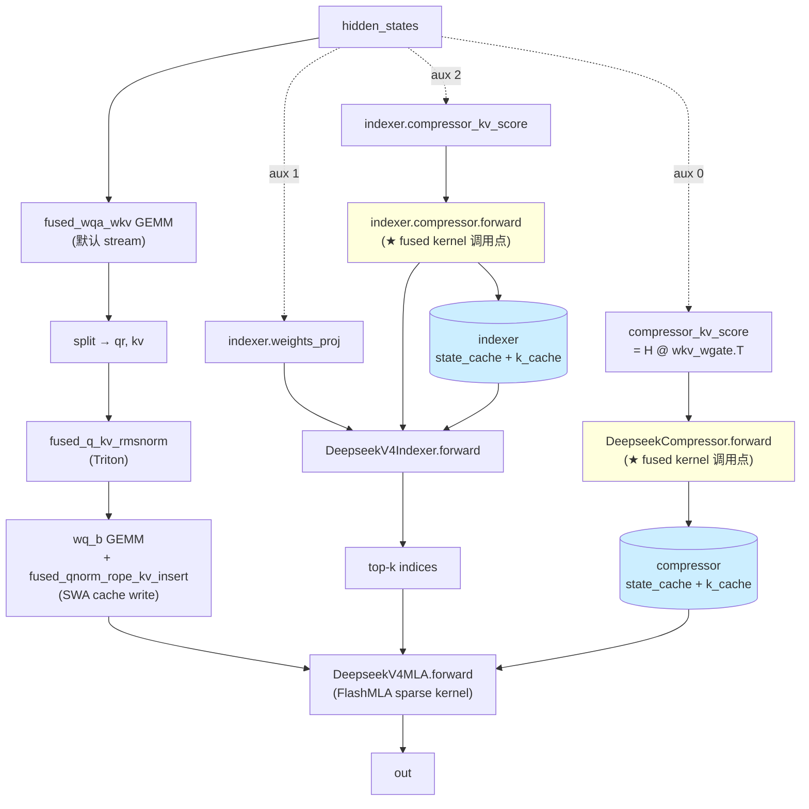
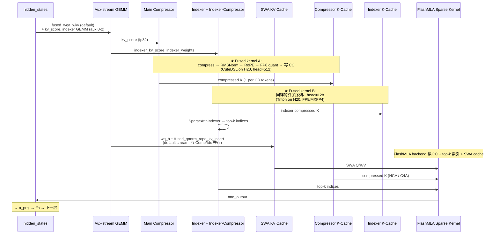

# DeepSeek V4 稀疏注意力压缩缓存：从架构理解到 Triton 融合实现

> **文档版本**: 1.2
> **分析对象**: tokenspeed `_deepseek_v4_fused_sparse_compress_cache_kernel`（[tokenspeed-kernel/python/tokenspeed_kernel/ops/attention/triton/deepseek_v4.py](../../tokenspeed/tokenspeed-kernel/python/tokenspeed_kernel/ops/attention/triton/deepseek_v4.py)）
> **vLLM 现状对位**: [vllm/models/deepseek_v4/common/ops/fused_compress_quant_cache.py](../../vllm/vllm/models/deepseek_v4/common/ops/fused_compress_quant_cache.py)（Triton 实现）+ [vllm/models/deepseek_v4/nvidia/ops/sparse_attn_compress_cutedsl.py](../../vllm/vllm/models/deepseek_v4/nvidia/ops/sparse_attn_compress_cutedsl.py)（CuteDSL 实现）
> **目标硬件**: NVIDIA H20（Hopper, sm_90），可外推到其他 Hopper 卡
> **相关 PR**: 类似风格的算子融合参考 [vllm#44176](https://github.com/vllm-project/vllm/pull/44176)（`fuse qk rmsnorm rope gate for qwen3.5`）
> **最后更新**: 2026-06-03

---

## 文档概述

这篇文档**不假设读者懂 DeepSeek V4、Triton 或算子融合**。它从背景知识讲起，把 DSv4 的整体模型结构梳理清楚，然后定位 tokenspeed 那个 fused kernel 在模型里"落在哪一行"，最后讨论在 Hopper / vLLM 上怎么动手。

**目标读者**: 用过 vLLM、写过 PyTorch、但没碰过 CUDA / Triton；对 DSv4 sparse attention 只听过名字。看完之后能：

1. 解释 DSv4 sparse attention 的整体结构、每一层的 compressor / indexer / 主 MLA 怎么咬合；
2. 看懂一个 Triton kernel 在干什么、为什么这种结构能比 PyTorch 快；
3. 知道 tokenspeed 的 fused kernel 在 vLLM 里**已经有对应实现**、它分别落在哪些类的 forward 里；
4. 评估一个 fusion 候选的可行性、写出在 vLLM 上调整 / 替换的步骤。

> **重要 spoiler**：调研后发现 vLLM 本仓库**已经实现了这个 fusion**——`_fused_kv_compress_norm_rope_insert_*` 三个 Triton kernel + 一个 CuteDSL 版本。所以本文档第六部分已经从"如何移植"调整为"如何评估 / 优化已有实现"。如果你只是想理解 fusion 在哪里跑、为什么这么跑，看完第二部分就够了。

**阅读指南**:

| 部分 | 内容 | 重点 |
|------|------|------|
| 第一部分 | 必备背景 | 算子融合的物理意义、Triton 30 秒入门、DSv4 sparse attention 简介 |
| **第二部分** | **DSv4 整体架构与融合算子的位置** | **V4-Pro / V4-Flash 模型关系、模块层次、每层 compress_ratio 的差异、fused kernel 在哪个 forward 里被调用** |
| 第三部分 | 这个 kernel 在干什么 | 输入/输出、算法步骤、cache 布局 |
| 第四部分 | 为什么要融合 | unfused 路径的成本、fusion 的物理收益 |
| 第五部分 | kernel 逐段剖析 | 把 ~150 行 Triton 拆开讲 |
| 第六部分 | Hopper 兼容性 | 为什么这个 kernel 不依赖 Blackwell；vLLM 已有的 CuteDSL 与 Triton 双实现的对位 |
| 第七部分 | 在 vLLM 上动手 | 既然已有实现，怎么 audit / 调整 / 评估 |
| 第八部分 | QA | 常见反直觉点 |

---

# 第一部分: 必备背景

## 1.1 算子融合（kernel fusion）是什么、为什么有用

GPU 上做计算有两个常被忽视的成本：

| 成本 | 来源 |
|------|------|
| **kernel launch overhead** | host (CPU) 提交一个 GPU kernel 大约要 5-30 微秒（取决于驱动版本、流的状态）。小 kernel 多了，host 端会排队 |
| **HBM 往返** | GPU 上 SM 只能读写 register / shared memory。任何"中间张量"如果落到全局显存（HBM），就要付一次写 + 一次读 = 两次 HBM 带宽 |

当一个序列里有几个"算力很轻、数据很重"的小 op（比如 elementwise mul、norm、cast）时，**实际上是带宽和 launch 在限速**，算力空转。

**算子融合的核心动机**：把一连串的小 op 编译进**一个 GPU kernel**，让中间张量**只活在寄存器里**（永不落 HBM），并且把 N 次 launch 合并成 1 次。代价是：

1. 写起来比 PyTorch 麻烦（要写 Triton / CUDA）
2. 调试比 PyTorch 难（看不到中间张量）
3. 不通用——融合的 op 序列必须固定

**一个最小例子**：`y = (x * w).relu()`。

不融合：
```text
PyTorch:  tmp = x * w       ← 一次 launch + 写中间张量到 HBM
          y = tmp.relu()    ← 第二次 launch + 读 tmp + 写 y
                              共 2 次 launch + 3 次 HBM 全访问（读 x、写 tmp、读 tmp、写 y）
```

融合：
```text
Triton:   y_i = max(x_i * w_i, 0)   ← 一次 launch, x_i 进 register, 出 y_i 写一次
                                     共 1 次 launch + 2 次 HBM 全访问（读 x、写 y）
```

省了 50% 带宽 + 一次 launch。

vLLM 里**典型的 fusion target** 都长这样：一连串 norm / cast / RoPE / scale 这种小 op，中间张量没人读，可以全程在 register 里活下来。PR #44176 把 `split + QK-RMSNorm + partial RoPE + gate copy` 四个 op 压成一个 kernel 就是这个套路。

## 1.2 Triton 30 秒入门

Triton 是 OpenAI 出的 Python embedded DSL，写出来像 NumPy 但编译到 GPU。和 CUDA 比，Triton 不需要管 thread / warp / shared memory 的层级，只关注**"一个 program 处理一块数据"**这个抽象。

最小例子（vector add）：

```python
@triton.jit
def add_kernel(x_ptr, y_ptr, out_ptr, n_elements, BLOCK: tl.constexpr):
    pid = tl.program_id(0)                # 当前 program 的 id（一维 grid）
    offsets = pid * BLOCK + tl.arange(0, BLOCK)
    mask = offsets < n_elements
    x = tl.load(x_ptr + offsets, mask=mask)   # 从 HBM 读到 register
    y = tl.load(y_ptr + offsets, mask=mask)
    tl.store(out_ptr + offsets, x + y, mask=mask)  # register 写回 HBM

def add(x, y):
    out = torch.empty_like(x)
    n = x.numel()
    BLOCK = 1024
    grid = (triton.cdiv(n, BLOCK),)        # 多少个 program
    add_kernel[grid](x, y, out, n, BLOCK=BLOCK)
    return out
```

要记的概念：

| 概念 | 意思 |
|------|------|
| **kernel** | 加了 `@triton.jit` 装饰器的 Python 函数。一个 kernel 在 GPU 上以"很多个 program"的形式并行运行 |
| **program / pid** | 一个 program 是一个执行实例。`tl.program_id(axis)` 返回当前 program 在 grid 某个维度上的坐标 |
| **grid** | 启动 kernel 时传给 `kernel[grid](...)`，决定 program 总数。可以是 1D / 2D / 3D |
| **`tl.constexpr`** | 编译期常量。Triton 会针对每个具体值生成一份特化代码——所以**改一个 constexpr 会重新编译** |
| **`tl.load` / `tl.store`** | HBM ↔ register 的搬运。带 mask 处理边界 |
| **`tl.arange`、`tl.sum`、`tl.softmax` 等** | 在一个 program 内部、对一块向量做并行运算。**Triton 替你管 thread/warp 怎么分** |

读 Triton 代码的关键问句：

1. 一个 program 负责什么粒度的数据？（"一个 token？一个 head？一行？"）
2. 哪些是 `constexpr`，会被特化？（这些通常是 head_dim、block_size 这种小整数）
3. `tl.load` / `tl.store` 在做什么数据流动？（这是性能的关键）

会这些就能开始读 vLLM / tokenspeed 里所有 Triton kernel。

## 1.3 DeepSeek V4 sparse attention 简介

DeepSeek V3.2（仓库内有时也叫 V4 / V32）的核心架构创新之一是**稀疏注意力（sparse attention）**：长上下文下，普通 dense attention 的复杂度是 O(N²)（每个 query 要看所有 N 个 K），DSv4 用一个**两段式 sparse 结构**把它压到 O(N) + 一次 top-k 选择：

```text
Phase 1 (Indexer):   Q -- 对一个"压缩过的、小很多的 K 表示"做完整 attention
                          得到每个 query 的 top-k token 候选
Phase 2 (Main attn): Q -- 只对 top-k 选中的 token 做完整 attention
```

关键的"压缩过的 K 表示"是怎么来的：**每 N 个 token 压成一个 representative**。具体方式不是简单平均，而是**用 attention 的方式**——每 N 个 token 各自带一个 "score"，softmax 一下当权重，加权和得到一个压缩 token。这个 score 来自一个独立的小 head，和主 attention 解耦。

DSv4 里有两个 compress ratio：

| 模式 | 缩写 | compress_ratio | 用途 |
|------|------|----------------|------|
| Hierarchical / Coarse | **HCA** | 128 | 把 128 token 压成 1 个，给最外层的"找候选区域"用 |
| Compressed Sparse | **CSA** | 4 | 在更细粒度上再压一次 |

> 名字在不同文献里有点出入，但 tokenspeed 源码里就这两个 wrapper：[`deepseek_v4_hca_compress_kv_cache_insert`](../../tokenspeed/python/tokenspeed/runtime/layers/attention/deepseek_v4_ops.py)（compress_ratio=128）和 [`deepseek_v4_csa_compress_kv_cache_insert`](../../tokenspeed/python/tokenspeed/runtime/layers/attention/deepseek_v4_ops.py)（compress_ratio=4，overlap=True）。两者**调用同一个底层 Triton kernel**，只是参数不同。

**压缩后的"K-cache"长什么样**：DSv4 的稀疏 K-cache 一个 slot 存的是：

```text
[ FP8 (e4m3) 量化的 NOPE 部分 | bf16 的 RoPE 部分 | 量化用的 scales (ue8m0) ]
```

其中：

- **NOPE**: head_dim 中"不参与 RoPE"的那一部分，可以丢精度做 FP8 量化（节省 KV cache 体积）
- **RoPE**: head_dim 中"参与 RoPE 旋转"的那一部分，留 bf16（精度敏感）
- **scales**: 每 128 个 FP8 元素共享一个 scale，编码成 ue8m0 格式（uint8 表示一个 2 的幂）

下游消费者是 `fp8_paged_mqa_logits`（DeepGEMM 提供的 FP8 paged MQA 内核）。

**所以"压缩 K-cache"和"主 KV cache"是两条独立的存储路径**——主 KV cache 是 dense 全量的；压缩 K-cache 只在 sparse attention 的 indexer 阶段用，每 N 个 token 才有一个 slot。

---

# 第二部分: DSv4 整体架构与融合算子的位置

> 这一部分回答两个关键问题：
> 1. **DSv4 一次 forward 是怎么走的，它和 V2/V3 有什么不同？**
> 2. **tokenspeed 的这个 fused kernel 落在模型哪一层、哪一个调用点？[DeepSeek-V4-Flash](https://huggingface.co/deepseek-ai/DeepSeek-V4-Flash) 这个模型跑起来一定会经过它吗？**

## 2.1 V4 系列模型与 V4-Flash 的关系

DeepSeek 在 V4 这一代有**两个公开 release**（都在 `deepseek-ai` 这个 HF 组织下）：

| 模型 | 总参数 / 激活 | 精度 | 上下文 | 定位 |
|------|---------------|------|--------|------|
| [DeepSeek-V4-Pro](https://huggingface.co/deepseek-ai/DeepSeek-V4) | 1.6T / 49B | FP8 | 1M | 旗舰，最大能力 |
| [DeepSeek-V4-Flash](https://huggingface.co/deepseek-ai/DeepSeek-V4-Flash) | 284B / 13B | **FP4（MoE expert）+ FP8（其余）** | 1M | 快/小，仍 1M context |

"Flash" 是**模型变体名**——指 V4 家族里那个**激活参数更小、推理更快、MoE expert 用 FP4 存储**的版本。和它对应的 V4-Pro 是旗舰大模型。**"Flash" 不是 attention backend，也不和 FlashMLA / FlashAttention 同源**。

两者**架构相同**，都属于 V4：
- **Hybrid 注意力**：Compressed Sparse Attention (CSA，对应 `compress_ratio = 4`) + Heavily Compressed Attention (HCA，对应 `compress_ratio = 128`)
- **Manifold-Constrained Hyper-Connections (mHC)**：层间残差连接增强（vLLM 代码里就是 `hc_attn_fn` / `hc_ffn_fn` 那些参数）
- **MoE**：V4-Pro / V4-Flash 都是 MoE，只是 expert 数与稀疏度不同

差别基本上是**规模 + MoE expert 精度**：

| 维度 | V4-Pro | V4-Flash |
|------|--------|----------|
| MoE expert 精度 | FP8 | FP4（MXFP4 / NVFP4 之类）|
| 总激活 | 49B/token | 13B/token |
| Attention 结构 | 同样的 CSA + HCA | **同样的 CSA + HCA** |
| compressor 走的代码路径 | 同 | **同** |

> 也就是说：**V4-Flash 走的是和 V4-Pro 完全相同的 compressor 路径**——本文档之后讨论的"fused kernel 落点"、"FP8 K-cache 布局"、"每层 compress_ratio 决定走哪条分支"对 V4-Flash 一字不差适用。

唯一区别在 MoE FFN 那段：V4-Flash 的 expert weights 是 FP4 存储，FFN matmul 走 `Mxfp4MoeBackend.MARLIN`（或同档 Triton/CUTLASS path）——这和 compressor 没关系，**compressor 处理的是 attention 的 K/score，输入仍然是 bf16 → fp32 中间表示，输出 FP8 cache**。

## 2.1.1 V4-Flash 在 vLLM 上落到哪个类

[`vllm/model_executor/models/registry.py:101`](vllm/model_executor/models/registry.py#L101) 注册：

```python
"DeepseekV4ForCausalLM": ("vllm.models.deepseek_v4", "DeepseekV4ForCausalLM"),
```

HuggingFace config 里 `architectures` 字段是 `DeepseekV4ForCausalLM`，对 V4-Pro / V4-Flash 都成立——它们共用同一个 vLLM 类。区分两者的是 weights 文件、`compress_ratios` 列表、和 `quantization_config`（V4-Flash 会标 MoE expert 是 mxfp4 / nvfp4）。

如果想确认 V4-Flash 配置长什么样：

```python
from transformers import AutoConfig
cfg = AutoConfig.from_pretrained("deepseek-ai/DeepSeek-V4-Flash", trust_remote_code=True)
print(len(cfg.compress_ratios), cfg.compress_ratios[:10])
print(cfg.quantization_config)
```

`compress_ratios` 的具体取值决定**哪些层走 SWA-only / HCA / CSA**——见 2.3 节。

## 2.1.2 那 vLLM 里那个 `DeepseekV4FlashMLASparseBackend` 是什么

无关。[flashmla.py:79](vllm/models/deepseek_v4/nvidia/flashmla.py#L79) 的 `DeepseekV4FlashMLASparseBackend` 是**DSv4 用 [FlashMLA](https://github.com/deepseek-ai/FlashMLA) kernel 跑稀疏 attention 的 backend**——FlashMLA 是 DeepSeek 出的 MLA attention kernel library（不是模型）。它的命名里有 "Flash" 是因为引用了 FlashMLA，**和 V4-Flash 模型同名巧合，没有直接关系**。

两者在系统里的角色：

| 名字 | 是什么 | 关系 |
|------|--------|------|
| **DeepSeek-V4-Flash** | HF 上的 284B/13B 模型 | 用什么 backend 跑 V4-Flash 是部署选择 |
| **`DeepseekV4FlashMLASparseBackend`** | vLLM 里的 attention backend，调 FlashMLA kernel | V4-Pro 和 V4-Flash 在 Hopper/Blackwell 上默认都用这个 backend |

所以你看到 V4-Flash + FlashMLA backend 同时出现是正常组合，但**两个 "Flash" 不是同一个东西**。

## 2.1.3 V4-Flash 跑到融合 kernel 的条件

回到主问题——V4-Flash 一次 forward 会不会走到 `_fused_kv_compress_norm_rope_insert_*` 那串 kernel？

**会，而且每层 attention 都会**，只要 `compress_ratios[layer_id] > 1`。具体怎么走在第 2.3 节有完整表格。简短回答：

| 层类型 | 主 compressor | indexer compressor |
|--------|--------------|---------------------|
| SWA-only (CR=1) | ❌ 不走 | ❌ 不走 |
| HCA (CR=128) | ✅ 走 head=512 CuteDSL（NVIDIA） | ❌ 不走 |
| CSA (CR=4) | ✅ 走 head=512 CuteDSL（NVIDIA） | ✅ 走 head=128 Triton（FP8 或 MXFP4） |

V4-Flash 的 `compress_ratios` 配置混合了三种层（典型分布：少量 SWA-only 在头尾，中间大段 HCA，再夹一些 CSA），所以**每跑一次 forward，主 compressor 调用几十次、indexer compressor 调用十几次**，每次都是这个 fused kernel。

## 2.2 模型整体结构

DSv4 的代码住在一个独立的 package：

```text
vllm/models/deepseek_v4/
├── __init__.py                  # 平台分发：NVIDIA 路径 / AMD 路径
├── quant_config.py              # FP8 量化配置
├── attention.py                 # Attention 公共类：MLA、Indexer、SWA cache
├── compressor.py                # ★ Compressor 类（本文档主角）
├── common/                      # 跨平台共享 op
│   ├── rope.py
│   └── ops/                     # ★ 融合 kernel 大本营
│       ├── save_partial_states.py
│       ├── fused_compress_quant_cache.py   # ★ 三个 Triton kernel
│       ├── fused_qk_rmsnorm.py
│       ├── fused_indexer_q.py
│       ├── fused_inv_rope_fp8_quant.py
│       └── fused_mtp_input_rmsnorm.py
├── nvidia/                      # NVIDIA 专属
│   ├── model.py                 # 主模型组装（Decoder、ForCausalLM）
│   ├── flashmla.py              # FlashMLA backend 适配
│   ├── mtp.py                   # MTP draft 模型
│   └── ops/
│       ├── sparse_attn_compress_cutedsl.py # ★ CuteDSL 版本的同一个 fusion
│       ├── fused_indexer_q_cutedsl.py
│       └── ...
└── amd/                         # ROCm 镜像（不少 op 共享）
    ├── model.py
    └── ...
```

注意：DSv4 走的是 `vllm/models/`，而不是 V2/V3 时代的 `vllm/model_executor/models/`。这是 vLLM **新的模型组织约定**（独立 package，可以独自管理依赖与平台分发）。Registry 在 [model_executor/models/registry.py:101](vllm/model_executor/models/registry.py#L101) 上把 `DeepseekV4ForCausalLM` 重定向到 `vllm.models.deepseek_v4`。

## 2.3 一层 DSv4 在做什么——三种"分组"

DSv4 的每个 transformer 层（[DeepseekV4DecoderLayer](vllm/models/deepseek_v4/nvidia/model.py#L770)）包含：

```text
DeepseekV4DecoderLayer
├── attn_norm (RMSNorm)
├── attn = DeepseekV4Attention   ← 看下面分组
├── ffn_norm (RMSNorm)
├── ffn = DeepseekV4MoE          ← MoE，含 MegaMoE experts + shared experts
└── HC head connector 参数（hc_attn_fn, hc_ffn_fn, ...）
```

**关键不变量**：DSv4 每一层的 `attn` 由配置 `compress_ratios[layer_id]` 决定具体形态：

| `compress_ratio` 取值 | 该层 attention 长什么样 | 用途 |
|----------------------|------------------------|------|
| **`1`** | 只有 SWA-only MLA（sliding window attention，没有 compressor） | "局部 attention"层，处理短程依赖；compressor 不创建 |
| **`128`**（HCA）| MLA + 主 compressor (head=512, CR=128) | "粗粒度 token 池化"层，把 128 token 压成 1 个 |
| **`4`**（C4A，最稠密 sparse 配置）| MLA + 主 compressor (head=512, CR=4) + **Lightning Indexer**（含自带 compressor head=128, CR=4） | "稀疏选择"层：先压缩 K-cache，再用 indexer 选 top-k |

[`config.compress_ratios`](vllm/models/deepseek_v4/nvidia/model.py#L642-L645) 是一个 length=num_hidden_layers 的列表，每层一个值。这就是 DSv4 实现 sparse attention 的核心机制——**不同层走不同稀疏度**：

```python
# vllm/models/deepseek_v4/nvidia/model.py:642
if layer_id < config.num_hidden_layers:
    self.compress_ratio = max(1, config.compress_ratios[layer_id])
else:
    self.compress_ratio = 1   # MTP draft 层不参与压缩
```

这种 per-layer 配置类似 hybrid 模型（如 Hunyuan-A13B、Qwen3-Next）的"attn / Mamba 分层"思想，只不过 DSv4 是"哪几层做 sparse、稀疏度多少"。

## 2.4 一次 attention forward 的完整数据流

下面这张图把 `DeepseekV4Attention.attention_impl` 的 forward 拆开。**关键是右侧 Compressor 那条支路**——这就是融合 kernel 的落点。



要点：

1. **三个 stream 并行**：DSv4 用 CUDA aux stream（[attention.py:307-361](vllm/models/deepseek_v4/attention.py#L307-L361)）把"GEMM 主路径"和"compressor / indexer 的 GEMM"并行。这是 DSv4 在 Hopper 上提性能的关键，因为 attention 的几个 input GEMM 各自独立。
2. **两个 compressor 实例**：主 compressor（head=512）服务 MLA；如果该层有 indexer (CR=4)，indexer 内部还有第二个 compressor（head=128）服务 indexer 自己的稀疏选择。它们**共用 `DeepseekCompressor` 类，head_dim 不同而已**。
3. **fused kernel 的两个 hot 调用点**：
   - 主 compressor → `compress_norm_rope_store_{cutedsl|triton}(head_dim=512, ...)`
   - indexer compressor → `compress_norm_rope_store_triton(head_dim=128, ...)`
   - 都最终落到 `vllm/models/deepseek_v4/common/ops/fused_compress_quant_cache.py` 里的三个 Triton kernel 之一（或对应 CuteDSL 版本）。

## 2.5 fused kernel 在源码里的精确位置

把"调用链"画一下：

```text
DeepseekV4DecoderLayer.forward (model.py)
  └─ DeepseekV4Attention.forward (model.py:611)
      └─ DeepseekV4Attention.attention_impl (attention.py:365)
          └─ attn_gemm_parallel_execute  ← 并行计算 kv_score 等
              └─ aux_fns[0] = compressor_kv_score()       # 主 compressor 的 GEMM
              └─ aux_fns[2] = indexer_compressor_kv_score()# indexer compressor 的 GEMM
          └─ execute_in_parallel:
              ├─ default stream: wq_b + fused_qnorm_rope_kv_insert (主 KV 写入 SWA cache)
              ├─ aux stream 0:   indexer(...) ─────────┐
              │                                       └─ DeepseekV4Indexer.forward (attention.py:782)
              │                                          └─ indexer.compressor(...)  ★
              │                                              ↓
              │                                          DeepseekCompressor.forward (compressor.py:270)
              │                                              ↓
              │                                          compress_norm_rope_store_triton (★ head=128)
              │                                              ↓
              │                                          _fused_kv_compress_norm_rope_insert_indexer_attn
              │                                          或 _fused_kv_compress_norm_rope_insert_indexer_mxfp4_attn
              │                                          (fused_compress_quant_cache.py)
              │
              └─ aux stream 1:   self.compressor(...)   ★
                                  ↓
                                  DeepseekCompressor.forward (compressor.py:270)
                                      ↓
                                  if NVIDIA + head_dim=512:
                                      compress_norm_rope_store_cutedsl
                                          ↓
                                      (sparse_attn_compress_cutedsl.py)
                                  else:  # AMD 或 head_dim=128
                                      compress_norm_rope_store_triton
                                          ↓
                                      _fused_kv_compress_norm_rope_insert_sparse_attn
                                      (fused_compress_quant_cache.py)
```

> **回答用户的问题**：DSv4（包括 V4-Flash 和 V4-Pro）**一定会跑到这个 fused kernel**——只要那一层的 `compress_ratio > 1`。具体跑哪一个版本：
>
> - 主 MLA 路径上每一层 `compress_ratio in {4, 128}`：H20 上跑 **CuteDSL** 版本（head=512）
> - Indexer 路径上每一层 `compress_ratio == 4`：H20 上跑 **Triton** 版本（head=128, FP8 cache）
> - 如果开了 `VLLM_USE_FP4_INDEXER_CACHE=1` 且在 Blackwell 上：indexer compressor 跑 **MXFP4 Triton** 版本

## 2.6 DeepseekCompressor 的实例化点：每层有几个

| 层类型 | `compress_ratio` | 主 compressor 实例 | Indexer compressor 实例 | fused kernel launch / step |
|--------|------------------|-------------------|-------------------------|-----------------------------|
| SWA-only | 1 | ❌ 不创建 | ❌ 不创建 | 0 |
| HCA layer | 128 | ✅ head=512 | ❌ 不创建 | 1（主路径，CuteDSL）|
| C4A layer | 4 | ✅ head=512 | ✅ head=128 | 2（主路径 CuteDSL + indexer Triton）|

实例化在两个位置：

```python
# vllm/models/deepseek_v4/attention.py:229-239 (主 compressor)
self.compressor = None
if self.compress_ratio > 1:
    self.compressor = DeepseekCompressor(
        vllm_config=vllm_config,
        compress_ratio=self.compress_ratio,
        hidden_size=self.hidden_size,
        head_dim=self.head_dim,           # 512
        ...
    )

# vllm/models/deepseek_v4/attention.py:741-750 (indexer 的 compressor)
self.compressor = DeepseekCompressor(
    vllm_config=vllm_config,
    compress_ratio=self.compress_ratio,
    hidden_size=hidden_size,
    head_dim=self.head_dim,               # 128
    use_fp4_cache=self.use_fp4_kv,
    ...
)
```

两个实例的**类完全相同**，参数化区分行为；这是为什么"研究一个 kernel 等于理解两个调用点"。

## 2.7 DSv4 sparse path 在 forward 时序里的位置

把一层 `compress_ratio == 4` (C4A) 的完整 forward 摆出来，标记几个关键步骤：



时序上看："compressor 写 K-cache" 是 attention 的**前置步骤**，必须在 FlashMLA 真正算 attention 之前完成。aux stream 设计的目的是把它和默认 stream 的 GEMM/写 SWA cache 并行起来。

**fusion 的物理意义**就在这里：`Compressor` 这一段如果 unfused，它在 aux stream 上的 8-10 次 launch + HBM 往返**很可能成为 attention 的关键路径**——主 default stream 的 GEMM 都跑完了，default stream 在等 aux stream 写完 compressed K-cache。fusion 之后这段时间塌缩成 1 次 launch + 1 次 HBM 写入，给主路径"让路"。

---

# 第三部分: 这个 kernel 在干什么

## 3.1 输入 / 输出概览

`_deepseek_v4_fused_sparse_compress_cache_kernel` 的签名（简化）：

```python
@triton.jit
def _deepseek_v4_fused_sparse_compress_cache_kernel(
    # ─── 输入：未压缩的中间状态 ───
    state_cache_ptr,             # [num_state_blocks, state_block_size, 2*head_dim]
    state_cache_stride0,
    state_cache_stride1,

    # ─── 调度元数据 ───
    token_to_req_indices_ptr,    # [num_actual]  每个 token 属于哪个 request
    positions_ptr,               # [num_actual]  每个 token 的绝对位置
    slot_mapping_ptr,            # [num_actual]  这次要写到 state_cache 里哪个 slot
    block_table_ptr,             # [num_reqs, block_table_width]  request → state_cache blocks
    block_table_base_offsets_ptr,
    block_table_stride,
    block_table_width: tl.constexpr,
    state_block_size,            # 一个 state_cache block 装多少 token

    # ─── 算子参数 ───
    rms_norm_weight_ptr,         # [head_dim]
    rms_norm_eps,
    cos_sin_cache_ptr,           # [max_pos, rope_head_dim]
    cos_sin_stride,

    # ─── 输出：压缩后的 K-cache ───
    k_cache_ptr,                 # [num_kv_blocks, ...] 的 uint8 buffer
    kv_slot_mapping_ptr,         # [num_actual]  写到 k_cache 哪个 slot
    kv_cache_block_size,

    # ─── 编译期常量 ───
    HEAD_SIZE: tl.constexpr,        # 一个 head 总 dim
    TRITON_BLOCK_SIZE: tl.constexpr,  # 等于 HEAD_SIZE，便于 reshape
    STATE_WIDTH: tl.constexpr,      # state_cache 第三维的一半（kv 和 score 各占一半）
    COMPRESS_RATIO: tl.constexpr,   # 4 (CSA) 或 128 (HCA)
    OVERLAP: tl.constexpr,          # CSA 用 True，窗口大小翻倍
    ROPE_HEAD_DIM: tl.constexpr,    # head_dim 中参与 RoPE 的部分
    FP8_MAX: tl.constexpr,          # FP8 e4m3 = 448
    QUANT_BLOCK: tl.constexpr,      # 每多少元素一个 FP8 scale（一般 128）
    TOKEN_STRIDE: tl.constexpr,     # 一个 cache token 占多少 uint8
    SCALE_DIM: tl.constexpr,        # scale 区占多少 uint8
    KV_BLOCK_STRIDE: tl.constexpr,  # 一个 k_cache block 多少 uint8
):
```

**一句话**：把 `state_cache` 上一段窗口的若干 token 压成一个，做 RMSNorm + RoPE + FP8 量化，写到 `k_cache`。

## 3.2 算法步骤拆解

一个 program 处理一个 token。对每个 token 做：

```text
┌─────────────────────────────────────────────────────────────┐
│ Step 1. 早退检查                                              │
│   - 这个 token 的 state slot 有效吗？(slot >= 0)              │
│   - 这个 position 是不是 compress 触发点？(pos+1 % CR == 0)   │
│   - kv_slot 有效吗？(kv_slot >= 0)                            │
│   ↓ 任一不满足 → return                                       │
└─────────────────────────────────────────────────────────────┘
┌─────────────────────────────────────────────────────────────┐
│ Step 2. 收集窗口                                              │
│   window = (1 + OVERLAP) * COMPRESS_RATIO                    │
│   pos 后退 window-1 个 token，凑齐 window 个 (kv, score)      │
│   通过 block_table 间接寻址 state_cache 取出来                 │
│   形状: [window, head_dim] 的 kv，[window, head_dim] 的 score │
└─────────────────────────────────────────────────────────────┘
┌─────────────────────────────────────────────────────────────┐
│ Step 3. softmax-weighted compress                            │
│   score = softmax(score, dim=window)    # window 维归一化     │
│   compressed = sum(kv * score, axis=window)                  │
│   形状: [head_dim]                                            │
└─────────────────────────────────────────────────────────────┘
┌─────────────────────────────────────────────────────────────┐
│ Step 4. RMSNorm                                              │
│   variance = mean(compressed^2)                              │
│   normed = compressed * rsqrt(variance + eps) * rms_w        │
└─────────────────────────────────────────────────────────────┘
┌─────────────────────────────────────────────────────────────┐
│ Step 5. NOPE 段 → FP8 e4m3 量化 + 写 k_cache                  │
│   - reshape 成 [N_QUANT_BLOCKS, QUANT_BLOCK]                 │
│   - 每行算 abs max → ceil(log2) → 2 的幂 scale                │
│   - x_scaled = normed / scale,  clamp,  cast to fp8e4nv      │
│   - 写 FP8 数据 + ue8m0 编码的 scale 到 k_cache               │
└─────────────────────────────────────────────────────────────┘
┌─────────────────────────────────────────────────────────────┐
│ Step 6. RoPE 段 → partial RoPE + 写 k_cache (bf16)            │
│   - 把 normed 的 [NOPE_HEAD_DIM:] 部分拿出来                  │
│   - 按 NeoX 风格做 cos/sin 旋转（compressed_pos 算 cos_sin）   │
│   - 写 bf16 到 k_cache                                        │
└─────────────────────────────────────────────────────────────┘
```

整段做完，一次 launch、一个 token、一次窗口 HBM 读 + 一次 cache HBM 写。

## 3.3 数学：softmax-weighted compress 是什么

把 step 3 写清楚：

```text
输入: kv ∈ R^[W, D], score ∈ R^[W, D],  W = window size, D = head_dim

w_d  = softmax(score[:, d])           # 第 d 维独立 softmax (over W)
y_d  = sum_w (kv[w, d] * w_d[w])      # 加权和

输出: y ∈ R^[D]
```

> 注意 softmax 是**沿 window 维归一化**，每个 head_dim 维度独立。这等价于"每一维用自己的 attention weights 把 window 内的 W 个 token 合成 1 个"。

物理意义：每个 token 在压缩前有一个独立的"评分向量"，告诉系统"在每一维上，window 内哪个 token 最重要"。和经典 attention pooling 的区别是 attention 是 query × key，这里 score **直接和 kv 同源**——本质是一个**学到的、每维独立的、局部时间池化**。

## 3.4 数据布局：cache slot 长什么样

一个 K-cache slot 的字节布局（按 tokenspeed kernel 内的偏移）：

```text
slot 起始 (uint8 ptr)
│
├── [0, NOPE_HEAD_DIM)         FP8 e4m3 量化的 NOPE 数据
│       (NOPE_HEAD_DIM 个 uint8，每个 byte 是一个 fp8 值)
│
├── [NOPE_HEAD_DIM, HEAD_SIZE) bf16 的 RoPE 数据
│       (ROPE_HEAD_DIM 个 bf16 = 2*ROPE_HEAD_DIM 个 uint8)
│       注意是用 .to(tl.pointer_type(tl.bfloat16)) 重新解释 ptr
│
└── 紧接着是 scale 区（位于同 block 内、所有 token 数据之后）
        [N_QUANT_BLOCKS 个 uint8 (ue8m0 编码的 exponent) + 1 个 padding uint8]
```

ue8m0 是什么：它是一种**只存 exponent、不存 mantissa** 的 8-bit 格式。一个 ue8m0 byte 表示 `2^(byte - 127)`，等价于把 FP8 scale 限制到 2 的整数次幂。这样 dequant 时只需要一次 bitshift 而不是浮点乘法。代码里：

```python
exponents = tl.ceil(tl.log2(block_absmax * INV_FP8_MAX))   # float exp
encoded   = clamp(exponents + 127, 0, 255).to(uint8)       # ue8m0 编码
```

下游 `fp8_paged_mqa_logits` 知道这种编码，会按 ue8m0 解出 scale 然后乘回去。

---

# 第四部分: 为什么要融合这一段

## 4.1 unfused 路径在做什么

如果把这段算子序列用 PyTorch 直接写，大致是：

```python
# 假设 state_cache, score_cache 已分开存，或者 score 是 state_cache 的后半
window_kv    = gather(state_cache, block_table, positions, COMPRESS_RATIO)  # ~1 launch
window_score = gather(score_cache, block_table, positions, COMPRESS_RATIO)  # ~1 launch
weights      = torch.softmax(window_score, dim=0)                            # 1 launch
compressed   = (window_kv * weights).sum(dim=0)                              # 2 launches (mul + sum)
normed       = F.rms_norm(compressed, ..., weight=rms_w, eps=eps)            # 1-2 launches
nope         = normed[..., :NOPE_HEAD_DIM]
rope_in      = normed[..., NOPE_HEAD_DIM:]
rope_out     = apply_rope(rope_in, positions // CR, cos_sin)                 # 1-2 launches
fp8, scales  = per_block_fp8_quant(nope, block=128, scale_fmt="ue8m0")        # 2 launches
ops.kv_cache_pack_and_insert(fp8, scales, rope_out, kv_slot, ...)             # 1 launch
```

加起来 **9-12 次 kernel launch**。中间张量 `window_kv` `window_score` `weights` `compressed` `normed` `nope` `rope_in` `rope_out` 全部要写 HBM 再读回来。

在 decode 阶段，一个 step 的 GPU 时间只有 10-20 ms 量级，**每个 launch overhead ~5-15 μs**——这 9-12 个 launch 加起来可能占 step 时间的 1-3%。HBM 往返则是另一笔成本。

## 4.2 融合后的物理变化

把上面那一串塞进一个 Triton kernel 后：

| 维度 | unfused | fused |
|------|---------|-------|
| kernel launch | 9-12 次 | **1 次** |
| state_cache HBM 读 | 多次（gather kv + gather score 各一次）| 1 次（用 mask 一起读） |
| k_cache HBM 写 | 多次（fp8 + scales + rope 分开写）| 1-2 次（共用同一段地址）|
| 中间张量 HBM 落盘 | `window_kv`、`weights`、`compressed`、`normed`、`rope_out` 全要落 | **零落盘**，全程 register |
| 内存峰值（中间张量）| O(num_actual × window × head_dim) × 多份 | O(window × head_dim) × 1（每 program 内 register）|

收益最大的部分**不是 launch 减少**而是**中间张量不落盘**——decode batch size 大时，那些中间张量轻松上 100MB 级，省掉就是省带宽。

## 4.3 收益估算

具体多大要 benchmark，但参考 PR #44176 的 `fused_qk_rmsnorm_rope_gate`：在 Qwen3.5-27B 上吞吐从 14.35 req/s → 14.65 req/s（**+2.1%**）、token rate +2.3%。

而 `fused_sparse_compress_cache` 的 unfused 路径比 #44176 那个**更长**（9-12 vs 4），HBM 流量更大，理论上收益更可观。但 DSv4 sparse attention 路径只在 compress trigger 点才走（每 `COMPRESS_RATIO` 个 token 触发一次），不是每个 token 都跑，所以**绝对时间占比比 #44176 小**。

经验上：HCA (CR=128) 路径下，1 个压缩点 / 128 token，受益小但稳定；CSA (CR=4) 路径下，1 个压缩点 / 4 token，受益明显。

---

# 第五部分: kernel 逐段剖析

把 tokenspeed 的 [`_deepseek_v4_fused_sparse_compress_cache_kernel`](../../tokenspeed/tokenspeed-kernel/python/tokenspeed_kernel/ops/attention/triton/deepseek_v4.py) 一段一段读懂。

## 5.1 程序映射：一个 token → 一个 program

```python
_deepseek_v4_fused_sparse_compress_cache_kernel[(num_actual,)](...)
```

grid 是一维 `(num_actual,)`，**一个 program 处理一个 token**。每个 program 内部通过 `tl.arange(0, HEAD_SIZE)` 在 head_dim 维度上"向量化"——也就是说一个 program 一次处理 `head_dim` 个元素（通常 128 或 192），用一个 warp 或两个 warp 完成。

为什么不是 2D grid `(num_actual, num_heads)`？因为 DSv4 sparse compress cache 是 **MQA 风格**（一个 KV head 服务所有 Q head），num_kv_heads = 1，所以 head 维度 collapse 掉了。

## 5.2 早退分支

```python
token_idx = tl.program_id(0)

state_slot = tl.load(slot_mapping_ptr + token_idx)
if state_slot < 0:
    return                            # 这个 token 不该写 state_cache（被 mask）

position = tl.load(positions_ptr + token_idx)
if (position + 1) % COMPRESS_RATIO != 0:
    return                            # 没到 compress 触发点

kv_slot = tl.load(kv_slot_mapping_ptr + token_idx)
if kv_slot < 0:
    return                            # 这个 token 不该写 k_cache（被 mask）
```

这三个早退覆盖了：

- **CUDA graph padding**：固定 batch size 的 padding token 拿到 -1，直接跳过；
- **非触发位置**：每 `COMPRESS_RATIO` 个 token 才需要压缩一次，其余跳过；
- **被驱逐 / preempted**：调度器把这个 token 标记为 invalid。

> 一个 Triton 习惯：把所有早退放最前面，分支 divergence 损失最小。

## 5.3 窗口收集（block_table indirection）

```python
window: tl.constexpr = (1 + OVERLAP) * COMPRESS_RATIO
start = position - window + 1
tokens = tl.arange(0, window)
pos    = start + tokens                    # window 个绝对位置
valid_pos = pos >= 0                       # 早期 token 没那么多 history

table_idx = pos // state_block_size - base_logical_page
valid_pos = valid_pos & (table_idx >= 0) & (table_idx < block_table_width)
block_numbers = tl.load(
    block_table_ptr + req_idx * block_table_stride + table_idx,
    mask=valid_pos, other=-1,
).to(tl.int64)
pos_in_block = pos % state_block_size
```

**这一段在做"paged KV cache 的窗口收集"**：

- `state_cache` 是 paged（按 block 切分，类似主 KV cache），所以从绝对 position 到物理地址要走 `block_table[req][logical_block]`；
- 一次窗口跨越 `window` 个 token，可能横跨几个物理 block，**通过 `tl.arange` 向量化处理**——这是 Triton 比 CUDA 优雅的地方，你不用手写一个循环；
- `valid_pos` mask 处理边界（早期 token 不够 window 长、block_table 越界）。

OVERLAP=True 时 window 翻倍。CSA (CR=4, OVERLAP=True) 的窗口是 8 个 token；HCA (CR=128, OVERLAP=False) 的窗口是 128 个。

```python
head_offset = (tokens >= COMPRESS_RATIO).to(tl.int32) * HEAD_SIZE  # OVERLAP=True 用

block = tl.arange(0, TRITON_BLOCK_SIZE)
mask = block < HEAD_SIZE
row_base = (
    state_cache_ptr
    + block_numbers[:, None] * state_cache_stride0
    + pos_in_block[:, None] * state_cache_stride1
    + head_offset[:, None]
)
combined_mask = valid_pos[:, None] & (block_numbers[:, None] >= 0) & mask[None, :]
```

`row_base` 是个 `[window, 1]` 的指针向量，每个元素指向窗口中一个 token 对应的 state_cache 行起始位置。`combined_mask` 是 `[window, head_dim]` 的二维 mask。

`head_offset` 这个细节：OVERLAP=True 时（CSA），state_cache 第三维的前半和后半分别给"较早 4 个 token"和"较新 4 个 token"用——这是 CSA 特定的 layout（state 第三维宽度是 2*head_dim）。HCA 用 OVERLAP=False，head_offset 恒为 0。

## 5.4 softmax-weighted compress

```python
score = tl.load(
    row_base + STATE_WIDTH + block[None, :],   # 取 state_cache 第三维的后半作 score
    mask=combined_mask, other=float("-inf"),
)
score = tl.softmax(score, dim=0)                # 沿 window 维归一化
kv = tl.load(row_base + block[None, :], mask=combined_mask, other=0.0)  # 第三维前半作 kv
compressed = tl.sum(kv * score, axis=0)         # [head_dim]
```

四行做完整个 softmax-weighted pool。注意：

1. `other=float("-inf")` 给 mask 外的 score 填 -inf，softmax 后自动为 0；
2. `score` 和 `kv` 加载同一行的不同段，HBM 上**两次连续读**，cache 友好；
3. `tl.softmax(..., dim=0)` 沿 window 维 reduce；`tl.sum(..., axis=0)` 同理。

## 5.5 RMSNorm + FP8 NOPE 量化

```python
rms_w = tl.load(rms_norm_weight_ptr + block, mask=mask, other=0.0)
variance = tl.sum(compressed * compressed, axis=0) / HEAD_SIZE
normed = compressed * tl.rsqrt(variance + rms_norm_eps) * rms_w
```

经典 RMSNorm，三行写完。

```python
NOPE_HEAD_DIM: tl.constexpr = HEAD_SIZE - ROPE_HEAD_DIM
N_QUANT_BLOCKS: tl.constexpr = TRITON_BLOCK_SIZE // QUANT_BLOCK
INV_FP8_MAX: tl.constexpr = 1.0 / FP8_MAX

quant_input = normed.to(tl.bfloat16).to(tl.float32)
quant_2d = tl.reshape(quant_input, (N_QUANT_BLOCKS, QUANT_BLOCK))
block_absmax = tl.max(tl.abs(quant_2d), axis=1)
block_absmax = tl.maximum(block_absmax, 1.0e-4)
exponents = tl.ceil(tl.log2(block_absmax * INV_FP8_MAX))
inv_scales = tl.exp2(-exponents)
x_scaled = quant_2d * tl.reshape(inv_scales, (N_QUANT_BLOCKS, 1))
x_fp8 = tl.clamp(x_scaled, -FP8_MAX, FP8_MAX).to(tl.float8e4nv)
x_uint8 = tl.reshape(x_fp8.to(tl.uint8, bitcast=True), (TRITON_BLOCK_SIZE,))
```

这段做**块级 FP8 量化**：

1. 先 round-trip 到 bf16 再到 fp32——保证和 unfused 路径"先写 bf16 中间再量化"的行为一致；
2. 按 `QUANT_BLOCK=128` 切成 `[N_QUANT_BLOCKS, 128]`；
3. 每块算 absmax → 算 `ceil(log2(absmax / FP8_MAX))` 得到一个 2 的幂的 inverse scale；
4. 乘 inv_scale → clamp 到 FP8 范围 → cast 到 `tl.float8e4nv`；
5. bit-cast 成 uint8 准备写出。

下面写出：

```python
tl.store(fp8_ptr + block, x_uint8, mask=block < NOPE_HEAD_DIM)

scale_idx = tl.arange(0, N_QUANT_BLOCKS)
encoded = tl.maximum(tl.minimum(exponents + 127.0, 255.0), 0.0)
tl.store(scale_ptr + scale_idx, encoded.to(tl.uint8), mask=scale_idx < N_NOPE_BLOCKS)
tl.store(scale_ptr + N_NOPE_BLOCKS, tl.zeros((), dtype=tl.uint8))   # padding
```

**只写 NOPE 段的前 `NOPE_HEAD_DIM` 个 byte**——RoPE 段被下一步覆盖。`scale_ptr` 紧接 NOPE 数据之后，按 `N_NOPE_BLOCKS` 个 uint8 排布 ue8m0 scale。

## 5.6 Partial RoPE

```python
NUM_PAIRS: tl.constexpr = TRITON_BLOCK_SIZE // 2
NOPE_PAIRS: tl.constexpr = NOPE_HEAD_DIM // 2

pair_2d = tl.reshape(normed, (NUM_PAIRS, 2))
even, odd = tl.split(pair_2d)            # [NUM_PAIRS], [NUM_PAIRS]
pair_idx = tl.arange(0, NUM_PAIRS)
rope_pair = pair_idx - NOPE_PAIRS
is_rope = rope_pair >= 0                 # 只对 [NOPE_PAIRS, NUM_PAIRS) 段做 RoPE
cs_idx = tl.maximum(rope_pair, 0)

compressed_pos = (position // COMPRESS_RATIO) * COMPRESS_RATIO
cs_base = cos_sin_cache_ptr + compressed_pos * cos_sin_stride
cos_v = tl.load(cs_base + cs_idx, mask=is_rope, other=1.0)
sin_v = tl.load(cs_base + HALF_ROPE + cs_idx, mask=is_rope, other=0.0)

new_even = even * cos_v - odd * sin_v
new_odd  = odd  * cos_v + even * sin_v
rotated = tl.interleave(new_even, new_odd)
```

几个关键点：

1. **NeoX 风格 RoPE**：head_dim 按 `(even, odd)` 配对，旋转矩阵 `[cos, -sin; sin, cos]` 作用在每对上；
2. **partial**：只对 `[NOPE_PAIRS, NUM_PAIRS)` 段做（即 head_dim 末尾 `ROPE_HEAD_DIM` 个元素），前 `NOPE_HEAD_DIM` 段保持 0 rotation（cos=1, sin=0）；
3. **`compressed_pos = (position // COMPRESS_RATIO) * COMPRESS_RATIO`**：压缩后的 token 用"窗口起点"做位置——这是 DSv4 的约定，让所有被压缩进同一 slot 的原始 token 共享一个 cos_sin；
4. **`tl.split` / `tl.interleave`**：Triton 提供的"reshape 友好" primitives，分离/交错 even/odd pair。

最后写出：

```python
rope_ptr = (fp8_ptr + NOPE_HEAD_DIM).to(tl.pointer_type(tl.bfloat16))
rope_local = block - NOPE_HEAD_DIM
tl.store(
    rope_ptr + rope_local,
    rotated.to(tl.bfloat16),
    mask=(block >= NOPE_HEAD_DIM) & mask,
)
```

注意 `(fp8_ptr + NOPE_HEAD_DIM).to(tl.pointer_type(tl.bfloat16))`——**指针类型转换**：原本是 uint8 指针，往后偏 `NOPE_HEAD_DIM` 字节，然后重新解释成 bf16 指针，开始写 bf16 数据。这是单 slot 内 FP8 + bf16 混排的关键技巧。

---

# 第六部分: Hopper 兼容性分析

## 6.1 Triton 实现：硬件要求逐项审查

| Triton 操作 | Hopper (sm_90) 状态 | 原因 |
|-------------|---------------------|------|
| `tl.load` / `tl.store` 一般加载存储 | ✅ | 任何架构都有 |
| 带 mask 的 vector load | ✅ | Triton 编译为 predicated LDG/STG |
| `tl.softmax`, `tl.sum`, `tl.max` (reduce) | ✅ | warp-level reduce，Hopper 支持 |
| `tl.rsqrt`, `tl.exp2`, `tl.log2` | ✅ | SFU 提供，所有近代 GPU 都有 |
| `tl.float8e4nv` 转换 | ✅ | Hopper sm_89/sm_90 原生 FP8 storage + cast |
| `tl.bfloat16` 转换 | ✅ | Ampere 起就有 |
| `tl.interleave`, `tl.split`, `tl.reshape` | ✅ | Triton 3.x portable |
| `tl.pointer_type(...)` 指针重解释 | ✅ | 编译期类型操作 |
| `tl.cast(..., bitcast=True)` | ✅ | reinterpret_cast，硬件无关 |
| `tl.zeros`, `tl.full`, `tl.arange` | ✅ | 编译期生成 |
| **MMA (matrix multiply)** | — | 这个 kernel **没有** MMA 调用 |
| **MXFP4 路径** | — | 这个 kernel **没有** MXFP4 |

**核心结论**：这个 kernel 全程在 SFU + register file 上做 elementwise + reduce，不调用 tensor core，不依赖任何 Blackwell 专属指令。

> 对比一下：同目录下的 `_deepseek_v4_fused_indexer_q_rope_hadamard_mxfp4_kernel` 调用 MXFP4 量化路径，那个**才**有 sm_100 限制。这两个 kernel 在 tokenspeed 里是邻居但能力要求完全不同，不要混在一起。

## 6.2 vLLM 里的 CuteDSL 实现：在 Hopper 上能否跑

vLLM 主 compressor（head=512）的 NVIDIA 默认路径是 [sparse_attn_compress_cutedsl.py](vllm/models/deepseek_v4/nvidia/ops/sparse_attn_compress_cutedsl.py)（CuteDSL 实现），不是 Triton 版本。这个 dispatch 选择在 [compressor.py:338-355](vllm/models/deepseek_v4/compressor.py#L338-L355)：

```python
if current_platform.is_cuda():
    if self.head_dim == 512:
        from .nvidia.ops.sparse_attn_compress_cutedsl import (
            compress_norm_rope_store_cutedsl,
        )
        compress_norm_rope_store_fn = compress_norm_rope_store_cutedsl
    else:  # head_dim == 128 (indexer)
        compress_norm_rope_store_fn = compress_norm_rope_store_triton
else:  # AMD
    compress_norm_rope_store_fn = compress_norm_rope_store_triton
```

CuteDSL 是 NVIDIA 用 Python embedded DSL 写的 CUTLASS 接口，底层走 `cute.compile()` 生成 PTX。它**支持 sm_80+**（CUTLASS 主流支持范围）。这个具体 kernel 看源码（[sparse_attn_compress_cutedsl.py:34-43](vllm/models/deepseek_v4/nvidia/ops/sparse_attn_compress_cutedsl.py#L34-L43)）用到的特殊指令是 `cvt.rn.bf16x2.f32`——这是 sm_80 起就有的 PTX，**Hopper 完整支持**。

**结论**：vLLM 现有的两个实现路径在 H20 上都能跑：

| 路径 | 实现 | Hopper 支持 |
|------|------|-------------|
| 主 compressor (head=512) | CuteDSL | ✅ |
| Indexer compressor (head=128, FP8) | Triton | ✅ |
| Indexer compressor (head=128, MXFP4) | Triton（依赖 MXFP4）| ⚠️ MXFP4 indexer cache 被 vLLM 显式 gate 到 sm_100，看 `--use-fp4-indexer-cache` 是否设；H20 上默认走 FP8 路径 |

## 6.3 下游 reader 在 Hopper 上的状态

写出来的 K-cache 给谁读？`fp8_paged_mqa_logits`（DeepGEMM 提供）。

[vllm/v1/attention/backends/mla/indexer.py:272-278](vllm/v1/attention/backends/mla/indexer.py#L272-L278) 注释：

> Outside the SM100 datacenter family the FP8 paged MQA logits kernel has the same [1, 2] constraint (deepgemm `smxx_fp8_fp4_paged_mqa_logits.hpp:233`), so flatten there too.

意思是：**FP8 paged MQA logits 在 Hopper 上能跑**，只是 `next_n > 2` 的 spec decode case 要走 flattening 路径。普通 decode + next_n ∈ {1, 2} 的 spec decode 在 Hopper 上**正常工作**。

所以"写入 + 读取"全链路在 H20 上是通的。

## 6.4 唯一需要注意的版本要求

- **Triton ≥ 3.x**：`tl.interleave`、`tl.split`、`tl.float8e4nv` 需要 Triton 3.0 及以上稳定支持。vLLM 当前依赖里查一下 `triton` 版本即可。
- **torch ≥ 2.4**：bf16 + FP8 混排在 PyTorch 侧需要的 ABI 在 2.4 起完整。

---

# 第七部分: 在 vLLM 上动手（fusion 已存在，问题变成"如何评估和优化"）

> **关键修订**：调研 vLLM 源码后发现，本仓库**已经实现了同样的 fusion**——在 [vllm/models/deepseek_v4/common/ops/fused_compress_quant_cache.py](vllm/models/deepseek_v4/common/ops/fused_compress_quant_cache.py)（三个 Triton kernel）+ [vllm/models/deepseek_v4/nvidia/ops/sparse_attn_compress_cutedsl.py](vllm/models/deepseek_v4/nvidia/ops/sparse_attn_compress_cutedsl.py)（CuteDSL 实现）。
>
> tokenspeed 的 `_deepseek_v4_fused_sparse_compress_cache_kernel` 实际上就是 vLLM 这套实现的同源版本（同一批人写的两边）。所以原本的"移植"工作大部分已经做完，剩下的工作变成**评估、对位审计和潜在优化**。本部分按这个新前提重写。

## 7.1 现状审计：三个 Triton kernel + 一个 CuteDSL 实现

[fused_compress_quant_cache.py](vllm/models/deepseek_v4/common/ops/fused_compress_quant_cache.py) 里实际存在三个特化的 Triton kernel，对应三类 cache：

| 内部 kernel 名 | 服务对象 | head_dim | cache dtype |
|---------------|----------|----------|-------------|
| `_fused_kv_compress_norm_rope_insert_sparse_attn` | 主 MLA compressor | 512 | NOPE FP8 e4m3 + RoPE bf16 |
| `_fused_kv_compress_norm_rope_insert_indexer_attn` | Lightning Indexer compressor | 128 | 全 FP8 + ue8m0 scale |
| `_fused_kv_compress_norm_rope_insert_indexer_mxfp4_attn` | Lightning Indexer compressor | 128 | MXFP4（block=32）+ ue8m0 |

外加 NVIDIA 主路径的 CuteDSL 实现：

| 文件 | 替代哪个 Triton kernel | 何时启用 |
|------|----------------------|----------|
| `nvidia/ops/sparse_attn_compress_cutedsl.py` | `_fused_kv_compress_norm_rope_insert_sparse_attn`（head=512）| NVIDIA + head_dim=512 默认走 CuteDSL |

总入口都是 `DeepseekCompressor.forward`（[compressor.py:270](vllm/models/deepseek_v4/compressor.py#L270)），dispatch 在第 338-355 行。

## 7.2 几个值得做的工作（按入手难度排序）

既然 fusion 已存在，"在 vLLM 上动手"的角度切换成下面几类：

### A. 单元测试 audit（最快上手）

确认你这套 fusion 在你的 vLLM 版本上跑出来的结果和 PyTorch reference 一致。具体步骤：

1. 在 `tests/models/test_deepseek_v4_compressor.py`（如不存在就新建）里写 PyTorch reference：

   ```python
   def _reference_compress_cache(state_cache, positions, ...):
       # gather window
       # softmax-weighted compress
       # RMSNorm
       # partial RoPE (GPT-J 风格! 不是 NeoX——和 tokenspeed/triton kernel 一致)
       # FP8 quant + ue8m0 scale
       return packed_cache_bytes
   ```

2. 调用 `compress_norm_rope_store_triton`（强制走 Triton 路径，绕开 CuteDSL），byte-for-byte 对比；
3. 调用 `compress_norm_rope_store_cutedsl`（NVIDIA 路径），同样对比；
4. 对比 Triton 和 CuteDSL 的输出是否 bit-exact——两者应当一致（如果不一致，是潜在 bug）。

参考容忍度：`atol=2e-3, rtol=5e-3`（PR #44176 同款），FP8 字节比对应该 bit-exact 因为量化路径确定。

### B. 性能 profile（中等难度）

用 `nsys profile` 跑一次 DSv4 inference，找出 compressor 占整 step 时间多少。具体：

```bash
nsys profile -o dsv4_profile \
    .venv/bin/python -m vllm.benchmarks.throughput \
        --model deepseek-ai/DeepSeek-V3.2 \
        --dataset-name random --num-prompts 64
```

在 nsys 里搜：

- `compress_norm_rope_store_cutedsl` — 主 compressor
- `_fused_kv_compress_norm_rope_insert_*` — Triton kernel 名
- `save_partial_states` — compressor 的前置 op

预期占整步时间不到 5%（compressor 本来就是辅助路径）。如果占比异常高，说明可能存在：

1. aux stream 没有真正并行（kernel 在 default stream 上跑）；
2. 某个 kernel 启动 grid 不合理；
3. `pdl_kwargs` 配置错误导致同步过度。

[compressor.py:310-313](vllm/models/deepseek_v4/compressor.py#L310-L313) 注释提到 PDL（Programmatic Dependent Launch）被显式关闭：

```python
# NOTE: PDL is disabled — both this kernel and the compress kernels
# below depend on preceding kernel outputs (kv/score from the cublas
# GEMM; state_cache from this kernel) but neither emits/waits on PDL
# grid dependency primitives, so launch_pdl=True caused a
# read-after-write race and non-deterministic output.
```

这是个**潜在优化点**：如果给 kernel 加上 PDL 同步原语，可以把 GEMM → compressor 的 launch 延迟省掉。但代价是要在 Triton 端实现 grid dependency 信号，工程量不小。

### C. Hopper 上 Triton vs CuteDSL 对比（研究型）

NVIDIA + head=512 默认走 CuteDSL。但 vLLM 同时保留了 Triton 版本（在 AMD 上用）。可以**强制 NVIDIA 上也走 Triton**做一次对比：

```python
# 临时改 compressor.py:340 那段
if current_platform.is_cuda():
    if self.head_dim == 512:
        # 改这里为 always triton
        compress_norm_rope_store_fn = compress_norm_rope_store_triton
```

然后 benchmark 两者：

| 实现 | 主 compressor 时间 | 整步时间 | 推荐 |
|------|-------------------|---------|------|
| CuteDSL（默认）| ?? μs | ?? ms | NVIDIA |
| Triton（强制） | ?? μs | ?? ms | ? |

经验上 CuteDSL 在 Hopper 上略好（CUTLASS swizzle / shared memory pipeline 调得细），但**差距常常 < 10%**。如果差距很大，说明 Triton 版本有调优空间。

### D. 把 tokenspeed 的额外能力 backport（中等难度）

tokenspeed 的 kernel 和 vLLM 的有几个小差别值得对位检查：

1. **OVERLAP 处理方式**：tokenspeed 用单一 kernel 处理 OVERLAP=True/False，靠 `(tokens >= COMPRESS_RATIO) * HEAD_SIZE` head_offset 区分；vLLM 是不是也这样？还是把 C4A（OVERLAP）和 C128A（无 OVERLAP）拆成不同 kernel？
2. **block_table_base_offsets**：tokenspeed wrapper 接受 `block_table_base_offsets`（[deepseek_v4_ops.py:946](../../tokenspeed/python/tokenspeed/runtime/layers/attention/deepseek_v4_ops.py)）以支持稀疏 block table 索引偏移；vLLM 那边的接口是否有等价支持？
3. **多 token stride 处理**：tokenspeed 的 `TOKEN_STRIDE` constexpr 允许灵活的 byte 布局；vLLM 是不是 hardcode 了 `head_dim + scale_dim` 的具体常数？

这些都不是 critical bug，是 API ergonomics 和"是否支持未来某个配置"。

### E. 关注 tokenspeed 上游有没有新优化（持续）

DSv4 是新模型，相关 kernel 还在演进。值得定期对比：

```bash
diff vllm/models/deepseek_v4/common/ops/fused_compress_quant_cache.py \
     tokenspeed/tokenspeed-kernel/python/tokenspeed_kernel/ops/attention/triton/deepseek_v4.py
```

特别是关注 tokenspeed 的：
- 新的 fused 变体（比如 GPT-J vs NeoX RoPE 风格切换）
- MXFP4 路径的 Hopper backport（如果有）
- 量化精度优化（不同 quant_block 尺寸）

## 7.3 不再适用的几个原计划

之前文档草稿里假设的"vLLM 没实现，要从 tokenspeed 移植"工作流不成立了。下面这些**不要做**：

- ❌ 在 `vllm/model_executor/layers/sparse_attn_indexer.py` 新加 fused kernel——这是 V2/V3 路径，DSv4 走的是 `vllm/models/deepseek_v4/` package
- ❌ 在 `vllm/envs.py` 加 `VLLM_DSV4_FUSED_COMPRESS_CACHE` 开关——fusion 已经是默认路径，没有"非 fusion"对照可关
- ❌ 在 PR 描述里写"port tokenspeed PR #228"——vLLM 这套实现可能更早 / 同期由相同作者写的

## 7.4 重新定位：你能贡献的 PR 类型

| PR 类型 | 工作量 | 价值 |
|---------|--------|------|
| 加 unit test 覆盖率（如果发现缺）| 1-3 天 | 中——CI 防回归 |
| 在 Hopper 上测 CuteDSL vs Triton 性能，给社区报告 | 1-2 天 | 中——决策依据 |
| 修 PDL 同步原语，让 CuteDSL 接受 PDL 启动 | 1-2 周 | 高——但有 race 风险，需要彻底测 |
| 给 Triton kernel 加新 quant 路径（比如 MXFP6）| 2-4 周 | 待社区有需求 |
| 单纯地理解和文档化（本篇文档）| —— | 长期受益 |

总结下来：**如果你的目标是"理解 fusion 怎么工作 + 评估你的部署是否吃到收益"**，跑 7.2 A + B 两条就够。**如果你想真正贡献 PR**，7.2 C / D 是更值得做的方向。

---

# 第八部分: QA

## Q1: 我没写过 Triton，能直接动手吗？

可以。tokenspeed 的 kernel 已经写好且经过验证（看 [tokenspeed/test/runtime/test_deepseek_v4_attention_ops.py](../../tokenspeed/test/runtime/test_deepseek_v4_attention_ops.py)），你**主要工作是 plumbing 和 layout 对齐**，不是发明算法。在 vLLM 这边你只需要：

1. 复制 kernel 源代码到 vLLM 仓库（License 兼容性看 tokenspeed 的）；
2. 写 Python wrapper（dispatch、shape check）；
3. 写 unit test；
4. 调用站点替换。

真要改 kernel 内部逻辑的概率很低。读懂第四部分就够 review 是否需要改了。

## Q2: 为什么不用 torch.compile 自动 fuse 这个？

`torch.compile` 在 elementwise 路径上能 fuse，但**它处理不了 paged KV cache 的间接寻址 + 跨 token 窗口 reduce**。具体：

1. `block_table` indirection 是 `state_cache[block_table[req][pos // bs], pos % bs]` 这种 fancy indexing，inductor 难以矢量化；
2. softmax-weighted compress 横跨 window 维度做 reduce，超出 inductor 的 fusion zone；
3. FP8 量化 + ue8m0 scale 编码是 vLLM 自定义的 op，inductor 不认识。

所以这种"业务逻辑 + 跨 token + 自定义量化"的复合 kernel 只能手写 Triton。

## Q3: `OVERLAP=True`（CSA）和 `OVERLAP=False`（HCA）的实质区别？

OVERLAP=False（HCA, CR=128）：窗口正好 128 个 token，**互不重叠**，每 128 个 token 出一个压缩 slot。

OVERLAP=True（CSA, CR=4）：窗口是 8 个 token（`(1+1)*4`），**相邻压缩点的窗口重叠**——第 N 个 slot 看 `[(N-1)*4-4, N*4-1]`，第 N+1 个 slot 看 `[N*4-4, (N+1)*4-1]`，中间 4 个 token 被两次压缩进不同 slot。

为什么 CSA 要 overlap？因为 CR=4 的压缩点很密，相邻 slot 间隔小，让它们的窗口重叠是为了**信息平滑**——避免 4 个 token 内的 sharp boundary 把信号截断。

代码里通过 `head_offset = (tokens >= COMPRESS_RATIO).to(tl.int32) * HEAD_SIZE` 实现 overlap 区分：state_cache 第三维宽 `2*head_dim`，前 4 个 token（较老）取前半 head，后 4 个 token（较新）取后半 head。

## Q4: ue8m0 scale 是什么，为什么这么编码？

ue8m0 = "unsigned, 8-bit exponent, 0-bit mantissa"，是 OCP microscaling 格式系列里的 scale 类型。一个 byte 表示 `2^(byte - 127)`：

| 编码 byte | 表示的 scale |
|-----------|--------------|
| 0   | `2^-127` ≈ 5.9e-39 |
| 127 | `2^0 = 1.0` |
| 254 | `2^127` ≈ 1.7e38 |
| 255 | NaN（按 spec）|

好处：

1. **存储省 75%**：原本要 fp32 scale (4 bytes) → 现在 1 byte；
2. **dequant 快**：`x_fp8 * 2^exp` 等价于 fp32 bit-pattern 上对 exp 域做加法，**比浮点乘法快**；
3. **配合 FP8 e4m3 范围**：FP8 e4m3 max ≈ 448 ≈ 2^8.8，把 absmax / 448 然后 ceil(log2) 得到的 exp 范围天然落进 ue8m0 的窗口；
4. **block-wise 量化精度足够**：每 128 个 element 共享一个 scale，对 LLM 激活/权重的分布够用。

DSv4 的 sparse K-cache 选 ue8m0 不是孤立选择——这是和 DeepGEMM 那边的 paged MQA logits kernel 配套的约定。

## Q5: 这个 kernel 在 prefill 和 decode 上行为一样吗？

一样。`num_actual` 是当前 step 的 token 数：

- **decode 单 token**：num_actual = 1, grid = (1,)，触发条件下做一次压缩；
- **decode batch B**：num_actual = B,  grid = (B,)，每个 token 独立判定触发；
- **prefill**：num_actual = N（序列长度），每个 token 独立判定，只有 `(pos+1) % CR == 0` 的会真正写 cache。

所以这个 kernel 是 prefill / decode 共用，只是触发率不同（prefill 高、decode 低）。

## Q6: 假如下游 reader 是 `flashmla_sparse` 而不是 `fp8_paged_mqa_logits`，layout 会变吗？

可能会。vLLM 上有多个 sparse attention reader：

- `vllm/v1/attention/backends/mla/flashmla_sparse.py`
- `vllm/v1/attention/backends/mla/flashinfer_mla_sparse.py`
- `vllm/v1/attention/backends/mla/rocm_aiter_mla_sparse.py`
- 其他

每个 reader 有自己的期望布局。在 vLLM 上 port fused 写 kernel 时，要先确定**你的 vLLM 部署用的是哪个 reader**，再校准 layout。最稳的方式是：

1. 跑一个 unfused baseline，dump cache 的 raw bytes；
2. 让 fused kernel 写出同样的 bytes；
3. 用同一个 reader 跑出来的结果对比。

## Q7: 这次融合的代码量大概多少？

不再适用——vLLM 已实现。如果只是补 unit test / audit，大约 +200 行；如果做 7.2 D 那种 backport 改动，大约 +100 行。

## Q7b: V4-Flash 和 V4-Pro 跑起来一定会经过这个 fused kernel 吗？

会。只要那一层的 `compress_ratios[layer_id] > 1`。两个模型用同一个 vLLM 类（`DeepseekV4ForCausalLM`），区别只在 weights / MoE 量化格式 / 总层数——attention 这条路径一字不差。

| 模型 | 主 compressor 触发层（CR≥2） | indexer compressor 触发层（CR=4） |
|------|-----------------------------|---------------------------------|
| V4-Pro (1.6T / 49B) | ~所有 hidden layer | sparse 层（CR=4 那几层） |
| V4-Flash (284B / 13B) | ~所有 hidden layer | sparse 层（CR=4 那几层） |

如果想确认你的部署确实进了 fused 路径：

```bash
nsys profile -t cuda -o tmp.nsys-rep <your-vllm-cmd>
# 在 GUI 里 grep "compress_norm_rope_store" 或具体 kernel 名
# 看出现频率和占比
```

如果 nsys 找不到，说明你 config 里 `compress_ratios` 都是 1（不该出现，V4 默认配置都有 sparse 层），或者你跑的不是 V4。

## Q7c: V4-Flash 用 FP4 MoE，会影响 compressor 路径吗？

不会。V4-Flash 的 FP4 量化只用在 **MoE FFN expert weights** 上，走的是 [Mxfp4MoeBackend](vllm/model_executor/layers/fused_moe/oracle/mxfp4.py)（Hopper 上是 MARLIN 或 Triton path，Blackwell 上是 DEEPGEMM_MXFP4 等）。这条路径和 attention 的 compressor **完全解耦**：

- **MoE FFN 路径**：hidden_states → FP4 expert matmul → 输出
- **Compressor 路径**：hidden_states → FP8 GEMM (kv_score) → fused compress kernel → FP8 K-cache

两条路径在不同 stream 上并行，参数 / 中间张量都不共享。所以 V4-Flash 上 compressor 看到的输入和 V4-Pro 完全一样（都是 bf16 from FP8 dequant），输出也都是 FP8 e4m3 cache。

## Q7d: DSv4 和 V3.2 / V32 是什么关系？

`V3.2` 是 HuggingFace 上的官方 release 名（`deepseek-ai/DeepSeek-V3.2`），`V4` / `V32` 是 vLLM 内部代号——指代同一系列模型。registry 里两个名字都注册了：

- `DeepseekV32ForCausalLM` → 沿用 `deepseek_v2.py`（旧 dense 路径）
- `DeepseekV4ForCausalLM` → `vllm/models/deepseek_v4/`（新 sparse 路径，本文档关注）

这是个 vLLM 内部演进的产物：V3.2 早期没 sparse，沿用 V2/V3 代码；后来 sparse 路径成熟，做了一个独立 package 给"V4 行为"用。你 load 哪个，取决于 HF config 里的 `architectures` 字段。

## Q7e: 每层 `compress_ratio` 分别取什么值？

具体值在 HF config 的 `compress_ratios` 字段里（每层一个 int）。一般规律是**前后若干层是 SWA-only（CR=1），中间大部分层混合 CR=128 / CR=4**。具体每层取什么是模型训练时定的，vLLM 只是按配置实例化。

要看你部署的具体 model，可以：

```python
from transformers import AutoConfig
cfg = AutoConfig.from_pretrained("deepseek-ai/DeepSeek-V3.2", trust_remote_code=True)
print(cfg.compress_ratios)   # list[int], len == num_hidden_layers
```

## Q8: 这个 fusion 跑在 H20 上和跑在 B200 上的收益差异？

理论上 H20 更"受益"，因为：

- H20 的 FP8 算力比 BF16 强不了多少（H20 SKU 阉割了 FP8 吞吐），所以单 op 没快多少；但 HBM 带宽和 launch overhead 还是同样的瓶颈，**fusion 省的就是这些**；
- B200 上 FP8 算力溢出，主瓶颈反而可能是 HBM 带宽——fusion 同样有效；
- 但 B200 还有一条专属路径：原生 MXFP4，可以用更窄的格式跑更快。这个不在 H20 选项里。

**实测吧**——理论估算只能告诉你"应该正收益"，具体数字看 batch / context。

## Q9: 怎么验证 fused kernel 真的被调用了？

最简单：在 `DeepseekCompressor.forward` 里加一行 `print` 或 logger，跑一次确认它被调用。

更专业：用 `nsys profile` 看 GPU timeline，查找 kernel name `compress_norm_rope_store_cutedsl` / `_fused_kv_compress_norm_rope_insert_*` 是否出现以及频率。

最严：在 `attn_gemm_parallel_execute` 出口的 `kv_score` tensor 上 register hook，确认输出 dtype / shape 和文档一致。

## Q10: 一个 program 处理一个 token 会不会浪费？头大的话不能 2D grid 吗？

DSv4 sparse compress 是 MQA（num_kv_heads = 1），所以没有 head 维度可以并行。一个 program 内部已经通过 `tl.arange(0, HEAD_SIZE)` 在 head_dim 上向量化（128-256 lane 并行），occupancy 不差。

如果是 MHA / GQA 的场景（每个 KV head 一个独立 cache），就要 2D grid `(token, kv_head)`——但 DSv4 的稀疏路径就是 MQA。

## Q11: 主 compressor 和 indexer compressor 共用一个类，为什么不是两个独立类？

设计选择。`DeepseekCompressor.__init__`（[compressor.py:184](vllm/models/deepseek_v4/compressor.py#L184)）只在 `head_dim ∈ {128, 512}` 上分支处理 quant 参数（`_quant_block`、`_token_stride`、`_scale_dim`），其余字段（CR、APE、norm、state_cache、fused_wkv_wgate）的逻辑完全一致——两者本质上是"同一种压缩器在不同维度上的实例化"。

公用一个类的好处：

1. **bug 修一处**：fused kernel 的 dispatch / cache layout / RoPE 应用规则共享一套测试；
2. **可读性**：从模型层看"主 MLA 和 Indexer 都用 compressor"是一致抽象；
3. **MXFP4 backport 方便**：indexer 有 FP8 / MXFP4 两条 cache 路径，主 compressor 将来如果加 MXFP4 也用同一个开关。

代价是 `forward` 里一些 `if self.head_dim == 512` 的 branch，但都在 init 阶段就分支，forward 时没有 hot path branch。

## Q12: V4 没有"DSv4 dense baseline"可以对照吗？

不算严格意义上的 dense baseline，但近似有：

- `compress_ratios[layer_id] == 1` 的层走 SWA-only（不进 compressor、不进 indexer），相当于"局部 dense"路径。**所有层都设成 1 实际不会工作**——配置约束不允许。
- 想做精度对照可以做 unfused PyTorch reference 跑一遍，但这只在 unit test 层面可行，不是 production baseline。

如果要"DSv4 vs 不用 sparse" A/B 对比，得用 DSv3 或别的 dense MoE 模型。

---

# 总结

DeepSeek V4 用"每 N 个 token 压成 1 个"的两级稀疏（HCA 128:1 + C4A 4:1 + Lightning Indexer 选 top-k）把 attention 复杂度从 O(N²) 拉到 O(N) + 一次 top-k 选择。**这个"压缩"步**——窗口收集 → softmax-weighted pool → RMSNorm → partial RoPE → FP8 量化 → 写 cache——在 vLLM 里**已经实现成融合 kernel**：

- 主 MLA compressor（head=512）→ NVIDIA 走 [CuteDSL](vllm/models/deepseek_v4/nvidia/ops/sparse_attn_compress_cutedsl.py)，AMD 走 Triton
- Lightning Indexer compressor（head=128）→ 双平台都走 [Triton](vllm/models/deepseek_v4/common/ops/fused_compress_quant_cache.py)（FP8 或 MXFP4）

tokenspeed 的 `_deepseek_v4_fused_sparse_compress_cache_kernel` 是同一思路、同源时期的 Triton 实现；本文档第三、四、五部分用它当案例剖析，目的是让你**理解 vLLM 这套已有实现的工作原理**，而不是去做一次"移植"。

把 fused kernel 放进上下文：

```text
DSv4 一次 forward                                Hopper 上的运行
  ├── attn_gemm_parallel_execute (aux streams)  ← GEMM 并行
  │     ├─ default: fused_wqa_wkv               ← cuBLAS FP8
  │     ├─ aux 0:   compressor_kv_score         ← cuBLAS FP8
  │     ├─ aux 1:   indexer.weights_proj        ← cuBLAS BF16
  │     └─ aux 2:   indexer.compressor_kv_score ← cuBLAS FP8
  │
  ├── execute_in_parallel                       ← stream 间编排
  │     ├─ default: wq_b + fused_qnorm_rope_kv_insert
  │     │             → 写 SWA cache (fused C++ op)
  │     ├─ aux 0:   indexer.forward
  │     │             → ★ indexer.compressor.forward
  │     │                  → _fused_kv_compress_norm_rope_insert_indexer_attn (Triton)
  │     │                  → 写 indexer K-cache
  │     │             → SparseAttnIndexer → top-k indices
  │     └─ aux 1:   self.compressor.forward
  │                   → ★ compress_norm_rope_store_cutedsl (CuteDSL)
  │                   → 写主 compressor K-cache
  │
  └── DeepseekV4MLA.forward (FlashMLA backend)
        → 消费 SWA cache + 主 compressor cache + top-k indices
        → attn_output
```

**回答用户的核心问题**：

1. **DSv4 Flash 会走到这条路径吗？** 会。"DSv4 Flash" 就是 FlashMLA backend，它读的是 compressor 写的 cache；compressor 是模型结构的一部分。每层 `compress_ratio > 1` 都会触发一次 fused kernel。
2. **这个融合落在模型哪个位置？** 落在 [`DeepseekCompressor.forward`](vllm/models/deepseek_v4/compressor.py#L270)，被 [`DeepseekV4Attention.attention_impl`](vllm/models/deepseek_v4/attention.py#L365) 在 aux stream 上调用。整层 attention 的"compressor 子任务"全部在这一次 launch 里完成。

下一步建议：

1. **如果只是想理解**：第二、三、五部分读完就够了；
2. **如果想 audit 本机部署**：跑第七部分 7.2 A（unit test）+ 7.2 B（nsys profile）；
3. **如果想优化**：第七部分 7.2 C（Triton vs CuteDSL 对比）、7.2 D（与 tokenspeed 上游对位）是值得做的方向；
4. **如果想理解相邻 kernel**：DSv4 还有几个 fused kernel 没在本文档展开（`fused_q_kv_rmsnorm`、`fused_qnorm_rope_kv_insert`、`fused_inv_rope_fp8_quant`），它们的思路完全一致，只是输入张量和操作顺序不同。读懂本篇之后，那几个 ~30 分钟就能看完。
