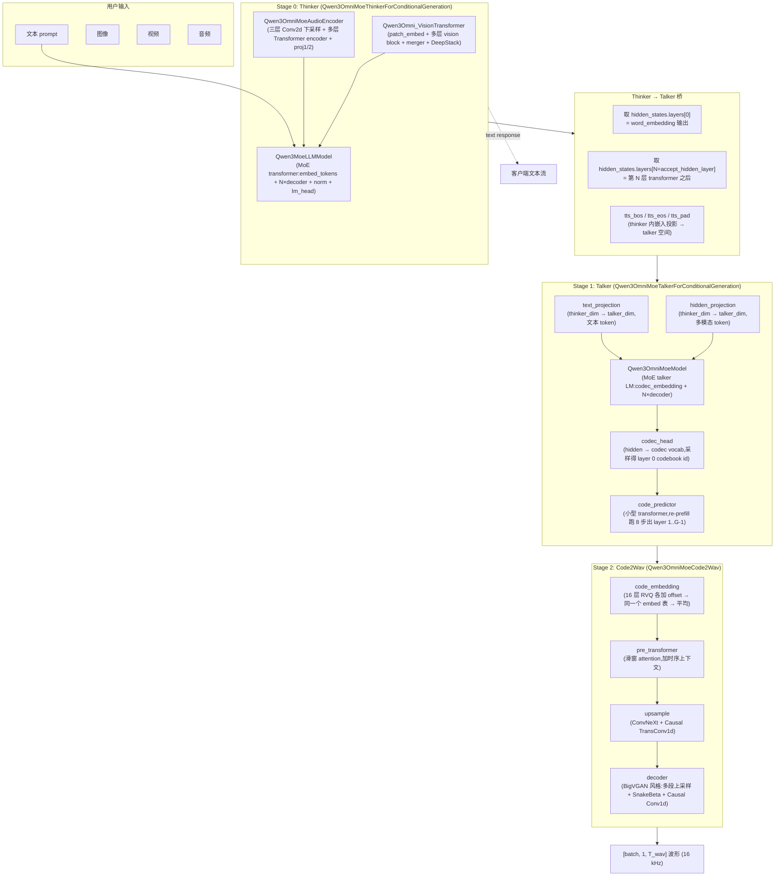
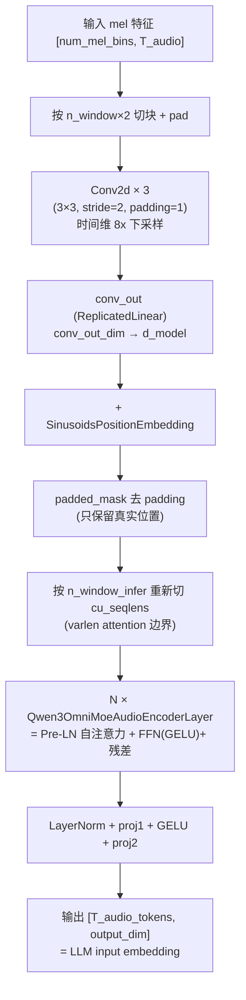
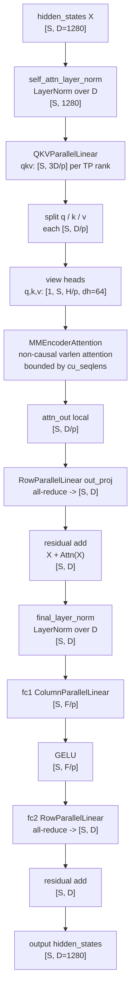

# Qwen3-Omni 模型结构详解:Thinker / Talker / Code2Wav

> **文档版本**: 1.0
> **分析代码版本**: 当前 workspace 本地 `vllm-omni` 源码
> **最后更新**: 2026-06-07

---

## 文档概述

本文档**只讲 Qwen3-Omni 的模型结构本身**——三个 stage 的网络拓扑、每段的张量形状、各自的特殊设计。不讲 vllm-omni 的 stage 编排(那是 [vllm_omni_qwen3_omni.md](vllm-study/markdown/vllm_omni_qwen3_omni.md))、不讲性能优化(那是 [vllm_omni_qwen3_omni_optimizations.md](vllm-study/markdown/vllm_omni_qwen3_omni_optimizations.md)),专注一件事:**作为一个网络,Qwen3-Omni 长什么样**。

阅读重点放在两块:

1. **Thinker 的 audio encoder + ViT**——多模态输入侧最厚实的部分,一般教程讲得最少;
2. **Thinker 把哪些张量"交给"Talker**——这是整个 omni pipeline 的中枢点,理解了这一步就理解了为什么 Qwen3-Omni 必须拆三段。

剩余的 Talker(LLM + code_predictor)和 Code2Wav(CNN vocoder)按照"输入 → 网络主干 → 输出"的顺序讲清楚结构。

**阅读指南**:

| 部分 | 内容 |
|------|------|
| 第一部分 | 整体拓扑图 + 三段速览 |
| 第二部分 | Thinker 主干:multimodal-aware MoE LLM |
| 第三部分 | Thinker 视觉编码器(Qwen3Omni_VisionTransformer) |
| 第四部分 | **Thinker 音频编码器(Qwen3OmniMoeAudioEncoder)——重点** |
| 第五部分 | **Thinker 给 Talker 的"投喂":取 layer 0 / accept_hidden_layer + tts_bos/eos/pad embedding** |
| 第六部分 | Talker:resize MLP + MoE 主干 + codec_head + code_predictor |
| 第七部分 | Code2Wav:RVQ 嵌入 + ConvNeXt 上采样 + BigVGAN 解码器 |
| 第八部分 | 一条请求的端到端张量形状追踪 |
| 第九部分 | QA |

---

# 第一部分: 整体拓扑图 + 三段速览

## 1.1 总图



## 1.2 三段速览

| 维度 | Thinker | Talker | Code2Wav |
|------|---------|--------|----------|
| 主干 | MoE LLM(Qwen3Moe 衍生)+ ViT + Audio Encoder | MoE LLM(structurally a small Qwen3Moe)+ code_predictor | 纯 CNN(BigVGAN 风格 vocoder) |
| 输入 | text token ids、图像 patch、音频 mel | text token ids + thinker 给的 hidden / embed | RVQ codes `[B, 16, T_code]` |
| 输出 | text token + per-layer hidden | layer 0 codebook id + summed_embeddings | wav `[B, 1, T_wav]` |
| 是否 AR | ✓(每步出 1 文本 token) | ✓(每步出 1 个 codec frame = 16 codebook) | ✗(一次出整段波形) |
| 是否 MoE | ✓ | ✓ | ✗ |
| KV cache | ✓ | ✓ | ✗ |
| 词表 | 文本 vocab(152064) | codec vocab(3072,含 codec_bos/eos/pad/think_*/speaker_*) | 不需要词表(直接 RVQ id 进 embed 表) |
| hidden_size(30B-A3B) | thinker LLM 2048 / audio d_model 1280 / vision 1152 | LLM 1024 / code_predictor 1024 | hidden 1024 / decoder_dim 1536 |
| 层数(30B-A3B) | LLM 48 / audio encoder 32 / vision 27 | LLM 20 / code_predictor 5 | pre_transformer 8 |
| 模型规模(30B-A3B) | ~30B 总 / ~3B 激活(MoE 128 expert,top-8) | 较小(MoE 128 expert,top-6,+ shared expert) | <100M |

下面逐个展开。

## 1.3 30B-A3B-Instruct 具体配置(对照表)

为了让下面所有形状/数字有据可查,先把 `Qwen3-Omni-30B-A3B-Instruct` 的 `config.json` 关键字段摆出来:

**Thinker LLM(`thinker_config.text_config`)**:

| 字段 | 值 |
|------|----|
| `hidden_size` | 2048 |
| `intermediate_size` / `moe_intermediate_size` | 768 / 768 |
| `num_hidden_layers` | 48 |
| `num_attention_heads` / `num_key_value_heads` | 32 / 4(GQA 8:1) |
| `head_dim` | 128 |
| `num_experts` / `num_experts_per_tok` | 128 / 8 |
| `shared_expert_intermediate_size` | 0(无 shared expert) |
| `decoder_sparse_step` | 1(每层都是 MoE) |
| `use_qk_norm` | true |
| `rope_theta` / MRoPE `mrope_section` | 1000000 / [24, 20, 20] |
| `vocab_size` | 152064 |
| `max_position_embeddings` | 65536 |

**Thinker Audio Encoder(`thinker_config.audio_config`)**:

| 字段 | 值 |
|------|----|
| `d_model` | 1280 |
| `encoder_layers` | 32 |
| `encoder_attention_heads` | 20(单卡 head_dim=64) |
| `encoder_ffn_dim` | 5120 |
| `num_mel_bins` | 128 |
| `max_source_positions` | 1500 |
| `n_window` / `n_window_infer` | 50 / 800 |
| `conv_chunksize` | 500 |
| `downsample_hidden_size` | 480 |
| `activation_function` | gelu |
| `output_dim` | 2048(= Thinker LLM hidden_size) |

**Thinker Vision Encoder(`thinker_config.vision_config`)**:

| 字段 | 值 |
|------|----|
| `hidden_size` | 1152 |
| `intermediate_size` | 4304 |
| `depth` | 27 |
| `num_heads` | 16(head_dim=72) |
| `patch_size` / `temporal_patch_size` | 16 / 2 |
| `spatial_merge_size` | 2 |
| `image_size` | 768 |
| `deepstack_visual_indexes` | [8, 16, 24](3 个抽取点) |
| `apply_vit_abs_pos_embed` | true |
| `hidden_act` | gelu_pytorch_tanh |
| `out_hidden_size` | 2048(= Thinker LLM hidden_size) |
| `tokens_per_second` | 2 |

**Talker LLM(`talker_config.text_config`)**:

| 字段 | 值 |
|------|----|
| `hidden_size` | 1024 |
| `intermediate_size` / `moe_intermediate_size` | 2048 / 384 |
| `num_hidden_layers` | 20 |
| `num_attention_heads` / `num_key_value_heads` | 16 / 2(GQA 8:1) |
| `head_dim` | 128 |
| `num_experts` / `num_experts_per_tok` | 128 / 6 |
| `shared_expert_intermediate_size` | 768(**有 shared expert**) |
| `decoder_sparse_step` | 1 |
| `vocab_size`(codec vocab) | 3072 |
| `mrope_section` | [24, 20, 20] |

**Talker 顶层(`talker_config`)**:

| 字段 | 值 |
|------|----|
| `accept_hidden_layer` | 24 |
| `num_code_groups` | **16**(RVQ 总层数,不是 8!) |
| `thinker_hidden_size` | 2048(确认 Thinker LLM hidden) |
| `speaker_id` | {chelsie: 2301, ethan: 2302, aiden: 2303} |
| `codec_bos_id / eos_id / pad_id` | 2149 / 2150 / 2148 |
| `codec_nothink / think_bos / think_eos_id` | 2155 / 2156 / 2157 |

**Code Predictor(`talker_config.code_predictor_config`)**:

| 字段 | 值 |
|------|----|
| `hidden_size` | 1024(和 Talker 主干同 → `small_to_mtp_projection = Identity`) |
| `intermediate_size` | 3072 |
| `num_hidden_layers` | 5 |
| `num_attention_heads` / `num_key_value_heads` | 16 / 8(GQA 2:1) |
| `head_dim` | 128 |
| `layer_types` | 5 × `full_attention` |
| `num_code_groups` | 16 |
| `vocab_size`(codebook_size) | 2048 |

**Code2Wav(`code2wav_config`)**:

| 字段 | 值 |
|------|----|
| `hidden_size` | 1024 |
| `decoder_dim` | 1536 |
| `intermediate_size`(pre_transformer FFN) | 3072 |
| `num_hidden_layers`(pre_transformer 层数) | 8 |
| `num_attention_heads` / `num_key_value_heads` | 16 / 16(non-GQA) |
| `codebook_size` | 2048 |
| `num_quantizers` | **16**(必须与 talker `num_code_groups` 一致) |
| `num_semantic_quantizers` | 1(其余 15 个是 acoustic) |
| `semantic_codebook_size` | 4096 |
| `sliding_window` | 72 |
| `upsample_rates` | [8, 5, 4, 3] |
| `upsampling_ratios` | [2, 2] |
| 总上采率 | **8 × 5 × 4 × 3 × 2 × 2 = 1920** |
| `max_position_embeddings` | 8000 |

**全局 ID**:

| 字段 | 值 |
|------|----|
| `tts_bos_token_id` / `tts_eos_token_id` / `tts_pad_token_id` | 151672 / 151673 / 151671 |
| `im_start_token_id` / `im_end_token_id` | 151644 / 151645 |
| `system_token_id` / `user_token_id` / `assistant_token_id` | 8948 / 872 / 77091 |
| `audio_token_id` / `image_token_id` / `video_token_id` | 151675 / 151655 / 151656 |
| `audio_start_token_id` / `audio_end_token_id` | 151669 / 151670 |
| `vision_start_token_id` / `vision_end_token_id` | 151652 / 151653 |

下面所有形状/数字都按这套配置展开。

---

# 第二部分: Thinker 主干

## 2.1 入口

源码:`vllm_omni/model_executor/models/qwen3_omni/qwen3_omni_moe_thinker.py`

```python
@support_torch_compile(
    dynamic_arg_dims={
        "input_ids": 0,
        "positions": -1,
        "intermediate_tensors": 0,
        "inputs_embeds": 0,
        "deepstack_input_embeds": 0,
    }
)
class Qwen3MoeLLMModel(_Qwen3MoeLLMModel):
    def forward(self, input_ids, positions, ...):
        ...
```

Thinker 的 LLM 主干就是一个 **Qwen3-MoE**(参考 [vllm_moe_ep.md](vllm-study/markdown/vllm_moe_ep.md) 第四部分的描述),实例化时(30B-A3B):

- 48 层 transformer,每层都是 MoE(`decoder_sparse_step=1`),共 128 expert,top-8(无 shared expert)
- hidden 2048 / `moe_intermediate_size=768`(per expert)
- attention 是 **GQA**:32 个 Q head,4 个 KV head(8:1 共享),head_dim=128
- **`use_qk_norm=true`**:Q/K 各加一次 RMSNorm 再做点积,是 Qwen3 系新特性,稳定 long-context attention
- 使用 **MRoPE**(Multimodal RoPE):`mrope_section=[24, 20, 20]`,head_dim 128 被切成 64(text 维)+ 20×2(空间维)+ 24×2(时间维)三段,分别对应文本、空间、时间位置——这是 Qwen2.5-VL 引入、Qwen3-Omni 继承的核心多模态位置编码方案

主体结构上有几处特别之处:

1. **`embed_tokens` + 48 层 transformer + `norm` + `lm_head`** 标准三段,vllm 标准 model 接口;
2. **decode 时支持 multimodal embedding 注入**——视觉/音频 encoder 的输出会替换对应的 placeholder token embedding;
3. **支持 DeepStack 残差路径**——视觉 encoder 的中间几层 hidden 不仅参与 merger,还以"deepstack input embeds"形式叠加进 LLM 的若干 transformer 层(`Qwen3OmniMoeForConditionalGeneration` 的一个特性,详情见上游)。

## 2.2 multimodal token 替换

Qwen3-Omni 用三种 placeholder token id 标记多模态位置:

| 名字 | 出现在哪里 |
|------|-----------|
| `audio_token_id` | prompt 里每段音频被替换成 N 个连续的 audio token |
| `image_token_id` | 图像 patch 序列对应的 token |
| `video_token_id` | 视频帧对应的 token |

embed 阶段:

```python
# pseudo-code from Qwen3OmniMoeConditionalGenerationMixin
embeds = embed_tokens(input_ids)             # 文本部分先按 vocab embed
for region in audio_regions:
    embeds[region] = audio_encoder(audio_features[region])  # 用 audio encoder 输出替换
for region in image_regions:
    embeds[region] = vit(image_patches[region])
...
```

这种"前置投影 + token 替换"的模式是 Qwen-VL 系列的标准做法,Qwen3-Omni 直接复用,只是多了一路 audio。

## 2.3 关键能力:`return_hidden_states + capture_layer_indices`

Thinker 的 forward 接受一个特殊参数:

```python
# qwen3_omni.py forward 内部
accept_layer = getattr(self.talker_config, "accept_hidden_layer", None)
capture_kwargs = {}
if accept_layer is not None:
    capture_kwargs = {
        "capture_layer_indices": [0, int(accept_layer)],
        "return_hidden_states": True,
    }
text_hidden_states, captured_layer_dict = self.thinker(
    input_ids=input_ids, positions=positions,
    intermediate_tensors=intermediate_tensors,
    inputs_embeds=inputs_embeds,
    **capture_kwargs, **kwargs,
)
```

读法:**告诉 Thinker"forward 时除了最后一层 hidden,还把第 0 层(也就是 word embedding 之后)和第 `accept_hidden_layer` 层的 hidden 都返回给我"**。这两层 hidden 就是 Talker 的输入"原料"——第五部分会详细讲为什么是这两层。

`captured_layer_dict` 的结构是:

```python
{
  0:              torch.Tensor[T, H_thinker],   # = embed_tokens(input_ids) 之后立即取
  accept_layer:   torch.Tensor[T, H_thinker],   # = 第 accept_layer 层 transformer 之后
}
```

它最终被 pooling output 收集起来,在 stage 0 退出时通过 connector 发往 stage 1。

---

# 第三部分: Thinker 视觉编码器

## 3.1 类定义

```python
class Qwen3Omni_VisionTransformer(_Qwen3Omni_VisionTransformer):
    """Subclass that fixes Qwen2_5_VisionAttention.forward() compatibility."""

    def __init__(self, *args, **kwargs):
        super().__init__(*args, **kwargs)
        self.tp_size = get_tensor_model_parallel_world_size()
```

它继承 vllm 上游的 `Qwen3Omni_VisionTransformer`,主要修了一个 attention forward 签名兼容性的 bug——本质上还是 **Qwen2.5-VL 那一脉的 ViT**。

## 3.2 forward 流程

```python
def forward(self, x: torch.Tensor, grid_thw) -> torch.Tensor:
    hidden_states = x.to(device=self.device, dtype=self.dtype)
    hidden_states = self.patch_embed(hidden_states)

    if self.apply_vit_abs_pos_embed:
        pos_embeds = self.fast_pos_embed_interpolate(grid_thw)
        hidden_states = hidden_states + pos_embeds
    rotary_pos_emb_cos, rotary_pos_emb_sin = self.rot_pos_emb(grid_thw)

    # 计算 cu_seqlens(图像 patch 在 batch 内的累计偏移)
    cu_seqlens = torch.repeat_interleave(
        grid_thw_tensor[:, 1] * grid_thw_tensor[:, 2],
        grid_thw_tensor[:, 0],
    ).cumsum(dim=0, dtype=...)
    cu_seqlens = F.pad(cu_seqlens, (1, 0), value=0)

    hidden_states = hidden_states.unsqueeze(1)
    max_seqlen = self.compute_attn_mask_seqlen(cu_seqlens)
    sequence_lengths = MMEncoderAttention.maybe_compute_seq_lens(self.attn_backend, cu_seqlens_np, self.device)

    hidden_states_list = []
    deepstack_visual_indexes = self.deepstack_visual_indexes

    for layer_num, blk in enumerate(self.blocks):
        hidden_states = blk(
            hidden_states,
            cu_seqlens=cu_seqlens,
            rotary_pos_emb_cos=rotary_pos_emb_cos,
            rotary_pos_emb_sin=rotary_pos_emb_sin,
            max_seqlen=max_seqlen,
            sequence_lengths=sequence_lengths,
        )
        if deepstack_visual_indexes is not None and layer_num in deepstack_visual_indexes:
            hidden_states_list.append(hidden_states)

    hidden_states = self.merger(hidden_states)

    if deepstack_visual_indexes is not None:
        processed_hidden_states_list = [hidden_states]
        for idx, x_ds in enumerate(hidden_states_list):
            x_ds = self.merger_list[idx](x_ds)
            processed_hidden_states_list.append(x_ds)
        hidden_states = torch.cat(processed_hidden_states_list, dim=1)

    return hidden_states
```

读法:

1. **`patch_embed`**:把图像/视频帧分块成 patch(`patch_size=16`,空间 16×16 像素 / `temporal_patch_size=2`,时间 2 帧一组),每个 patch 投影到 ViT hidden(**1152**)。
2. **`fast_pos_embed_interpolate(grid_thw)`**:`grid_thw = (T, H, W)`,T 是帧数(图像 T=1)、H W 是 patch 网格。`apply_vit_abs_pos_embed=true`——**Qwen3-Omni vision 同时用绝对位置编码(插值后加)和 RoPE**,绝对位置给"图像本身的空间结构",RoPE 给"batch 内多图/多视频的相对偏移"。
3. **`rot_pos_emb(grid_thw)`**:旋转位置编码(RoPE)按 3D 网格生成 cos/sin。
4. **`cu_seqlens`**:多图/多视频在 batch 里 flatten 后的累计偏移,FlashAttention varlen 风格的边界。
5. **27 层 vision block**(Qwen2.5-VL 风格:LayerNorm + `gelu_pytorch_tanh` MLP + cross-token attention with RoPE)。注意激活是 `gelu_pytorch_tanh`,**不是** LLM 主干的 SwiGLU。
6. **`merger`**:把 vision token 数从 patch 粒度 merge 到 LLM 输入粒度(`spatial_merge_size=2`,即 2×2=4 个 patch 合一),同时把 ViT hidden 1152 映射到 **`out_hidden_size=2048`**(= Thinker LLM hidden)。
7. **DeepStack**:在层 **[8, 16, 24]** 这 3 个抽取点额外抓 hidden,过对应的 merger_list,**和最终 hidden 在 channel 维度 concat**——给后面 LLM 提供多层级视觉特征(浅层细节 + 深层语义)。

输出形状:`[num_merged_patches, 2048]`,例如一张 504×504 图按 patch=16 得到 504/16 × 504/16 = 31×31 ≈ 961 个 patch,merge 2×2 后约 240 个 token。

## 3.3 DeepStack 注入 LLM 的方式

输出的 hidden 进 LLM 时**不是简单替换 `image_token_id` 位置**——DeepStack 把视觉的若干层 hidden 沿 channel concat 在一起,LLM 这边会把每一层的视觉残差按层注入到对应的 LLM transformer block:

```text
LLM block i 的输入 = LLM 自身 hidden + deepstack_input_embeds[i] (如果 i ∈ deepstack target layers)
```

PR #3885 修过一个 deepstack 在 torch.compile 下的精度回归——说明 deepstack 不只是个 forward kwarg,它跟编译路径耦合。

---

# 第四部分: Thinker 音频编码器(重点)

## 4.1 配置一览

`Qwen3OmniMoeAudioEncoder` 是 Qwen3-Omni 的**核心创新点之一**——把语音输入直接接成 LLM 可消费的 token embedding。30B-A3B 的实例配置:

| 字段 | 值 | 含义 |
|------|----|------|
| `d_model` | **1280** | encoder hidden |
| `encoder_layers` | **32** | transformer 层数 |
| `encoder_attention_heads` / `head_dim` | 20 / 64 | 单 head 维度 |
| `encoder_ffn_dim` | 5120 | FFN 中间维度 |
| `num_mel_bins` | 128 | mel 滤波器组数 |
| `max_source_positions` | 1500 | 位置编码最大长度(对应 ~30s 音频) |
| `n_window` / `n_window_infer` | **50 / 800** | 滑窗 attention 窗口(training vs inference) |
| `conv_chunksize` | **500** | conv 前置层的批 chunk(避免一次性吃满显存) |
| `downsample_hidden_size` | **480** | 三层 Conv2d 下采样的通道数 |
| `activation_function` | **gelu** | FFN 激活(不是 silu) |
| `output_dim` | **2048** | 投影到 thinker LLM 输入维度 |
| `scale_embedding` | false | 不缩放 embedding |
| `tie_word_embeddings` | true | embed 表与 lm_head 共享(audio 这边其实不用 lm_head,仅作 flag) |

## 4.2 网络拓扑



下面是源码逐段:

### 第 1 段:三层 Conv2d 下采样

```python
self.conv2d1 = nn.Conv2d(1, config.downsample_hidden_size, 3, 2, padding=1)
self.conv2d2 = nn.Conv2d(config.downsample_hidden_size,
                         config.downsample_hidden_size, 3, 2, padding=1)
self.conv2d3 = nn.Conv2d(config.downsample_hidden_size,
                         config.downsample_hidden_size, 3, 2, padding=1)

conv_out_dim = config.downsample_hidden_size * ((((config.num_mel_bins + 1) // 2 + 1) // 2 + 1) // 2)
self.conv_out = ReplicatedLinear(conv_out_dim, config.d_model, bias=False, ...)
```

读法:

- **3 次 Conv2d stride=2**:时间维和频率维各 down 8 倍。一个 1 秒的音频在 mel 域是 `[128, 100]`(假设 100 Hz hop),下采样后约 `[16, 13]`。
- **`conv_out_dim` 公式**:把"频率维"压缩后剩下的 channels × frequency 拍平成一维,投到 `d_model`。
- **ReplicatedLinear**:TP 维度上不切——audio encoder 计算量相对小,切了反而通信不划算。

### 第 2 段:切块 + padding

```python
def forward(self, input_features, feature_lens, aftercnn_lens):
    chunk_num = torch.ceil(feature_lens / (self.n_window * 2)).long()
    chunk_lengths = torch.tensor(
        [self.n_window * 2] * chunk_num.sum(),
        dtype=torch.long, device=feature_lens.device,
    )
    tail_chunk_index = F.pad(chunk_num, (1, 0), value=-1).cumsum(0)[1:]
    chunk_lengths[tail_chunk_index] = feature_lens % (self.n_window * 2)
    chunk_lengths[chunk_lengths == 0] = self.n_window * 2

    chunk_list = input_features.T.split(chunk_lengths.tolist(), dim=0)
    padded_feature = nn.utils.rnn.pad_sequence(chunk_list, batch_first=True).transpose(1, 2)
```

这是 Qwen3-Omni audio encoder **流式友好**的关键:

- 长音频按 `n_window * 2` 帧切块(30B-A3B `n_window=50`,即 100 mel frame ≈ 1 秒);
- 每块独立做 Conv2d + attention,**块内 attention,块间不互通**;
- 最后用 `cu_seqlens` 串起来给后面 transformer。

注意 `n_window_infer=800` 是**推理时 transformer 层的 attention 窗口**(后面第 5 段会展开),与这里 conv 前的分块独立——一个是 conv 输入侧的"物理切块",一个是 attention 侧的"逻辑窗口"。

这种"分块 attention"等价于 **Sliding-window attention**,但 vanilla SWA 的实现是"全局序列 + 滑窗 mask",这里直接物理分块,内存效率更高。

### 第 3 段:conv chunksize 切批

```python
if padded_feature.size(0) <= self.conv_chunksize:
    padded_embed = F.gelu(self.conv2d1(padded_feature))
    padded_embed = F.gelu(self.conv2d2(padded_embed))
    padded_embed = F.gelu(self.conv2d3(padded_embed))
else:
    padded_embeds = []
    for chunk in padded_feature.split(self.conv_chunksize, dim=0):
        padded_embed = F.gelu(self.conv2d1(chunk))
        padded_embed = F.gelu(self.conv2d2(padded_embed))
        padded_embed = F.gelu(self.conv2d3(padded_embed))
        padded_embeds.append(padded_embed)
    padded_embed = torch.cat(padded_embeds, dim=0)
```

读法:**音频块数太多时,conv 一次 forward 显存爆炸——所以按 `conv_chunksize`(30B-A3B 默认 500)切批分次跑**。这是 prefill 阶段一次塞几分钟音频的关键防护。

### 第 4 段:conv 输出整形 + 位置编码

```python
b, c, f, t = padded_embed.size()
padded_embed, _ = self.conv_out(
    padded_embed.permute(0, 3, 1, 2).contiguous().view(b, t, c * f)
)

positional_embedding = (
    self.positional_embedding.positional_embedding[: padded_embed.shape[1], :]
    .unsqueeze(0)
    .to(padded_embed.dtype)
)
padded_embed = padded_embed + positional_embedding

hidden_states = padded_embed[padded_mask_after_cnn]
```

`SinusoidsPositionEmbedding` 是 Whisper 风格的正弦位置编码——和文本 RoPE 不同,audio 这边走的是绝对位置编码。最后用 `padded_mask_after_cnn` 把每块的尾部 padding 去掉,**只保留真实有效的时间步**。

### 第 5 段:重新计算 cu_seqlens(给 transformer 用)

```python
cu_chunk_lens = [0]
window_aftercnn = padded_mask_after_cnn.shape[-1] * (self.n_window_infer // (self.n_window * 2))
for cnn_len in aftercnn_lens.tolist():
    num_full_chunks = cnn_len // window_aftercnn
    remainder = cnn_len % window_aftercnn
    cu_chunk_lens.extend([window_aftercnn] * num_full_chunks)
    if remainder:
        cu_chunk_lens.append(remainder)
cu_seqlens = torch.tensor(cu_chunk_lens, device=aftercnn_lens.device).cumsum(-1, dtype=torch.int32)
```

`n_window_infer` 通常大于 `n_window`——**推理时的 attention window 可以比训练时窗口大,允许更大的上下文**。

### 第 6 段:transformer 编码 + 后处理

```python
max_seqlen = self.compute_attn_mask_seqlen(cu_seqlens)
for encoder_layer in self.layers:
    hidden_states = encoder_layer(hidden_states, cu_seqlens, max_seqlen)

hidden_states = self.ln_post(hidden_states)
hidden_states, _ = self.proj1(hidden_states)
hidden_states = self.act(hidden_states)
hidden_states, _ = self.proj2(hidden_states)
return hidden_states
```

`Qwen3OmniMoeAudioEncoderLayer` 内部:

```python
class Qwen3OmniMoeAudioEncoderLayer(nn.Module):
    def forward(self, hidden_states, cu_seqlens, max_seqlen):
        residual = hidden_states
        hidden_states = self.self_attn_layer_norm(hidden_states)
        hidden_states = self.self_attn(hidden_states, cu_seqlens, max_seqlen)
        hidden_states = residual + hidden_states

        residual = hidden_states
        hidden_states = self.final_layer_norm(hidden_states)
        hidden_states, _ = self.fc1(hidden_states)
        hidden_states = self.activation_fn(hidden_states)  # gelu
        hidden_states, _ = self.fc2(hidden_states)
        hidden_states = residual + hidden_states
        return hidden_states
```

这是一层标准 **Pre-LN Transformer Encoder block**:先归一化再做 sub-layer,sub-layer 输出加回 residual。它和 Thinker LLM 主干的区别是:audio encoder 用 `LayerNorm + GELU FFN`,不是 LLM 的 `RMSNorm + SwiGLU/MoE`。

#### `Qwen3OmniMoeAudioEncoderLayer` 结构图

记号:

- `S = sum(cu_seqlens[1:] - cu_seqlens[:-1])`:去掉 padding 后、送入 transformer 的有效音频 token 总数;
- `D = d_model = 1280`;
- `H = encoder_attention_heads = 20`;
- `dh = head_dim = D / H = 64`;
- `F = encoder_ffn_dim = 5120`;
- `p = tensor_parallel_size`;
- `cu_seqlens`:把扁平的 `[S, D]` 序列切回多个 attention window 的边界。



#### 每个结构的 shape 和几何直观

| 步骤 | 模块 | 输入 shape | 输出 shape | 几何直观 |
|------|------|------------|------------|----------|
| 0 | 输入 `hidden_states` | `[S, 1280]` | `[S, 1280]` | 一段音频被看成 `S` 个点组成的轨迹,每个点在 1280 维语义空间里表示一个下采样后的声学片段。 |
| 1 | `self_attn_layer_norm` | `[S, 1280]` | `[S, 1280]` | 对每个点单独做坐标系校准:把各维尺度拉回稳定范围,不改变点的个数和维度。 |
| 2 | `QKVParallelLinear` | `[S, 1280]` | local `[S, 3840/p]` | 给每个点投影出三套角色:问别人用的 `q`,被别人查找用的 `k`,贡献内容用的 `v`。TP 下每张卡只负责一部分 heads。 |
| 3 | `qkv.chunk + view` | local `[S, 3840/p]` | `q,k,v = [1, S, 20/p, 64]` | 把 1280 维大向量拆成多个 64 维小视角;每个 head 像一把专门听某类声学关系的尺子。 |
| 4 | `MMEncoderAttention` | `q,k,v [1, S, 20/p, 64]` + `cu_seqlens` | local `[S, 1280/p]` | 在每个 `cu_seqlens` 定义的窗口内做非因果 attention:每个音频点按相似度从同窗其它点吸收信息,几何上是沿时间轨迹做内容相关的平滑/重组。 |
| 5 | `out_proj` (`RowParallelLinear`) | local `[S, 1280/p]` | `[S, 1280]` | 把各 head 的局部结果重新投回统一 1280 维空间;row parallel 的 all-reduce 把所有 TP rank 的贡献相加。 |
| 6 | 第一次 residual add | `[S, 1280] + [S, 1280]` | `[S, 1280]` | 保留原始声学位置,再叠加上下文修正;几何上是"原点位移 + 注意力产生的方向增量"。 |
| 7 | `final_layer_norm` | `[S, 1280]` | `[S, 1280]` | 在进入逐点 FFN 前再次校准每个点的尺度,让后面的非线性变换处在稳定输入范围。 |
| 8 | `fc1` (`ColumnParallelLinear`) | `[S, 1280]` | local `[S, 5120/p]` | 把每个点从 1280 维展开到 5120 个特征检测器;几何上是把一个紧凑坐标展开成更稀疏、更可分的特征坐标。 |
| 9 | `GELU` | local `[S, 5120/p]` | local `[S, 5120/p]` | 软门控:强响应保留,弱响应压低;几何上是让每个点只激活和当前声学片段相关的特征方向。 |
| 10 | `fc2` (`RowParallelLinear`) | local `[S, 5120/p]` | `[S, 1280]` | 把扩展后的特征重新压回 1280 维;all-reduce 合并各 TP rank 的局部通道贡献。 |
| 11 | 第二次 residual add | `[S, 1280] + [S, 1280]` | `[S, 1280]` | 在保持时序点身份的同时加入逐点非线性变换;attention 负责"看邻居",FFN 负责"改造自己"。 |
| 12 | fp16 clamp | `[S, 1280]` | `[S, 1280]` | 只在 fp16 下做数值保险,防止极端值溢出;几何上是把点限制在硬件能表示的有限盒子里。 |

一句话总结这一层的几何作用:

> `Qwen3OmniMoeAudioEncoderLayer` 把音频 token 序列当成一条 1280 维轨迹;attention 在同一窗口内让轨迹上的点相互交换上下文,FFN 对每个点做独立的非线性形变,两次 residual 保证每次只是在原轨迹上叠加可学习的增量。

注意:

- **没有用 RMSNorm 而是 LayerNorm**——audio encoder 沿用 Whisper 系传统(LLM 主干则用 RMSNorm)。
- **激活函数从 config 读**,30B-A3B 配的是 `gelu`(不是 LLM 主干那种 SwiGLU 内核的 silu)。
- **FFN 是 fc1 → 激活 → fc2 的两段式**(不带门控),不是 LLM 的 SwiGLU。这是 Qwen3-Omni audio encoder 和 LLM 的另一个结构差异。
- **QKV 用 `QKVParallelLinear`** + `MMEncoderAttention`——TP 维度上切 head(20 个 head 在 TP=4 上切成 5/rank)。

`Qwen3OmniMoeAudioAttention`:

```python
class Qwen3OmniMoeAudioAttention(nn.Module):
    def __init__(self, config, prefix):
        ...
        self.embed_dim = config.d_model
        self.num_heads = config.encoder_attention_heads
        self.head_dim = self.embed_dim // self.num_heads
        tp_size = get_tensor_model_parallel_world_size()
        self.num_local_heads = self.num_heads // tp_size

        self.scaling = self.head_dim**-0.5

        self.qkv = QKVParallelLinear(
            hidden_size=self.embed_dim, head_size=self.head_dim,
            total_num_heads=self.num_heads, total_num_kv_heads=self.num_heads,
            bias=True, prefix=f"{prefix}.qkv",
        )
        self.out_proj = RowParallelLinear(self.embed_dim, self.embed_dim, bias=True, prefix=f"{prefix}.out_proj")
        self.attn = MMEncoderAttention(num_heads=self.num_local_heads, head_size=self.head_dim, scale=self.scaling, prefix=f"{prefix}.attn")
```

Bias 是 True——和文本 LLM 的 Q/K/V no-bias 不同,这也是 Whisper 传统。

### 第 7 段:proj1 / proj2 投影到 LLM 输入空间

```python
hidden_states = self.ln_post(hidden_states)
hidden_states, _ = self.proj1(hidden_states)   # d_model → d_model
hidden_states = self.act(hidden_states)
hidden_states, _ = self.proj2(hidden_states)   # d_model → output_dim
```

`output_dim = thinker 主干 hidden_size = 2048`。这两段 `proj1` + `proj2` 是 audio encoder(1280)→ LLM(2048)的 **adapter**,把 audio 特征空间对齐到 LLM 输入空间。**没有这两层,audio 特征塞进 LLM 会是噪声。**

## 4.3 输入预处理:mel 特征怎么来的

Audio encoder 接受的 `input_features` 形状是 `[num_mel_bins=128, T_audio]`。这是由 huggingface processor 的 `feature_extractor` 算出来的:

1. 把波形重采样到 16 kHz(或模型规定的采样率);
2. 用 80 ms 窗、10 ms hop 的 STFT 拿 spectrogram;
3. 过 128-band mel filter;
4. log + clip + normalize。

实际部署里这一步在 `entrypoints` 那一层做完,GPU 上 audio encoder 只接收已经算好的 mel。

## 4.4 输出去哪了

audio encoder 输出 `[T_audio_tokens, output_dim]` 后,会替换 input_ids 里的 `audio_token_id` placeholder——这一步在 Thinker 主 forward 的 embed 阶段做:

```python
embeds = embed_tokens(input_ids)
audio_embeds = audio_encoder(input_features=mel_features, ...)
embeds[audio_placeholder_positions] = audio_embeds
```

之后 audio embeds 就和文本 token embeds 一起进 LLM transformer——LLM 不感知"这是音频"。

---

# 第五部分: Thinker 给 Talker 的"投喂"

这是 Qwen3-Omni **整个 pipeline 的中枢点**——也是面试时容易被深挖的细节。

## 5.1 为什么 Talker 不能用文本 token id?

如果 Talker 输入是 Thinker 输出的文本 token id,**信息会损失**:

- thinker 在多模态输入(图像、音频)的位置上,**hidden state 里编码了多模态语义**(谁在说话、表情、背景音);
- 这些信息无法用 token id 表达——token id 只是"用户说了 hello";
- Talker 需要还原说话人音色、情感、节奏,**必须看到 thinker 的中间隐状态**。

所以 Qwen3-Omni 的设计是:**Talker 接收 Thinker 的 hidden 张量,而不是 token id**。

## 5.2 取哪些 hidden?

`Qwen3OmniMoeForConditionalGeneration.forward`(thinker 段):

```python
accept_layer = getattr(self.talker_config, "accept_hidden_layer", None)
capture_kwargs = {}
if accept_layer is not None:
    capture_kwargs = {
        "capture_layer_indices": [0, int(accept_layer)],
        "return_hidden_states": True,
    }
text_hidden_states, captured_layer_dict = self.thinker(
    input_ids=input_ids, positions=positions,
    intermediate_tensors=intermediate_tensors,
    inputs_embeds=inputs_embeds,
    **capture_kwargs, **kwargs,
)
return text_hidden_states, captured_layer_dict
```

两层 hidden:

| Layer key | 含义 | Talker 怎么用 |
|-----------|------|---------------|
| `0` | `embed_tokens(input_ids)` 之后,**LLM 第 1 层 transformer 之前** | **文本 token 走这一层**——它就是"词汇 embedding",经 talker 的 `text_projection` 投到 talker 空间 |
| `accept_hidden_layer`(典型 24) | 第 N 层 transformer 之后 | **多模态 token 走这一层**——它已经融合了上下文,经 talker 的 `hidden_projection` 投到 talker 空间 |

为什么取这两层而不是别的?

- **层 0**:作为词汇 embedding 的"中性版本",文本 token 的语义是确定的(就是这个词),不需要上下文 → 用最早期、最纯净的表示。
- **第 N 层(accept_hidden_layer)**:多模态 token 的语义**只有经过若干层 transformer 之后才被解出来**(audio/image hidden 经过 LLM 上下文化才知道它在表达"这是一个声音""这是个人脸")→ 用经过若干层加工后的 hidden。

这种"分层取嵌入"的设计是 Qwen3-Omni 特有的——上游模型作者实测出来的最佳 layer 数。

## 5.3 mask:谁是 multimodal token

`_thinker_to_talker_prefill` 里:

```python
multimodal_mask = (
    (thinker_result_ids == self.thinker_config.audio_token_id) |
    (thinker_result_ids == self.thinker_config.image_token_id) |
    (thinker_result_ids == self.thinker_config.video_token_id)
).to(input_ids.device)  # [t]
```

mask 标记每个位置是不是多模态 placeholder。这个 mask **必须送到 Talker 这边**——Talker 用它决定每个位置走 `text_projection` 还是 `hidden_projection`。

## 5.4 chatml 段切分:user 段 vs assistant 段

Thinker 的 prompt 是 ChatML 格式(`<|im_start|>user...<|im_end|>` / `<|im_start|>assistant...`)。

```python
im_start_indexes = torch.cat(
    (
        torch.nonzero(input_ids[0] == self.config.im_start_token_id).squeeze(),
        torch.tensor([target_len], device=input_ids.device, ...),
    ), dim=-1,
)
```

Talker 对不同段处理不一样:

| 段 | 角色 | Talker 处理 |
|----|------|------------|
| `<|im_start|>system...` | 系统提示 | **跳过**(不给 Talker) |
| `<|im_start|>user...` | 用户输入 | `_get_talker_user_parts`:每个位置按 mask 走 text/hidden projection |
| `<|im_start|>assistant...` | thinker 已经生成的 assistant 回复 + 待生成 | `_get_talker_assistant_parts`:**前 3 token + 4 pad + BOS + first text + 后续 trailing_text**,加上 codec 特殊 token |

## 5.5 `_get_talker_user_parts`:用 mask 分叉 projection

```python
def _get_talker_user_parts(self, im_start_index, segment_end_index, multimodal_mask, thinker_hidden, thinker_embed):
    ...
    user_talker_part = torch.empty(
        (seg_len, self.config.talker_config.text_config.hidden_size),
        device=thinker_hidden.device, dtype=torch.bfloat16,
    )

    user_mm_mask = multimodal_mask[im_start_index:segment_end_index]
    if user_mm_mask.any():
        user_thinker_hidden_mm = thinker_hidden[im_start_index:segment_end_index][user_mm_mask]
        mm_hidden = self.talker.hidden_projection(user_thinker_hidden_mm).to(thinker_hidden.device)
        user_talker_part[user_mm_mask] = mm_hidden
    user_thinker_embed = thinker_embed[im_start_index:segment_end_index][~user_mm_mask]
    user_text_hidden = self.talker.text_projection(user_thinker_embed).to(thinker_hidden.device)
    user_talker_part[~user_mm_mask] = user_text_hidden
    return user_talker_part
```

读法:

- **多模态位置**用 `thinker_hidden[accept_layer]` → 过 `hidden_projection` → 写回;
- **文本位置**用 `thinker_embed[layer_0]` → 过 `text_projection` → 写回;
- 两段塞到同一个 `user_talker_part` 张量里,position 严格对应。

## 5.6 `_get_talker_assistant_parts`:特殊的 9 token 模板

assistant 段是 Talker 真正要 "**接力生成**" 的起点,Qwen3-Omni 用了一个非常特殊的 9-token 模板:

```python
def _get_talker_assistant_parts(self, im_start_index, segment_end_index, speaker_id, thinker_embed,
                                  tts_pad_embed, tts_bos_embed, tts_eos_embed):
    assistant_hidden = self.talker.text_projection(
        thinker_embed[im_start_index:segment_end_index]
    ).to(tts_pad_embed.device)

    # [3 tokens] + [4 pad] + [1 BOS] + [1 first text] = 9 tokens
    assistant_text_hidden = torch.cat(
        (
            assistant_hidden[:3],                        # <|im_start|> assistant \n
            tts_pad_embed.expand(4, -1),                 # 4 个 TTS pad
            tts_bos_embed,                               # TTS BOS
            assistant_hidden[3:4]                        # 第 1 个真实文本 token
            if assistant_hidden.shape[0] > 3
            else torch.zeros((1, assistant_hidden.shape[1]), ...),
        ), dim=0,
    )
    codec_special_tokens = torch.tensor(
        [
            self.config.talker_config.codec_nothink_id,
            self.config.talker_config.codec_think_bos_id,
            self.config.talker_config.codec_think_eos_id,
            speaker_id,                                  # ← voice 选择
            self.config.talker_config.codec_pad_id,
            self.config.talker_config.codec_bos_id,
        ],
        device=tts_pad_embed.device, dtype=torch.long,
    )
    embed_input_ids = self.talker.embed_input_ids(codec_special_tokens).to(...)
    assistant_codec_hidden = torch.cat(
        (
            torch.zeros((3, self.config.talker_config.text_config.hidden_size), ...),
            embed_input_ids,                             # 6 个 codec 特殊 token
        ), dim=0,
    )

    if assistant_hidden.shape[0] > 4:
        trailing_text_hidden = torch.cat(
            (assistant_hidden[4:], tts_eos_embed), dim=0,
        )
    else:
        trailing_text_hidden = tts_eos_embed

    input_embeds = assistant_text_hidden + assistant_codec_hidden    # 两条路径相加!
    input_ids = torch.full(
        (assistant_text_hidden.shape[0],),
        fill_value=self.config.tts_pad_token_id,
        dtype=torch.long, device=assistant_text_hidden.device,
    )
    return input_embeds, input_ids, trailing_text_hidden
```

9-token 模板的意义:

| 位置 | text 流 | codec 流 |
|------|---------|----------|
| 0-2 | 投影后的 `<|im_start|> assistant \n` | 0 hidden(占位) |
| 3-6 | `tts_pad_embed` × 4 | codec 特殊 token:nothink / think_bos / think_eos / **speaker_id**(voice 选择) |
| 7 | `tts_bos_embed`(TTS 开始) | `codec_pad_id` |
| 8 | 第 1 个真实文本 hidden | `codec_bos_id`(codec 开始) |

**两条 hidden 流"相加"**(`input_embeds = assistant_text_hidden + assistant_codec_hidden`)——这是 Qwen3-Omni TTS 的核心 trick:**文本流和 codec 流共享同一个时间轴**,通过加法把两路信息融合成一个向量喂给 Talker。

`trailing_text_hidden` 是这 9 token 之后**剩下的所有 assistant 文本 hidden + tts_eos**,缓存在 `payload.hidden_states.trailing_text`。Talker 在 **decode 阶段**每步从这个 trailing 里取一个,作为"下一步文本提示"——见第 5.7。

## 5.7 `_thinker_decode_to_talker_decode`:async chunk 下每 step 一个 thinker 文本 hidden

async chunk 模式下,thinker 每出一个新文本 token 就把它的 embedding 送过来。Talker 这一步:

```python
def _thinker_decode_to_talker_decode(self, payload, device, update_dict):
    embed = payload.get("embed", {})
    meta = payload.get("meta", {})

    cached_thinker_decode_embeds = embed.get("cached_decode", None)
    thinker_decode_embed = embed.get("decode", None)
    start_index = meta.get("num_processed_tokens", 0)

    if cached_thinker_decode_embeds is not None and start_index < cached_thinker_decode_embeds.shape[0]:
        cached_thinker_decode_embeds = cached_thinker_decode_embeds.to(device)
        thinker_embed = cached_thinker_decode_embeds[start_index]
        if thinker_decode_embed is not None:
            thinker_decode_embed = thinker_decode_embed.to(device)
            cached_thinker_decode_embeds = torch.cat([cached_thinker_decode_embeds, thinker_decode_embed], dim=0)
            update_dict.setdefault("embed", {})["cached_decode"] = cached_thinker_decode_embeds
    elif thinker_decode_embed is not None:
        thinker_embed = thinker_decode_embed
        ...
    else:
        # thinker token 已经吃完,需要 append tts_eos
        if meta.get("eos_emitted", False):
            return self.tts_pad_embed.to(device)
        update_dict.setdefault("meta", {})["eos_emitted"] = True
        return self.tts_eos_embed.to(device)

    update_dict.setdefault("embed", {})["decode"] = None
    return self.talker.text_projection(thinker_embed).to(device)
```

读法:

- `cached_decode`:**Talker 内部**维护的"已经从 thinker 拿到但还没用上的"文本 embedding 队列;
- 每步从 `cached_decode[start_index]` 拿一个 → `text_projection` → 当作下一步的 "text_step" 给 talker_mtp;
- 用完后切换到 `tts_eos`(说话结束)→ `tts_pad`(填充)。

这是 **"text 流和 codec 流"分离的关键**——文本每出一个 token,codec 那边接力出一个 frame(16 codebook),time alignment 由这个 step-by-step 的 text_step 维持。

## 5.8 tts_bos / tts_eos / tts_pad 怎么来

注意上面到处出现的 `tts_bos_embed / tts_eos_embed / tts_pad_embed`——它们不是 Talker 自己的 embedding,**是从 Thinker 的 embed 表里拿出对应 token id 的 embedding,投影到 Talker 空间**:

```python
def _get_tts_embed(self, thinker_embed, tts_bos_thinker, tts_eos_thinker, tts_pad_thinker):
    """把 thinker 侧的 TTS 特殊 embedding 投影到 talker 文本空间。"""
    module_device = self._module_device(self.talker)

    def _proj_from_thinker(x_opt):
        if isinstance(x_opt, torch.Tensor) and x_opt.numel() > 0:
            xin = _ensure_1x1(x_opt).to(module_device)
        else:
            xin = torch.zeros((1, thinker_embed.shape[-1]), ...)
        return self.talker.text_projection(xin).to(module_device)

    self.tts_bos_embed = _proj_from_thinker(tts_bos_thinker)
    self.tts_eos_embed = _proj_from_thinker(tts_eos_thinker)
    self.tts_pad_embed = _proj_from_thinker(tts_pad_thinker)
```

Thinker 在 prefill 时会顺便把 `tts_bos / tts_eos / tts_pad` 这三个 token 的 embedding 单独抽出来,塞进 `embed.tts_bos / tts_eos / tts_pad`,通过 connector 发到 Talker stage。Talker 这边收到后立即 `text_projection` 投影,缓存成 `self.tts_bos_embed` 等供 forward 用。

**为什么不让 Talker 自己 embed 这三个特殊 token?**

因为 Talker 的 vocab 是 **codec vocab**,没有文本 token——`tts_bos_token_id` 对应的是 thinker 文本 vocab 里的某个 id,在 Talker 这边查不到这个 id。所以必须从 thinker 那边拿好 embedding(thinker 词表里 `lookup(tts_bos_id)` 得到的向量),投影到 talker 空间后用。

## 5.9 总结:thinker 给 talker 的 payload 字段表

| 字段 | 角色 | 来自 thinker 的什么 |
|------|------|---------------------|
| `embed.prefill` | prefill 段文本 embedding | thinker `hidden_states.layers[0]` |
| `hidden_states.output` | accept_hidden_layer 的 hidden | thinker `hidden_states.layers[accept_hidden_layer]` |
| `embed.tts_bos` / `tts_eos` / `tts_pad` | TTS 特殊 token embedding | thinker `embed_tokens(tts_bos_id)` 等 |
| `ids.all` / `ids.prompt` | prompt + 已生成的全部 token id | thinker `request.all_token_ids` |
| `embed.decode`(async chunk 中段) | 每步新生成 token 的 embedding | thinker 当前步 `hidden_states.layers[0]` |
| `speaker` / `language` | 用户指定的语音/语言 | request 元数据,thinker 透传 |
| `meta.finished` | 是否最后一段 | 调度状态 |

理解了这张表,你就理解了为什么"无法把 Talker 合进 Thinker 一起跑"——它需要的输入完全不是常规 LLM 那套 token id,而是 5 种不同来源的张量。

---

# 第六部分: Talker

## 6.1 顶层结构

```python
class Qwen3OmniMoeTalkerForConditionalGeneration(nn.Module, SupportsPP):
    """
    Architecture:
    - text_projection:    Thinker text embeds → talker dim
    - hidden_projection:  Thinker hidden states → talker dim
    - language_model:     Main MoE transformer (generates layer 0)
    - codec_head:         Projects to codec vocabulary (layer 0 logits)
    - code_predictor:     Small transformer for layers 1..G-1
    """
```

代码层面:

```python
def __init__(self, *, vllm_config, prefix=""):
    super().__init__()
    talker_config = vllm_config.model_config.hf_config
    ...

    # 1. 投影层
    self.text_projection = Qwen3OmniMoeTalkerResizeMLP(self.config)
    self.hidden_projection = Qwen3OmniMoeTalkerResizeMLP(self.config)

    # 2. codec_head
    self.codec_head = nn.Linear(
        self.config.text_config.hidden_size,
        self.config.text_config.vocab_size,
        bias=False,
    )

    # 3. 主干 LM
    self.language_model = Qwen3OmniMoeModel(
        vllm_config=vllm_config,
        talker_config=self.config,
        prefix=maybe_prefix(prefix, "language_model"),
    )

    # 4. code_predictor
    self.code_predictor = Qwen3OmniMoeTalkerCodePredictor(
        vllm_config=vllm_config, prefix=maybe_prefix(prefix, "code_predictor")
    )
```

## 6.2 `Qwen3OmniMoeTalkerResizeMLP`

```python
class Qwen3OmniMoeTalkerResizeMLP(nn.Module):
    """
    The thinker and talker have different hidden sizes:
    - Thinker: config.thinker_hidden_size (30B-A3B: 2048)
    - Talker: config.text_config.hidden_size (30B-A3B: 1024)
    """

    def __init__(self, config):
        super().__init__()
        self.linear_fc1 = nn.Linear(config.thinker_hidden_size, config.text_config.intermediate_size, bias=True)
        self.linear_fc2 = nn.Linear(config.text_config.intermediate_size, config.text_config.hidden_size, bias=True)
        self.act_fn = _ACTIVATION_REGISTRY[config.text_config.hidden_act]  # silu

    def forward(self, hidden_state):
        return self.linear_fc2(self.act_fn(self.linear_fc1(hidden_state)))
```

**两段 MLP 做 dim 切换**(30B-A3B:thinker 2048 → talker 1024,**降维**):

- `linear_fc1`:2048 → `talker.intermediate_size=2048`
- 激活:silu
- `linear_fc2`:2048 → 1024

text_projection 和 hidden_projection 是**两个独立实例**——权重不共享。文本 embedding 和多模态 hidden 的分布特征不同,各学各的。注意是**降维**:Thinker 是 30B 的大模型,Talker 是更小的"声码 LM",维度从 2048 砍到 1024——这也是 Qwen3-Omni 的算力分配策略(让计算量集中在 Thinker 的语义理解,而不是 Talker 的 codec 生成)。

## 6.3 `Qwen3OmniMoeModel`(talker 的主干)

```python
class Qwen3OmniMoeModel(Qwen3MoeLLMForCausalLM):
    """
    Extends Qwen3MoeLLMForCausalLM (which already uses FusedMoE with
    shared-expert support) and replaces the text embedding / LM head with a
    codec embedding so the talker operates over audio-codec tokens instead
    of text tokens.
    """

    def __init__(self, vllm_config, talker_config, prefix):
        talker_vllm_config = vllm_config.with_hf_config(
            talker_config.text_config, architectures=["Qwen3MoeForCausalLM"]
        )
        ...
        super().__init__(vllm_config=talker_vllm_config, prefix=prefix)
        ...
        # 删掉原 LM head——talker 不输出文本
        if hasattr(self, "lm_head"):
            del self.lm_head
        # 删掉原 token embedding——talker 不接受文本 token id
        if hasattr(self.model, "embed_tokens"):
            del self.model.embed_tokens
        # 替换成 codec embedding
        self.model.codec_embedding = nn.Embedding(
            talker_config.text_config.vocab_size,
            talker_config.text_config.hidden_size,
        )
```

要点:

1. **结构上是 Qwen3-MoE**——和 thinker 共享 MoE 那套(FusedMoE、shared expert support)。
2. **embed 表换成 codec_embedding**——Talker 的 vocab 是 codec vocab(`codec_bos_id / codec_eos_id / codec_pad_id / codec_nothink_id / codec_think_bos_id / codec_think_eos_id` + 所有 codebook id)。
3. **lm_head 删掉**——它的输出不是文本 logits,而是 codec_head 的 logits(在外层 Talker 类里挂了)。
4. **架构仍宣告为 `Qwen3MoeForCausalLM`**——这样 vllm 的 init_vllm_registered_model 会按 Qwen3-Moe 路径走,只是 forward 的 head 不同。

## 6.4 codec_head

```python
self.codec_head = nn.Linear(
    self.config.text_config.hidden_size,    # 1024
    self.config.text_config.vocab_size,     # 3072
    bias=False,
)

def compute_logits(self, hidden_states):
    """Compute logits for audio codec codes (layer 0 of RVQ).

    For full audio generation, layers except 0 would be predicted by
    the code_predictor after sampling.
    """
    logits = self.codec_head(hidden_states)
    return logits
```

**Talker 的 sample 出来的是 layer-0 codebook id**——RVQ **16 层**只覆盖第一层。剩下 15 层由 code_predictor 出。

注意 vocab_size=3072 比 `codebook_size=2048` 大——剩下的 1024 个 id 是各种 codec 特殊 token(`codec_bos_id=2149` / `codec_eos_token_id=2150` / `codec_pad_id=2148` / `codec_nothink_id=2155` / `codec_think_bos_id=2156` / `codec_think_eos_id=2157` / 3 个 speaker_id 2301-2303 等)。Talker sample 时可能采到 `codec_eos_id` → 停止生成(部署 yaml 里 stage 1 的 `stop_token_ids=[2150]`)。

## 6.5 code_predictor:re-prefill,每 step 出 16 个 codebook

```python
def code_predictor_forward(
    self, input_ids, inputs_embeds=None, *, last_talker_hidden=None, **_,
) -> tuple[torch.Tensor, torch.Tensor]:
    """Generate full RVQ codes + summed embeddings (single-loop, no KV cache).

    The code predictor uses re-prefill: each AR step re-forwards the full
    (short) sequence through the transformer. The returned ``proj_buf``
    already contains all codec embeddings at positions 1..G.
    """
    batch_size, seq_len = input_ids.shape
    device = input_ids.device
    embed_fn = self.language_model.model.codec_embedding
    hidden_size = self.config.code_predictor_config.hidden_size

    result_codes = torch.empty(batch_size, self.num_code_groups, seq_len, dtype=torch.int64, device=device)
    summed_embeddings = torch.empty(batch_size, seq_len, hidden_size, dtype=inputs_embeds.dtype, device=device)

    for pos in range(seq_len):
        layer0_code = input_ids[:, pos : pos + 1]
        layer0_embed = embed_fn(layer0_code)

        pos_all_layers, proj_buf = self.code_predictor(
            layer0_code, layer0_embed, last_talker_hidden,
        )

        result_codes[:, :, pos : pos + 1] = pos_all_layers
        # proj_buf layout: [0]=talker_hidden, [1..G]=codec embeds
        summed_embeddings[:, pos, :] = proj_buf[:, 1:, :].sum(dim=1)

    return result_codes, summed_embeddings
```

设计要点:

1. **"re-prefill" 而非 KV cache**:每一位置(pos)上,把"完整短序列"(长度 ≤ `num_code_groups + 1`)从头跑一遍 transformer。30B-A3B 上**最长 17**(1 个 talker_hidden + 16 个 codec embedding 累加),O(L²) ≈ 17² ≈ 289 次乘法/位置,**仍然比维护 KV cache 便宜**。
2. **`proj_buf` 复用**:CodePredictorWrapper 在 GPU 上预分配一个 `proj_buf`,16 步循环都写入这同一块——cudagraph 可以 capture(参考 [vllm_omni_qwen3_omni_optimizations.md](vllm-study/markdown/vllm_omni_qwen3_omni_optimizations.md) 11.5)。
3. **`summed_embeddings = proj_buf[:, 1:, :].sum(dim=1)`**:16 层 codec embedding 求和——这个 sum 作为"本次产生的 16 codebook 联合表示",传回主 Talker 当成"下一步 input 的一部分"。
4. **`last_talker_hidden`**:第 0 位是 talker 上一步的 hidden(代表"text + 之前所有 codec 累积"的状态)。
5. **code_predictor 自身是个 5 层小 transformer**:`hidden_size=1024`(和 talker 主干同 → `small_to_mtp_projection = Identity`),`num_attention_heads=16` / `num_key_value_heads=8`(2:1 GQA),`intermediate_size=3072`,5 层都是 `full_attention`,`vocab_size=2048`(即 codebook_size)。

输出 `result_codes` 形状 `[batch, num_code_groups=16, seq_len]`——这是 Code2Wav 要的格式。

## 6.6 forward 总结

```python
def forward(self, input_ids, positions, inputs_embeds=None, intermediate_tensors=None, **kwargs):
    """Forward pass through the talker model."""
    if inputs_embeds is None and input_ids is not None:
        inputs_embeds = self.embed_input_ids(input_ids)
        input_ids = None

    talker_hidden_states, _ = self.language_model.model(
        input_ids, positions, intermediate_tensors,
        inputs_embeds=inputs_embeds, **kwargs,
    )

    return talker_hidden_states
```

注意 talker 的 forward **只跑主干 LM**——返回 `talker_hidden_states`。code_predictor 由 model runner 在 sample 阶段单独调(`_talker_mtp_forward`),不在主 forward 里。这是为了配合 vllm 的"two-phase execute / sample" 流程。

---

# 第七部分: Code2Wav

## 7.1 顶层结构

```python
class Qwen3OmniMoeCode2Wav(nn.Module):
    """
    Architecture:
    1. Code Embedding: Embed and average num_quantizers RVQ layers
    2. Pre-Transformer: Add temporal context via sliding-window attention
    3. Upsampling: Progressive upsampling with ConvNeXt blocks
    4. Decoder: Multi-stage upsampling + residual units → waveform

    Input:  [batch, num_quantizers=16, seq_len]
    Output: [batch, 1, waveform_len]
    Total upsampling factor: 1920 (= 8*5*4*3 * 2*2)
    """
```

构造:

```python
def __init__(self, *, vllm_config, prefix=""):
    super().__init__()
    self.config = vllm_config.model_config.hf_config

    self.total_upsample = np.prod(self.config.upsample_rates + self.config.upsampling_ratios)

    # 1. Pre-transformer (sliding-window attention LM)
    self.pre_transformer = Qwen3OmniMoeCode2WavTransformerModel._from_config(self.config)

    # 2. Code embedding: 8 层共用同一个 embed 表
    self.code_embedding = nn.Embedding(
        self.config.codebook_size * self.config.num_quantizers,
        self.config.hidden_size
    )
    # offset: layer 0 占用 [0, codebook_size), layer 1 占用 [codebook_size, 2*codebook_size), ...
    self.register_buffer(
        "code_offset",
        torch.arange(self.config.num_quantizers).view(1, -1, 1) * self.config.codebook_size,
        persistent=False,
    )

    # 3. Upsampling
    upsample = []
    for factor in self.config.upsampling_ratios:
        upsample.append(nn.ModuleList([
            Qwen3OmniMoeCausalTransConvNet(self.config.hidden_size, self.config.hidden_size, factor, factor),
            Qwen3OmniMoeConvNeXtBlock(self.config.hidden_size),
        ]))
    self.upsample = nn.ModuleList(upsample)

    # 4. Decoder
    decoder = [Qwen3OmniMoeCausalConvNet(self.config.hidden_size, self.config.decoder_dim, kernel_size=7)]
    for i in range(len(self.config.upsample_rates)):
        decoder.append(Qwen3OmniMoeCode2WavDecoderBlock(self.config, i))
    output_dim = self.config.decoder_dim // 2 ** len(self.config.upsample_rates)
    decoder += [
        SnakeBeta(output_dim),
        Qwen3OmniMoeCausalConvNet(output_dim, 1, kernel_size=7),
    ]
    self.decoder = nn.ModuleList(decoder)
```

## 7.2 forward

```python
def forward(self, codes: torch.Tensor) -> torch.Tensor:
    if codes.shape[1] != self.config.num_quantizers:
        raise ValueError(...)

    # Stage 1: Code Embedding
    hidden = self.code_embedding(codes + self.code_offset).mean(1)
    # Shape: [batch, seq_len, hidden_size]

    # Stage 2: Pre-Transformer
    hidden = self.pre_transformer(inputs_embeds=hidden).last_hidden_state
    # Shape: [batch, seq_len, hidden_size]

    # Stage 3: Upsampling
    hidden = hidden.permute(0, 2, 1)
    for blocks in self.upsample:
        for block in blocks:
            hidden = block(hidden)
    # Shape: [batch, hidden_size, seq_len * upsample_factor_a]

    # Stage 4: Decoder
    wav = hidden
    for block in self.decoder:
        wav = block(wav)
    # Shape: [batch, 1, waveform_len]

    return wav.clamp(min=-1.0, max=1.0)
```

逐段拆解:

### Stage 1: code embedding(8 层共享表 + offset)

`code_embedding` 是**一张大表**——大小 `codebook_size * num_quantizers`(30B-A3B:2048 × 16 = 32768)。16 层 codebook id 通过 `code_offset` 映射到表里不同区段:

- Layer 0 codebook id ∈ [0, 2048) → 查表区段 0
- Layer 1 codebook id ∈ [2048, 4096) → 查表区段 1
- ...
- Layer 15 codebook id ∈ [30720, 32768) → 查表区段 15

16 层 embedding 在 codebook 维度 **mean** 成一个 hidden(`mean(1)`),得到 `[batch, seq_len, hidden_size=1024]`。

为什么 mean 而不是 cat?**为了让 hidden 维度独立于 num_quantizers**——concat 后 16 倍维度膨胀太贵(1024 × 16 = 16384)。mean 是 RVQ 文献的标准做法,信息略损但下游 transformer 能 recover。

注意 config 里还有两个相关字段:

- `num_semantic_quantizers: 1`:16 层 RVQ 中第 1 层是 **semantic**(语义层,捕获"说什么"),剩余 15 层是 **acoustic**(声学层,捕获"怎么说")。
- `semantic_codebook_size: 4096`:semantic 层的 codebook 比 acoustic 层(2048)大一倍——语义内容空间更大。

这种 1 semantic + 多 acoustic 的设计来自 SoundStream / SpeechTokenizer 系工作:semantic 编码内容,acoustic 编码音色/音质。

### Stage 2: pre_transformer(sliding-window attention)

`Qwen3OmniMoeCode2WavTransformerModel` 是一个 **小型 transformer**(30B-A3B:8 层,hidden 1024,`intermediate_size=3072`,16 个 attention head,**non-GQA**——KV head 也是 16),目的是给 code embedding 加**时序上下文**——单 frame 的 codebook id 只代表局部 ~40 ms,需要看几十帧上下文才能合成连续音频。

它用**滑窗 attention**(`sliding_window=72`,即左右各看 72 帧),保证 streaming 时一段 chunk 不依赖太远的未来。这个 72 也是部署 yaml 里 `codec_left_context_frames=72` 的来源——必须 ≥ pre_transformer 的滑窗才能保证 chunk 边界连续。

### Stage 3: upsampling(ConvNeXt 块)

```python
for factor in self.config.upsampling_ratios:
    upsample.append(nn.ModuleList([
        Qwen3OmniMoeCausalTransConvNet(self.config.hidden_size, self.config.hidden_size, factor, factor),
        Qwen3OmniMoeConvNeXtBlock(self.config.hidden_size),
    ]))
```

- **`Qwen3OmniMoeCausalTransConvNet`**:1D causal ConvTranspose1d——按 `factor` 上采样。30B-A3B `upsampling_ratios=[2, 2]`,所以这一段共 2 × 2 = 4x 上采。"Causal" 意思是 padding 只加在左边,保证下一步输出不依赖未来。
- **`Qwen3OmniMoeConvNeXtBlock`**:ConvNeXt 风格的 residual block(depthwise conv + pointwise conv + activation)。

这一段把时间维 4x 上采。

### Stage 4: decoder(BigVGAN 风格)

```python
decoder = [Qwen3OmniMoeCausalConvNet(self.config.hidden_size, self.config.decoder_dim, kernel_size=7)]
for i in range(len(self.config.upsample_rates)):
    decoder.append(Qwen3OmniMoeCode2WavDecoderBlock(self.config, i))
output_dim = self.config.decoder_dim // 2 ** len(self.config.upsample_rates)
decoder += [
    SnakeBeta(output_dim),
    Qwen3OmniMoeCausalConvNet(output_dim, 1, kernel_size=7),
]
```

- **第一个 CausalConv1d**:从 hidden_size 1024 投到 `decoder_dim=1536`(初始上采样输入);
- **4 个 `Qwen3OmniMoeCode2WavDecoderBlock`**(`upsample_rates=[8, 5, 4, 3]`,各 block 上采 8x / 5x / 4x / 3x):每个 block 一次上采样 + 残差单元,**channel 数对半砍**(decoder_dim → /2 → /4 → /8 → /16);
- **最后 SnakeBeta + Causal Conv1d**:激活 + 投到 1 channel(单声道波形)。

总上采率 = `prod(upsample_rates) * prod(upsampling_ratios)` = 8 × 5 × 4 × 3 × 2 × 2 = **1920x**。也就是说 **1 codec frame → 1920 个采样点**。在 24 kHz 采样率下,1 frame ≈ 1920 / 24000 = 80 ms 音频——这是 streaming chunk = 25 frame ≈ 2 秒 的来源,也对应 `position_id_per_seconds=13`(每秒约 13 codec frame)等时序参数。

## 7.3 `SnakeBeta`

来自 BigVGAN 的周期性激活:

```text
SnakeBeta(x) = x + (1/β) * sin²(α * x)
```

非常擅长建模音频的周期结构。Qwen3-Omni 这边用 Triton 融合内核(参考 [vllm_omni_qwen3_omni_optimizations.md](vllm-study/markdown/vllm_omni_qwen3_omni_optimizations.md) 第六部分)。

## 7.4 `chunked_decode` / `chunked_decode_streaming`

长序列不会一次塞进 forward——会按 `chunk_size`(默认 300 frame)切片,每片带 `left_context_size`(默认 25 frame)的左上下文,跑完拼回。代码已经在 [vllm_omni_qwen3_omni_optimizations.md](vllm-study/markdown/vllm_omni_qwen3_omni_optimizations.md) 第四部分讲过。

`chunked_decode_streaming` 则是 streaming 模式下专用——每次收到一段 codes(25 frame 主体 + 72 frame 左上下文,共 97)就跑一次,**不再做内部切片**(切片已经在 talker → code2wav 的 connector 里做完了)。左上下文取 72 是为了对齐 pre_transformer 的 `sliding_window=72`。

---

# 第八部分: 一条请求的端到端张量形状追踪

以一个典型对话场景为例:用户说一段中文音频"你好,介绍下自己",模型生成约 100 个文本 token 的回复 + 对应音频。配置以 **Qwen3-Omni-30B-A3B-Instruct** 为准(采样率 16 kHz,1500 mel ≈ 30s)。

| 阶段 | 张量 | 形状 | 备注 |
|------|------|------|------|
| 1. 原始输入 | wav | `[1, 32000]` | 2 秒 16 kHz |
| 2. mel | feature | `[128, ~100]` | 128 mel bin,1500/30 ≈ 50 frame/s |
| 3. Conv2d ×3(audio encoder) | conv_out | `[1, 480, 16, ~13]` | 时间/频率各 8x ↓ |
| 4. proj 到 d_model | embed | `[1, ~13, 1280]` | flat + ReplicatedLinear |
| 5. + 位置编码 + 32 层 transformer | hidden | `[~13, 1280]` | ~13 个 audio token |
| 6. proj1 → gelu → proj2 → thinker hidden | audio_token_embeds | `[~13, 2048]` | output_dim=2048 |
| 7. 替换 input_ids 里的 audio_token_id | thinker_embeds | `[T_prompt, 2048]` | T_prompt 含 audio token 段 |
| 8. Thinker LLM prefill(48 层 MoE) | thinker_hidden | `[T_prompt, 2048]` | last layer hidden |
| 9. Thinker captured layers | `{0: [T, 2048], 24: [T, 2048]}` | 两层 `[T, 2048]` | 给 talker 用 |
| 10. Thinker 文本 decode | text_token | `[1]` int | 每步出 1 token(vocab 152064) |
| 11. async chunk 发送 | OmniPayload | (序列化对象) | hidden_states.layers + embed.tts_* |
| 12. Talker 收到 → text_projection(2048→1024) | text_embed_proj | `[T, 1024]` | thinker_dim → talker_dim |
| 13. Talker 收到 → hidden_projection(2048→1024) | mm_hidden_proj | `[T_mm, 1024]` | 仅多模态位置 |
| 14. Talker 9-token 模板 + 拼接 | talker_prompt_embeds | `[T_prefill, 1024]` | text 流 + codec 流相加 |
| 15. Talker LM prefill(20 层 MoE) | talker_hidden | `[T_prefill, 1024]` | |
| 16. codec_head → layer 0 logits | logits | `[1, 3072]` | sample 出 layer 0 id |
| 17. code_predictor 16 步(re-prefill) | codes | `[1, 16, 1]` | 一帧 16 codebook |
| 18. 每出 25 帧攒一次 | codes_chunk | `[1, 16, 25]` | streaming chunk |
| 19. 加 left context | codes_with_ctx | `[1, 16, 97]` | 25 + 72 left context |
| 20. Code2Wav code_embedding + mean | hidden | `[1, 97, 1024]` | embed_size = 1024 |
| 21. pre_transformer(8 层,sliding_window=72) | hidden | `[1, 97, 1024]` | |
| 22. upsample(2x × 2) | hidden | `[1, 1024, 388]` | 4x ↑ |
| 23. decoder(剩余 320x) | wav | `[1, 1, 64000]` | 50 × 1280 = 64000 sample |
| 24. 去 left context | wav_clean | `[1, 1, 32000]` | 25 × 1280 = 2 s 音频 |

注意第 13 步:**只有 multimodal mask 为 True 的位置才走 hidden_projection**,其他位置走 text_projection——投影后写回同一个 talker_prompt_embeds。

---

# 第九部分: QA

## Q1: Thinker 的 audio encoder 和 Whisper 有什么区别?

宏观上很像(三层 Conv2d 下采样 + transformer + 正弦位置编码),但有几处关键差异:

1. **滑窗分块 attention**:Qwen3-Omni 按 `n_window * 2` 物理切块,每块独立 attention,适合长音频和流式输入;Whisper 是固定 30s 上下文,全局 attention。
2. **TP 切分**:`QKVParallelLinear` + `ColumnParallelLinear`/`RowParallelLinear` 直接复用 vllm 的 TP 路径;Whisper 通常单卡。
3. **输出投影 proj1+proj2**:Whisper 直接接 decoder,Qwen3-Omni 需要 adapter 投到 LLM 输入空间。

## Q2: Thinker 必须取 layer 0 和 accept_hidden_layer 这两层吗?可以只用其中一层?

理论上可以,但效果差。**只用层 0**:多模态 token 的语义没经过 LLM 上下文化,送给 talker 就是"原始音频特征",talker 听不懂"这段音频里的人在笑"。**只用 accept_hidden_layer**:文本 token 经过这么多层已经"被压缩成 next-token prediction 的中间状态",失去了"这就是 hello 这个词"的清晰语义。**两者结合是模型作者实测最佳**——文本走早期纯净 embedding,多模态走深层语义。

## Q3: 为什么 Talker 的主干用 MoE?生成 audio code 不就是分类吗?

Talker 不是简单"hidden → codec id"的分类——它需要持续维护"voice、音色、节奏、情感"这些隐状态,跨几百帧保持一致。**这其实是一个非常 hard 的语言模型任务**(只是"语言"是 codec 序列)。MoE 提供大容量是合理的——和文本 LLM 同等量级的"参数规模 vs 算力"折衷。

## Q4: code_predictor 为什么是 re-prefill 而不是 KV cache?

序列长度上限 = `num_code_groups + 1` = 17,**短到 KV cache 管理开销大于纯 forward 开销**。re-prefill 每步从头跑完整 17 token 的 transformer,O(L²) ≈ 289 次乘法/位置——比维护 KV cache(分配、append、reshape)还便宜。再加上 17 token 的 proj_buf 可以预分配 + cudagraph capture,这条路径的 latency 几乎降到极限。

## Q5: code2wav 的 `code_embedding` 为什么把 16 层 embedding 求 mean?

替代方案是 concat,会让后面 transformer 的输入维度膨胀 16 倍(1024 → 16384),计算和显存都变贵 16 倍。mean 是 RVQ vocoder 的标准做法——RVQ 的设计前提就是"残差量化",每层 codebook 各编码一个 residual,**所有层的 embedding 是可加的**(数学上等价于把残差累加回去)。mean 比 sum 稳定一些(scale 不依赖 num_quantizers)。

补充:Qwen3-Omni 的 16 层中 **第 1 层是 semantic(codebook 4096)、其余 15 层是 acoustic(codebook 2048)**。从 nn.Embedding 表结构看,semantic 那段是不对齐 `code_offset` 公式的——上游 transformers 的 `Qwen3OmniMoeCausalConvNet` 实现里对 semantic 那一层有单独处理。如果你的工作涉及到这层细节(比如自定义 vocoder),要去看 hf transformers 的 modeling 文件,本文以"概念上 16 层平均"理解即可。

## Q6: 为什么 assistant 段要插 4 个 tts_pad?

读 transformer 模型实现细节经常会遇到这种"魔法数字"。Qwen3-Omni 的 9 token 模板 `[3 token] + [4 pad] + [1 BOS] + [1 first text]` 是 **模型训练时这么训的**——4 个 pad 用来给 codec stream 留出"初始化 voice、speaker 切换"的位置(对应那 4 个 codec 特殊 token: think_bos / think_eos / speaker / pad)。改这个数字相当于改模型权重,不能动。

## Q7: tts_bos / tts_eos / tts_pad 投影后,如果 thinker 的 embedding 表更新了,会不会失效?

会。这三个特殊 embedding 是**在 thinker prefill 时即时抽出来**送给 talker 的——每次请求都重新抽,不缓存。所以 thinker 的权重更新只要走 reload 流程,新的 tts_* embedding 就会自动同步过来。

## Q8: Talker 的 codec vocab 包含哪些类型的 token?

- 实际 codec codebook id:0 到 codebook_size-1(全部由模型 sample 产生)
- `codec_bos_id`:codec stream 开始
- `codec_eos_id`:codec stream 结束
- `codec_pad_id`:padding
- `codec_nothink_id` / `codec_think_bos_id` / `codec_think_eos_id`:thinking 控制符(对应 thinker 的 reasoning 模式)
- `speaker_id`(若干个):每个声音一个 id

vocab 的总大小 ≈ codebook_size + 一些控制符。codec_head 在每步推理时对全部 vocab 出 logits,sample 出下一个 token。注意 sample 出的可能是真的 codebook id,也可能是 `codec_eos_id`(说话结束)——所以 stage 1 的配置里有 `stop_token_ids: [2150]`(codec_eos_id 的真实值)。

## Q9: Code2Wav 是 causal 的吗?可以做到完全流式吗?

**Causal 的**——`Qwen3OmniMoeCausalConvNet` 和 `Qwen3OmniMoeCausalTransConvNet` 用左 padding 保证因果性。理论上完全流式可行,但实际部署里会带一段 left context(25 frame ≈ 2 秒)**防止边界波形不连续**——纯流式时第一帧的输出在边界附近会有 artifact。所以选择"25 frame chunk + 25 frame left context"作为 TTFA 和音质的折衷。

## Q10: 整个 Qwen3-Omni 一共用了多少种 hidden_size?

至少 4 种(以 30B-A3B 为例):

| 模型组件 | hidden_size 名字 | 30B-A3B 值 |
|----------|------------------|------------|
| Thinker LLM | `thinker_config.text_config.hidden_size` | 2048 |
| Audio encoder | `audio_config.d_model` | 1280 |
| Vision encoder | `vision_config.hidden_size` | 1152 |
| Audio/Vision → LLM 适配后 | `audio_config.output_dim` / `vision_config.out_hidden_size` | 2048 |
| Talker LLM | `talker_config.text_config.hidden_size` | 1024 |
| Code predictor | `code_predictor_config.hidden_size` | 1024(= Talker,所以 `small_to_mtp_projection = Identity`) |
| Code2Wav 主体 | `code2wav_config.hidden_size` | 1024 |
| Code2Wav decoder 起点 | `code2wav_config.decoder_dim` | 1536 |

每个组件之间的 transition 都有一段 adapter:audio encoder 的 `proj1/2`(1280 → 2048)、vision 的 `merger`(1152 → 2048)、talker 的 `text_projection/hidden_projection`(2048 → 1024)。这些 adapter 通常很小,但**没有它们,跨组件信息就传不过去**。

## Q11: code_predictor 的 hidden_size 和 talker 主干一样,会不会有什么副作用?

30B-A3B 上 `code_predictor.hidden_size = 1024 = talker.hidden_size`,导致代码里的 `small_to_mtp_projection = nn.Identity()`(见 [vllm_omni_qwen3_omni_optimizations.md](vllm-study/markdown/vllm_omni_qwen3_omni_optimizations.md) 第一部分的 `talker_hidden_size != cp_hidden` 检查)。这是有意的——**Talker hidden 维度刚好等于 code_predictor 输入维度,省去一次投影 GEMM**。如果未来 fine-tune 出维度不同的变体,Identity 会自动换成真正的 `nn.Linear`,无需改代码。

## Q12: 看 config 里 Talker LLM `intermediate_size=2048`、`moe_intermediate_size=384`,这两个不一样,谁说了算?

decoder_sparse_step=1 意味着每层都是 MoE,所以**实际生效的是 `moe_intermediate_size=384`(每个 expert 的中间维)**。`intermediate_size=2048` 在这个配置下基本没用——只有当 `mlp_only_layers` 显式声明某些层用 dense MLP 时才会使用。Talker 配置里 `mlp_only_layers=[]`,所以 `intermediate_size` 实际上是 dead field。Thinker 同样:它的 `text_config.intermediate_size=768` 和 `moe_intermediate_size=768` 数值一样,看起来是模型作者保险起见把两个 field 都填一致。

## Q13: `position_id_per_seconds=13` 是什么?

Qwen3-Omni 用 MRoPE 给多模态 token 分配 position id 时,**audio 和 video 这种时序模态需要把"绝对时间"映射成 position id**。`position_id_per_seconds=13` 意思是"1 秒音频/视频 → 13 个 position id 单位"。这个值要和 audio encoder 的输出 frame rate、code2wav 的 1 frame ≈ 80 ms 对齐——否则文本和音频的 MRoPE 时间维错位。vision 那边对应的是 `tokens_per_second=2`(1 秒视频 → 2 个 vision token,因为 `temporal_patch_size=2` 把每 2 帧合一)。

---

# 总结

Qwen3-Omni 是一个**典型的"多模态输入 → 文本 + 语音输出"模型**,结构上分三段:

1. **Thinker** = `Audio encoder + Vision encoder + MoE LLM`——多模态理解 + 文本生成。30B-A3B:LLM 48 层 hidden 2048 / 128 expert top-8、Audio encoder d_model 1280 32 层、ViT hidden 1152 27 层。**audio encoder 是这一段最厚实的部分**(三层 Conv2d 下采样 + 32 层 transformer + 滑窗 attention + 双层 projection adapter)。它的关键能力是**捕获 layer 0 和 accept_hidden_layer(=24)两层 hidden,把 tts_bos/eos/pad 单独抽 embed**——这三类张量是 Talker 的全部输入原料。
2. **Talker** = `投影 MLP × 2 + Codec MoE LM + codec_head + code_predictor`——文本 hidden → codec codes。30B-A3B:LLM 20 层 hidden 1024 / 128 expert top-6,**有 shared expert(768)**;code_predictor 5 层 hidden 1024 GQA(16/8)。**主干结构和 Qwen3-MoE 同源**,差异在嵌入(codec_embedding 而非 token embedding)、词表(codec vocab=3072)、output head(codec_head + code_predictor)。它每步出 1 个 codec frame = **16 个 codebook id**(num_code_groups=16),**通过 9-token 模板把文本流和 codec 流在时间维上对齐**(`assistant_text_hidden + assistant_codec_hidden` 相加)。
3. **Code2Wav** = `code_embedding + pre_transformer + ConvNeXt 上采 + BigVGAN decoder`——RVQ codes → 波形。30B-A3B:pre_transformer 8 层 hidden 1024 sliding_window 72、decoder_dim 1536、upsample_rates [8,5,4,3] + upsampling_ratios [2,2] = **总 1920x 上采率**。**纯 CNN**,SnakeBeta 激活,causal 卷积,适合流式。

理解了这三段的网络结构,你就能解答几个面试常被深挖的问题:

- "为什么 Qwen3-Omni 必须三段?"——Thinker 输出是 hidden 张量(不是 token),Talker 输入需要 codec 词表 + 投影 + 文本/codec 流融合,Code2Wav 是非 AR 的 CNN——三者计算特征完全不同,合一个 nn.Module 不可能。
- "Talker 从 Thinker 拿什么?"——hidden_states.layers[0] + hidden_states.layers[accept_hidden_layer] + embed.tts_bos/eos/pad + speaker/language meta。
- "为什么 Talker 用 MoE?"——因为它本质上是一个 codec 序列上的 LLM,需要和文本 LLM 同等量级的容量来维护 voice/音色/情感隐状态。

接下来如果想看这套结构在 runtime 怎么被编排、跨进程怎么传 payload,去读 [vllm_omni_qwen3_omni.md](vllm-study/markdown/vllm_omni_qwen3_omni.md);想看每段网络怎么入图加速、kernel 怎么融,去读 [vllm_omni_qwen3_omni_optimizations.md](vllm-study/markdown/vllm_omni_qwen3_omni_optimizations.md)。三篇连起来才是 Qwen3-Omni 在 vllm-omni 上的完整画卷。
