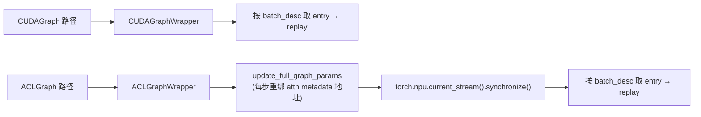
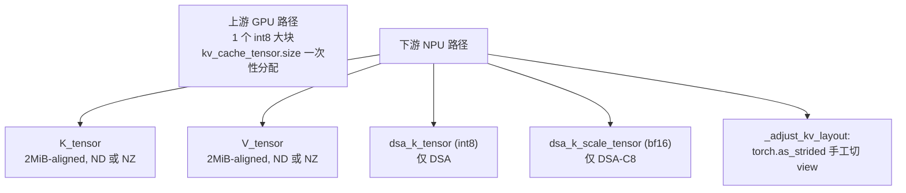
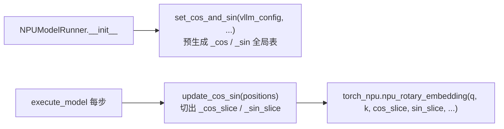

# vLLM-Ascend Model Runner 硬件强耦合点详解:为什么必须在下游重写

> **文档版本**: 1.0
> **分析代码版本**: 当前 workspace 本地 `vllm` / `vllm-ascend` 源码
> **最后更新**: 2026-06-07

---

## 文档概述

本文档以 [vllm/v1/worker/gpu_model_runner.py](vllm/vllm/v1/worker/gpu_model_runner.py)(约 7500 行) 和 [vllm_ascend/worker/model_runner_v1.py](vllm-ascend/vllm_ascend/worker/model_runner_v1.py)(约 4500 行) 为对照,讲清楚 vllm-ascend 为什么不能像 LoRA / Quantization plugin 那样**只在边缘做一个适配层**,而是必须在下游把 `NPUModelRunner` 整套**关键路径**(`__init__` / `_prepare_inputs` / `execute_model` / `_dummy_run` / `_allocate_kv_cache_tensors` / `_reshape_kv_cache_tensors` / `capture_model` / `_sample`)全部 override。

**面试官常问**:

> "vllm-ascend 既然是 OOT (out-of-tree) backend,为什么不复用上游的 `GPUModelRunner`?哪几个改动是『绕不过去』的?"

短答:`NPUModelRunner` 在源码层面**确实** `extends GPUModelRunner` ([model_runner_v1.py:247](vllm-ascend/vllm_ascend/worker/model_runner_v1.py#L247)),但热路径几乎被全部重写——上游父类的 `__init__` 本身就要调用 `torch.cuda.Stream/Event/synchronize`,以致下游不得不包一层 [_torch_cuda_wrapper()](vllm-ascend/vllm_ascend/worker/model_runner_v1.py#L4464) 把 `torch.cuda.*` 临时 monkey-patch 成 `torch.npu.*` 才能调 `super().__init__()`。 这种"父类一行 cuda API 就触发整体替换"的局面有 10 处。它们都属于硬件强耦合——不是写法风格差异,而是**昇腾硅片 / CANN runtime / torch_npu 算子签名**本身决定的,不可能通过简单的 hook/subclass 抽出来。本文逐点拆解。

**目标读者**:理解 vllm v1 engine core / scheduler / model runner 三段式,知道 CUDA graph、KV paging、Triton、FlashAttention/FlashInfer 是什么。读完应该能在面试里讲清楚:

1. ACL Graph 和 CUDA Graph 的捕获/分发为什么不能复用;
2. NPU KV cache 为什么要 2 MiB 对齐 + K/V 分离 + NZ 格式;
3. AscendAttentionState 这个状态机为什么必须存在;
4. MoE 的 MC2 / FUSED_MC2 通信路径和 NCCL all-to-all 的差异;
5. RoPE / Sampler / Stream / Triton slot-mapping 这些细节为什么必须改。

**阅读指南**:

| 部分 | 内容 |
|------|------|
| 第一部分 | 父子关系全景图与 `_torch_cuda_wrapper` 的存在原因 |
| 第二部分 | 图捕获:CUDA Graph → ACL Graph |
| 第三部分 | KV cache 物理布局:NZ + 2 MiB 对齐 + K/V 分离 |
| 第四部分 | Attention 算子族 + `AscendAttentionState` 状态机 |
| 第五部分 | MoE 通信:MC2 / FUSED_MC2 vs NCCL all-to-all |
| 第六部分 | RoPE 算子签名:cos/sin 分离 + 每步重算 |
| 第七部分 | Sampler 需要预分配工作区 |
| 第八部分 | Stream / Event / 同步原语全栈 NPU 化 |
| 第九部分 | block_table:没有 Triton + hybrid blocks |
| 第十部分 | Spec decode 整套替换 |
| 第十一部分 | PCP 与多硅片型号(A2/A3/A5/310P)分支 |
| 第十二部分 | 哪些差异**不是**重写的根本原因 |
| 第十三部分 | QA |

---

# 第一部分: 父子关系全景与 `_torch_cuda_wrapper`

## 1.1 形式上的继承

[model_runner_v1.py:247](vllm-ascend/vllm_ascend/worker/model_runner_v1.py#L247) 声明:

```python
class NPUModelRunner(GPUModelRunner):
    def __init__(self, vllm_config: VllmConfig, device: torch.device):
        ...
        with _torch_cuda_wrapper():
            super().__init__(vllm_config, device)
```

形式上是子类。但翻一下 override 列表,大多数热路径方法都自己重写了一遍:

| 方法 | 是否 override | 原因(后文展开) |
|------|---------|----------------|
| `__init__` | 是 | 多硬件属性 + ACL stream + 多 buffer + PCP 维 |
| `_prepare_inputs` | 是 | FIA query_start_loc +2 padding、PCP padding、状态机切换 |
| `execute_model` | 是 | `set_ascend_forward_context` + `update_cos_sin` + MC2 mask + ACL replay |
| `_dummy_run` | 是 | profile 时多跑一遍 mc2_tokens_capacity |
| `load_model` | 是 | weight_prefetch / quant / EPLB / msprobe |
| `initialize_kv_cache` | 是 | NZ + 2 MiB 对齐 + K/V 分离 |
| `_allocate_kv_cache_tensors` | 是 | 同上 |
| `_reshape_kv_cache_tensors` | 是 | `_adjust_kv_layout` 手工 stride |
| `capture_model` | 是 | `ACLGraphWrapper`、`update_full_graph_params` |
| `_sample` | 是 | `sampler.prepare_sampling(max_topk)` |

## 1.2 `_torch_cuda_wrapper` 的存在原因

[model_runner_v1.py:4464-4506](vllm-ascend/vllm_ascend/worker/model_runner_v1.py#L4464-L4506) 是一段非常"诚实"的 monkey-patch:

```python
@contextmanager
def _torch_cuda_wrapper():
    class _EventPlaceholder:
        def __init__(self, *args, **kwargs) -> None:
            self.record = lambda *a, **kw: None
            self.synchronize = lambda *a, **kw: None
            self.wait = lambda *a, **kw: None
            self.query = lambda *a, **kw: True
    class _StreamPlaceholder: ...
    try:
        torch.Event = torch.npu.Event
        torch.cuda.Event = torch.npu.Event
        torch.cuda.Stream = torch.npu.Stream
        torch.cuda.default_stream = torch.npu.default_stream
        torch.cuda.current_stream = torch.npu.current_stream
        torch.cuda.stream = torch.npu.stream
        torch.cuda.synchronize = torch.npu.synchronize
        torch.cuda.mem_get_info = torch.npu.mem_get_info
        yield
    finally:
        ...
```

**读码要点**:`super().__init__()` 必须在这个 wrapper 里调,否则父类内部 `torch.cuda.Stream(...)` 会直接抛 "no CUDA device" 异常。这一处一行就证明了:**只要父类内部碰到任何 `torch.cuda.*`,子类就得介入**——下面所有 10 条原因,本质都是"父类的代码路径里嵌着 CUDA 强假设"。

---

# 第二部分: 图捕获——CUDA Graph → ACL Graph

## 2.1 两者的捕获模型不同

`torch.cuda.graph` 的语义是"把当前 stream 上的所有 kernel launch 录下来,replay 时复用 launch 序列"。NPU 没有这个语义,昇腾用的是 ACL Graph(底层是 CANN 的 capture/launch 接口)。封装类完全不同:

| 上游 | 下游 |
|------|------|
| `CUDAGraphWrapper` ([vllm/compilation/cuda_graph.py:145](vllm/vllm/compilation/cuda_graph.py#L145)) | `ACLGraphWrapper` ([vllm-ascend/vllm_ascend/compilation/acl_graph.py:38](vllm-ascend/vllm_ascend/compilation/acl_graph.py#L38)) |
| `torch.cuda.graph(...)` | `torch.npu.graph(...)` |
| `CUDAGraphMode.PIECEWISE / FULL` | `CUDAGraphMode.PIECEWISE / FULL`(枚举复用但语义重映射) |
| 单一 dispatch:按 batch_descriptor 选 entry | 同 + 额外的 `update_full_graph_params` 步骤 |

[model_runner_v1.py:3445-3453](vllm-ascend/vllm_ascend/worker/model_runner_v1.py#L3445-L3453) 用 `ACLGraphWrapper(self.model, ...)` 替换上游用的 `CUDAGraphWrapper`。

## 2.2 `graph_capture` 上下文换成 NPU stream

[model_runner_v1.py:194-222](vllm-ascend/vllm_ascend/worker/model_runner_v1.py#L194-L222):

```python
@contextmanager
def graph_capture(device: torch.device):
    graph_capture_context = GraphCaptureContext(torch.npu.Stream(device=device))
    stream = graph_capture_context.stream
    curr_stream = torch.npu.current_stream()
    if curr_stream != stream:
        stream.wait_stream(curr_stream)
    with torch.npu.stream(stream), maybe_ca_context:
        yield graph_capture_context
```

这是个独立的 NPU 版 `graph_capture`,因为上游版本里 `torch.cuda.Stream / torch.cuda.stream` 在 NPU 上 import 就会失败。

## 2.3 FULL 模式额外的 "rebind params + sync" 步骤

ACL Graph 在捕获时会把 attention metadata 的**张量地址**硬编码进 graph(CUDA Graph 也类似,但 vllm 上游用 fixed-buffer + 索引绕过了这一点)。Ascend 端则**显式**每步执行一次重绑参数:

[model_runner_v1.py:2512-2535](vllm-ascend/vllm_ascend/worker/model_runner_v1.py#L2512-L2535):

```python
def _update_full_graph_params_if_needed(self, ...):
    ...
    update_full_graph_params(...)
    torch.npu.current_stream().synchronize()
```

`torch.npu.current_stream().synchronize()` 是这里**绕不过**的一行——CUDA 路径下完全没有,但 ACL Graph 不做这步就有概率读到上一步的 metadata 缓存。

## 2.4 小结(2)



这意味着任何依赖图捕获的优化(PIECEWISE / FULL / Eagle draft 的 attn graph)在 Ascend 上都需要走 `ACLGraphWrapper`,而 wrapper 又只能在 runner 自己持有的 model 上实例化——根本无法让上游 `GPUModelRunner.capture_model` 直接复用。

---

# 第三部分: KV cache 物理布局——NZ + 2 MiB 对齐 + K/V 分离

## 3.1 三个 NPU 专属物理约束

[model_runner_v1.py:179](vllm-ascend/vllm_ascend/worker/model_runner_v1.py#L179):

```python
# if true, allow tensor initialization and casting with internal format (e.g., NZ)
torch.npu.config.allow_internal_format = True
```

[vllm-ascend/vllm_ascend/utils.py:54-55](vllm-ascend/vllm_ascend/utils.py#L54-L55):

```python
ACL_FORMAT_FRACTAL_ND = 2
ACL_FORMAT_FRACTAL_NZ = 29
```

NZ(FRACTAL_NZ)是华为达芬奇核为矩阵乘优化的 5 维内存格式,KV cache / 权重经常需要在 ND 和 NZ 间显式 cast 才能命中算子最优 path。 这是 CUDA 一侧完全不存在的概念。

加上两条:

1. **PD 分离(prefill-decode disaggregation)要求 KV 基址 2 MiB 对齐**——因为 KV 跨进程传输用 HCCL/Mooncake 的零拷贝接口,只接受 2 MiB 对齐的 base addr。
2. **K 和 V 必须分别独立 tensor**——HCCL 传输只允许 0 维做 `num_blocks`,不允许 KV 合在一个张量里两个 slice 同时传。

[model_runner_v1.py:3625-3635](vllm-ascend/vllm_ascend/worker/model_runner_v1.py#L3625-L3635) 注释明确:

```python
# NOTE: To support prefill disaggregation, we need to split kvcache tensor into
# k_cache and v cache, and the addr of both are aligned by 2M
```

## 3.2 这导致 `_allocate_kv_cache_tensors` 必须重写

上游 [vllm/v1/worker/gpu_model_runner.py:6981-7011](vllm/vllm/v1/worker/gpu_model_runner.py#L6981-L7011) 只有 30 行:

```python
def _allocate_kv_cache_tensors(self, kv_cache_config: KVCacheConfig):
    kv_cache_raw_tensors: dict[str, torch.Tensor] = {}
    for kv_cache_tensor in kv_cache_config.kv_cache_tensors:
        tensor = torch.zeros(kv_cache_tensor.size, dtype=torch.int8, device=self.device)
        for layer_name in kv_cache_tensor.shared_by:
            kv_cache_raw_tensors[layer_name] = tensor
    ...
```

下游 [model_runner_v1.py:3616-3772](vllm-ascend/vllm_ascend/worker/model_runner_v1.py#L3616-L3772) 是 150 多行,要分别处理:

- **普通 attn**:分配两块独立 K / V tensor,各自 2 MiB 对齐(`_align_memory`);
- **MLA**:按 `nope_head_dim` / `rope_head_dim` 拆 K 缓存为 nope/rope 两块;
- **DSA (Deepseek 稀疏)**:在 K/V 之外再挂 `dsa_k_tensor` 和 `dsa_k_scale_tensor`,两者是不同 dtype(`int8` + `bf16`);
- **Mamba / hybrid attn+mamba / cache_only_layers**:走单 tensor 路径,但仍要对齐;
- **C8 compress 路径**(sparse_c8):再多一份元数据。

## 3.3 `_reshape_kv_cache_tensors` 用 `torch.as_strided` 手切

[model_runner_v1.py:3774-3886](vllm-ascend/vllm_ascend/worker/model_runner_v1.py#L3774-L3886) 里的 `_adjust_kv_layout`:

```python
kv_cache = self._adjust_kv_layout(
    kv_tensor,
    kv_cache_shape_list,
    kv_cache_dtype_list,
    current_kv_cache_spec.page_size_bytes,
    overlap_full_kv_cache=overlap_full_kv_cache,
)
```

这层抽象是 NPU 特有的:同一段 int8 物理内存上,根据 sparse 配置(2-tensor / 3-tensor)生成多个不同 dtype 的 view,且要保证每个 view 起点仍然 2 MiB 对齐——`torch.zeros + .view()` 在 ND 格式下做不到,必须 `as_strided`。

## 3.4 小结(3)



**这一处的 override 是物理层强制的**——KV cache 不只是字节数和形状,而是和昇腾 HCCL 传输接口签了"2 MiB 对齐 + K/V 分裂"的契约,任何尝试在父类里抽出"`alloc_kv(size, dtype)` 钩子"的做法都会丢掉这些约束。

---

# 第四部分: Attention 算子族 + `AscendAttentionState` 状态机

## 4.1 整族 backend 替换,不是单点 backend 切换

[model_runner_v1.py:106-110](vllm-ascend/vllm_ascend/worker/model_runner_v1.py#L106-L110):

```python
from vllm_ascend.attention.attention_v1 import AscendAttentionBackend, AscendAttentionState
from vllm_ascend.attention.context_parallel.dsa_cp import AscendDSACPMetadataBuilder
from vllm_ascend.attention.dsa_v1 import AscendDSAMetadataBuilder
from vllm_ascend.attention.mla_v1 import AscendMLABackend
from vllm_ascend.attention.utils import AscendCommonAttentionMetadata, using_paged_attention
```

这五个 import 拼起来,**等价于**把上游 `FlashAttentionBackend / FlashInferBackend / MLABackend / TritonBackend` 一整套全换掉。对应的 NPU 算子是:

- 普通 attn → `npu_fused_infer_attention_score`(FIA)
- MLA → `npu_mla_prolog` / `npu_mla_attention`
- DSA(Deepseek V3.2 稀疏) → `npu_sparse_attention_cp`

## 4.2 `AscendAttentionState` 是上游没有的状态机

[vllm-ascend/vllm_ascend/attention/attention_v1.py:143-148](vllm-ascend/vllm_ascend/attention/attention_v1.py#L143-L148):

```python
class AscendAttentionState(Enum):
    PrefillNoCache = 0
    PrefillCacheHit = 1
    DecodeOnly = 2
    ChunkedPrefill = 3
    SpecDecoding = 4
```

为什么需要这个枚举?因为 NPU 端不同 attn 算子对 metadata 形状的要求差异很大(decode-only 要求 `q_len=1`,prefill-no-cache 要求 `kv_len=q_len`,spec-decoding 要求 `q_len=draft_step+1`),而**算子选择又依赖运行时 batch 的形状**。上游靠 FlashInfer/FA 内部的 dispatcher 处理,Ascend 没有这层 dispatcher,必须 runner 自己**显式**判断状态。

[model_runner_v1.py:1289-1318](vllm-ascend/vllm_ascend/worker/model_runner_v1.py#L1289-L1318) `_build_attn_state(...)` 根据 batch 切换枚举值,然后 [:2723-2913](vllm-ascend/vllm_ascend/worker/model_runner_v1.py#L2723-L2913) `_build_attention_metadata` 按枚举分支造 metadata。

## 4.3 FIA 算子要求 `query_start_loc` 额外 +2

[model_runner_v1.py:271-274](vllm-ascend/vllm_ascend/worker/model_runner_v1.py#L271-L274):

```python
# NOTE: For FULL mode we change +1 to +2 to reserve extra space for padding.
# See _pad_query_start_loc_for_fia.
self.query_start_loc = self._make_buffer(
    self.max_num_reqs + 2, dtype=torch.int32,
)
```

原因在 [model_runner_v1.py:636-677](vllm-ascend/vllm_ascend/worker/model_runner_v1.py#L636-L677) `_pad_query_start_loc_for_fia` 注释里写得很清楚:

```python
"""
This function is only designed to satisfied the constraint that when the layout is TND,
the first dimension of `hidden_states` must equal the last element of `actual_seq_lengths_q`.
"""
```

FIA 的 TND 布局要求 `actual_seq_lengths_q` 的最后一个元素必须等于 `hidden_states` 第一维。当 cudagraph 模式下 batch 被 padding 到固定大小时,padding 区间也得有一段"假"的 query,所以要插入 dummy request,`query_start_loc` buffer 也要多预留 1 位——这两个 +1 叠加成了 +2。

这一行 buffer size 改动是 runner `__init__` 里硬编码的,**没法用 hook 表达**:不仅子类 `_make_buffer` 要 +2,父类后续所有用到 `query_start_loc` 的方法都要适配,而上游父类完全不知道这个尺寸偏移。

## 4.4 小结(4)

| 维度 | 上游 GPU | 下游 NPU |
|------|----------|----------|
| 选 backend | `get_attn_backend()` 一次性决定 | 同 + 运行时按 `AscendAttentionState` 切 |
| Metadata builder | `FlashAttentionMetadataBuilder` 等 | `AscendCommonAttentionMetadataBuilder` 等(整族新写) |
| `query_start_loc` 长度 | `max_num_reqs + 1` | `max_num_reqs + 2`(FIA TND 约束) |
| 状态枚举 | 由 backend 内部隐藏 | 显式 5 态机,runner 主流程感知 |

---

# 第五部分: MoE 通信——MC2 / FUSED_MC2 vs NCCL all-to-all

## 5.1 MoE 通信模式不是"all-to-all"的同义词

上游 MoE EP 路径在 GPU 上做 NCCL `all_to_all_single`,昇腾上的等价物叫 **MC2**(Multi-Card 2 通信原语,把 token dispatch + expert compute + token combine 在 HCCL 里融合)和 **FUSED_MC2**(进一步把 fused MLP 也融进去)。这是 [vllm-ascend/vllm_ascend/ascend_forward_context.py:26-30](vllm-ascend/vllm_ascend/ascend_forward_context.py#L26-L30) 的核心枚举:

```python
class MoECommType(Enum):
    ALLGATHER = 0
    MC2 = 1
    ALLTOALL = 2
    FUSED_MC2 = 3
```

## 5.2 每步都要 `select_moe_comm_method`

[ascend_forward_context.py:233-316](vllm-ascend/vllm_ascend/ascend_forward_context.py#L233-L316) 里 `select_moe_comm_method(num_tokens, vllm_config, is_draft_model)` 会根据 batch 内 token 数 / DP/EP 拓扑 / decode-or-prefill 状态,选 4 种模式之一:

- 小 batch 走 `MC2`(融合通信优势大);
- 大 batch 走 `ALLTOALL` 或 `ALLGATHER`(带宽更优);
- 草稿模型(spec decode)走 `FUSED_MC2`。

这意味着 runner 主路径**每步都要算一遍 comm mode**,而不是上游那种"模型加载时定型"。

## 5.3 `mc2_tokens_capacity` 是 profile 时多跑一遍的额外代价

[model_runner_v1.py:432-433](vllm-ascend/vllm_ascend/worker/model_runner_v1.py#L432-L433):

```python
set_mc2_tokens_capacity(vllm_config, self.max_num_reqs, self.uniform_decode_query_len)
set_mc2_mask(vllm_config, self.device)
```

[model_runner_v1.py:3373-3377](vllm-ascend/vllm_ascend/worker/model_runner_v1.py#L3373-L3377) 在 profile-run 阶段还要**额外**跑一次 `_dummy_run(mc2_tokens_capacity, ...)`,因为 MC2 算子的工作区大小和 token 上限直接绑定,profiling 时要把它撑到峰值用量。

## 5.4 整个 forward 用 `set_ascend_forward_context` 替换

[model_runner_v1.py:2006](vllm-ascend/vllm_ascend/worker/model_runner_v1.py#L2006):

```python
with (
    record_function_or_nullcontext("forward"),
    set_ascend_forward_context(
        attn_metadata,
        self.vllm_config,
        ...
        aclgraph_runtime_mode=cudagraph_mode,
        ...
    ),
):
```

`set_ascend_forward_context` 是 `set_forward_context` 的**完全替换**(不是包装),它在 ContextVar 里塞了一个额外的 `moe_comm_type / mc2_mask / mrv2_in_profile_run` 字典,所有 MoE layer 在 forward 里用 `get_forward_context().moe_comm_type` 决定走哪条 kernel——这条胶水代码不可能在父类预留 hook。

---

# 第六部分: RoPE 算子签名——cos/sin 分离 + 每步重算

## 6.1 torch_npu 的 rotary 算子签名问题

[vllm-ascend/vllm_ascend/ops/rotary_embedding.py:42-50](vllm-ascend/vllm_ascend/ops/rotary_embedding.py#L42-L50) 的注释最有说服力:

```python
# Currently, rope ops used on npu requires detached cos && sin as inputs.
# However, RotaryEmbedding in vllm use cos_sin_cache as a whole variable.
# So we have to preprocess cos_sin_cache int cos && sin. In the future,
# we shall implement a new rope ops which accept cos_sin_cache as inputs.
# NOTE(Angazenn): MLA && SFA models uses attn_metadata to pass cos && sin
# to rope in AscendMLA(SFA)Impl. However, since rope is isolated from
# AscendAttentionBackendImpl for GQA models, we cannot pass cos && sin by
# attn_metadata. This causes that rope in GQA models must pass cos && sin
# by different approaches.
```

`torch_npu.npu_rotary_embedding(q, k, cos, sin, ...)` 算子签名要求 cos / sin 两个**独立** tensor,而上游算子接受融合后的 `cos_sin_cache`(一个 tensor 上半 cos 下半 sin)。所以 runner 必须维护两套 device 端缓存。

## 6.2 init 阶段一次性铺平 + forward 阶段每步更新

[model_runner_v1.py:431](vllm-ascend/vllm_ascend/worker/model_runner_v1.py#L431):

```python
set_cos_and_sin(vllm_config, self.max_num_reqs, self.uniform_decode_query_len, self.dtype, self.device)
```

[model_runner_v1.py:1978](vllm-ascend/vllm_ascend/worker/model_runner_v1.py#L1978) 在 `execute_model` 主路径:

```python
# update global cos, sin
update_cos_sin(positions)
```

`update_cos_sin(positions)` 用全局变量 `_cos_slice / _sin_slice` 按 `positions` 索引出当前 batch 用到的那一段——这是 NPU 端把"cos/sin lookup"从算子内部搬到 runner 主路径的**直接代价**。GPU 上 `apply_rotary_pos_emb_inplace` 在 attention layer 内部完成查表,runner 不感知。Ascend 不行,必须 runner 自己提前查好。

## 6.3 小结(6)



这一步在父类里完全没有对应位置,**只能在子类 forward 主路径里硬插**。

---

# 第七部分: Sampler 需要预分配工作区

## 7.1 NPU top-k 算子需要 workspace

[model_runner_v1.py:2341-2353](vllm-ascend/vllm_ascend/worker/model_runner_v1.py#L2341-L2353):

```python
if self.input_batch.sampling_metadata.top_k is not None and get_ascend_config().enable_reduce_sample:
    max_topk = self.input_batch.top_k_cpu[self.input_batch.top_k_cpu < logits.shape[1]].max()
    self.sampler.prepare_sampling(max_topk)
return self.sampler(
    logits=logits,
    sampling_metadata=sampling_metadata,
)
```

[vllm-ascend/vllm_ascend/sample/sampler.py:76-77](vllm-ascend/vllm_ascend/sample/sampler.py#L76-L77):

```python
def prepare_sampling(self, top_k):
    self.topk_topp_sampler.prepare_sampling(top_k)
```

NPU 的 `npu_topk_topp_sample` 需要预先分配一块工作区(workspace),其大小**正比于当前 batch 内的最大 top_k**——如果 top_k 是动态的,就要**每步**根据 `input_batch.top_k_cpu` 算一次 `max_topk` 再传给算子。

GPU 上的 `flashinfer.sampling` 工作区是算子内部自动管理的,上游 `self.sampler(logits, ...)` 一行直接调用。Ascend 不行,必须 runner 主路径承担"算 max_topk + 通知 sampler"的协议。

## 7.2 RejectionSampler 同样的协议

[model_runner_v1.py:2353-2358](vllm-ascend/vllm_ascend/worker/model_runner_v1.py#L2353-L2358):

```python
if ... top_k ...:
    max_topk = ...
    self.rejection_sampler.prepare_sampling(max_topk)
sampler_output = self.rejection_sampler(spec_decode_metadata, None, logits, sampling_metadata)
```

Rejection sampler(用于 spec decode 的 draft-verify)也走同样的预分配协议。

---

# 第八部分: Stream / Event / 同步原语全栈 NPU 化

## 8.1 runner 内部的 stream/event 类型

Runner 里所有异步对象都是 `torch.npu.*`:

| 用途 | 代码位置 | 类型 |
|------|----------|------|
| seq_lens 异步 D→H copy event | [:421](vllm-ascend/vllm_ascend/worker/model_runner_v1.py#L421) | `torch.npu.Event` |
| 设备同步 | [:526-530](vllm-ascend/vllm_ascend/worker/model_runner_v1.py#L526-L530) | `torch.npu.synchronize` |
| draft_token_ids 异步 copy stream | [:1405-1406](vllm-ascend/vllm_ascend/worker/model_runner_v1.py#L1405-L1406) | `torch.npu.Stream` |
| sampling done event | [:2167](vllm-ascend/vllm_ascend/worker/model_runner_v1.py#L2167) | `torch.npu.Event` |
| async exponential 全局 stream | [sampler.py:81-92](vllm-ascend/vllm_ascend/sample/sampler.py#L81-L92) | `torch.npu.stream(global_stream())` |

## 8.2 `_init_device_properties` 退化

[model_runner_v1.py:526-530](vllm-ascend/vllm_ascend/worker/model_runner_v1.py#L526-L530) 把 `num_sms` 显式设成 `None`——NPU 没有 SM 概念(对应物是 AI Core,数量也对得上,但 torch_npu 不暴露这个属性):

```python
def _init_device_properties(self):
    self.num_sms = None
def _sync_device(self):
    torch.npu.synchronize()
```

任何上游里依赖 `self.num_sms`(比如 SM-aware kernel scheduling)的逻辑,在 Ascend 上都要 fallback。

## 8.3 这一栈不能简单"在父类里加个抽象"

可能有人会想:能不能让父类用 `device_runtime` 抽象,统一 `device_runtime.Stream / device_runtime.Event`?短期内不行——`torch.cuda.Stream` 在 PyTorch 里是个 C++ 绑定类,和 `torch.npu.Stream` 不共享父类,duck-typing 也不一致(`record` / `wait_stream` 的 kwargs 微妙不同)。所以下游目前的策略是 monkey-patch + 在子类里硬替换。

---

# 第九部分: block_table——没有 Triton + hybrid blocks

## 9.1 上游用 Triton kernel 算 slot mapping

[vllm/v1/worker/block_table.py:150](vllm/vllm/v1/worker/block_table.py#L150):

```python
_compute_slot_mapping_kernel[(num_reqs + 1,)](
    num_tokens, max_num_tokens,
    query_start_loc_ptr, positions_ptr,
    block_table_ptr, block_table_stride,
    block_size, slot_mapping_ptr,
    TOTAL_CP_WORLD_SIZE, TOTAL_CP_RANK,
    CP_KV_CACHE_INTERLEAVE_SIZE, PAD_ID, BLOCK_SIZE,
)
```

Triton 在 NPU 上没有等价物(Ascend 有 `ascend-triton` 项目但成熟度还不到生产)。

## 9.2 下游改成 numpy + hybrid_blocks 概念

[vllm-ascend/vllm_ascend/worker/block_table.py:53-79](vllm-ascend/vllm_ascend/worker/block_table.py#L53-L79):

```python
# If kernel_sizes is None or [0], use physical block size (no splitting)
if kernel_sizes is None or kernel_sizes == [0]:
    self.block_size = block_size
    self.logical_block_size = block_size
    self.blocks_per_phys_block = 1
    self.use_hybrid_blocks = False
else:
    # Find the first kernel size that divides physical_block_size evenly
    for kernel_size in kernel_sizes:
        if kernel_size > 0 and self.physical_block_size % kernel_size == 0:
            selected_kernel_size = kernel_size
            break
    ...
    self.block_size = selected_kernel_size
    self.logical_block_size = selected_kernel_size
    self.blocks_per_phys_block = self.physical_block_size // self.logical_block_size
    if self.blocks_per_phys_block > 1:
        self.use_hybrid_blocks = True
```

**hybrid_blocks 是 NPU 独有的概念**:NPU paged-attention 算子(`npu_paged_attention`)只接受**特定 block_size 集合**(128/256 等),而 KV cache manager 又希望用更大的 block 摊薄管理开销。解决办法是:KV manager 用大 block(physical),attention 算子用能整除的小 block(logical),逻辑表是物理表的细分。GPU 路径没有这个约束(任意 block_size 都能跑)。

## 9.3 slot mapping 走 numpy 路径

[vllm-ascend/vllm_ascend/worker/block_table.py:138-230](vllm-ascend/vllm_ascend/worker/block_table.py#L138-L230) 大量逻辑在 CPU 上用 numpy 算完再 H→D。性能上略差于 Triton kernel,但**没得选**——这就是物理事实。

---

# 第十部分: Spec decode 整套替换

## 10.1 import 列表自带答案

[model_runner_v1.py:129-140](vllm-ascend/vllm_ascend/worker/model_runner_v1.py#L129-L140):

```python
from vllm_ascend.spec_decode import get_spec_decode_method
from vllm_ascend.spec_decode.dflash_proposer import AscendDflashProposer
from vllm_ascend.spec_decode.draft_proposer import AscendDraftModelProposer
from vllm_ascend.spec_decode.eagle_proposer import AscendEagleProposer
from vllm_ascend.spec_decode.extract_hidden_states_proposer import AscendExtractHiddenStatesProposer
from vllm_ascend.spec_decode.medusa_proposer import AscendMedusaProposer
from vllm_ascend.spec_decode.ngram_proposer import AscendNgramProposer
from vllm_ascend.spec_decode.ngram_proposer_npu import AscendNgramProposerNPU
from vllm_ascend.spec_decode.suffix_proposer import AscendSuffixDecodingProposer
```

8 个 proposer 一个不漏全是 `Ascend*` 版本。原因:每个 proposer 在树形 attention / draft scoring / verify 阶段都有自己的算子调用,**全部依赖 FlashAttention 或 Triton**。

## 10.2 `_set_up_drafter` 类型签名也变了

[model_runner_v1.py:532-564](vllm-ascend/vllm_ascend/worker/model_runner_v1.py#L532-L564) `_set_up_drafter` 的方法签名只接受 Ascend proposer。这意味着上游 spec_decode 路径的任何更新(比如新加一个 proposer 类),Ascend 端都要写对应的 `Ascend*` 版本才能跟上。

## 10.3 Draft graph 也是 ACL Graph

[acl_graph.py:226-273](vllm-ascend/vllm_ascend/compilation/acl_graph.py#L226-L273) `update_full_graph_params` 还要支持 `set_draft_graph_params` ——draft 模型也走 ACL Graph 捕获,所以 update_full_graph_params 要分别维护 main / draft 两套参数表。

---

# 第十一部分: PCP 与多硅片型号(A2/A3/A5/310P)分支

## 11.1 PCP 是上游没有的并行维度

PCP = Prefill Context Parallel,昇腾特有的"长 prompt prefill 沿序列维切分"的并行轴(类似 Megatron 的 Sequence Parallel,但绑在 prefill 阶段)。

[model_runner_v1.py:253-256](vllm-ascend/vllm_ascend/worker/model_runner_v1.py#L253-L256):

```python
max_pcp_pad_tokens = (
    vllm_config.parallel_config.prefill_context_parallel_size * 2 * vllm_config.scheduler_config.max_num_seqs
)
vllm_config.scheduler_config.max_num_batched_tokens += max_pcp_pad_tokens
```

[model_runner_v1.py:363-380](vllm-ascend/vllm_ascend/worker/model_runner_v1.py#L363-L380) 实例化 `PCPManager`:

```python
if self.pcp_size > 1:
    self.model_config.max_model_len += 2 * self.pcp_size * self.max_num_reqs

if self.pcp_size * self.dcp_size > 1:
    max_buffer_num_tokens = self.max_num_tokens + self.max_num_reqs * 2 * self.pcp_size
    self.pcp_manager = PCPManager(self.pcp_size, ...)
```

`max_model_len` 和 `max_num_batched_tokens` 这种**核心 budget** 字段都要因 PCP 改写,父类完全感知不到。

## 11.2 不同昇腾型号(A2/A3/A5/310P)的 KV layout 不同

[model_runner_v1.py:3857-3873](vllm-ascend/vllm_ascend/worker/model_runner_v1.py#L3857-L3873):

```python
if get_ascend_device_type() in {AscendDeviceType.A5}:
    indexer_full_shape = self.attn_backend.get_kv_cache_shape(...)
    kv_cache_shape_list = [indexer_k_shape, indexer_scale_shape, indexer_full_shape]
    kv_cache_dtype_list = [
        current_kv_cache_spec.dtype,
        current_kv_cache_spec.scale_dtype,
        current_kv_cache_spec.dtype,
    ]
    overlap_full_kv_cache = True
else:
    kv_cache_shape_list = [indexer_k_shape, indexer_scale_shape]
    ...
    overlap_full_kv_cache = False
```

A5 上的 DSA 稀疏路径有 3 个 sub-tensor(K + scale + full),其他型号只有 2 个(K + scale)。这是芯片侧 sparse indexer 算子的形状差异**直接**反映到 runner 主路径。

[vllm-ascend/vllm_ascend/worker/worker.py:276-277](vllm-ascend/vllm_ascend/worker/worker.py#L276-L277) 还要 `setup_ascend_local_comm_res(...)` 初始化型号相关的本地通信资源(memory pool / mailbox)。这些都是 GPU 一侧没有概念的状态。

---

# 第十二部分: 哪些差异**不是**重写的根本原因

公平地说,下游 runner 里有一部分内容其实**理论上可以**通过 hook 抽象出来,只是历史/工程便利让它们也被一并拉进来:

| 模块 | 是否硬件强耦合 | 是否本可以用 hook | 说明 |
|------|---------------|-------------------|------|
| **EPLB**(动态专家路由) | 否 | 是 | 算法逻辑,不涉及算子 |
| **msprobe / PrecisionDebugger** | 否 | 是 | 调试工具,可作 hook |
| **KV-transfer 对齐**(Mooncake) | 部分 | 部分 | 2 MiB 对齐确实和硬件相关,但 transfer engine 可抽象 |
| **LoRA** | 否 | 是 | 上游已有 `LoRAModelRunnerMixin` 可复用 |
| **`use_compress` / `compress_ratios`** | 部分 | 是 | KV 压缩 ratio 是配置,只有具体压缩算子和硬件强相关 |

但**第二到第十一部分**列出的 10 项是真正的"绕不过去"——任何"只写适配层、复用 `GPUModelRunner`"的方案都会在这 10 处的某一处崩塌。

---

# 第十三部分: QA

**Q1: vllm-ascend 不是早期版本完全平替 vllm 的吗?为什么现在变成了下游 fork?**

A: 早期 vllm v0(没有 v1 model runner 概念)时,vllm-ascend 通过 `Backend` 抽象就能塞进去。v1 改成"统一 runner 主循环 + backend 只负责 attn kernel"后,runner 主循环里嵌入了大量 CUDA 强假设(stream、graph、Triton slot mapping、FlashInfer sampler),于是无法继续复用。本质是上游 v1 牺牲了部分通用性换吞吐。

**Q2: 那些 hook-able 的部分,为什么 vllm-ascend 不向上游提 PR 抽出来?**

A: 部分确实在提(比如 `PlatformInterface`、`set_forward_context` 钩子),但上游的接受标准是"不能让 GPU 路径慢下来"。抽象 hook 意味着多一层 dispatch overhead,在 GPU 上一旦回归就拒绝合入。这不是技术问题,是 owner 的 KPI 问题。

**Q3: PCP 为什么不是 Sequence Parallel(SP)?**

A: SP 是把每层 transformer 的 norm/dropout 沿 sequence 维切;PCP 是把整段 prefill 沿 sequence 维切到多卡,**只在 prefill 阶段**生效,decode 阶段退化为 TP/DP。PCP 还要负责把切完的 KV 在 prefill 结束时拼回,涉及额外 HCCL 通信。两者不是一回事。

**Q4: ACL Graph 和 CUDA Graph 的核心差异是什么?**

A: 三点:
1. **捕获边界**:CUDA Graph 录的是 kernel launch 序列,ACL Graph 录的是 task 序列(`TaskAbi` 抽象);
2. **参数绑定**:CUDA Graph 用 `graph_node_set_params` 在 replay 前更新;ACL Graph 需要 runner 显式 `update_full_graph_params` + sync;
3. **stream 语义**:`torch.cuda.graph(stream=...)` 接受 stream;`torch.npu.graph()` 用全局 stream,要求外部已经进入 `torch.npu.stream(s)` context。

**Q5: 如果让你重新设计上游的 `GPUModelRunner`,怎么让 vllm-ascend 不用 fork?**

A: 至少要做三件事:
1. **抽象 `DeviceRuntime` 接口**:把 `Stream/Event/synchronize/mem_get_info` 用统一接口包起来,后端注册实现;
2. **抽象 `GraphRuntime` 接口**:把 `CUDAGraphWrapper` 抽出 `wrap / capture / replay / update_params` 4 个方法,允许 ACL/HIP 后端各自实现;
3. **抽象 `KVCacheAllocator`**:把"算 size → 分配 → reshape"拆成可注入的策略,允许 NPU 注入 2 MiB 对齐 + K/V split 逻辑。

这三件事大约值 3 个季度的工程量,而且需要上游 maintainer 强力支持。短期不太可能发生,所以下游 fork 是稳定状态。

---

# 附录 B: 对照——vllm-omni 也 fork 了 model runner,但完全是另一种原因

打开 [vllm-omni/vllm_omni/worker/gpu_model_runner.py](vllm-omni/vllm_omni/worker/gpu_model_runner.py) 会看到一个**同样继承 `GPUModelRunner`** 的 `OmniGPUModelRunner`(只有约 1870 行)。但仔细看它 override 的方法,会发现 vllm-omni 的 fork 动机和 vllm-ascend **完全正交**——它属于 *orchestration-driven*,而非 *hardware-driven*。

## B.1 OmniGPUModelRunner 在 override 什么

[vllm-omni/vllm_omni/worker/gpu_model_runner.py:51](vllm-omni/vllm_omni/worker/gpu_model_runner.py#L51) `class OmniGPUModelRunner(GPUModelRunner)`,关键 override:

| 方法 | 干什么 | 类型 |
|------|---------|------|
| `__init__` | 多挂 `model_intermediate_buffer / omni_prefix_cache` | 编排 |
| `initialize_metadata_builders` | FA3 scheduler_metadata buffer 扩容 + 挂 `OmniTensorPrefixCache` | 编排 |
| `load_model` | 调 `_init_talker_mtp()` + `_prewarm_attention_capture_workspaces()` | 编排 |
| `_init_talker_mtp` | 给 talker MTP head 单独建 buffer / 单独包 CUDA graph wrapper | Stage 接缝 |
| `_init_mrope_positions` / `_calc_mrope_positions` / `_fixup_precomputed_mrope_decode_positions` | 多模态(omni)的 MRoPE 位置编码,而非语言模型默认 RoPE | 多模态 |
| `_update_states` | 多管 OmniPayload 字段、stage 接缝、`additional_information` 同步 | 编排 |
| `extract_multimodal_outputs` | 从 `hidden_states / OmniOutput` 抽出 codec / audio / image | 多模态 |
| `_dummy_run` | 多模态 dummy(扩展形状到 image/audio batch) | 多模态 |
| `_preprocess` | 多 stage payload 解码 / batch 分流 | 编排 |
| `_talker_mtp_forward` | Talker 的多 codebook MTP 串行 forward | Stage 接缝 |
| `_decode_and_store_request_payloads` / `_gather_runtime_additional_information` / `_sync_local_stage_payloads` | 跨 stage 数据落地 | 编排 |
| `_model_forward` | 包一层"按 stage 类型调不同 forward 签名" | Stage 接缝 |

可以看到分类高度集中在三个动机:**(a) stage 之间交换 payload,(b) 多模态字段(MRoPE/codes/audio),(c) Talker 这种带 MTP head 的特殊串行 AR**。**完全不涉及**:CUDA Graph 替换、KV cache 物理布局、Stream/Event 类型、Triton 替换、attention 算子族替换。

## B.2 关键差异:`super().load_model` 是直接用的

[vllm-omni/vllm_omni/worker/gpu_model_runner.py:144-147](vllm-omni/vllm_omni/worker/gpu_model_runner.py#L144-L147):

```python
def load_model(self, *args, **kwargs) -> None:
    super().load_model(*args, **kwargs)
    self._init_talker_mtp()
    self._prewarm_attention_capture_workspaces()
```

注意它**直接 `super().load_model(...)`**,没有任何 monkey-patch、没有 `_torch_cuda_wrapper()` 这种东西。原因正是:它运行在 GPU 上,父类的 `torch.cuda.*` 都能跑通,只需要**叠加**自己的 omni-specific 初始化。

[vllm-omni/vllm_omni/worker/gpu_model_runner.py:107-141](vllm-omni/vllm_omni/worker/gpu_model_runner.py#L107-L141) `initialize_metadata_builders` 也是先 `super()...` 再叠加 `OmniTensorPrefixCache` ——典型的"装饰式 override",而不是 vllm-ascend 那种"几乎全盘重写"。

## B.3 两种 fork 的本质区别

| 维度 | vllm-ascend `NPUModelRunner` | vllm-omni `OmniGPUModelRunner` |
|------|------------------------------|---------------------------------|
| **驱动力** | 硬件强约束(NPU runtime / CANN 算子) | 业务编排(多 stage / 多模态 payload) |
| **能用 `super()` 主路径吗?** | 不能。父类一行 `torch.cuda.Stream` 就崩 | 能。叠加式 override 即可 |
| **是否需要 monkey-patch** | 是(`_torch_cuda_wrapper`) | 否 |
| **是否替换图捕获** | 是(ACL Graph 整套) | 否(继续用 CUDA Graph,只是给 talker_mtp 单独包一层) |
| **是否替换 KV cache 分配** | 是(2 MiB 对齐 + K/V split + NZ) | 否(继续用上游 alloc,只是加 `OmniTensorPrefixCache`) |
| **是否替换 attention backend** | 是(整族) | 否 |
| **是否替换 sampler / RoPE** | 是 | 部分(扩展 MRoPE,sampler 不动) |
| **典型 override 方式** | 完整重写函数体 | `super(); self._omni_xxx(...)` 叠加 |
| **代码量** | 4500 行(覆盖率高) | 1870 行(纯增量) |
| **能不能反向贡献回 vllm?** | 难(GPU 路径会变慢) | 较容易(可通过 hook 抽象,但 vllm 不想接编排概念) |

**一句话总结**: vllm-ascend 的 fork 是**横向替换** runner 的硬件依赖层;vllm-omni 的 fork 是**纵向叠加** runner 之上的多 stage / 多模态编排层。两者 fork 的根本动机正交,所以它们各自的 runner 不存在合并空间——能合并的反而是**它们都依赖的上游 `GPUModelRunner`**,只是上游目前没有提供足够的 hook 让两边都"叠"上去。

## B.4 思考题:vllm-omni + vllm-ascend 怎么叠?

[vllm-omni/vllm_omni/worker/gpu_model_runner.py](vllm-omni/vllm_omni/worker/gpu_model_runner.py) 名字虽然带 GPU,但 vllm-omni 在 NPU 上跑时,需要一个 `OmniNPUModelRunner` 同时继承"NPU 硬件强耦合"和"Omni 编排叠加"两套修改。从仓库结构看,这是 vllm-omni 在 vllm-ascend 之上**再 fork 一次** model runner 的方式——所以才会有 `vllm-omni-npu-upgrade` 之类的工作流,专门维护"把 vllm-ascend 的最新 runner 重新叠 omni 修改"。这也从工程层面证明:vllm 上游缺少的不是"两个 backend 各自能 plug-in 的位置",而是**"plug-in 的拼装机制"**——只要这两类修改能用 mixin 而不是 inheritance 表达,vllm-omni-npu 就不需要每次同步 vllm-ascend 都做一遍人工 rebase。

---

## 附 A: 文件对照清单

| 上游 | 下游 |
|------|------|
| [vllm/v1/worker/gpu_model_runner.py](vllm/vllm/v1/worker/gpu_model_runner.py) | [vllm_ascend/worker/model_runner_v1.py](vllm-ascend/vllm_ascend/worker/model_runner_v1.py) |
| [vllm/v1/worker/gpu_worker.py](vllm/vllm/v1/worker/gpu_worker.py) | [vllm_ascend/worker/worker.py](vllm-ascend/vllm_ascend/worker/worker.py) |
| [vllm/v1/worker/gpu_input_batch.py](vllm/vllm/v1/worker/gpu_input_batch.py) | [vllm_ascend/worker/npu_input_batch.py](vllm-ascend/vllm_ascend/worker/npu_input_batch.py) |
| [vllm/v1/worker/block_table.py](vllm/vllm/v1/worker/block_table.py) | [vllm_ascend/worker/block_table.py](vllm-ascend/vllm_ascend/worker/block_table.py) |
| [vllm/compilation/cuda_graph.py](vllm/vllm/compilation/cuda_graph.py) | [vllm_ascend/compilation/acl_graph.py](vllm-ascend/vllm_ascend/compilation/acl_graph.py) |
| [vllm/forward_context.py](vllm/vllm/forward_context.py) | [vllm_ascend/ascend_forward_context.py](vllm-ascend/vllm_ascend/ascend_forward_context.py) |
| (FlashAttention/FlashInfer 多个文件) | [vllm_ascend/attention/attention_v1.py](vllm-ascend/vllm_ascend/attention/attention_v1.py), [mla_v1.py](vllm-ascend/vllm_ascend/attention/mla_v1.py), [dsa_v1.py](vllm-ascend/vllm_ascend/attention/dsa_v1.py) |
| (FlashInfer sampler) | [vllm_ascend/sample/sampler.py](vllm-ascend/vllm_ascend/sample/sampler.py) |
| (`vllm/model_executor/layers/rotary_embedding/`) | [vllm_ascend/ops/rotary_embedding.py](vllm-ascend/vllm_ascend/ops/rotary_embedding.py) |
| (上游各 proposer) | [vllm_ascend/spec_decode/](vllm-ascend/vllm_ascend/spec_decode/) 下 8 个 `Ascend*Proposer` |
