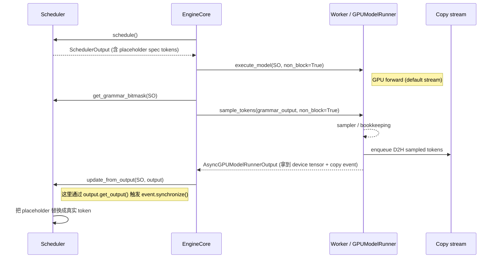
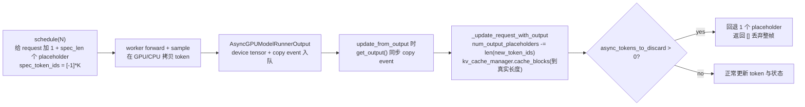

# vLLM Async Scheduler 机制详解

> **文档版本**: 1.0
> **分析代码版本**: 当前 workspace 本地 `vllm` 源码（v1 engine）
> **最后更新**: 2026-06-01

---

## 文档概述

本文档讲解 vLLM v1 中的 **async scheduler**（异步调度器）机制。重点不是 chunked prefill、prefix cache 或 spec decode 自身的实现，而是：

> **为什么 v1 引入 async scheduling，它如何把"调度下一步"和"等本步采样落地"重叠起来，靠什么数据结构保证语义正确，以及它在 spec decode / PP / reset prefix cache / structured output 这些组合场景下的边界。**

**目标读者**: 已经理解 vLLM v1 engine core / Scheduler / model runner 三段式的工程师，希望进一步理解 `AsyncScheduler` 为什么是 `Scheduler` 的一个薄子类，以及 worker 侧 `AsyncGPUModelRunnerOutput` / `prev_sampled_token_ids` / `num_output_placeholders` 这一套术语怎样组合工作。

**阅读指南**:

| 部分 | 内容 | 重点 |
|------|------|------|
| 第一部分 | 为什么需要 async scheduler | sync 路径的 GPU 空泡、host overhead |
| 第二部分 | 总体时序图 | 一个 step 内 schedule / execute / sample 怎么重叠 |
| 第三部分 | Scheduler 侧关键数据结构 | `num_output_placeholders`、placeholder spec token、`async_tokens_to_discard` |
| 第四部分 | Engine core 的 step | `step()` 与 `step_with_batch_queue()`、`execute_model` non-block 与 `sample_tokens` 拆分 |
| 第五部分 | Worker 侧实现 | `AsyncGPUModelRunnerOutput`、独立 copy stream、`prev_sampled_token_ids` |
| 第六部分 | 与其他特性组合的边界 | spec decode、PP、structured output、reset prefix cache、kv-load 失败 |
| 第七部分 | QA | 常见问题和反直觉点 |

---

# 第一部分: 为什么需要 async scheduler

## 1.1 sync 路径在做什么

不打开 async scheduling 时，engine core 的一次 step 大致是这样：

```text
1. scheduler.schedule()         # 决定本步要跑哪些 request、几个 token
2. executor.execute_model()     # 在 worker 跑 forward，返回 SamplerOutput
3. D2H sampled_token_ids        # 把采到的 token 从 GPU 同步拷到 CPU
4. scheduler.update_from_output # 更新 request 状态、stop、KV cache
5. 准备返回给 client
```

这条路径里有两段"非 GPU 工作"必然挡在下一步前面：

| 阶段 | 在 host 做的事 | 阻塞了什么 |
|------|----------------|------------|
| step 末尾 | sampled token D2H、bookkeeping、生成 `EngineCoreOutputs` | GPU 已空闲，但下一次 `schedule()` 还没开始 |
| step 开头 | 下一步 `schedule()`、构造 `SchedulerOutput`、prepare inputs | GPU 在等 host 决定下一批输入 |

decode 阶段每个 step 都很短（几毫秒级），这两段 host overhead 占比就会突出。表现就是 GPU 利用率出现规律性的小缺口，吞吐和 TPOT（time-per-output-token）都会被拖。

```mermaid
gantt
    title 不开启 async scheduling 的 step 时序
    dateFormat  X
    axisFormat  %S

    section GPU
    step N forward+sample :a1, 0, 5
    idle                  :crit, a2, 5, 8
    step N+1 forward+sample :a3, 8, 13

    section Host
    update_from_output (N) :b1, 5, 6
    schedule (N+1)         :b2, 6, 7
    prepare inputs (N+1)   :b3, 7, 8
```



中间这段 `idle` 就是 async scheduling 想消掉的。

## 1.2 async scheduler 的核心思想

async scheduler 的核心不是"调度本身异步执行"，而是 **让 schedule(N+1) 在 step N 的采样结果还没回 CPU 时就开始**。它的代价是：

1. step N+1 调度时，**还不知道 step N 实际采到的 token 是什么**，所以要在 request 里塞 placeholder token，等真正的 token 落地后再回填。
2. CPU 侧 logits processor / 结构化输出 / spec decode 这些需要"上一步真实输出"的逻辑，要么改成读 placeholder + 在更晚的位置同步、要么仍然走原路径但只针对必要的 request 同步阻塞。
3. worker 侧需要把 sampled token 的 D2H 拷贝放到一条独立 cuda stream 上，让默认 stream 上的下一步 forward 不被它阻塞。

```mermaid
gantt
    title 开启 async scheduling 的 step 时序
    dateFormat  X
    axisFormat  %S

    section GPU default stream
    step N forward+sample :a1, 0, 5
    step N+1 forward+sample :a2, 5, 10
    step N+2 forward+sample :a3, 10, 15

    section GPU copy stream
    D2H sampled (N) :b1, 5, 6
    D2H sampled (N+1) :b2, 10, 11

    section Host
    schedule (N+1)+prepare :c1, 4, 5
    schedule (N+2)+prepare :c2, 9, 10
    update_from_output (N) when needed :c3, 6, 7
```



直观看：**GPU 上的下一次 forward 可以紧接着上一次 forward 排队，host 的下一次 `schedule()` 和 worker 的 D2H 都跟它并行**。`update_from_output()` 仍然要看到真实 token，但它的时机可以拖到 token CPU 拷贝完成之后再做。

---

# 第二部分: 总体时序图

## 2.1 engine core 一个 step 的三段拆分

要让上面的并行成立，v1 把过去 `execute_model` 一把梭的接口拆成两步：

| 阶段 | worker 接口 | 非阻塞? | 干什么 |
|------|-------------|---------|--------|
| forward | `execute_model(scheduler_output, non_block=True)` | 是 | 在 GPU 上跑 forward，产 logits，缓存到 `execute_model_state` |
| sample | `sample_tokens(grammar_output, non_block=True)` | 是 | 对 logits 应用 grammar bitmask，采样、bookkeeping、把 sampled token D2H 入队 |

`Scheduler.schedule()` 之后 engine core 立刻 enqueue `execute_model`，得到一个 future；这个 future 完成意味着 forward 跑完、logits 已经准备好。然后 engine core 拿 `grammar_output` 调 `sample_tokens()`，再拿到 `ModelRunnerOutput` 或 `AsyncModelRunnerOutput`。



这里有几个关键的"不要混淆"的点：

1. `execute_model` 的 `non_block=True` 不是把 forward 异步化（它本来就是 GPU 异步），而是让 host 拿到 future 立刻返回，不在 `_orchestrate_run_engine` 里 join。
2. `AsyncGPUModelRunnerOutput` 不代表"输出还没好"，它的 `sampled_token_ids` device tensor 已经在排队 D2H 到 pinned CPU buffer。它的 `get_output()` 才是真正的同步点。
3. `update_from_output()` 会调 `get_output()`，触发 D2H 同步；但因为这段同步等的是上一步的 D2H，**当前这一步的 forward 已经在 GPU 上排队跑**，所以 host 的同步等待被 hidden 在 GPU 工作之下。

## 2.2 普通 step 和 batch queue step

vLLM v1 engine core 暴露了两条主路径：

```text
vllm/v1/engine/core.py::EngineCore.step()
vllm/v1/engine/core.py::EngineCore.step_with_batch_queue()
```

| 路径 | 用途 | async scheduling 下的角色 |
|------|------|---------------------------|
| `step()` | 默认路径，单步 schedule + execute + update | 单进程或多进程同步 step；通过 `non_block=True` + dual stream 实现重叠 |
| `step_with_batch_queue()` | 走 batch queue，可以提前调度多个 batch 进入 pipeline | 用于 PP / 多并发 batch，async scheduling 时 batch queue size = 2 |

`step_fn` 在 init 时根据 `batch_queue is None` 决定走哪一条：

```python
# vllm/v1/engine/core.py
self.step_fn = (
    self.step if self.batch_queue is None else self.step_with_batch_queue
)
self.async_scheduling = vllm_config.scheduler_config.async_scheduling
```

而 batch queue 的容量在 executor 里决定：

```python
# vllm/v1/executor/multiproc_executor.py / uniproc_executor.py / ray_executor.py
return 2 if pp_size <= 1 and self.scheduler_config.async_scheduling else pp_size
```

意思是：

| 配置 | batch queue size | 解读 |
|------|------------------|------|
| 单 PP，未开 async | 1（不用 batch queue） | 走 `step()` |
| 单 PP，开了 async | 2 | 允许同时 in-flight 一个 forward + 一个采样队列项 |
| 多 PP | `pp_size` | 走 PP pipeline，是 PP 自己的并发度 |

所以 async scheduling 在单 PP 场景下不是"无限流水"，而是 **同时最多有一个 forward 在 GPU 上 + 一个 sample/D2H 在 copy stream 上**，下一个 step 在 host 上准备。

---

# 第三部分: Scheduler 侧关键数据结构

## 3.1 `AsyncScheduler` 是 `Scheduler` 的薄子类

源码入口：

```text
vllm/v1/core/sched/async_scheduler.py
vllm/v1/core/sched/scheduler.py
```

`AsyncScheduler` 只重写两个 hook：

```python
class AsyncScheduler(Scheduler):
    def __init__(self, *args, **kwargs) -> None:
        super().__init__(*args, **kwargs)
        # 用于 spec decode 的 placeholder
        self._spec_token_placeholders: list[int] = [-1] * self.num_spec_tokens

    def _update_after_schedule(self, scheduler_output: SchedulerOutput) -> None:
        super()._update_after_schedule(scheduler_output)
        ...
        for req_id in scheduler_output.num_scheduled_tokens:
            request = self.requests[req_id]
            if request.is_prefill_chunk:
                continue
            cur_num_spec_tokens = len(spec_decode_tokens.get(req_id, ()))
            request.num_output_placeholders += 1 + cur_num_spec_tokens
            request.spec_token_ids = self._spec_token_placeholders

    def _update_request_with_output(self, request, new_token_ids):
        if request.async_tokens_to_discard > 0:
            request.async_tokens_to_discard -= 1
            return [], False

        status_before_update = request.status
        new_token_ids, stopped = super()._update_request_with_output(
            request, new_token_ids
        )
        request.num_output_placeholders -= len(new_token_ids)
        ...
```

它的整个语义只做两件事：

1. **schedule 之后**：根据这一步会产生几个 token（普通 decode = 1，spec decode = 1 + draft），给 request 增加同样数量的 `num_output_placeholders`，并把 `spec_token_ids` 指向一个全 `-1` 的占位列表。
2. **拿到 output 时**：扣回对应数量的 placeholder，必要时丢弃过期的 in-flight token（`async_tokens_to_discard`）。

剩下所有 admit、preempt、KV、stop 判断都复用基类。

这种设计的关键好处是 **基类的 `Scheduler.schedule()` 已经能自动支持 async**——它本来就用 `num_computed_tokens + num_output_placeholders` 算"这个 request 还需要多少新 token"，所以 async 路径只要把 placeholders 加上去就够了。

## 3.2 `num_output_placeholders` 是 async 的核心账本

`Request.num_output_placeholders` 表示 **当前已经被调度但 token 还没落到 CPU 的位置数**。它的语义同时承担多个职责：

| 用途 | 体现位置 | 描述 |
|------|----------|------|
| schedule 防超界 | `Scheduler.schedule()` 中 `num_computed_tokens + 2 - num_output_placeholders >= ...max_tokens` | 在 placeholder 仍在 in-flight 时，避免多排一个一定会被丢的 step |
| 计算"还要算几个 token" | `num_tokens_with_spec + num_output_placeholders - num_computed_tokens` | placeholder 本身已计入 `num_computed_tokens`，所以要加回去 |
| KV cache 真实长度 | `cache_blocks(req, num_computed_tokens - num_output_placeholders)` | KV 只缓存到 **已经真实拿到 token 的位置**，不缓存 placeholder 段 |
| spec decode 回收 | `request.num_output_placeholders -= num_rejected` | rejection sampler 拒绝几个 draft，就回收几个 placeholder |
| max_tokens 终止判定 | 上面的 schedule 防超界条件 | 防止 async 多调一步，但生成数仍能精确到 `max_tokens` |
| reset_prefix_cache 力强抢占 | `request.async_tokens_to_discard = request.num_output_placeholders` | 把还没回来的 in-flight 帧标记为"等回来时丢弃" |

下面这张图体现 placeholder 的生命周期：



## 3.3 spec decode 下 placeholder 数量是 `1 + num_spec_tokens`

普通 decode 这一步只会产生 1 个 token，所以 placeholder 也是 1。spec decode 不一样：

- engine 这一步会给目标模型喂 `1 (decode) + K (draft) = K+1` 个位置。
- 全接受时实际产生 `K+1` 个 token；最差时只产生 1 个，回退 `K`。

所以 `_update_after_schedule()` 里写的是：

```python
cur_num_spec_tokens = len(spec_decode_tokens.get(req_id, ()))
request.num_output_placeholders += 1 + cur_num_spec_tokens
```

回收时在 `Scheduler.update_from_output()` 中：

```python
# vllm/v1/core/sched/scheduler.py
num_draft_tokens = len(scheduled_spec_token_ids)
num_accepted = len(generated_token_ids) - 1
num_rejected = num_draft_tokens - num_accepted
if request.num_computed_tokens > 0:
    request.num_computed_tokens -= num_rejected
if request.num_output_placeholders > 0:
    request.num_output_placeholders -= num_rejected
```

注意：

1. 这一步先按 **乐观假设全部接受** 给 placeholder + computed tokens 计数；
2. 拿到真实输出后按 `num_rejected` 同时回退 placeholder 和 computed tokens；
3. KV cache 长度是 `num_computed_tokens - num_output_placeholders`，所以即便乐观计数过头，KV 也不会"缓存到不存在的 token"。

## 3.4 `_spec_token_placeholders`：复用同一个只读列表

`AsyncScheduler.__init__` 中：

```python
self._spec_token_placeholders: list[int] = [-1] * self.num_spec_tokens
```

每个被调度的 request 直接把 `request.spec_token_ids` 指向这个共享列表的引用。这是有意为之：

| 设计取舍 | 原因 |
|----------|------|
| 不每个 step 新建 list | 减少 GC 压力，async 路径每个 step 都会"重新指向" |
| 不同 request 共享同一个对象 | 这些值会在 worker 内被替换成真实 draft id，不依赖某个 request 的 ownership |
| 列表内容全是 `-1` | scheduler 用 placeholder 不参与计算，真正的 spec id 在 worker 那里通过 `update_async_spec_token_ids()` 回填 |

## 3.5 `async_tokens_to_discard` 与 `reset_prefix_cache(reset_running_requests=True)`

`reset_prefix_cache` 在外部触发（比如 weight update、缓存破坏）。强制抢占 running queue 后必须处理一个棘手问题：**那些已经在 GPU 上排队、还没回 CPU 的 sample 帧怎么办？**

```python
# vllm/v1/core/sched/scheduler.py::reset_prefix_cache
while self.running:
    request = self.running.pop()
    self._preempt_request(request, timestamp)
    request.async_tokens_to_discard = request.num_output_placeholders
    request.num_output_placeholders = 0
```

然后在 `AsyncScheduler._update_request_with_output()` 里：

```python
if request.async_tokens_to_discard > 0:
    request.async_tokens_to_discard -= 1
    return [], False
```

每次有一帧 in-flight 输出回来，就消耗一个 discard 名额，返回空 token 让上层忽略。直到 discard 计数清零，新的（preemption 之后重新调度产生的）token 才会被采纳。

这个机制看似冗余，但它处理了一个真实场景：

> 调用 `reset_prefix_cache` 时 engine 不能保证恰好处在"idle"状态。可能正好有 1 个（普通 async）或 `1 + K` 个（async + spec）或 `1 + N`（PP）帧还挂在 copy stream 上。直接丢弃 KV 会让这些帧返回时的 `num_computed_tokens` 与 KV 状态不一致。

---

# 第四部分: Engine core 的 step

## 4.1 `EngineCore.step()`

源码（精简后）：

```python
def step(self) -> tuple[dict[int, EngineCoreOutputs], bool]:
    if not self.scheduler.has_requests():
        return {}, False
    scheduler_output = self.scheduler.schedule()
    future = self.model_executor.execute_model(scheduler_output, non_block=True)
    grammar_output = self.scheduler.get_grammar_bitmask(scheduler_output)
    with self.log_error_detail(scheduler_output), self.log_iteration_details(scheduler_output):
        model_output = future.result()
        if model_output is None:
            model_output = self.model_executor.sample_tokens(grammar_output)

    self._process_aborts_queue()
    engine_core_outputs = self.scheduler.update_from_output(
        scheduler_output, model_output
    )
    return engine_core_outputs, scheduler_output.total_num_scheduled_tokens > 0
```

关键点：

1. `execute_model(..., non_block=True)` 立即返回一个 future；这里没有真正阻塞。
2. `future.result()` 等 forward 跑完拿到 logits（如果 worker 直接合并 sample，则也会拿到 ModelRunnerOutput）。
3. **`model_output is None` 表示 worker 已经把 logits 缓存到 `execute_model_state` 里，留给 `sample_tokens` 处理**。这里之所以分两段，是为了把 grammar bitmask 的计算插入到 forward 与 sample 之间。
4. `update_from_output()` 内部会调 `AsyncModelRunnerOutput.get_output()`，触发 D2H 同步。这正是 host 端"等上一步 token"的时机；而 GPU 端因为 batch queue size = 2 已经有下一个 forward 在跑，host 的等待被隐藏了。

## 4.2 `step_with_batch_queue()`

PP 或 spec + structured output 组合下会走这条路径。它在 batch queue 没满时 **先调度下一批进入 pipeline**，然后再回头处理最早入队的 batch：

```python
batch_queue = self.batch_queue
assert len(batch_queue) < self.batch_queue_size

model_executed = False
deferred_scheduler_output = None
if self.scheduler.has_requests():
    scheduler_output = self.scheduler.schedule()
    exec_future = self.model_executor.execute_model(scheduler_output, non_block=True)
    ...
    if not scheduler_output.pending_structured_output_tokens:
        grammar_output = self.scheduler.get_grammar_bitmask(scheduler_output)
        future = self.model_executor.sample_tokens(grammar_output, non_block=True)
    else:
        deferred_scheduler_output = scheduler_output

    if not deferred_scheduler_output:
        batch_queue.appendleft((future, scheduler_output, exec_future))
        if model_executed and len(batch_queue) < self.batch_queue_size \
           and not batch_queue[-1][0].done():
            return None, True

future, scheduler_output, exec_model_fut = batch_queue.pop()
model_output = future.result()
...
engine_core_outputs = self.scheduler.update_from_output(scheduler_output, model_output)
```

这里值得注意的是：

| 行为 | 解读 |
|------|------|
| **schedule 优先于消费** | 队列未满 → 先尽量塞下一步进入 pipeline；这是 async 的"提前一步"语义的具体落地 |
| `pending_structured_output_tokens` 时延迟 sample | grammar bitmask 需要上一步的真实 token；async 调度下还没回来，所以要 defer 到上一步 output 处理后再 sample |
| `update_from_output()` 仍然是真正的同步点 | `future.result()` 等的是 worker queue 上的 ModelRunnerOutput，里面的 `get_output()` 才会 sync D2H copy event |

## 4.3 `post_step()`：async 路径下 draft token 不在 host 取

```python
def post_step(self, model_executed: bool) -> None:
    if not self.async_scheduling and self.use_spec_decode and model_executed:
        draft_token_ids = self.model_executor.take_draft_token_ids()
        if draft_token_ids is not None:
            self.scheduler.update_draft_token_ids(draft_token_ids)
```

sync 路径下，engine core 拿到 draft id 直接 update 进 scheduler。async 路径不走这里——因为 scheduler 已经把 `spec_token_ids` 设成 `[-1]*K` placeholder，**真实 draft id 由 worker 在下一步进入 sample 前 `update_async_spec_token_ids()` 回填**。这样 host 不用阻塞等 draft tensor D2H。

---

# 第五部分: Worker 侧实现

## 5.1 双 cuda stream：默认 stream 跑 forward，copy stream 拷 token

源码入口：

```text
vllm/v1/worker/gpu_model_runner.py
```

```python
self.async_output_copy_stream: torch.cuda.Stream | None = None
self.prepare_inputs_event: torch.Event | None = None
if self.use_async_scheduling:
    self.async_output_copy_stream = torch.cuda.Stream()
    self.prepare_inputs_event = torch.Event()
```

要点：

1. 默认 stream 跑 forward + sample；
2. `async_output_copy_stream` 专门负责 sampled tokens / logprobs / routed experts 的 D2H 拷贝；
3. 这两条 stream 之间通过 `torch.cuda.Event` 同步：copy stream 在拷贝前 `wait_stream(default_stream)`，确保 sample 已经完成；
4. `prepare_inputs_event` 给"下一步 `_prepare_inputs` 想复用的 CPU pinned tensor"用，保证在 host 改写它们之前上一步的 H2D 已经搬完。

## 5.2 `AsyncGPUModelRunnerOutput`：device tensor + copy event 的句柄

```python
class AsyncGPUModelRunnerOutput(AsyncModelRunnerOutput):
    def __init__(self, model_runner_output, sampled_token_ids,
                 logprobs_tensors, invalid_req_indices,
                 async_output_copy_stream, vocab_size, routed_experts=None):
        ...
        self.async_copy_ready_event = torch.Event()
        self._sampled_token_ids = sampled_token_ids  # device tensor
        default_stream = torch.cuda.current_stream()
        with torch.cuda.stream(async_output_copy_stream):
            async_output_copy_stream.wait_stream(default_stream)
            self.sampled_token_ids_cpu = self._sampled_token_ids.to(
                "cpu", non_blocking=True
            )
            ...
            self.async_copy_ready_event.record()

    def get_output(self) -> ModelRunnerOutput:
        max_gen_len = self.sampled_token_ids_cpu.shape[-1]
        self.async_copy_ready_event.synchronize()
        ...
```

理解这个类：

| 字段 | 角色 |
|------|------|
| `_sampled_token_ids` | GPU 上的 sampled token tensor，保活以避免被释放 |
| `sampled_token_ids_cpu` | pinned CPU tensor，已经在 copy stream 上排队接收 D2H |
| `async_copy_ready_event` | copy stream 上的 cuda event，记录"D2H 已完成" |
| `get_output()` | host 真正要拿到 list[list[int]] 时调用，里面会 `event.synchronize()` |

这设计的本质是：

> **把"启动 D2H"和"等 D2H 完成"在时间上分开**。启动发生在 sample 完成时；等待发生在 scheduler 真的要看 token 时。两者之间是 GPU 可以继续工作的窗口。

## 5.3 `prev_sampled_token_ids` 与下一步 input ids 的拼接

由于 schedule(N+1) 在 step N 的 token 还没到 CPU 时就跑了，scheduler 也只能把 placeholder（`-1`）放进 `input_ids_cpu`。worker 在 `_prepare_input_ids()` 里要把这些位置换成"真实采到的 token"，但 **真实 token 还在 GPU 上**。

`gpu_input_batch.GPUInputBatch.prev_sampled_token_ids` 就是为此存在：

```python
# vllm/v1/worker/gpu_model_runner.py::_bookkeeping_sync()
else:
    valid_sampled_token_ids = []
    invalid_req_indices = discard_sampled_tokens_req_indices.tolist()
    ...
    if self.input_batch.prev_sampled_token_ids is None:
        assert sampled_token_ids.shape[-1] == 1
        self.input_batch.prev_sampled_token_ids = sampled_token_ids
    self.input_batch.prev_req_id_to_index = {
        req_id: i for i, req_id in enumerate(self.input_batch.req_ids)
        if i not in invalid_req_indices_set
    }
```

下一步 `_prepare_input_ids()`：

```python
if self.input_batch.prev_sampled_token_ids is None:
    self.input_ids.copy_to_gpu(total_num_scheduled_tokens)
    return

# Async scheduling case
prev_positions = self.prev_positions.np[:num_reqs]
...
if common_indices_match and max_flattened_index == (num_common_tokens - 1):
    # 快路径：batch 顺序没变，整段拷
    self.input_ids.gpu[:num_common_tokens].copy_(
        self.input_batch.prev_sampled_token_ids[:num_common_tokens, 0],
        non_blocking=True,
    )
    return
# 慢路径：scatter 真正的采样 id 到对应槽位
self.input_ids.gpu.scatter_(
    dim=0,
    index=sampled_tokens_index_tensor,
    src=self.input_batch.prev_sampled_token_ids[prev_common_req_indices_tensor, 0],
)
```

逻辑：

1. 上一步采样的 token 仍然在 GPU 上（`prev_sampled_token_ids`），**不必再走一遭 CPU**；
2. host 端只需要知道"哪些 request 在上一步出现、对应 batch 索引是多少"，这是 `prev_req_id_to_index` 提供的；
3. 当 batch 完全没变化且顺序一致时走整段拷的快路径；否则走 scatter；
4. 这样既不阻塞 host，又能在 GPU 上正确地把"上一步的 token"作为"这一步的 input"接上。

## 5.4 logits processor / output token ids 的 lazy 同步

某些 logits processor（penalty、bad_words、thinking_token_budget、reasoning）需要 **真实的输出 token 序列**。async 路径下这些 token 是 placeholder `-1`。`gpu_input_batch.update_async_output_token_ids()` 负责在它们真正要用之前做一次"按需同步"：

```python
def update_async_output_token_ids(self) -> None:
    output_token_ids = self.sampling_metadata.output_token_ids
    if self.sampled_token_ids_cpu is None or not output_token_ids:
        return
    ...
    for index, req_id in enumerate(self.req_ids):
        prev_index = self.prev_req_id_to_index.get(req_id)
        if prev_index is None:
            continue
        req_output_token_ids = output_token_ids[index]
        if not req_output_token_ids or req_output_token_ids[-1] != -1:
            continue
        if sampled_token_ids is None:
            self.async_copy_ready_event.synchronize()
            sampled_token_ids = self.sampled_token_ids_cpu.tolist()
        new_ids = sampled_token_ids[prev_index]
        ...
        req_output_token_ids[first_placeholder:] = new_ids
```

特征：

| 设计 | 作用 |
|------|------|
| 懒同步 | 没有 logits processor 用到 output token ids 时根本不 sync |
| 一次 sync 服务整个 batch | 第一次进入循环才 `synchronize`，之后所有 request 都用同一个 cpu list |
| placeholder 长度可变 | 既能处理 spec decode 过度乐观（placeholder 比真实多），也能处理 kv-load 失败（placeholder 比真实多/少） |

`update_async_spec_token_ids()` 对 spec decode 的 placeholder draft id 做类似动作：rejection sampler 用 penalty/bad_words 时才把 `spec_token_ids` 里的 `-1` 换成上一步的真实 draft id。

## 5.5 spec decode 路径上的 `discard_request_mask` 与 valid_sampled_token_count

async + spec decode 比 async 自己复杂得多。简化后的关键点：

```python
# bookkeeping_sync
discard_sampled_tokens_req_indices = np.nonzero(
    self.discard_request_mask.np[:num_reqs]
)[0]
```

| 情况 | 含义 |
|------|------|
| 某 request 在本步实际只是 chunked prefill | 它不会产生 sample token；discard mask 标记它，得到的"sampled token"应该被丢 |
| async 路径下 prefill+decode 共批 | 不能因为有 chunked prefill 而阻塞整个 batch 的 D2H |

`valid_sampled_token_count_gpu` 用于 GPU 上修正 `num_computed_tokens`：因为 host 不知道实际 accept 了几个 spec token，先按"全接受"乐观更新，在下一次 `_update_states_after_model_execute` 里通过 GPU kernel 用 `valid_sampled_token_count_gpu` 减去拒绝数。这就是 `update_num_computed_tokens_for_batch_change()` 的作用。

---

# 第六部分: 与其他特性组合的边界

## 6.1 spec decode

要点已经在 3.3 和 5.5 提过。归纳：

| 子问题 | async 路径下的处理 |
|--------|--------------------|
| draft token 在 host 不可见 | scheduler 用 `[-1]*K` 占位，worker 在 `_sample()` 内 `update_async_spec_token_ids()` 替换 |
| `num_computed_tokens` 乐观计数 | schedule 当步按全接受+1 给 placeholder；rejection 后 `-= num_rejected` |
| KV 缓存长度 | `cache_blocks(num_computed_tokens - num_output_placeholders)` 永远以真实 token 为准 |
| max_tokens 边界 | `num_computed_tokens + 2 - num_output_placeholders >= max_tokens` 跳过多余 step |

## 6.2 Pipeline Parallel (PP)

async + PP 把"几步 in-flight"再叠了一层：

```python
# uniproc / multiproc / ray executor
return 2 if pp_size <= 1 and self.scheduler_config.async_scheduling else pp_size
```

batch queue size 在 PP > 1 时就是 PP size，async 单独的 +1 缓冲不再叠加（PP 本身已经引入足够的并发）。

具体到 worker，`AsyncGPUModelRunnerOutput` 在最后一段 PP rank 上产生，前面 rank 通过 `torch.distributed.broadcast` 把 `prev_sampled_token_ids` 发到所有 rank：

```python
def _pp_broadcast_prev_sampled_token_ids(self, sampled_token_ids: torch.Tensor) -> None:
    pp = get_pp_group()
    assert pp.is_last_rank
    if not self._is_all_reqs_chunked_prefill():
        torch.distributed.broadcast(
            sampled_token_ids, src=pp.rank, group=pp.device_group
        )

def _pp_receive_prev_sampled_token_ids_to_input_batch(self) -> None:
    pp = get_pp_group()
    assert not pp.is_last_rank
    num_reqs = self.input_batch.num_reqs
    recv = torch.empty((num_reqs, 1), dtype=torch.int32, device=self.device)
    if not self._is_all_reqs_chunked_prefill():
        torch.distributed.broadcast(recv, src=pp.last_rank, group=pp.device_group)
    self.input_batch.prev_sampled_token_ids = recv
    ...
    for i, req_id in enumerate(self.input_batch.req_ids):
        if i in discard_req_indices_set:
            continue
        prev_req_id_to_index[req_id] = i
        if (req_state := self.requests.get(req_id)) is not None:
            req_state.output_token_ids.append(-1)
        pos = self.input_batch.num_tokens_no_spec[i]
        self.input_batch.is_token_ids[i, pos] = True
        self.input_batch.num_tokens_no_spec[i] = pos + 1
    self.input_batch.prev_req_id_to_index = prev_req_id_to_index
```

注意：

1. 非 last PP rank 在 receive 时直接把 placeholder `-1` append 到 `output_token_ids`，等下一步要用时再通过 `update_async_output_token_ids()` 替换。
2. last PP rank 才是真正持有 sampled token 的 rank；它在 sample 完成后广播 GPU tensor。
3. 如果整个 batch 都是 chunked prefill，不会产生有效 token，跳过 broadcast。

## 6.3 Structured output (grammar)

普通 async：grammar bitmask 在 sample 之前由 host 拿到；不需要等上一步的输出。

但是 spec decode + structured output 下，grammar bitmask 需要"上一步实际接受的 token 序列"才能算下一步的可接受字符集。这就是 `step_with_batch_queue()` 里 `pending_structured_output_tokens` 判定的来源：

```python
# AsyncScheduler._update_after_schedule
scheduler_output.pending_structured_output_tokens |= (
    request.use_structured_output and request.num_output_placeholders > 0
)
```

任何 structured output request 在 placeholder 未清零前，本步的 sample 都要推迟到上一步的 ModelRunnerOutput 被 update 之后。这正是 `deferred_scheduler_output` 的语义。

## 6.4 reset prefix cache 与运行中请求

见 3.5。`reset_prefix_cache(reset_running_requests=True)` 在 async 路径下不能简单 abort，因为有 in-flight 帧。它的做法是：

1. preempt 所有 running request；
2. `async_tokens_to_discard = num_output_placeholders`：标记"接下来回来的这些帧都丢掉"；
3. KV cache 在 preempt 之后会被释放，新一步重新走 prefill。

注释里非常直白：

> num_output_placeholders is exactly that count: 0 if the engine has drained (e.g. pause_generation(keep) waited for idle), 1 for vanilla async mid-step, or 1 + spec/PP frames otherwise.

## 6.5 kv-load 失败

KV connector 异步加载某些 block，如果加载失败，scheduler 会把当 step 输出标记为 invalid。async 路径下这一帧的 placeholder 数量可能比"实际返回的 token 数"多，因此 `update_async_output_token_ids()` 里有这段：

```python
first_placeholder = len(req_output_token_ids)
while first_placeholder > 0 and req_output_token_ids[first_placeholder - 1] == -1:
    first_placeholder -= 1
num_placeholders = len(req_output_token_ids) - first_placeholder
num_to_replace = min(num_sampled_ids, num_placeholders)
del new_ids[num_to_replace:]
req_output_token_ids[first_placeholder:] = new_ids
```

它显式地"按 placeholder 的实际数量裁剪"，避免 spec 过度乐观或者 kv-load 失败导致越界写。

## 6.6 supports_async_scheduling 是 executor 的 opt-in

并不是所有 executor 都支持 async：

```python
# vllm/v1/executor/abstract.py
@classmethod
def supports_async_scheduling(cls) -> bool:
    return False

# vllm/v1/executor/uniproc_executor.py
@classmethod
def supports_async_scheduling(cls) -> bool:
    return False  # 默认；实际由具体子类覆盖

# vllm/v1/executor/multiproc_executor.py
@classmethod
def supports_async_scheduling(cls) -> bool:
    return True
```

`arg_utils` 会在判断后决定能不能把 `async_scheduling=True` 真的传到 scheduler config。 这是因为 async 需要 executor 的 `execute_model` / `sample_tokens` 支持 `non_block=True`、Future 接口等基础设施。

---

# 第七部分: QA

## Q1: 开启 async scheduling 后吞吐能提升多少？

不存在单一数字。提升取决于：

| 因素 | 影响 |
|------|------|
| host overhead 占 step 时长比例 | 占比越高，async 收益越大；decode 阶段尤为明显 |
| batch size | 小 batch + 短 seq 时 host overhead 相对更突出 |
| 是否有 logits processor 要 sync output token ids | 有时 lazy sync 会触发，部分抵消收益 |
| 是否使用 spec decode + structured output | 这种组合会强制 deferred sampling，收益变小 |
| GPU 是否本来就被 forward 撑满 | 大模型/大 batch 已经 GPU bound 时收益有限 |

一般经验值是 decode-heavy workload 的 TPOT 改善百分位最明显，prefill-heavy / 大 batch 改善有限。

## Q2: 为什么 `num_output_placeholders` 既是"已计入 computed_tokens 的 in-flight 帧数"又被用来计算"还要算几个 token"？

因为它就是同一个量：

- placeholder 在 schedule 时已经"先记账"到 `num_computed_tokens`，但实际 token 还没到；
- 下一步要算的新 token 数 = `num_tokens_with_spec + placeholders - num_computed_tokens`；
- 拿到真实 token 后扣掉 placeholders，让 KV cache 长度落到真实位置。

所以它本质是"乐观记账"和"真实进度"的差值。

## Q3: `_spec_token_placeholders` 为什么是共享列表？多 request 共用一个对象不会有副作用？

不会。这个列表只被 `Scheduler.schedule()` 当作长度信息和"这是 placeholder 不是真实 draft"的标记使用；worker 在 sample 前会用 `update_async_spec_token_ids()` 用真实的 draft id 替换它们，不会就地修改这个共享对象（worker 那侧操作的是 `sampling_metadata.spec_token_ids` 列表的元素，每个 request 是独立的 list）。

## Q4: 为什么 grammar bitmask 不能完全 async？

structured output 的下一步可接受 token 集合依赖于上一步实际生成出的 token（grammar 状态机会前进）。async 路径下"上一步的 token"还在 GPU/copy stream 上没回来。常规 async + 普通 decode 因为 sample 之前 host 还能用 placeholder 进入 logits processor，但 grammar 必须等真实 token —— 否则会接受错的字符集。所以遇到 `use_structured_output` 且 placeholders > 0 的 request，必须 defer 到上一步真实输出回来之后再 sample。

## Q5: async scheduling 和 batch_queue 是什么关系？

- async 是控制 **schedule(N+1) 和 step N 的 D2H/sample 重叠**；
- batch_queue 是控制 **engine core 同时 in-flight 多少个 scheduler_output**；
- 在单 PP 下，async 让 batch_queue size = 2，即"一个 in-flight + 一个 host 在准备"；
- 在 PP > 1 下，batch_queue size = pp_size，async 不再额外加层。

## Q6: 为什么 `update_async_output_token_ids` 是 lazy 的？sample 时就同步不行吗？

可以但浪费。绝大多数 request 不用 penalty / bad_words / thinking budget，根本不读 `output_token_ids`；强行 sync 会把 host 阻塞在 D2H 上，抹掉 async 的全部收益。lazy sync 只在真正用到时（logits processor 要看 output token 序列时）才同步一次，并且一次性服务整个 batch。

## Q7: `prev_sampled_token_ids` 为什么留在 GPU 上而不是直接用 `sampled_token_ids_cpu`？

因为下一步要把它们 **写进当前 forward 的 `input_ids` GPU buffer**。如果走 CPU 中转就是 GPU→CPU→GPU 两次拷贝；保留在 GPU 上可以用 `scatter_` 或整段 `copy_` 直接搬，无需 host 同步、无需 H2D。

## Q8: 在 async 下 spec decode 拒绝多个 token 时，`num_output_placeholders` 是怎么扣的？

每个 request 在调度时 placeholder += `1 + num_draft`；rejection sampler 给出 `num_rejected`，scheduler 同步执行 `num_output_placeholders -= num_rejected`、`num_computed_tokens -= num_rejected`。然后 `_update_request_with_output()` 再按"实际产生的 token 数"扣减剩下的 placeholder。两次扣减是分别针对"被拒的 draft"和"真实落地的输出"。

## Q9: `async_tokens_to_discard` 是不是只在 `reset_prefix_cache` 中用？

是的。它是 force preemption 场景下的"in-flight 帧丢弃名额"。普通 abort（client 主动）不会走这条：abort 会让 scheduler 标记 FINISHED_ABORTED，下一步直接出请求的最终输出。

## Q10: 单步看的话，async 路径下 GPU 上有几次 forward 同时在跑？

单 PP 默认 batch queue size = 2，所以 **同一时刻 GPU default stream 上排队的 forward 最多是 1 个**（CUDA stream 是顺序的）；async 真正"重叠"的不是两次 forward，而是：

- default stream：forward N+1 在跑；
- copy stream：D2H sampled (N) 在跑；
- host：`update_from_output(N)` / `schedule(N+2)` / `_prepare_inputs(N+2)` 在跑。

如果是 PP > 1，那么 forward 的并发就是 PP 维度。

## Q11: async scheduler 会改变最终输出的 token 序列吗？

不会改变模型语义。前提是：

1. logits processor 在需要时通过 `update_async_output_token_ids()` 拿到真实历史；
2. KV cache 长度永远落到真实 token（`num_computed_tokens - num_output_placeholders`）；
3. spec decode 的 rejection 会把 placeholder 和 `num_computed_tokens` 一起回退。

所以 async 是 **性能优化**，不是 **采样语义改动**。

---

# 总结

vLLM async scheduler 的本质，是把过去"schedule → forward → sample → D2H → update → schedule"的严格串行链拆成 **GPU forward / copy / host schedule** 三条可重叠的流水。它的代价主要落在两处：

1. scheduler 要记一笔"乐观账"——`num_output_placeholders` 同时承担"已经记上账的 in-flight 帧数"和"下一步需要再算几个 token"两个职责，所有 max_tokens、KV cache、spec rejection、reset_prefix_cache 等场景都围绕它走；
2. worker 要分离 sample 的"启动 D2H"和"等 D2H 完成"两个时刻，并用 `prev_sampled_token_ids` 让上一步 token 不必经 CPU 就能回到下一步的 GPU input。

得到的回报是：**在 decode-heavy / 小 batch 场景下，GPU 不再因为 host 编排而出现规则性的空泡**。`AsyncScheduler` 自己之所以只有几十行代码，是因为基类 `Scheduler` 的字段早已为这种"乐观记账"留好接口；真正复杂的实现细节集中在 worker 侧的 `GPUModelRunner` 与 `GPUInputBatch` 上。

理解这一套机制后，可以把"async 引发的 bug"通常归到三个根因：

| 现象 | 通常的根因 |
|------|------------|
| 输出多/少 token，或 max_tokens 边界偶发越界 | `num_output_placeholders` 在某条路径上没被对应地 += 或 -= |
| logits processor / structured output 行为漂移 | placeholder 没在使用前用真实 token 替换 |
| reset_prefix_cache / KV connector 异常时残留输出 | `async_tokens_to_discard` 或 chunked prefill 的丢弃逻辑没覆盖到对应分支 |

之后再看 `vllm/v1/core/sched/async_scheduler.py` 的几十行代码，就会发现它的"短"恰恰因为它把所有不变量都建立在 `Scheduler` 既有字段之上，而不是另起一套调度状态机。
