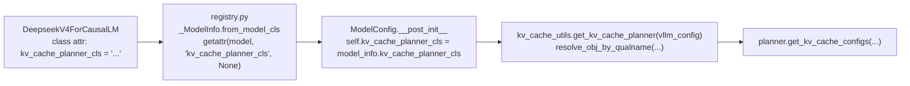

# vLLM Model-Customized KVCache Planning：RFC #44276 与 PR #44316

> **文档版本**: 1.0
> **分析对象**:
> - [vllm-project/vllm#44276](https://github.com/vllm-project/vllm/issues/44276) — [RFC] Model customized KVCache Planning
> - [vllm-project/vllm#44316](https://github.com/vllm-project/vllm/pull/44316) — [KVCache] Support model specific KVCache planning（首版实现）
> **本地 vllm 源码状态**: 未合入。本地 `vllm/v1/core/kv_cache_utils.py` 还是 RFC 之前的"集中式"版本，包含 `_get_kv_cache_config_deepseek_v4` 等 DeepSeek V4 专用分支
> **最后更新**: 2026-06-03

---

## 文档概述

这篇文档不是"PR 把代码挪到了哪里"的清单，而是想把这次 KV cache 规划重构当作一个 **"核心抽象在被一个特殊模型逐步腐蚀，最终需要做反向解耦"** 的典型案例来拆开看：

> **为什么 DeepSeek V4 的 7 种 cache 把 `kv_cache_utils.py` 推到了不该承担的复杂度，PR #44316 是怎么用 `KVCachePlanner` 接口把"模型私货"从核心推回模型自身的，以及这个新设计在分层、PP、Eagle、profile 这些边界上还遗留了哪些待讨论的问题。**

**目标读者**: 已经理解 vLLM v1 [`Scheduler`](vllm_async_scheduler.md) / KV cache manager 的工程师，对 v1 的 `KVCacheSpec` / `KVCacheGroupSpec` / `KVCacheConfig` 三段抽象有基本印象，想搞清楚"为什么 DeepSeek V4 不能照搬 hybrid attention 的统一路径"和"模型私有 planner 该长什么样"。

**阅读指南**:

| 部分 | 内容 | 重点 |
|------|------|------|
| 第一部分 | 当前 KV cache planning 的 5 条分支 | 集中式架构看到了什么，DeepSeek V4 又怎么穿插进去 |
| 第二部分 | DeepSeek V4 的 7 种 cache 与 page-size 对齐 | 为什么 hybrid attention 的"page size 拉齐"换个块大小就够了，DeepSeek V4 不行 |
| 第三部分 | RFC #44276 的设计思路 | 从"核心 dispatch"到"模型自带 planner"，`KVCachePlanner` 的接口边界 |
| 第四部分 | PR #44316 的文件拓扑与类层级 | 新增的 4 个文件、ModelConfig 字段、registry 链路 |
| 第五部分 | `DefaultModelKVCachePlanner` 的 5 条分支 | 把原 `get_kv_cache_groups` 平移过来，但抽成实例方法以便重写 |
| 第六部分 | `DeepseekV4KVCachePlanner` 的特殊化路径 | bucket 化、layer tuple、page-size 对齐、Eagle group 标注 |
| 第七部分 | 与现有调用点的兼容 | `_init_minimal_kv_cache_for_profiling`、PP projection、`num_gpu_blocks_override` |
| 第八部分 | 设计权衡与未解决的问题 | 工具函数放置、HMA 是否再拆、未来扩展点 |
| 第九部分 | QA | 常见反直觉点 |

---

# 第一部分: 当前 KV cache planning 的 5 条分支

## 1.1 集中式的 `kv_cache_utils.py`

在 RFC 之前，本地 `vllm/v1/core/kv_cache_utils.py` 把"KV cache 规划"的全部职责集中在几个全局函数里：

```text
get_kv_cache_configs(vllm_config, kv_cache_specs, available_memory) -> list[KVCacheConfig]
  ├── merge_kv_cache_specs_across_workers
  ├── get_kv_cache_groups(vllm_config, merged_specs)
  ├── _project_kv_cache_groups_to_worker  (PP 分片)
  ├── _auto_fit_max_model_len            (max_model_len = -1 时自动确定)
  ├── _check_enough_kv_cache_memory      (per-worker)
  ├── get_kv_cache_config_from_groups    (生成 KVCacheTensor + KVCacheConfig)
  └── 缩到所有 worker 的最小 num_blocks
```

它代表了一个"通用框架 + 配置驱动"的设计：所有模型都走同一条路径，差异由 `KVCacheSpec` 子类提供的 `page_size_bytes` / `max_memory_usage_bytes` 等方法吸收。

## 1.2 `get_kv_cache_groups` 的 5 条分支

`get_kv_cache_groups()` 内部一共有 5 条分支，按"cache 类型的复杂度"由低到高排列：

| 分支 | 触发条件 | 处理 | 典型模型 |
|------|----------|------|----------|
| / | `kv_cache_spec` 为空 | 返回空 list（attention-free） | 编码器、纯 SSM |
| 0 | `is_kv_cache_type_attention_free` | 同上 | — |
| 1 | `is_kv_cache_spec_uniform`（所有层 spec 可 merge） | 把所有层放入 1 个 group | 标准 dense attention |
| 2 | `UniformTypeKVCacheSpecs.from_specs` 成功 | 把所有层放进单个"统一类型"group，但保留 per-layer 差异（hidden size 等） | 部分纯 MLA 模型 |
| 3 | `group_and_unify_kv_cache_specs`（包含 `SlidingWindowMLASpec`） | **DeepSeek V4 专用**：分 MLA group + 多个 SWA-MLA group，按 page-size bucket 化 | DeepSeek V4 |
| 4 | 一般 hybrid（如 Gemma3、Llama4） | 按 `same_type_layers` 分组，padding 对齐 group_size | Gemma3、Llama4、Qwen3.5-Hybrid |

注意第 3 条分支：`group_and_unify_kv_cache_specs` 是 RFC 之前为了"塞下 DeepSeek V4"加进来的。它的语义是"如果出现 `SlidingWindowMLASpec`，就走 DeepSeek V4 的 multi-UniformType 路径"。**在 `kv_cache_utils.py` 这种通用文件里，给一个具体模型留 hook 是显眼的耦合**。

> 这条 hook 不是孤例。`get_kv_cache_config_from_groups` 里也有一段 `_get_kv_cache_config_deepseek_v4`；`_max_memory_usage_bytes_from_groups` 里有一段 `elif all(... UniformTypeKVCacheSpecs ...)` 也是 DeepSeek V4 专用。三处加起来构成了 RFC 想要拆掉的"DeepSeek V4 蛀洞"。

## 1.3 集中式架构的好处与代价

集中式架构的好处在于：

| 好处 | 解释 |
|------|------|
| 单点修改 | 加一个 attention 类型、改 grouping 逻辑只动一个文件 |
| 对模型透明 | 模型只要提交 `KVCacheSpec`，不关心 grouping/分配 |
| 易测试 | 全部用 `KVCacheSpec` mock 即可 |

代价是：

| 代价 | 解释 |
|------|------|
| 模型私货反向污染 | DeepSeek V4 这种"非通用模式"的复杂规划被塞进通用文件 |
| 修改风险扩散 | 改 DeepSeek V4 路径可能误改其他模型；改其他模型可能踩到 DeepSeek V4 假设 |
| 复杂度只增不减 | 7 种 cache 已经压得喘不过气，再来 1 个新模型怎么办？ |

RFC #44276 的出发点就是这第三条："如果再来一个 DeepSeek V5 或者别的 7 种 cache 模型，这个文件就守不住了。"

---

# 第二部分: DeepSeek V4 的 7 种 cache 与 page-size 对齐

## 2.1 不止是"hybrid + 2 种"

普通 hybrid 模型（Gemma3、Qwen3.5-Hybrid）的 KV cache 类型在 2 种以内：

- 全注意力 `FullAttentionSpec` + 滑窗 `SlidingWindowSpec`
- 或全注意力 + chunked local attention

这种情况 v1 用 **"page size 拉齐 + group_size padding"** 就能搞定：

1. 找出最大 page size；
2. 给 page size 较小的层把 `block_size` 乘个倍数，保证 `page_size_bytes` 相等；
3. 把所有层按 spec 分类，每类切成 `group_size` 大小的子 group，必要时 padding。

成立条件是：**所有 spec 的 `page_size_bytes` 都能 unify 到同一个值**。这条很温和，因为 `block_size` 自由可调。

## 2.2 DeepSeek V4 的 cache 谱系

DeepSeek V4 引入了 **7 种 KV cache 类型**（RFC 配图给出，来源于 [vllm.ai/blog/2026-04-24-deepseek-v4](https://vllm.ai/blog/2026-04-24-deepseek-v4)）。本地源码里能看到的几种：

| 缩写 | 含义 | spec 类 | 典型 page size |
|------|------|---------|----------------|
| 主 MLA | 标准 MLA cache | `MLAAttentionSpec` | 大（256 等） |
| C4I/C4A | compress_ratio=4 的 inter/intra 状态 | `SlidingWindowMLASpec` | 小（4） |
| C128A | compress_ratio=128 的 intra 状态 | `SlidingWindowMLASpec` | 中（8） |
| SWA-MLA | 滑窗 MLA | `SlidingWindowMLASpec` | 中（64） |

这些 cache 共存于一个模型，且 **page size 互不相同、互不整除**。普通 hybrid 模型那套"乘个倍数把 page size 拉齐"对 DeepSeek V4 不成立——把小 page size 拉到大的，会浪费数倍内存。

## 2.3 DeepSeek V4 的对齐策略：bucket + layer tuple

DeepSeek V4 用了不同的对齐策略，PR 把它叫做 **page-size bucket + layer tuple**：

```text
1. 主 MLA 的 page sizes 集合 = {P0, P1, ..., Pk}   (canonical bucket set)
2. 每个 SWA-MLA group 的层按 page size 分到对应 bucket
3. 一个 "layer tuple" = 每个 bucket 中位置 i 的层组合
4. 给每个 (tuple_idx, page_size_bucket) 发一个 KVCacheTensor
   shared_by = 跨所有 group 在该位置的层
```

意思是：每个 bucket 自带一组共享 tensor，主 MLA group 是 canonical 的（提供 bucket 的 page size 列表）；SWA-MLA group 把自己的层 pad 到主 MLA 的最近大于等于的 page size 上。

例如：

```text
主 MLA group:           layers @ [P0=256], [P1=4]
SWA-MLA C4I+C4A group:  layers @ [4, 4]   → 对齐到 P1=4
SWA-MLA C128A group:    layers @ [8]      → padding 到 P1 的下一个 ≥8 的 bucket
```

> 关键差异：普通 hybrid 用"同一种 page size，多 group 共享一份内存"；DeepSeek V4 用"多种 page size 的 bucket 套叠，每 bucket 有自己的内存池"。两者的内存结构本质不同，无法用一套规划逻辑表达。

## 2.4 还有一个被忽略的复杂点：`num_layer_tuples`

DeepSeek V4 的另一处复杂度在 layer 数对齐。普通 hybrid 模型不同 group 的层数比是 1:n（如 Gemma3 是 1:5），可以用 group_size 直接 padding。

DeepSeek V4 的 group 之间没有简单的比例关系，例如：

```
mla group:    11 layer tuples (每个 tuple 包含 C4I, C4A, C128A 等)
SWA group A:  10 layer tuples
SWA group B:  21 layer tuples
```

PR 用 `_approximate_gcd` 暴力枚举最小 padding 的 `num_layer_tuples`：

```python
def _approximate_gcd(values, *, lower_bound=None):
    """For each candidate d in [lower_bound, max(values)]:
       pad(d) = sum_i (ceil(x_i / d) * d - x_i)
       pick d with minimum pad. Ties prefer larger d."""
```

`lower_bound` 设为主 MLA 的 `num_layer_tuples`，保证主组不会被进一步细分。

> 这种"暴力枚举找最佳 padding"的特化逻辑放在通用 `kv_cache_utils.py` 里特别违和——它的最佳定义是"对 DeepSeek V4 的层数分布最优"，跟其他模型完全无关。

---

# 第三部分: RFC #44276 的设计思路

## 3.1 一句话：把"模型私货"扔回模型

RFC 的核心主张是：

> **把 KV cache planning 从 core 移到 model，让每个模型自己处理它的 cache layout。** Core 只负责"找到这个模型对应的 planner，然后调它"。

具体的契约：在 `ModelConfig` 上加一个字段 `kv_cache_planner_cls: str | None`，存模型 planner 的完全限定名。Core 通过 `resolve_obj_by_qualname` 加载它、实例化、调度。

```python
class DeepseekV4ForCausalLM(nn.Module):
    model_cls = DeepseekV4Model
    kv_cache_planner_cls = (
        "vllm.models.deepseek_v4.nvidia.kv_cache_planner.DeepseekV4KVCachePlanner"
    )
```

- 若 `kv_cache_planner_cls is None`：用 `DefaultModelKVCachePlanner`（承担所有非 DeepSeek V4 的逻辑）。
- 若指定：动态导入，覆盖默认行为。

## 3.2 `KVCachePlanner` ABC 暴露 4 个方法

RFC 提到要讨论哪些方法算"公共 API"。PR 的实现给出了 4 个抽象方法：

```python
class KVCachePlanner(ABC):
    @abstractmethod
    def get_kv_cache_configs(
        self, kv_cache_specs: list[dict[str, KVCacheSpec]], available_memory: list[int]
    ) -> list[KVCacheConfig]: ...

    @abstractmethod
    def get_kv_cache_groups(
        self, kv_cache_specs: dict[str, KVCacheSpec]
    ) -> list[KVCacheGroupSpec]: ...

    @abstractmethod
    def get_kv_cache_config_from_groups(
        self, kv_cache_groups: list[KVCacheGroupSpec], available_memory: int
    ) -> KVCacheConfig: ...

    @abstractmethod
    def get_max_model_len_capacity(
        self, kv_cache_groups: list[KVCacheGroupSpec], available_memory: int
    ) -> int: ...
```

接口设计的几个观察：

| 方法 | 用途 | 为什么是公开的 |
|------|------|----------------|
| `get_kv_cache_configs` | 顶层入口，per-worker | engine 启动时唯一调用点 |
| `get_kv_cache_groups` | spec → group 划分 | `_init_minimal_kv_cache_for_profiling` 要用 |
| `get_kv_cache_config_from_groups` | group → config（不含 PP 合并） | 同上：profiling 时单独构造一份 minimal config |
| `get_max_model_len_capacity` | 给定 group + 内存，求最大 max_model_len | auto-fit `max_model_len=-1` 时用 |

`get_kv_cache_groups` 和 `get_kv_cache_config_from_groups` 之所以单独抽出来，是为了让 `_init_minimal_kv_cache_for_profiling` 在 cudagraph profile 时复用 grouping 逻辑而不重跑全套 `get_kv_cache_configs`。

## 3.3 RFC 中"待讨论"的几个点

RFC 在 "require discussion" 一栏列了几条，PR 部分作了选择，部分悬而未决：

| RFC 提的点 | PR 的选择 | 状态 |
|------------|-----------|------|
| 抽象类要不要包含 `get_max_model_len` | 改名为 `get_max_model_len_capacity`，是抽象方法 | 已实现 |
| 默认 planner 是否再拆成"有 HMA / 无 HMA" 两种 | 没拆，都在 `DefaultModelKVCachePlanner` 里 | 待定 |
| 文件树是否要按 `complex_hybrid_models / normal_hybrid_models / single_attention_type_models` 三类组织 | 没拆，DeepSeek V4 仍在原来的 `vllm/models/deepseek_v4/nvidia/` 下 | 未实现 |

---

# 第四部分: PR #44316 的文件拓扑与类层级

## 4.1 新增文件

PR 新增了 4 个文件，外加修改 4 个：

```text
新增：
  vllm/model_executor/kv_cache_plan/kv_cache_planner.py        # ABC
  vllm/model_executor/kv_cache_plan/model_kv_cache_planner.py  # DefaultModelKVCachePlanner
  vllm/model_executor/kv_cache_plan/utils.py                   # grouping helpers
  vllm/models/deepseek_v4/nvidia/kv_cache_planner.py           # DeepseekV4KVCachePlanner
  vllm/models/deepseek_v4/nvidia/kv_cache_planner_utils.py     # 通用 planner helpers（位置可疑，见 §8.1）

修改：
  vllm/v1/core/kv_cache_utils.py                  # 删除大段集中式逻辑，加 get_kv_cache_planner()
  vllm/v1/worker/gpu_model_runner.py              # _init_minimal_kv_cache_for_profiling 走 planner
  vllm/config/model.py                            # 加 kv_cache_planner_cls 字段
  vllm/model_executor/models/registry.py          # _ModelInfo 加 kv_cache_planner_cls
  vllm/models/deepseek_v4/nvidia/model.py         # 类属性声明 planner 路径
```

## 4.2 类层级

```text
KVCachePlanner (ABC)
└── DefaultModelKVCachePlanner
    └── DeepseekV4KVCachePlanner
```

两个设计点：

| 设计点 | 解释 |
|--------|------|
| `DeepseekV4KVCachePlanner` 继承 `DefaultModelKVCachePlanner` 而非直接继承 ABC | 复用顶层的 `get_kv_cache_configs` 编排（merge spec → groups → auto-fit → per-worker config → shrink num_blocks），只重写 `get_kv_cache_groups` / `get_kv_cache_config_from_groups` / `_max_memory_usage_bytes_from_groups` |
| 用 qualified-name 字符串而非直接 import | 避免 `kv_cache_utils.py` 触发 `vllm.models.deepseek_v4` 导入，保持核心模块对模型实现解耦 |

## 4.3 ModelConfig → Registry → Planner 的链路



链路的关键节点：

| 节点 | 行为 |
|------|------|
| 模型类属性 | `kv_cache_planner_cls = "vllm.models.deepseek_v4.nvidia.kv_cache_planner.DeepseekV4KVCachePlanner"` |
| `_ModelInfo` | 在模型注册时 `getattr` 读取（默认 None）|
| `ModelConfig` | `__post_init__` 把它从 `_ModelInfo` 复制到自身 |
| `get_kv_cache_planner` | 若 None 用默认；否则 `resolve_obj_by_qualname` |

> 这条链路有意识地保持单向：模型 → ModelInfo → ModelConfig → planner。core 永远不会反向 import 任何 `vllm.models.*`。这是把"模型私货"扔回模型的物理表现。

---

# 第五部分: `DefaultModelKVCachePlanner` 的 5 条分支

## 5.1 `get_kv_cache_configs` 的编排

`DefaultModelKVCachePlanner.get_kv_cache_configs` 是把原 `get_kv_cache_configs()` 函数原样平移成方法。流程：

```python
def get_kv_cache_configs(self, kv_cache_specs, available_memory):
    merged = merge_kv_cache_specs_across_workers(kv_cache_specs)
    global_groups = self.get_kv_cache_groups(merged)            # ← 子类可重写
    projected_per_worker = [project_kv_cache_groups_to_worker(global_groups, ws) for ws in kv_cache_specs]

    if num_gpu_blocks_override is not None:
        available_memory = adjust_memory(...)                   # 让 auto-fit / 检查 / build 看到统一容量

    if original_max_model_len == -1:
        self._auto_fit_max_model_len(projected_per_worker, available_memory)

    for groups, avail in zip(projected_per_worker, available_memory):
        check_enough_kv_cache_memory(avail, ..., max_model_len, ...)

    configs = [self.get_kv_cache_config_from_groups(g, m) for g, m in ...]  # ← 子类可重写

    # 缩到所有 worker 的最小 num_blocks
    min_num_blocks = min(c.num_blocks for c in configs)
    for c in configs:
        scale tensors proportionally to min_num_blocks
    return configs
```

子类需要重写的两个钩子是 `get_kv_cache_groups` 和 `get_kv_cache_config_from_groups`，**外层编排（合并、投影、auto-fit、内存检查、num_blocks 收敛）完全复用**。

## 5.2 `get_kv_cache_groups` 的 5 条分支

`DefaultModelKVCachePlanner.get_kv_cache_groups` 把原集中式 `get_kv_cache_groups()` 的 5 条分支搬进来，但**去掉了"分支 3（DeepSeek V4 special-case）"**：

```python
def get_kv_cache_groups(self, kv_cache_specs):
    if disable_hybrid_kv_cache_manager:
        unify_hybrid_kv_cache_specs(kv_cache_specs)

    if is_kv_cache_type_attention_free(kv_cache_specs):
        return []
    if is_kv_cache_spec_uniform(kv_cache_specs):
        return _get_kv_cache_groups_uniform_spec(kv_cache_specs)
    if uniform_spec := UniformTypeKVCacheSpecs.from_specs(kv_cache_specs):
        return _get_kv_cache_groups_uniform_type(uniform_spec)

    # 一般 hybrid 路径
    hidden_specs = {k: v for k, v in kv_cache_specs.items() if isinstance(v, HiddenStateCacheSpec)}
    filtered = {k: v for k, v in kv_cache_specs.items() if not isinstance(v, HiddenStateCacheSpec)}
    filtered = unify_kv_cache_spec_page_size(filtered)
    groups = _get_kv_cache_groups_uniform_page_size(filtered)
    # ... 把 hidden_specs 按 common page 对齐回去
    return groups
```

注意**没有 DeepSeek V4 的 `group_and_unify_kv_cache_specs` 分支了**。如果默认 planner 遇到含 `SlidingWindowMLASpec` 的 spec，它会进入"一般 hybrid"分支，然后在 `unify_kv_cache_spec_page_size` 那一步可能抛 `NotImplementedError`——这是预期行为：**DeepSeek V4 没法走默认 planner**，必须经 `kv_cache_planner_cls` 指定到 `DeepseekV4KVCachePlanner`。

## 5.3 `get_kv_cache_config_from_groups` 的两条分支

`DefaultModelKVCachePlanner.get_kv_cache_config_from_groups` 只剩两条分支：

| 分支 | 触发 | 内存布局 |
|------|------|----------|
| 单 `UniformTypeKVCacheSpecs` group | 所有层同 type 但不同 hidden size | 给每层各开一个 `KVCacheTensor`，size = `per_layer_spec.page_size_bytes * num_blocks` |
| 一般多 group | hybrid（如 Gemma3 5:1） | `group_size` 个 tensor pool，每个 `page_size * num_blocks` 字节，shared_by = 每 group 第 i 个 layer |

> 原集中式版本里的第三条分支（DeepSeek V4 `_get_kv_cache_config_deepseek_v4`）现在被搬到了 `DeepseekV4KVCachePlanner._get_kv_cache_config` 里——通过类层级隔离掉了。

---

# 第六部分: `DeepseekV4KVCachePlanner` 的特殊化路径

## 6.1 重写 `get_kv_cache_groups`：3 步特化

```python
def get_kv_cache_groups(self, kv_cache_specs):
    # step 1: 把 spec 分成 MLA + 多个 SWA-MLA group
    grouped_specs = self._group_and_unify_kv_cache_specs(kv_cache_specs)
    if grouped_specs is None:
        raise ValueError(
            "DeepSeek V4 KV cache planner requires SlidingWindowMLASpec ..."
        )
    # step 2: 根据 grouped_specs 生成 KVCacheGroupSpec 列表（bucket 化 + padding）
    kv_cache_groups = self._get_kv_cache_groups_from_uniform_groups(grouped_specs)
    # step 3: 给 MTP 所在的 group 标记 is_eagle_group
    self._annotate_eagle_groups(kv_cache_specs, kv_cache_groups)
    return kv_cache_groups
```

每一步都对应原集中式版本里的一段私有函数，但**绑定到 DeepseekV4 planner 后，参数从 `vllm_config` 隐式来自 `self`，代码读起来变干净**。

## 6.2 `_group_and_unify_kv_cache_specs`：按 (block_size, sliding_window) 分桶

```python
def _group_and_unify_kv_cache_specs(self, kv_cache_specs):
    if not any(isinstance(spec, SlidingWindowMLASpec) for spec in kv_cache_specs.values()):
        return None

    mla_specs = {}
    grouped_swa_mla = defaultdict(dict)
    for name, spec in kv_cache_specs.items():
        if isinstance(spec, SlidingWindowMLASpec):
            grouped_swa_mla[(spec.block_size, spec.sliding_window)][name] = spec
        elif isinstance(spec, MLAAttentionSpec):
            mla_specs[name] = spec

    mla_uniform = UniformTypeKVCacheSpecs.from_specs(mla_specs)
    swa_uniforms = [UniformTypeKVCacheSpecs.from_specs(d) for d in grouped_swa_mla.values()]
    return [mla_uniform, *swa_uniforms]
```

注释里直接承认了脆弱性：

> **NOTE**: Here we group SWA layers by `(block_size, sliding_window)`, which separates SWA layers, C4I+C4A layers, and C128A layers into three different groups. It can be fragile with only `block_size` and `sliding_window` as keys, but fine for now.

`(block_size, sliding_window)` 作为 group key 是个 ad-hoc 选择。把 DeepSeek V4 的 7 种 cache 当作不同 group 区分开，**只因为它们的 `block_size` 或 `sliding_window` 不同**。一旦未来出现两类 cache 这两个键相同但 `compress_ratio` 不同，就会把它们错误合并。**这正是把私货放到 planner 里的好处之一**：脆弱性被局限在一个文件里，将来重构不会牵动 core。

## 6.3 `_get_kv_cache_groups_from_uniform_groups`：layer-tuple + page-size 对齐

详细看这段（PR 1348-1446 行）：

```python
def _get_kv_cache_groups_from_uniform_groups(self, grouped_specs):
    full_mla_spec = grouped_specs[0]
    full_mla_group = KVCacheGroupSpec(
        layer_names=list(full_mla_spec.kv_cache_specs.keys()),
        kv_cache_spec=full_mla_spec,
    )

    num_layer_tuples_per_group = [g.get_num_layer_tuples() for g in grouped_specs]
    num_layer_tuples = _approximate_gcd(
        num_layer_tuples_per_group, lower_bound=num_layer_tuples_per_group[0]
    )
    num_layer_tuples_per_group = [round_up(x, num_layer_tuples) for x in num_layer_tuples_per_group]

    all_page_sizes = full_mla_spec.get_page_sizes()
    swa_mla_groups = []
    for sm_spec in grouped_specs[1:]:
        # 把每个 SWA spec 的层 pad 到主 MLA 的"最近大于等于的 page size"
        size_to_candidate = {ps: min(x for x in all_page_sizes if x >= ps) for ps in sm_spec.get_page_sizes()}
        for layer_name, layer_spec in sm_spec.kv_cache_specs.items():
            if layer_spec.page_size_bytes < size_to_candidate[layer_spec.page_size_bytes]:
                object.__setattr__(layer_spec, "page_size_padded", size_to_candidate[...])
        # 切分以对齐 num_layer_tuples
        ...
    return [full_mla_group, *swa_mla_groups]
```

关键点：

| 关键点 | 解释 |
|--------|------|
| `full_mla_group` 是 canonical | 主 MLA group 的 page sizes 定义了所有 bucket 大小 |
| SWA-MLA 层会被 `page_size_padded` | 改写到主 MLA 的最近大 page size。`object.__setattr__` 是因为 `KVCacheSpec` 是 frozen dataclass |
| `_approximate_gcd` 选 num_layer_tuples | 最小化跨 group 的 padding 总和 |
| `round_up` 应用 padding | 不直接修改 layer 数，只是让 group 在 layout 上对齐 |

## 6.4 `_get_kv_cache_config`：bucket × tuple → KVCacheTensor

DeepSeek V4 的内存布局是 **二维**：

```text
                page_size 维度 →
                P0   P1   P2 ...
tuple_idx ↓
   0           T00  T01  T02 ...
   1           T10  T11  T12 ...
   ...
```

每个 `T_{tuple,page}` 是一个 `KVCacheTensor`，`shared_by` 是 **跨所有 group 在该 (tuple_idx, page_size) 位置的层**。

```python
def _get_kv_cache_config(self, kv_cache_groups, available_memory):
    full_mla_spec = kv_cache_groups[0].kv_cache_spec
    page_sizes = sorted(full_mla_spec.get_page_sizes())
    layer_tuple_page_bytes = sum(page_sizes)

    bucketed = []                                # bucketed[g_idx][page_size] = [layer_name, ...]
    for group in kv_cache_groups:
        b = defaultdict(list)
        for name in group.layer_names:
            b[group.kv_cache_spec.kv_cache_specs[name].page_size_bytes].append(name)
        bucketed.append(b)

    num_layer_tuples = max(len(layers) for b in bucketed for layers in b.values())
    num_blocks = available_memory // (layer_tuple_page_bytes * num_layer_tuples)
    num_blocks = may_override_num_blocks(self.vllm_config, num_blocks)

    kv_cache_tensors = []
    for tuple_idx in range(num_layer_tuples):
        for ps in page_sizes:
            shared_by = []
            for b in bucketed:
                bucket = b.get(ps)
                if bucket is not None and tuple_idx < len(bucket):
                    shared_by.append(bucket[tuple_idx])
            kv_cache_tensors.append(KVCacheTensor(size=ps * num_blocks, shared_by=shared_by))
    return num_blocks, kv_cache_tensors
```

注意：

| 细节 | 解释 |
|------|------|
| `num_blocks = available_memory // (layer_tuple_page_bytes * num_layer_tuples)` | 一份内存被 `num_layer_tuples × sum(page_sizes)` 占满 |
| 每个 (tuple_idx, page_size) 一份 tensor | 同一 page_size 横跨多个 group 共享 |
| 跨 group 共享 layer | 这是 DeepSeek V4 的关键节省点：MLA 和 SWA-MLA 的同 page_size 层共用同一块物理内存 |

## 6.5 `_annotate_eagle_groups`：Speculative decoding 的衔接

Eagle / MTP（Medusa Tail Predictor）会给最后一层做不同的 cache 管理。这段保持 RFC 之前的实现，只是搬到了 planner 里：

```python
def _annotate_eagle_groups(self, kv_cache_spec, kv_cache_groups):
    spec_config = self.vllm_config.speculative_config
    if spec_config is None or not spec_config.use_eagle():
        return
    if not any(getattr(spec, "model_version", None) == "deepseek_v4" for spec in kv_cache_spec.values()):
        return
    last_layer = next(reversed(kv_cache_spec))
    for group in kv_cache_groups:
        if last_layer in group.layer_names:
            group.is_eagle_group = True
            break
```

注释里有句 `FIXME(yifan): avoid/generalize this hacky check`——这条逻辑还需要进一步抽象，但**至少 hack 已经局限在 DeepSeek V4 自己的 planner 里**，不再污染 core。

---

# 第七部分: 与现有调用点的兼容

## 7.1 `get_kv_cache_configs` 的"瘦身"

被替换后的 `vllm/v1/core/kv_cache_utils.py::get_kv_cache_configs` 缩到只剩两行：

```python
def get_kv_cache_configs(vllm_config, kv_cache_specs, available_memory):
    kv_cache_planner = get_kv_cache_planner(vllm_config)
    return kv_cache_planner.get_kv_cache_configs(kv_cache_specs, available_memory)
```

`get_kv_cache_planner` 也很简单：

```python
def get_kv_cache_planner(vllm_config):
    from vllm.model_executor.kv_cache_plan.model_kv_cache_planner import DefaultModelKVCachePlanner
    from vllm.utils.import_utils import resolve_obj_by_qualname

    planner_cls_path = vllm_config.model_config.kv_cache_planner_cls
    planner_cls = (
        resolve_obj_by_qualname(planner_cls_path)
        if planner_cls_path is not None
        else DefaultModelKVCachePlanner
    )
    return planner_cls(vllm_config)
```

> 两个 import 都是函数内 lazy 的——避免 `kv_cache_utils.py` 在 import 阶段就触发 `vllm.model_executor.kv_cache_plan` 的全部加载（特别是 `from vllm.models.deepseek_v4.nvidia.kv_cache_planner_utils import ...`）。

## 7.2 `_init_minimal_kv_cache_for_profiling` 的适配

`vllm/v1/worker/gpu_model_runner.py` 里 cudagraph profile 阶段要构造一份 "最小 KV cache config"：

```python
def _init_minimal_kv_cache_for_profiling(self):
    from vllm.v1.core.kv_cache_utils import get_kv_cache_planner

    kv_cache_spec = self.get_kv_cache_spec()
    kv_cache_planner = get_kv_cache_planner(self.vllm_config)
    kv_cache_groups = kv_cache_planner.get_kv_cache_groups(kv_cache_spec)

    saved_override = self.cache_config.num_gpu_blocks_override
    self.cache_config.num_gpu_blocks_override = min_blocks
    minimal_config = kv_cache_planner.get_kv_cache_config_from_groups(
        kv_cache_groups, available_memory=0
    )
    self.cache_config.num_gpu_blocks_override = saved_override
```

这里 `get_kv_cache_groups` 和 `get_kv_cache_config_from_groups` 都是 planner 的方法，所以**Profile 阶段也会自动走 DeepSeek V4 的 bucket 化逻辑**——profiling 用的最小 config 也要和正式 config 形状一致才行。这是为什么这两个方法必须是 ABC 的公开抽象。

## 7.3 PP projection、auto-fit、`num_gpu_blocks_override` 的下沉

这些"通用基础设施"在 PR 中被搬进了 `vllm/models/deepseek_v4/nvidia/kv_cache_planner_utils.py`：

| 工具 | 作用 |
|------|------|
| `merge_kv_cache_specs_across_workers` | TP/PP 多 worker 的 spec 合并 |
| `project_kv_cache_groups_to_worker` | 把全局 group 投影到单个 worker（PP 分片） |
| `pool_bytes_per_block` | 给 override 计算每 block 字节 |
| `adjust_memory` | 应用 `num_gpu_blocks_override` |
| `_binary_search_max_model_len` / `estimate_max_model_len_from_groups` | auto-fit max_model_len |
| `check_enough_kv_cache_memory` | 内存检查 + 友好报错 |
| `max_memory_usage_bytes` | 给定 specs 求最大占用 |
| `get_max_concurrency_for_kv_cache_config` | 算最大并发 |
| `report_kv_cache_config` | 日志输出 |

`DefaultModelKVCachePlanner.get_kv_cache_configs` 通过 `from vllm.models.deepseek_v4.nvidia.kv_cache_planner_utils import ...` 引入这些工具。

> **这个路径选择存在分层问题**——一组通用工具被放到了 `deepseek_v4/nvidia/` 命名空间下。后面 §8.1 会展开。

## 7.4 `kv_cache_planner_cls` 的 dataclass 处理

```python
@dataclass
class ModelConfig:
    ...
    kv_cache_planner_cls: str | None = field(default=None, init=False)
    """Fully-qualified KV cache planner class declared by the resolved model."""
```

`init=False` 表示这个字段不通过 `__init__` 传入，而是 `__post_init__` 里从 `_ModelInfo` 拷过来：

```python
def __post_init__(self, ...):
    ...
    model_info, arch = registry.inspect_model_cls(architectures, self)
    self._model_info = model_info
    self._architecture = arch
    self.kv_cache_planner_cls = model_info.kv_cache_planner_cls
```

`_ModelInfo` 同时从模型类属性里读：

```python
@staticmethod
def from_model_cls(model: type[nn.Module]) -> "_ModelInfo":
    return _ModelInfo(
        architecture=model.__name__,
        kv_cache_planner_cls=getattr(model, "kv_cache_planner_cls", None),
        ...
    )
```

注释里加了 `TODO(Mengqing): use the default model kvcache planner as default value here?`——目前默认是 None，将来可能改为显式写 `DefaultModelKVCachePlanner`。

---

# 第八部分: 设计权衡与未解决的问题

## 8.1 `kv_cache_planner_utils.py` 的放置

PR 把 PP projection / auto-fit / 内存检查这一整套**通用工具**放在了 `vllm/models/deepseek_v4/nvidia/kv_cache_planner_utils.py`。`DefaultModelKVCachePlanner` 不得不写：

```python
from vllm.models.deepseek_v4.nvidia.kv_cache_planner_utils import (
    check_enough_kv_cache_memory,
    estimate_max_model_len_from_groups,
    get_num_blocks,
    may_override_num_blocks,
    merge_kv_cache_specs_across_workers,
    pool_bytes_per_block,
    project_kv_cache_groups_to_worker,
    report_kv_cache_config,
)
```

这是个很明显的分层倒挂：**默认 planner 反向依赖 DeepSeek V4 模块**。

理论上正确的放置：

```text
vllm/model_executor/kv_cache_plan/
├── kv_cache_planner.py     # ABC（已有）
├── model_kv_cache_planner.py  # DefaultModelKVCachePlanner（已有）
├── utils.py                # grouping helpers（已有）
└── shared_utils.py         # PP projection / auto-fit / 内存检查（应该新建）

vllm/models/deepseek_v4/nvidia/
└── kv_cache_planner.py     # DeepseekV4KVCachePlanner（已有）
```

`tests/v1/engine/test_init_error_messaging.py` 也得跟着 monkeypatch 这条奇怪的路径：

```python
monkeypatch.setattr(
    "vllm.models.deepseek_v4.nvidia.kv_cache_planner_utils.max_memory_usage_bytes",
    lambda c, s: 100 * 1024**3,
)
```

> RFC 中明确提到"final file tree"需要讨论，PR 是首版实现，结构肯定还会再调整。

## 8.2 ABC 是不是过度抽象？

目前只有 1 个非默认 planner（DeepseekV4）。可能的反对意见：

| 反对 | 回应 |
|------|------|
| 抽象类只有 1 个非默认子类，是过度抽象 | PR 已经为可能的"再添一个 7 种 cache 模型"做了铺垫；它的成本是 4 个抽象方法 |
| `DefaultModelKVCachePlanner` 本身可以再拆 | RFC 里有讨论；PR 选择先不拆，等真出现需要时再分 |
| 用 qualified-name 字符串而不是直接 class 引用 | 必要：避免 core import 模型代码 |

> 其实最关键的"反向解耦"价值不在多态本身，而在 **import 边界**：现在 `vllm/v1/core/kv_cache_utils.py` 不再硬依赖 `vllm.models.deepseek_v4`，任何添加新模型的 PR 都不需要碰 core。

## 8.3 `disable_hybrid_kv_cache_manager` 的语义偏移

原 `get_kv_cache_groups` 在最顶层判断：

```python
if vllm_config.scheduler_config.disable_hybrid_kv_cache_manager:
    unify_hybrid_kv_cache_specs(kv_cache_spec)
```

新版本里这段被搬进了 `DefaultModelKVCachePlanner.get_kv_cache_groups`。`DeepseekV4KVCachePlanner.get_kv_cache_groups` 是**完全重写**，不会调用这段。意味着：

> 如果用户在跑 DeepSeek V4 时显式设置 `--disable-hybrid-kv-cache-manager`，**这个 flag 会被静默忽略**。

这未必是 bug——DeepSeek V4 的 layout 本来就跟普通 hybrid 完全不同，"禁用 hybrid 优化"在这个上下文下没意义。但 PR 应当在 `DeepseekV4KVCachePlanner` 里加一个显式校验 + warning。

## 8.4 PR 没解决的几个 RFC 议题

| RFC 议题 | 当前状态 |
|----------|----------|
| 默认 planner 拆成 with/without HMA | 没拆 |
| 文件树重构为 complex_hybrid / normal_hybrid / single_attention_type | 没动 |
| `_annotate_eagle_groups` 的 hacky 检查改成通用机制 | 留了 FIXME |
| `(block_size, sliding_window)` 作为 SWA-MLA group key 的脆弱性 | 留了 NOTE，没改 |
| 工具模块 `kv_cache_planner_utils.py` 的最终位置 | 位置存疑（§8.1） |

这是首版实现，预期还会有 follow-up PR。

---

# 第九部分: QA

## Q1: 为什么不让 `DeepseekV4KVCachePlanner` 直接继承 `KVCachePlanner` ABC 而不经过 Default？

可以，但会丢失 `get_kv_cache_configs` 的整套外层编排（merge / project / auto-fit / 内存检查 / num_blocks 收敛）。这些都是 PP / TP / `num_gpu_blocks_override` / `max_model_len=-1` 等场景下必须的逻辑，DeepSeek V4 自己也得有。

**结论**: 继承 Default 是"复用 + 重写 hook 方法"的标准模式。如果将来出现一个"连外层编排都要重写"的模型，再考虑直接继承 ABC。

## Q2: 模型怎么"声明"自己有 planner？

通过类属性：

```python
class DeepseekV4ForCausalLM(nn.Module, SupportsPP):
    model_cls = DeepseekV4Model
    kv_cache_planner_cls = (
        "vllm.models.deepseek_v4.nvidia.kv_cache_planner.DeepseekV4KVCachePlanner"
    )
```

`_ModelInfo.from_model_cls` 用 `getattr(model, "kv_cache_planner_cls", None)` 读它。**模型类是 nn.Module 子类，无需 mixin 或 metaclass**。

## Q3: 为什么用 qualified-name 字符串而不是直接传 class 对象？

避免 import cycle：

```text
vllm/v1/core/kv_cache_utils.py
  ↓ imports
vllm.model_executor.models.deepseek_v4   (如果直接 import 类)
  ↓ imports
vllm/attention/...  ← 又依赖 core 的某些工具
```

core 不应该依赖任何具体模型。string-based qualified name 让 import 推迟到 `get_kv_cache_planner()` 真正被调用时：

```python
from vllm.utils.import_utils import resolve_obj_by_qualname
planner_cls = resolve_obj_by_qualname(planner_cls_path)
```

## Q4: 用户能不能自己写 planner？

可以。流程：

1. 写一个继承 `DefaultModelKVCachePlanner` 或 `KVCachePlanner` 的类；
2. 在模型类上加 `kv_cache_planner_cls = "your.module.YourPlanner"`；
3. 注册模型。

这是个 "extension point" 设计，社区模型贡献者将来可以不动 core 就接入自己的 cache 规划。

## Q5: profile 阶段为什么也要走 planner？

`_init_minimal_kv_cache_for_profiling` 给 cudagraph capture 用一个 num_blocks=min_blocks 的最小 config。**它的 group 划分必须和正式 config 一致**，否则 capture 的 graph 和实际跑的形状不匹配。

DeepSeek V4 的 group 划分（bucket × tuple）跟普通 hybrid 完全不同，因此 profile 必须用 DeepseekV4 planner 而不是 Default。

## Q6: `kv_cache_planner_cls` 是字符串，类型不安全。怎么避免拼错？

目前没有静态检查，只能靠 import 时报错：

```python
planner_cls = resolve_obj_by_qualname("typo.path.NoSuchClass")
# → ImportError 或 AttributeError
```

可以加一个测试在 model registry build 阶段验证所有 `kv_cache_planner_cls` 都能 resolve（类似 `test_get_kv_cache_planner_resolves_model_specific_planner`，PR 已有该测试）。

## Q7: 这个重构会改变现有用户的运行行为吗？

不会，除非：

1. 用户跑 DeepSeek V4：行为应该完全一致（PR 把私货搬家但保留逻辑）；
2. 用户设了 `disable_hybrid_kv_cache_manager` 又跑 DeepSeek V4：之前会进哪条分支？看 §8.3。

PR 自带的测试包含：

- `test_get_kv_cache_planner_resolves_model_specific_planner`：验证默认/指定 planner 都能解析；
- `test_deepseek_v4_planner_auto_fit_max_model_len`：验证 DeepSeek V4 planner 走 auto-fit 路径不出错；
- `test_unify_hybrid_kv_cache_specs` / `test_project_kv_cache_groups_to_worker`：原有测试移到新模块。

## Q8: `DeepseekV4KVCachePlanner` 的 `_max_memory_usage_bytes_from_groups` 重写为什么必要？

普通 hybrid 模型的内存上界是 `group_size * page_size * blocks_for_max_len`。DeepSeek V4 的是 **`num_layer_tuples * sum(page_sizes) * max_pages`**，结构本质不同。如果不重写，auto-fit 会按 Default 的公式算出来一个错的 max_model_len。

```python
def _max_memory_usage_bytes_from_groups(self, kv_cache_groups):
    full_mla_spec = kv_cache_groups[0].kv_cache_spec
    layer_tuple_bytes = sum(full_mla_spec.get_page_sizes())
    num_layer_tuples = max(g.kv_cache_spec.get_num_layer_tuples() for g in kv_cache_groups)
    ...
```

## Q9: 这次重构对性能有影响吗？

**纯结构性重构，预期无运行时性能影响**：

- planning 只在 engine 启动时执行一次；
- 多了 1 次 `resolve_obj_by_qualname`（~μs 级），可忽略；
- 已 `kv_cache_planner_cls=None` 的模型完全等价于默认路径。

## Q10: 为什么不是把整套 KV cache management 都模型化（包括 manager / coordinator）？

RFC 在"feedback period"里讨论过，但首版只动 planning。**KVCacheManager / KVCacheCoordinator 这些运行时数据路径还是核心抽象**——它们对所有模型行为一致（block_pool、free queue、prefix cache 命中等），不需要模型私货。

把 planning 单独抽出来是个合理的"最小切割面"：它是 startup-only 的逻辑，差异最大，重构风险最低。

---

# 总结

PR #44316 把 vLLM v1 的 KV cache 规划从 **"通用核心 + 大量私货分支"** 改造成 **"通用 ABC + 模型实例化 + 默认/自定义分流"**。它的核心动作只有三步：

1. **加 ABC**：`KVCachePlanner` 暴露 `get_kv_cache_configs / get_kv_cache_groups / get_kv_cache_config_from_groups / get_max_model_len_capacity` 四个方法；
2. **加 dispatch**：`ModelConfig.kv_cache_planner_cls`（由模型类属性提供，经 `_ModelInfo` 进入 config），`kv_cache_utils.get_kv_cache_planner()` 按 qualified name 实例化；
3. **搬家**：DeepSeek V4 的 `_get_kv_cache_config_deepseek_v4` / `group_and_unify_kv_cache_specs` / `_annotate_eagle_groups_deepseek_v4` 全部从 core 移到 `vllm/models/deepseek_v4/nvidia/kv_cache_planner.py`。

**值得记住的反直觉点**：

| 反直觉 | 实际 |
|--------|------|
| "通用框架 = 好设计" | 对。但**当一个具体模型的私货超过框架本身的复杂度时**，把它从框架里挖出来才是更好的设计 |
| "ABC 多态是首要价值" | 错。这次的核心价值是 **import 边界**——core 不再 import 任何模型代码 |
| "DeepSeek V4 是 hybrid，就该走 hybrid 路径" | 错。它的 cache 结构（多 page-size bucket × layer tuple）和普通 hybrid（单 page-size × group_size）本质不同，不能共用 grouping 逻辑 |
| "工具函数放哪里无所谓" | 错。把通用工具放到 `deepseek_v4/nvidia/` 下，让 Default 反向依赖 DeepSeek V4 子目录，是个明显的分层倒挂（见 §8.1）|

**给本仓库后续 follow-up 的建议**：

1. **把 `kv_cache_planner_utils.py` 从 `vllm/models/deepseek_v4/nvidia/` 提到 `vllm/model_executor/kv_cache_plan/shared_utils.py`**——解掉 Default 对 DeepSeek V4 的反向依赖；
2. **给 `DeepseekV4KVCachePlanner` 加一个 `disable_hybrid_kv_cache_manager` 校验 + warning**，避免静默忽略 flag；
3. **把 `_annotate_eagle_groups` 的 hacky "last_layer is MTP" 检查改成模型显式声明**（如 `is_mtp_layer` 属性），消除 FIXME；
4. **给 `(block_size, sliding_window)` 这个 group key 加上 `compress_ratio` 维度**，防止未来 7 种 cache 演变成 8 种时被错误合并；
5. **追加测试**：DeepSeek V4 + PP=2、+ Eagle、+ `num_gpu_blocks_override`、+ `max_model_len=-1` 的组合场景。

这次重构本身不是性能优化，**它的价值是给"未来一定会出现的下一个 DeepSeek V5 / V6 / 7 种 cache 模型"提供一条干净的扩展通道**——core 不会再被腐蚀。
