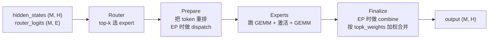
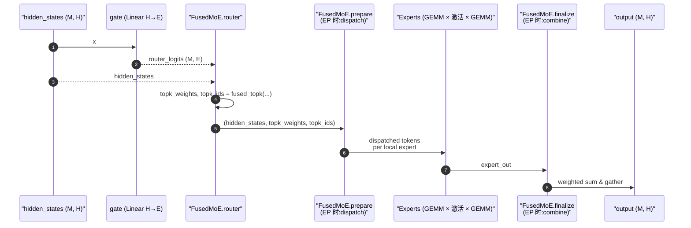
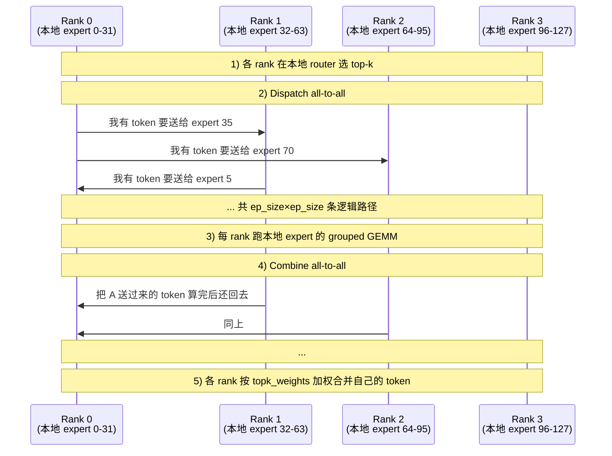
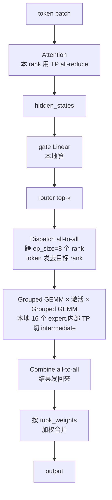

# vLLM MoE / FusedMoE / Expert Parallel 入门:以 Qwen3MoE 为例

> **文档版本**: 1.0
> **分析代码版本**: 当前 workspace 本地 `vllm` 源码（v1 engine）
> **最后更新**: 2026-06-07

---

## 文档概述

本文档是 MoE（Mixture of Experts）和 EP（Expert Parallel）的入门级讲解，**假设读者完全不懂 MoE**。我们会从"普通 transformer 的 MLP 长什么样"讲起,逐步引入"为什么有人想要 MoE"、"router 是什么"、"top-k 是什么"、"vLLM 的 `FusedMoE` 这个 nn.Module 怎么把这一切组织起来",最后讲清楚 EP 是怎么把 expert 切到不同 rank 上的。

整篇用 **Qwen3MoE** 做具体例子,因为它结构清晰、典型(top-k=8、num_experts=128 这种)、源码也好读。

> **本文不讲什么**:不讲 MoE 训练时的 load balancing loss(那是训练侧的事)、不讲 expert 容量丢 token 机制(vLLM 不丢)、不讲 DeepSeek V3 的 grouped topk 细节(只会顺带提)、不讲 quantization 下 MoE 的具体 kernel。

**目标读者**:理解 transformer 基本结构(attention + MLP + residual + norm),但 MoE 是空白的工程师。读完应该能看懂 Qwen3MoE 的 forward 调用栈,并知道 EP 在源码哪一层落地。

**阅读指南**:

| 部分 | 内容 |
|------|------|
| 第一部分 | MoE 从 0 开始:为什么、是什么、怎么算 |
| 第二部分 | router / top-k / 激活的具体含义 |
| 第三部分 | `FusedMoE` 这个 nn.Module 的结构 |
| 第四部分 | Qwen3MoE 的 `Qwen3MoeSparseMoeBlock` 怎么用 FusedMoE |
| 第五部分 | "Fused" 到底融了什么:kernel 视角 |
| 第六部分 | EP(Expert Parallel)入场:把 expert 切到不同 rank |
| 第七部分 | EP + TP + DP 同时存在时的拓扑 |
| 第八部分 | QA |

---

# 第一部分: MoE 从 0 开始

## 1.1 先看一个普通 transformer block

```text
                  ┌──────────────┐
        input  →  │  LayerNorm   │
                  └──────┬───────┘
                         ↓
                  ┌──────────────┐
                  │  Attention   │
                  └──────┬───────┘
                         ↓
                       residual +
                         ↓
                  ┌──────────────┐
                  │  LayerNorm   │
                  └──────┬───────┘
                         ↓
                  ┌──────────────┐
                  │     MLP      │  ← 这里是关键
                  └──────┬───────┘
                         ↓
                       residual +
                         ↓
                       output
```

这里的 `MLP` 是一个标准的两层网络:

```python
class StandardMLP(nn.Module):
    def __init__(self, hidden_size, intermediate_size):
        self.gate_proj = Linear(hidden_size, intermediate_size)
        self.up_proj   = Linear(hidden_size, intermediate_size)
        self.down_proj = Linear(intermediate_size, hidden_size)

    def forward(self, x):
        return self.down_proj(silu(self.gate_proj(x)) * self.up_proj(x))
```

注意三件事:

1. **MLP 是 token-wise 的**:每个 token 的 hidden vector 走同一组权重。
2. **MLP 占模型参数的大头**。在 Llama 类模型里,attention 大概 1/3,MLP 大概 2/3。
3. **`intermediate_size` 通常比 `hidden_size` 大几倍**(Llama 是 ~2.7 倍)。所以 MLP 算是先升维、过激活、再降回原维度。

## 1.2 把"一个 MLP"变成"N 个 MLP"

MoE 的想法极其朴素:**与其让所有 token 都走同一个 MLP,不如准备 N 个独立的 MLP(称为 expert),每个 token 只挑其中 k 个走**。

```text
                普通 MLP                          MoE MLP

  token ──→ [    一个 MLP    ] ──→ y    token ──→ [router] ──┬→ [expert 0] ─┐
                                                              ├→ [expert 1] ─┤
                                                              ├→ [expert 2] ─┼→ 加权和 → y
                                                              ├→ [expert 3] ─┤
                                                              └→ ... [expert N-1]
                                                                只挑 k 个
```

每个 expert 内部和原来的 MLP **结构完全一样**(gate / up / down 三个 linear),只是**权重不同**。所以 MoE 的总参数量 = 普通 MLP 的 N 倍。

为什么这么做?

- **参数量上去了**:总参数从"hidden × inter × 3"变成"hidden × inter × 3 × N"——模型容量大很多。
- **FLOPs 没上去**:每个 token 只算 k 个 expert(典型 k=2 或 k=8),所以每 token 的计算量约等于"k 个普通 MLP"——和原来同量级。
- **结果**:**参数 ↑↑、算力 ↑、效果 ↑↑**。这是 MoE 的核心卖点。

> 一个具体感受:Qwen3-235B-A22B 总参数 235B(很大),每 token 激活 22B(还算适中)。"A22B"就是 "Active 22B"。它有 128 个 expert,top-k=8——每个 token 选 8 个 expert 干活,所以激活参数 ≈ 8/128 × 总参数。

## 1.3 router(gate):谁来决定哪 k 个 expert?

不可能让人手工指定——必须是模型学出来的。最简单的做法是:

```python
class Router(nn.Module):
    def __init__(self, hidden_size, num_experts):
        self.gate = Linear(hidden_size, num_experts, bias=False)

    def forward(self, x):  # x: (num_tokens, hidden_size)
        logits = self.gate(x)              # (num_tokens, num_experts)
        scores = softmax(logits, dim=-1)   # 概率分布
        topk_values, topk_indices = scores.topk(k=2, dim=-1)  # 挑 top-2
        return topk_values, topk_indices
```

读法:

- `gate` 就是一个普通 Linear,输入 hidden,输出 `num_experts` 个 logit。
- `softmax` 让 logit 变成概率分布:`scores[t, e]` 是"token t 应该送给 expert e 的强度"。
- `topk` 选出每个 token 强度最高的 k 个 expert。

最终 expert 输出的合并公式:

```text
y[t] = Σ over selected experts e of  topk_values[t, e] * expert_e(x[t])
```

即"按 router 给出的 top-k 权重对 expert 输出加权求和"。

## 1.4 一个常见的变体:renormalize 和 sigmoid

刚才用 `softmax`,但 softmax 之后再 topk 会让"被选中的几个 expert 的权重总和小于 1"(因为剩下没被选的 expert 也占了概率质量)。两个常见的修正:

| 修正 | 做法 | 谁在用 |
|------|------|--------|
| **renormalize** | topk 选出来之后,再 normalize 一次让权重和为 1 | Qwen3、大部分模型 |
| **sigmoid scoring** | 不用 softmax,改用 sigmoid 独立评分,各 expert 之间不"抢概率" | DeepSeek V3 等 |

源码里在哪选?

```text
vllm/model_executor/layers/fused_moe/router/fused_topk_router.py
```

```python
def fused_topk(
    hidden_states, gating_output, topk, renormalize, indices_type=None,
    scoring_func: str = "softmax",
):
    ...
    if scoring_func == "softmax":
        topk_func = dispatch_topk_softmax_func(...)
        topk_weights, topk_ids = topk_func(
            topk_weights, topk_ids, token_expert_indices, gating_output, renormalize
        )
    elif scoring_func == "sigmoid":
        ...
```

`scoring_func` 和 `renormalize` 都是 `FusedMoE.__init__` 暴露出来的参数。

## 1.5 关于"丢 token":vLLM 不丢

训练侧 MoE 经常会有 expert capacity 限制(每个 expert 一步最多接收多少 token,超出就丢)。**推理时 vLLM 不做 capacity 限制,也不丢任何 token**——所有被路由到 expert 的 token 都会被处理。这一点在源码里通过"没有任何 `capacity_factor` / `drop` 逻辑"体现。读 vLLM MoE 代码时不需要考虑丢 token 这条分支。

---

# 第二部分: router / top-k / activation 的具体含义

## 2.1 router 的输入输出形状

假设这一步要算 `M` 个 token,hidden_size 是 `H`,expert 总数 `E`,top-k 是 `K`。

| 名字 | 形状 | 含义 |
|------|------|------|
| `hidden_states` | `(M, H)` | router 的输入,就是这一步要 MoE 的 token |
| `gating_output` (router logits) | `(M, E)` | 每个 token 对每个 expert 的"想去程度" |
| `topk_weights` | `(M, K)` | 每个 token 最终选中的 K 个 expert 的权重 |
| `topk_ids` | `(M, K)` | 每个 token 最终选中的 K 个 expert 的索引(0..E-1) |

`topk_weights` 是 `float32`,`topk_ids` 是 `int32`——这两个出现在源码里:

```python
# fused_topk()
topk_weights = torch.empty(M, topk, dtype=torch.float32, device=hidden_states.device)
topk_ids     = torch.empty(M, topk, dtype=torch.int32   if indices_type is None
                            else indices_type, device=hidden_states.device)
```

## 2.2 expert 内部的 forward

每个 expert 是 SwiGLU MLP,接收 `(H,)` 输出 `(H,)`,内部一个升维 `(I,)`:

```python
# 概念性写法,真正的实现是 fused kernel
def expert_forward(x_t, w_gate, w_up, w_down):  # x_t: (H,)
    return w_down @ (silu(w_gate @ x_t) * (w_up @ x_t))
```

vLLM 把 `gate` 和 `up` 这两个 linear 的权重**拼成一张大矩阵**叫 `w13_weight`:

```text
vllm/model_executor/layers/fused_moe/unquantized_fused_moe_method.py
```

```python
def create_weights(self, layer, num_experts, hidden_size,
                   intermediate_size_per_partition, params_dtype, ...):
    if self.moe.is_act_and_mul:
        w13_up_dim = 2 * intermediate_size_per_partition  # gate + up 拼在一起
    else:
        w13_up_dim = intermediate_size_per_partition

    # Fused gate_up_proj
    w13_weight = torch.nn.Parameter(
        torch.empty(num_experts, w13_up_dim, hidden_size, dtype=params_dtype),
        requires_grad=False,
    )
    layer.register_parameter("w13_weight", w13_weight)

    # down_proj
    w2_weight = torch.nn.Parameter(
        torch.empty(num_experts, hidden_size, intermediate_size_per_partition,
                    dtype=params_dtype),
        requires_grad=False,
    )
    layer.register_parameter("w2_weight", w2_weight)
```

权重形状的助记:

| 参数 | 形状 | 含义 |
|------|------|------|
| `w13_weight` | `(num_experts, 2*I, H)` | 每个 expert 一份 gate+up 拼起来的"升维 + 门控"权重 |
| `w2_weight`  | `(num_experts, H, I)`   | 每个 expert 一份"降维"权重 |

> **为什么叫 `w13` 而不是 `w12`?** Llama 命名习俗里 gate_proj = w1、down_proj = w2、up_proj = w3,所以"gate 和 up 拼起来"自然叫 w13。`w2` 就是 down。

## 2.3 激活函数

最常见的 MoE 激活:

| 名字 | 公式 | 何时用 |
|------|------|--------|
| `silu` (SwiGLU 的内核) | `silu(gate) * up` | Llama、Qwen3、几乎所有现代 LLM |
| `gelu` | `gelu(gate) * up` | 一些早期 / Google 模型 |
| `relu2` | `relu(x)^2` | 少数实验模型 |

vLLM 把这些都注册在:

```text
vllm/model_executor/layers/fused_moe/activation.py
```

`is_act_and_mul=True` 的含义就是"gate 和 up 拼起来,激活函数会作用在 gate 上,再和 up 相乘"——也就是 SwiGLU 风格。

---

# 第三部分: `FusedMoE` 这个 nn.Module 的结构

## 3.1 入口位置

```text
vllm/model_executor/layers/fused_moe/layer.py
```

`FusedMoE` 是 vLLM 里所有 MoE 模型的 **统一抽象层**——不管是 Qwen3、DeepSeek、Mixtral 还是 Llama4-MoE,最终都会实例化 `FusedMoE`。

为什么要有这层?因为 MoE 的"业务流程"是固定的——router → top-k → 把 token 发给 expert → 跑 GEMM → 合回来——而**实现细节**变化巨大:

- expert 在不在本地?(EP)
- 量化吗?fp8?fp4?awq?
- 用哪个 kernel?Triton?CUTLASS?FlashInfer?
- 跨 rank 用什么 all-to-all?naive?DeepEP?

`FusedMoE` 把这些都封在背后,model 代码只需要 `self.experts(hidden, router_logits)` 一行。

## 3.2 `__init__` 的签名

精简后的核心参数:

```python
class FusedMoE(nn.Module):
    def __init__(
        self,
        num_experts: int,            # 全局 expert 总数
        top_k: int,                  # 每个 token 选几个
        hidden_size: int,            # 模型 hidden dim
        intermediate_size: int,      # 单个 expert 的中间维度
        renormalize: bool = True,
        # —— router 配置 ——
        scoring_func: str = "softmax",       # 或 "sigmoid"
        use_grouped_topk: bool = False,
        num_expert_group: int | None = None, # DeepSeek 风格分组
        topk_group: int | None = None,
        # —— 并行配置 ——
        tp_size: int | None = None,
        ep_size: int | None = None,
        dp_size: int | None = None,
        # —— expert 行为 ——
        activation: str = "silu",
        is_act_and_mul: bool = True,
        has_bias: bool = False,
        apply_router_weight_on_input: bool = False,
        # —— 量化 ——
        quant_config: QuantizationConfig | None = None,
        # —— 可选 shared expert / gate ——
        shared_experts: torch.nn.Module | None = None,
        gate: torch.nn.Module | None = None,
        # —— EPLB(expert load balancing) ——
        enable_eplb: bool = False,
        num_redundant_experts: int = 0,
        # ...
    ):
```

关键观察:

| 参数 | 角色 |
|------|------|
| `num_experts` + `top_k` | 决定 MoE 的"形状" |
| `intermediate_size` | 单 expert 的中间维度,**不是**总和 |
| `tp_size` / `ep_size` / `dp_size` | 并行度——下面专门讲 |
| `gate` | 可以由外部传入,也可以让 FusedMoE 内部建 |
| `shared_experts` | 可选的 shared expert 模块(Qwen3 可能有可能没有) |
| `enable_eplb` | EPLB(动态 expert 重排负载均衡)开关 |

## 3.3 forward 的结构

```python
# vllm/model_executor/layers/fused_moe/layer.py
def forward(self, hidden_states, router_logits, input_ids=None):
    return self.runner.forward(hidden_states, router_logits, input_ids)
```

它把 forward 委托给 `self.runner`(`MoERunner`)。runner 的工作可以分成三段:



| 阶段 | 干什么 | 在哪里 |
|------|--------|--------|
| **Router** | 算 `topk_weights` 和 `topk_ids` | `router/fused_topk_router.py::fused_topk` |
| **Prepare** | 把 token 按 expert 分组、(EP 时)发到目标 rank | `prepare_finalize/naive_dp_ep.py` |
| **Experts** | 对每个 expert 跑 grouped GEMM | `fused_moe.py` 里的 Triton/CUTLASS kernel |
| **Finalize** | (EP 时)收回结果、按权重合并 | `prepare_finalize/naive_dp_ep.py` |

后面"Fused 到底融了什么"和"EP"两节会分别展开 Experts 和 Prepare/Finalize。

---

# 第四部分: Qwen3MoE 的 `Qwen3MoeSparseMoeBlock`

## 4.1 它在模型里的位置

源码:

```text
vllm/model_executor/models/qwen3_moe.py
```

decoder layer 用一个非常常见的 if/else 决定本层是 MoE 还是 dense:

```python
class Qwen3MoeDecoderLayer(nn.Module):
    def __init__(self, config, layer_idx, ...):
        ...
        if (layer_idx not in mlp_only_layers) and (
            config.num_experts > 0
            and (layer_idx + 1) % config.decoder_sparse_step == 0
        ):
            self.mlp = Qwen3MoeSparseMoeBlock(vllm_config=vllm_config, prefix=...)
        else:
            self.mlp = Qwen3MoeMLP(...)  # 普通 dense MLP
```

读法:

- `decoder_sparse_step=1` 意味着**每层都是 MoE**(Qwen3 的常见配置)。
- `decoder_sparse_step=2` 就是 dense 和 MoE 交替。
- `mlp_only_layers` 可以显式把某些 layer 强制设为 dense。

也就是说 MoE 在 Qwen3MoE 里**完全替代了原来的 MLP**——不是叠加,是替换。

> **Qwen3-VL-MoE 的复用**:VL 版本(`vllm/model_executor/models/qwen3_vl_moe.py`)的语言侧 `Qwen3MoeLLMModel` 继承自 `Qwen3MoeModel`,直接 `from .qwen3_moe import Qwen3MoeSparseMoeBlock` 复用同一个 MoE 块。所以下面这一节讲的所有结构对 Qwen3-VL-MoE 也成立——区别只在前面多了一个 vision encoder + deepstack 接入,文本骨干一模一样。

## 4.2 `Qwen3MoeSparseMoeBlock.__init__` 源码精读

```python
class Qwen3MoeSparseMoeBlock(nn.Module):
    def __init__(self, vllm_config: VllmConfig, prefix: str = ""):
        super().__init__()

        config = vllm_config.model_config.hf_text_config
        parallel_config = vllm_config.parallel_config
        quant_config = vllm_config.quant_config

        self.tp_size = get_tensor_model_parallel_world_size()
        self.ep_group = get_ep_group().device_group
        self.ep_rank = get_ep_group().rank_in_group
        self.ep_size = self.ep_group.size()
        self.n_routed_experts = config.num_experts

        self.is_sequence_parallel = parallel_config.use_sequence_parallel_moe

        if self.tp_size > config.num_experts:
            raise ValueError(...)

        # EPLB 相关
        eplb_config = vllm_config.parallel_config.eplb_config
        self.enable_eplb = parallel_config.enable_eplb
        self.n_logical_experts = self.n_routed_experts
        self.n_redundant_experts = eplb_config.num_redundant_experts
        self.n_physical_experts = self.n_logical_experts + self.n_redundant_experts
        self.n_local_physical_experts = self.n_physical_experts // self.ep_size

        self.physical_expert_start = self.ep_rank * self.n_local_physical_experts
        self.physical_expert_end = (
            self.physical_expert_start + self.n_local_physical_experts
        )

        # 1) router/gate:一个普通 Linear
        self.gate = ReplicatedLinear(
            config.hidden_size, config.num_experts,
            bias=False, quant_config=quant_config,
            prefix=f"{prefix}.gate",
        )

        # 2) shared expert:Qwen3 默认没有,但保留代码兼容性
        shared_expert_intermediate_size = getattr(
            config, "shared_expert_intermediate_size", 0
        )
        if shared_expert_intermediate_size > 0:
            self.shared_expert_gate = ReplicatedLinear(config.hidden_size, 1, bias=False, ...)
            self.shared_expert = Qwen3MoeMLP(
                hidden_size=config.hidden_size,
                intermediate_size=shared_expert_intermediate_size,
                hidden_act=config.hidden_act,
                reduce_results=False,
                expert_gate=self.shared_expert_gate,
                ...
            )
        else:
            self.shared_expert_gate = None
            self.shared_expert = None

        # 3) 核心:FusedMoE
        self.experts = FusedMoE(
            shared_experts=self.shared_expert,
            gate=self.gate,
            num_experts=self.n_routed_experts,
            top_k=config.num_experts_per_tok,
            hidden_size=config.hidden_size,
            intermediate_size=config.moe_intermediate_size,
            renormalize=config.norm_topk_prob,
            quant_config=quant_config,
            prefix=f"{prefix}.experts",
            enable_eplb=self.enable_eplb,
            num_redundant_experts=self.n_redundant_experts,
            is_sequence_parallel=self.is_sequence_parallel,
        )
```

要点:

| 字段 | 含义 |
|------|------|
| `ReplicatedLinear` | 这个 gate 在所有 TP rank 上**完整复制**,不切。因为 router 输出维度只是 `num_experts`(几百),切了没意义 |
| `config.num_experts_per_tok` | 这就是 **top-k**(Qwen3 通常 = 8) |
| `config.moe_intermediate_size` | **单 expert** 的中间维度(注意:**不是** dense 模型的 intermediate_size,通常更小) |
| `config.norm_topk_prob` | 就是 `renormalize` 开关 |
| `shared_experts=self.shared_expert` | 即便 Qwen3 默认没有,接口上还是把它传给 FusedMoE 统一管理 |

> **Qwen3 系列的典型配置**(从已发布权重的 config 推):
> - **Qwen3-30B-A3B**: `num_experts=128`, `num_experts_per_tok=8`, `moe_intermediate_size=768`(每 expert 比较小)
> - **Qwen3-235B-A22B**: `num_experts=128`, `num_experts_per_tok=8`, `moe_intermediate_size=1536`, `hidden_size=4096`, 94 层
> - **Qwen3-VL-MoE**(`Qwen3VLMoeForConditionalGeneration`): 文本骨干和 235B-A22B 形状**完全一致**(`num_experts=128`, `top_k=8`, `moe_intermediate_size=1536`, `hidden_size=4096`, 94 层, `decoder_sparse_step=1`, 无 shared expert),只是在前面接了一个 vision encoder。`text_config.intermediate_size=12288` 是 dense MLP 的中间维度,因为 `mlp_only_layers=[]` 且 `decoder_sparse_step=1`,**所有 layer 都走 MoE,这个值在推理路径上不会被用到**
>
> "A3B/A22B" 中的"A"就是 activated——每个 token 实际激活的参数量。

## 4.3 forward

```python
def forward(self, hidden_states: torch.Tensor) -> torch.Tensor:
    assert hidden_states.dim() <= 2
    is_input_1d = hidden_states.dim() == 1
    num_tokens, hidden_dim = hidden_states.shape
    hidden_states = hidden_states.view(-1, hidden_dim)

    if self.is_sequence_parallel:
        hidden_states = sequence_parallel_chunk(hidden_states)

    if self.experts.is_internal_router:
        # 常见路径:gate 已经在构造时传进 FusedMoE,FusedMoE 内部自己跑 router
        final_hidden_states = self.experts(
            hidden_states=hidden_states, router_logits=hidden_states
        )
    else:
        router_logits, _ = self.gate(hidden_states)
        final_hidden_states = self.experts(
            hidden_states=hidden_states, router_logits=router_logits
        )

    if self.is_sequence_parallel:
        final_hidden_states = tensor_model_parallel_all_gather(final_hidden_states, 0)
        final_hidden_states = final_hidden_states[:num_tokens]

    return final_hidden_states.squeeze(0) if is_input_1d else final_hidden_states
```

注意 `is_internal_router` 这条分支:**因为 `gate` 在构造时就传给了 FusedMoE**,在量化或特殊 kernel 路径下,FusedMoE 可以把 gate 的 GEMM 和 expert 的 GEMM 打包成一个更大的融合 kernel。所以这里直接把 `router_logits=hidden_states` 传进去,FusedMoE 内部自己算 gate。

把 forward 流程具象化:



---

# 第五部分: "Fused" 到底融了什么

到这里你可能想问:**为什么这个 module 叫 "Fused"MoE?它"融"了什么?**

## 5.1 朴素实现 vs Fused 实现

朴素的 MoE 一步可能长这样(假设 num_experts=4, top_k=2):

```python
# 朴素版,绝不要在 production 这么写
for t in range(num_tokens):
    out_t = 0
    for j in range(top_k):
        e = topk_ids[t, j]
        w = topk_weights[t, j]
        # 启动 1 个 GEMM、1 个激活、1 个 GEMM
        h = silu(W13[e] @ x[t]) * (W13[e].second_half @ x[t])
        y = W2[e] @ h
        out_t += w * y
```

问题:**每个 token 启动 3 个 small GEMM kernel,GPU 上完全无法掩盖 kernel launch 开销**。

Fused 版的思路是:**先按 expert 把 token 排序、分组,然后每个 expert 用一个 grouped GEMM 处理所有送给它的 token,再 scatter 回去**。

```text
原始顺序的 token:
  [t0  t1  t2  t3  t4  t5]

router 给的 expert 分配 (top_k=2):
  t0 → [E0, E2]
  t1 → [E0, E3]
  t2 → [E1, E2]
  t3 → [E0, E1]
  t4 → [E2, E3]
  t5 → [E1, E3]

按 expert 重排:
  E0 接收: [t0, t1, t3]
  E1 接收: [t2, t3, t5]
  E2 接收: [t0, t2, t4]
  E3 接收: [t1, t4, t5]

现在每个 expert 一次 grouped GEMM 算完它的所有 token。
```

这就是 fused kernel 的核心:

| 算子 | 描述 |
|------|------|
| **gate_proj GEMM** | grouped GEMM:对每个 expert 的 token 组算 `W13_e @ X_e` |
| **激活** | 对结果做 `silu(gate) * up`,通常融在 GEMM 后面 |
| **down_proj GEMM** | 第二个 grouped GEMM:`W2_e @ activated_e` |
| **scatter + weighted sum** | 按 topk_weights 把每个 expert 的输出加回原 token |

Triton / CUTLASS / FlashInfer 都有针对 grouped GEMM 优化过的 kernel,它们就是 vLLM `fused_moe.py` 调用的对象。

## 5.2 Triton vs CUTLASS vs FlashInfer

vLLM 不止一个 fused MoE kernel:

```text
vllm/model_executor/layers/fused_moe/fused_moe.py          # Triton kernel(默认)
vllm/model_executor/layers/fused_moe/cutlass_moe.py        # CUTLASS kernel
vllm/model_executor/layers/fused_moe/flashinfer_*.py       # FlashInfer kernel
vllm/model_executor/layers/fused_moe/trtllm_*.py           # TRT-LLM kernel
```

选哪个由 `quant_config` 和硬件能力共同决定:

| Kernel | 何时选 |
|--------|--------|
| Triton(默认) | bf16/fp16 unquantized,几乎所有 GPU |
| CUTLASS | fp8、特定 GPU(H100 等) |
| FlashInfer | 一些场景下更快,需要 FlashInfer >= 0.2 |
| TRT-LLM | TensorRT-LLM 后端 |

这些 kernel 的接口都被 `FusedMoEMethodBase`(`unquantized_fused_moe_method.py` 等)统一封装,所以从 Qwen3MoE 视角看起来只是"创建权重 + forward"两个 hook。

## 5.3 一个微妙参数:`apply_router_weight_on_input`

默认情况下,权重应用顺序是:

```text
expert 输出 → 乘 topk_weight → 求和
```

但如果 `top_k == 1`,可以把乘法挪到 expert 之前:

```text
x * topk_weight → 送入 expert → 直接输出
```

数学上等价(对单 expert 是线性的),但**减少一次 multiply pass**。源码:

```text
vllm/model_executor/layers/fused_moe/prepare_finalize/naive_dp_ep.py
```

```python
if apply_router_weight_on_input:
    topk = topk_ids.size(1)
    assert topk == 1, "apply_router_weight_on_input is only implemented for topk=1"
    a1 = a1 * topk_weights.to(a1.dtype)
```

Qwen3 top_k=8,不走这条;但有些 top_k=1 的模型可以。

---

# 第六部分: EP(Expert Parallel)入场

## 6.1 不开 EP 时,FusedMoE 是怎样的

假设 `ep_size=1`(默认):

- **每个 GPU 持有全部 expert 的权重**。Qwen3-30B-A3B 有 128 expert,每个 expert 大概 ~250MB,128 expert ~ 32GB——这只是 MoE 部分的权重,attention 还要算。
- forward 时 router 算完 top-k,直接在本地 grouped GEMM。
- **不需要任何 expert 维度的通信**(TP 维度的 all-reduce 仍然有)。

显然这种"每 GPU 全套 expert"的方式很贵——这是 EP 出场的理由。

## 6.2 EP 的核心想法

> 把 N 个 expert 切给 ep_size 个 rank,每个 rank 只持有 `N / ep_size` 个 expert。token 需要某个 expert 时,把它发到持有该 expert 的 rank 上去算,算完发回来。

```text
EP=4, num_experts=128:

  rank 0:  expert 0..31
  rank 1:  expert 32..63
  rank 2:  expert 64..95
  rank 3:  expert 96..127
```

后果:

| 维度 | 收益 / 代价 |
|------|-------------|
| 每 rank 显存 | 砍 4 倍(只持有 1/4 expert) |
| 每 rank 算力 | 不变(每 rank 处理的 token 数也降到 1/4) |
| 通信 | 每步增加一对 all-to-all(dispatch + combine) |

## 6.3 vLLM 里 EP 的 `ep_size` 怎么定?

```text
vllm/config/parallel.py
```

`enable_expert_parallel: bool = False` 控制开关。开了之后,EP group **等于 DP × TP** 那个大 group:

```text
ep_size = dp_size * tp_size
```

为什么这样?因为通常你不想浪费任何 GPU——既然有 DP × TP 个 GPU 在跑同一份模型,每个 GPU 持有 expert 的一个 shard 是最大化利用显存的做法。

> 注意:这里"DP"和上文(DP 文档)里的 DP 是同一个概念——多份模型副本,但开了 EP 之后,这些副本不再是"完全独立的复制",而是**共同持有 expert 切片**。所以"dense DP 在 engine 层零协作"那句话**只对 dense 模型成立**;MoE 模型的 DP rank 是要 all-to-all 协作的。

源码里 EP rank 信息怎么用:

```python
# qwen3_moe.py 的 Qwen3MoeSparseMoeBlock.__init__
self.ep_group = get_ep_group().device_group
self.ep_rank = get_ep_group().rank_in_group
self.ep_size = self.ep_group.size()

self.n_local_physical_experts = self.n_physical_experts // self.ep_size
self.physical_expert_start = self.ep_rank * self.n_local_physical_experts
self.physical_expert_end = (
    self.physical_expert_start + self.n_local_physical_experts
)
```

每个 rank 只创建 `[start, end)` 区间的 expert 权重——这是 EP 真正落地的位置。

## 6.4 all-to-all:dispatch 和 combine

EP 模式下,一次 MoE forward 多了两个 collective:



源码:

```text
vllm/model_executor/layers/fused_moe/prepare_finalize/naive_dp_ep.py
```

```python
# Dispatch
res = get_ep_group().dispatch(
    a1q, topk_weights, topk_ids,
    is_sequence_parallel=self.is_sequence_parallel,
    extra_tensors=extra_tensors,
)

# (中间是 expert 计算)

# Combine
output.copy_(
    get_ep_group().combine(out, is_sequence_parallel=self.is_sequence_parallel)
)
```

`get_ep_group().dispatch` / `combine` 是一对抽象接口,背后挂着不同的 **all2all backend**——这是 vLLM 的一个关键扩展点。

## 6.5 All2All 后端

```text
vllm/config/parallel.py
```

```python
All2AllBackend = Literal[
    "naive",
    "allgather_reducescatter",
    "pplx",
    "deepep_high_throughput",
    "deepep_low_latency",
    "mori_high_throughput",  # ROCm
    "mori_low_latency",      # ROCm
    "nixl_ep",
    "flashinfer_nvlink_two_sided",
    "flashinfer_nvlink_one_sided",
]
```

读法:

| 后端 | 何时用 | 特点 |
|------|--------|------|
| `naive` | 不依赖任何外部库 | 用 PyTorch all_to_all_single,正确但慢 |
| `allgather_reducescatter` | 标准 NCCL 路径 | 把 dispatch/combine 拆成 allgather + reducescatter |
| `pplx` | 装了 pplx-kernels | 极致优化的 all-to-all |
| `deepep_high_throughput` / `low_latency` | DeepSeek 团队开源的 DeepEP | prefill 用 high throughput,decode 用 low latency |
| `flashinfer_*` | FlashInfer 后端 | NVLink topology 上做 P2P 优化 |
| `mori_*` | AMD ROCm 平台 | AMD 版本的 high/low latency 路径 |

选哪个由 `--all2all-backend` 命令行参数或 config 决定。默认是 `allgather_reducescatter`。

## 6.6 dispatch 到底"散发"了什么

很多人一开始以为 dispatch 散发的是 expert 权重——**不是**。**weights 是静态的、永远在 own 它的 rank 上**;**dispatch 散发的是 token 的 activations**。

具体来说,一次 dispatch 的输入输出大致是:

```text
输入(本 rank):
  - a1q:  (M, H)           本 rank 持有的 token 的 hidden
  - topk_weights: (M, K)   它们的 topk 权重
  - topk_ids:     (M, K)   它们要去的 expert id

输出(本 rank):
  - dispatched_a1q:           (M', H)   本 rank 即将处理的 token(可能来自别的 rank)
  - dispatched_topk_weights:  (M', K')
  - dispatched_topk_ids:      (M', K')
```

其中 `M'` 是"本 rank **将要处理**的 token 数"——它一般和 `M`(本 rank **拥有**的 token 数)不一样,因为别的 rank 可能发了一堆 token 过来,而你的 token 也跑到别处去了。

combine 是反过来:把"本 rank 算完后属于别人的"还回去,把"别人帮你算的"收回来。

## 6.7 为什么 DPEngineCoreProc 只 MoE 才有

读完上面这一节就理解了:

- **dense 模型**:expert 不存在,没有 all-to-all,DP rank 之间根本不通信 → 不需要 `DPEngineCoreProc`,不需要 wave 协议。
- **MoE 模型 + EP**:每一步都要 all-to-all dispatch/combine,collective 强制所有参与方步调一致 → 必须 wave 协议保 DP rank 同步。

参考 [vllm_pp_dp.md](vllm-study/markdown/vllm_pp_dp.md) 第六部分讲的 dense vs MoE 对照。

---

# 第七部分: EP + TP + DP 同时存在时的拓扑

## 7.1 维度公式

```text
ep_size = dp_size * tp_size           (开了 enable_expert_parallel 后)
每个 GPU 持有的 expert 数 = num_experts / ep_size
每个 expert 的内部 intermediate_size = moe_intermediate_size / tp_size
```

注意 TP 在 MoE 里的作用变了:它不再像 dense MLP 那样"把 hidden 切片",而是**在 expert 内部把 intermediate_size 切片**。也就是说,**TP 和 EP 各管一个维度**:

| 维度 | 被谁切 |
|------|--------|
| `num_experts` | EP(横向切,每 rank 持有几个 expert) |
| `intermediate_size`(单 expert 内) | TP(纵向切,每 rank 持有 expert 的一部分中间维) |
| `hidden_size` | 不切 |

## 7.2 一个例子:Qwen3-235B-A22B,DP=2 TP=4

- `num_experts = 128`
- `moe_intermediate_size = 1536`
- `top_k = 8`
- 总 GPU 数 = `dp_size × tp_size × pp_size = 2 × 4 × 1 = 8`

启用 `enable_expert_parallel`:

- `ep_size = 2 × 4 = 8`
- 每 GPU 持有 expert 数 = `128 / 8 = 16`
- 每 expert 内 intermediate = `1536 / 4 = 384`

每 GPU 上的 expert 权重显存:

```text
16 experts × (2 × 384 × 4096 + 4096 × 384) × 2 byte (bf16)
= 16 × (3.15M + 1.57M) × 2
≈ 16 × 4.72M × 2
≈ 151 MB(per layer)
```

Qwen3 235B 有 ~94 层,所以 MoE 权重 ≈ 14GB / GPU——再加上 attention 和其他 ≈ 16~17GB 量级。如果不开 EP,128 experts 不切,每 GPU 是 ≈ 14GB × 8 = 112GB,单 H100 80GB 都装不下。

## 7.3 一次 forward 里发生的事



每步多了 dispatch + combine 这两个 collective,但单 GPU 只算 1/8 的 expert,显存压力小 8 倍。

## 7.4 几个常见疑问

**Q: 为什么不用更大的 EP(比如 EP=16、EP=32)?**
要让 `ep_size = dp_size × tp_size`,意味着要加更多 GPU。EP 数最大不超过 expert 数(否则有些 rank 没 expert)。Qwen3 128 expert 上,EP 最大就是 128——但实际中 EP=8 或 16 已经够把单 GPU 显存降下来,再大收益边际递减、通信代价反而占主导。

**Q: top_k=8、ep_size=8,极端情况下一个 token 是不是要发到 8 个 rank?**
是的。所以 dispatch 的通信量是 `M × top_k × H` 量级。combine 也一样。这就是为什么 high-throughput backend(DeepEP)在 prefill 阶段对吞吐影响关键。

**Q: 不开 enable_expert_parallel,DP MoE 怎么跑?**
那就退化成"每 DP rank 全套 expert,自己算自己的"——既费显存又费算力。所以 MoE + DP 几乎总是配着 enable_expert_parallel 一起开。

---

# 第八部分: QA

## Q1: 普通 dense MLP 和 MoE expert 的内部结构真的一模一样吗?

是的。Qwen3MoE 的 `Qwen3MoeMLP`(dense)和单个 expert 都是 SwiGLU 风格的"gate + up + down"。区别只在:

- dense MLP 只有一份权重,所有 token 都过它;
- expert 有 N 份权重,每个 token 通过 router 选 top-k 个走;
- expert 的 `intermediate_size` 通常更小(`moe_intermediate_size`),用更小的 expert × 更多个 expert 来扩参数。

## Q2: 推理时 router 是怎么"路由"的?有没有 batch?

router 就是一个 `Linear(H → E)` + topk。**它本身是 token-wise 的、可 batch 的**——一次性对所有 `M` 个 token 算 logits,然后按行 topk。所以 router 几乎不占额外时间,基本免费。

## Q3: 为什么 vLLM 的 `gate` 是 `ReplicatedLinear` 而不是切?

因为输出维度 `num_experts` 通常只有几十到几百,切了之后通信开销远超计算节省。所以 gate 在所有 TP rank 上完整复制——每张卡都算一遍同样的 router logits。这是个常见的"过小的层不值得切"的取舍。

## Q4: `w13_weight` 形状是 `(num_experts, 2I, H)`,为什么不是 `(num_experts, I, H)` 各放两份?

因为打包成 `2I` 后,一次 GEMM 就能同时算出 gate 和 up,然后切两半再做 `silu(gate) * up`。如果分两个 GEMM,kernel launch 翻倍、显存访问也低效。这就是 Llama 系列普遍用的 "fused gate_up" trick,MoE 里继续用。

## Q5: 那么 EP 下,每个 rank 的 `w13_weight` 形状是?

`(n_local_experts, 2 * I_per_TP, H)`。其中:

- `n_local_experts = num_experts / ep_size`(EP 横向切)
- `I_per_TP = moe_intermediate_size / tp_size`(TP 纵向切)
- `H` 不切

所以每张卡的 MoE 权重相对于"全套不切" = `1 / (ep_size × tp_size)` ≈ `1 / 总 GPU 数`(开了 EP 之后)。

## Q6: dispatch / combine 是 NCCL all_to_all 吗?

`naive` 后端就是 `torch.distributed.all_to_all_single`,底层是 NCCL all-to-all。其他后端(DeepEP / pplx / FlashInfer)是各自实现的 P2P + 自定义 kernel 组合,目的是在 token 数不均的情况下也能高效。NCCL 标准 all-to-all 要求各 rank 收发数据量相等,而 MoE 的发送量是按 expert 分布的、天然不均——所以高级后端会用 dynamic / unbalanced 模式。

## Q7: `is_internal_router` 是什么?

在量化 / 特殊 kernel 路径下,把 router 的 GEMM 融进 expert 路径里,可以省一次 hidden_states 的传输。所以 `Qwen3MoeSparseMoeBlock` 把 `self.gate` 作为参数传给 `FusedMoE`,`FusedMoE` 会决定"我自己跑 gate"或"用你已经算好的 router_logits"。如果走前者,模型代码就要传 `router_logits=hidden_states` 当占位。

## Q8: top-k=1 和 top-k=8 在 GPU 上差多少?

top-k=8 大概是 8 倍的 expert 计算量 + 8 倍的 dispatch / combine 流量。但 GPU 上 grouped GEMM 对 batch 大小敏感,top-k=8 让每个 expert 收到的 token 更多,kernel 效率反而更高。所以**性能不是 8 倍线性下降**,通常是 3-5 倍范围内,而模型质量 top-k=8 远好于 top-k=1。

## Q9: 什么是 EPLB?

Expert Parallel Load Balancing——动态调整 expert 在 rank 上的分布,因为实际推理时某些 expert 总是比别的 expert 热门(token 偏好它们)。EPLB 用 `num_redundant_experts` 创建副本,把热门 expert 多复制几份散在不同 rank 上,缓解局部 hotspot。源码里 `enable_eplb=True` 触发这条路径,Qwen3MoE `__init__` 里能看到 `n_physical_experts = n_logical_experts + n_redundant_experts`。

## Q10: Qwen3 有 shared expert 吗?

**分情况**——`Qwen3MoeSparseMoeBlock.__init__` 用 `getattr(config, "shared_expert_intermediate_size", 0)`,所以是否启用完全取决于 HF config 里这个 field 是否 `> 0`:

| 模型 | `shared_expert_intermediate_size` | 有没有 shared expert |
|------|----------------------------------|---------------------|
| Qwen3-30B-A3B / Qwen3-235B-A22B(text-only) | 0 / 不存在 | 没有 |
| Qwen3-VL-MoE | field 不存在 → 默认 0 | 没有 |
| Qwen3-Omni 的 thinker(主语言模型) | 0 | 没有 |
| **Qwen3-Omni 的 talker(audio decoder)** | **768** | **有** |

所以"Qwen3 没有 shared expert"对**文本侧**(text-only / VL / Omni-thinker)成立,但 Omni 的 talker 模块是反例。代码里保留这条分支既是为了 talker 这种内部有 shared expert 的 Qwen3 子模型,也是为了兼容 DeepSeek V2 / Qwen2-MoE / Mixtral 等外部模型——它们在每个 token 上,除了走 top-k expert,还会无条件走一个"shared MLP"。

## Q11: MoE 推理慢在哪?

主要慢在两件事:

1. **all-to-all 通信**:跨 rank dispatch / combine 是 collective,网络快慢 / 拓扑(NVLink vs PCIe vs IB)直接影响。
2. **grouped GEMM 利用率**:如果某些 expert 收到的 token 很少,GEMM kernel 在小 M 上效率低。
   - 这就是 EPLB 想解决的问题。
   - 也是 DeepEP 这类 backend 优化的对象——专门为不均匀分布优化的 dispatch 算法。

而 router 本身、激活函数本身都不是瓶颈。

## Q12: 推理时一个 token 真的会"独立选 expert",和 batch 里其他 token 的选择无关吗?

对。**推理时 router 是 stateless 的、纯 token-wise 的**——每个 token 自己看自己的 hidden,自己选 top-k expert。不像训练时为了 load balancing 会引入辅助 loss / 强制均匀化,推理就让它自然分布。如果分布很不均,EPLB 在 rank 间做对策;再不均也只是慢,不影响正确性。

## Q13: 我看到一些代码里有 `shared_experts` 参数被传给 FusedMoE,但 Qwen3 没用,这有什么用?

`FusedMoE` 把 shared expert 也接管了,是因为有些后端可以**把 shared expert 的计算和 routed expert 的计算合并进同一个 kernel call**——比如同时跑两组 GEMM。统一管理可以让这种优化对模型代码透明。Qwen3 没用 shared expert,所以这个参数传了 `None`,代码路径退化。

## Q14: 不开 EP,只开 TP 来跑 MoE,显存能撑得住吗?

可以但很贵。TP 只切 `moe_intermediate_size`,不切 `num_experts`。所以每张卡仍然要持有**完整 128 个 expert 的权重**,只是每个 expert 的中间维度小了 TP 倍。对 Qwen3-235B 这种规模就基本不可行——这也是为什么 MoE 模型几乎总要开 EP。

## Q15: 我怎么知道我应该开多大的 EP?

经验:

- 优先让 `ep_size × per_GPU_memory ≥ MoE 权重总量 × 安全系数`
- `ep_size ≤ num_experts`(显然)
- `ep_size = dp_size × tp_size`,所以实际上是先决定 dp / tp,EP 自动跟着定
- 通信带宽允许的话,大点 EP 显存更省,但 all-to-all 延迟变高——对 decode 不利,对 prefill 影响小

实操建议:**先按显存定下 ep_size 下限,再用 high-latency / low-latency 后端按 prefill / decode 阶段切换**。

---

# 总结

MoE 的核心思想是"参数 ↑↑ 但 FLOPs 持平"——通过 router 给每个 token 选 top-k 个 expert 来实现。整套流程在 vLLM 里被 `FusedMoE` 这个 nn.Module 封装,模型代码(比如 `Qwen3MoeSparseMoeBlock`)只看到一行 `self.experts(hidden_states, router_logits)`,背后的细节由 router / prepare / experts kernel / finalize 四段流水线接力完成。

EP 把 expert 切到不同 rank 上,每 rank 只持有 `num_experts / ep_size` 个 expert,token 通过 all-to-all dispatch 发到目标 rank、算完再 combine 回来。`ep_size = dp_size × tp_size`,所以 MoE 模型的 DP rank 不再是"独立复制",而是协同持有 expert 切片——这也是 [vllm_pp_dp.md](vllm-study/markdown/vllm_pp_dp.md) 里 dense DP 和 MoE DP 差别的来源。

读完之后再看 [vllm/model_executor/models/qwen3_moe.py](vllm/vllm/model_executor/models/qwen3_moe.py),整个调用栈应该是这样的:

```text
Qwen3MoeDecoderLayer.__init__
  → if MoE layer: self.mlp = Qwen3MoeSparseMoeBlock(...)

Qwen3MoeSparseMoeBlock.__init__
  → self.gate = ReplicatedLinear(H, num_experts)
  → self.experts = FusedMoE(
        num_experts=128,
        top_k=8,
        hidden_size=H,
        intermediate_size=moe_intermediate_size,
        renormalize=True,
        gate=self.gate,
        ...
    )

forward path:
  hidden_states (M, H)
    ↓ self.experts(hidden_states, router_logits=hidden_states)
  FusedMoE.forward
    ↓ runner.forward
  router.fused_topk()             → topk_weights, topk_ids
    ↓
  prepare(EP dispatch all-to-all) → dispatched 到本地的 token
    ↓
  kernel(grouped GEMM × silu × grouped GEMM)
    ↓
  finalize(EP combine all-to-all + weighted sum)
    ↓
  output (M, H)
```

下次看到 Qwen3-235B-A22B 这种命名时,你应该能立刻翻译出来:**总 235B 参数,每 token 激活 22B,有 128 个 expert,top_k=8——所以 22B ≈ 8/128 × 235B 加上各层 attention 和 dense 部分**。再配合 EP=8 这种部署,每张 GPU 持有 16 个 expert 的权重切片,日子就过得下去了。
