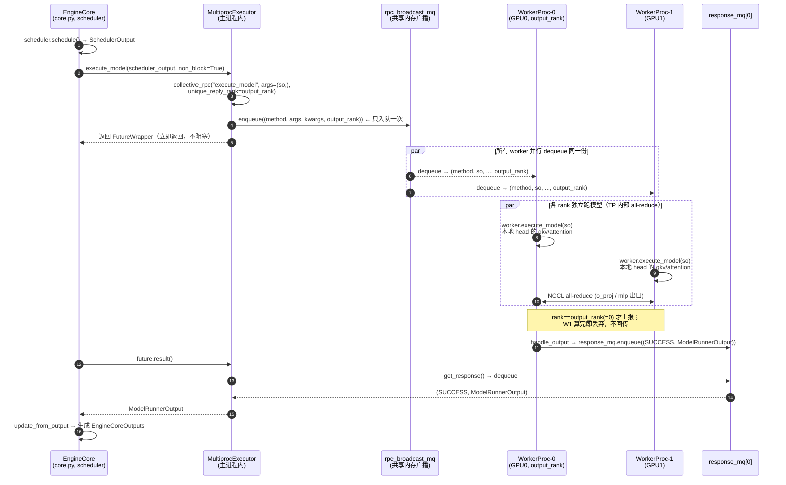

# vLLM V1 MultiprocExecutor：从 EngineCore 到多卡 Worker 的执行层

> 代码位置：`vllm/v1/executor/multiproc_executor.py`
> 相关文件：`vllm/v1/executor/abstract.py`（`Executor` 基类）、`vllm/v1/engine/core.py`（调用方）、`vllm/v1/worker/worker_base.py`（`WorkerWrapperBase`）、`vllm/distributed/device_communicators/shm_broadcast.py`（`MessageQueue`）
> 适用版本：V1 引擎（`vllm/v1`）

本文聚焦 vLLM V1 里 **Executor 这一层**：它夹在「EngineCore（调度器）」和「一组 GPU Worker 进程」之间，是把"一个 step 的调度结果"扇出（broadcast）到 TP/PP 全部 rank、再把结果收回来的枢纽。我们会先把它在全系统中的位置画清楚，给一张端到端时序图，然后逐段读 `MultiprocExecutor` 与 `WorkerProc` 的源码。

读完应该能回答这些问题：

- EngineCore 调一次 `execute_model` 之后，到底发生了什么？
- TP=8 时，8 个 rank 是怎么拿到**同一份** `scheduler_output` 的？（这正是"TP 不切 batch，只切权重"的工程落点）
- 为什么只有一个 rank 把结果送回来（`output_rank`）？
- `non_block=True` 的 future 是怎么实现"按提交顺序排队取结果"的？
- worker 进程是怎么起来的、怎么 READY 握手、怎么优雅退出的？

---

## 1. Executor 在全系统中的位置

vLLM V1 的进程分三层，Executor 在**最底层那条进程边界之内**：

```
┌──────────────── 前端进程 (API server) ────────────────┐
│  AsyncLLM / LLMEngine                                 │
│    └── EngineCoreClient ──(ZMQ)──┐                     │
└──────────────────────────────────┼────────────────────┘
                                    │ 进程边界 (ZMQ)
┌──────────────── EngineCore 进程 ──▼────────────────────┐
│  EngineCore                                            │
│    ├── Scheduler          : 决定这个 step 跑哪些 token   │
│    └── self.model_executor: Executor 实例  ◄── 本文主角  │
│            │                                           │
│            │  rpc_broadcast_mq (共享内存广播队列)         │
│   ┌────────┼─────────┬─────────────┬─────────┐         │
│   ▼        ▼         ▼             ▼         ▼         │
│ Worker-0  Worker-1  Worker-2 ...  Worker-(N-1)         │  ← 每个一个子进程
│  GPU0      GPU1      GPU2          GPU(N-1)            │
│   │        │         │             │                   │
│   └──── response_mq ─┴── (只有 output_rank 真正回传) ──┘  │
└────────────────────────────────────────────────────────┘
```

要点：

- **EngineCore 进程**里有一个 `self.model_executor`（见 `core.py:122` `self.model_executor = executor_class(vllm_config)`）。多卡场景下它是 `MultiprocExecutor`。
- Executor **不在** worker 进程里。它运行在 EngineCore 进程（也就是 scheduler 所在进程），负责"发指令 + 收结果"。
- 每个 GPU 对应一个 **`WorkerProc` 子进程**。`world_size = tp_size × pp_size × pcp_size`（见 `_init_executor` 里的 assert，`multiproc_executor.py:118`）。
- 通信用的不是 ZMQ，而是 vLLM 自己的**共享内存消息队列 `MessageQueue`**（`shm_broadcast.py`）：一个**下行广播队列** `rpc_broadcast_mq`（executor→所有 worker），N 个**上行响应队列** `response_mqs`（每个 worker→executor）。

> 注意区分两条 ZMQ/MQ 边界：前端↔EngineCore 是 ZMQ（另一篇《AsyncMPClient / EngineCore 进程模型》讲过）；EngineCore↔Worker 是本文的共享内存 `MessageQueue`。

---

## 2. 端到端时序图：一次 `execute_model`

下面这张图把"EngineCore 调度完一个 step → Executor 扇出 → 各 Worker 跑模型 → 结果收回"的链路画全。以 **TP=2、同步调度** 为例。



几个关键判断，后面会逐一对上代码：

- 第 4 步 **enqueue 只发生一次**：一条消息进广播队列，所有 worker 都能读到同一份。这就是"每个 rank 拿到相同 `scheduler_output`"的实现——**batch 没有被切分**。
- 第 9 步 worker 之间的 all-reduce 是在**模型 forward 内部**（`RowParallelLinear` 等）发生的，Executor 完全不参与、也不知情。
- 第 10～11 步：只有 `output_rank` 把 `ModelRunnerOutput` 写回 `response_mq`，其余 rank 算完就丢。
- `non_block=True` 让 `execute_model` 立刻返回一个 future，EngineCore 可以先去干别的（PP 流水线 / async 调度），需要结果时再 `.result()`。

---

## 3. 调用方：EngineCore 怎么用 Executor

先看上游，理解 Executor 的接口契约。`core.py` 构造时：

```python
# vllm/v1/engine/core.py
self.model_executor = executor_class(vllm_config)          # :122
```

跑一个 step 时（异步调度路径，`core.py:455` 附近）：

```python
future = self.model_executor.execute_model(scheduler_output, non_block=True)
...
model_output = self.model_executor.sample_tokens(grammar_output)
```

所以 Executor 对外只暴露几个动词：`execute_model` / `sample_tokens` / `execute_dummy_batch` / `take_draft_token_ids` / `determine_available_memory` / `initialize_from_config` …。`MultiprocExecutor` 把这些动词**统一翻译成一次 `collective_rpc`**——即"把方法名 + 参数广播给所有 worker，按需收集回应"。这是理解整份文件的主线：**Executor = collective_rpc 的封装 + 进程生命周期管理**。

---

## 4. 初始化：`_init_executor` 把这套机器搭起来

`MultiprocExecutor._init_executor`（`multiproc_executor.py:110`）干四件事：①算并行尺寸；②建广播队列；③逐个 spawn worker 进程；④等待全部 READY 并收集响应队列。

### 4.1 校验并行尺寸

```python
tp_size, pp_size, pcp_size = self._get_parallel_sizes()
assert self.world_size == tp_size * pp_size * pcp_size, (...)   # :118
```

`world_size` 就是要起多少个 worker 进程 = 多少张卡。注意这里只管 **TP×PP×PCP**；DP 是更外层的概念（每个 DP rank 一个独立 EngineCore 进程，各自有自己的 Executor）。

### 4.2 建下行广播队列 `rpc_broadcast_mq`

```python
self.rpc_broadcast_mq = MessageQueue(
    self.world_size,
    self.local_world_size,
    max_chunk_bytes=max_chunk_bytes,
    connect_ip=mq_connect_ip,
)
scheduler_output_handle = self.rpc_broadcast_mq.export_handle()   # :157
```

这是一个**一写多读**的共享内存队列：executor 写、所有 worker 读。`export_handle()` 把它序列化成一个可跨进程传递的 `Handle`，等会儿塞给每个子进程，让它们 `create_from_handle` 连到同一块共享内存。**这就是"广播"的物理基础**：一次写入，N 个 reader 各自读到同一份字节。

### 4.3 逐个 spawn worker 进程

```python
for local_rank in range(self.local_world_size):
    global_rank = global_start_rank + local_rank
    is_driver_worker = self._is_driver_worker(global_rank)
    unready_worker_handle = WorkerProc.make_worker_process(
        vllm_config=self.vllm_config,
        local_rank=local_rank,
        rank=global_rank,
        distributed_init_method=distributed_init_method,
        input_shm_handle=scheduler_output_handle,   # ← 把广播队列 handle 传进去
        shared_worker_lock=shared_worker_lock,
        is_driver_worker=is_driver_worker,
        inherited_fds=inherited_fds,
    )
    unready_workers.append(unready_worker_handle)
```

- 每个 worker 拿到**同一个** `scheduler_output_handle` —— 它们将连到同一个广播队列，这是后面"同一份 `scheduler_output`"的根。
- `is_driver_worker = rank % tp_size == 0`（`:266`）：每个 TP 组的 0 号是 driver。
- `make_worker_process`（`:658`）用 `mp_context.Process(target=WorkerProc.worker_main, ...)` 真正 fork/spawn 子进程，并建两条管道：
  - **ready pipe**：子→父，报告"我 READY 了"。
  - **death pipe**：父→子的 EOF 探测，父进程一挂，子进程 `death_reader` 收到 EOFError 就自杀（防僵尸进程）。

### 4.4 等 READY、收集上行响应队列

```python
self.workers = WorkerProc.wait_for_ready(unready_workers)   # :201
...
self.response_mqs = []
for rank in range(self.world_size):
    if rank < self.local_world_size:
        local_message_queue = self.workers[rank].worker_response_mq
        self.response_mqs.append(local_message_queue)
    else:
        remote_message_queue = self.workers[0].peer_worker_response_mqs[rank]
        self.response_mqs.append(remote_message_queue)
...
self.rpc_broadcast_mq.wait_until_ready()          # :227
for response_mq in self.response_mqs:
    response_mq.wait_until_ready()
self.futures_queue = deque[FutureWrapper]()       # :232
...
self.output_rank = self._get_output_rank()        # :247
```

- 每个 worker 自己建一个**上行响应队列** `worker_response_mq`（worker 写、executor 读），在 READY 握手时把 handle 回传给 executor，executor 收集成 `self.response_mqs[rank]`。
- 队列必须**按固定顺序 `wait_until_ready`**，注释明确写了"Will deadlock if re-ordered"——下行先就绪、上行再就绪，executor 与 worker 两侧顺序必须一致。
- `self.futures_queue`：一个 FIFO，承载所有 in-flight 的 `FutureWrapper`（见 §6）。

至此，机器搭好：**1 个下行广播队列 + N 个上行响应队列 + N 个 worker busy loop**。

---

## 5. 核心动作：`collective_rpc`

所有对外动词最终都走这里（`multiproc_executor.py:340`）。这是全文最该读懂的函数。

```python
def collective_rpc(self, method, timeout=None, args=(), kwargs=None,
                   non_block=False, unique_reply_rank=None,
                   kv_output_aggregator=None):
    assert self.rpc_broadcast_mq is not None
    if self.is_failed:
        raise RuntimeError("Executor failed.")
    deadline = None if timeout is None else time.monotonic() + timeout
    kwargs = kwargs or {}

    if kv_output_aggregator is not None:
        output_rank = None                        # KV 聚合：要收所有 rank
        aggregate = partial(kv_output_aggregator.aggregate,
                            output_rank=unique_reply_rank or 0)
    else:
        output_rank = unique_reply_rank           # 普通：只收一个 rank
        aggregate = lambda x: x

    if isinstance(method, str):
        send_method = method
    else:
        send_method = cloudpickle.dumps(method, protocol=pickle.HIGHEST_PROTOCOL)
    self.rpc_broadcast_mq.enqueue((send_method, args, kwargs, output_rank))  # ★ 只发一次

    response_mqs = self.response_mqs
    if output_rank is not None:
        response_mqs = (response_mqs[output_rank],)   # 只盯一个响应队列

    def get_response():
        responses = []
        for mq in response_mqs:
            dequeue_timeout = None if deadline is None else (deadline - time.monotonic())
            status, result = mq.dequeue(timeout=dequeue_timeout)
            if status != WorkerProc.ResponseStatus.SUCCESS:
                raise RuntimeError(f"Worker failed with error '{result}', ...")
            responses.append(result)
        return responses[0] if output_rank is not None else responses

    future = FutureWrapper(self.futures_queue, get_response=get_response, aggregate=aggregate)
    return future if non_block else future.result()
```

逐段读：

1. **`enqueue` 只发一次（★ 行）**。消息是一个四元组 `(method, args, kwargs, output_rank)`。因为 `rpc_broadcast_mq` 是一写多读的共享内存队列，这一次写入会被**所有** worker 各自 dequeue 到。`args` 里就装着 `scheduler_output`。这就是"TP 全部 rank 拿到同一份 batch 元信息"的那一行代码。

2. **方法可以是字符串或可调用对象**。普通调用传字符串名（worker 端 `getattr(self.worker, method)`）；如果传的是函数对象，则 `cloudpickle.dumps` 序列化过去，worker 端反序列化后 `partial(func, self.worker)` 执行——这让 `collective_rpc` 能跑任意临时函数。

3. **`output_rank` 决定收谁的回应**：
   - 普通 `execute_model`：`unique_reply_rank=self.output_rank`，于是 `response_mqs` 缩成 `(response_mqs[output_rank],)`，**只等一个队列**。
   - KV connector 聚合场景：`output_rank=None`，要收齐所有 rank 的回应再 `aggregate`。

4. **`get_response` 是个闭包，不立即执行**。它被包进 `FutureWrapper`。`non_block=True` 时直接返回 future（EngineCore 拿去排流水线）；`non_block=False` 时当场 `.result()` 阻塞取结果。

> 这里能直接看出第 2 章的"只有一个 rank 回传"：`execute_model` 传了 `unique_reply_rank=self.output_rank`，所以 executor 只 dequeue `response_mqs[output_rank]` 一个队列；其余 worker 即便算完了也不会被读取（实际上它们根本不写——见 §7 worker 侧的 `if output_rank is None or self.rank == output_rank`）。

---

## 6. `FutureWrapper`：按提交顺序排队取结果

PP 或 async 调度下，会有多个 `execute_model` 同时 in-flight。vLLM 用一个**双端队列 + 自定义 Future** 保证"先提交的先取结果"，避免响应队列被乱序 dequeue。

```python
class FutureWrapper(Future):
    def __init__(self, futures_queue, get_response, aggregate=lambda x: x):
        self.futures_queue = futures_queue
        self.get_response = get_response
        self.aggregate = aggregate
        super().__init__()
        self.futures_queue.appendleft(self)        # 新 future 放队头

    def result(self, timeout=None):
        if timeout is not None:
            raise RuntimeError("timeout not implemented")
        while not self.done():
            future = self.futures_queue.pop()      # 从队尾（最老）开始排空
            future._wait_for_response()
        return super().result()

    def _wait_for_response(self):
        try:
            response = self.aggregate(self.get_response())
            with suppress(InvalidStateError):
                self.set_result(response)
        except Exception as e:
            with suppress(InvalidStateError):
                self.set_exception(e)
```

理解要点：

- `appendleft` 入队头、`pop` 出队尾 ⇒ 一个 **FIFO**：最早提交的 future 最先被 `_wait_for_response`。
- 调任意一个 future 的 `.result()` 时，它不会"插队"，而是**从最老的 future 开始，逐个把响应队列排空**，直到自己 `done()`。这保证了 `response_mq` 的 dequeue 顺序与 enqueue 顺序严格一致（共享内存队列本身是 FIFO，乱序读会拿错结果）。
- `aggregate` 在这里施加：普通情况是恒等；KV 聚合情况是把多个 rank 的输出合并。

可以把 `futures_queue` 理解成"in-flight RPC 的待收件箱"，`FutureWrapper.result()` 是"我要收第 k 件，但必须先把 k 之前的都收了"。

---

## 7. Worker 侧：进程入口与 busy loop

现在跨到 worker 子进程里。每个进程的入口是 `WorkerProc.worker_main`（`multiproc_executor.py:806`）。

### 7.1 进程启动与 READY 握手

```python
@staticmethod
def worker_main(*args, **kwargs):
    shutdown_requested = threading.Event()
    def signal_handler(signum, frame):
        if not shutdown_requested.is_set():
            shutdown_requested.set()
            raise SystemExit()
    signal.signal(signal.SIGTERM, signal_handler)
    signal.signal(signal.SIGINT, signal_handler)
    ...
    worker = WorkerProc(*args, **kwargs)       # 构造：init_device + load_model + 建 MQ
    worker.monitor_death_pipe(death_pipe, shutdown_requested)
    ready_writer.send({                        # ★ 报告 READY，回传响应队列 handle
        "status": WorkerProc.READY_STR,
        "handle": worker.worker_response_mq.export_handle(),
        "peer_response_handles": worker.peer_response_handles,
    })
    if worker.rpc_broadcast_mq is not None:
        worker.rpc_broadcast_mq.wait_until_ready()
    worker.worker_response_mq.wait_until_ready()
    ready_writer.close()
    worker.worker_busy_loop()                  # ★ 进入主循环
```

`WorkerProc.__init__`（`:593`）里完成重活：

```python
self.worker.init_device()        # 初始化分布式组（TP/PP/EP 通信组在这里建）
self.worker.load_model()         # 按 TP rank 切片加载本卡那份权重 ← "按 head 切"发生处
...
self._init_message_queues(input_shm_handle, vllm_config)  # 连下行广播 + 建上行响应队列
```

注意 `load_model()` 才是真正"把权重按 head 切分、只 load 本 rank 那部分"的地方（落到 `ColumnParallelLinear.weight_loader` 的 `narrow`）。Executor 只负责把进程拉起来、把指令递进去；**它对"权重怎么切"一无所知**。这层解耦很关键：Executor 是纯粹的"进程编排 + RPC 扇出"，并行切分逻辑全在 model/worker 里。

### 7.2 busy loop：dequeue → 执行 → 选择性回传

```python
def worker_busy_loop(self):
    assert self.rpc_broadcast_mq is not None
    while True:
        method, args, kwargs, output_rank = self.rpc_broadcast_mq.dequeue(indefinite=True)
        try:
            if isinstance(method, str):
                func = getattr(self.worker, method)
            elif isinstance(method, bytes):
                func = partial(cloudpickle.loads(method), self.worker)
            output = func(*args, **kwargs)            # ★ 每个 rank 都执行
        except Exception as e:
            ...
            if output_rank is None or self.rank == output_rank:
                self.handle_output(e)
            continue
        if output_rank is None or self.rank == output_rank:   # ★ 选择性回传
            self.handle_output(output)
```

这就是第 2 章时序图的 worker 侧实现：

- **每个 rank 都 `dequeue` 到同一份 `(method, args, kwargs, output_rank)`**，都执行 `func(*args, **kwargs)`（即 `worker.execute_model(scheduler_output)`）。这印证"TP 不切 batch，全员跑完整 batch"。
- **只有 `self.rank == output_rank`（或 `output_rank is None`）才 `handle_output`**。其余 rank 算出的 `ModelRunnerOutput` 直接丢弃。这就是为什么 8 卡只有 1 卡回传——因为经过 TP all-reduce + lm_head 后，`output_rank` 那张卡的结果已经是完整正确的采样输出，别的卡传回去是冗余。
- 异常也走 MQ 回传：worker 抛错 → `handle_output(e)` → 响应队列里塞 `(FAILURE, str(e))` → executor 端 `get_response` 检测到非 SUCCESS 抛 `RuntimeError`，触发整体 shutdown。

### 7.3 `output_rank` 是哪一个？

```python
def _get_output_rank(self) -> int:
    # Only returns ModelRunnerOutput from TP rank=0 and PP rank=-1
    # (the first TP worker of the last PP stage).
    return (self.world_size
            - self.parallel_config.tensor_parallel_size
            * self.parallel_config.prefill_context_parallel_size)
```

注释给的例子很清楚：TP=8、PP=4、world_size=32 时，rank 24~31 是最后一个 PP stage，`output_rank = 32 - 8 = 24`，即**最后一个 PP stage 的第一个 TP rank**。原因：

- **PP**：只有最后一个 stage 才有 lm_head、才产出 logits/采样结果，所以必须取 PP 末段。
- **TP**：末段内部所有 TP rank 经 all-reduce/all-gather 后逻辑结果一致，取第一个即可。

---

## 8. async scheduling：输出拷贝线程

开启 async scheduling 时，worker 不在 busy loop 里同步回传，而是把输出丢给一个**专用线程**异步搬运，避免阻塞下一个 step 的 forward：

```python
# WorkerProc.__init__
if self.use_async_scheduling:
    self.async_output_queue = queue.Queue()
    self.async_output_copy_thread = Thread(target=self.async_output_busy_loop, daemon=True, ...)
    self.async_output_copy_thread.start()

def handle_output(self, output):
    if self.use_async_scheduling:
        self.async_output_queue.put(output)     # 丢给线程，busy loop 立刻返回
    else:
        self.enqueue_output(output)             # 同步写响应队列

def async_output_busy_loop(self):
    if hasattr(self.worker, "device"):
        current_platform.set_device(self.worker.device)   # 线程要绑定同一 CUDA device
    while True:
        output = self.async_output_queue.get()
        self.enqueue_output(output)
```

`enqueue_output`（`:926`）还有一个细节：如果输出是 `AsyncModelRunnerOutput`，会先 `output.get_output()`（等待 GPU→CPU 拷贝完成）再写队列。这条线程专门设置了 `set_device`，否则新线程隐式创建到 device 0 的 CUDA context，白白吃显存——注释专门解释了这点。

---

## 9. 容错与关闭

执行层的健壮性主要靠三个机制：

**(1) worker 健康监控线程**（`start_worker_monitor`, `:268`）：executor 主进程起一个守护线程 `multiprocessing.connection.wait(sentinels)`，任一 worker 进程意外死亡立即返回，置 `is_failed=True`、调 `shutdown()`、触发 `failure_callback` 通知 EngineCore。

**(2) death pipe**（`monitor_death_pipe`, `:781`）：父→子方向的探测管道。executor 进程一旦退出，子进程 `death_reader` 收到 EOF，主动自杀。和 (1) 互为双向：父死杀子、子死通知父。

**(3) 分级终止**（`_ensure_worker_termination`, `:406`）：

```
close death_writer (发信号)
   → 等 4s 优雅退出
      → 还活着 → SIGTERM，再等 4s
         → 还活着 → SIGKILL
```

`shutdown()`（`:456`）按"先杀进程、再关响应队列、最后关广播队列"的顺序清理，用 `getattr(..., None)` 容忍半初始化状态下的清理（构造失败也能安全 teardown）。

---

## 10. 总结：该记住的边界与不变量

把这层的契约浓缩成几条：

1. **位置**：Executor 活在 EngineCore 进程里，是 scheduler 和 GPU worker 之间的扇出枢纽。每张卡一个 `WorkerProc` 子进程，`world_size = TP×PP×PCP`。

2. **通信**：一条**下行广播队列**（共享内存，一写多读）+ N 条**上行响应队列**。`collective_rpc` 的本质就是"enqueue 一次 → 选择性 dequeue"。

3. **TP 不切 batch 的工程落点**：`rpc_broadcast_mq.enqueue(...)` 只发一次，所有 rank 各自 dequeue 到**同一份** `(method, scheduler_output, ...)`，都执行完整 forward。切分发生在 worker 内部的 `load_model`（按 head 切权重），Executor 对此无感。

4. **只有 `output_rank` 回传**：`output_rank = world_size - tp_size*pcp_size`，即最后一个 PP stage 的首个 TP rank。其余 rank `worker_busy_loop` 里 `if self.rank == output_rank` 判 False，算完即丢。

5. **future 顺序**：`FutureWrapper` + `futures_queue`（FIFO）保证多个 in-flight RPC 严格按提交顺序排空响应队列，配合 PP/async 调度。

6. **易混点**：
   - Executor↔Worker 是**共享内存 MessageQueue**，不是 ZMQ（ZMQ 是前端↔EngineCore）。
   - "广播"不是发 N 份，是写一份让 N 个 reader 各读一份。
   - all-reduce 在模型 forward 内部（NCCL），Executor 不参与。
   - DP 不在这层：每个 DP rank 是独立 EngineCore 进程，各自持有一个 `MultiprocExecutor`。

可以把整层记成一句话：**MultiprocExecutor = "把一次调度结果广播给所有卡、按需收回一份结果" 的进程编排器；它只管扇出与生命周期，不管模型怎么切。**
