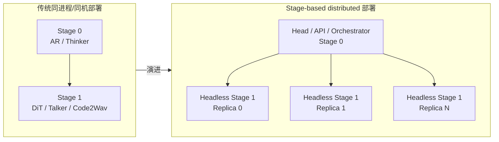
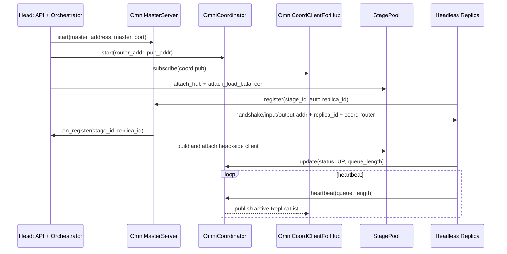
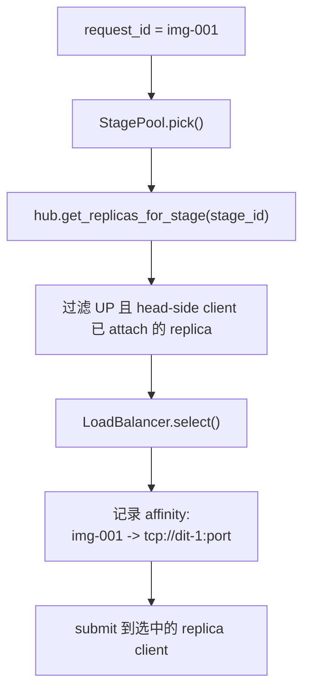
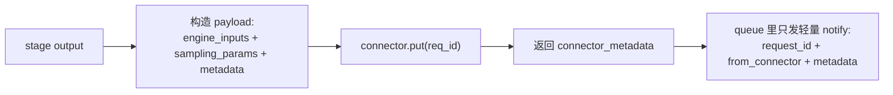
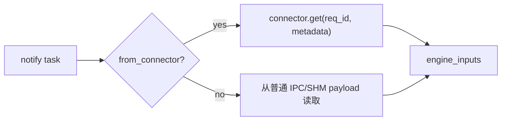
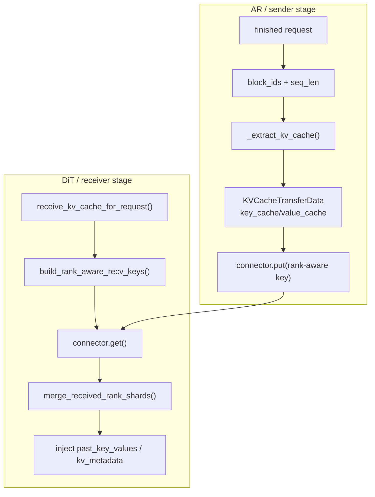
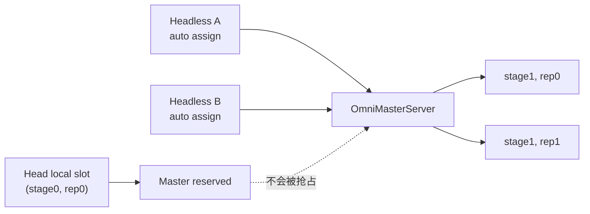
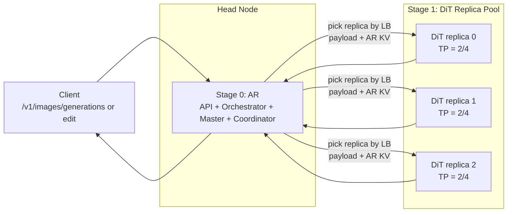
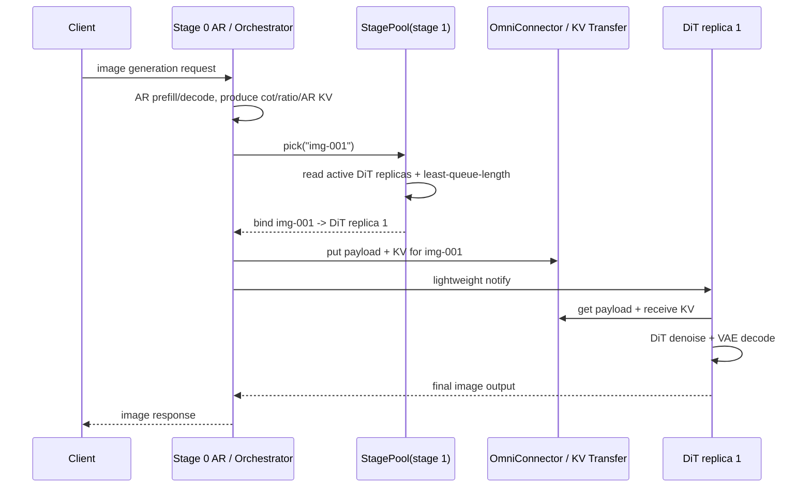

# vLLM-Omni 分布式部署特性介绍

> **文档版本**: 1.0
> **分析代码版本**: 当前 workspace 本地 `vllm-omni` 源码
> **最后更新**: 2026-06-01

---

## 文档概述

本文档介绍 vLLM-Omni 的 **distributed / stage-based deployment** 能力。这里的 distributed 主要不是 DiT 内部的 TP、SP、CFG parallel 或 HSDP，而是把一个 Omni pipeline 的不同 stage 拆成独立进程、独立 GPU 组、甚至独立机器，并允许某个 stage 横向扩成多个 replica。

**目标读者**: 已经理解 vLLM-Omni stage pipeline，希望进一步理解多机多副本部署、stage 路由、负载均衡、跨 stage 数据传输和 Hunyuan Image 类 AR+DiT 部署方式的工程师。

**阅读指南**:

| 部分 | 内容 | 重点 |
|------|------|------|
| 第一部分 | 分布式部署要解决什么问题 | stage 解耦、独立扩缩、异构资源 |
| 第二部分 | 核心控制面 | `OmniMasterServer`、`OmniCoordinator`、headless stage |
| 第三部分 | 路由与负载均衡 | `StagePool`、request affinity、replica 上下线 |
| 第四部分 | 跨 stage 数据面 | OmniConnector、KV transfer、payload 通知 |
| 第五部分 | 开发过程中的调优与设计取舍 | 为什么这些机制要这样写 |
| 第六部分 | Hunyuan Image 1AR + 多 DiT 示例 | 一个具体拓扑如何跑起来 |
| 第七部分 | QA | 常见问题和边界 |

---

# 第一部分: 为什么需要分布式 stage 部署

## 1.1 vLLM-Omni 的“分布式”分两层

vLLM-Omni 中容易混淆的 distributed 有两类：

| 层次 | 解决的问题 | 典型代码/配置 |
|------|------------|---------------|
| **stage 级分布式部署** | 不同 pipeline stage 独立进程、独立机器、独立副本 | `--stage-id`、`--headless`、`OmniMasterServer`、`StagePool` |
| **stage 内并行** | 单个 AR/DiT stage 内部模型并行 | LLM TP/DP、DiT TP/SP/CFG parallel/VAE patch parallel/HSDP |

本文重点是第一类：**让 stage 成为可独立部署和扩缩的服务单元**。



## 1.2 它解决的核心问题

多模态和生成式模型 pipeline 的 stage 计算形态差异很大：

| 场景 | Stage 0 | Stage 1 / 后续 stage | 分布式收益 |
|------|---------|----------------------|------------|
| Hunyuan Image | AR 生成 recaption/ratio/KV | DiT 反复 denoise 生成图片 | DiT 更耗时，可多副本扩展 |
| BAGEL | Thinker 构造上下文/KV | DiT-like generation loop | Thinker 与 DiT 资源配比解耦 |
| Qwen3-Omni TTS | Thinker/Talker | Code2Wav | Code2Wav 可并发多副本 |
| 视频/长 diffusion | 条件编码较短 | DiT/VAE 时间长 | 慢 stage 独立横向扩容 |

传统 colocated 部署把所有 stage 绑在同一组 GPU 上，会带来三个限制：

1. **资源配比固定**：AR 可能只需要 2/4 张卡，DiT 可能需要更多 replica 才能吃住吞吐。
2. **慢 stage 拖累全链路**：一个 DiT denoise 请求占用很久时，AR 资源也被绑定住。
3. **故障和升级粒度粗**：某个后处理或 diffusion stage 出问题，会影响整套服务。

stage-based distributed 部署把这些问题拆开：**head 负责 API、编排、路由；headless replica 负责具体 stage 计算；中间结果通过 connector 或 KV transfer 传递**。

---

# 第二部分: 控制面架构

## 2.1 总览

vLLM-Omni 分布式部署的控制面可以理解成三条线：

1. **注册线**：headless stage 启动后向 head 的 `OmniMasterServer` 注册，拿到自己的 ZMQ 地址和 replica id。
2. **健康线**：stage replica 内部的 `OmniCoordClientForStage` 定期向 `OmniCoordinator` 发送 heartbeat 和 queue length。
3. **路由线**：head 侧 `Orchestrator` 通过 `OmniCoordClientForHub` 订阅 active replica 列表，并把它注入到每个 `StagePool`。



## 2.2 OmniMasterServer: 地址分配和 headless 注册

源码入口：

```text
vllm_omni/engine/stage_engine_startup.py
```

`OmniMasterServer` 是 head runtime 中的注册服务器。它负责：

| 职责 | 说明 |
|------|------|
| 分配地址 | 为每个 `(stage_id, replica_id)` 分配 handshake/input/output ZMQ 地址 |
| replica id 管理 | headless 使用 auto-assign，master 是 replica id 的唯一权威 |
| 跨主机地址处理 | diffusion 远端可由 replica 绑定 socket；LLM 远端通常由 head 绑定 socket |
| 通知 orchestrator | 新的 remote replica 注册后触发 `on_register`，由 head 构建客户端并接入 `StagePool` |

关键点不是 stage config 本身，而是 **headless stage 不需要预先知道自己是第几个副本**。它启动时只带 `--stage-id` 和 master 地址，master 会给它分配可用 replica id。

## 2.3 OmniCoordinator: 活跃副本注册表

源码入口：

```text
vllm_omni/distributed/omni_coordinator/omni_coordinator.py
vllm_omni/distributed/omni_coordinator/messages.py
```

`OmniCoordinator` 维护一个内存中的 replica registry：

```python
ReplicaInfo(
    input_addr=...,
    output_addr=...,
    stage_id=...,
    status=ReplicaStatus.UP,
    queue_length=...,
    last_heartbeat=...,
    registered_at=...,
)
```

它的两个 ZMQ 端口职责不同：

| 端口 | 模式 | 数据方向 | 用途 |
|------|------|----------|------|
| ROUTER | stage -> coordinator | `ReplicaEvent` | 接收 update/heartbeat |
| PUB | coordinator -> hub | `ReplicaList` | 发布当前 active replica 列表 |

`OmniCoordinator` 会根据 heartbeat timeout 把长时间没有上报的 replica 标记为 `ERROR`，并从 active list 中排除。head 侧 watcher 看到 replica 消失后，会把相关 request affinity 清理掉，并对受影响请求返回错误。

## 2.4 Stage replica 如何上报 queue length

LLM stage 和 diffusion stage 都会在子进程 READY 后创建 `OmniCoordClientForStage`：

| Stage 类型 | 源码入口 | queue length 来源 |
|------------|----------|-------------------|
| LLM / AR | `vllm_omni/engine/stage_engine_core_proc.py` | `scheduler.get_num_unfinished_requests()` |
| Diffusion | `vllm_omni/diffusion/stage_diffusion_proc.py` | `proc.queue_length` |

heartbeat 线程每次发送前会刷新 queue length，这使 `least-queue-length` 策略可以基于近实时负载做选择。

---

# 第三部分: StagePool 路由与负载均衡

## 3.1 StagePool 是每个 logical stage 的副本池

源码入口：

```text
vllm_omni/engine/stage_pool.py
vllm_omni/distributed/omni_coordinator/load_balancer.py
```

`StagePool` 管理一个 logical stage 的所有 head-side client。分布式模式下它额外持有：

| 字段 | 作用 |
|------|------|
| `_hub` | 从 `OmniCoordClientForHub` 读取 active replica 快照 |
| `_lb` | 具体负载均衡策略 |
| `_addr_to_replica_id` | ZMQ input address 到本地 replica slot 的映射 |
| `_affinity` | `request_id -> input_addr` 的请求亲和性 |



## 3.2 支持的负载均衡策略

`--omni-lb-policy` 当前支持三种：

| 策略 | 行为 | 适合场景 |
|------|------|----------|
| `random` | 在可用 replica 中随机选 | 默认策略，简单稳定 |
| `round-robin` | 按顺序轮询 | 请求耗时接近时更均匀 |
| `least-queue-length` | 选择 queue length 最小的 replica | DiT/Code2Wav 这类耗时差异明显的 stage |

负载均衡只选择 **第一次进入某个 stage 的 replica**。之后同一个 request 的后续控制操作、abort、poll output、CFG companion 等都会走 affinity 绑定的 replica。

## 3.3 为什么必须有 request affinity

request affinity 是分布式 stage 的关键不变量：

| 没有 affinity 会怎样 | affinity 解决什么 |
|----------------------|------------------|
| 初始请求发到 replica A，后续 poll/abort 跑到 replica B | 控制面和输出面稳定落到同一 replica |
| 多模态 processor cache 在不同 replica 间 key 冲突或找不到 | 预处理阶段可提前按目标 replica 做 cache key scope |
| CFG companion request 被调到不同 DiT replica | 正负分支共享的上下文和 KV 无法对应 |
| replica 下线后旧绑定继续使用 | watcher 失效绑定并清理受影响请求 |

相关修复可以从 PR 记录看到：`#3605` 和 `#3740` 都集中在 distributed AR / stage0 多模态 cache routing 的正确性。

## 3.4 动态上下线

headless replica 注册后，`OmniMasterServer` 的 `on_register` 会投递 `RegisterRemoteReplicaMessage`。`Orchestrator` 收到后：

1. 根据 stage 类型构造 head-side client。
2. 从 client 中取出 input address。
3. 调用 `pool.add_client(input_addr, client)`。

replica 心跳超时或下线后：

1. `OmniCoordinator` 不再把它放入 active list。
2. `Orchestrator._watch_replica_list()` 发现 active set 减少。
3. 投递 `UnregisterRemoteReplicaMessage`。
4. `StagePool.invalidate_addr()` 删除指向该地址的 affinity。
5. 受影响请求被 abort 并返回错误。

这个机制使 stage replica 可以独立重启；但它不是透明重试机制，已经落到故障 replica 的进行中请求仍需要失败或由上层重试。

---

# 第四部分: 跨 stage 数据面

## 4.1 数据面分两类

stage 之间传的东西大致分为两类：

| 类型 | 例子 | 传输路径 |
|------|------|----------|
| **stage payload** | 下游 stage 的 `engine_inputs`、`sampling_params`、metadata | `OmniConnector.put/get` + 轻量 queue 通知 |
| **KV cache / past_key_values** | AR 侧 KV、CFG 分支 KV、rank-aware KV shard | `OmniKVTransferManager` + connector |

控制面只负责“选哪个 replica”和“通知下游有活干”。真正的大对象不应该塞进控制消息里，而是通过 connector 或共享内存/RDMA 通道传递。

## 4.2 OmniConnector 抽象

源码入口：

```text
vllm_omni/distributed/omni_connectors/connectors/base.py
vllm_omni/distributed/omni_connectors/adapter.py
```

核心接口非常小：

```python
put(from_stage, to_stage, put_key, data) -> (success, serialized_size, metadata)
get(from_stage, to_stage, get_key, metadata=None) -> (object, size) | None
cleanup(request_id)
health()
close()
```

发送侧流程：



接收侧流程：



## 4.3 SharedMemoryConnector 与 MooncakeTransferEngineConnector

| Connector | 适用范围 | 特点 |
|-----------|----------|------|
| `SharedMemoryConnector` | 同机多进程 | 通过 POSIX shared memory 存 payload，queue 只传 metadata |
| `MooncakeTransferEngineConnector` | 跨机/RDMA/TCP | 支持 raw bytes/tensor fast path，维护内存池，receiver 可按 sender endpoint 拉取 |
| `YuanrongTransferEngineConnector` | Ascend/NPU 场景 | 面向 NPU/Ascend transfer engine |

Mooncake connector 当前的一个重要边界是：**同一个 key 默认是 1 sender -> 1 receiver**。这对 request-level routing 是合理的，因为一个请求只会被路由到一个下游 DiT replica；但如果要做同一份 AR KV 广播到多个 DiT 同时计算，就需要额外的 retain/release 或广播语义。

## 4.4 KV transfer: AR KV 复用和 TP-aware shard

源码入口：

```text
vllm_omni/distributed/omni_connectors/kv_transfer_manager.py
vllm_omni/worker/omni_connector_model_runner_mixin.py
```

`OmniKVTransferManager` 做三件关键事：

1. 从上游 stage 的 GPU KV block 中抽取当前 request 的 KV。
2. 序列化为 bytes 或 packed GPU `uint8` tensor，优先走 connector raw-data fast path。
3. 下游按 request id 和 rank-aware key 拉取 KV，再恢复成 `key_cache/value_cache`。



KV transfer 特别关注 TP 拓扑：

| 情况 | 处理方式 |
|------|----------|
| 上下游 TP 一样 | 每个 rank 传/收自己的 shard |
| sender TP < receiver TP | sender 侧可按 target rank 预切分 head slice |
| sender TP > receiver TP | receiver 可从多个 sender rank 拉取后 merge |
| CFG 多分支 | 支持 role-based KV payload，如 `cfg_text` / `cfg_img` |

这也是 Hunyuan Image AR + DiT 能复用 AR KV 的基础：AR stage 只做一次上下文构造，DiT stage 在 denoise loop 中复用它，而不是把上下文重新算一遍。

---

# 第五部分: 开发过程中的调优与设计取舍

这一节记录一些从 PR、测试和源码注释中能看到的实际 debug 过程。它们解释了为什么当前实现看起来有些“绕”：很多设计不是抽象洁癖，而是被多机、多副本、ZMQ、KV cache 和多模态缓存的组合问题逼出来的。

## 5.1 Coordinator 为什么要做 PUB coalescing 和 keepalive broadcast

相关提交：

```text
#2442 / 678af192  Coordinator PUB mechanism optimization
#3569 / e277feac  Integrate OmniCoordinator into stage engine pipeline
```

实际问题：

1. `least-queue-length` 需要 stage replica 高频上报 queue length。
2. 如果每次 queue length 更新都立即 PUB 广播，head 侧 SUB 会收到大量 replica list 更新。
3. ZMQ PUB/SUB 有 slow-joiner 问题：SUB 刚连上时可能错过之前的 PUB 消息，导致 hub 长时间拿不到当前 replica list。

因此 `OmniCoordinator` 做了两个设计：

| 设计 | 作用 |
|------|------|
| `_pending_broadcast` + `_publish_min_interval` | 把短时间内大量 update 合并，避免 queue length 风暴 |
| heartbeat tick 上 schedule keepalive broadcast | 让晚加入的 hub 最多等一个 heartbeat tick 就能看到当前 active list |

测试里有一个很直接的场景：`test_omni_coordinator_pub_coalescing_on_rapid_queue_updates()` 连续发 80 次 queue update，断言收到的 PUB 消息数远小于 update 数。这说明这里的目标不是“每个 queue length 都精确实时广播”，而是 **提供足够新的负载视图，同时限制控制面噪声**。

调优启发：

| 参数/现象 | 调优方向 |
|-----------|----------|
| replica list 更新太频繁 | 增大 publish min interval，或避免过度依赖瞬时 queue length |
| head 启动后短时间没有 replica | 注意 PUB/SUB slow-joiner，观察 keepalive broadcast 是否正常 |
| `least-queue-length` 看起来不够灵敏 | queue length 是 heartbeat 刷新的近实时值，不是每个 request 的强一致调度锁 |

## 5.2 为什么 headless replica id 必须由 Master auto-assign

相关提交：

```text
#3569 / e277feac  Integrate OmniCoordinator into stage engine pipeline
```

实际问题：

早期如果让 headless 进程自己带 `--replica-id`，会出现两个麻烦：

1. 多个 headless 同时启动时，replica id 命名空间容易冲突。
2. head 侧会预分配部分 slot；同主机 headless 如果抢在 head 自己注册前拿走 slot 0，会导致 head 的 `connect_remote_engine_cores()` 等待错误 slot，最后卡住。

所以现在 headless 路径里 `--replica-id` 被废弃并忽略，注册时传 `replica_id=None`，由 `OmniMasterServer` 统一分配。master 还维护 `head_local_slots`，避免把 head 自己要用的 slot 分给 headless。



设计取舍：

| 方案 | 问题 |
|------|------|
| 用户手动指定 replica id | 简单但容易冲突，跨机器脚本很脆 |
| headless 自己探测空闲 id | 需要分布式锁，本质还是重做 master |
| master auto-assign | head 是单一事实源，注册语义清楚 |

这就是为什么 CLI 里会看到 “`--replica-id` deprecated and ignored”。

## 5.3 为什么跨主机时 LLM 和 Diffusion 的 socket ownership 不一样

相关代码：

```text
vllm_omni/engine/stage_engine_startup.py
vllm_omni/entrypoints/cli/serve.py
```

这是一个非常典型的多机 debug 点。注册时 headless 可以带 `--omni-replica-address`，master 根据 `replica_binds_sockets` 决定是否把分配的地址改成 replica 主机地址。

| stage 类型 | 谁 bind handshake/input/output socket | 为什么 |
|------------|----------------------------------------|--------|
| Diffusion remote replica | replica 侧 bind | `StageDiffusionProc` 自己跑请求循环，head 作为 client 连接它 |
| LLM remote replica | head 侧 bind | head 的 CoreClient/handshake ROUTER/PULL socket 负责绑定，remote worker 发起 outbound connect |

如果把 LLM remote 的地址错误改成 replica IP，head 会尝试在自己的机器上 bind 一个不属于自己的 IP，直接 `EADDRNOTAVAIL`。如果 diffusion remote 不改成 replica IP，则 head 会连接不到真正绑定 socket 的机器。

这解释了两个看起来反直觉的点：

1. `--omni-replica-address` 不是所有 socket 都一律改到 replica IP。
2. LLM headless 注册时显式传 `replica_binds_sockets=False`。

排障建议：

| 错误现象 | 优先检查 |
|----------|----------|
| `EADDRNOTAVAIL` | LLM remote 是否错误把 socket 改到了 replica IP |
| diffusion headless 连接不上 | `--omni-replica-address` 是否是 head 可达 IP |
| 多网卡环境偶现连接失败 | 不要依赖 auto-detect，显式指定可达网卡 IP |

## 5.4 为什么 remote LLM attach 时还要补一次 startup handshake

相关代码：

```text
vllm_omni/engine/async_omni_engine.py::_build_remote_replica()
```

remote LLM replica 注册成功不代表 engine core 已经和 head 完成 vLLM 的 startup handshake。`StageEngineCoreProc` 启动时会阻塞等待 head 侧 handshake ROUTER 响应；如果 orchestrator 只把 replica 加入池而不执行 `connect_remote_engine_cores()`，worker 会等到内置超时后退出。

所以动态 attach remote LLM 时会：

1. 从 master 拿到该 `(stage_id, replica_id)` 的地址分配。
2. 在后台线程里跑 `connect_remote_engine_cores()` 完成阻塞 handshake。
3. 回到 orchestrator event loop 创建 async mp client。

这里用 `asyncio.to_thread()` 是为了避免阻塞 orchestrator 主循环。设计目标是 **动态挂载 remote replica 时，控制面仍能处理输出、下线和新请求**。

## 5.5 为什么 stage0 多模态 cache key 要带 replica scope

相关提交：

```text
#3605 / 440c718d  Fix multimodal cache routing for AR replicas
#3740 / 5cf4605b  Fix distributed stage0 multimodal cache routing
```

实际问题：

stage0 的输入预处理在 async submit 前发生，但多模态 processor cache 是 engine/replica 本地的。如果两个 AR replica 处理同一张图片，原始 `mm_uuid` 一样，cache key 不带 replica scope，就可能出现：

1. request A 的图片 cache 被写到 replica 0。
2. request B 用同一个图片 hash 但被路由到 replica 1。
3. replica 1 按相同 uuid 查本地 cache，结果查不到或撞到错误状态。

修复后的逻辑是：在构造 add request message 时先通过 `StagePool.preselect_replica_id()` 预选 stage0 replica，然后把多模态 uuid 改成类似：

```text
stage0:rep0:<original-mm-uuid>
stage0:rep1:<original-mm-uuid>
```

测试里覆盖了两个场景：

| 测试 | 证明的行为 |
|------|------------|
| `test_build_add_request_message_scopes_mm_uuids_to_selected_stage0_replica` | 本地多 replica 下，两个请求会带不同 `stage0:repX:` 前缀 |
| `test_build_add_request_message_scopes_mm_uuids_to_distributed_stage0_replica` | distributed hub/LB 下，预选结果和后续 `pick()` 结果一致 |

设计取舍：

| 方案 | 问题 |
|------|------|
| 预处理后再路由 | cache key 已经生成，来不及按 replica scope |
| 路由时再修 cache | 需要修改已经构造好的 processor 输出，风险更大 |
| submit 前预选 replica | 让预处理和真实路由共享同一 affinity，是当前最小闭环 |

## 5.6 为什么多副本 headless 要特别处理设备和端口

相关提交：

```text
#3333 / 33586d84  Use get_open_ports_list for stage ports in OmniMasterServer
#3741 / 3c58868c  fix mult cli timeout with get kv
```

实际问题一：多副本堆到同一张 GPU。

headless launcher 可能设置了 `CUDA_VISIBLE_DEVICES=0,1,2,3` 和 `--omni-dp-size-local 2`。如果不把 YAML 的 `devices` 切成每个 replica 的子集，两个子进程可能都默认跑到 `cuda:0`，出现 OOM 或资源冲突。因此现在会通过 `split_devices_for_replicas()` 和 `setup_stage_devices()` 在 spawn 每个 replica 前临时设置设备可见性。

实际问题二：diffusion 多副本 torch distributed port 冲突。

每个 `StageDiffusionProc` 都会 init 自己的 torch distributed group。如果多个本地 replica 复用同一个 `master_port`，第二个进程会遇到端口占用。代码没有直接用内核 ephemeral port，因为 master 预分配的 ZMQ 端口也可能落在 ephemeral 范围且尚未 bind，存在互相“偷端口”的风险。因此 diffusion 多副本会从 61000 以上的 base port 做 settle。

实际问题三：KV get timeout。

`#3741` 的修复点是 headless diffusion 单 stage 启动时也必须从完整 deploy config 推断跨 stage TP topology，否则 head 和 headless 对 rank-aware KV key 的理解不一致。例如 head 认为 `from_tp=2,to_tp=1`，receiver 却按默认 topology 去 get，最后表现为等 KV 超时。

排障建议：

| 现象 | 可能原因 |
|------|----------|
| 多个 replica 都占 cuda:0 | per-replica devices 没有正确切分或 env 没传入子进程 |
| 第二个 diffusion replica 启动失败 | torch distributed `master_port` 冲突 |
| DiT 等 AR KV 超时 | 上下游 TP topology / rank-aware key 不一致 |

## 5.7 为什么进程退出要做 parent-death cleanup

相关提交：

```text
#3751 / 5c3c8192  Ensure stage and diffusion subprocesses exit when parent dies unexpectedly
```

distributed stage 的常见故障不是“函数抛异常”这么简单，而是某个父进程、API server 或 launcher 被 kill。子进程如果继续活着，会留下：

1. 仍在占用 GPU 的 engine core。
2. 仍在 heartbeat 的假 UP replica。
3. 未清理的 connector buffer 或 chunk transfer 状态。

因此 stage engine core、diffusion proc 和相关 worker 增加了 parent death signal / shutdown cleanup。这个设计的目标是：**一旦拥有它的 runtime 死亡，stage replica 不应该以孤儿进程形式继续对外表现为可服务**。

---

# 第六部分: Hunyuan Image 1AR + 多 DiT 示例

## 6.1 拓扑

Hunyuan Image 的模型内部架构可以参考同目录的 `vllm_omni_hunyuan_bagel_arch.md`。这里仅关注部署拓扑：



为什么 Hunyuan Image 适合 1AR + 多 DiT：

| 部分 | 特征 | 扩缩倾向 |
|------|------|----------|
| AR stage | 生成 recaption/CoT、ratio token、AR KV | 相对短，可少量副本 |
| DiT stage | 多步 denoise，单请求占用时间长 | 常是吞吐瓶颈，适合多副本 |
| AR -> DiT 交接 | 文本/ratio/条件图/AR KV | 通过 connector/KV transfer 发给一个 DiT replica |

## 6.2 启动方式示意

下面只展示 distributed 相关参数，不展开 stage config 字段。

**Head / AR 节点**：

```bash
CUDA_VISIBLE_DEVICES=0,1 \
vllm serve tencent/HunyuanImage-3.0-Instruct --omni \
  --deploy-config vllm_omni/deploy/hunyuan_image_3_moe.yaml \
  --stage-id 0 \
  --port 8091 \
  --omni-master-address 10.0.0.10 \
  --omni-master-port 26000 \
  --omni-lb-policy least-queue-length
```

**DiT 节点 A**：

```bash
CUDA_VISIBLE_DEVICES=0,1 \
vllm serve tencent/HunyuanImage-3.0-Instruct --omni \
  --deploy-config vllm_omni/deploy/hunyuan_image_3_moe.yaml \
  --stage-id 1 \
  --headless \
  --omni-master-address 10.0.0.10 \
  --omni-master-port 26000 \
  --omni-replica-address 10.0.0.21
```

**DiT 节点 B / C** 用同样命令启动，只需要换 `CUDA_VISIBLE_DEVICES` 和 `--omni-replica-address`。如果一台机器上要起多个 DiT replica，可以使用：

```bash
--omni-dp-size-local 2
```

headless launcher 会循环注册多个 replica，master 为每个 replica auto-assign id，并为 diffusion 子进程设置独立的通信端口。

## 6.3 一个请求怎么流动

以 request id `img-001` 为例：



这个流程里有几个重要边界：

1. `img-001` 只会被绑定到一个 DiT replica，不是广播。
2. `least-queue-length` 依赖 DiT replica heartbeat 上报的 `queue_length`。
3. AR KV 的 request id 和 rank-aware key 必须和 DiT replica 对齐。
4. 如果 DiT replica 在执行中消失，head 会清理 affinity，并让该请求失败；上层可以重试。

## 6.4 与 PR/测试覆盖对应的验证点

从本地 git 记录看，distributed 相关能力主要由这些 PR/提交覆盖：

| PR/提交 | 内容 | 相关测试/文件 |
|---------|------|---------------|
| `#939` / `36b8f802` | Stage Based Deployment CLI | stage CLI 启动入口 |
| `#1465` / `617b1d60` | 初始 coordinator module | coordinator 单测 |
| `#2448` / `b60a661b` | `round-robin` / `least-queue-length` LB | `tests/distributed/omni_coordinator/test_load_balancer.py` |
| `#3346` / `5b61e7f1` | Hunyuan Image AR + DiT KV reuse | `test_image_kv_cache_manager.py`、Hunyuan e2e accuracy |
| `#3569` / `e277feac` | OmniCoordinator 集成到 stage engine pipeline | coordinator/client/stage init/serve/orchestrator 测试 |
| `#3605` / `440c718d` | AR replica 多模态 cache routing 修复 | `test_async_omni_engine_input.py` |
| `#3740` / `5cf4605b` | distributed stage0 multimodal cache routing 修复 | `test_async_omni_engine_input.py` |
| `#3741` / `3c58868c` | 多 CLI/headless KV timeout 修复 | headless diffusion 注入完整 stage topology |
| `#3751` / `5c3c8192` | 父进程异常退出时清理 stage/diffusion 子进程 | stage init / chunk transfer 相关测试 |

这些测试说明当前实现不只是“能起多进程”，还覆盖了注册、心跳、LB、headless 启动、多模态 cache scope、Hunyuan KV reuse 等关键路径。

---

# 第七部分: QA

## Q1: 这个特性的最大优势是什么？

最大优势是 **按 stage 独立扩缩**。例如 Hunyuan Image 中 DiT 比 AR 慢得多时，可以保留 1 个 AR/head 节点，只增加 DiT replica。这样不会为了扩 DiT 而复制整套 AR，也不会让 AR GPU 跟着 DiT 一起空等。

## Q2: 它和普通 data parallel 有什么区别？

普通 DP 通常复制完整模型或完整服务实例；vLLM-Omni 的 distributed stage 部署复制的是 **某个 stage**。1AR + 4DiT 不是 5 份完整 pipeline，而是 1 个 AR stage 加 4 个 DiT stage replica。

## Q3: `num_replicas` 和 `--omni-dp-size-local` 怎么理解？

`num_replicas` 是部署配置里的 stage 副本数；`--omni-dp-size-local` 是当前这次 launcher 在本机为自己的 `--stage-id` 启动几个 replica。headless 多机部署时，常见做法是每台 DiT 机器用 `--stage-id 1 --headless` 注册自己；同一台机器要起多个本地副本时再加 `--omni-dp-size-local N`。

## Q4: 为什么需要 `--omni-replica-address`？

跨机器时，headless replica 需要告诉 master 自己应该对外暴露哪个本机 IP。默认会用 UDP routing probe 自动探测；多网卡、容器网络或 RDMA 网卡环境里，自动探测可能选错，此时用 `--omni-replica-address` 显式指定。

## Q5: 负载均衡是否会把同一个请求的后续步骤发到不同 replica？

不会。`StagePool.pick()` 首次选择后会记录 `request_id -> input_addr` affinity。后续 poll、abort、CFG companion 或同 request 的 stage 操作会复用这个绑定。

## Q6: 1 个 AR 可以把同一份 KV 广播给多个 DiT 同时生成吗？

当前常规路径不是广播，而是 **一个请求选择一个下游 replica**。Mooncake connector 代码里也明确当前 key 语义偏 1 sender -> 1 receiver。要做同一请求多 DiT 并行生成多个候选图，需要额外设计 key、buffer 生命周期和结果聚合策略。

## Q7: DiT replica 挂了会自动把请求迁移到别的 DiT 吗？

不会透明迁移进行中的请求。replica heartbeat 超时后会从 active list 中消失，head 会清理对应 affinity，并让受影响请求失败。新的请求会避开这个 replica；旧请求是否重试由上层策略决定。

## Q8: connector 和 queue 是什么关系？

queue 负责轻量通知，connector 负责大对象传输。发送方先 `connector.put()` 存 payload/KV，再在 queue 里放一个包含 `request_id` 和 metadata 的 notify。接收方看到 notify 后再 `connector.get()` 取实际数据。

## Q9: Hunyuan Image 中 stage0 为什么还可以 `final_output: text`？

这是模型语义上的特殊性：Hunyuan AR stage 会生成 recaption/CoT/ratio token 等结构化文本；在 AR-only 或调试场景下这些文本也可以作为输出。但在 AR+DiT pipeline 中，这些输出会被 bridge 和 connector 继续喂给 DiT stage，最终输出图片。

## Q10: 什么时候用 `random`，什么时候用 `least-queue-length`？

如果下游 stage 请求耗时接近，`random` 或 `round-robin` 足够。如果是 DiT、Code2Wav 这类请求耗时差异大、排队时间显著的 stage，`least-queue-length` 更符合直觉，因为它会避开当前 in-flight 更多的 replica。

---

# 总结

vLLM-Omni 的 distributed stage 部署把多模态 pipeline 拆成可独立运行的服务单元。`OmniMasterServer` 管注册和地址，`OmniCoordinator` 管健康与负载视图，`StagePool` 管路由和 affinity，OmniConnector/KV transfer 管跨 stage 大对象和 KV 传递。

对 Hunyuan Image 这类 AR + DiT 模型，最自然的部署方式就是 **少量 AR + 多个 DiT replica**：AR 负责生成语义上下文和 KV，DiT 池负责吞吐瓶颈的 denoise 工作。这也是该特性最核心的价值：不是把整条 pipeline 复制 N 份，而是把真正慢、真正贵的 stage 单独扩出去。
