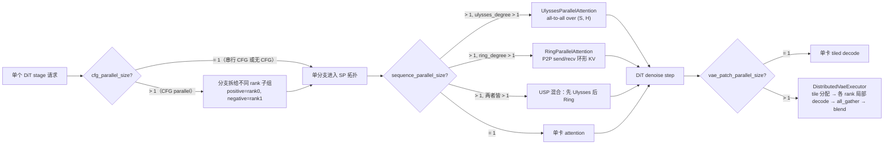
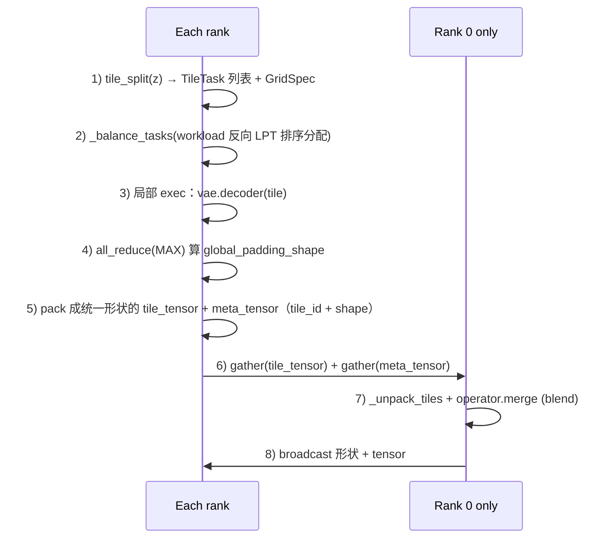
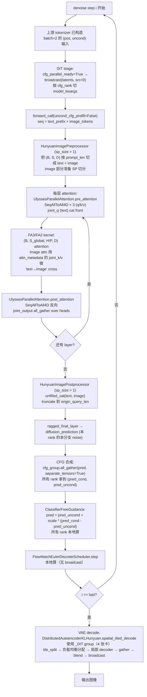

# vLLM-Omni DiT 并行能力代码走读：USP、CFG Parallel、VAE Patch Parallel、Ring

> **文档版本**: 1.0
> **分析代码版本**: 当前 workspace 本地 `vllm-omni` 源码
> **最后更新**: 2026-06-04

---

## 文档概述

本文档解析 vLLM-Omni 中 DiT stage **内部并行（stage-internal parallelism）** 的四个核心维度：

1. **USP（Unified Sequence Parallelism）**：Ulysses + Ring 两种 SP 的统一抽象与组合。
2. **CFG Parallel**：把 positive / negative 分支拆到不同 rank 上同时跑。
3. **VAE encode / decode 并行**：以 tile（patch）为粒度切分给多卡。
4. **Ring Attention**：在 SP 子拓扑里支持长序列分块 KV 环形交换。

与 [vllm-omni 分布式部署](vllm_omni_distributed_deployment.md) 文档不同，本文 **不讨论 stage 之间** 如何拆机器拆进程，而是聚焦 **单个 DiT stage 内部** 怎么把一张图的 latent 序列、CFG 两条分支、VAE 解码 tile 切到多张 GPU 上。

**目标读者**：理解 vLLM-Omni stage pipeline，希望进一步弄清楚 DiT stage 内部 `ulysses_degree` / `ring_degree` / `cfg_parallel_size` / `vae_patch_parallel_size` 这些 knob 在源码中是怎么生效的工程师。

**阅读指南**：

| 部分 | 内容 | 重点 |
|------|------|------|
| 第一部分 | 并行维度概览 | 这四个维度在 `parallel_config` 中的位置、相互正交关系 |
| 第二部分 | parallel_state 与 rank 组装 | `RankGenerator`、SP 子组（Ulysses / Ring）如何切分 |
| 第三部分 | USP：Ulysses + Ring 的统一调度 | `ParallelAttentionStrategy` 抽象、Ulysses all-to-all、UAA、joint q/k/v |
| 第四部分 | Ring Attention | `RingParallelAttention`、与 Ulysses 混合时的注意事项 |
| 第五部分 | CFG Parallel | `CFGParallelMixin`、2 分支与 N 分支调度、scheduler step 的"局部计算"原则 |
| 第六部分 | VAE encode / decode 并行 | `DistributedVaeMixin`、tile 切分 / 负载均衡 / pad-gather / broadcast |
| 第七部分 | Hunyuan-Image3.0 串通示例 | 一个 DiT stage 内同时打开 USP + CFG parallel 时各模块怎么"接力" |
| 第八部分 | 工程总结 | 选型建议、踩坑速查 |

---

# 第一部分: 并行维度概览

## 1.1 DiT stage 内部的并行维度

vLLM-Omni 在 [`vllm_omni/diffusion/data.py`](../../vllm-omni/vllm_omni/diffusion/data.py#L99-L137) 的 `ParallelConfig` 集中声明 stage 内部并行：

```python
class ParallelConfig(...):
    pipeline_parallel_size: int = 1
    data_parallel_size: int = 1
    tensor_parallel_size: int = 1

    # ---- 本文重点 ----
    sequence_parallel_size: int | None = None   # = ulysses_degree * ring_degree
    ulysses_degree: int = 1
    ring_degree: int = 1
    ulysses_mode: str = "strict"                # 或 "advanced_uaa"
    cfg_parallel_size: int = 1                  # 1 / 2 / 3
    vae_patch_parallel_size: int = 1

    # ---- HSDP（本文不展开，参见专门文档）----
    use_hsdp: bool = False
    hsdp_shard_size: int = -1
    hsdp_replicate_size: int = 1
```

`_validate_parallel_config` 强制 `sequence_parallel_size == ulysses_degree * ring_degree`，并把 `cfg_parallel_size` 限制在 `{1, 2, 3}` —— 这是因为 vLLM-Omni 目前 CFG 最多支持 3 分支（multi-branch，例如 OmniGen2 / BAGEL 的三分支 CFG）。

## 1.2 各维度的"正交关系"



四个维度在 [`vllm_omni/diffusion/distributed/parallel_state.py:172-272`](../../vllm-omni/vllm_omni/diffusion/distributed/parallel_state.py#L172-L272) 的 `RankGenerator` 中构成一组 orthogonal parallel groups，order 默认 `"tp-sp-pp-cfg-dp"`：

```text
dit_parallel_size
= data_parallel_size       # 跨样本
× cfg_parallel_size        # CFG 分支
× sequence_parallel_size   # SP（= ulysses × ring）
× pipeline_parallel_size   # PP
× tensor_parallel_size     # 权重 TP
```

VAE patch parallel **不** 走这一套 rank 组装：它复用 `_DIT` 这个 process group（覆盖整个 DiT 的所有 rank），按需"占用其中前 N 张卡"做 tile 调度。

## 1.3 一个统一的设计观点

| 维度 | 切分对象 | 切分粒度 | 通信原语 |
|------|----------|----------|----------|
| TP | 权重列 / 行 | 矩阵列块 | all-reduce |
| SP-Ulysses | 序列 / 头 | seq 平均切 + head all-to-all | all-to-all |
| SP-Ring | 序列 | seq 平均切 | P2P send/recv |
| CFG parallel | batch / 分支 | 1 个 rank 1 个分支 | all-gather |
| VAE patch parallel | 空间 tile | tile_latent_min_size × tile | gather + broadcast |

> SP 切的是 **同一张图内部 token 序列**，CFG 切的是 **同一张图的两/三种条件版本**，VAE patch parallel 切的是 **解码空间 tile**。三者在数据维度上不重叠，可叠加。

---

# 第二部分: parallel_state 与 SP 子组装配

## 2.1 dit world group 的整体布局

[`initialize_model_parallel`](../../vllm-omni/vllm_omni/diffusion/distributed/parallel_state.py#L676-L862) 拉起 `_DP / _CFG / _PP / _SP / _TP / _FS / _DIT` 7 个 group：

```python
rank_generator = RankGenerator(
    tensor_parallel_size,
    sequence_parallel_size,
    pipeline_parallel_size,
    cfg_parallel_size,
    effective_dp_size,
    fs=fully_shard_degree,
    order="tp-sp-pp-cfg-dp",
)
sp_group_ranks = rank_generator.get_ranks("sp")
...
_CFG = init_model_parallel_group(group_ranks=rank_generator.get_ranks("cfg"), ..., parallel_mode="classifier_free_guidance")
_SP  = init_model_parallel_group(group_ranks=sp_group_ranks,                ..., parallel_mode="sequence",
                                 ulysses_group=ulysses_pg, ring_group=ring_pg)
init_dit_group(dit_parallel_size, backend)
```

## 2.2 SP 内部再切：Ulysses vs Ring

SP group 自身就是 `ulysses_degree × ring_degree` 张卡。在 [`set_seq_parallel_pg`](../../vllm-omni/vllm_omni/diffusion/distributed/parallel_state.py#L529-L673) 里，每个 SP group 还会被再切成两套子组：

- **Ulysses 子组**：每组 `ulysses_degree` 张卡，做 head 维度的 all-to-all。
- **Ring 子组**：每组 `ring_degree` 张卡，做 seq 维度的 P2P 环。

切分方向由 `use_ulysses_low` 控制：

- `True`（默认）：Ulysses 子组是 **连续** 的（更友好的 NVLink 同机互联），Ring 子组是 **跨节点 strided**。
- `False`：反之。

`SequenceParallelGroupCoordinator` 同时持有 `ulysses_group` 和 `ring_group`，便于后续 attention strategy 直接拿来用：

```python
# group_coordinator.py
self.ulysses_group = ulysses_group
self.ring_group   = ring_group
self.ulysses_world_size = dist.get_world_size(self.ulysses_group)
self.ring_world_size    = dist.get_world_size(self.ring_group)
```

## 2.3 一张 8 卡的展开示例

`tp=1, sp=4 (ulysses=2, ring=2), cfg=2, dp=1, pp=1`：

| 概念 | rank 组 |
|------|---------|
| CFG groups | `[0,4], [1,5], [2,6], [3,7]` |
| SP groups | `[0,1,2,3], [4,5,6,7]` |
| 每个 SP 内的 Ulysses 子组（contiguous） | `[0,1], [2,3]` / `[4,5], [6,7]` |
| 每个 SP 内的 Ring 子组（strided） | `[0,2], [1,3]` / `[4,6], [5,7]` |

> 实际工程中，`cfg=2` 经常和 `sp_size` 一起用。Hunyuan-Image3.0 的 DiT 路径里就是这样组合 —— positive 跑在 cfg_rank=0 的 SP group，negative 跑在 cfg_rank=1 的 SP group，两者结构对称。

---

# 第三部分: USP — Ulysses + Ring 的统一抽象

## 3.1 抽象层：`ParallelAttentionStrategy`

vLLM-Omni 把"attention 内核执行"和"序列并行通信"解耦：

- **kernel backend**：`attention/selector.py` 选择 FA2 / FA3 / SDPA / AITER 等。
- **parallel strategy**：[`vllm_omni/diffusion/attention/parallel/`](../../vllm-omni/vllm_omni/diffusion/attention/parallel/) 决定 Q/K/V 如何 reshard、通信。

抽象接口在 [`base.py`](../../vllm-omni/vllm_omni/diffusion/attention/parallel/base.py)：

```python
class ParallelAttentionStrategy(Protocol):
    def pre_attention(self, q, k, v, attn_metadata):
        """运行 attention kernel 前的通信和 reshard。
        返回 (q, k, v, attn_metadata, ctx)。
        """

    def post_attention(self, attn_output, ctx):
        """运行 attention kernel 后的反向通信。"""
```

`Attention.forward` 是这层的统一调度（[`attention/layer.py:227-254`](../../vllm-omni/vllm_omni/diffusion/attention/layer.py#L227-L254)）：

```python
def forward(self, query, key, value, attn_metadata=None):
    strategy = self._get_active_parallel_strategy()

    # 1. Pre: ulysses all-to-all、ring concat joint_q
    query, key, value, attn_metadata, ctx = strategy.pre_attention(query, key, value, attn_metadata)

    # 2. Kernel
    if self.use_ring and strategy is not self._no_parallel_strategy:
        out = self._run_ring_attention(query, key, value, attn_metadata)
    else:
        out = self._run_local_attention(query, key, value, attn_metadata)

    # 3. Post: ulysses 反向 all-to-all、joint_output all-gather
    out = strategy.post_attention(out, ctx)
    return out
```

## 3.2 strategy 工厂：从 forward_context 推断

[`factory.py`](../../vllm-omni/vllm_omni/diffusion/attention/parallel/factory.py) 在每个 attention forward 入口构造一次 strategy：

```python
ulysses_degree = getattr(p, "ulysses_degree", 1)
ring_degree    = getattr(p, "ring_degree", 1)

if get_sequence_parallel_world_size() <= 1:
    return NoParallelAttention()

if ulysses_degree > 1:
    return UlyssesParallelAttention(sp_group, scatter_idx, gather_idx, use_sync)

if ring_degree > 1:
    return RingParallelAttention(sp_group)

return NoParallelAttention()
```

注意：**只要 `ulysses_degree > 1`，就走 UlyssesParallelAttention**（即使 ring_degree 也 > 1）。这是因为 Ulysses 的 `pre_attention` 内部还会读 `sp_group.ring_world_size`，如果 > 1 就保留 joint_k/v 到 metadata 里让 Ring kernel 后续处理——这就是 **USP 混合模式** 的实现方式。

## 3.3 Ulysses：两次 all-to-all 的标准结构

把 `B, S/P, H, D` 切到 `B, S, H/P, D`，attention 内核照常算，算完反向 all-to-all 回来。核心调用是 `SeqAllToAll4D.apply`：

```python
# 入口（每个 transformer block 的 attention 前）
query = SeqAllToAll4D.apply(self._ulysses_pg, query, scatter_idx=2, gather_idx=1, use_sync)
key   = SeqAllToAll4D.apply(self._ulysses_pg, key,   2, 1, use_sync)
value = SeqAllToAll4D.apply(self._ulysses_pg, value, 2, 1, use_sync)
# attention kernel 用 (B, S_global, H/P, D)
# 反向：
return SeqAllToAll4D.apply(ctx.ulysses_pg, attn_output, gather_idx=1, scatter_idx=2, use_sync)
```

`all_to_all_4D`（[`distributed/comm.py:16-100`](../../vllm-omni/vllm_omni/diffusion/distributed/comm.py#L16-L100)）使用 `dist.all_to_all_single`，避免逐 rank list copy 的开销。

### 3.3.1 joint q/k/v（text prefix）

为什么 attention 入口要带 `joint_query / joint_key / joint_value`？因为 Hunyuan-Image3.0、Z-Image、Wan 等模型在 DiT 阶段是 **text-image joint attention**：text token 沿 sequence 维拼在 image token 前面（`joint_strategy="front"`）或后面（`"rear"`）。

text 部分相对短，且 **复制在每个 SP rank 上**。Ulysses 的处理逻辑（[`ulysses.py:199-403`](../../vllm-omni/vllm_omni/diffusion/attention/parallel/ulysses.py#L199-L403)）是：

1. **head 维切分**：把 joint Q/K/V 沿 head 维分给每个 Ulysses rank（与 image part 经过 all-to-all 后的 H/P 对齐）。
2. **再拼接**：
   - 纯 Ulysses：joint_k/v 直接 cat 到 image k/v 上 → 走一次完整 attention。
   - **USP 混合（Ring 也 > 1）**：joint_k/v **保留** 在 `attn_metadata.joint_key/value` 里，传给 Ring kernel，作为"环外静态前缀"参与 attention。

> 这套 joint 设计是 vLLM-Omni 区别于 xDiT 的关键改动：把 text prefix 与 image content 在 attention 层显式区分，是为了在 SP 切分的同时保证 text-image cross-attention 的语义不变。

### 3.3.2 advanced_uaa：解除"head 数必须整除 ulysses_degree"

`ulysses_mode="strict"`（默认）要求 `head_cnt % ulysses_degree == 0` 和序列长度 / SP size 均匀切分。否则报错，并给出可行的 ulysses_degree 候选：

```python
supported = _positive_divisors(head_cnt)
raise ValueError(
    "Ulysses-SP strict mode requires head_cnt divisible by ulysses_degree. "
    f"head_cnt={head_cnt}, ulysses_degree={ulysses_world_size}. "
    f"Try ulysses_degree in {supported}, or set ulysses_mode='advanced_uaa'."
)
```

`advanced_uaa`（**Ulysses Anything Attention**）解除这两个约束：

1. **head 维 pad**：`F.pad(x, (0,0,0, padded_head_cnt - orig_head_cnt))`，attention 算完再 truncate 回 `orig_head_cnt`。
2. **seq 维变长**：用 `_all_gather_int` 收集每 rank 的 `local_seq_len`，然后通过 `all_to_all_single` 的 `input_split_sizes / output_split_sizes` 支持非均匀切分。

但 `advanced_uaa` 与 USP 混合（ring_degree > 1）有额外限制：Ring 要求各 ring rank 的 post-Ulysses seq_len 一致，所以代码会再 `_all_gather_int` 一次校验：

```python
if self._sp_group.ring_world_size > 1:
    ring_s_globals = _all_gather_int(self._sp_group.ring_group, s_global, device=query.device)
    if len(set(ring_s_globals)) != 1:
        raise ValueError(
            "ulysses_mode='advanced_uaa' with hybrid Ulysses+Ring requires the "
            "post-Ulysses seq_len to be equal across ring ranks ..."
        )
```

---

# 第四部分: Ring Attention

## 4.1 RingParallelAttention 的职责

[`ring.py`](../../vllm-omni/vllm_omni/diffusion/attention/parallel/ring.py) 的策略比 Ulysses 简单得多，因为 Ring 的"环形 KV 传递"是在 kernel 内部完成的（`ring_flash_attn_func` / `ring_pytorch_attn_func`），strategy 只负责：

1. `pre_attention`：把 `joint_query` cat 到 query 上（front/rear），但 **不** cat joint_k/v——它们留给 ring kernel。
2. `post_attention`：直接返回（输出已经在 seq 维正确切分）。
3. `run_attention`：根据可用后端选 FA3 → AITER → FA → SDPA，调用对应的 ring kernel。

```python
def run_attention(self, query, key, value, attn_metadata, softmax_scale, causal):
    # joint_k/v 来自 attn_metadata，仍是完整 text prefix（在 Ulysses 阶段已经按 head 维切好）
    return ring_flash_attn_func(
        query, key, value,
        ...,
        group=self._sp_group.ring_group,
        attn_type=AttnType.FA3 / FA / AITER,
        joint_tensor_key=joint_key,
        joint_tensor_value=joint_value,
        joint_strategy=joint_strategy,
    )
```

## 4.2 纯 Ring（ring_degree > 1, ulysses_degree = 1）

工厂会跳过 Ulysses，直接 `RingParallelAttention(sp_group)`。优势：

- 通信用 P2P send/recv，单条链路压力小（比 all-to-all 更适合长 seq）。
- KV 占显存少：每个 rank 只持有 `S/P` 的 K/V。

劣势：

- **不支持 `attention_mask`**：因为 ring 是分段计算 + softmax 累积，传统 mask 难以拆。
- 收敛慢一点（每步 1/P 的 KV，需要 P 步迭代）。

## 4.3 USP 混合（ulysses > 1 且 ring > 1）

这是 long-sequence DiT（视频、超大图像）的主要选择：先用 Ulysses 跨 head 分担，再用 Ring 跨 seq 进一步切分。

关键耦合点：

- `factory.py` 实际返回的是 `UlyssesParallelAttention`，但内部会检测 `ring_world_size > 1` 来决定是否走 ring kernel：
  ```python
  use_ring = self._sp_group.ring_world_size > 1
  if is_joint and not use_ring:
      # 纯 Ulysses：cat joint_k/v 到 k/v
      key   = torch.cat([joint_tensor_key,   key],   dim=1)
      value = torch.cat([joint_tensor_value, value], dim=1)
  ```
- `Attention.forward` 用 `self.use_ring`（构造期由 `ring_degree > 1` 推断）+ 是否 `NoParallelAttention` 来决定 `_run_ring_attention` vs `_run_local_attention`。

实际混合时的数据流：

```text
原始: (B, S, H, D)
└─ Ulysses pre_attention: SeqAllToAll4D × 3 (Q/K/V)
   → (B, S_global, H/P_u, D)
   joint_q cat 上去（head 已切）
└─ Ring kernel: ring_flash_attn_func
   group=ring_group, joint_k/v 作为静态前缀
   ↓ 内部按 ring_degree 切 S, 每步 send/recv 一段 K/V
└─ Ulysses post_attention: SeqAllToAll4D 反向
   → (B, S/P_u, H, D)
```

---

# 第五部分: CFG Parallel

## 5.1 设计原则：每个 rank 跑一条分支

CFG（Classifier-Free Guidance）每一步去噪都要算 positive 和 negative 两个 noise 预测，然后线性组合。"串行 CFG"做法是 batch 翻倍走一次 forward；"CFG parallel"做法是 **两条分支在两张卡上同时跑**。

vLLM-Omni 的实现在 [`distributed/cfg_parallel.py`](../../vllm-omni/vllm_omni/diffusion/distributed/cfg_parallel.py)，通过 mixin 注入到 pipeline：

```python
class CFGParallelMixin(metaclass=ABCMeta):
    def predict_noise_maybe_with_cfg(
        self,
        do_true_cfg, true_cfg_scale,
        positive_kwargs, negative_kwargs,
        cfg_normalize=True, output_slice=None,
    ): ...
```

核心 6 行（[`cfg_parallel.py:107-131`](../../vllm-omni/vllm_omni/diffusion/distributed/cfg_parallel.py#L107-L131)）：

```python
cfg_parallel_ready = get_classifier_free_guidance_world_size() > 1
if cfg_parallel_ready:
    cfg_group = get_cfg_group()
    cfg_rank  = get_classifier_free_guidance_rank()
    kwargs = positive_kwargs if cfg_rank == 0 else negative_kwargs
    local_pred = _wrap(self.predict_noise(**kwargs))               # 本 rank 只跑自己那条
    gathered = [cfg_group.all_gather(p, separate_tensors=True) for p in local_pred]
    positive_noise_pred = tuple(g[0] for g in gathered)
    negative_noise_pred = tuple(g[1] for g in gathered)
    return self.combine_cfg_noise(...)                             # 所有 rank 本地算 combine
```

注意三个细节：

1. **"all-gather + 本地 combine"，不广播**：CFG combine 是 `n + scale * (p - n)` 这种确定性算子，所有 rank 拿到一样的 (p, n)，算出来必然一致 —— 省掉一次 broadcast。
2. **scheduler step 也是本地算**：`scheduler_step_maybe_with_cfg` 直接调度 `self.scheduler.step(...)`。CFG parallel 不广播 latents。
3. **generator 要同种子**：随机调度器（DDPM）下两个 rank 要传入同种子的 `torch.Generator`，否则 latents 漂移。

## 5.2 N-branch CFG（OmniGen2 / BAGEL）

`predict_noise_with_multi_branch_cfg` + `_predict_multi_branch_parallel` 支持 N 个分支映射到 M 个 rank 的 round-robin 调度（[`cfg_parallel.py:39-54`](../../vllm-omni/vllm_omni/diffusion/distributed/cfg_parallel.py#L39-L54)）：

```python
def _dispatch_branches(n_branches: int, n_ranks: int) -> list[list[int]]:
    # branch i → rank (i % n_ranks)
    # 例：3 branches × 2 ranks = [[0,2], [1]]
    ...
```

实现要点：

- 每个 rank 跑分配到的所有 branch，结果按 `max_per_rank` 用 zeros pad 对齐。
- `all_gather` 之后用 `(owner_rank, slot_idx)` 索引 reorder 出 branch 顺序。
- 多输出 model（如 video+audio）通过 override `combine_cfg_noise` / `combine_multi_branch_cfg_noise` 分别融合。

## 5.3 Hunyuan-Image3.0 的"非 mixin" CFG parallel

Hunyuan-Image3.0 没有继承 `CFGParallelMixin`，而是在 DiT 内部直接处理 CFG（[`hunyuan_image3_transformer.py:2982-3123`](../../vllm-omni/vllm_omni/diffusion/models/hunyuan_image3/hunyuan_image3_transformer.py#L2982-L3123)）：

```python
cfg_parallel_ready = self.do_classifier_free_guidance and get_classifier_free_guidance_world_size() == 2

# 上游 tokenizer 已经按 cfg_factor=2 把 batch 翻倍
if cfg_parallel_ready:
    cfg_group = get_cfg_group()
    cfg_rank  = get_classifier_free_guidance_rank()
    cfg_group.broadcast(latents, src=0)   # 保证起始 latents 一致
    s = slice(cfg_rank * batch_size, (cfg_rank + 1) * batch_size)
    input_ids      = input_ids[s]
    attention_mask = attention_mask[s]
    self._split_model_kwargs_for_cfg_parallel(model_kwargs, batch_size, cfg_rank)
else:
    cfg_factor = 1 + self.do_classifier_free_guidance
```

denoise 循环里：

```python
if cfg_parallel_ready:
    latent_model_input = latents               # 不再 batch double
else:
    latent_model_input = torch.cat([latents] * cfg_factor)

# ... forward 后 ...
if cfg_parallel_ready:
    gathered = cfg_group.all_gather(pred, separate_tensors=True)
    pred = self.cfg_operator(gathered[0], gathered[1], self.guidance_scale, step=i)
elif self.do_classifier_free_guidance:
    pred_cond, pred_uncond = pred.chunk(2)
    pred = self.cfg_operator(pred_cond, pred_uncond, self.guidance_scale, step=i)
```

关键差异（与 mixin 模式相比）：

- **输入早绑定**：tokenizer 已经把 cond/uncond 两个序列拼到 `batch_size*2`，CFG 之外的所有 batch-doubled tensor（`position_ids` / `image_mask` / `cond_*` / `vit_kwargs` / `custom_pos_emb` / `full_attn_spans`）都要在 `_split_model_kwargs_for_cfg_parallel` 里精准切分（[L2647-L2704](../../vllm-omni/vllm_omni/diffusion/models/hunyuan_image3/hunyuan_image3_transformer.py#L2647-L2704)）。
- **negative CFG prefill**：当 AR stage 复用 KV 时，positive / negative 的可复用前缀长度不同。Hunyuan 用 `_maybe_run_negative_cfg_prefill` 单独跑一次 uncond 段（`uncond_cfg_prefill=True`）把缺失部分补上 KV，再 `_keep_negative_kv_only` 只保留 neg 侧 KV。这是 **AR-DiT KV 跨阶段复用 + CFG parallel 共存** 的实现细节。
- **`cfg_operator` 类**：`ClassifierFreeGuidance.__call__` 实现 `pred = pred_uncond + guidance_scale * (pred_cond - pred_uncond)`（[L2475-L2486](../../vllm-omni/vllm_omni/diffusion/models/hunyuan_image3/hunyuan_image3_transformer.py#L2475-L2486)）。

---

# 第六部分: VAE encode / decode 并行

## 6.1 两套实现

vLLM-Omni 里有两套 VAE patch parallel 实现，它们都属于 "**tile 切空间 → 并行 decode → gather/blend**" 思路，但调用风格不同：

| 实现 | 入口 | 主用场景 |
|------|------|----------|
| **DistributedVaeMixin** ([`autoencoders/distributed_vae_executor.py`](../../vllm-omni/vllm_omni/diffusion/distributed/autoencoders/distributed_vae_executor.py)) | 模型自己继承 mixin（如 `DistributedAutoencoderKLHunyuan`），override `spatial_tiled_encode/decode` | Hunyuan-Image3.0、Wan、Qwen-Image 这类有自家 VAE 的模型 |
| **`_distributed_tiled_decode` hook** ([`vae_patch_parallel.py`](../../vllm-omni/vllm_omni/diffusion/distributed/vae_patch_parallel.py)) | 在 diffusers VAE 外面包一层 callable，patch `vae.tiled_decode` | diffusers adapter 接进来的 VAE，模型层不想动 |

两者注册入口在 [`diffusion/registry.py:340-375`](../../vllm-omni/vllm_omni/diffusion/registry.py#L340-L375)：

```python
vae_pp_size = od_config.parallel_config.vae_patch_parallel_size
is_distributed_vae = hasattr(model, "vae") and isinstance(model.vae, DistributedVaeMixin)

if vae_pp_size > 1 and not is_distributed_vae:
    logger.warning("vae_patch_parallel_size=%d ... NOT enabled for %s; ignoring.", ...)
if vae_pp_size > 1 and is_distributed_vae and not od_config.vae_use_tiling:
    od_config.vae_use_tiling = True   # 必须 tiling

...
if is_distributed_vae:
    model.vae.set_parallel_size(vae_pp_size)
```

> `vae_patch_parallel_size > 1` 必须同时 `vae_use_tiling=True`。框架会主动把 `vae_use_tiling` 改成 `True` 并 warn，但不会改 `vae_pp_size`。

## 6.2 `DistributedVaeExecutor.execute` 流程

[`distributed_vae_executor.py:119-153`](../../vllm-omni/vllm_omni/diffusion/distributed/autoencoders/distributed_vae_executor.py#L119-L153) 的 `execute` 实现了一个通用 SPMD 框架：



关键设计点：

1. **三段式 operator**：模型只需要实现 `(split, exec, merge)` 三个 callable，框架把 split → exec → gather → merge → broadcast 全部接管：
   ```python
   class DistributedOperator:
       split: callable   # z → list[TileTask], GridSpec
       exec:  callable   # tile → decoded tile
       merge: callable   # {coord: tile} → 完整图
   ```

2. **`_balance_tasks` 用 LPT 启发式**：按 `workload`（`tile.shape[3] * tile.shape[4]`）从大到小排序后逐个塞给当前负载最小的 rank。
   ```python
   for task in sorted(task_list, key=lambda t: t.workload, reverse=True):
       r = workloads.index(min(workloads))
       assigned[r].append(task)
       workloads[r] += task.workload
   ```

3. **可变 tile shape**：每个 rank 的 tile 形状可能不同（边缘 tile 较窄）。`_compute_global_padding_shape` 用 `all_reduce(MAX)` 算出所有 rank 见过的最大 tile shape，按此 pad；同时记 meta_tensor 存每个 tile 的真实 shape，rank0 unpack 时切回去。

4. **只有 rank0 做 merge + blend**：`tile_merge` 跑边界 blend（`blend_v` / `blend_h`），其他 rank 不参与。最后 broadcast 给所有 rank 用。

## 6.3 Hunyuan VAE 的适配

[`autoencoders/autoencoder_kl_hunyuan.py`](../../vllm-omni/vllm_omni/diffusion/distributed/autoencoders/autoencoder_kl_hunyuan.py) 给出了 Hunyuan-Image3.0 的接入示例：

```python
class DistributedAutoencoderKLHunyuan(AutoencoderKLConv3D, DistributedVaeMixin):
    @classmethod
    def from_pretrained(cls, *args, **kwargs):
        model = super().from_pretrained(*args, **kwargs)
        model.init_distributed()   # 注入 DistributedVaeExecutor
        return model

    def tile_split(self, z):       # 把 latent 切成 tile_latent_min_size×... 的小块
        ...
    def tile_exec(self, task):     # task.tensor → self.decoder(task.tensor)
        return self.decoder(task.tensor)
    def tile_merge(self, coord_tensor_map, grid_spec):  # 边缘 blend + cat
        ...

    def spatial_tiled_decode(self, z):
        if not self.is_distributed_enabled():
            return super().spatial_tiled_decode(z)
        return self.distributed_executor.execute(
            z, DistributedOperator(split=self.tile_split, exec=self.tile_exec, merge=self.tile_merge),
            broadcast_result=True,
        )

    def spatial_tiled_encode(self, x):
        if not self.is_distributed_enabled():
            return super().spatial_tiled_encode(x)
        return self.distributed_executor.execute(
            x, DistributedOperator(split=self.encode_tile_split, exec=self.encode_tile_exec, merge=self.encode_tile_merge),
            broadcast_result=True,
        )
```

值得注意的是 **encode 与 decode 复用同一个 executor**，只是 split / exec / merge 函数不同：

- decode：tile 是 latent，exec 跑 `self.decoder`，输出 RGB tile。
- encode：tile 是图像，exec 跑 `self.encoder`，输出 latent tile。

## 6.4 `is_distributed_enabled` 的硬条件

`DistributedVaeMixin.is_distributed_enabled` 的判定逻辑（[L176-L193](../../vllm-omni/vllm_omni/diffusion/distributed/autoencoders/distributed_vae_executor.py#L176-L193)）很严格：

```python
def is_distributed_enabled(self) -> bool:
    if (
        self.distributed_executor.parallel_size <= 1
        or not dist.is_initialized()
        or not getattr(self, "use_tiling", False)
    ):
        return False
    world_size = dist.get_world_size(group=self.distributed_executor.group)
    pp_size = min(int(self.distributed_executor.parallel_size), int(world_size))
    if pp_size <= 1:
        return False
    ...
    return True
```

任何一个条件不满足就直接回退到本地 tiled decode。**`use_tiling` 是显式硬开关**：HunyuanImage3 用 `od_config.vae_use_tiling` 写到 `model.vae.use_spatial_tiling` 上。

---

# 第七部分: Hunyuan-Image3.0 串通示例

下面把上面四件事拼成 Hunyuan-Image3.0 DiT stage 内部一次 denoise step 的完整数据流，方便对照源码。

## 7.1 配置示例

假设我们用 4 张 GPU 跑 Hunyuan-Image3.0 的 DiT stage：

```yaml
stages:
  - stage_id: 1   # DiT
    devices: "0,1,2,3"
    parallel_config:
      tensor_parallel_size: 1
      sequence_parallel_size: 2   # SP 切两份
      ulysses_degree: 2
      ring_degree: 1
      cfg_parallel_size: 2        # CFG 两条分支
      vae_patch_parallel_size: 4  # VAE 解码用全 4 张
      enable_expert_parallel: true
```

rank 布局（按 order `tp-sp-pp-cfg-dp`）：

| 全局 rank | tp_rank | sp_rank | cfg_rank | 角色 |
|----------|---------|---------|----------|------|
| 0 | 0 | 0 | 0 | positive, sp 子序列 0 |
| 1 | 0 | 1 | 0 | positive, sp 子序列 1 |
| 2 | 0 | 0 | 1 | negative, sp 子序列 0 |
| 3 | 0 | 1 | 1 | negative, sp 子序列 1 |

对应：

- `_CFG = [[0,2], [1,3]]`
- `_SP  = [[0,1], [2,3]]`，每个 SP group 的 Ulysses 子组就是它本身（ulysses=2, ring=1）。

## 7.2 完整 forward 数据流



## 7.3 几个工程上的"接力点"

下面这些接力点出 bug 时排查难度最大，列出来供参考：

1. **CFG split 必须发生在 attention mask 构造之后**。Hunyuan 的 `attention_mask` 是 `(B*2, 1, Q, K)`，按 cfg_rank 切第 0 维（[L3014-L3033](../../vllm-omni/vllm_omni/diffusion/models/hunyuan_image3/hunyuan_image3_transformer.py#L3014-L3033)）。如果先切再算 mask，full_attn_spans 索引会错位。

2. **SP 路径下 image kv cache 走 joint_text，不走标准 cat**。原因：image part 在 SP 切分后每个 rank 只有 `S/P`，但 text prefix 是完整复制的；如果直接 cat 会让 text 在 attention 内被重复 attend。所以 [`hunyuan_image3_transformer.py:1089-1103`](../../vllm-omni/vllm_omni/diffusion/models/hunyuan_image3/hunyuan_image3_transformer.py#L1089-L1103) 用：
   ```python
   if self.sp_size > 1:
       joint_text_key = key[:, :local_prompt_len, :, :]      # text prefix 留 joint
       joint_text_value = value[:, :local_prompt_len, :, :]
       key   = key[:, local_prompt_len:, :, :]                # image 走 SP 切分
       value = value[:, local_prompt_len:, :, :]
   ```
   并把 `joint_*` 通过 `AttentionMetadata` 传进 attention 层，让 Ulysses strategy 在 `pre_attention` 里按 head 维切（参见 3.3.1 节）。

3. **VAE patch parallel 共用 `_DIT` group**。它 **不** 关心 cfg_rank 或 sp_rank：4 张卡上的 4 个 DiT worker 在 decode 阶段都按 `world_size=4, rank=global_rank` 调度 tile。最后 broadcast 给所有 rank，因此 cfg / sp 两侧都能拿到同一张图（虽然只有 rank0 / cfg_rank0 真正会用它落盘）。

4. **AR-DiT KV 复用 × CFG parallel** 是 Hunyuan-Image3.0 特有的问题：positive 的 think/recaption 段是可复用前缀，但 negative 的 uncond 段在 AR 阶段没跑过，需要单独 prefill。`_maybe_run_negative_cfg_prefill` 在 **cfg_rank=1** 上跑一段 uncond prefill，再 `_keep_negative_kv_only` 让 cache mgr 只保留 neg KV。

5. **CFG normalize 与 generator 一致性**：`predict_noise_maybe_with_cfg(cfg_normalize=True)` 的默认值在 mixin 里是 `True`，但 Hunyuan 的 `cfg_operator` 是裸 CFG（无 normalize）。两套实现对 default 选择不同；自己接新 model 时要确认。

---

# 第八部分: 工程总结

## 8.1 选型 cheatsheet

| 场景 | 推荐配置 |
|------|----------|
| 单 batch、短 seq（≤ 4K tokens）、guidance > 1 | `cfg_parallel_size=2`，无 SP；VAE patch parallel 视卡数选 2/4 |
| 中等 seq（4K–16K）、head 数能整除 P | `ulysses_degree=2 或 4`，`ring=1`，`cfg=2` 看是否 4 张卡 |
| 长 seq（视频 / 大图）、head 数受限 | `ulysses_degree=2, ring_degree=2, ulysses_mode=advanced_uaa` |
| head 数不能整除任何合理 P 值 | `ulysses_mode=advanced_uaa`（自动 head pad）；先确认 ring 不需要时关掉 |
| 仅显存紧张、不在乎 latency | 留 `ulysses=ring=1`，只开 `vae_patch_parallel_size>1` 让 VAE decode 不爆显存 |
| 多输出 model（video+audio） | override `combine_cfg_noise` 决定每路是否参与 CFG |

## 8.2 踩坑速查

| 现象 | 多半原因 |
|------|----------|
| `Ulysses-SP strict mode requires head_cnt divisible by ulysses_degree` | head 数与 ulysses_degree 不整除；按 hint 改 ulysses_degree 或切到 `advanced_uaa` |
| `ulysses_mode='advanced_uaa' with hybrid Ulysses+Ring requires ... seq_len ... equal across ring ranks` | seq 没法均匀切给 ring；要么 ring=1，要么 pad / 调整 seq |
| `Ring attention does not support attention_mask` | 模型还在用 mask-based padding；不能直接开 ring，改 ulysses 或写 ragged kernel |
| `vae_patch_parallel_size=N is set but VAE patch parallelism is NOT enabled for X` | 该 model 的 VAE 没继承 `DistributedVaeMixin`；要么换 adapter hook，要么忽略 vae_pp |
| CFG parallel 出来的图与串行 CFG 数值不一致 | scheduler 是随机调度器但两 rank 用了不同 generator；或者 `cfg_normalize` 默认值在两种实现里不一致 |
| Hunyuan AR KV 复用后 negative 段长度漂移 | `negative_reuse_len` 与 `uncond_cfg_start_pos` 不匹配；检查 tokenizer 的 `uncond_cfg_start_pos` 是否对齐到 `<recaption>/</think>` 之前 |
| Ulysses 反向后 head 维比原来多 | UAA 模式没 truncate 回 `orig_head_cnt`；检查 `post_attention` 是否走了 `_ulysses_all_to_all_any_o` 分支 |

## 8.3 给"接新 DiT 模型"的检查清单

1. **是否需要 SP？** 如果序列长（>4K）且 head 数允许，倾向于 USP（Ulysses 主导，Ring 备份）。在 transformer 上声明 `_sp_plan`，让 `_apply_sequence_parallel_if_enabled` 自动挂 hook（见 [`registry.py:380-453`](../../vllm-omni/vllm_omni/diffusion/registry.py#L380-L453)）。
2. **CFG 是 2-branch 还是 N-branch？** 2-branch 直接 mixin `CFGParallelMixin` 即可；N-branch override `predict_noise_with_multi_branch_cfg` 入口。注意：Hunyuan-Image3 这种"序列层面已经 cfg_factor 翻倍"的实现，建议保留它本身的 split-then-forward 模式，不要硬塞 mixin。
3. **VAE 是 diffusers 标准 KL 还是自家实现？**
   - 自家实现：继承 `DistributedVaeMixin`，实现 `(tile_split / tile_exec / tile_merge)` 和对应的 encode 三件套，参考 `DistributedAutoencoderKLHunyuan`。
   - diffusers 标准：用 `vae_patch_parallel.py` 提供的 hook（无需改 model code）。
4. **joint q/k/v** 是否需要：模型如果在 DiT 里做 text-image joint attention，attention 层调用前要把 `joint_query/key/value` 写到 `AttentionMetadata`，`joint_strategy` 指定 `"front"`/`"rear"`。Ulysses 与 Ring 都已经处理过这件事，但 cat 的顺序要和模型训练时一致。

---

## 附录：相关源码索引

| 主题 | 路径 |
|------|------|
| 并行配置 | [`vllm_omni/diffusion/data.py`](../../vllm-omni/vllm_omni/diffusion/data.py) |
| 进程组初始化 | [`vllm_omni/diffusion/distributed/parallel_state.py`](../../vllm-omni/vllm_omni/diffusion/distributed/parallel_state.py) |
| SP coordinator | [`vllm_omni/diffusion/distributed/group_coordinator.py`](../../vllm-omni/vllm_omni/diffusion/distributed/group_coordinator.py) |
| Attention strategy 抽象 | [`vllm_omni/diffusion/attention/parallel/base.py`](../../vllm-omni/vllm_omni/diffusion/attention/parallel/base.py) |
| Ulysses 实现 | [`vllm_omni/diffusion/attention/parallel/ulysses.py`](../../vllm-omni/vllm_omni/diffusion/attention/parallel/ulysses.py) |
| Ring 实现 | [`vllm_omni/diffusion/attention/parallel/ring.py`](../../vllm-omni/vllm_omni/diffusion/attention/parallel/ring.py) |
| Strategy 工厂 | [`vllm_omni/diffusion/attention/parallel/factory.py`](../../vllm-omni/vllm_omni/diffusion/attention/parallel/factory.py) |
| All-to-all 实现 | [`vllm_omni/diffusion/distributed/comm.py`](../../vllm-omni/vllm_omni/diffusion/distributed/comm.py) |
| CFG mixin | [`vllm_omni/diffusion/distributed/cfg_parallel.py`](../../vllm-omni/vllm_omni/diffusion/distributed/cfg_parallel.py) |
| SP plan / config 类型 | [`vllm_omni/diffusion/distributed/sp_plan.py`](../../vllm-omni/vllm_omni/diffusion/distributed/sp_plan.py) |
| VAE executor 框架 | [`vllm_omni/diffusion/distributed/autoencoders/distributed_vae_executor.py`](../../vllm-omni/vllm_omni/diffusion/distributed/autoencoders/distributed_vae_executor.py) |
| VAE diffusers hook | [`vllm_omni/diffusion/distributed/vae_patch_parallel.py`](../../vllm-omni/vllm_omni/diffusion/distributed/vae_patch_parallel.py) |
| Model registry / SP 挂载 | [`vllm_omni/diffusion/registry.py`](../../vllm-omni/vllm_omni/diffusion/registry.py) |
| Hunyuan-Image3.0 DiT | [`vllm_omni/diffusion/models/hunyuan_image3/hunyuan_image3_transformer.py`](../../vllm-omni/vllm_omni/diffusion/models/hunyuan_image3/hunyuan_image3_transformer.py) |
| Hunyuan-Image3.0 pipeline | [`vllm_omni/diffusion/models/hunyuan_image3/pipeline_hunyuan_image3.py`](../../vllm-omni/vllm_omni/diffusion/models/hunyuan_image3/pipeline_hunyuan_image3.py) |
| Hunyuan-Image3.0 VAE 分布式适配 | [`vllm_omni/diffusion/distributed/autoencoders/autoencoder_kl_hunyuan.py`](../../vllm-omni/vllm_omni/diffusion/distributed/autoencoders/autoencoder_kl_hunyuan.py) |
