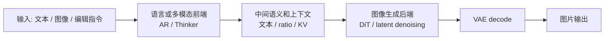
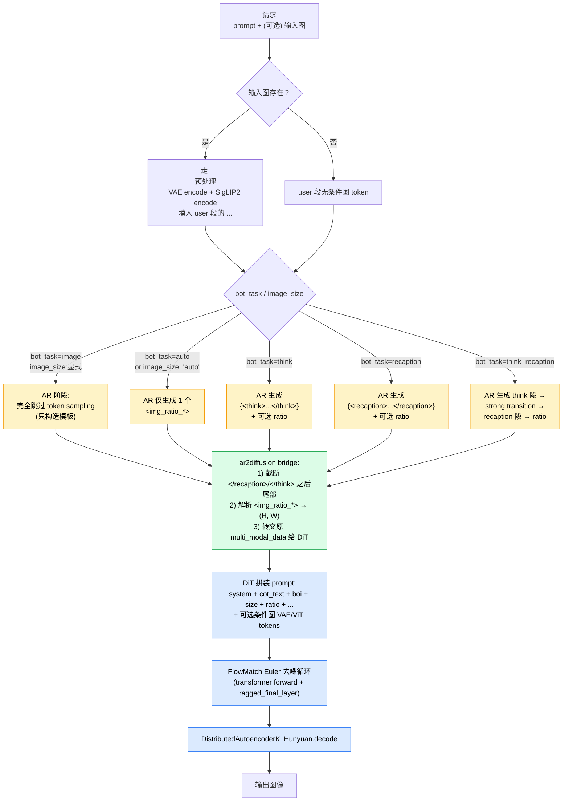
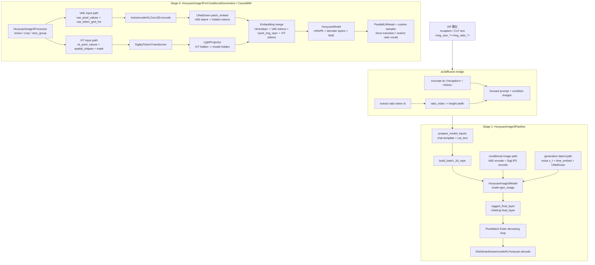
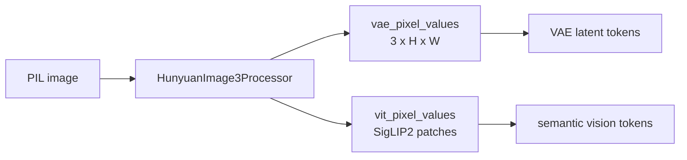
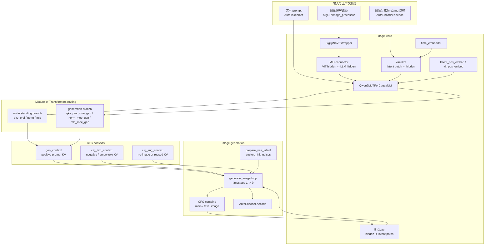
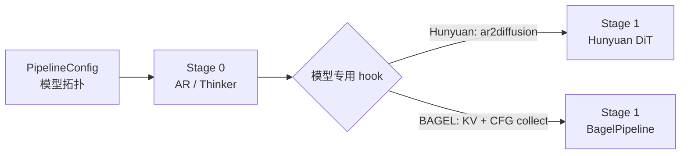

# vLLM-Omni Hunyuan-Image3.0 与 BAGEL 模型架构代码走读

> **文档版本**: 1.0  
> **分析代码版本**: 当前 workspace 本地 `vllm-omni` 源码  
> **最后更新**: 2026-06-01

---

## 文档概述

本文档分析 vLLM-Omni 中 **Hunyuan-Image3.0-Instruct** 与 **BAGEL-7B-MoT** 的模型内部架构。重点不是 connector、部署编排或 OpenAI API，而是模型自身如何把文本、图像、VAE latent、ViT token、AR/Thinker KV、DiT 去噪过程串起来。

**目标读者**: 希望理解 Hunyuan-Image3.0 / BAGEL 在 vLLM-Omni 中具体组件拆分和数据流的工程师。

**阅读指南**:

| 部分 | 内容 | 重点 |
|------|------|------|
| 第一部分 | 两个模型的共同范式 | 为什么都是 “AR/Thinker + DiT/VAE” |
| 第二部分 | Hunyuan-Image3.0 架构 | special token 速查、任务路径（CoT / 非 CoT / T2I / T+I2I）、AR 侧图像编码、ratio token、DiT 侧条件图与 latent 去噪；四个工程案例：DiT piecewise FA、async scheduler 下的 transition 修复、vLLM 0.20 升级后精度修复、comprehension 路径 D2H sync 优化 |
| 第三部分 | BAGEL 架构 | Qwen2MoT、VAE token、ViT token、三路 CFG KV |
| 第四部分 | vLLM-Omni 承载层 | 只说明 PipelineConfig / bridge hook 怎样承载模型 |
| 第五部分 | 对比总结 | 新接类似模型时要关注哪些模型内部边界 |

---

# 第一部分: 共同范式

## 1.1 不是“prompt 直接进 diffusion”

Hunyuan-Image3.0 和 BAGEL 都不是一个单体 diffusion pipeline。它们都先用语言/多模态前端构造上下文，再把上下文交给图像生成后端：

| 模型 | 前端 | 后端 | 核心交接物 |
|------|------|------|------------|
| Hunyuan-Image3.0 | AR / CausalMM | HunyuanImage3 DiT | recaption/CoT 文本、ratio token、条件图、可选 AR KV |
| BAGEL | Thinker / Qwen2MoT | Bagel DiT-like generation loop | 主请求 KV、`cfg_text` KV、`cfg_img` KV |



vLLM-Omni 在这里做的是“承载”：把模型拆成 stage，负责请求、采样参数、KV/输出传递；真正的模型逻辑仍然在 Hunyuan 和 BAGEL 自己的组件里。

---

# 第二部分: Hunyuan-Image3.0 模型架构

## 2.1 Pipeline 拓扑

Hunyuan-Image3.0 的默认拓扑定义在：

```text
vllm_omni/model_executor/models/hunyuan_image3/pipeline.py
```

关键结构是两阶段：

```python
HUNYUAN_IMAGE3_PIPELINE = PipelineConfig(
    model_type="hunyuan_image_3_moe",
    model_arch="HunyuanImage3ForCausalMM",
    stages=(
        StagePipelineConfig(
            stage_id=0,
            model_stage="AR",
            execution_type=StageExecutionType.LLM_AR,
            final_output=False,
            engine_output_type="latent",
        ),
        StagePipelineConfig(
            stage_id=1,
            model_stage="dit",
            execution_type=StageExecutionType.DIFFUSION,
            input_sources=(0,),
            final_output=True,
            final_output_type="image",
            custom_process_input_func=(
                "vllm_omni.model_executor.stage_input_processors."
                "hunyuan_image3.ar2diffusion"
            ),
        ),
    ),
)
```

这里不要把 stage 0 理解成“只会产文本”。它内部也有 VAE、SigLIP2、投影层和 mRoPE，用于把输入图像编码进 AR 上下文。

## 2.2 任务模式与特殊 token 速查

要理解 Hunyuan 各种 task 怎么走不同路径，必须先把它的特殊 token 词表和 `bot_task` 参数对清楚。Hunyuan 的所有"任务差异"几乎都体现在 **AR 阶段生成或填入哪些 special token** 上，DiT 阶段本身不会去判断任务类型。

### 2.2.1 bot_task 模式

源码入口：`HunyuanImage3ForCausalMM.generate_image()` 与 `tokenization_hunyuan_image_3.py::apply_general_template()`。

| `bot_task` 取值 | 含义 | AR 阶段产出 |
|----------------|------|--------------|
| `image` | 直接进 DiT，不经过任何 AR token 采样 | （无 AR sampling） |
| `auto` | 跳过 CoT，但自动判定图像尺寸 | 1 个 `<img_ratio_*>` |
| `img_ratio` | 等价于"仅判定尺寸" | 1 个 `<img_ratio_*>` |
| `think` | 只做 think CoT | `<think>...</think>` + 可选 `<img_ratio_*>` |
| `recaption` | 只做 prompt recaption | `<recaption>...</recaption>` + 可选 `<img_ratio_*>` |
| `think_recaption` | 先 think，再 recaption | `<think>...</think>` `<recaption>...</recaption>` + 可选 `<img_ratio_*>` |

是否追加 ratio token 由 `image_size == "auto"` 决定：传 `(H,W)` 的固定值就完全跳过 ratio 采样。

### 2.2.2 特殊 token 分类速查

#### 前置：chat template 与特殊 token 的工作机制

理解下表前需要先拆开两个常见误解：

1. **chat template 就是 Jinja 字符串拼接**。它从 `tokenizer_config.json::chat_template` 加载，唯一的工作是把 `messages = [{"role":..., "content":...}, ...]` 按角色前后缀拼成一个纯文本字符串，再交给普通 tokenizer encode 成 `input_ids`。**它不调模型、也不带任何"特殊语义"**。
2. **特殊 token 在模型层面就是普通词表条目**。"特殊"只体现在 tokenizer 端：注册过的 `<boi>` 不会被 BPE 切碎，单串直接映射成一个整数 id；decode 时可被 `skip_special_tokens` 跳过。一旦进入模型 forward，它和别的 token id 走完全相同的 embedding lookup → transformer → logits 流程，模型层面不知道它"特殊"。

由此一个 token 出现在最终序列里只有四种来源，下面的表用统一的"产出方式"列标注：

| 产出方式 | 含义 | 发生时机 |
|----------|------|----------|
| **template** | chat template 字符串拼接时直接写进 prompt | `generate()` 之前 |
| **AR sample** | 模型 forward → logits → 采样 → 追加到序列尾部 | `generate()` 每一步 |
| **AR sample (restricted)** | 同上，但 logits processor 把 vocab 限制到一小段；仍走采样链路 | `generate()` 中按触发条件改写 logits |
| **embedding 替换** | token id 由 template 占位写入，但 forward 时这个位置的 word embedding 被其他模块算出来的连续向量覆盖 | forward 内部 |

特别提醒：所谓"强制 token"（例如 `</think>` 后必须跳到 `<recaption>`）的本质是 logits processor 把其他 token 的 logit 压成 `-inf`，**仍然属于 AR sample，只是采样结果确定**。模型 forward 那一步并没有被跳过——它的输出 KV 还要进 cache 给下一步用。

#### 分类速查

下表覆盖 `setup_special_tokens()` 里所有注册的 token，按用途归类。

**(a) 结构控制 token（assistant 输出阶段）**

| Token | 作用 | 产出方式 |
|-------|------|----------|
| `<think>` | think 段起始标签 | template（`bot_task=think*` 时由 `add_assistant_prefix` 拼上） |
| `</think>` | think 段结束 | **AR sample**（模型训练时学会自己出） |
| `<recaption>` | recaption 段起始标签 | template（`bot_task=recaption` 时拼上），或 **AR sample (restricted)**（think_recaption 时由 transition processor 强制） |
| `</recaption>` | recaption 段结束 | **AR sample** |
| `<answer>` / `</answer>` | instruct 模板下 assistant 回答的包裹 | template |
| `<boi>` / `<eoi>` | begin/end of image，标记图像 token 段 | template（条件图与生成图前后由模板写入） |
| `<boa>` / `<eoa>` | begin/end of answer（部分场景等价 `<answer>`） | template（模板可选） |
| `<bov>` / `<eov>` | begin/end of vision（VAE 路径变体） | template（模板可选） |
| `<eos>` | 序列结束 | **AR sample**（ratio token 之后由 restriction 强制采样它） |

**(b) 图像 placeholder 与 embedding 占位 token**

| Token | 作用 | 产出方式 |
|-------|------|----------|
| `` | 输入图像在 prompt 里的占位符 | template（写进 prompt）→ 预处理时被展开成 `VAE tokens + <joint_img_sep> + ViT tokens` 序列 |
| `<joint_img_sep>` | 单张图内 VAE 段与 ViT 段的分隔符 | template |
| `<timestep>` | 占位 token，word embedding 被 `TimestepEmbedder(t)` 替换 | template（占位）+ **embedding 替换**（条件图传 t=0，生成图传当前 timestep） |
| `<timestep_r>` | meanflow 用的额外 timestep | 默认未启用 |
| `<guidance>` | CFG distilled 模型的 guidance scale embedding 占位 | 默认未启用 |
| `<cfg>` | CFG uncond 分支的占位符 | CFG 构造负样本时由 template 注入 |

**(c) 尺寸 / 比例控制 token**

| Token | 作用 | 产出方式 |
|-------|------|----------|
| `<img_size_{N}>` | 图像 base size，例如 `<img_size_1024>` | template（生成图 `<boi>` 后由模板写入） |
| `<img_ratio_{0..36}>` | 宽高比索引，对应 `vae_reso_group` 中预定义的 `(H, W)` 表 | **AR sample (restricted)**：`<img_size_*>` 之后 logits processor 把 vocab 切到 37 个 ratio token 上 argmax |

ratio token 是 AR 与 DiT 的关键桥：

- 0–32：标准比例（HunyuanImage-3.0）
- 33–36：扩展比例（仅在某些版本启用）

bridge 拿到 ratio token id 后用 `_build_ratio_size_table(base_size)` 反查出 `(height, width)`，交给 DiT 决定生成图 latent 网格。

**(d) 接地 / 空间语义 token（grounding，默认推理路径不使用）**

| Token | 作用 |
|-------|------|
| `<ref>` / `</ref>` | 引用目标 |
| `<quad>` / `</quad>` | 四边形框 |
| `<relation_*>` `<x_*>` `<y_*>` `<z_*>` | 空间关系与坐标位置 |

### 2.2.3 单请求 token 序列模板

下面用伪格式展示 instruct 模板下不同任务的 AR 完整输入/输出序列。`[ ... ]` 标注 DiT 阶段才会被实际填充的部分，`{ ... }` 标注 AR 阶段会采样产出的部分。

**T2I（text-to-image），`bot_task=image`，固定 image_size**：

```text
<system>system prompt</system><sep>
<user>用户 prompt</user><sep>
<assistant><answer><boi><img_size_1024><img_ratio_X>           # 全部由 chat template 直接写入
<timestep>[VAE gen tokens]<joint_img_sep>[ViT gen tokens]<eoi></answer>
```

**T2I，`bot_task=auto`（最常用，自动判定尺寸，无 CoT）**：

```text
<system>system prompt</system><sep>
<user>用户 prompt</user><sep>
<assistant><answer><boi><img_size_1024>{<img_ratio_X>}        # AR 仅生成 1 个 ratio token
<timestep>[VAE gen tokens]<joint_img_sep>[ViT gen tokens]<eoi></answer>
```

**T2I + think CoT，`bot_task=think`**：

```text
<system>system prompt</system><sep>
<user>用户 prompt</user><sep>
<assistant>{<think>...思考过程...</think>}                     # AR 自由采样 think 段
<answer><boi><img_size_1024>{<img_ratio_X>}                    # </think> 后强制 transition + ratio
<timestep>[VAE gen tokens]<joint_img_sep>[ViT gen tokens]<eoi></answer>
```

**T2I + recaption CoT，`bot_task=recaption`**：

```text
<system>system prompt</system><sep>
<user>用户 prompt</user><sep>
<assistant>{<recaption>...改写后的 prompt...</recaption>}       # AR 自由采样 recaption 段
<answer><boi><img_size_1024>{<img_ratio_X>}
<timestep>[VAE gen tokens]<joint_img_sep>[ViT gen tokens]<eoi></answer>
```

**T2I + think_recaption**：think 与 recaption 串联，两段中间由 `_StageTransitionLogitsProcessor` 强制把 `</think>` 切到 `<recaption>`。

**T+I2I（image editing，带条件图）**：在 user 段插入一段图像 token 即可，AR/CoT 分支与 T2I 完全相同：

```text
<system>system prompt</system><sep>
<user>
  <boi><timestep>[cond VAE tokens]<joint_img_sep>[cond ViT tokens]<eoi>   # 预处理时把  替换进来
  编辑指令
</user><sep>
<assistant>[optional CoT segments]
<answer><boi><img_size_1024>{<img_ratio_X>}
<timestep>[VAE gen tokens]<joint_img_sep>[ViT gen tokens]<eoi></answer>
```

### 2.2.4 AR 采样的强制规则

AR 的自定义 `sample()` 用上面这些 token 做了三类强制约束（也是为什么模型一定能产出合法 ratio 的关键）：

1. **stage transition forcing**：通过 `_StageTransitionLogitsProcessor` 把 `</think>` 后强制跳到 `<recaption>` 起始；把 `</recaption>` / `</think>` 后强制跳到 `<answer><boi><img_size_*>`。
2. **ratio restriction**：上一个 token 是 `<img_size_*>` 时，只允许从 `<img_ratio_0..32>`（+ 扩展槽位 33..36）里 argmax 选择。
3. **terminate on ratio**：一旦产出 ratio token，下一步只能输出 `<eos>`，AR 阶段结束。

这就是为什么 AR 输出对 DiT 而言是"结构化控制信号"而不是普通自然语言生成。

> 这套约束在 sync / async scheduler 下的执行细节、以及 PR #3681 修复的一个相关 bug 见 [2.10 节](#210-think_recaption-连续-decode-与-async-scheduler-修复案例)。

---

## 2.3 任务条件下的执行路径

下面这张图把 `bot_task` × `image_size` × 是否带条件图的所有组合拍成一张分支图。注意：**所有路径最终都会进入同一个 DiT denoise loop**，差异只在于 AR 阶段产出什么、DiT 输入 prompt 拼成什么样子。



四类常见任务在这张图上的具体走法：

| 任务 | 输入图？ | bot_task | image_size | AR 实际工作 | DiT 输入差别 |
|------|----------|----------|------------|-------------|---------------|
| **T2I 极速档** | 否 | `image` | 固定 `(H,W)` | 仅构造模板，不采样 | 无条件图，无 cot |
| **T2I 默认档** | 否 | `auto` | `"auto"` | 1 个 ratio token | 无条件图，无 cot |
| **T2I + CoT** | 否 | `think` / `recaption` / `think_recaption` | `"auto"` 或固定 | CoT 段 + 可选 ratio | 无条件图，cot 段拼进 prompt |
| **T+I2I（编辑）** | 是 | 上述任一 | 上述任一 | 同上 | 有条件图 VAE+ViT token，cot 段同 T2I |

关键观察：

- **AR 是否被"实质性"使用，只看 `bot_task` 与 `image_size` 的组合**，与是否有条件图无关。
- **是否带条件图只影响 prompt 模板里 user 段的内容**，不影响 AR/DiT 的执行结构。
- **CoT 的 token 串（think/recaption 段）会被 bridge 截断保留并拼到 DiT 的 prompt 文本里**，作为 DiT 的高质量描述输入，而 `<img_size_*>` / `<img_ratio_*>` 这类控制 token 不会泄漏进 DiT prompt（bridge 显式 truncate）。
- **`<img_ratio_*>` 是 AR 与 DiT 的唯一"数值型"接口**：ratio 索引被解析成 (H, W) 决定生成图 latent 网格。

---

## 2.4 Hunyuan 内部组件总览



## 2.5 AR stage: 图像输入如何变成 LLM token

源码入口：

```text
vllm_omni/model_executor/models/hunyuan_image3/hunyuan_image3.py
```

### 2.5.1 HunyuanImage3Processor

`HunyuanImage3Processor` 负责把输入图像拆成两套表示：

| 输出字段 | 用途 |
|----------|------|
| `vit_pixel_values` | 进入 SigLIP2 vision encoder |
| `vit_pixel_attention_mask` | SigLIP2 的 patch mask |
| `vit_spatial_shapes` | SigLIP2 patch 网格 |
| `vae_pixel_values` | 进入 VAE encoder，按图片扁平拼接 |
| `vae_pixel_size` | vLLM 按 size 还原 ragged VAE tensor |
| `vae_token_grid_hw` | 每张图 VAE token 网格，后续用于 mRoPE 和 token 替换 |

关键点：Hunyuan 同一张输入图会走 **VAE path** 和 **ViT path** 两路。



### 2.5.2 VAE path

AR stage 的模型类里显式创建了这些组件：

```python
self.vae = AutoencoderKLConv3D.from_config(config.vae)
self.patch_embed = UNetDown(
    patch_size=config.patch_size,
    emb_channels=config.hidden_size,
    in_channels=config.vae["latent_channels"],
    hidden_channels=config.patch_embed_hidden_dim,
    out_channels=config.hidden_size,
)
self.time_embed = TimestepEmbedder(hidden_size=config.hidden_size)
```

VAE path 的实际过程：

1. `AutoencoderKLConv3D.encode(images)` 得到 latent posterior。
2. 采样 latent，并应用 `shift_factor` / `scaling_factor`。
3. `UNetDown patch_embed(latents, time_embed(0))` 把 latent patch 投到 LLM hidden size。
4. 这些 embedding 替换 prompt 里的 `` 占位 token。

VAE path 提供更接近像素/空间结构的图像条件。

### 2.5.3 ViT path

ViT path 的组件：

```python
self.vision_model = Siglip2VisionTransformer(config.vit)
self.vision_aligner = LightProjector(config.vit_aligner)
```

过程：

1. `Siglip2VisionTransformer(pixel_values, attention_mask, spatial_shapes)` 得到 vision hidden states。
2. `LightProjector` 把 ViT hidden size 投到 Hunyuan hidden size。
3. 与 VAE tokens 一起组成一段 joint image token 序列。

在 `embed_multimodal()` 中，单张图的顺序是：

```text
<timestep>  VAE tokens  <joint_img_sep>  ViT tokens
```

`<timestep>` 的 embedding 不是普通词表 embedding，而是由 `TimestepEmbedder(0)` 动态替换。

### 2.5.4 mRoPE 与 image token 位置

Hunyuan 自定义了 `get_mrope_input_positions()`，把不同 token 映射到 3 维 mRoPE 位置：

| token 类型 | mRoPE 行为 |
|------------|------------|
| 文本 token | 三个维度都使用普通 1D position |
| `<timestep>` / 分隔符 | 按普通辅助 token 处理 |
| VAE image tokens | height / width 维度使用 2D 网格位置 |
| ViT image tokens | height / width 维度使用 2D 网格位置 |

这解释了为什么 `vae_token_grid_hw` 和 `vit_spatial_shapes` 都要从 processor 一直带到 model。

## 2.6 AR 输出采样的强制约束（实现细节）

> 概念性总结见 [2.2.4 节](#224-ar-采样的强制规则)。这里给出对应的源码层面实现。

Hunyuan AR 的采样器不是普通 sampling。`sample()` 里有两类模型专用逻辑：

1. **stage transition forcing**：例如在 `</think>` 后强制进入 `<recaption>` / `<answer>` / `<boi>` 等结构。
2. **ratio restriction**：当上一个 token 是 `<img_size_1024>` 时，只允许输出 `<img_ratio_*>` token，并取 argmax。

简化逻辑：

```python
forced = self._get_forced_token(decoded_tokens)
if forced is not None:
    logits[req_idx].fill_(min_score)
    logits[req_idx, forced] = 0
elif last_token == self._size_token_id:
    self._apply_ratio_restriction(logits, req_idx, min_score)
elif last_token in self._all_ratio_ids:
    logits[req_idx].fill_(min_score)
    logits[req_idx, self._eos_token_id] = 0
```

这就是 Hunyuan 的特殊性：AR stage 不只生成自然语言，还生成给 DiT 使用的结构化控制 token。

## 2.7 ar2diffusion: AR 到 DiT 的模型语义桥

源码：

```text
vllm_omni/model_executor/stage_input_processors/hunyuan_image3.py
```

核心逻辑：

```python
ratio_idx = _extract_ratio_index(generated_token_ids)
if ratio_idx is not None:
    base_size = int(original_prompt.get("image_base_size", 1024))
    size_table = _build_ratio_size_table(base_size)
    if 0 <= ratio_idx < len(size_table):
        height, width = size_table[ratio_idx]

cot_text_for_dit = _truncate_at_cot_end(generated_text)

diffusion_input = {
    "prompt": text_prompt,
    "height": height,
    "width": width,
    "extra": {"ar_generated_text": cot_text_for_dit},
}
```

`ar2diffusion` 做了三件非常模型相关的事：

| 动作 | 目的 |
|------|------|
| 从 token id 解析 `<img_ratio_*>` | 得到 DiT 目标宽高 |
| 截断 `</recaption>` / `</think>` 后面的尾部 | 防止 `<answer><boi><img_size><img_ratio>` 泄漏进 DiT prompt |
| 转交原始 `multi_modal_data["image"]` | image editing / multi-image conditioning 需要原图 |

## 2.8 DiT stage: HunyuanImage3Pipeline

源码：

```text
vllm_omni/diffusion/models/hunyuan_image3/pipeline_hunyuan_image3.py
```

### 2.8.1 初始化组件

`HunyuanImage3Pipeline.__init__()` 中的核心组件：

| 组件 | 作用 |
|------|------|
| `HunyuanImage3Model` | DiT 主体，实际 forward 在 `mode="gen_image"` 下运行 |
| `DistributedAutoencoderKLHunyuan` | VAE decode，条件图也会用 VAE encode |
| `HunyuanImage3ImageProcessor` | 构造生成图和条件图的 image info |
| `Siglip2VisionTransformer` | 条件图语义编码 |
| `LightProjector` | ViT hidden → Hunyuan hidden |
| `UNetDown patch_embed` | 当前噪声 latent / 条件 VAE latent → token embedding |
| `UNetUp final_layer` | transformer hidden → latent patch prediction |
| `FlowMatchEulerDiscreteScheduler` | diffusion timestep 更新 |

### 2.8.2 forward 数据流

`forward()` 做的事：

```python
prompt = [p if isinstance(p, str) else (p.get("prompt") or "") for p in req.prompts]
cot_text_list = [
    (p.get("extra", {}).get("ar_generated_text") if isinstance(p, dict) else None)
    or None for p in req.prompts
]
height = req.sampling_params.height or height
width = req.sampling_params.width or width

model_inputs = self.prepare_model_inputs(
    prompt=prompt,
    cot_text=cot_text,
    system_prompt=system_prompt,
    mode="gen_image",
    image_size=(height, width),
    batch_cond_image_info=batch_cond_image_info,
)
outputs = self._generate(**model_inputs, **kwargs)
```

`prepare_model_inputs()` 是 DiT stage 的核心入口：

1. 根据 prompt / CoT / system prompt 应用 Hunyuan chat template。
2. 构建 `batch_gen_image_info`，决定生成图 token 网格。
3. 如果有条件图，调用 `_encode_cond_image()` 得到：
   - `cond_vae_images`
   - `cond_timestep`
   - `cond_vit_images`
4. 构建 2D RoPE。
5. 返回给 `_generate()` / diffusion loop 的模型输入。

### 2.8.3 forward_call: latent token 如何参与 transformer

`forward_call()` 里有两类图像 token：

| token 类型 | 来源 | 替换方式 |
|------------|------|----------|
| 生成图 token | 当前噪声 latent `x_t` | `patch_embed(images, time_embed(t))` |
| 条件图 VAE token | 条件图 VAE latent | `instantiate_vae_image_tokens()` |
| 条件图 ViT token | SigLIP2 + projector | `instantiate_vit_image_tokens()` |

简化过程：

```python
if first_step:
    inputs_embeds, token_h, token_w = self.instantiate_vae_image_tokens(
        inputs_embeds, images, timestep, image_mask
    )
else:
    t_emb = self.time_embed(timestep)
    image_emb, token_h, token_w = self.patch_embed(images, t_emb)
    timestep_emb = self.timestep_emb(timestep).reshape(bsz, -1, n_embd)
    inputs_embeds = torch.cat([timestep_emb, image_emb], dim=1)

if cond_vae_images is not None:
    inputs_embeds = self.instantiate_vae_image_tokens(...)
if cond_vit_images is not None:
    inputs_embeds = self.instantiate_vit_image_tokens(...)

outputs = self.model(..., inputs_embeds=inputs_embeds, mode="gen_image")
diffusion_prediction = self.ragged_final_layer(...)
```

最后 `ragged_final_layer()` 用 `UNetUp final_layer` 把 hidden states 转成 latent patch prediction。这个 prediction 进入 FlowMatch Euler step，反复更新 `x_t`，最后 VAE decode 成图。

## 2.9 DiT attention 优化案例：从 SDPA 到 piecewise FlashAttention

这一节用一个具体优化（[PR #2981 / `857356d5`](https://github.com/vllm-project/vllm-omni/pull/2981)，"hunyuanimage support flash attn"）讲清楚：

- 怎么从模型固有 attention 形态识别出"SDPA 是次优解"这一点；
- 用 `full_attn_spans` + piecewise 调用 FlashAttention 把它替换掉，同时保证数值等价；
- 当前实现还能继续往哪里走（FlexAttention / varlen FA / FA3 mask_mod / NPU）。

### 2.9.1 模型固有的 mixed causal/full mask

Hunyuan-Image3 DiT 的 attention mask 不是普通 causal 也不是普通 full，而是**段内 full、段外 causal** 的混合形态。在 [pipeline_hunyuan_image3.py::_prepare_attention_mask_for_generation()](https://github.com/vllm-project/vllm-omni/blob/main/vllm_omni/diffusion/models/hunyuan_image3/pipeline_hunyuan_image3.py) 里可以直接看到这个 mask 的构造：

```python
attention_mask = torch.ones(seq_len, seq_len, dtype=torch.bool).tril(0).repeat(bsz, 1, 1)
for image_slice in batch_image_slices[i]:                # 条件图 + 生成图 token 段
    attention_mask[i, image_slice, image_slice] = True   # 段内打开全连接
```

直观语义：

| token 段 | mask 形态 |
|----------|-----------|
| system / prompt / CoT / 控制 token | causal（下三角） |
| 条件图块（VAE + ViT） | 段内 bidirectional，段外仍然 causal |
| 生成图块（timestep + latent tokens） | 段内 bidirectional，段外仍然 causal |

这是模型训练时的固有形态——图像 token 块内部需要互相看见才能学到 2D 空间结构，而 prompt/CoT 之间保留语言模型的因果性。**它不可能被"省略"或"简化"，只能找一个 attention 实现来兼容它。**

### 2.9.2 早期实现：硬编码 SDPA + 显式 2D mask

PR #2981 之前 [`HunyuanImage3Pipeline.__init__()`](https://github.com/vllm-project/vllm-omni/blob/main/vllm_omni/diffusion/models/hunyuan_image3/pipeline_hunyuan_image3.py) 里有这段非常显眼的 hack：

```python
os.environ["DIFFUSION_ATTENTION_BACKEND"] = "TORCH_SDPA"
logger.info(
    "Setting attention backend to TORCH_SDPA. "
    "HunyuanImage3Pipeline only supports TORCH_SDPA to handle mixed causal and full attention."
)
```

也就是说：**Omni 的统一 diffusion attention backend 有 FlashAttention 实现，但 Hunyuan-Image3 这一条路径被强制掉到 SDPA**，原因就是上面那个混合 mask。代价：

1. mask 必须显式物化为 `(B, 1, S, S)` bool tensor，**O(S²) 显存**；HunyuanImage 的生成图块就是 4096 个 latent token，加 prompt/CoT 后整段 `S` 轻易过 5k–10k，mask 本身就是百 MB 量级。
2. SDPA 拿到任意 2D bool mask 时通常落到 `memory_efficient` 或 `math` 后端，**无法吃下 FlashAttention 的 IO-aware kernel**。
3. 每个 denoise step 都要重算/重用这个 mask（实际是 cache 过的，但仍是巨型 tensor）。

识别这是优化点的关键判据：**mask 本身有非常稀疏的结构（图像 block + causal），却被压扁成了一个 dense 2D bool tensor，扔给了一个不识别 sparsity 的 kernel。**

### 2.9.3 改造：把 mask 分解成 `full_attn_spans`

PR #2981 的改造步骤：

**Step 1 — 在 mask 构造点同时输出 spans**

[`_prepare_attention_mask_for_generation()`](https://github.com/vllm-project/vllm-omni/blob/main/vllm_omni/diffusion/models/hunyuan_image3/pipeline_hunyuan_image3.py) 在跑那段 for loop 时本来就知道每张图块的 `start, end`，顺手把它收集成 `full_attn_spans: list[list[tuple[int, int]]]`：

```python
full_attn_spans: list[list[tuple[int, int]]] = [[] for _ in range(bsz)]
for i in range(bsz):
    for image_slice in batch_image_slices[i]:
        attention_mask[i, image_slice, image_slice] = True
        full_attn_spans[i].append((int(image_slice.start), int(image_slice.stop)))
    full_attn_spans[i].sort(key=lambda x: x[0])
model_kwargs["full_attn_spans"] = full_attn_spans
```

`full_attn_spans` 的尺寸只跟图块数有关（通常 1–3 个），完全无关 `S`。

**Step 2 — spans 透传到 attention layer**

经过 `prepare_inputs_for_generation()` / `_update_model_kwargs_for_generation()` / `forward()` 一路下传，最终在 [`ImageKVCacheManager.__call__()`](https://github.com/vllm-project/vllm-omni/blob/main/vllm_omni/diffusion/models/hunyuan_image3/hunyuan_image3_transformer.py) 里塞进 `AttentionMetadata`：

```python
full_attn_spans = kwargs.get("full_attn_spans", None)
attn_metadata = AttentionMetadata(
    attn_mask=attention_mask,
    full_attn_spans=full_attn_spans,    # ← 关键
)
attn_output = self.attn(query, key, value, attn_metadata)
```

注意 2D `attn_mask` 仍然保留——因为 SDPA backend 还在用它，并且 CFG slicing 等通用逻辑也依赖它。这是个**双轨**策略：spans 走快路径，mask 兜底。

**Step 3 — FlashAttention 拿到 spans 后走 piecewise**

[`FlashAttentionImpl.forward_cuda()`](https://github.com/vllm-project/vllm-omni/blob/main/vllm_omni/diffusion/attention/backends/flash_attn.py)：

```python
if full_attn_spans is not None:
    return piecewise_attn(query, key, value, full_attn_spans, self.softmax_scale, flash_attn_func)
```

[`piecewise_attn()`](https://github.com/vllm-project/vllm-omni/blob/main/vllm_omni/diffusion/attention/backends/utils/piecewise_attn.py) 把整段 query 切成若干 segment：

```python
for s, e, mode in build_segments(spans, query_offset, Sq):
    out[:, s-q_off:e-q_off] = attn_func(
        query[:, s-q_off:e-q_off],
        key[:, :e],                      # KV 始终从 0 切到 e（兼容 cache_prompt_kv 的复用前缀）
        value[:, :e],
        causal=(mode == "causal"),       # 纯 causal 或纯 full
        softmax_scale=softmax_scale,
    )
```

也就是：把 mixed mask 分解成一串"纯 causal 段"和"纯 full 段"，每段调一次 FlashAttention。**每次调用都是 FA 喜欢的形状**——没有 mask tensor，只有 `causal` flag。

**Step 4 — 删掉 SDPA 硬编码**

`os.environ["DIFFUSION_ATTENTION_BACKEND"] = "TORCH_SDPA"` 直接删掉，默认走 omni 的 attention backend 路径（CUDA → FlashAttention，NPU → MindIE-SD，等）。

### 2.9.4 正确性等价：bottom-right causal 是关键观察

最容易出错的地方是 **decode 步骤里 `Sq < Sk`**（KV 复用 prompt 段时，query 只覆盖尾部）。`piecewise_attn` 里写法是：

```python
attn_func(query[:, q_s:q_e], key[:, :e], value[:, :e], causal=True)
```

每段 query 都对应 K/V 的前缀 `[:e]`，看起来 causal 的对齐很容易错。**关键在于 FlashAttention 的 `causal=True` 是 bottom-right 对齐**：当 `Q.shape[1] < K.shape[1]` 时，causal mask 锚定在右下角，等价于全局 mask 取出 `Q` 对应的下三角行。这正好对应到全局 mixed mask 在该 segment 上的形状。

仓库里 [`tests/diffusion/attention/test_piecewise_attn.py`](https://github.com/vllm-project/vllm-omni/blob/main/tests/diffusion/attention/test_piecewise_attn.py) 把这个等价性做成参数化测试：

- 用一个 SDPA reference（手动构造下三角 + 段内 full 的 2D mask）跑 ground truth；
- 用同一个 attn_func 跑 piecewise；
- 对 `(no-spans / span-at-start / multi-spans) × (Sq==Sk / Sq<Sk) × (B=1 / B=2)` 各组合断言数值 close。

`Sq < Sk` 的 case 专门覆盖了 KV cache 复用场景的语义。

### 2.9.5 收益与限制

**收益**

| 维度 | 早期 SDPA | piecewise FA |
|------|----------|--------------|
| 显存 mask | `(B, 1, S, S)` 显式 bool tensor | 不传 mask，spans 只有 O(num_blocks) |
| Kernel | `memory_efficient` 或 `math` | FlashAttention（IO-aware） |
| `S=8192` 大致量级 | mask ≈ 128 MB（bf16 fp 化更多）+ HBM 反复读写 | mask 不占显存，HBM 流量大幅下降 |
| Backend 切换 | 硬编码强制 SDPA | 走标准 backend dispatcher，CUDA/NPU/XPU 都能上 |
| 后续 KV 复用 | 大 mask 每步重算 / cache | spans 跨步不变，构造一次复用所有 denoise step |

**限制 / 当前边界**

| 限制 | 原因 |
|------|------|
| `_check_homogeneous` 要求 batch 内 spans 完全一致 | CFG 正/负分支 prompt 同构，满足；异构 batch（不同分辨率/不同条件图数量混批）会触发 raise |
| segment 数线性增加 kernel launch | 一般 1–3 个 image block，影响有限；但极端多块（多条件图编辑）会有 overhead |
| 只在 `forward_cuda()` 走 piecewise | `forward_xpu` / `forward_npu` 仍走 mask 路径，NPU 还落在 SDPA |
| 仍然需要构造 2D `attention_mask` | 为了 SDPA fallback + CFG slicing 复用；理论上可以省 |

### 2.9.6 还能继续优化吗——FlexAttention 视角

你提到"本质上这个东西像 flex attention"——非常贴。把 piecewise 这一招翻译成 FlexAttention 语义就是：

```python
def mask_mod(b, h, q_idx, kv_idx):
    # 默认 causal
    causal = kv_idx <= q_idx
    # 任意一个 span 同时包含 q_idx 与 kv_idx → 段内 full
    in_block = any((s <= q_idx < e) & (s <= kv_idx < e) for s, e in spans[b])
    return causal | in_block

block_mask = create_block_mask(mask_mod, B, H, S, S)
out = flex_attention(q, k, v, block_mask=block_mask)
```

相对当前 piecewise 的潜在好处：

1. **一次 kernel 替代 N 段调用**：消掉 segment 数对 launch overhead 的依赖。
2. **天然支持异构 batch**：`mask_mod` 拿 `b` 做索引，per-sample spans 不需要 `_check_homogeneous`。
3. **block-sparse 自动跳过全零块**：FlexAttention 的 `BlockMask` 会按 block-level 跳过整块不参与计算的 KV，对长 prompt + 多 image block 的场景更友好。
4. **score_mod 可扩展**：之后若需要 attention bias（例如训练侧用到的 logit scaling、ALiBi 风格 mask）可以无侵入加上。

代价 / 风险：

- FlexAttention 强依赖 `torch.compile` 与较新 PyTorch（≥ 2.5）；vllm-omni 的 vLLM v1 路径已经走 `support_torch_compile`，融入难度可控，但要确认 `block_mask` 不会在每个 denoise step 重新 trace（spans 跨 step 不变，应该可以缓存一次）。
- 对 GPU 老世代或 NPU/XPU 没有等价 fallback，需要保留现有的 piecewise / SDPA 路径，dispatcher 复杂度上升。

**其它平行方向**：

- **varlen FlashAttention with `cu_seqlens`**：把段 layout 编码成 cumulative seqlens 一次 call。但 varlen FA 对"段内 full / 段间 causal"这种 mixed mode 没有原生 flag，需要手工 trick，性价比不如 FlexAttention。
- **FA3 mask_mod**：FA3 的 mask_mod API 已经很接近 FlexAttention，且不强依赖 compile；如果性能很关键、目标硬件是 Hopper+，是值得评估的中间方案。
- **NPU 路径补齐**：当前 NPU 仍然落在 SDPA `forward_npu`（`full_qk` mask layout），可以补一个段感知的 NPU 实现（例如 MindIE-SD 的 mask 形态或 attention_forward 多次调用），让 NPU 侧吃到同样收益。
- **省掉显式 2D mask**：把 SDPA backend 也改成"如果有 spans 就内部构造 mask，外部不再物化"，可以把 host 侧那块大 bool tensor 也省掉，配合 KV reuse 路径更顺。

如果要排个优先级，我的建议是：

1. **NPU 补齐** —— 用户最直接受益，现有 piecewise 框架已就绪。
2. **FlexAttention 切换** —— 长期清爽，并解锁异构 batch 的可能性。
3. **2D mask 去物化** —— 顺手优化，代码改动小。

## 2.10 think_recaption 连续 decode 与 async scheduler 修复案例

这一节用一个看起来很小的 PR（[#3681 / `7540775`](https://github.com/vllm-project/vllm-omni/pull/3681)，核心改动只有 1 行位置调整）讲清楚两件事：

1. think_recaption 模式下 AR 在 `</think>` 之后到底在做什么，是不是真的"停一下又开始"；
2. 这套机制在 async scheduling 路径下差点失效，bug 怎么定位、怎么补。

### 2.10.1 `</think>` 之后 AR 还在 decode 吗？是的

最容易产生的误解是："`</think>` 是不是分段标志，AR 在这里会停下来，让调度器/DiT 介入，再启动新的 `generate()` 跑 recaption"。**不是**。整个 think 段 + recaption 段 + ratio token 都是**同一次 `generate()` 调用、同一份 KV cache、不间断**采样出来的。从 [2.2.4](#224-ar-采样的强制规则) 节的视角看：所谓 "transition" 不会暂停采样，它只是改下一步的 logits。

把单次 step 展开看就清楚了。假设上一步刚采样到 `</think>`：

```text
step k    : forward → logits → sample → </think>            ← AR sample（模型学会自然产出）
step k+1  : forward (新 KV 包含 </think>) → logits → sample
            ↑
            logits processor 看到 last_token == </think>
            → 把其他 token 的 logit 压成 -inf，只留 <recaption> → 0
            → sample 必然得到 <recaption>                    ← AR sample (restricted)
step k+2  : forward (KV 包含 <recaption>) → logits → sample
            ↑ last_token == <recaption>，processor 不再干预
            → 模型自由采样 recaption 实际内容                ← AR sample
...
step k+n  : forward → logits → sample → </recaption>         ← AR sample
step k+n+1: forward → logits → sample
            ↑ last_token == </recaption>
            → processor 强制下一步 = <answer><boi><img_size_1024>
              （依模板配置；可能拆成多步逐 token forcing）
...
直到采到 <img_ratio_X>，下一步限制 vocab 只剩 <eos>，AR 结束
```

观察点：

- **AR 在 `</think>` 处不暂停**。下一步仍然做 forward + sample，只是 sample 结果被 logits processor 钳到 `<recaption>`。
- **KV cache 全程连续**：`</think>` 的 KV 写进 cache 后立刻被 `<recaption>` 这一步的 attention 用到，再被后续 recaption 内容用到。中间没有 KV 重建，也没有调度器介入。
- **transition 的运行时代价就是多走 1 次 forward**——这一步必须算（否则 KV 不连续），但它的输出 logits 会被压扁。
- 上一节 2.2.4 列的三类约束（stage transition / ratio restriction / terminate on ratio）都是这同一机制的不同触发条件。

### 2.10.2 transition 怎么"知道上一步是 `</think>`"——以及 async 下为什么会错

`_StageTransitionLogitsProcessor` 判定 "last token 是不是 `</think>`" 的方式是读 `sampling_metadata.output_token_ids`，看最后一项的 token id。PR #3681 的故事就围绕这个读取时机。

**Sync scheduler 路径**（`--stage-configs-path`）：scheduler 与 GPU runner 同进程或紧耦合。上一步采样结果立即写回 `output_token_ids`，下一步 forward 前 processor 读到的就是最新值，工作正常。

**Async scheduler 路径**（`--deploy-config`）：scheduler 与 GPU runner 是独立进程，token 回写有 staging：`output_token_ids` 在 scheduler 侧可能预留 `-1` 占位，真实采样值需要 `update_async_output_token_ids()` 把 GPU 端 `sampled_token_ids_cpu` 同步回来。

PR 之前 [`gpu_ar_model_runner.py::_sample()`](https://github.com/vllm-project/vllm-omni/blob/main/vllm_omni/worker/gpu_ar_model_runner.py) 的写法：

```python
sampling_metadata = self.input_batch.sampling_metadata
if logits is not None and callable(model_sample) and prefer_model_sampler:
    # Hunyuan 自定义 sampler，内部含 _StageTransitionLogitsProcessor
    sampler_output = model_sample(logits, sampling_metadata, ...)
    if sampler_output is not None:
        return sampler_output            # ← 这里就 return 了
self.input_batch.update_async_output_token_ids()  # ← 永远到不了
return self.sampler(...)                            # 默认 sampler 分支
```

也就是：**async 路径下 token history 的同步只在"默认 sampler 分支前"做。Hunyuan 设置了 `prefer_model_sampler=True`，每次都从自定义 sampler 分支直接 return，根本到不了那行**。结果：

- `_StageTransitionLogitsProcessor` 看到的 `output_token_ids` 一直滞后或带 `-1` 占位；
- 检测不到 `</think>`，不强制 `<recaption>`；
- 模型沿着自然分布继续采样。

PR 描述里的 before/after 输出对照非常说明问题——模型其实仍然能自然产出 recaption 风格的内容（毕竟这就是它训练分布的一部分），但**结构 token `<recaption>` 缺失**：

```text
Before fix: ...</think>请基于参考图中的金毛幼犬，创作一张...</recaption>
                       ↑ <recaption> 起始标签缺失
After fix : ...</think><recaption>将参考图中的金毛幼犬制作成...</recaption>
```

下游影响很直接：[ar2diffusion bridge](#27-ar2diffusion-ar-到-dit-的模型语义桥) 是按 `</recaption>` / `</think>` 截断、按 `<recaption>...</recaption>` 配对抽取 CoT 文本送 DiT 的。开头 tag 没了之后，bridge 就没法正确切段，DiT 拿到的 `cot_text` 形态出错——任务结果未必崩，但偏离训练对齐。

### 2.10.3 修复：一行位置调整

PR 的实际改动只有一行：

```diff
 sampling_metadata = self.input_batch.sampling_metadata
 if spec_decode_metadata is None:
     model_sample = getattr(self.model, "sample", None)
+    self.input_batch.update_async_output_token_ids()
     if logits is not None and callable(model_sample) and prefer_model_sampler:
         sampler_output = model_sample(logits, sampling_metadata, ...)
         if sampler_output is not None:
             return sampler_output
-    self.input_batch.update_async_output_token_ids()
     return self.sampler(...)
```

把同步动作提到分支判断之前，让所有 sampler（自定义 / 默认）都能读到最新 `output_token_ids`。修完之后 e2e accuracy test (`test_hunyuan_image3.py`) 在 deploy-config 路径下也能复现 CoT prefix 完全 match。

### 2.10.4 这个 case 抽出来的一般性教训

把 #3681 抽象一层看，它揭示的是这样一组耦合：

| 抽象层面 | Hunyuan 实例 |
|----------|--------------|
| 模型把"依赖历史 token 的采样约束"放在 logits processor 里 | stage transition forcing、ratio restriction |
| processor 的输入依赖 scheduler 维护的 token history | `sampling_metadata.output_token_ids` |
| sync 与 async 调度路径下 token history 的可见时机不同 | sync 立即可见，async 需要 `update_async_output_token_ids()` |
| 自定义 sampler 分支可能"短路"原有同步点 | `prefer_model_sampler=True` 早 return |

对未来接入"模型自定义 sampler + 上下文相关约束"的多模态模型（BAGEL 的 CFG、各类带 grounding token 的模型都属于这个范式），需要把**"token history 同步必须先于所有 sampler 分支"**作为不变量。PR #3681 就是把这个不变量补回来的最小修复。

## 2.11 vLLM 0.20 / transformers 升级后的精度修复案例 (PR #3373)

[PR #3373](https://github.com/vllm-project/vllm-omni/pull/3373) 是一个非常典型的**框架版本升级后的"无声精度回退"**：代码全部跑通、没有 exception、loss/numerics 不爆，但 t2i 输出从"清晰的小狗在草地上跑"变成色块混乱的乱图。原因藏在三个不同位置，每个单看都不显眼。

### 2.11.1 三处独立 root cause

**(a) FusedMoE 权重后处理被调了两次**

老 `HunyuanFusedMoEDefault.__init__()` 注册了一个 `forward_pre_hook`，在第一次 forward 前调 `quant_method.process_weights_after_loading(self)`，然后 unregister 自己：

```python
self._init_hook_handle = self.register_forward_pre_hook(
    self._initialize_kernel_hook, with_kwargs=True
)

def _initialize_kernel_hook(self, module, args, kwargs):
    if self.quant_method:
        self.quant_method.process_weights_after_loading(self)
    self._init_hook_handle.remove()
```

vLLM 0.20 之后，[`diffusers_loader.py`](https://github.com/vllm-project/vllm-omni/blob/main/vllm_omni/diffusion/model_loader/diffusers_loader.py) 在权重加载后会**集中**调一次 `process_weights_after_loading()`。两次调用对 quantized weights 不是幂等的——量化 scale / zero-point 可能基于已经处理过的 weight 又算了一遍——结果是 expert 权重轻微但累积的数值偏移。修复就是删掉 hook，让 loader 走集中调用。

**(b) FusedMoE 的 `reduce_results` 与 shared expert 融合重复**

`HunYuanSparseMoeBlock` 之前传 `reduce_results=False`，并在 forward 末尾手动加：

```python
if self.shared_mlp is not None:
    final_hidden_states = final_hidden_states[0] + final_hidden_states[1]
if self.tp_size > 1:
    final_hidden_states = self.experts.maybe_all_reduce_tensor_model_parallel(...)
```

vLLM 0.20 的 FusedMoE 重构把 shared expert 融合和 TP all-reduce **挪进了 FusedMoE 内部**——`reduce_results` 默认行为已经自带 reduce + shared 融合。再手动加一遍等于 `2 × shared` + 二次 all-reduce（数值上不爆，但语义错位）。修复是删 `reduce_results=False` 并删掉这两行后处理，让新 FusedMoE 内部统一管。

**(c) `Siglip2VisionModel` 在 transformers 升级后行为变更**

transformers 升级后，HF 的 `Siglip2VisionModel(vision_config).vision_model` 的内部层结构 / 输出 norm 位置有微调，对 Hunyuan DiT 里 SigLIP2 路径的 hidden state 形态有非平凡影响。修复方式是直接换成 AR stage 已经在用、与 Hunyuan 权重严格匹配的 omni 自带实现：

```diff
- from transformers.models.siglip2 import Siglip2VisionConfig, Siglip2VisionModel
- self.vision_model = Siglip2VisionModel(vision_config).vision_model
+ from vllm_omni.model_executor.models.hunyuan_image3.siglip2 import Siglip2VisionTransformer
+ self.vision_model = Siglip2VisionTransformer(self.hf_config.vit)
```

AR 侧和 DiT 侧从此共用同一份 SigLIP2，避免被 transformers 版本拖动。

### 2.11.2 一般性启发

把三个 bug 抽象出来，共同点是 **vllm-omni 在 vLLM / transformers / diffusers 之上做了一层 thin wrapper，每次上游 refactor 都可能让 wrapper 里某个"补丁"变成 double-apply**。识别这类回退的信号不是异常或 loss spike，而是：

| 信号 | 怎么发现 |
|------|----------|
| 量化模型生成质量倒退 | t2i 对照同 prompt 同 seed，肉眼可见 |
| MoE 模型轻微但全程偏移 | 跑 e2e accuracy test 看 image-image similarity / SSIM 下降 |
| Vision encoder 行为变更 | 单独 dump vision encoder hidden state 对比 |

工程上的一般规则：**任何 wrapper 里调用 vLLM/transformers/diffusers 私有 hook 的地方都是版本升级的高风险点**，最好用注释标出来，或挪到统一的 loader 路径上。

---

## 2.12 Comprehension 路径 D2H sync 优化 (PR #3617)

[PR #3617](https://github.com/vllm-project/vllm-omni/pull/3617) 是一个非常小但收益巨大的优化：单个文件 +31/-13 行，TPOT 直接砍掉一半（51.7 ms → 24.0 ms，-54%），E2E 延迟从 6.2 s 降到 5.1 s（-17%）。理解它需要先注意到 Hunyuan AR 的 `sample()` 实际上承担了两条不该共享同一份循环的路径。

### 2.12.1 两条 AR 路径不该共享 sample loop

Hunyuan-Image3 AR 模型在 vllm-omni 里同时承担两种工作：

| 路径 | 用途 | 是否需要 token 历史 |
|------|------|---------------------|
| Generation (`_is_comprehension=False`) | T2I / T+I2I 的 CoT + ratio 采样 | **需要**——logits processor 要看 last token 做 stage transition |
| Comprehension (`_is_comprehension=True`) | 图像理解（I2T，例如 caption） | **不需要**——只要 mask 掉一组固定的 blocked token id |

PR 之前两条路径共享同一个 for loop：

```python
for req_idx in range(logits.shape[0]):
    decoded_tokens = sampling_metadata.output_token_ids[req_idx]    # 即使 comprehension 也读
    last_token = decoded_tokens[-1] if decoded_tokens else -1

    if self._is_comprehension:
        for tid in self._blocked_token_ids:                          # per-id 标量 GPU 写
            logits[req_idx, tid] = min_score
    else:
        ...stage transition / ratio restriction...
```

这种写法在 comprehension 路径下做了**两件多余但代价不小的事**：

1. **读 `sampling_metadata.output_token_ids`**：这是 CPU list，async scheduler 下涉及与 `update_async_output_token_ids()` 的同步关系（参见 [2.10.2](#2102-transition-怎么知道上一步是-think以及-async-下为什么会错)），至少让该路径在依赖图上挂上一条 D2H 通道——comprehension 路径完全不需要它。
2. **per-(req, id) Python 标量写**：每个 `logits[req_idx, tid] = min_score` 都是一次 GPU 标量 indexing kernel；blocked token 量级几十到上百，每步 decode 多发几十个独立 launch，host 端也得 Python 逐个迭代。

### 2.12.2 修复：comprehension 路径独立出来

PR 把 comprehension 显式抽出来 early return，只动这一条分支：

```python
if self._is_comprehension:
    # Lazy init 一次，挂到 logits.device 上
    if self._blocked_token_ids_tensor is None and self._blocked_token_ids:
        self._blocked_token_ids_tensor = torch.tensor(
            sorted(self._blocked_token_ids), dtype=torch.long, device=logits.device,
        )
    if self._blocked_token_ids_tensor is not None:
        logits.index_fill_(-1, self._blocked_token_ids_tensor, min_score)   # 单次 batched op
    return self._sampler(logits=logits, sampling_metadata=sampling_metadata)

# Generation 路径保留原 for loop
for req_idx in range(logits.shape[0]):
    ...
```

两点收益：

- **零 D2H 通道依赖**：comprehension 分支不再碰 `output_token_ids`，也不读任何 CPU-side state。
- **一次 batched `index_fill_`**：替代 N 次标量写，host 不再循环，device 不再多发 N 个 launch。

`_blocked_token_ids_tensor` 用 lazy init + `logits.device` 推导，避免在 `__init__` 时猜设备。

### 2.12.3 性能数据

PR 给出的 benchmark（text-only comprehension，concurrency=1，random-mm 数据集，100 个 prompt）：

| 指标 | Before | After | 变化 |
|------|--------|-------|------|
| E2E mean latency | 6210 ms | 5127 ms | **−17%** |
| Output token throughput | 39.1 tok/s | 45.4 tok/s | **+16%** |
| Total token throughput | 906.8 tok/s | 1096.5 tok/s | **+21%** |
| TPOT mean | 51.7 ms | 24.0 ms | **−54%** |
| TPOT P99 | 670 ms | 147 ms | **−78%** |
| ITL mean | 10.1 ms | 8.0 ms | −21% |
| TTFT mean | 1051 ms | 1033 ms | −2% |

观察：

- **TTFT 几乎不变**——优化作用在每步 decode，不在 prefill。
- **TPOT P99 从 670 ms 降到 147 ms** 信号最强。原 mean 51.7 ms 里 median 才 ~20 ms，说明真正贵的是**少数 step 的偶发隐式 D2H sync**。修复后这个尾巴被砍掉，正是去掉 `output_token_ids` 读取的直接效果。

### 2.12.4 一般性教训

抽出两条对接入新模型时都通用的反模式：

| 反模式 | 改法 |
|--------|------|
| Hot loop 里走 Python 标量 GPU index 赋值 | 一次构造 device tensor，用 batched `index_fill_` / `index_copy_` / mask |
| 共享 sample 循环在多个无关分支间读同一份 CPU state | 把不需要 history 的分支提前 return，避免把 D2H 依赖泄露到那条路径 |

对**同一个模型类承担多种 modality（理解 + 生成）**的多模态模型，这两条几乎是默认要走的检查项——BAGEL、Qwen2.5-VL、未来接进来的图文混合模型都会撞到。

---

# 第三部分: BAGEL 模型架构

## 3.1 Pipeline 拓扑

BAGEL 的默认拓扑定义在：

```text
vllm_omni/model_executor/models/bagel/pipeline.py
```

两阶段版本：

```python
BAGEL_PIPELINE = PipelineConfig(
    model_type="bagel",
    model_arch="OmniBagelForConditionalGeneration",
    stages=(
        StagePipelineConfig(
            stage_id=0,
            model_stage="thinker",
            execution_type=StageExecutionType.LLM_AR,
            prompt_expand_func="...bagel.expand_cfg_prompts",
            omni_kv_config={
                "need_send_cache": True,
                "kv_transfer_criteria": {"type": "prefill_finished"},
            },
        ),
        StagePipelineConfig(
            stage_id=1,
            model_stage="dit",
            execution_type=StageExecutionType.DIFFUSION,
            input_sources=(0,),
            cfg_kv_collect_func="...bagel.collect_cfg_kv_caches",
            omni_kv_config={"need_recv_cache": True},
        ),
    ),
)
```

BAGEL 还有 `bagel_single_stage`，把所有逻辑放在 diffusion stage 里。两阶段版本的主要意义是：Thinker 先构建 KV context，DiT stage 直接复用这些 KV 做图像生成。

## 3.2 BAGEL 内部组件总览



## 3.3 BAGEL 的 Thinker / AR stage

源码：

```text
vllm_omni/model_executor/models/bagel/bagel.py
```

### 3.3.1 OmniBagelProcessor

BAGEL 支持两类图像模态：

| 模态 | 含义 | 占位 |
|------|------|------|
| `image` | 多模态理解 / text2img prompt 中的图像输入 | `<|image_pad|>` |
| `img2img` | image editing 输入图 | `<|fim_middle|>` |

`OmniBagelMultiModalProcessor` 对 img2img 做了特殊处理：如果有 `img2img` 数据但 prompt 里没有 `<|fim_middle|>`，会自动补到 prompt 前面。

### 3.3.2 img2img 输入如何进入 Qwen2MoT

`OmniBagelForConditionalGeneration` 里有用于 img2img 的组件：

```python
self.vae = VAEEncoder(default_ae_params())
self.vae2llm = nn.Linear(patch_latent_dim, hidden_size)
self.latent_pos_embed = PositionEmbedding(self.max_latent_size, hidden_size)
self.time_embedder = TimestepEmbedder(hidden_size)
```

它会把输入图像变成：

```text
<vision_start> VAE latent tokens <vision_end> separator ViT tokens <vision_end>
```

其中 VAE latent token 会被标记成 `vae_mask`，后续走 MoT 的 generation 分支。

## 3.4 BAGEL 的 DiT / BagelPipeline

源码：

```text
vllm_omni/diffusion/models/bagel/pipeline_bagel.py
vllm_omni/diffusion/models/bagel/bagel_transformer.py
```

### 3.4.1 BagelPipeline 初始化组件

`BagelPipeline.__init__()` 中创建：

| 组件 | 作用 |
|------|------|
| `Qwen2MoTForCausalLM` | 主干，既处理理解 token，也处理生成 latent token |
| `AutoEncoder` | encode 输入图像 / decode 输出 latent |
| `SiglipVisionModel` + `SiglipNaViTWrapper` | 图像理解路径 |
| `Bagel` | 封装 `vae2llm`、`llm2vae`、pos embedding、denoise loop |

关键代码结构：

```python
self.language_model = Qwen2MoTForCausalLM(...)
self.transformer = self.language_model.model
self.vae = AutoEncoder(ae_params)
self.bagel = Bagel(
    language_model=self.language_model,
    vit_model=self.vit_model,
    config=BagelConfig(...),
)
```

## 3.5 Bagel core: 三条输入路径

### 3.5.1 文本路径

```python
def prepare_prompts(self, curr_kvlens, curr_rope, prompts, tokenizer, new_token_ids):
    text_ids = tokenizer.encode(prompt, add_special_tokens=False)
    text_ids = [bos_token_id] + text_ids + [eos_token_id]
    packed_text_position_ids.extend(range(curr_position_id, curr_position_id + len(text_ids)))
```

文本路径更新 KV：

```python
output = self.language_model.forward(
    packed_text_ids=packed_text_ids,
    query_lens=text_token_lens,
    packed_query_position_ids=packed_text_position_ids,
    past_key_values=past_key_values,
    update_past_key_values=True,
    is_causal=True,
    mode="und",
)
```

`mode="und"` 表示 understanding branch。

### 3.5.2 VAE 图像路径

`prepare_vae_images()` 先把图像变成 VAE latent 位置和 token index，`forward_cache_update_vae()` 再真正写 KV。

核心步骤：

```python
padded_latent = vae_model.encode(padded_images)
latent = latent[:, : h * p, : w * p].reshape(C, h, p, w, p)
packed_latent = torch.einsum("chpwq->hwpqc", latent)
packed_latent = packed_latent.reshape(-1, p * p * latent_channel)

packed_pos_embed = self.latent_pos_embed(packed_vae_position_ids)
packed_timestep_embeds = self.time_embedder(packed_timesteps)
packed_latent = self.vae2llm(packed_latent) + packed_timestep_embeds + packed_pos_embed
```

之后把 `packed_latent` 写入 packed sequence 的 VAE token 位置，并用 `mode="gen"` 更新 KV：

```python
output = self.language_model.forward(
    packed_query_sequence=packed_sequence,
    query_lens=packed_seqlens,
    packed_query_position_ids=packed_position_ids,
    past_key_values=past_key_values,
    update_past_key_values=True,
    is_causal=False,
    mode="gen",
    packed_vae_token_indexes=packed_vae_token_indexes,
)
```

### 3.5.3 ViT 图像路径

ViT path：

```python
packed_vit_token_embed = self.vit_model(
    packed_pixel_values=packed_vit_tokens,
    packed_flattened_position_ids=packed_vit_position_ids,
    cu_seqlens=cu_seqlens,
    max_seqlen=max_seqlen,
)
packed_vit_token_embed = self.connector(packed_vit_token_embed)
pos_emb = self.vit_pos_embed(packed_vit_position_ids)
packed_vit_token_embed = packed_vit_token_embed + pos_emb
```

ViT token 走 `mode="und"`，因为它是理解/条件 token，不是生成 latent token。

## 3.6 MoT: VAE token 走生成分支

BAGEL 的核心不是“有一个 LLM + 一个 diffusion”，而是 **同一个 Qwen2MoT decoder layer 对不同 token 使用不同参数分支**。

在 vLLM-Omni 的 `OmniBagelForConditionalGeneration._mot_layer_forward()` 中，逻辑非常直观：

```python
non_vae = ~vae_mask

if non_vae.any():
    normed[non_vae] = layer.input_layernorm(hidden_states[non_vae])
normed[vae_mask] = layer.input_layernorm_moe_gen(hidden_states[vae_mask])

hidden_states = self._mot_attn_forward(layer.self_attn, positions, hidden_states, vae_mask)

if non_vae.any():
    mlp_out[non_vae] = layer.mlp(hidden_states[non_vae])
mlp_out[vae_mask] = layer.mlp_moe_gen(hidden_states[vae_mask])
```

attention projection 也分开：

```python
if non_vae.any():
    qkv_und, _ = attn.qkv_proj(hidden_states[non_vae])
    qkv[non_vae] = qkv_und
qkv_gen, _ = attn.qkv_proj_moe_gen(hidden_states[vae_mask])
qkv[vae_mask] = qkv_gen
```

这就是 MoT 的直觉：

| token 类型 | 分支 | 作用 |
|------------|------|------|
| 文本 token | understanding | 语言理解 / 推理 |
| ViT token | understanding | 图像语义理解 |
| VAE latent token | generation | 图像生成 latent 预测 |

## 3.7 CFG: 三套 KV context 控制同一批 latent query

BAGEL 的 CFG 不只是 negative prompt 字符串，而是三套上下文：

| context | 来源 | 语义 |
|---------|------|------|
| `gen_context` | 主请求 KV | 正向 prompt / 图像条件 |
| `cfg_text_context` | `cfg_text` companion KV | text-unconditional 或 negative prompt |
| `cfg_img_context` | `cfg_img` companion KV 或复用主 KV | image-unconditional / no-image branch |

`BagelPipeline.forward()` 收到 KV 后：

```python
injected_kv = req.sampling_params.past_key_values
if injected_kv is not None:
    gen_context["past_key_values"] = injected_kv

cfg_text_kv = getattr(req.sampling_params, "cfg_text_past_key_values", None)
cfg_img_kv = getattr(req.sampling_params, "cfg_img_past_key_values", None)

if cfg_text_kv is not None:
    cfg_text_context["past_key_values"] = cfg_text_kv

if cfg_img_kv is None:
    cfg_img_context["past_key_values"] = injected_kv
else:
    cfg_img_context["past_key_values"] = cfg_img_kv
```

### 3.7.1 prompt expansion

源码：

```text
vllm_omni/model_executor/stage_input_processors/bagel.py
```

`expand_cfg_prompts()` 为 stage 0 创建 companion request：

| 场景 | companion request |
|------|-------------------|
| text2img + negative prompt | `cfg_text` |
| img2img | `cfg_text` + `cfg_img` |
| text2text / img2text | 无 |

### 3.7.2 collect_cfg_kv_caches

DiT stage 执行前会收集 companion KV：

```python
data, size = kv_transfer_manager.receive_kv_cache_for_request(companion_rid, target_device)
if data and "layer_blocks" in data:
    layer_blocks = data["layer_blocks"]
    kv_obj = SimpleNamespace(**layer_blocks)
    result[f"{role}_past_key_values"] = kv_obj
    result[f"{role}_kv_metadata"] = data["metadata"]
```

这些字段最后被挂到 `req.sampling_params`，供 `BagelPipeline.forward()` 使用。

## 3.8 generate_image: BAGEL 的 latent 去噪循环

`Bagel.generate_image()` 的输入包括：

| 参数 | 含义 |
|------|------|
| `packed_init_noises` | 初始噪声 latent token |
| `packed_vae_position_ids` | latent token 位置 |
| `packed_vae_token_indexes` | packed sequence 中 latent token 的位置 |
| `past_key_values` | 主分支 KV |
| `cfg_text_past_key_values` | text CFG 分支 KV |
| `cfg_img_past_key_values` | image CFG 分支 KV |

去噪循环简化：

```python
x_t = packed_init_noises
timesteps = torch.linspace(1, 0, num_timesteps)

for t in timesteps:
    v_t = self.forward(
        x_t=x_t,
        timestep=timestep,
        packed_vae_token_indexes=packed_vae_token_indexes,
        past_key_values=past_key_values,
        cfg_text_scale=cfg_text_scale_,
        cfg_img_scale=cfg_img_scale_,
        cfg_batched=cfg_batched,
    )
    x_t = x_t - v_t * dt
```

最后 `BagelPipeline._decode_image_from_latent()` 把 token 序列 reshape 回 latent feature map：

```python
latent = latent.reshape(1, h, w, p, p, c)
latent = torch.einsum("nhwpqc->nchpwq", latent)
latent = latent.reshape(1, c, h * p, w * p)
image = vae.decode(latent)
```

---

# 第四部分: vLLM-Omni 承载层

## 4.1 vLLM-Omni 在这里做什么

vLLM-Omni 的公共框架只需要理解成四个接口：

| 接口 | Hunyuan-Image3.0 | BAGEL |
|------|------------------|-------|
| `PipelineConfig` | 声明 `AR -> dit` | 声明 `thinker -> dit` |
| `custom_process_input_func` | `ar2diffusion` 把 AR 输出变成 DiT prompt | 不使用 |
| `prompt_expand_func` | 不使用 | 创建 CFG companion request |
| `cfg_kv_collect_func` | 不使用 | 收集 CFG companion KV |



## 4.2 为什么框架部分可以少讲

对理解模型来说，connector 只是载体：

- Hunyuan 的关键是 **AR 输出的 CoT/ratio 如何驱动 DiT**。
- BAGEL 的关键是 **Qwen2MoT 中 VAE latent token 如何走 generation branch，以及 CFG 为什么需要多套 KV**。
- vLLM-Omni 的 stage / connector / scheduler 只决定这些中间产物如何跨进程或跨 GPU 传过去，不改变模型内部计算。

---

# 第五部分: 对比总结

## 5.1 Hunyuan vs BAGEL

| 维度 | Hunyuan-Image3.0 | BAGEL |
|------|------------------|-------|
| 前端目标 | 生成 recaption / CoT / ratio token | 构建主分支与 CFG 分支 KV |
| 图像输入编码 | VAE latent tokens + SigLIP2 semantic tokens | VAE latent tokens + SigLIP ViT tokens |
| LLM / Transformer | HunyuanModel，mRoPE，MoE | Qwen2MoT，understanding/generation 双分支 |
| 图像生成控制 | AR 输出 `<img_ratio_*>` 决定目标尺寸 | CFG text/img scale 决定三路 context 组合 |
| latent 桥 | `UNetDown` / `UNetUp` | `vae2llm` / `llm2vae` |
| DiT 输入 | prompt + cot_text + 条件图 + 当前噪声 latent | 主 KV + cfg KV + 当前噪声 latent |
| 输出 | VAE decode image | VAE decode image |

## 5.2 新接类似模型时优先看什么

如果后续要分析或接入类似模型，建议优先回答以下问题：

1. 前端 stage 输出的是文本、token、hidden state，还是 KV？
2. 图像条件是 ViT token、VAE latent token，还是两者都有？
3. latent token 如何投到 transformer hidden size？
4. transformer 输出如何投回 latent patch？
5. 是否有模型专用 sampling 约束，例如 forced token、ratio token、特殊 stop token？
6. CFG 是字符串级 negative prompt，还是多路 KV context？
7. vLLM-Omni 需要的 hook 是 `custom_process_input_func`、`prompt_expand_func`、`cfg_kv_collect_func` 中的哪几个？

## 5.3 源码索引

| 模块 | 文件 |
|------|------|
| Hunyuan pipeline 拓扑 | `vllm_omni/model_executor/models/hunyuan_image3/pipeline.py` |
| Hunyuan AR 模型 | `vllm_omni/model_executor/models/hunyuan_image3/hunyuan_image3.py` |
| Hunyuan AR -> DiT bridge | `vllm_omni/model_executor/stage_input_processors/hunyuan_image3.py` |
| Hunyuan DiT pipeline | `vllm_omni/diffusion/models/hunyuan_image3/pipeline_hunyuan_image3.py` |
| Hunyuan DiT transformer | `vllm_omni/diffusion/models/hunyuan_image3/hunyuan_image3_transformer.py` |
| BAGEL pipeline 拓扑 | `vllm_omni/model_executor/models/bagel/pipeline.py` |
| BAGEL AR / Thinker 模型 | `vllm_omni/model_executor/models/bagel/bagel.py` |
| BAGEL stage processor | `vllm_omni/model_executor/stage_input_processors/bagel.py` |
| BAGEL DiT pipeline | `vllm_omni/diffusion/models/bagel/pipeline_bagel.py` |
| BAGEL MoT core | `vllm_omni/diffusion/models/bagel/bagel_transformer.py` |

