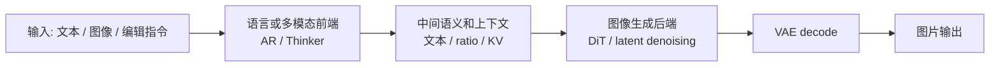
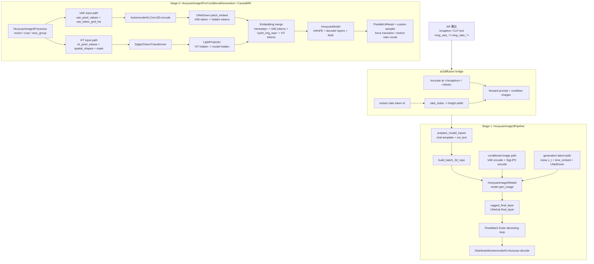
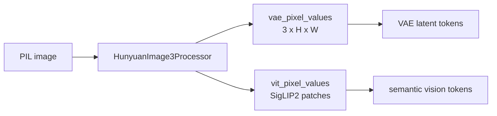
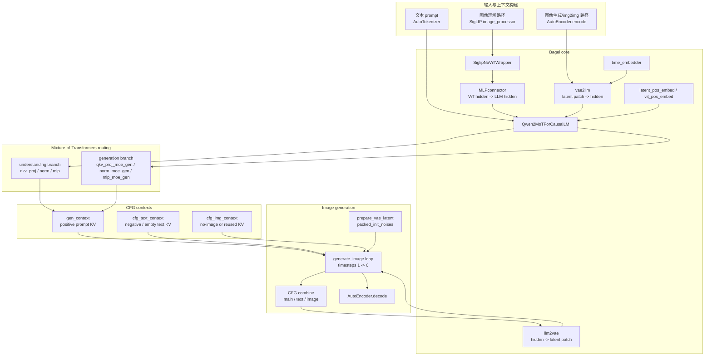
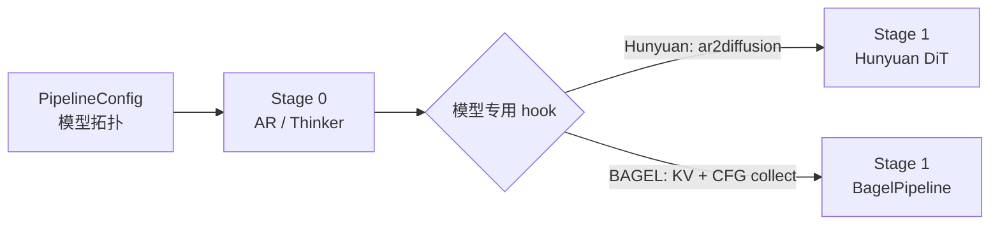

# vLLM-Omni Hunyuan-Image3.0 与 BAGEL 模型架构代码走读

> **文档版本**: 1.0  
> **分析代码版本**: 当前 workspace 本地 `vllm-omni` 源码  
> **最后更新**: 2026-06-01

---

## 文档概述

本文档分析 vLLM-Omni 中 **Hunyuan-Image3.0-Instruct** 与 **BAGEL-7B-MoT** 的模型内部架构。重点不是 connector、部署编排或 OpenAI API，而是模型自身如何把文本、图像、VAE latent、ViT token、AR/Thinker KV、DiT 去噪过程串起来。

**目标读者**: 希望理解 Hunyuan-Image3.0 / BAGEL 在 vLLM-Omni 中具体组件拆分和数据流的工程师。

**阅读指南**:

| 部分 | 内容 | 重点 |
|------|------|------|
| 第一部分 | 两个模型的共同范式 | 为什么都是 “AR/Thinker + DiT/VAE” |
| 第二部分 | Hunyuan-Image3.0 架构 | AR 侧图像编码、ratio token、DiT 侧条件图与 latent 去噪 |
| 第三部分 | BAGEL 架构 | Qwen2MoT、VAE token、ViT token、三路 CFG KV |
| 第四部分 | vLLM-Omni 承载层 | 只说明 PipelineConfig / bridge hook 怎样承载模型 |
| 第五部分 | 对比总结 | 新接类似模型时要关注哪些模型内部边界 |

---

# 第一部分: 共同范式

## 1.1 不是“prompt 直接进 diffusion”

Hunyuan-Image3.0 和 BAGEL 都不是一个单体 diffusion pipeline。它们都先用语言/多模态前端构造上下文，再把上下文交给图像生成后端：

| 模型 | 前端 | 后端 | 核心交接物 |
|------|------|------|------------|
| Hunyuan-Image3.0 | AR / CausalMM | HunyuanImage3 DiT | recaption/CoT 文本、ratio token、条件图、可选 AR KV |
| BAGEL | Thinker / Qwen2MoT | Bagel DiT-like generation loop | 主请求 KV、`cfg_text` KV、`cfg_img` KV |



vLLM-Omni 在这里做的是“承载”：把模型拆成 stage，负责请求、采样参数、KV/输出传递；真正的模型逻辑仍然在 Hunyuan 和 BAGEL 自己的组件里。

---

# 第二部分: Hunyuan-Image3.0 模型架构

## 2.1 Pipeline 拓扑

Hunyuan-Image3.0 的默认拓扑定义在：

```text
vllm_omni/model_executor/models/hunyuan_image3/pipeline.py
```

关键结构是两阶段：

```python
HUNYUAN_IMAGE3_PIPELINE = PipelineConfig(
    model_type="hunyuan_image_3_moe",
    model_arch="HunyuanImage3ForCausalMM",
    stages=(
        StagePipelineConfig(
            stage_id=0,
            model_stage="AR",
            execution_type=StageExecutionType.LLM_AR,
            final_output=False,
            engine_output_type="latent",
        ),
        StagePipelineConfig(
            stage_id=1,
            model_stage="dit",
            execution_type=StageExecutionType.DIFFUSION,
            input_sources=(0,),
            final_output=True,
            final_output_type="image",
            custom_process_input_func=(
                "vllm_omni.model_executor.stage_input_processors."
                "hunyuan_image3.ar2diffusion"
            ),
        ),
    ),
)
```

这里不要把 stage 0 理解成“只会产文本”。它内部也有 VAE、SigLIP2、投影层和 mRoPE，用于把输入图像编码进 AR 上下文。

## 2.2 Hunyuan 内部组件总览



## 2.3 AR stage: 图像输入如何变成 LLM token

源码入口：

```text
vllm_omni/model_executor/models/hunyuan_image3/hunyuan_image3.py
```

### 2.3.1 HunyuanImage3Processor

`HunyuanImage3Processor` 负责把输入图像拆成两套表示：

| 输出字段 | 用途 |
|----------|------|
| `vit_pixel_values` | 进入 SigLIP2 vision encoder |
| `vit_pixel_attention_mask` | SigLIP2 的 patch mask |
| `vit_spatial_shapes` | SigLIP2 patch 网格 |
| `vae_pixel_values` | 进入 VAE encoder，按图片扁平拼接 |
| `vae_pixel_size` | vLLM 按 size 还原 ragged VAE tensor |
| `vae_token_grid_hw` | 每张图 VAE token 网格，后续用于 mRoPE 和 token 替换 |

关键点：Hunyuan 同一张输入图会走 **VAE path** 和 **ViT path** 两路。



### 2.3.2 VAE path

AR stage 的模型类里显式创建了这些组件：

```python
self.vae = AutoencoderKLConv3D.from_config(config.vae)
self.patch_embed = UNetDown(
    patch_size=config.patch_size,
    emb_channels=config.hidden_size,
    in_channels=config.vae["latent_channels"],
    hidden_channels=config.patch_embed_hidden_dim,
    out_channels=config.hidden_size,
)
self.time_embed = TimestepEmbedder(hidden_size=config.hidden_size)
```

VAE path 的实际过程：

1. `AutoencoderKLConv3D.encode(images)` 得到 latent posterior。
2. 采样 latent，并应用 `shift_factor` / `scaling_factor`。
3. `UNetDown patch_embed(latents, time_embed(0))` 把 latent patch 投到 LLM hidden size。
4. 这些 embedding 替换 prompt 里的 `` 占位 token。

VAE path 提供更接近像素/空间结构的图像条件。

### 2.3.3 ViT path

ViT path 的组件：

```python
self.vision_model = Siglip2VisionTransformer(config.vit)
self.vision_aligner = LightProjector(config.vit_aligner)
```

过程：

1. `Siglip2VisionTransformer(pixel_values, attention_mask, spatial_shapes)` 得到 vision hidden states。
2. `LightProjector` 把 ViT hidden size 投到 Hunyuan hidden size。
3. 与 VAE tokens 一起组成一段 joint image token 序列。

在 `embed_multimodal()` 中，单张图的顺序是：

```text
<timestep>  VAE tokens  <joint_img_sep>  ViT tokens
```

`<timestep>` 的 embedding 不是普通词表 embedding，而是由 `TimestepEmbedder(0)` 动态替换。

### 2.3.4 mRoPE 与 image token 位置

Hunyuan 自定义了 `get_mrope_input_positions()`，把不同 token 映射到 3 维 mRoPE 位置：

| token 类型 | mRoPE 行为 |
|------------|------------|
| 文本 token | 三个维度都使用普通 1D position |
| `<timestep>` / 分隔符 | 按普通辅助 token 处理 |
| VAE image tokens | height / width 维度使用 2D 网格位置 |
| ViT image tokens | height / width 维度使用 2D 网格位置 |

这解释了为什么 `vae_token_grid_hw` 和 `vit_spatial_shapes` 都要从 processor 一直带到 model。

## 2.4 AR 输出: 强制阶段 token 与 ratio token

Hunyuan AR 的采样器不是普通 sampling。`sample()` 里有两类模型专用逻辑：

1. **stage transition forcing**：例如在 `</think>` 后强制进入 `<recaption>` / `<answer>` / `<boi>` 等结构。
2. **ratio restriction**：当上一个 token 是 `<img_size_1024>` 时，只允许输出 `<img_ratio_*>` token，并取 argmax。

简化逻辑：

```python
forced = self._get_forced_token(decoded_tokens)
if forced is not None:
    logits[req_idx].fill_(min_score)
    logits[req_idx, forced] = 0
elif last_token == self._size_token_id:
    self._apply_ratio_restriction(logits, req_idx, min_score)
elif last_token in self._all_ratio_ids:
    logits[req_idx].fill_(min_score)
    logits[req_idx, self._eos_token_id] = 0
```

这就是 Hunyuan 的特殊性：AR stage 不只生成自然语言，还生成给 DiT 使用的结构化控制 token。

## 2.5 ar2diffusion: AR 到 DiT 的模型语义桥

源码：

```text
vllm_omni/model_executor/stage_input_processors/hunyuan_image3.py
```

核心逻辑：

```python
ratio_idx = _extract_ratio_index(generated_token_ids)
if ratio_idx is not None:
    base_size = int(original_prompt.get("image_base_size", 1024))
    size_table = _build_ratio_size_table(base_size)
    if 0 <= ratio_idx < len(size_table):
        height, width = size_table[ratio_idx]

cot_text_for_dit = _truncate_at_cot_end(generated_text)

diffusion_input = {
    "prompt": text_prompt,
    "height": height,
    "width": width,
    "extra": {"ar_generated_text": cot_text_for_dit},
}
```

`ar2diffusion` 做了三件非常模型相关的事：

| 动作 | 目的 |
|------|------|
| 从 token id 解析 `<img_ratio_*>` | 得到 DiT 目标宽高 |
| 截断 `</recaption>` / `</think>` 后面的尾部 | 防止 `<answer><boi><img_size><img_ratio>` 泄漏进 DiT prompt |
| 转交原始 `multi_modal_data["image"]` | image editing / multi-image conditioning 需要原图 |

## 2.6 DiT stage: HunyuanImage3Pipeline

源码：

```text
vllm_omni/diffusion/models/hunyuan_image3/pipeline_hunyuan_image3.py
```

### 2.6.1 初始化组件

`HunyuanImage3Pipeline.__init__()` 中的核心组件：

| 组件 | 作用 |
|------|------|
| `HunyuanImage3Model` | DiT 主体，实际 forward 在 `mode="gen_image"` 下运行 |
| `DistributedAutoencoderKLHunyuan` | VAE decode，条件图也会用 VAE encode |
| `HunyuanImage3ImageProcessor` | 构造生成图和条件图的 image info |
| `Siglip2VisionTransformer` | 条件图语义编码 |
| `LightProjector` | ViT hidden → Hunyuan hidden |
| `UNetDown patch_embed` | 当前噪声 latent / 条件 VAE latent → token embedding |
| `UNetUp final_layer` | transformer hidden → latent patch prediction |
| `FlowMatchEulerDiscreteScheduler` | diffusion timestep 更新 |

### 2.6.2 forward 数据流

`forward()` 做的事：

```python
prompt = [p if isinstance(p, str) else (p.get("prompt") or "") for p in req.prompts]
cot_text_list = [
    (p.get("extra", {}).get("ar_generated_text") if isinstance(p, dict) else None)
    or None for p in req.prompts
]
height = req.sampling_params.height or height
width = req.sampling_params.width or width

model_inputs = self.prepare_model_inputs(
    prompt=prompt,
    cot_text=cot_text,
    system_prompt=system_prompt,
    mode="gen_image",
    image_size=(height, width),
    batch_cond_image_info=batch_cond_image_info,
)
outputs = self._generate(**model_inputs, **kwargs)
```

`prepare_model_inputs()` 是 DiT stage 的核心入口：

1. 根据 prompt / CoT / system prompt 应用 Hunyuan chat template。
2. 构建 `batch_gen_image_info`，决定生成图 token 网格。
3. 如果有条件图，调用 `_encode_cond_image()` 得到：
   - `cond_vae_images`
   - `cond_timestep`
   - `cond_vit_images`
4. 构建 2D RoPE。
5. 返回给 `_generate()` / diffusion loop 的模型输入。

### 2.6.3 forward_call: latent token 如何参与 transformer

`forward_call()` 里有两类图像 token：

| token 类型 | 来源 | 替换方式 |
|------------|------|----------|
| 生成图 token | 当前噪声 latent `x_t` | `patch_embed(images, time_embed(t))` |
| 条件图 VAE token | 条件图 VAE latent | `instantiate_vae_image_tokens()` |
| 条件图 ViT token | SigLIP2 + projector | `instantiate_vit_image_tokens()` |

简化过程：

```python
if first_step:
    inputs_embeds, token_h, token_w = self.instantiate_vae_image_tokens(
        inputs_embeds, images, timestep, image_mask
    )
else:
    t_emb = self.time_embed(timestep)
    image_emb, token_h, token_w = self.patch_embed(images, t_emb)
    timestep_emb = self.timestep_emb(timestep).reshape(bsz, -1, n_embd)
    inputs_embeds = torch.cat([timestep_emb, image_emb], dim=1)

if cond_vae_images is not None:
    inputs_embeds = self.instantiate_vae_image_tokens(...)
if cond_vit_images is not None:
    inputs_embeds = self.instantiate_vit_image_tokens(...)

outputs = self.model(..., inputs_embeds=inputs_embeds, mode="gen_image")
diffusion_prediction = self.ragged_final_layer(...)
```

最后 `ragged_final_layer()` 用 `UNetUp final_layer` 把 hidden states 转成 latent patch prediction。这个 prediction 进入 FlowMatch Euler step，反复更新 `x_t`，最后 VAE decode 成图。

---

# 第三部分: BAGEL 模型架构

## 3.1 Pipeline 拓扑

BAGEL 的默认拓扑定义在：

```text
vllm_omni/model_executor/models/bagel/pipeline.py
```

两阶段版本：

```python
BAGEL_PIPELINE = PipelineConfig(
    model_type="bagel",
    model_arch="OmniBagelForConditionalGeneration",
    stages=(
        StagePipelineConfig(
            stage_id=0,
            model_stage="thinker",
            execution_type=StageExecutionType.LLM_AR,
            prompt_expand_func="...bagel.expand_cfg_prompts",
            omni_kv_config={
                "need_send_cache": True,
                "kv_transfer_criteria": {"type": "prefill_finished"},
            },
        ),
        StagePipelineConfig(
            stage_id=1,
            model_stage="dit",
            execution_type=StageExecutionType.DIFFUSION,
            input_sources=(0,),
            cfg_kv_collect_func="...bagel.collect_cfg_kv_caches",
            omni_kv_config={"need_recv_cache": True},
        ),
    ),
)
```

BAGEL 还有 `bagel_single_stage`，把所有逻辑放在 diffusion stage 里。两阶段版本的主要意义是：Thinker 先构建 KV context，DiT stage 直接复用这些 KV 做图像生成。

## 3.2 BAGEL 内部组件总览



## 3.3 BAGEL 的 Thinker / AR stage

源码：

```text
vllm_omni/model_executor/models/bagel/bagel.py
```

### 3.3.1 OmniBagelProcessor

BAGEL 支持两类图像模态：

| 模态 | 含义 | 占位 |
|------|------|------|
| `image` | 多模态理解 / text2img prompt 中的图像输入 | `<|image_pad|>` |
| `img2img` | image editing 输入图 | `<|fim_middle|>` |

`OmniBagelMultiModalProcessor` 对 img2img 做了特殊处理：如果有 `img2img` 数据但 prompt 里没有 `<|fim_middle|>`，会自动补到 prompt 前面。

### 3.3.2 img2img 输入如何进入 Qwen2MoT

`OmniBagelForConditionalGeneration` 里有用于 img2img 的组件：

```python
self.vae = VAEEncoder(default_ae_params())
self.vae2llm = nn.Linear(patch_latent_dim, hidden_size)
self.latent_pos_embed = PositionEmbedding(self.max_latent_size, hidden_size)
self.time_embedder = TimestepEmbedder(hidden_size)
```

它会把输入图像变成：

```text
<vision_start> VAE latent tokens <vision_end> separator ViT tokens <vision_end>
```

其中 VAE latent token 会被标记成 `vae_mask`，后续走 MoT 的 generation 分支。

## 3.4 BAGEL 的 DiT / BagelPipeline

源码：

```text
vllm_omni/diffusion/models/bagel/pipeline_bagel.py
vllm_omni/diffusion/models/bagel/bagel_transformer.py
```

### 3.4.1 BagelPipeline 初始化组件

`BagelPipeline.__init__()` 中创建：

| 组件 | 作用 |
|------|------|
| `Qwen2MoTForCausalLM` | 主干，既处理理解 token，也处理生成 latent token |
| `AutoEncoder` | encode 输入图像 / decode 输出 latent |
| `SiglipVisionModel` + `SiglipNaViTWrapper` | 图像理解路径 |
| `Bagel` | 封装 `vae2llm`、`llm2vae`、pos embedding、denoise loop |

关键代码结构：

```python
self.language_model = Qwen2MoTForCausalLM(...)
self.transformer = self.language_model.model
self.vae = AutoEncoder(ae_params)
self.bagel = Bagel(
    language_model=self.language_model,
    vit_model=self.vit_model,
    config=BagelConfig(...),
)
```

## 3.5 Bagel core: 三条输入路径

### 3.5.1 文本路径

```python
def prepare_prompts(self, curr_kvlens, curr_rope, prompts, tokenizer, new_token_ids):
    text_ids = tokenizer.encode(prompt, add_special_tokens=False)
    text_ids = [bos_token_id] + text_ids + [eos_token_id]
    packed_text_position_ids.extend(range(curr_position_id, curr_position_id + len(text_ids)))
```

文本路径更新 KV：

```python
output = self.language_model.forward(
    packed_text_ids=packed_text_ids,
    query_lens=text_token_lens,
    packed_query_position_ids=packed_text_position_ids,
    past_key_values=past_key_values,
    update_past_key_values=True,
    is_causal=True,
    mode="und",
)
```

`mode="und"` 表示 understanding branch。

### 3.5.2 VAE 图像路径

`prepare_vae_images()` 先把图像变成 VAE latent 位置和 token index，`forward_cache_update_vae()` 再真正写 KV。

核心步骤：

```python
padded_latent = vae_model.encode(padded_images)
latent = latent[:, : h * p, : w * p].reshape(C, h, p, w, p)
packed_latent = torch.einsum("chpwq->hwpqc", latent)
packed_latent = packed_latent.reshape(-1, p * p * latent_channel)

packed_pos_embed = self.latent_pos_embed(packed_vae_position_ids)
packed_timestep_embeds = self.time_embedder(packed_timesteps)
packed_latent = self.vae2llm(packed_latent) + packed_timestep_embeds + packed_pos_embed
```

之后把 `packed_latent` 写入 packed sequence 的 VAE token 位置，并用 `mode="gen"` 更新 KV：

```python
output = self.language_model.forward(
    packed_query_sequence=packed_sequence,
    query_lens=packed_seqlens,
    packed_query_position_ids=packed_position_ids,
    past_key_values=past_key_values,
    update_past_key_values=True,
    is_causal=False,
    mode="gen",
    packed_vae_token_indexes=packed_vae_token_indexes,
)
```

### 3.5.3 ViT 图像路径

ViT path：

```python
packed_vit_token_embed = self.vit_model(
    packed_pixel_values=packed_vit_tokens,
    packed_flattened_position_ids=packed_vit_position_ids,
    cu_seqlens=cu_seqlens,
    max_seqlen=max_seqlen,
)
packed_vit_token_embed = self.connector(packed_vit_token_embed)
pos_emb = self.vit_pos_embed(packed_vit_position_ids)
packed_vit_token_embed = packed_vit_token_embed + pos_emb
```

ViT token 走 `mode="und"`，因为它是理解/条件 token，不是生成 latent token。

## 3.6 MoT: VAE token 走生成分支

BAGEL 的核心不是“有一个 LLM + 一个 diffusion”，而是 **同一个 Qwen2MoT decoder layer 对不同 token 使用不同参数分支**。

在 vLLM-Omni 的 `OmniBagelForConditionalGeneration._mot_layer_forward()` 中，逻辑非常直观：

```python
non_vae = ~vae_mask

if non_vae.any():
    normed[non_vae] = layer.input_layernorm(hidden_states[non_vae])
normed[vae_mask] = layer.input_layernorm_moe_gen(hidden_states[vae_mask])

hidden_states = self._mot_attn_forward(layer.self_attn, positions, hidden_states, vae_mask)

if non_vae.any():
    mlp_out[non_vae] = layer.mlp(hidden_states[non_vae])
mlp_out[vae_mask] = layer.mlp_moe_gen(hidden_states[vae_mask])
```

attention projection 也分开：

```python
if non_vae.any():
    qkv_und, _ = attn.qkv_proj(hidden_states[non_vae])
    qkv[non_vae] = qkv_und
qkv_gen, _ = attn.qkv_proj_moe_gen(hidden_states[vae_mask])
qkv[vae_mask] = qkv_gen
```

这就是 MoT 的直觉：

| token 类型 | 分支 | 作用 |
|------------|------|------|
| 文本 token | understanding | 语言理解 / 推理 |
| ViT token | understanding | 图像语义理解 |
| VAE latent token | generation | 图像生成 latent 预测 |

## 3.7 CFG: 三套 KV context 控制同一批 latent query

BAGEL 的 CFG 不只是 negative prompt 字符串，而是三套上下文：

| context | 来源 | 语义 |
|---------|------|------|
| `gen_context` | 主请求 KV | 正向 prompt / 图像条件 |
| `cfg_text_context` | `cfg_text` companion KV | text-unconditional 或 negative prompt |
| `cfg_img_context` | `cfg_img` companion KV 或复用主 KV | image-unconditional / no-image branch |

`BagelPipeline.forward()` 收到 KV 后：

```python
injected_kv = req.sampling_params.past_key_values
if injected_kv is not None:
    gen_context["past_key_values"] = injected_kv

cfg_text_kv = getattr(req.sampling_params, "cfg_text_past_key_values", None)
cfg_img_kv = getattr(req.sampling_params, "cfg_img_past_key_values", None)

if cfg_text_kv is not None:
    cfg_text_context["past_key_values"] = cfg_text_kv

if cfg_img_kv is None:
    cfg_img_context["past_key_values"] = injected_kv
else:
    cfg_img_context["past_key_values"] = cfg_img_kv
```

### 3.7.1 prompt expansion

源码：

```text
vllm_omni/model_executor/stage_input_processors/bagel.py
```

`expand_cfg_prompts()` 为 stage 0 创建 companion request：

| 场景 | companion request |
|------|-------------------|
| text2img + negative prompt | `cfg_text` |
| img2img | `cfg_text` + `cfg_img` |
| text2text / img2text | 无 |

### 3.7.2 collect_cfg_kv_caches

DiT stage 执行前会收集 companion KV：

```python
data, size = kv_transfer_manager.receive_kv_cache_for_request(companion_rid, target_device)
if data and "layer_blocks" in data:
    layer_blocks = data["layer_blocks"]
    kv_obj = SimpleNamespace(**layer_blocks)
    result[f"{role}_past_key_values"] = kv_obj
    result[f"{role}_kv_metadata"] = data["metadata"]
```

这些字段最后被挂到 `req.sampling_params`，供 `BagelPipeline.forward()` 使用。

## 3.8 generate_image: BAGEL 的 latent 去噪循环

`Bagel.generate_image()` 的输入包括：

| 参数 | 含义 |
|------|------|
| `packed_init_noises` | 初始噪声 latent token |
| `packed_vae_position_ids` | latent token 位置 |
| `packed_vae_token_indexes` | packed sequence 中 latent token 的位置 |
| `past_key_values` | 主分支 KV |
| `cfg_text_past_key_values` | text CFG 分支 KV |
| `cfg_img_past_key_values` | image CFG 分支 KV |

去噪循环简化：

```python
x_t = packed_init_noises
timesteps = torch.linspace(1, 0, num_timesteps)

for t in timesteps:
    v_t = self.forward(
        x_t=x_t,
        timestep=timestep,
        packed_vae_token_indexes=packed_vae_token_indexes,
        past_key_values=past_key_values,
        cfg_text_scale=cfg_text_scale_,
        cfg_img_scale=cfg_img_scale_,
        cfg_batched=cfg_batched,
    )
    x_t = x_t - v_t * dt
```

最后 `BagelPipeline._decode_image_from_latent()` 把 token 序列 reshape 回 latent feature map：

```python
latent = latent.reshape(1, h, w, p, p, c)
latent = torch.einsum("nhwpqc->nchpwq", latent)
latent = latent.reshape(1, c, h * p, w * p)
image = vae.decode(latent)
```

---

# 第四部分: vLLM-Omni 承载层

## 4.1 vLLM-Omni 在这里做什么

vLLM-Omni 的公共框架只需要理解成四个接口：

| 接口 | Hunyuan-Image3.0 | BAGEL |
|------|------------------|-------|
| `PipelineConfig` | 声明 `AR -> dit` | 声明 `thinker -> dit` |
| `custom_process_input_func` | `ar2diffusion` 把 AR 输出变成 DiT prompt | 不使用 |
| `prompt_expand_func` | 不使用 | 创建 CFG companion request |
| `cfg_kv_collect_func` | 不使用 | 收集 CFG companion KV |



## 4.2 为什么框架部分可以少讲

对理解模型来说，connector 只是载体：

- Hunyuan 的关键是 **AR 输出的 CoT/ratio 如何驱动 DiT**。
- BAGEL 的关键是 **Qwen2MoT 中 VAE latent token 如何走 generation branch，以及 CFG 为什么需要多套 KV**。
- vLLM-Omni 的 stage / connector / scheduler 只决定这些中间产物如何跨进程或跨 GPU 传过去，不改变模型内部计算。

---

# 第五部分: 对比总结

## 5.1 Hunyuan vs BAGEL

| 维度 | Hunyuan-Image3.0 | BAGEL |
|------|------------------|-------|
| 前端目标 | 生成 recaption / CoT / ratio token | 构建主分支与 CFG 分支 KV |
| 图像输入编码 | VAE latent tokens + SigLIP2 semantic tokens | VAE latent tokens + SigLIP ViT tokens |
| LLM / Transformer | HunyuanModel，mRoPE，MoE | Qwen2MoT，understanding/generation 双分支 |
| 图像生成控制 | AR 输出 `<img_ratio_*>` 决定目标尺寸 | CFG text/img scale 决定三路 context 组合 |
| latent 桥 | `UNetDown` / `UNetUp` | `vae2llm` / `llm2vae` |
| DiT 输入 | prompt + cot_text + 条件图 + 当前噪声 latent | 主 KV + cfg KV + 当前噪声 latent |
| 输出 | VAE decode image | VAE decode image |

## 5.2 新接类似模型时优先看什么

如果后续要分析或接入类似模型，建议优先回答以下问题：

1. 前端 stage 输出的是文本、token、hidden state，还是 KV？
2. 图像条件是 ViT token、VAE latent token，还是两者都有？
3. latent token 如何投到 transformer hidden size？
4. transformer 输出如何投回 latent patch？
5. 是否有模型专用 sampling 约束，例如 forced token、ratio token、特殊 stop token？
6. CFG 是字符串级 negative prompt，还是多路 KV context？
7. vLLM-Omni 需要的 hook 是 `custom_process_input_func`、`prompt_expand_func`、`cfg_kv_collect_func` 中的哪几个？

## 5.3 源码索引

| 模块 | 文件 |
|------|------|
| Hunyuan pipeline 拓扑 | `vllm_omni/model_executor/models/hunyuan_image3/pipeline.py` |
| Hunyuan AR 模型 | `vllm_omni/model_executor/models/hunyuan_image3/hunyuan_image3.py` |
| Hunyuan AR -> DiT bridge | `vllm_omni/model_executor/stage_input_processors/hunyuan_image3.py` |
| Hunyuan DiT pipeline | `vllm_omni/diffusion/models/hunyuan_image3/pipeline_hunyuan_image3.py` |
| Hunyuan DiT transformer | `vllm_omni/diffusion/models/hunyuan_image3/hunyuan_image3_transformer.py` |
| BAGEL pipeline 拓扑 | `vllm_omni/model_executor/models/bagel/pipeline.py` |
| BAGEL AR / Thinker 模型 | `vllm_omni/model_executor/models/bagel/bagel.py` |
| BAGEL stage processor | `vllm_omni/model_executor/stage_input_processors/bagel.py` |
| BAGEL DiT pipeline | `vllm_omni/diffusion/models/bagel/pipeline_bagel.py` |
| BAGEL MoT core | `vllm_omni/diffusion/models/bagel/bagel_transformer.py` |

