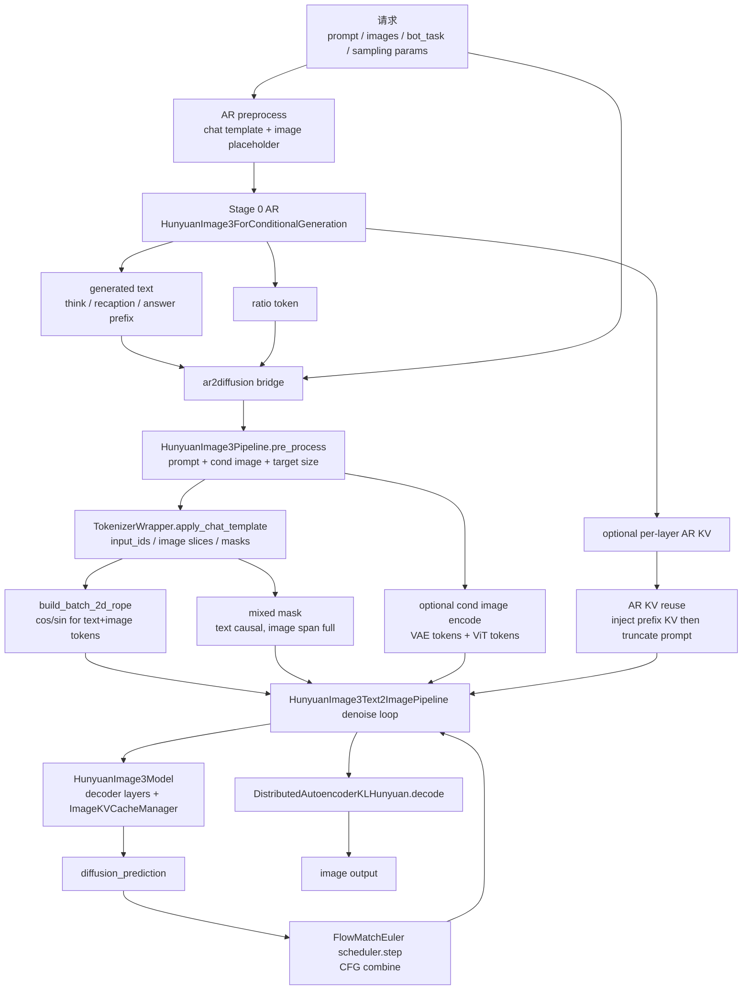
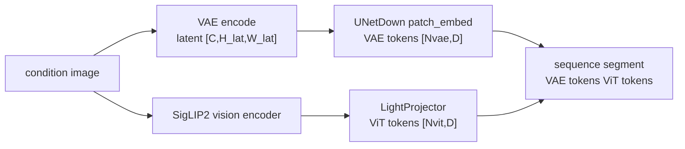
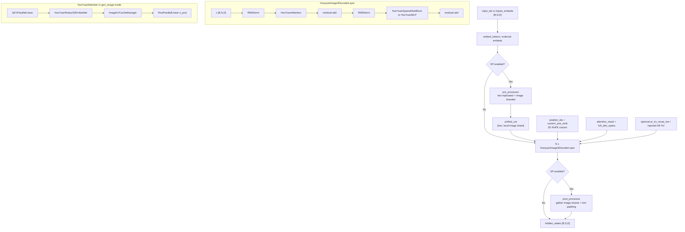

# vLLM-Omni Hunyuan Image3 模型结构与生产优化代码走读

> **文档版本**: 1.0  
> **分析代码版本**: 当前 workspace 本地 `vllm-omni` 源码  
> **最后更新**: 2026-06-07  
> **关联背景**: 本文按 git 历史梳理 Hunyuan Image3 相关生产优化；整体 AR/DiT/BAGEL 对比见 [`vllm_omni_hunyuan_bagel_arch.md`](vllm_omni_hunyuan_bagel_arch.md)

---

## 文档概述

本文按 **自顶向下** 的顺序梳理 vLLM-Omni 中 Hunyuan Image3 的模型结构：先看 AR stage、AR->DiT bridge、DiT pipeline 的整体数据流，再深入 `HunyuanImage3Pipeline`、`HunyuanImage3Model`、`HunyuanImage3DecoderLayer`、`HunYuanAttention`、`ImageKVCacheManager`、VAE/ViT 条件图路径和 AR sampler。

和 Wan2.2 不同，Hunyuan Image3 没有一个 issue 把优化项集中列出。本文直接从本地 git 历史抽取生产优化线索，包括 FlashAttention/piecewise attention、AR+DiT KV reuse、CFG parallel、VAE parallel、multi-image IT2I、prompt 对齐、sampler D2H sync、async token history、MoE/quant/NPU 兼容等，并在讲对应模块时顺带解释这些优化改在什么位置、为什么有效。

**目标读者**: 希望理解 Hunyuan Image3 在 vLLM-Omni 里如何从 AR token / 条件图 / ratio token 走到 DiT denoise，并能把关键性能和精度优化讲清楚的工程师。

**阅读指南**:

| 部分 | 内容 | 重点 |
|------|------|------|
| 第一部分 | 端到端大图 | AR stage、bridge、DiT stage、条件图、ratio token、KV reuse |
| 第二部分 | `HunyuanImage3Pipeline` | tokenizer、条件图编码、2D RoPE、attention mask、denoise loop |
| 第三部分 | `HunyuanImage3Model` | embedding、SP 切分、decoder layer loop、输出拆分 |
| 第四部分 | `HunYuanAttention` / `ImageKVCacheManager` | image attention 内部 QKV、2D RoPE、prompt KV cache、piecewise FA |
| 第五部分 | CFG / AR KV reuse / TeaCache | positive/negative 分支、负分支 prefill、prefix 截断、调度循环 |
| 第六部分 | VAE / ViT / 条件图 | T+I2I、多图编辑、VAE parallel、decode |
| 第七部分 | AR sampler 与 bridge | stage transition、ratio restriction、D2H sync、async token history |
| 第八部分 | git 优化映射 | 每个生产优化对应的 commit、模块和收益点 |
| 第九部分 | 工程总结 | 接类似 AR+DiT 图像模型时要守住的边界 |

---

# 第一部分: Hunyuan Image3 端到端大图

## 1.1 Pipeline 级数据流

Hunyuan Image3 的整体两阶段拓扑已经在 [`vllm_omni_hunyuan_bagel_arch.md`](vllm_omni_hunyuan_bagel_arch.md) 详细讲过。这里不重复特殊 token 表和任务模板，只保留和本文后续模块相关的主线：

| Stage | 代码 | 输入 | 输出 |
|-------|------|------|------|
| AR / CausalMM | [`model_executor/models/hunyuan_image3/hunyuan_image3.py`](../../vllm-omni/vllm_omni/model_executor/models/hunyuan_image3/hunyuan_image3.py) | prompt、可选条件图、`bot_task` | CoT/recaption 文本、`<img_ratio_*>`、可选 AR KV |
| AR->DiT bridge | [`stage_input_processors/hunyuan_image3.py`](../../vllm-omni/vllm_omni/model_executor/stage_input_processors/hunyuan_image3.py) | AR 输出、原始 prompt/mm data | DiT prompt、目标 `height/width`、条件图、采样参数 |
| DiT pipeline | [`diffusion/models/hunyuan_image3/pipeline_hunyuan_image3.py`](../../vllm-omni/vllm_omni/diffusion/models/hunyuan_image3/pipeline_hunyuan_image3.py) | DiT prompt、条件图、ratio size、AR KV | image latent denoise + VAE decode |
| DiT backbone | [`hunyuan_image3_transformer.py`](../../vllm-omni/vllm_omni/diffusion/models/hunyuan_image3/hunyuan_image3_transformer.py) | sequence embeddings、latent image tokens、attention mask | diffusion prediction |



这张图里最容易误解的是 DiT backbone：它不是 Wan2.2 那种显式的 self-attention + cross-attention block。Hunyuan Image3 把文本、条件图 token、生成图 latent token 都放进同一个序列里，再用 **混合 attention mask** 和 **图像 token 2D RoPE** 让图像段走 full attention、文本段保持 causal。也就是说，Hunyuan 的条件注入更像“带特殊 mask 的统一 decoder self-attention”，而不是单独的 cross-attention 层。

## 1.2 关键张量约定

后面统一用这些符号：

| 符号 | 含义 |
|------|------|
| `B` | 请求 batch size |
| `F` | CFG factor，`guidance_scale > 1` 时通常是 2 |
| `S` | tokenizer 后的完整序列长度，包含 text、条件图 token、生成图 token |
| `P` | 文本 / recaption / answer prefix 长度 |
| `I` | 当前 step 的生成图 token 长度 |
| `D` | hidden size；当前 config 是 4096 |
| `Hq` | query attention head 数；当前 config 是 32 |
| `Hkv` | key/value head 数；当前 config 是 8，所以 attention 是 4:1 GQA |
| `Dh` | head dim；当前 config 是 128 |
| `C` | VAE latent channel；当前 config 是 32 |
| `H_lat, W_lat` | latent 网格高宽 |

`HunyuanImage3Pipeline` 构造出来的 `input_ids` 通常是 `[B*F, S]`；进入模型后是 `inputs_embeds: [B*F, S, D]`。denoise loop 每个 timestep 会把当前 latent image tokens scatter 到 `<timestep> + [gen image tokens]` 位置，然后 forward 得到 `diffusion_prediction`，最后 scheduler 更新 latents。

### 1.2.1 `hunyuan_image_3_config.json` 速查

这份 JSON 里有几组值会直接影响后面的代码路径：

| 配置项 | 值 | 结构含义 |
|--------|----|----------|
| `num_hidden_layers` / `hidden_size` | 32 / 4096 | DiT/AR decoder 是 32 层、4096 hidden |
| `num_attention_heads` / `num_key_value_heads` / `attention_head_dim` | 32 / 8 / 128 | GQA，Q head 是 32，KV head 是 8，`repeat_kv` 扩到 Q head |
| `use_qk_norm` | `true` | Q/K 在进入 attention 前会做 per-head RMSNorm |
| `num_experts` / `moe_topk` | 64 / 每层 8 | 每层 MoE 从 64 个 routed experts 里选 top-8 |
| `use_mixed_mlp_moe` / `num_shared_expert` | `true` / 每层 1 | routed MoE 之外还有 shared MLP 分支 |
| `moe_layer_num_skipped` | 0 | 32 层全部进入 MoE 路径 |
| `rope_type` / `rope_theta` | `2d` / 10000 | 图像生成路径使用 2D RoPE |
| `cond_image_type` / `cond_token_attn_type` | `vae_vit` / `joint_full` | 条件图同时走 VAE token 和 ViT token，条件图 joint span 走 full attention |
| `vae.latent_channels` / `vae.ffactor_spatial` / `vae.scaling_factor` | 32 / 16 / 0.562679... | VAE latent channel、空间压缩比和 latent scale |
| `vit.hidden_size` / `vit.patch_size` / `vit.num_hidden_layers` | 1152 / 16 / 27 | SigLIP2 NaFlex vision encoder |
| `vit_processor.max_num_patches` | 1024 | ViT 侧 processor 的 patch 上限 |
| `vit_aligner.input_dim` / `vit_aligner.n_embed` / `vit_aligner.depth` | 1152 / 4096 / 2 | 2 层 MLP-GELU projector，把 ViT token 对齐到 decoder hidden size |

注意：这份 JSON 没显式写 `image_base_size`、`patch_size`、`patch_embed_hidden_dim`，它们来自 `HunyuanImage3Config` 默认值，分别是 `1024`、`1`、`1024`。因此默认 1024 图像的生成图 VAE token 网格是 `1024 / (vae_downsample_factor 16 * patch_size 1) = 64`，生成图段就是 `64*64=4096` 个 image tokens；再加 `<timestep>`，正好对应代码里 `ImageKVCacheManager(image_token_len=4097)` 的默认注释。

## 1.3 从 git 历史看优化主线

本地 git 历史里，Hunyuan Image3 的生产优化大致沿着五条线推进：

| 线索 | 典型 commit | 影响模块 |
|------|-------------|----------|
| attention 热区 | `857356d5` FlashAttention / piecewise attention，`efd95567` SP KV reuse | `ImageKVCacheManager`、attention backend、`full_attn_spans` |
| prefix 复用 | `5b61e7f1` AR+DiT KV reuse，`c33ef346` denoise flow alignment | `HunyuanImage3Text2ImagePipeline`、`ImageKVCacheManager` |
| 并行和量化 | `c3376a46` cfgP，`29179599` VAE parallel，`076c34ab` ModelOpt mixed FP8/NVFP4，`82128679` NPU FA-FP8 | CFG group、Distributed VAE、quant config、NPU ops |
| prompt/任务对齐 | `44cde33e` Instruct template，`0d91fbbb` AR/DiT formatting 对齐，`3f63aaf9` multi-image IT2I，`ffd9771c` stop token | prompt utils、bridge、serving_chat |
| sampler 和调度 | `2aafe0bf` sampler D2H sync，`f0af3ab2` async token history，`f7161b07` AR sampler batching | AR model sampler、GPU/NPU runner |

后文按模块解释这些优化，而不是按 commit 时间顺序展开。

---

# 第二部分: `HunyuanImage3Pipeline`

## 2.1 初始化组件

`HunyuanImage3Pipeline.__init__` 是 DiT stage 的入口。它同时持有 transformer、VAE、TokenizerWrapper、条件图 ViT、VAE token projector 和 final latent projector：

| 组件 | 代码 | 作用 |
|------|------|------|
| `self.model = HunyuanImage3Model(...)` | `hunyuan_image3_transformer.py` | DiT 主干，实际 decoder layers |
| `DistributedAutoencoderKLHunyuan` | `diffusion/distributed/autoencoders/autoencoder_kl_hunyuan.py` | VAE encode/decode，可走 parallel |
| `TokenizerWrapper` | `hunyuan_image3_tokenizer.py` | 构造 text/image/CFG token 序列和 slice 元信息 |
| `Siglip2VisionTransformer + LightProjector` | `siglip2.py` + transformer | 条件图 ViT token；config 是 SigLIP2 hidden 1152，经 2 层 MLP-GELU 对齐到 4096 |
| `UNetDown` / `UNetUp` | transformer 文件尾部 | VAE latent <-> hidden token；config 默认 `patch_size=1`、`patch_embed_hidden_dim=1024` |
| `FlowMatchEulerDiscreteScheduler` | diffusers scheduler | denoise step 更新 |

这和 Wan2.2 的组件拆分有一个关键差异：Wan2.2 的 T5/CLIP encoder 是显式条件 encoder，transformer block 里有 cross-attention；Hunyuan Image3 的 DiT pipeline 更像把所有条件“序列化”成同一个 decoder 输入，之后用 mask 和 KV 管理实现条件访问。

## 2.2 `pre_process`: 从 prompt 到模型输入

`pre_process` 的主流程在 [`pipeline_hunyuan_image3.py`](../../vllm-omni/vllm_omni/diffusion/models/hunyuan_image3/pipeline_hunyuan_image3.py)：

1. 解析 `prompt` / `batch_message_list` / `image_size` / `guidance_scale`。
2. 如果是 `gen_image`，通过 `image_processor.build_image_info(image_size)` 构造生成图 token 网格。
3. 如果有条件图，先构造 `batch_cond_image_info`，再走 `_encode_cond_image()`。
4. 调 `TokenizerWrapper.apply_chat_template()` 生成 `input_ids`、`joint_image_slices`、`gen_image_slices`、`cond_*_mask`、`gen_timestep_scatter_index` 等元信息。
5. 调 `build_batch_2d_rope()`，为 text + image token 统一生成 2D RoPE cache。
6. 根据 `bot_task` 和 `image_size` 设置 `eos_token_id` / `max_new_tokens`。

这里有两类生产修复都和 prompt 对齐有关：

- `44cde33e` 把 offline AR 路径切到 Instruct chat template，避免 AR 输出乱码。
- `0d91fbbb` 对齐 AR 和 DiT 的 prompt formatting，避免 online/offline 或 AR/DiT 两侧对同一段 CoT / system prompt 的解析不一致。

这类问题表面看是“模板字符串”，实质是 DiT attention 序列的 token 边界变了。边界一变，`joint_image_slices`、`gen_timestep_scatter_index`、`full_attn_spans` 和 KV reuse 长度都会跟着变。

## 2.3 条件图编码: VAE token + ViT token

T+I2I / image editing 模式下，条件图不是只作为外部 image embedding 注入，而是被拆成两条路径：



`_encode_cond_image()` 会先逐图调用 `vae_encode()`，再保留 ViT 输入所需的 `spatial_shapes` 和 `attention_mask`。config 明确写了 `cond_image_type="vae_vit"`，所以这两路条件图 token 都是主路径，不是可选实验分支。

multi-image IT2I (`3f63aaf9`) 的复杂点在这里：每个请求可能有多张图，每张图的 VAE token 网格可以不同，所以 `cond_vae_images` 既可能是一个 dense tensor，也可能是 ragged list。后续 `instantiate_vae_image_tokens()` 必须同时支持：

- `[B, C, H, W]` 的单图同形 batch；
- `list[Tensor]` 的 batch 级 ragged；
- `list[list[Tensor]]` 的多图 ragged。

## 2.4 混合 attention mask 与 `full_attn_spans`

Hunyuan Image3 的 attention mask 由 `_prepare_attention_mask_for_generation()` 构造。逻辑很直接：

```text
attention_mask = lower_triangular causal mask
for each image_slice in joint_image_slices + gen_image_slices:
    attention_mask[image_slice, image_slice] = True
    full_attn_spans.append((image_slice.start, image_slice.stop))
```

也就是：

| token 区域 | attention 行为 |
|------------|----------------|
| text / CoT / recaption | causal |
| 条件图 VAE+ViT token 段 | 段内 full attention |
| 生成图 latent token 段 | 段内 full attention |
| text 到历史 token | causal 可见 |
| image 段到段外 | 仍受整体 causal 方向约束 |

这和 config 里的 `cond_token_attn_type="joint_full"` 对齐：条件图的 VAE token、`<joint_img_sep>`、ViT token 属于同一个 joint image span，span 内 full attention，而不是 VAE 和 ViT 各自独立 full。

`857356d5` 的 FlashAttention 支持就是围绕这个结构做的。普通 FA 适合纯 causal 或纯 full；Hunyuan 的 mask 是 piecewise full + causal 混合，所以 pipeline 在构造 4D mask 的同时额外保存 `full_attn_spans`，attention backend 可以用 span 信息走 piecewise attention，而不是被迫回退到 TORCH SDPA。

---

# 第三部分: `HunyuanImage3Model`

## 3.1 模块图: 到 ImageKVCacheManager 粒度

`HunyuanImage3Model` 是 DiT stage 的 transformer 主体。当前 config 是 32 层、4096 hidden、32 个 Q heads、8 个 KV heads、head dim 128。用 Wan2.2 文档里的粒度类比，Hunyuan 的“CrossAttention 粒度模块”应当画到 `ImageKVCacheManager`，因为它承载了条件图 / 生成图序列内部的 attention 语义。



## 3.2 Decoder layer 内部

`HunyuanImage3DecoderLayer.forward()` 是标准 decoder residual 结构：

```text
residual = x
x = input_layernorm(x)
x = self_attn(x, mode=..., custom_pos_emb=..., full_attn_spans=...)
x = residual + x

residual = x
x = post_attention_layernorm(x)
x = mlp(x)
x = residual + x
```

MLP 侧根据配置选择 `HunYuanSparseMoeBlock` 或 `HunYuanMLP`。这份 config 里 `num_experts=64`、`moe_topk` 每层都是 8、`moe_intermediate_size` 每层都是 3072、`moe_layer_num_skipped=0`，所以 32 层都会走 MoE。`use_mixed_mlp_moe=true` 且 `num_shared_expert` 每层是 1，表示 routed experts 外还有一条 shared MLP 分支；代码里就是 `HunYuanSparseMoeBlock.__init__()` 先建 `self.shared_mlp`，再把它传进 `HunyuanFusedMoE(shared_experts=...)`。

Hunyuan Image3 MoE 的生产问题集中在两点：

- MoE routing 精度：当前 AR 模型里 `_patch_moe_blocks()` 会把 stock `HunYuanSparseMoeBlock` 替换为 Hunyuan 专用 block，使 router gate 以 fp32 方式匹配 HF reference。
- fused MoE runtime：`hunyuan_fused_moe.py` 通过 platform qualname 解析不同平台实现，并在 forward 前设置 `ForwardContext.num_tokens`，这是 vLLM 0.18 以后 fused MoE 路径正确路由所需的上下文。

`369a47d5`、`779bf311`、`82128679`、`076c34ab` 这类精度/兼容/量化 commit 都落在这一带：它们不是改变模型数学结构，而是让 fused MoE、topk unpack、FA-FP8、ModelOpt quant 的实际 kernel 行为对齐训练/参考实现。

## 3.3 `HunYuanAttention`: 文本生成和图像生成两种路径

`HunYuanAttention.forward()` 先做 fused QKV projection。按当前 config，单 token 的 Q/K/V 维度是：

```text
q: 32 heads * 128 = 4096
k:  8 heads * 128 = 1024
v:  8 heads * 128 = 1024
```

```text
hidden_states [B,S,D]
  -> reshape [B*S,D]
  -> qkv_proj
  -> q [B,S,Hh*Dh], k/v [B,S,Hkv*Dh]
```

然后按 `mode` 分叉：

| `mode` | RoPE | Attention |
|--------|------|-----------|
| `gen_text` | vLLM 常规 rotary | `self.attn(q,k,v)` |
| `gen_image` | `HunYuanRotary2DEmbedder` | `self.image_attn(q,k,v, attention_mask, ...)` |

因为 `num_key_value_heads=8` 小于 `num_attention_heads=32`，`ImageKVCacheManager` 里会先算 `repeat_num = 32 / 8 = 4`，再用 `repeat_kv()` 把 K/V 扩到 query head 数。又因为 `use_qk_norm=true`，Q/K 在进入 attention 前还会经过 per-head RMSNorm；这也是量化和精度修复时需要注意的边界。

这就是 Hunyuan Image3 的核心结构差异。`gen_image` 时 attention 不再是普通 causal decoder attention，而是进入 `ImageKVCacheManager`，它会：

1. 把 `[B*S, H, Dh]` 的 Q/K/V reshape 成 `[B, S, H, Dh]`。
2. 首个 denoise step 缓存 prompt KV。
3. 后续 denoise step 复用 prompt KV，只计算当前 image token 的 K/V。
4. 在 SP 场景下把 text/prefix KV 作为 `joint_text` 传给 attention backend，image shard 本地计算。
5. 把 `full_attn_spans` 放进 `AttentionMetadata`，供 piecewise attention backend 使用。

## 3.4 Sequence Parallel 路径

`HunyuanImage3Model.forward()` 在 `sp_world_size > 1` 时会先调用 `pre_processor()`：

```text
text_hidden_states: 复制在每个 SP rank
image_hidden_states: 按 sequence 维切 shard
position_ids / custom_pos_emb: 同步切分
attention_mask: 为 shard padding 扩展 Q/K 维
```

这样做的原因是：文本 prefix 很短但对所有图像 token 都可见，复制 text 比在每层 attention 里跨 rank 访问 text 更简单；图像 token 长，是 SP 切分真正要省的部分。

`efd95567` 修的是 KV reuse 在 SP 场景下的兼容性。非 SP 可以直接 `cat([cached_prompt_kv, current_image_kv])`；SP 下每个 rank 只持有 image shard，如果直接 cat 会让 text prefix 在 shard 维度上被重复计入。因此 `ImageKVCacheManager` 在 SP 下返回 cached prompt KV 作为 `joint_text_key/value`，本地 `key/value` 只保留 image shard。

---

# 第四部分: `ImageKVCacheManager` 内部怎么走

## 4.1 输入输出

`ImageKVCacheManager.__call__()` 接收的是已经做完 projection 和 2D RoPE 的 Q/K/V：

| 输入 | shape | 含义 |
|------|-------|------|
| `query` | `[B*Q, Hh, Dh]` | 当前 query token |
| `key` / `value` | `[B*Q, Hkv, Dh]` | 当前 step 计算出的 K/V |
| `attention_mask` | `[B, 1, Q, K]` | 混合 causal/full mask |
| `query_lens` / `seq_lens` | `list[int]` | 当前 query 长度和完整可见序列长度 |
| `gen_timestep_scatter_index` | `[B, ?]` | 生成图 `<timestep>` token 位置 |
| `full_attn_spans` | `list[list[(start, stop)]]` | image span，用于 piecewise attention |

输出是 `[B*Q, Hh, Dh]`，再交给 `o_proj` 回到 `[B,Q,D]`。

默认 1024 输出图下，生成图 VAE token 网格是 `64x64`，因此常见生成图段是 4096 个 latent tokens；代码里 `ImageKVCacheManager` 初始化的 `image_token_len=4097` 包含这 4096 个 image tokens 和前面的 `<timestep>` token。多比例输出时，真实长度由 `num_image_tokens` 覆盖，不依赖这个默认值。

## 4.2 首步: 缓存 prompt KV

首个 denoise step 的输入仍包含完整 prefix + image token。`_cache_prompt_kv()` 会先处理可能注入的 AR KV：

```text
if ar_kv_len > 0:
    key = concat(ar_key, current_key)
    value = concat(ar_value, current_value)

cached_prompt_lens = gen_timestep_scatter_index[:, -1] + ar_kv_len
cached_key/value = key/value[:, :cached_prompt_lens]
```

也就是说，缓存的不是固定长度 prefix，而是每个样本从序列开头到“当前生成图 timestep token”之前的部分。这个位置由 tokenizer 输出的 `gen_timestep_scatter_index` 决定，因此 prompt 对齐和 ratio/CoT 截断都会影响 KV reuse 是否正确。config 默认 `image_base_size=1024` 来自配置类，不是 JSON 明文字段；AR 采样出的 `<img_ratio_*>` 只改变 `(height,width)` bucket，从而改变这段 image token 网格。

## 4.3 后续 step: 只算 image token，复用 prompt KV

非首步时，当前 forward 主要更新生成图 latent token，prompt 部分不变。非 SP 路径直接：

```text
new_key   = concat(cached_prompt_key, current_image_key)
new_value = concat(cached_prompt_value, current_image_value)
```

SP 路径则不同：

```text
joint_text_key/value = cached_prompt_key/value
key/value = current local image shard key/value
AttentionMetadata(joint_strategy="front")
```

这就是 `5b61e7f1` AR+DiT KV reuse 和 `efd95567` SP compatibility 的核心收益：把每个 denoise step 都重复计算的一大段 prompt/CoT/条件图 prefix，变成首步缓存和后续拼接。对 Hunyuan Image3 这种“prompt + 条件图 + 生成图都在同一 decoder 序列”模型，prefix KV reuse 的收益比普通 text-to-image cross-attention 更直接。

## 4.4 为什么需要 piecewise attention

Hunyuan Image3 attention mask 不是纯 causal：

```text
text prefix: causal
image span: full
span outside: follows causal direction
```

如果把这个 4D mask 原样交给通用 SDPA，可以保证正确但吞吐差。`857356d5` 加入的 piecewise attention 思路是：保留 causal 主体，同时把 `full_attn_spans` 显式传给 backend，让 backend 对这些 image span 做局部 full attention。这样避免为整个 `[S,S]` mask 付通用 mask attention 的代价。

这里的工程约束是：`full_attn_spans` 必须在 CFG split 之前按完整 batch 构造，之后再随 CFG rank 切分。否则 positive / negative 分支的 span index 会错位。

---

# 第五部分: CFG、AR KV reuse 与 denoise loop

## 5.1 CFG 在 pipeline 层处理

Hunyuan Image3 的 CFG 不在 decoder layer 内判断，而是在 `HunyuanImage3Text2ImagePipeline.__call__()` 的 denoise loop 中处理：

```text
cfg_parallel_ready = do_classifier_free_guidance
                     and cfg_world_size == 2

if cfg_parallel_ready:
    rank 0: conditioned branch
    rank 1: unconditioned branch
    all_gather(pred_cond, pred_uncond)
else:
    latent_model_input = cat([latents] * cfg_factor)
    pred_cond, pred_uncond = pred.chunk(2)

pred = pred_uncond + guidance_scale * (pred_cond - pred_uncond)
latents = scheduler.step(pred, t, latents)
```

`c3376a46` 的 cfgP 优化点就在这里：CFG 的正负分支天然独立，使用两个 rank 并行可以把每步 batch-doubled forward 变成两边各跑一半，再 all-gather 做 guidance combine。

## 5.2 CFG split 为什么要晚于 attention mask

`__call__()` 里先对完整 `[B*F, S]` 构造 attention mask，再做 CFG split：

```text
attention_mask = _prepare_attention_mask_for_generation(input_ids, ...)
if cfg_parallel_ready:
    input_ids = input_ids[s]
    attention_mask = attention_mask[s]
    _split_model_kwargs_for_cfg_parallel(model_kwargs, ...)
```

原因是 `TokenizerWrapper` 产出的 `joint_image_slices`、`gen_image_slices`、`cond_*_mask`、`full_attn_spans` 都是按 batch-doubled 序列组织的。如果先切分再构造 mask，CFG rank 内的 batch index 和原始 tokenizer metadata 容易不一致。

## 5.3 负分支 prefill

AR KV reuse 对 positive 分支比较直接：AR stage 已经生成过正分支 prefix，可以把 per-layer K/V 注入 DiT。negative CFG 分支不是 AR 直接输出的，所以 Hunyuan Image3 需要 `_maybe_run_negative_cfg_prefill()`：

1. `_get_kv_reuse_len()` 从 tokenizer metadata 找 positive reuse len 和 negative reuse len。
2. `inject_ar_kv_into_layers()` 注入 positive AR KV。
3. 如果启用 CFG，构造 negative prefill inputs，只 forward negative 分支缺的那段 prefix。
4. `_build_neg_ar_kv()` 把 shared prefix 的 positive KV 和 negative prefill KV 组合成 negative KV。
5. `_truncate_reused_prefix()` 从后续 denoise 输入里删掉已复用的 prefix。

这段逻辑解释了为什么 Hunyuan 的 KV reuse 比“缓存一段 text encoder 输出”复杂：正负 CFG 分支、CoT 截断位置、条件图 token、生成图 timestep token 都会影响 reuse 边界。

## 5.4 TeaCache

denoise loop 里还有 TeaCache 快路径：根据 timestep embedding 的相对变化累积距离，如果低于阈值，就复用上一轮 `pred`，跳过当前 step 的 transformer forward。

```text
cur_mod = time_embed(t)
rel_dist = mean(abs(cur_mod - prev_mod)) / mean(abs(prev_mod))
if accumulated_rescaled_dist < threshold:
    pred = prev_pred
else:
    pred = model.forward(...)
```

这类优化和 KV reuse 不冲突：KV reuse 减少每次 forward 的 prefix 重算；TeaCache 减少部分 timestep 的整个 transformer forward。

---

# 第六部分: VAE / ViT / 条件图和输出

## 6.1 VAE encode 的精度边界

config 里 VAE 是 `AutoencoderKLConv3D`，`latent_channels=32`，空间压缩因子 `ffactor_spatial=16`，temporal factor 是 4，`scaling_factor=0.562679178327931`。虽然 Hunyuan Image3 是图像模型，VAE 仍然沿用 3D VAE 结构，所以代码里会处理可能出现的 temporal 维。

条件图 VAE encode 路径里，当前代码在 VAE 边界才把 pixel tensor cast 到 VAE dtype，并使用固定 seed 的 generator 采样 posterior。config 里的官方约束是 `vae_dtype=float32`、`vae_autocast_dtype=float16`；vLLM-Omni 路径在保持 fp32 preprocess 的同时，把 cast 放到 VAE forward 边界。这个细节是为了减少和 HF reference 的漂移：

- pixel preprocess 保持 fp32，避免提前 bf16 cast 带来系统性量化误差；
- posterior sampling 使用 `manual_seed(0)`，避免在线服务长期运行时消耗全局 RNG 造成请求间漂移。

这些看起来不是性能优化，但对 Hunyuan Image3 这类 image editing 模型很关键：条件图 latent 的微小差异会被后续 DiT denoise 放大成可见图像差异。

## 6.2 VAE parallel

`29179599` 引入 `DistributedAutoencoderKLHunyuan`，让 Hunyuan Image3 的 VAE encode/decode 可以进入分布式 autoencoder 路径。pipeline 初始化时：

```text
self.vae = DistributedAutoencoderKLHunyuan.from_config(...)
self.vae.use_spatial_tiling = od_config.vae_use_tiling
```

VAE parallel 的收益点和 transformer SP 不一样：

| 模块 | 并行维度 | 主要收益 |
|------|----------|----------|
| transformer SP | image token sequence 维 | 降低 DiT attention/MLP 单 rank token 量 |
| VAE parallel | image patch / spatial 维 | 降低 VAE decode/encode 峰值显存和大图耗时 |

如果只优化 transformer，最终大图生成仍可能卡在 VAE decode；这也是 Wan2.2 和 Hunyuan Image3 都需要 VAE parallel 的原因。

## 6.3 ViT 条件图路径

config 里的 ViT 是 `siglip2-so400m-patch16-naflex`：27 层、hidden 1152、16 heads、patch size 16。`vit_processor.max_num_patches=1024` 控制预处理后的 patch 上限；`vit_aligner` 是深度 2 的 `mlp_gelu` projector，把 1152 维 ViT token 映射到 4096 维 decoder hidden。

这解释了为什么条件图路径要同时保留 `spatial_shapes` 和 `attention_mask`：SigLIP2 NaFlex 输入不是固定 224x224 单一网格，而是由 processor 产生可变 patch 网格；后续 2D RoPE 和 image span 都要跟这个 token 网格对齐。

## 6.4 输出 decode

denoise 完成后，pipeline 会把 latents 反向处理：

```text
latents = latents / scaling_factor
latents = latents + shift_factor
image = vae.decode(latents)
postprocess image
```

如果 VAE 有 temporal factor，代码还会补 temporal 维度。Hunyuan Image3 是 image 模型，但复用 3D VAE 结构，因此这类维度处理不能随意删。

---

# 第七部分: AR sampler 与 AR->DiT bridge

## 7.1 AR sampler 做的三件事

AR stage 的 `HunyuanImage3ForConditionalGeneration.sample()` 仍然是模型自定义 sampler。它做三类 logits 改写：

| 模式 | 触发 | 行为 |
|------|------|------|
| comprehension | I2T/T2T | batched `index_fill_` 屏蔽 `<boi>`、ratio 等图像生成 token |
| generation | `</think>` / `</recaption>` 后 | 强制 `<recaption>` 或 `<answer><boi><img_size_*>` |
| generation | `<img_size_*>` 后 | 只允许 `<img_ratio_*>`，并取 argmax |
| generation | `<img_ratio_*>` 后 | 强制 EOS |

`2aafe0bf` 的 D2H sync 优化落在 comprehension 分支：固定 blocked token 不需要读 `sampling_metadata.output_token_ids`，所以可以用一个 GPU tensor 做 `index_fill_`，跳过读取 CPU 侧 output token history。这避免了 async scheduling 下不必要的 D2H sync。

generation 分支则必须读历史 token，因为 stage transition 和 ratio restriction 都依赖 last token。`f0af3ab2` 修的是 prefer_model_sampler 在 async scheduling 下的 token history：当 output token 还在异步 D2H copy 里，sampler 不能只看到 `-1` placeholder，否则 `</think> -> <recaption>` 这类强制跳转会失效。

## 7.2 为什么 ratio token 是 bridge 的 source of truth

`ar2diffusion()` 会优先从 AR 输出的 `cumulative_token_ids` 反向扫描 `<img_ratio_*>`，再查 `_build_ratio_size_table(base_size)` 得到 `(height, width)`。

这比从 generated text 里 regex 特殊 token 可靠，原因是 online serving 常用 `skip_special_tokens=True`，文本里可能已经没有 `<img_ratio_*>`，但 token ids 仍然完整保存在 `cumulative_token_ids`。

`3f63aaf9` 的 multi-image IT2I 修复也依赖这个点：如果不读 AR ratio，而是沿用 serving 层传下来的 `height/width`，多图或非方图编辑很容易退回第一张参考图的尺寸 bucket。

## 7.3 bridge 还要转发什么

`ar2diffusion()` 不只是拼 prompt，还会转发：

- `use_system_prompt` 和 `system_prompt`，保证 DiT 侧 system prefix 和 AR 一致；
- `multi_modal_data["image"]`，让 DiT stage 能重新读取条件图；
- `seed`、`num_inference_steps`、`guidance_scale`、`negative_prompt`；
- `extra["ar_generated_text"]`，作为 DiT 的 CoT/recaption 文本输入。

这也是 prompt 对齐类 bug 难排的原因：AR 输出文本、原始 prompt、ratio token、条件图、system prompt 分散在不同字段里，任何一个字段漏转发都会让 DiT 输入和 AR 语义脱节。

---

# 第八部分: 生产优化映射

下面按模块把 git 历史里的优化串起来。

## 8.1 Attention: FlashAttention / piecewise attention

| Commit | 内容 | 模块 |
|--------|------|------|
| `857356d5` (2026-05-10) | HunyuanImage 支持 FlashAttention，新增 piecewise attention 测试和 backend utils | `ImageKVCacheManager`、attention backend、`pipeline_hunyuan_image3.py` |
| `82128679` (2026-05-19) | NPU 上支持 Hunyuan Image3 DiT FA-FP8 | transformer attention / NPU diffusion op |

核心点是 Hunyuan mask 的特殊性：不能简单把整段当 causal，也不能整段 full。`full_attn_spans` 是把模型结构信息传给 attention backend 的桥。

## 8.2 KV reuse: AR prefix 和 DiT prompt prefix

| Commit | 内容 | 模块 |
|--------|------|------|
| `5b61e7f1` (2026-05-08) | AR + DiT KV reuse | `ImageKVCacheManager`、`_maybe_handle_ar_kv_reuse()` |
| `efd95567` (2026-05-13) | 修复 KV reuse 在 SP 场景下的兼容性 | SP pre/post processor、joint text attention |
| `c33ef346` (2026-05-27) | 修复 Hunyuan Image3 denoise flow alignment | KV cache manager、pipeline flow、prompt utils |

KV reuse 的正确性依赖三个边界：

1. AR 输出和 DiT prompt 的 token 序列必须一致到可复用 prefix。
2. `gen_timestep_scatter_index` 必须指向生成图 token 的真实起点。
3. SP 场景下 prompt KV 不能被当作每个 image shard 的本地 K/V 重复拼接。

## 8.3 CFG parallel 与 negative prefill

| Commit | 内容 | 模块 |
|--------|------|------|
| `c3376a46` (2026-04-01) | Hunyuan Image3 增加 cfgP | `HunyuanImage3Text2ImagePipeline.__call__()` |

CFG parallel 的收益来自正负分支并行，但工程上必须补齐 negative branch 的 KV。Hunyuan Image3 的 `_maybe_run_negative_cfg_prefill()` 是这个优化能和 AR KV reuse 共存的关键。

## 8.4 VAE parallel

| Commit | 内容 | 模块 |
|--------|------|------|
| `29179599` (2026-05-20) | Enable VAE parallel in HunyuanImage3 | `DistributedAutoencoderKLHunyuan`、pipeline VAE 初始化 |

VAE parallel 主要改善大图或高并发下的 VAE encode/decode 显存和耗时。它不改变 DiT 结构，但会影响端到端延迟，所以生产优化文章必须和 transformer 优化一起讲。

## 8.5 Prompt / IT2I / multi-image 对齐

| Commit | 内容 | 模块 |
|--------|------|------|
| `576afb6f` (2026-05-06) | HunyuanImage3 IT2I support | DiT pipeline、stage config、bridge |
| `44cde33e` (2026-05-06) | offline AR 改用 Instruct chat template | AR model、prompt utils |
| `0d91fbbb` (2026-05-12) | AR 和 DiT prompt formatting 对齐 | prompt utils、serving_chat |
| `16a84b29` (2026-05-13) | 增加 `think_recaption` bot_task | prompt utils |
| `3f63aaf9` (2026-05-14) | multi-image IT2I 和 prompt API cleanup | pipeline、bridge、OpenAI serving |
| `ffd9771c` (2026-05-31) | 修复 Hunyuan stop token ids 解析 | prompt utils、serving_chat |

这些优化看似分散，但本质都是保证 “AR 看到的序列” 和 “DiT 重建的序列” 一致。Hunyuan Image3 的 AR/DiT 分段部署让 prompt 对齐变成生产稳定性的核心问题。

## 8.6 Sampler / async scheduling

| Commit | 内容 | 模块 |
|--------|------|------|
| `2aafe0bf` (2026-05-20) | 优化 HY-Image sampler D2H sync | AR model sampler |
| `f0af3ab2` (2026-05-22) | 修复 async scheduling 下 prefer_model_sampler token history | GPU AR runner |
| `f7161b07` (2026-05-14) | 允许 HunyuanImage3 AR sampler batching | AR sampler |

这里的判断标准很明确：

- 固定 token mask 不读历史 token，应该避免 D2H sync。
- stage transition / ratio restriction 读历史 token，必须拿到真实 token，不能读 async placeholder。
- batch 内每个请求可能处在不同 AR 阶段，sampler 不能假设 batch size 为 1。

## 8.7 MoE / quant / graph / platform

| Commit | 内容 | 模块 |
|--------|------|------|
| `369a47d5` (2026-05-06) | Hunyuan Image3 accuracy fix | MoE / pipeline 精度细节 |
| `4e880537` (2026-05-17) | 设置 MRoPE dynamic_arg_dims，使 graph mode 可编译 | AR model mRoPE |
| `779bf311` (2026-05-15) | 修复 packed topk 在 vLLM / vLLM Ascend 间兼容 | AR MoE unpack |
| `076c34ab` (2026-05-21) | ModelOpt mixed FP8/NVFP4 support for image generation | quant config / transformer |

Hunyuan Image3 是 MoE 模型，且 AR 和 DiT 都有 Hunyuan 专用路径。生产上不能只看 PyTorch module 结构，还要确认 fused MoE、quant loader、platform op qualname、graph dynamic dims 这些 runtime 约束都成立。

---

# 第九部分: 工程总结

## 9.1 Hunyuan Image3 和 Wan2.2 的结构差异

| 维度 | Wan2.2 | Hunyuan Image3 |
|------|--------|----------------|
| 条件文本 | T5 encoder 输出，作为 cross-attn context | AR/Tokenizer 产出的 token 序列，进入统一 decoder |
| 条件图 | CLIP image embeds + VAE latent condition | 条件图 VAE token + ViT token，插入同一序列 |
| block 结构 | self-attn -> cross-attn -> FFN | RMSNorm -> unified self-attn/image-attn -> MoE/MLP |
| attention 优化焦点 | self/cross attention backend、RoPE、SP | mixed mask、piecewise FA、ImageKV cache、SP joint text |
| CFG | pipeline 层正负 prompt embeds | pipeline 层正负 token 序列，含 negative prefill |
| prefix 复用 | text/image condition 可相对独立缓存 | AR KV + DiT prompt KV 复用，边界依赖 token 序列 |

## 9.2 新接类似模型时的检查清单

1. **先确认条件注入方式**：是 cross-attention context，还是像 Hunyuan 这样把条件图/生成图都序列化进 decoder。
2. **把特殊 token 视为结构边界**：ratio token、`<timestep>`、`<joint_img_sep>` 不只是文本，它们决定 image slices、RoPE、mask 和 KV reuse。
3. **attention mask 要和 backend 一起看**：混合 causal/full mask 如果没有 span metadata，很容易退回慢路径。
4. **KV reuse 要验证正负 CFG 分支**：positive AR KV 能复用不代表 negative CFG branch 已经正确。
5. **SP 下不要重复 text prefix**：text/prompt KV 应作为 joint text，而不是每个 image shard 本地拼一遍。
6. **sampler 读历史 token 时要考虑 async**：需要历史 token 的 logits 约束必须拿真实 token；不需要历史 token 的 mask 应避免同步。
7. **prompt 对齐必须测 online/offline/multistage**：AR stage 和 DiT stage 分开后，template、system prompt、stop token、ratio token 都可能在 bridge 丢失。

## 9.3 代码入口速查

| 模块 | 路径 |
|------|------|
| 本文参考 config | [`hunyuan_image_3_config.json`](../../hunyuan_image_3_config.json) |
| 整体 AR/DiT pipeline config | [`model_executor/models/hunyuan_image3/pipeline.py`](../../vllm-omni/vllm_omni/model_executor/models/hunyuan_image3/pipeline.py) |
| AR model / sampler / VAE+ViT AR embedding | [`model_executor/models/hunyuan_image3/hunyuan_image3.py`](../../vllm-omni/vllm_omni/model_executor/models/hunyuan_image3/hunyuan_image3.py) |
| AR->DiT bridge | [`model_executor/stage_input_processors/hunyuan_image3.py`](../../vllm-omni/vllm_omni/model_executor/stage_input_processors/hunyuan_image3.py) |
| DiT pipeline | [`diffusion/models/hunyuan_image3/pipeline_hunyuan_image3.py`](../../vllm-omni/vllm_omni/diffusion/models/hunyuan_image3/pipeline_hunyuan_image3.py) |
| DiT transformer / attention / CFG / KV reuse | [`diffusion/models/hunyuan_image3/hunyuan_image3_transformer.py`](../../vllm-omni/vllm_omni/diffusion/models/hunyuan_image3/hunyuan_image3_transformer.py) |
| Hunyuan fused MoE | [`diffusion/models/hunyuan_image3/hunyuan_fused_moe.py`](../../vllm-omni/vllm_omni/diffusion/models/hunyuan_image3/hunyuan_fused_moe.py) |
| VAE parallel | [`diffusion/distributed/autoencoders/autoencoder_kl_hunyuan.py`](../../vllm-omni/vllm_omni/diffusion/distributed/autoencoders/autoencoder_kl_hunyuan.py) |
| Hunyuan Image3 tests | [`tests/diffusion/models/hunyuan_image3`](../../vllm-omni/tests/diffusion/models/hunyuan_image3) |
