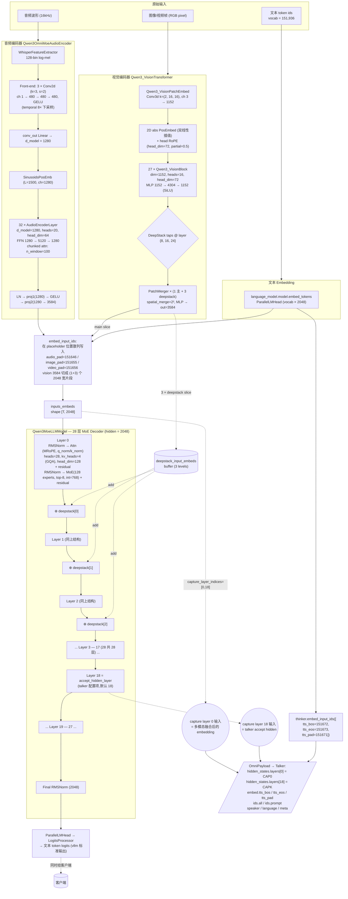
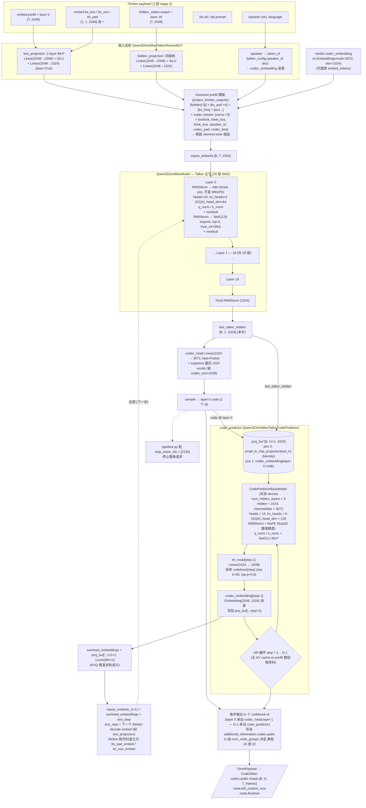
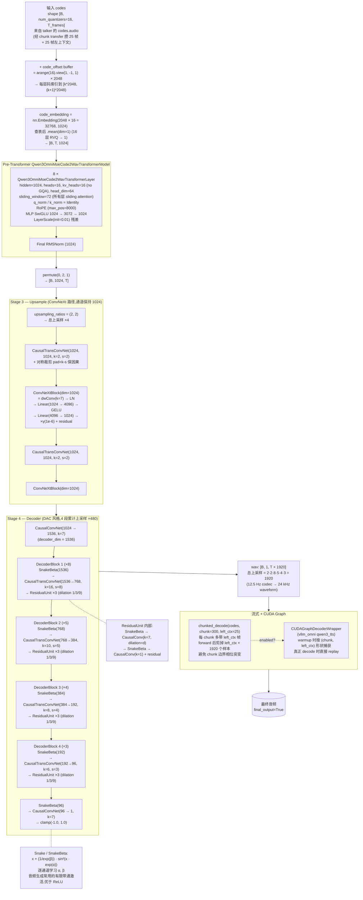
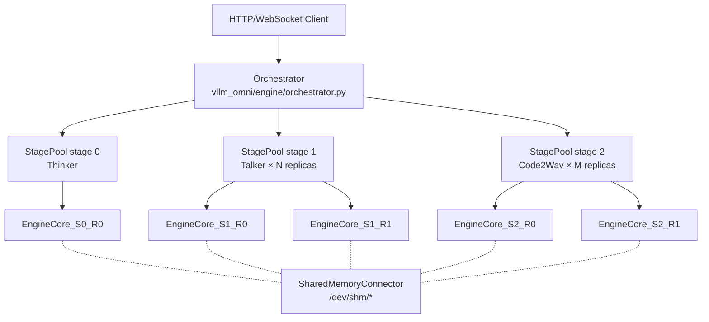

# vLLM-Omni 端到端机制详解:以 Qwen3-Omni 为例

> **文档版本**: 1.0
> **分析代码版本**: 当前 workspace 本地 `vllm-omni` 源码
> **最后更新**: 2026-06-07

---

## 文档概述

本文档以 **Qwen3-Omni** 为例,讲清楚 vllm-omni 相对于 vanilla vllm **多出来的那一层**到底干什么、为什么不直接合进 vllm,以及在 Qwen3-Omni 这种"多 stage 串接"的模型里,各 stage 之间到底交换什么、async chunk 怎么把它们流水起来、replica 1:2:2 部署为什么有收益、model runner 改了哪些地方。

**面试官常问**:

> "你们为什么不直接把 vllm-omni 的逻辑放回 vllm?"

短答:vllm 是一个**单模型、单引擎、token-in/token-out** 的推理框架;vllm-omni 是一个**多模型、多引擎、payload-in/payload-out** 的**编排框架**。它的核心抽象是"stage"——每个 stage 是一个独立的 vllm engine,stage 之间通过 connector 传递结构化 payload(不是 token 流)。这套抽象和 vllm 自身的"一个 engine 跑一个模型"的核心假设是冲突的——如果合进 vllm,要么把 vllm 改成多 engine 编排器(背离 vllm 的目的),要么阉割 vllm-omni 的多 stage 能力。

但这个回答并不充分。**真正的细节**在于:Qwen3-Omni 三个 stage(Thinker / Talker / Code2Wav)在 hidden states / embeddings / RVQ codes 这种张量层面交互,中间还有 BOS/EOS/PAD embedding 的特殊处理、chunk 级流水、replica 池化负载均衡。每一层都需要在 vllm 之外额外的代码。本文逐层展开。

**目标读者**:理解 vllm v1 engine core / scheduler / model runner 三段式,知道 PP / DP / EP / MoE 是什么,但对 vllm-omni 是空白的。读完应该能在面试里讲清楚:

1. vllm-omni 的"stage"抽象;
2. Qwen3-Omni 三个 stage 之间传递什么字段;
3. async chunk 为什么是 PP 的"近亲"但不一样;
4. 1:2:2 replica 的吞吐计算;
5. model runner 哪几个 hook 被改写了。

**阅读指南**:

| 部分 | 内容 |
|------|------|
| 第一部分 | Qwen3-Omni 是什么:三个 stage 的语义 |
| 第二部分 | vllm-omni 的核心抽象:stage / pipeline / connector |
| 第三部分 | Stage 之间到底传什么:OmniPayload 完整剖析 |
| 第四部分 | Thinker → Talker 的具体落地 |
| 第五部分 | Talker → Code2Wav 的具体落地 |
| 第六部分 | async chunk:为什么有用,和 PP 像在哪不像在哪 |
| 第七部分 | 1:2:2 replica 部署的收益 |
| 第八部分 | model runner 改了哪些 |
| 第九部分 | 为什么不能直接合进 vllm |
| 第十部分 | QA |

---

# 第一部分: Qwen3-Omni 是什么:三个 stage 的语义

## 1.1 一句话定义

Qwen3-Omni 是一个**多模态对话 + 语音生成模型**:输入文本/语音/图像,输出文本 + 合成语音。它在 vllm-omni 里被拆成三个串行的 stage:

```text
用户输入 (文本/音频/图像)
   ↓
┌──────────────────────────────────────────┐
│ Stage 0: Thinker                          │
│   多模态理解 + 文本生成                    │
│   "我应该说什么" → 文本 token + hidden     │
│   模型: Qwen3OmniMoeThinker (MoE LLM)     │
└──────────────────────────────────────────┘
   ↓ (hidden states + embeddings + token ids)
┌──────────────────────────────────────────┐
│ Stage 1: Talker                           │
│   文本嵌入 → 离散 codec 码 (8 层 RVQ)     │
│   "怎么说" → audio codes                  │
│   模型: Qwen3OmniMoeTalker + code_predictor│
└──────────────────────────────────────────┘
   ↓ (codec codes [batch, 8, T])
┌──────────────────────────────────────────┐
│ Stage 2: Code2Wav                         │
│   codes → 波形 (DAC 风格的解码器)         │
│   "听起来什么样" → wav                    │
│   模型: Qwen3OmniMoeCode2Wav (CNN)        │
└──────────────────────────────────────────┘
   ↓
最终输出:文本 + 音频
```

源码:`vllm_omni/model_executor/models/qwen3_omni/pipeline.py`

```python
QWEN3_OMNI_PIPELINE = PipelineConfig(
    model_type="qwen3_omni_moe",
    model_arch="Qwen3OmniMoeForConditionalGeneration",
    stages=(
        StagePipelineConfig(
            stage_id=0, model_stage="thinker",
            execution_type=StageExecutionType.LLM_AR,
            final_output=True, final_output_type="text",
            owns_tokenizer=True, requires_multimodal_data=True,
            engine_output_type="latent",
            custom_process_next_stage_input_func="...thinker2talker_full_payload",
            async_chunk_process_next_stage_input_func="...thinker2talker_async_chunk",
        ),
        StagePipelineConfig(
            stage_id=1, model_stage="talker",
            execution_type=StageExecutionType.LLM_AR,
            input_sources=(0,),
            custom_process_input_func="...thinker2talker",
            custom_process_next_stage_input_func="...talker2code2wav_full_payload",
            async_chunk_process_next_stage_input_func="...talker2code2wav_async_chunk",
        ),
        StagePipelineConfig(
            stage_id=2, model_stage="code2wav",
            execution_type=StageExecutionType.LLM_GENERATION,
            input_sources=(1,),
            final_output=True, final_output_type="audio",
            custom_process_input_func="...talker2code2wav",
        ),
    ),
)
```

这个 `PipelineConfig` 是 vllm-omni 的"模型卡片"——它声明了 Qwen3-Omni 有几个 stage、每个 stage 的执行类型(AR 自回归 / generation 非自回归)、stage 间如何转换 payload、谁的输出是最终输出。

## 1.2 三个 stage 的差异

| 维度 | Thinker | Talker | Code2Wav |
|------|---------|--------|----------|
| **执行类型** | LLM_AR(自回归) | LLM_AR(自回归) | LLM_GENERATION(非自回归) |
| **每步输出** | 一个文本 token + hidden | 一个 codec frame(8 个 codebook id) | 一段波形 |
| **架构** | MoE LLM(类似 Qwen3-MoE) | LLM + code_predictor MTP head | CNN 上采样网络 |
| **是否在 cudagraph** | 默认 cudagraph(`enforce_eager=false`) | 默认 cudagraph | **专门的内部 cudagraph**(decoder_wrapper) |
| **sampling** | top_p=0.9, top_k=1, repetition_penalty=1.05 | top_k=50, repetition_penalty=1.05 | greedy(temperature=0) |
| **stop 条件** | 模型自然 stop | `stop_token_ids=[2150]` | 模型自然 stop |
| **`final_output`** | True(同时给客户端) | False(只给下游) | True(最终音频) |

注意 Thinker 是 **`final_output=True`** 的——这是 Qwen3-Omni 的关键特性:**文本可以直接给客户端,不必等音频合成完**。这也是为什么客户端会先看到文本"shown",再听到 audio chunk 陆续到达。

## 1.3 三个 stage 的细粒度架构图

上一节给的是"功能 + scheduling 维度"的差异。这一节把三个 stage 各自的**模型内部结构**画细——每个 stage 由哪些 nn.Module 组成、张量形状如何演变、和上下游交换的字段从模型里的哪些位置抽取/落地。读懂这三张图,在面试里就能讲出"哪个 layer 的 hidden 是给 talker 的"、"code_predictor 怎么一次出 8/16/32 个 codebook id"、"code2wav 总上采样比 1920× 是怎么乘出来的"。

> 数字均以 HF transformers 4.5x + 当前 `vllm-omni` 默认配置为准 (`Qwen3OmniMoeConfig` / `Qwen3OmniMoeTalkerConfig` / `Qwen3OmniMoeCode2WavConfig`)。**实际 checkpoint 可能覆写**——尤其 `accept_hidden_layer`、`num_code_groups`、`num_quantizers` 这三个,部署时要 double-check。

### 1.3.1 Thinker:多模态理解 + MoE LLM

源码:[qwen3_omni_moe_thinker.py](vllm-omni/vllm_omni/model_executor/models/qwen3_omni/qwen3_omni_moe_thinker.py)、[qwen3_omni.py](vllm-omni/vllm_omni/model_executor/models/qwen3_omni/qwen3_omni.py)



读图要点:

1. **Thinker 内部就是一个 vanilla 的 Qwen3-Moe 28 层 LLM**——和 vllm 已有的 `Qwen3MoeModel` 同源,关键差别是 forward 接受了 `capture_layer_indices` 和 `deepstack_input_embeds` 两个 omni 专属参数。
2. **两路 capture**:layer 0 (= 多模态融合后、还没进 transformer 的 embedding) 给 talker 当文本投影输入;layer 18 (= `accept_hidden_layer`) 给 talker 当多模态语义投影输入。这两层在 [qwen3_omni.py:376](vllm-omni/vllm_omni/model_executor/models/qwen3_omni/qwen3_omni.py#L376) 处取。
3. **DeepStack 是 ViT 的关键技巧**:vision 编码器在 8/16/24 三层 tap 出多尺度特征,经各自 PatchMerger 投到 3584,与主分量在 feature 维拼接;LLM 这边在前 3 层显式 add 进去。这能让 LLM 拿到 ViT 早/中/晚不同层的视觉信息,而不是只看最后一层。
4. **TTS BOS/EOS/PAD 是从 thinker 的 embedding 表(`embed_tokens`)查出来的**——不是经过 transformer 算出来的。原因:这三个特殊 token 在 thinker 解码时不一定真的被采样,但 talker 一定需要它们的"thinker 空间"向量(用来投影成 talker 的空间)。所以单独走一次查表。

### 1.3.2 Talker:文本 → RVQ 多码本的双路自回归

源码:[qwen3_omni_moe_talker.py](vllm-omni/vllm_omni/model_executor/models/qwen3_omni/qwen3_omni_moe_talker.py)、[qwen3_omni_moe_code_predictor_mtp.py](vllm-omni/vllm_omni/model_executor/models/qwen3_omni/qwen3_omni_moe_code_predictor_mtp.py)、[common/qwen3_code_predictor.py](vllm-omni/vllm_omni/model_executor/models/common/qwen3_code_predictor.py)



读图要点:

1. **Talker 是"双流自回归"**:文本主流跑 20 层 MoE LLM(`Qwen3OmniMoeModel`),codec 子流跑 5 层独立的 dense transformer (`CodePredictorBaseModel`)。两者共享 hidden=1024 但**不共享权重**。
2. **第 0 层 RVQ code 由主 LLM 自己出**(`codec_head` 投到 vocab=3072 然后采样),**第 1 ~ G-1 层 RVQ code 由 code_predictor 顺序出**——每层一次小 forward,共 G-1 次 re-prefill。这是"MTP head 一次出 8 个 codebook"在源码层面的实际机制(标题虽然叫 "M Token Prediction",其实是个**串行**的 G-1 步小 AR,只不过每步规模极小所以总时间和一次大 forward 差不多)。
3. **`summed_embeddings` 是 RVQ 残差求和的体现**——把 G 个 codebook embed 全加起来,作为"该帧已选向量"的近似,加上下一个 text 步,得到下一步 talker 的输入。这就是"前一步选了什么码影响下一步生成"的反馈通路。
4. **MoE vs dense 的分工很微妙**:主 LLM 是 MoE(用 expert 路由处理文本/语义路径多样性),code_predictor 是 dense(因为输入空间已经被主 LLM 浓缩到 1024,后续只需做"精细量化"的回归式预测,没必要再上 MoE)。
5. **采样空间被 mask 过**:talker 的 vocab 是 3072,但**最后 1024 个位置被显式 `-1e9` mask**,只留 `codec_eos_token_id=4198`——避免模型采样到无意义的高位 token。

### 1.3.3 Code2Wav:codes → 波形 (DAC 风格 CNN)

源码:[qwen3_omni_code2wav.py](vllm-omni/vllm_omni/model_executor/models/qwen3_omni/qwen3_omni_code2wav.py)、HF 参考 [modeling_qwen3_omni_moe.py](transformers/src/transformers/models/qwen3_omni_moe/modeling_qwen3_omni_moe.py)



读图要点:

1. **三段 CNN + 一段 transformer 的混血架构**:Pre-transformer 给 codes 加时序上下文(sliding window=72 控制感受野),Upsample 用 ConvNeXt 做温和上采样,Decoder 用 DAC 风格的 ConvTranspose1d 暴力上采样到波形。**没有 KV cache、没有 sampling、没有 logits**——也是为什么它走 `GPUGenerationModelRunner` 而不是 `GPUARModelRunner`。
2. **总上采样比 = 1920** = `prod(upsampling_ratios) * prod(upsample_rates) = 2·2 · 8·5·4·3`。如果 codec 帧率是 12.5 Hz,输出就是 24 kHz waveform;输入若是 100 帧,输出就是 192,000 样本(8 秒音频)。
3. **`left_context_size=25` 帧是为了消除 chunk 边界的相位不连续**:因果卷积的 receptive field 在 chunk 起始处缺少历史,边界几十毫秒的波形会有 click 声——多带 25 帧 ≈ 0.5 秒上下文跑一遍,再剪掉对应的前 `25 × 1920 = 48000` 样本,边界就平滑了。
4. **整段 Decoder 可以塞进 CUDA Graph**——这是 code2wav 的关键性能优化:输入形状由 `(chunk_size, left_context)` 唯一决定(因为是 CNN 不是 AR),warmup 时按几组典型 (chunk, left_ctx) 捕获 graph,实际推理 replay 即可。`Qwen3OmniMoeCode2Wav._cudagraph_enabled` 控制这条路径。
5. **SnakeBeta 不是普通激活**:它是 `x + (1/exp(β)) · sin²(x · exp(α))`,逐通道学习 (α, β)。直观理解:`sin²(·)` 给波形带来周期性结构,适合"生成带音高的声音"——比 ReLU/GELU 这种单调激活更适合音频合成。vllm-omni 用了自己优化版的 SnakeBeta(`precompute_exp_cache()`)。

> 三张图配合看可以发现一个有意思的规律:**hidden 维度从 thinker(2048)→ talker(1024)→ code2wav(1024 但卷积通道一路到 96)** 逐级压缩;**自回归粒度从 thinker(1 个 text token / step)→ talker(1 frame = G 个 RVQ codes / step)→ code2wav(一次性整段非 AR)** 逐级"打包"。这是典型的"语义层往下越来越窄、时间分辨率往下越来越粗"的多 stage 语音生成范式。

## 1.4 为什么不一个模型一把梭

理论上你可以把这三段编进一个 nn.Module,跑一次 forward。但实际上它们的特性差异巨大:

- **Thinker**:典型的 LLM decode 工作负载——长 KV cache,适合 chunked prefill + prefix cache。
- **Talker**:也是 LLM decode,但 KV cache 短,batch 小,每步 1+8 个 token,适合不同的 scheduling 参数。
- **Code2Wav**:**不是 LLM**——它是一个 CNN,接收一段 codes 一次性算出整段波形,根本没有 KV cache。

合成一个 module:

- 一个 forward 里又有 attention 又有 conv,kernel mix 复杂;
- scheduling 参数无法分别调(thinker 想要大 max_num_seqs,talker 想要小);
- cudagraph 形状空间巨大(thinker 按 token 数桶,code2wav 按 codec 帧数桶);
- 不同硬件下三段表现差异不一——比如 code2wav 在 ROCm 上某些 conv_transpose1d 不能进 cudagraph,但 thinker 没问题。

所以拆 stage 是 **建模和工程的双重需求**,不是 vllm-omni 的强加。

---

# 第二部分: vllm-omni 的核心抽象

## 2.1 stage = 一个独立的 vllm engine

vllm-omni 不是在 vllm 内部加多了几个 "module"。**每个 stage 就是一个完整的 vllm v1 EngineCore 实例**——有自己的 scheduler、worker、model runner、KV cache。

打开 `vllm_omni/deploy/qwen3_omni_moe.yaml`(2 卡 H100 部署):

```yaml
stages:
  - stage_id: 0
    max_num_batched_tokens: 32768
    max_num_seqs: 64
    gpu_memory_utilization: 0.9
    devices: "0"                         # Thinker 独占 GPU 0
    enable_prefix_caching: false
    default_sampling_params:
      temperature: 0.4
      top_p: 0.9
      ...

  - stage_id: 1
    max_num_seqs: 64
    gpu_memory_utilization: 0.6
    devices: "1"                         # Talker 在 GPU 1
    input_connectors:
      from_stage_0: connector_of_shared_memory
    ...

  - stage_id: 2
    max_num_seqs: 64
    gpu_memory_utilization: 0.1
    devices: "1"                         # Code2Wav 也在 GPU 1
    enable_chunked_prefill: false
    async_scheduling: false               # ★ 非 AR,关掉 async scheduler
    input_connectors:
      from_stage_1: connector_of_shared_memory
    ...
```

读法:

1. **每个 stage 是独立的 EngineCore 进程**——`devices: "0"` 和 `devices: "1"` 表示不同 GPU,跨 GPU 自然就是跨进程。
2. **stage 1 + stage 2 共享 GPU 1**:这是有意的——talker 显存占用大(MoE 模型),code2wav 模型很小(`gpu_memory_utilization: 0.1`),共享一张卡能省下一张。
3. **stage 之间用 connector 通信**:`input_connectors: from_stage_0: connector_of_shared_memory` 表示"stage 1 从 stage 0 通过 SharedMemoryConnector 拿输入"。
4. **stage 2 关掉 `async_scheduling`**:因为 code2wav 不是 AR,async scheduler 那一套(placeholder / lazy sync)对它没意义。

## 2.2 三层架构



三个角色:

| 角色 | 在哪 | 干什么 |
|------|------|--------|
| **Orchestrator** | `vllm_omni/engine/orchestrator.py` | 接收请求 → 提交到 stage 0 → 等输出 → 通过 connector 把结构化 payload 发给 stage 1 → 等 stage 1 → 发给 stage 2 → 把最终输出返给客户端 |
| **StagePool** | `vllm_omni/engine/stage_pool.py` | 同一个 stage 可能有多个 replica(进程级副本)。pool 负责"选哪个 replica 处理这条请求"——request affinity + 负载均衡 |
| **Connector** | `vllm_omni/distributed/omni_connectors/connectors/*` | stage 之间的数据传输层。SHM(同机)、Mooncake(跨机 RDMA)、Yuanrong(自研)等 |

## 2.3 Connector:不是 KV cache transfer

vllm 里有 "KV cache transfer connector",用于 PD 解耦(prefill 和 decode 跨进程传 KV)。**vllm-omni 的 connector 是另一回事**——它传的是**结构化 payload**(hidden / embed / codes / ids / meta),不是 KV cache。

源码:`vllm_omni/distributed/omni_connectors/connectors/shm_connector.py`

```python
class SharedMemoryConnector(OmniConnectorBase):
    def put(self, from_stage, to_stage, put_key, data):
        # data 是 OmniPayloadStruct,用 msgspec 序列化
        payload = self.serialize_obj(data)
        lock_file = f"/dev/shm/shm_{put_key}_lockfile.lock"
        with open(lock_file, "wb+") as lockf:
            fcntl.flock(lockf, fcntl.LOCK_EX)
            meta = shm_write_bytes(payload, name=put_key)   # 写到 /dev/shm
            fcntl.flock(lockf, fcntl.LOCK_UN)
        ...

    def get(self, from_stage, to_stage, get_key, metadata=None):
        # 用 SharedMemory(name=key) 打开,锁住读,反序列化
        ...
```

机制:

- `put_key = f"{external_req_id}_{stage_id}_{chunk_id}"`——按"请求 id + 产生 stage + chunk 序号"唯一定址;
- 每个 key 对应一个 POSIX shared memory segment(`/dev/shm/shm_<key>`)+ 一个文件锁(`/dev/shm/shm_<key>_lockfile.lock`);
- 上游 stage put,下游 stage poll get;
- 消费完成后 unlink 释放。

这种设计的好处是**同机内零拷贝(共享内存)**,跨机时换 Mooncake / Yuanrong 后端(RDMA)即可——connector 是个 plugin。

---

# 第三部分: Stage 之间到底传什么

## 3.1 OmniPayload 全字段表

`vllm_omni/data_entry_keys.py` 定义了 stage 之间能传的所有字段:

```python
class OmniPayloadStruct(_StructBase):
    hidden: torch.Tensor | None = None
    hidden_states: HiddenStatesStruct | None = None
    embed: EmbeddingsStruct | None = None
    ids: IdsStruct | None = None
    codes: CodesStruct | None = None
    meta: MetaStruct | None = None
    latent: torch.Tensor | None = None
    generated_len: int | None = None
    model_outputs: list[torch.Tensor] | None = None
    mtp_inputs: tuple[torch.Tensor, torch.Tensor] | None = None
    speaker: list[str] | str | None = None
    language: list[str] | str | None = None
    request_id: str | None = None
    past_key_values: list[int] | None = None
    kv_metadata: dict[str, Any] | None = None
```

每个嵌套结构再展开:

```python
class HiddenStatesStruct(_StructBase):
    output: torch.Tensor | None = None        # 完整输出 hidden
    output_shape: list[int] | None = None
    trailing_text: torch.Tensor | None = None
    last: torch.Tensor | None = None
    layers: dict[int, torch.Tensor] | None = None  # 按层号取特定 layer 的 hidden

class EmbeddingsStruct(_StructBase):
    prefill: torch.Tensor | None = None       # prompt 段的 embedding
    decode: torch.Tensor | None = None        # decode 段单步 embedding
    decode_token_start: int | None = None
    decode_token_end: int | None = None
    cached_decode: torch.Tensor | None = None
    tts_bos: torch.Tensor | None = None       # ★ TTS 特殊 token embedding
    tts_eos: torch.Tensor | None = None
    tts_pad: torch.Tensor | None = None
    tts_pad_projected: torch.Tensor | None = None
    voice: torch.Tensor | None = None
    speech_feat: torch.Tensor | None = None
    ...

class CodesStruct(_StructBase):
    audio: torch.Tensor | None = None         # ★ RVQ codec 码 [batch, 8, T]
    ref: torch.Tensor | None = None

class IdsStruct(_StructBase):
    all: list[int] | None = None              # prompt + output 全部 token id
    prompt: list[int] | None = None
    output: list[int] | None = None
    speech_token: list[int] | None = None
    prior_image: list[int] | None = None

class MetaStruct(_StructBase):
    finished: torch.Tensor | None = None      # 整个请求是否结束
    is_segment_finished: torch.Tensor | None = None  # 当前 segment(realtime streaming 用)
    left_context_size: int | None = None      # ★ 给 code2wav 的左上下文长度
    next_stage_prompt_len: int | None = None  # ★ 给下游 stage 的 prompt 长度提示
    talker_prefill_offset: int | None = None
    codec_chunk_frames: int | None = None
    codec_left_context_frames: int | None = None
    omni_final_stage_id: int | None = None    # ★ 这条请求是否需要走到 stage 2(text-only 可以 stop 在 stage 0)
    ...
```

**注意几个 vllm 没有的概念**:

| 字段 | 为什么 vllm 没有 |
|------|------------------|
| `hidden_states.layers` | vllm 只关心最后一层的 hidden。Qwen3-Omni 需要特定层(第 0 层= input embedding,第 24 层= "accept_hidden_layer")给 talker |
| `embed.tts_bos / tts_eos / tts_pad` | vllm 只有 token id,没有"某个 token 的 GPU embedding 张量"。但 talker 需要把 thinker 的 `tts_bos` embedding 投影到 talker 的输入空间 |
| `codes.audio` | vllm 输出是 token id 列表。RVQ codes 是 `[8, T]` 的 int 张量——一帧 8 个 codebook id |
| `meta.left_context_size` | vllm 不知道"左上下文 25 帧"这种 streaming 概念 |
| `meta.omni_final_stage_id` | text-only 请求不需要进 talker——这是 omni 级别的策略 |

## 3.2 payload 在 transit 中的形态

每个 stage 的 worker 把 `multimodal_output` / `pooling_output`(就是这些字段的 GPU 张量)交给 `OmniChunkTransferAdapter`:

```text
vllm_omni/distributed/omni_connectors/transfer_adapter/chunk_transfer_adapter.py
```

```python
def save_async(self, pooling_output, request, is_segment_finished=False):
    is_finished = request.is_finished() and not request.resumable
    confirmed_num_computed_tokens = self._confirmed_num_computed_tokens(request)
    ...
    task = {
        "pooling_output": pooling_output,
        "request": request,
        "is_finished": is_finished,
        "is_segment_finished": is_segment_finished,
    }
    self._pending_save_reqs.append(task)
    with self._save_cond:
        self._save_cond.notify()
```

它的 `_send_single_request` 会调用 stage 注册的 `custom_process_next_stage_input_func`(也就是上文 pipeline 里写的 `thinker2talker_async_chunk`):

```python
def _send_single_request(self, task):
    raw_po = task["pooling_output"]
    pooling_output = unflatten_payload(raw_po) if isinstance(raw_po, dict) else raw_po
    ...
    if self.custom_process_next_stage_input_func:
        payload_data = self.custom_process_next_stage_input_func(
            transfer_manager=self,
            pooling_output=pooling_output,
            request=request,
            is_finished=is_segment_finished,
        )
    ...
    success, size, metadata = self.connector.put(
        from_stage=str(stage_id), to_stage=str(next_stage_id),
        put_key=connector_put_key, data=payload_data,
    )
```

也就是说,**vllm-omni 的精髓不在 connector 自身,而在 `custom_process_next_stage_input_func`——它是模型作者写的"翻译层",决定上游 stage 的 GPU 输出怎么变成下游 stage 能消费的 payload**。这层逻辑没法塞回 vllm,因为它高度模型相关。

---

# 第四部分: Thinker → Talker 的具体落地

## 4.1 thinker 这一步需要把什么交出来

源码:`vllm_omni/model_executor/stage_input_processors/qwen3_omni.py`

`thinker2talker_async_chunk` 的核心(async chunk 模式,逐 chunk 流式):

```python
def thinker2talker_async_chunk(
    transfer_manager, pooling_output, request, is_finished=False,
) -> OmniPayloadStruct | None:
    request_id = request.external_req_id
    chunk_id = transfer_manager.put_req_chunk[request_id]
    ...
    thinker_hs = pooling_output.get("hidden_states", {})
    thinker_layers = thinker_hs.get("layers", {})
    thinker_embed = pooling_output.get("embed", {})
    thinker_emb = _layer_tensor(thinker_layers, _EMBED_LAYER_KEY)   # layer "0"
    thinker_hid = _layer_tensor(thinker_layers, _HIDDEN_LAYER_KEY)  # layer "24"

    if chunk_id == 0:
        # 第一个 chunk:发送 prefill 段 (prompt embedding) + 所有 token id
        all_token_ids = _ensure_list(request.all_token_ids)
        prompt_token_ids = _ensure_list(request.prompt_token_ids)
        payload = OmniPayloadStruct(
            embed=EmbeddingsStruct(
                prefill=thinker_emb.detach().cpu(),
                tts_bos=_maybe_cpu(thinker_embed.get("tts_bos")),
                tts_eos=_maybe_cpu(thinker_embed.get("tts_eos")),
                tts_pad=_maybe_cpu(thinker_embed.get("tts_pad")),
            ),
            hidden_states=HiddenStatesStruct(output=thinker_hid.detach().cpu()),
            ids=IdsStruct(all=all_token_ids, prompt=prompt_token_ids),
            meta=MetaStruct(finished=torch.tensor(is_finished, dtype=torch.bool)),
            speaker=speaker,
            language=language,
        )
        ...
    else:
        # 后续 chunk:只发送 decode 段单步的 embedding
        payload = OmniPayloadStruct(
            meta=MetaStruct(finished=torch.tensor(is_finished, dtype=torch.bool)),
            embed=EmbeddingsStruct(decode=thinker_emb.detach().cpu()),
            speaker=speaker,
            language=language,
        )
    return payload
```

读法(几个关键点):

1. **第 0 个 chunk 发 prefill,后续 chunk 只发 decode 单步**——这是 chunk 级流水的核心:同一条请求的 thinker 输出**分多次**发给 talker,而不是等 thinker 全部跑完一次性发。
2. **取 layer 0 和 layer 24**:`_EMBED_LAYER_KEY = "0"`(输入 embedding)、`_HIDDEN_LAYER_KEY = "24"`(transformer 的 24 层 "accept_hidden_layer")。这是 Qwen3-Omni 模型作者指定的"talker 需要这两层 hidden"。
3. **tts_bos / tts_eos / tts_pad 单独传**:它们不是 token——是"TTS 特殊符号在 thinker 输入 embedding 空间的张量值"。talker 要把它们投影到自己的输入空间。
4. **`prefill` / `decode` 是两个独立字段**:prefill 段是 batch 写一次,decode 段是每步 1 行——形状不同,语义不同。
5. **CPU 落地**:`.detach().cpu()`。GPU 张量要先回 CPU 才能进 SHM(SHM 是 host memory)。这是 vllm-omni 在 hot path 上的 D2H 成本——后面 perf 文档会讲怎么优化。

## 4.2 talker 这边怎么接收

talker stage 的 model runner 在 `execute_model` 开头会先 poll connector:

```python
# vllm_omni/worker/gpu_ar_model_runner.py
if hasattr(self, "_omni_connector"):
    for request in getattr(scheduler_output, "pending_input_registrations", []):
        self.register_chunk_recv(request)
    self.recv_full_payload_inputs(scheduler_output)
    ...
```

之后 `thinker2talker` 把 payload 转成 talker 能处理的 prompt:

```python
def thinker2talker(
    source_outputs, prompt=None, requires_multimodal_data=False, streaming_context=None,
) -> list[OmniTokensPrompt]:
    """从 thinker 输出构造 talker 的 OmniTokensPrompt。
    流程:
    1. 抽取 thinker 文本生成结果 (token ids + hidden states)
    2. 切分 hidden:prompt embeddings + generated embeddings
    3. 打包成 talker 输入
    """
```

talker 本身的 forward 会拿 thinker 给的 hidden 当 input:

```python
# vllm_omni/model_executor/models/qwen3_omni/qwen3_omni.py
def talker_preprocess_prefill(self, input_ids, input_embeds, payload: OmniPayload):
    hs: HiddenStates = payload.get("hidden_states", {})
    embed: Embeddings = payload.get("embed", {})
    ids: Ids = payload.get("ids", {})
    ...
    voice_type = payload.get("speaker") or self.default_tts_text_spk_type
    # 用 speaker 选 voice token id,把 tts_bos/eos/pad 投影到 talker 空间
    ...
```

和 `_get_tts_embed`:

```python
def _get_tts_embed(self, thinker_embed, tts_bos_thinker, tts_eos_thinker, tts_pad_thinker):
    """把 thinker 侧的 TTS 特殊 embedding 投影到 talker 文本空间。"""
    def _proj_from_thinker(x_opt):
        if isinstance(x_opt, torch.Tensor) and x_opt.numel() > 0:
            xin = _ensure_1x1(x_opt).to(module_device)
        else:
            xin = torch.zeros((1, thinker_embed.shape[-1]), ...)
        return self.talker.text_projection(xin).to(module_device)

    self.tts_bos_embed = _proj_from_thinker(tts_bos_thinker)
    self.tts_eos_embed = _proj_from_thinker(tts_eos_thinker)
    self.tts_pad_embed = _proj_from_thinker(tts_pad_thinker)
    return self.tts_bos_embed, self.tts_eos_embed, self.tts_pad_embed
```

读法:

1. **talker 不重新 embed token**——它直接用 thinker 给的 hidden(因为 thinker 和 talker 共享同一段词表语义,但 hidden space 不同,需要 `text_projection` 投影)。
2. **TTS 特殊 token 的 embedding 不能用查表得到**——必须从 thinker 当下产生的 hidden 投影,否则采样到的 `bos/eos/pad` 在 talker 这边会"语义不对"。
3. **speaker 选择**:`speaker` 字段是字符串(如 `"male_3"`),talker 内部映射到 voice token id,这部分纯 omni 自己实现,vllm 完全不知道。

## 4.3 talker_mtp 和 code_predictor:为什么 talker 一步出 8 个 codebook id

talker 用一个 "Multi-Token Prediction" head 一次预测 8 层 RVQ codebook 的 token id:

```python
# vllm_omni/worker/gpu_model_runner.py
def _talker_mtp_forward(self, decode_req_ids, inputs_embeds, start_offsets=None):
    decode_batch_size = len(decode_req_ids)
    if decode_batch_size == 0:
        return
    _cudagraph_mode, batch_desc, _, _, _ = self._determine_batch_execution_and_padding(
        num_tokens=decode_batch_size, num_reqs=decode_batch_size,
        ...
    )
    ...
    with current_omni_platform.set_forward_context(
        None, self.vllm_config, cudagraph_runtime_mode=_cudagraph_mode, batch_descriptor=batch_desc
    ):
        req_embeds, code_predictor_codes = self.talker_mtp(
            req_input_ids, req_embeds, last_talker_hidden, text_step, **talker_kwargs,
        )
    ...
    for idx, (req_id, start_offset) in enumerate(zip(decode_req_ids, start_offsets, strict=True)):
        inputs_embeds[start_offset : start_offset + 1] = req_embeds[idx : idx + 1]
        update_dict = {out_key[0]: {out_key[1]: code_predictor_codes[idx : idx + 1]}}
        self._merge_additional_information_update(req_id, update_dict)
```

talker_mtp 的真正实现:

```python
# vllm_omni/model_executor/models/qwen3_omni/qwen3_omni.py
def talker_mtp(self, input_ids, input_embeds, last_talker_hidden, text_step, **kwargs):
    ...
    code_predictor_codes, summed_embeddings = self.talker.code_predictor_forward(
        input_ids, inputs_embeds, last_talker_hidden=last_talker_hidden
    )
    inputs_embeds = summed_embeddings.reshape(-1, self.talker_config.text_config.hidden_size)
    inputs_embeds = (inputs_embeds + text_step).reshape(-1, ...)
    return inputs_embeds, code_predictor_codes.squeeze(-1)
```

`code_predictor_forward` 一次跑完 8 层 codebook 的 MTP,**返回的 `code_predictor_codes` 形状 `[batch, 8]`**——这就是这一步的 codec frame。

为什么这样?RVQ 编码本质就是"用 8 个 codebook 量化同一个向量,后一个 codebook 编码前一个的残差"。MTP 一次出 8 个 codebook id,比顺序一个个出快很多——但这是模型架构的事情,vllm 不可能知道这种约定。

`_talker_mtp_forward` 会把结果写进 `update_dict = {"codes": {"audio": ...}}`,在 stage 1 输出时通过 `talker2code2wav_*` 处理器送往 stage 2。

## 4.4 MTP 在 preprocess 里跑:实现位置和语义的"错位"

直觉上 MTP 应该是"talker LLM 出 hidden → MTP 拿 hidden 转 codes",也就是在 talker forward **之后**。但代码里它实际在**之前**——`_preprocess` 阶段就跑了。这一节把这个"反直觉"讲清楚。

### 4.4.1 调用栈坐标

[gpu_ar_model_runner.py:execute_model](vllm-omni/vllm_omni/worker/gpu_ar_model_runner.py#L366) 的真实顺序:

```text
execute_model(scheduler_output, ...)
├── self._preprocess(...)                              [line 607]
│   ├── ... (准备 inputs_embeds 等)
│   ├── flush_decode_batch()                           [gpu_model_runner.py:1674]
│   └── self._talker_mtp_forward(...)                  [gpu_model_runner.py:1678]  ★ MTP 在这里
└── self._model_forward(input_ids, inputs_embeds, ...) [line 653]   ← talker 主 LLM
```

定位见 [gpu_model_runner.py:1437 `_preprocess`](vllm-omni/vllm_omni/worker/gpu_model_runner.py#L1437) 和 [gpu_model_runner.py:1689 `_talker_mtp_forward`](vllm-omni/vllm_omni/worker/gpu_model_runner.py#L1689)。

### 4.4.2 为什么必须先跑 MTP

`_talker_mtp_forward` 一个 step 内同时完成两件事:

1. **取上一步留下的 hidden 来出 codes**: 用 `last_talker_hidden_(t-1)`(上一步 talker forward 末尾保存)调用 `code_predictor`,产出 `code_predictor_codes` → 写进 `additional_information["codes"]["audio"]`,给下游 code2wav。
2. **给本步 talker LLM 准备输入**: 把 RVQ 全 G 层 codes 的 embedding 求和(`summed_embeddings`)+ `text_step` → 写回 `inputs_embeds[start_offset]`,作为接下来 `_model_forward` 调用的输入。

第 2 件事是关键。AR 自回归要求**本步 talker LLM 的输入 = 上一帧的"我说了什么"+ 本步的"我接下来该说什么"**。这两者只能在 talker forward 之前算出来,所以 MTP 必须 **前置**。

代码体现 [gpu_model_runner.py:1716-1793](vllm-omni/vllm_omni/worker/gpu_model_runner.py#L1716):

```python
last_talker_hidden = self.last_talker_hidden.gpu[:num_tokens_padded]   # 上一步 talker 留下
text_step          = self.text_step.gpu[:num_tokens_padded]            # 本步文本条件
...
req_embeds, code_predictor_codes = self.talker_mtp(
    req_input_ids, req_embeds, last_talker_hidden, text_step, ...
)
...
inputs_embeds[start_offset : start_offset + 1] = req_embeds[idx : idx + 1]  # ★ 覆盖本步 talker 输入
update_dict = {"codes": {"audio": code_predictor_codes[idx : idx + 1]}}     # ★ 同时输出 codes
```

### 4.4.3 "Step 边界"的语义错位

由此引出一个微妙的语义点:**MTP 在 step t 的 preprocess 里产出的 codes,实际属于 frame t-1**。完整时序:

```text
[Prefill]
   talker LLM forward(prompt) → hidden 序列
   codec_head 在末位置采样 → frame 0 的 layer 0 code
   (没有 code_predictor 介入,完全跳过 MTP 路径)

[Decode step 1]  preprocess
   1. 读 last_talker_hidden_(prefill 末) + text_step_1
   2. code_predictor:
        输入: frame 0 layer-0 code(prefill 末采的)+ prefill 末 hidden + text_step_1
        输出: frame 0 layers 1..G-1 codes(★ 至此 frame 0 才补完整 ★)
        输出: summed_embeddings(frame 0 完整 RVQ 嵌入和)
        写回 inputs_embeds_(step 1)

[Decode step 1]  _model_forward
   3. talker LLM forward(inputs_embeds_(step 1)) → hidden_(step 1)
   4. codec_head 采样 → frame 1 layer-0 code

[Decode step 2]  preprocess
   5. code_predictor: 输入 hidden_(step 1) + frame 1 layer-0 → 补出 frame 1 layers 1..G-1
   ...
```

所以"第一帧 layer 0"是**从 prefill 末由 codec_head 直接采到**的,**完全不经过 code_predictor**。从第一个 decode step 开始,code_predictor 才接管"补齐上一帧 layers 1..G-1 + 准备本步输入"的复合任务。这也对应 [qwen3_omni.py:687-698](vllm-omni/vllm_omni/model_executor/models/qwen3_omni/qwen3_omni.py#L687) 的代码——prefill 分支直接给 `codes.audio` 写全零:

```python
if is_prefill:
    ...
    code_predictor_codes = torch.zeros(
        (input_embeds.shape[0], self.talker.num_code_groups), ...
    )
    update_dict.setdefault("codes", {})["audio"] = code_predictor_codes
```

写零有双重意义:**(a) 没真跑 code_predictor**;**(b) 告诉 code2wav 这段不要合成成音频(prompt 模板段不应该被念出来)**。

### 4.4.4 为什么必须把 `summed_embeddings` 反馈给下一步

第一原则是 **AR 自条件**:不喂回去,下一步 talker 不知道上一帧实际选了什么 RVQ,生成的 frame 之间相位会跳、prosody 也对不上。和文本 LLM "把上一个 token 的 embedding 喂回去" 是同一回事——只是 audio AR 的"上一个 token"是 G 个 codebook 的联合,不是单个 token。

第二个细节是 **为什么是 `summed_embeddings` 而不是只回喂 layer 0 code**:RVQ 是残差量化,layer 0 只表达粗略部分(可能 30% 的信息量),细节都在 layers 1..G-1。**G 层 embedding 求和才近似等于 frame 的连续向量**——这是 RVQ 数学:

```text
真实音频帧向量 v ≈ Σ_k Q_k[c_k]   (G 个 codebook 的 embedding 之和)
```

把这个 sum 回喂,等于把"刚才那帧实际选定的连续音频近似"还给了 talker——把离散化在采样中丢的信息以连续形态补回。如果只回喂 layer 0,等同于让 talker 戴着 30% 分辨率的眼镜看自己刚才说的话,合成出来的语音会"含糊"。

第三个细节是 **`text_step` 也要叠加**:`inputs_embeds_(t) = summed_embeddings_(t-1) + text_step_(t)`。两条信号同向量空间直接相加而非 concat,因为 talker 主干是标准 LLM 只接受一个 1024 维输入。语义是 "上一帧我说了什么(audio self)" + "thinker 接下来要我说什么(text condition)" 的 fusion。

当 thinker 早已停但 talker 还要把已生成的文字念完(因为 1 个文字对应 5-10 个 audio 帧),`text_step` 退化为 `tts_pad_embed`(撑节奏)或 `tts_eos_embed`(收尾)。这是 thinker / talker **速率不匹配**时的 padding 机制。

## 4.5 三个 RVQ 相关术语辨析:`codec_head` / `codebook` / `codec_embedding`

源码里这三个词看着像但完全不是一回事。先用 LLM 做一张映射表:

| 普通 LLM | Talker 主 AR 流(帧间,1 步 1 帧) | code_predictor 残差流(帧内,G-1 步采完一帧) | code2wav |
|---|---|---|---|
| `embed_tokens` (vocab × hidden) | **`codec_embedding`**(Embedding(3072, 1024)) | **`codec_embedding[k]` × (G-1)**(Embedding(2048, 1024) 各一) | **`code_embedding`**(Embedding(32768, 1024)) |
| `lm_head` (hidden × vocab) | **`codec_head`**(Linear(1024, 3072)) | `lm_head[k] × (G-1)`(Linear(1024, 2048)) | — (CNN 直出波形) |
| vocab(token 空间) | 3072 = 2048 layer-0 codes + 1024 特殊 token | 2048(单层 RVQ codebook) | 32768 = 2048 × 16(所有 16 层共表) |
| 每"步"采几个 | 1 个 layer-0 code | 1 个残差层 code(串行 G-1 次) | 0,无采样 |

### 4.5.1 `codec_head`:talker 的 `lm_head`

[qwen3_omni_moe_talker.py:107](vllm-omni/vllm_omni/model_executor/models/qwen3_omni/qwen3_omni_moe_talker.py#L107):

```python
self.codec_head = nn.Linear(
    self.config.text_config.hidden_size,   # 1024
    self.config.text_config.vocab_size,    # 3072
    bias=False,
)
```

形式上和 LLM 的 `lm_head` 一模一样:`Linear(hidden → vocab)` 出 logits。vocab=3072 的解读:

- `[0, 2048)` = 一个 RVQ codebook 的 2048 个 index(被采为 layer-0 code)
- `[2048, 3072)` = talker 自己的"特殊 token"(speaker id / `codec_bos` / `codec_eos` / `nothink` 等控制 token)

[qwen3_omni.py:306-316 `_get_talker_suppressed_tokens`](vllm-omni/vllm_omni/model_executor/models/qwen3_omni/qwen3_omni.py#L306) 会把后 1024 个 logits 直接抹成 `-1e9`,只留 `codec_eos`——**正常生成时不允许采到特殊 token**,只在需要停止时允许 `codec_eos`。

### 4.5.2 `codebook`:概念,不是属性名

"codebook" 是 **RVQ(Residual Vector Quantization)的术语**,不是代码里某个 `nn.Module` 的名字。一个 codebook = 2048 个 1024 维的聚类中心。RVQ 有 G 个 codebook 串起来用:

```text
真实音频帧向量 v ≈ Q_0[c_0] + Q_1[c_1] + ... + Q_(G-1)[c_(G-1)]
                  ↑codebook 0    ↑codebook 1         ↑codebook G-1
```

每个 codebook **互相独立**——同一个 index "5" 在不同 codebook 里代表完全不同的向量,语义不跨层共享。

实际代码里这些 codebook 以 `nn.Embedding(2048, 1024)` 的形式**多处复用**,但**权重独立训练**:

| 位置 | 模块名 | 个数 | 用途 |
|---|---|---|---|
| **code2wav** | `code_embedding`(单一大表 vocab=32768) | 1 | 解码端:codes → 连续向量 → CNN 上采样到波形 |
| **talker 主 LLM** | `codec_embedding`(Embedding(3072, 1024)) | 1 | 嵌入 layer-0 code + 特殊 token,作为下一步 talker LLM 的输入种子 |
| **code_predictor** | `codec_embedding`(`ModuleList[Embedding(2048, 1024) × (G-1)]`) | G-1 | predictor 内部 AR 循环:每采完一层 residual code 查这个表,作为下一层的输入 |

为什么权重不共享:三处训练目标完全不同——code2wav 优化 reconstruction loss(波形要像),talker 优化 next-frame generation(下一帧要合理),code_predictor 优化 conditional residual prediction(残差层条件分布要准)。所以即使概念上都是 RVQ codebook,实际数值各自学。

### 4.5.3 `codec_embedding`(主 talker LLM 里那个):talker 的 `embed_tokens`

[qwen3_omni_moe_talker.py:377-388](vllm-omni/vllm_omni/model_executor/models/qwen3_omni/qwen3_omni_moe_talker.py#L377):

```python
del self.model.embed_tokens   # 删掉继承自 Qwen3MoeLLMForCausalLM 的文本 embed
del self.lm_head              # 删掉文本 lm_head
...
self.model.codec_embedding = nn.Embedding(vocab_size=3072, hidden_size=1024)
```

关键的"换肉"操作:vanilla Qwen3-MoE 的 `embed_tokens`(文字 vocab × hidden)被换成 `codec_embedding`(codec vocab × hidden)。**talker 的"母语"从此变成 codec token,不再是文字**。

用法:
- prefill 时,assistant 模板里的 codec 子流(speaker_id / `codec_bos` ...)经过 `codec_embedding` 查表;
- decode 时,**上一帧的 layer-0 code**(`codec_head` 采出来的那个 id)经过 `codec_embedding` 查表 → 作为 `code_predictor` 的输入种子(`proj_buf[1]`);
- decode 时,上一帧的 **G 层 codes 经 code_predictor 内部 codec_embedding[k] 查表求和**(`summed_embeddings`)→ 本步 talker LLM 的输入主体。

### 4.5.4 双层 AR 一图汇总

```text
                 ┌───────────────────────────────────────────────────────────────┐
                 │   Talker 主 AR 循环(帧间,每帧 1 次)                            │
                 │                                                               │
                 │   inputs_embeds_(t) = summed_embeddings_(t-1) + text_step_(t) │
                 │              ↑                                                │
                 │      (来自 code_predictor)                                     │
                 │              ▼                                                │
                 │   Talker LLM 20 层 MoE forward → hidden_(t)                    │
                 │              ▼                                                │
                 │   codec_head(Linear 1024→3072) → sample → layer-0 code_(t)    │
                 └───────────────────────────────────────────────────────────────┘
                                                                              │
                                  ▼ 进入 step t+1 的 preprocess               │
                 ┌───────────────────────────────────────────────────────────────┐
                 │   code_predictor 残差 AR(帧内,每帧 G-1 次)                    │
                 │                                                               │
                 │   proj_buf[0] = last_talker_hidden_(t)                        │
                 │   proj_buf[1] = talker.codec_embedding[ layer-0 code_(t) ]    │
                 │                                                               │
                 │   for k = 1 .. G-1:                                           │
                 │       predictor forward → hidden_k                            │
                 │       layer-k code = sample(lm_head[k](hidden_k))             │
                 │                              ↑ Linear(1024 → 2048)            │
                 │       proj_buf[k+1] = predictor.codec_embedding[k-1](         │
                 │                          layer-k code                         │
                 │                       )                                       │
                 │                       ↑ Embedding(2048, 1024) × (G-1)         │
                 │                                                               │
                 │   summed_embeddings_(t) = proj_buf[1:G+1].sum(dim=1)          │
                 │       └──→ 喂回 talker step t+1 的输入                         │
                 └───────────────────────────────────────────────────────────────┘
                                                                              ▼
                                                           送给 code2wav:
                                          full frame_(t) = [layer 0, layer 1, ..., layer G-1]
                                              在 code2wav 内被 code_embedding 查表 + .mean(1)
                                              → 1024 维连续向量 → CNN 上采样 → 波形
```

### 4.5.5 和 LLM 的本质区别

**联系**(形式上和 LLM 一致):一个输入 embedding 表 + 一个 transformer + 一个输出 lm_head + sampling,AR token 模型的标准三件套。`codec_embedding` ⇔ `embed_tokens`,`codec_head` ⇔ `lm_head`,只是 vocab 换成 codec 空间。

**区别**(audio AR 比 text AR 多出来的复杂性):

1. **每步不是 1 个 token,而是 G 个 codebook index 的联合**——所以多了一个 `code_predictor` 子模型专门负责"一帧内串行采完所有残差层"。
2. **vocab 是分层的**:layer 0 vocab=3072(含 specials),layers 1..G-1 vocab=2048(纯 codes,没有 specials 因为它们不会在帧边界被采样)。LLM 没这种分层。
3. **反馈不是单 token embedding,而是 G 个 codebook embedding 的 sum**(RVQ 残差求和的连续近似)。LLM 反馈就是 `embed_tokens[next_id]` 单条向量。
4. **三处 codec_embedding 不共享权重**:talker / predictor / code2wav 各训各的,因为各自的训练目标不同(generation / residual / reconstruction)。LLM 通常只有一个 `embed_tokens`,常和 `lm_head` 做 weight-tying。
5. **下游消费方式不同**:LLM 采完 token 就交给 detokenizer 拼字符串;talker 采完 frame 后还要送进 code2wav 这个**完全独立的 CNN 解码器**才能听到声音。

一句话:**`codec_embedding` 和 `codec_head` 是把 LLM 的 `embed_tokens + lm_head` 换成"RVQ 单层"vocab 后的产物;真正的"分层 RVQ"复杂性被打包进了 `code_predictor`——它是个独立的"层内 AR"小循环,带自己的输入查表(`predictor.codec_embedding[k]`)和输出头(`predictor.lm_head[k]`)。"codebook" 是横跨三处的概念底座——一个 2048 中心的量化字典,在 talker / predictor / code2wav 各处都被实例化成 `nn.Embedding`,但权重独立训练。**

---

# 第五部分: Talker → Code2Wav 的具体落地

## 5.1 codes 怎么传

```python
def talker2code2wav_async_chunk(
    transfer_manager, pooling_output, request, is_finished=False,
) -> OmniPayloadStruct | None:
    talker_codes = pooling_output.get("codes", {})
    code_predictor_codes = talker_codes.get("audio")
    if code_predictor_codes is None:
        return None

    connector = getattr(transfer_manager, "connector", None)
    raw_cfg = getattr(connector, "config", {}) or {}
    cfg = raw_cfg.get("extra", raw_cfg) if isinstance(raw_cfg, dict) else {}
    chunk_size_config = int(cfg.get("codec_chunk_frames", 25))
    left_context_size_config = int(cfg.get("codec_left_context_frames", 25))

    ...
    codec_codes = code_predictor_codes.to(torch.long).transpose(0, 1).cpu().to(torch.long).reshape(-1).tolist()
    if sum(codec_codes) == 0:
        return None

    request_id = request.external_req_id
    transfer_manager.code_prompt_token_ids[request_id].append(codec_codes)
    length = len(transfer_manager.code_prompt_token_ids[request_id])

    chunk_length = length % chunk_size_config
    if chunk_length != 0 and not is_finished:
        return None              # ← 还没攒够一个 chunk,不发

    context_length = chunk_length if chunk_length != 0 else chunk_size_config
    left_context_size = max(0, min(length - context_length, left_context_size_config))
    end_index = min(length, left_context_size + context_length)

    codes = torch.tensor(transfer_manager.code_prompt_token_ids[request_id][-end_index:])\
                .transpose(0, 1).reshape(-1)

    return OmniPayloadStruct(
        codes=CodesStruct(audio=codes),
        meta=MetaStruct(
            left_context_size=left_context_size,
            finished=torch.tensor(is_finished, dtype=torch.bool),
        ),
    )
```

关键设计:

1. **逐 frame 攒、攒满 `codec_chunk_frames=25` 才发**:talker 每步产生 1 个 frame(8 codebook),attribute 写进 `code_prompt_token_ids` 累积。25 帧才达到一个 code2wav 处理单元——25 frame ≈ 0.5 秒音频。
2. **`left_context_size = 25`**:为了避免 chunk 边界的 wav 不连续(波形相位会突变),发送时多带 25 帧左上下文。这是流式 TTS 的常见做法。
3. **`omni_chunk_frames` 这种参数在 connector 配置里**:不是模型参数,是部署参数——`shm_connector` 的 `extra: {codec_chunk_frames: 25}`。

## 5.2 code2wav 这边的接收

```python
def talker2code2wav(
    source_outputs, _prompt=None, _requires_multimodal_data=False, streaming_context=None,
) -> list[OmniTokensPrompt]:
    talker_outputs = source_outputs
    code2wav_inputs = []
    for i, talker_output in enumerate(talker_outputs):
        output = talker_output.outputs[0]
        req_id = str(getattr(talker_output, "request_id", f"idx-{i}"))
        cur_seq_len = len(output.cumulative_token_ids) - 1
        ...
        mm: OmniPayload = mm_raw
        # 期望 shape: [8, seq_len] (8 层 RVQ)
        codec_codes = (
            mm["codes"]["audio"][-seq_len:]
                .to(torch.long).transpose(0, 1).cpu().to(torch.long).reshape(-1).tolist()
        )
        code2wav_inputs.append(OmniTokensPrompt(
            prompt_token_ids=codec_codes,
            multi_modal_data=None,
            mm_processor_kwargs=None,
        ))
    return code2wav_inputs
```

注意:**code2wav 这一 stage 接收的 prompt 不是文本 token,而是把 `[8, T]` 的 codec 矩阵展平成 `8*T` 个"伪 token id"**。这样它就能复用 vllm 的请求接口——`OmniTokensPrompt` 假装这是一段 token,内部 model.forward 会还原成 `[batch, 8, T]` 张量。

## 5.3 code2wav 模型

```python
# vllm_omni/model_executor/models/qwen3_omni/qwen3_omni_code2wav.py
def forward(self, codes: torch.Tensor) -> torch.Tensor:
    if codes.shape[1] != self.config.num_quantizers:
        raise ValueError(...)
    # Stage 1: Code Embedding
    hidden = self.code_embedding(codes + self.code_offset).mean(1)
    # Stage 2: Pre-Transformer (加时序上下文)
    hidden = self.pre_transformer(inputs_embeds=hidden).last_hidden_state
    # Stage 3: 上采样
    hidden = hidden.permute(0, 2, 1)
    for blocks in self.upsample:
        for block in blocks:
            hidden = block(hidden)
    # Stage 4: Decoder (渐进上采样到波形)
    wav = hidden
    for block in self.decoder:
        wav = block(wav)
    return wav.clamp(min=-1.0, max=1.0)
```

它是个**纯 CNN**:embedding(对 8 层 codebook 求平均)→ pre-transformer(给时序加上下文)→ 几段 ConvTranspose1d 上采样 → 输出 `[batch, 1, T_wav]`。**没有 KV cache、没有 sampling、没有 logits**——所以它的 stage 配置里:

```yaml
stage_id: 2
async_scheduling: false        # 不需要
enable_chunked_prefill: false  # 不需要
```

它的 stage execution type 是 `LLM_GENERATION`,走的是 `GPUGenerationModelRunner`——这个 runner 是 vllm-omni 在 vllm 的 GPUModelRunner 之外**新增**的 runner 类(下面"model runner 改了哪些"会展开)。

---

# 第六部分: async chunk:为什么有用,和 PP 像在哪不像在哪

## 6.1 没有 async chunk 时

最朴素的 omni pipeline:

```text
等 stage 0 (thinker) 全部跑完
   → 把全部 hidden 一次性发给 stage 1
等 stage 1 (talker) 全部跑完
   → 把全部 codes 一次性发给 stage 2
等 stage 2 (code2wav) 全部跑完
   → 返回最终音频
```

时间复杂度:`T = T_thinker + T_talker + T_code2wav`,三段完全串行,任意一段在跑时另外两个 GPU 都空闲。

## 6.2 async chunk 的核心想法

`async_chunk: true` 让 stage 之间**逐 chunk 流水**:

```text
stage 0 产生 chunk_0 → save_async → connector → stage 1 拿到 chunk_0,开始 prefill
stage 0 产生 chunk_1 → save_async → connector → stage 1 拿到 chunk_1,继续 decode
stage 0 产生 chunk_2 → ...                     → stage 1 产生 25 frame → save_async → stage 2 开始上采样
...
```

源码控制点:

```python
# vllm_omni/core/sched/omni_ar_scheduler.py
if getattr(model_config, "async_chunk", False):
    self.chunk_transfer_adapter = OmniChunkTransferAdapter(self.vllm_config)
```

`OmniChunkTransferAdapter` 维护两个后台线程:

| 线程 | 干什么 |
|------|--------|
| **save_loop** | 从 `_pending_save_reqs` 取任务,调用 `custom_process_next_stage_input_func` 提取 payload,序列化,丢进 connector |
| **recv_loop** | 从 `_pending_load_reqs` 取任务,poll connector 找有没有上游发来的新 chunk |

scheduler 这边:

```python
# OmniARScheduler.update_from_output(..)
def save_async(self, pooling_output, request, is_segment_finished=False):
    confirmed_num_computed_tokens = self._confirmed_num_computed_tokens(request)
    if confirmed_num_computed_tokens < self.requests_num_chunks_sent.get(request.external_req_id, 0):
        # preempt 时跳过已经发过的 chunk
        return
    self.requests_num_chunks_sent[request.external_req_id] = confirmed_num_computed_tokens
    task = {"pooling_output": pooling_output, "request": request,
            "is_finished": is_finished, "is_segment_finished": is_segment_finished}
    self._pending_save_reqs.append(task)
    with self._save_cond:
        self._save_cond.notify()
```

时序图:

```mermaid
gantt
    title async chunk 时三个 stage 的并行
    dateFormat  X
    axisFormat  %S

    section Stage 0 (Thinker GPU 0)
    chunk_0 prefill+decode :a1, 0, 4
    chunk_1 decode         :a2, 4, 6
    chunk_2 decode         :a3, 6, 8
    chunk_3 decode (finish):a4, 8, 10

    section Stage 1 (Talker GPU 1)
    wait chunk_0           :b0, 0, 4
    chunk_0 prefill+talker_mtp:b1, 4, 6
    chunk_1 talker_mtp     :b2, 6, 8
    chunk_2 talker_mtp     :b3, 8, 10
    chunk_3 talker_mtp     :b4, 10, 11

    section Stage 2 (Code2Wav GPU 1, shared)
    wait 25 frames         :c0, 4, 7
    code2wav chunk         :c1, 7, 8
    code2wav chunk         :c2, 9, 10
    code2wav chunk         :c3, 11, 12
```



总时间 ~12,串行版本 ~25。

## 6.3 和 PP 的对比

> 面试官原话:"async chunk 其实有点像 PP?"

像的地方:

| 共性 | 描述 |
|------|------|
| **流水重叠** | PP 让"forward 的第 N 层"和"forward 的第 N+1 层"同时跑;async chunk 让"stage 0 产生 chunk N+1"和"stage 1 处理 chunk N"同时跑 |
| **batch queue 思路** | PP 有 `batch_queue_size = pp_size` 让 in-flight batch 数 = stage 数;async chunk 通过 connector 的 SHM 缓冲也允许多个 chunk in-flight |
| **流水气泡** | PP 首次填满管道前有 warmup 气泡;async chunk 第一个 chunk_0 出来前 talker 也在等 |
| **同步语义** | PP 的 send/recv 是 collective(必须等)。async chunk 的 connector 也是同步的(下游 poll 不到就不跑) |

不像的地方:

| 差异 | PP | async chunk |
|------|----|----|
| **粒度** | 单个 forward 内部的 layer 切分 | 跨 stage 的 token/frame chunk 切分 |
| **传输介质** | NCCL P2P send_tensor_dict(GPU 内) | 序列化 + SHM(必须 D2H/H2D) |
| **协调方** | 同一个 engine 内的 worker | 不同 engine 进程,靠 orchestrator + connector 协调 |
| **同步性** | rank 之间强同步(collective) | stage 之间弱同步(SHM 是 polling) |
| **batch 形状** | 所有 rank 看到的 batch 形状一致(就是同一个 batch) | 各 stage 的 batch 大小、token 数可以不同 |
| **失败语义** | 一个 rank 挂全挂(NCCL deadlock) | 上游挂,下游就空 poll,可以独立恢复 |
| **可扩展性** | PP 数 = 模型层数 / 段 size | chunk 数 = 完全弹性(运行时决定) |

更本质的区别:

> **PP 切的是 layer(模型内部),async chunk 切的是 sample(请求生成过程)**——前者是空间维度的拆分,后者是时间维度的拆分。

async chunk 的收益不仅仅是"流水"——还有:

- **TTFT/TTFA 改善**(time to first token / first audio):用户在 stage 0 还没结束就能听到第一段音频;
- **resource 利用率**:stage 1 + stage 2 共卡时,stage 2 在 stage 1 出 25 帧前可以让出 GPU。

## 6.4 async chunk 的 placeholder 和 "Bounded-K active stream"

`async_chunk=true` 时,**scheduler 在 chunk 还没发到下游前就让 thinker 继续往下跑**——这意味着同一条请求在 chunk_id=N 时,scheduler 已经在准备 chunk_id=N+1 了。和 vllm 的 async scheduler 类似,这里也需要 placeholder 机制保证 `num_computed_tokens` 的核算正确(参考 vllm_async_scheduler.md 里的 `num_output_placeholders`)。

但 async chunk 还有一个独立的**并发请求数限制**问题:如果 talker 同时在跑 200 条请求,每条请求都在等 thinker 的下一个 chunk,SHM 会爆炸。所以引入了 **Bounded-K active stream window**(PR #3592):

```python
# vllm_omni/distributed/omni_connectors/transfer_adapter/chunk_transfer_adapter.py
active_stream_window = int(getattr(model_config, "active_stream_window", 0) or 0)
self._active_window = min(active_stream_window, model_max_num_seqs) if active_stream_window > 0 else 0
self._active_streams: dict[str, Any] = {}

def _promote_active_streams(self, queue):
    if len(self._active_streams) >= self._active_window:
        return
    for request_id in queue:
        if len(self._active_streams) >= self._active_window:
            return
        if request_id in self._active_streams or request_id in self.finished_requests:
            continue
        self._active_streams[request_id] = ...
```

效果:**同一时刻只有 K 条请求在 chunk 流水通道中"激活"**,其他请求在 talker 这边排队等到位。这避免了:

1. SHM 段数量爆炸(每个 chunk 一个 SHM segment);
2. talker batch 里塞太多正在流水的请求,反而拖累每条的 TPOT。

---

# 第七部分: 1:2:2 replica 部署的收益

## 7.1 配置长什么样

`vllm_omni/deploy/qwen3_omni_moe_multi_replicas.yaml`:

```yaml
stages:
  - stage_id: 0   # thinker
    max_num_seqs: 64
    devices: "0"

  - stage_id: 1   # talker
    max_num_seqs: 64
    devices: "1,2"
    num_replicas: 2
    input_connectors:
      from_stage_0: connector_of_shared_memory

  - stage_id: 2   # code2wav
    max_num_seqs: 64
    devices: "1,2"
    num_replicas: 2
    input_connectors:
      from_stage_1: connector_of_shared_memory
```

读法:

- thinker:1 个 replica,在 GPU 0;
- talker:2 个 replica,分别在 GPU 1 和 GPU 2;
- code2wav:2 个 replica,分别和 talker 共卡在 GPU 1 和 GPU 2。

写成"1:2:2"。

## 7.2 为什么这种比例有收益

需要理解 Qwen3-Omni 三个 stage 的速度差:

| 比例项 | thinker | talker | code2wav |
|--------|---------|--------|----------|
| 模型规模 | 大(MoE) | 中 | 极小 |
| 每步算量 | 大 | 中 | 中(但 batch 大) |
| 输出 token/frame 速率 | 慢 | 较快(每步 1 frame = 8 codebook) | 极快(每步几十毫秒一段) |
| 显存 | 大(`gpu_mem=0.9`) | 中(`gpu_mem=0.6`) | 极小(`gpu_mem=0.1`) |

实测中,**thinker 的吞吐是瓶颈**——但只用 1 个 thinker 时,它单独占 GPU 0 用全部显存,可以撑大 batch。**talker 和 code2wav 单独都跑不满**,所以它们共卡而且各 2 个 replica。

吞吐分析:

```text
假设单 replica 速率:
  thinker:每秒 60 chunk  (这是瓶颈)
  talker:每秒 40 chunk   (一个 replica 跟不上 thinker)
  code2wav:每秒 200 chunk (远超 talker)

1:1:1 部署:
  thinker 60 → talker 40 (排队) → code2wav 40
  系统瓶颈在 talker,thinker 60 中只能消化 40。

1:2:2 部署:
  thinker 60 → talker 2 replica × 40 = 80 (够用) → code2wav 2 × 200 = 400 (远超)
  系统瓶颈回到 thinker,60 全部消化。

吞吐增益:60/40 = 1.5x。
```

## 7.3 replica 路由:request affinity

源码:`vllm_omni/engine/stage_pool.py`

```python
async def pick(self, request_id, task=None, *, affinity_request_id=None) -> int:
    # 1. Sticky: 之前绑定过且还能服务?
    bound_addr = self._affinity.get(request_id)
    if bound_addr is not None:
        replica_id = self._serviceable_replica_id_for_addr(bound_addr)
        if replica_id is not None:
            return replica_id
        self._affinity.pop(request_id, None)

    # 2. 继承 affinity (CFG 配对请求共享父 request_id)
    if affinity_request_id is not None:
        parent_addr = self._affinity.get(affinity_request_id)
        if parent_addr is not None:
            replica_id = self._serviceable_replica_id_for_addr(parent_addr)
            if replica_id is not None:
                self._affinity[request_id] = parent_addr
                return replica_id

    # 3. 新选:从 hub 拿 UP 副本,跑 LB
    task = task or Task(request_id=request_id)
    candidates = self._collect_serviceable_replicas()
    if candidates:
        lb_idx = self._lb.select(task, [rep for rep, _ in candidates])
        replica_info, replica_id = candidates[lb_idx]
        self._affinity[request_id] = replica_info.input_addr
        return replica_id
    ...
```

关键设计:

1. **request affinity**:同一条请求 `request_id` 一旦被路由到某个 replica,**后续所有访问都走同一个 replica**。这是 stateful 推理的硬性要求——KV cache 在 replica 上。
2. **跨 stage 不共享 affinity**:stage 1 的 replica 0 处理某 req,不代表 stage 2 也用 replica 0 处理它——它们是独立的 affinity 域。
3. **load balancer 仅在首次选 replica 时介入**;之后 sticky。
4. **CFG companion(diffusion 模型用)**:成对的请求继承 affinity,避免拆到不同 replica 上做不到正交 CFG。

## 7.4 代码视角理解 1:2:2

回到 1:2:2:

- thinker 1 个 replica:所有请求都路由到这一个 replica(只能用 sticky+全选这一个);它的 stage 0 负担是 100% 的请求量。
- talker 2 个 replica:第一次 pick 由 LB 决定走 replica 0 还是 replica 1,affinity 后绑定。
- code2wav 2 个 replica:同上。

**注意**:同一条请求在 talker 选了 replica 0 后,**talker_replica_0 → code2wav 应该尽量走 code2wav_replica_0**(因为它们共卡),否则跨 GPU 传 SHM 损失带宽。这是配置上把 devices 设成同一卡的目的——SHM 是 host memory,实际上不消耗 GPU 带宽,但物理上同卡意味着 talker 的输出 D2H 后 code2wav 又 H2D 回同一张 GPU,效率最高。

---

# 第八部分: model runner 改了哪些

vllm-omni 在 vllm 的 `GPUModelRunner` 之上增加了**两类新 runner**:

```text
vllm_omni/worker/gpu_ar_model_runner.py         → GPUARModelRunner
vllm_omni/worker/gpu_generation_model_runner.py → GPUGenerationModelRunner
```

## 8.1 GPUARModelRunner

继承自 omni 自己的 `OmniGPUModelRunner`(`vllm_omni/worker/gpu_model_runner.py`),后者继承 vllm 的 `GPUModelRunner`。改造点:

| 改造 | 在哪 | 干什么 |
|------|------|--------|
| `init_omni_connectors` | `__init__` | 注册 SHM/Mooncake connector 到这个 worker |
| `_init_talker_mtp` | `__init__` | 检测 model 上有没有 `talker_mtp`,有就在 cudagraph 包装它,分配 4 个 buffer:`talker_mtp_input_ids` / `talker_mtp_inputs_embeds` / `last_talker_hidden` / `text_step` |
| `register_chunk_recv` / `recv_full_payload_inputs` | `execute_model` 开头 | 从上游 connector poll chunk,把它合并到当前 batch 的输入里 |
| `_talker_mtp_forward` | 在 `flush_decode_batch` 之后 | 用 talker_mtp head 一次推 8 codebook id |
| pooling output 暴露 hidden | `sample_tokens` | 改 sample 流程,把指定 layer 的 hidden 加进输出供下游用 |
| `flush_full_payload_outputs` | finished 时 | 把累积的 full-payload payload 一次性发出 |

```python
# vllm_omni/worker/gpu_ar_model_runner.py
class GPUARModelRunner(OmniGPUModelRunner, OmniConnectorModelRunnerMixin):
    """Autoregressive GPU model runner that returns hidden states per request.

    Follows the v0.12 two-phase execute/sample flow from GPUModelRunner, and
    reuses Omni hooks for additional_information / multimodal outputs. This
    class only overrides sample_tokens to expose hidden states + multimodal
    outputs per request while keeping Async output semantics.
    """

    def __init__(self, *args, **kwargs):
        super().__init__(*args, **kwargs)
        self.input_ids = self._make_buffer(self.max_num_tokens, dtype=torch.int32)
        self.hidden_size = self.model_config.hf_text_config.hidden_size
        self.inputs_embeds = self._make_buffer(
            self.max_num_tokens, self.hidden_size, dtype=self.dtype, numpy=False
        )
        self.kv_transfer_manager = OmniKVTransferManager.from_vllm_config(
            self.vllm_config, self.model_config
        )
        _OMNI_CONNECTOR_INIT_ARCHS = {
            "Qwen3OmniMoeForConditionalGeneration",
            ...
        }
        if getattr(self.model_config, "model_arch", None) in _OMNI_CONNECTOR_INIT_ARCHS:
            self.init_omni_connectors(...)
```

注意 `_OMNI_CONNECTOR_INIT_ARCHS` 是个**白名单**——不是所有模型都自动注册 connector,要明确写进 allowlist。这是为了避免给纯 LLM 部署带来无谓的初始化开销。

## 8.2 _talker_mtp_forward 的几个细节

```python
def _talker_mtp_forward(self, decode_req_ids, inputs_embeds, start_offsets=None):
    decode_batch_size = len(decode_req_ids)
    if decode_batch_size == 0:
        return
    _cudagraph_mode, batch_desc, _, _, _ = self._determine_batch_execution_and_padding(
        num_tokens=decode_batch_size, num_reqs=decode_batch_size,
        num_scheduled_tokens_np=np.ones(decode_batch_size, dtype=np.int32),
        max_num_scheduled_tokens=1, use_cascade_attn=False,
    )
    # Force eager for unwrapped code predictors (AR loops / multinomial).
    if not isinstance(self.talker_mtp, current_omni_platform.get_graph_wrapper_cls()):
        _cudagraph_mode = CUDAGraphMode.NONE
        num_tokens_padded = decode_batch_size
    else:
        num_tokens_padded = batch_desc.num_tokens
    req_input_ids = self.talker_mtp_input_ids.gpu[:num_tokens_padded]
    req_embeds = self.talker_mtp_inputs_embeds.gpu[:num_tokens_padded]
    last_talker_hidden = self.last_talker_hidden.gpu[:num_tokens_padded]
    text_step = self.text_step.gpu[:num_tokens_padded]
    ...
    with current_omni_platform.set_forward_context(
        None, self.vllm_config, cudagraph_runtime_mode=_cudagraph_mode, batch_descriptor=batch_desc
    ):
        req_embeds, code_predictor_codes = self.talker_mtp(
            req_input_ids, req_embeds, last_talker_hidden, text_step, **talker_kwargs,
        )
    out_key = getattr(self.model, "talker_mtp_output_key", ("codes", "audio"))
    ...
    for idx, (req_id, start_offset) in enumerate(zip(decode_req_ids, start_offsets, strict=True)):
        inputs_embeds[start_offset : start_offset + 1] = req_embeds[idx : idx + 1]
        update_dict = {out_key[0]: {out_key[1]: code_predictor_codes[idx : idx + 1]}}
        self._merge_additional_information_update(req_id, update_dict)
```

几个细节:

1. **自己单独决定 cudagraph_mode 和 batch_desc**——talker_mtp 是个"子 forward",和主 model 的 batch 描述符不一样(它的"token 数" = decode_batch_size,因为每条请求只 mtp 1 步)。
2. **如果 talker_mtp 没被 cudagraph 包装,强制 eager**——因为 code_predictor 内部可能有自己的 cudagraph,嵌套 cudagraph 不安全。
3. **8 codebook 一次出**:`code_predictor_codes` 形状 `[batch, 8]`,写进 `additional_information.codes.audio`,后续 chunk transfer adapter 会取走。
4. **多请求时 explicit seed 会退化为单 row 循环**——一个 torch.Generator 是单流的,多请求共用一个 generator 会让"显式 seeded 的请求依赖其他请求"。这块是正确性细节,影响并发。

## 8.3 GPUGenerationModelRunner

code2wav 这种非自回归模型用这个 runner。它显著不同于 AR runner:

```python
# vllm_omni/worker/gpu_generation_model_runner.py
class GPUGenerationModelRunner(OmniGPUModelRunner, OmniConnectorModelRunnerMixin):
    """Generation model runner for vLLM-Omni (non-autoregressive).

    - Reuses GPUModelRunner preparation, multimodal handling, and TP/PP/DP glue.
    - Does not compute logits or perform token sampling.
    - Executes generation process and returns tensors via `pooler_output`.
    """
```

关键点:**`Does not compute logits or perform token sampling`**——code2wav 一次出整段 wav,没有"采样"概念。它的 sample_tokens hook 是空的(`_dummy_sampler_run` 直接返回空 tensor),输出走 `pooler_output` 通道。

它额外重写 `_update_request_states`:

```python
def _update_request_states(self, scheduler_output):
    for req_id in scheduler_output.finished_req_ids:
        self.input_batch.remove_request(req_id)
    ...
    cached_reqs = scheduler_output.scheduled_cached_reqs
    for req_id in cached_reqs.req_ids:
        req_state = self.requests.get(req_id)
        assert req_state is not None
        req_state.prompt_token_ids = cached_reqs.prompt_token_ids.get(req_id)
        ...
    for req_state in req_states:
        self.input_batch.add_request(req_state)
```

为什么要重写?因为 **code2wav 的 "prompt" 是动态变化的**——上游每出 25 帧就 push 一段新 codes,本质上每次都是新 prompt 重新 prefill,而不是 decode 续命。vllm 默认假设 prompt 不变,这里必须显式 reset。

## 8.4 还有一处:`_update_request_states` 仅在 async_chunk 下做

```python
def execute_model(self, scheduler_output, ...):
    ...
    if self.model_config.async_chunk and num_scheduled_tokens:
        self._update_request_states(scheduler_output)
    deferred_state_corrections_fn = self._update_states(scheduler_output)
    ...
```

async_chunk 关掉时这一步跳过(因为没有 chunk 增量到来,prompt 不变)。

---

# 第九部分: 为什么不能直接合进 vllm

到这里,可以系统地回答开篇那个面试题:

## 9.1 抽象层级冲突

vllm 的核心抽象:

> **一个 EngineCore → 一个 Scheduler → 一个 ModelRunner → 一个 Model**

vllm-omni 的核心抽象:

> **一个 Orchestrator → N 个 StagePool → 每个 StagePool 内部 M 个 EngineCore 副本 → 每个 EngineCore 跑一个 stage**

如果合进 vllm,要么把 vllm 改成"多 EngineCore 编排器",要么把 stage 在 vllm 的 EngineCore 内部串起来。前者背离 vllm 的目标(它就是要"一个 engine 跑一个模型"),后者要求 stage 之间紧耦合,失去多机部署灵活性。

## 9.2 模型相关性

每个 omni 模型都要写自己的 `custom_process_*` 系列函数:

```python
# pipeline.py 里指定的
custom_process_input_func="...thinker2talker"
custom_process_next_stage_input_func="...thinker2talker_full_payload"
async_chunk_process_next_stage_input_func="...thinker2talker_async_chunk"
custom_process_next_stage_input_func="...talker2code2wav_full_payload"
async_chunk_process_next_stage_input_func="...talker2code2wav_async_chunk"
custom_process_input_func="...talker2code2wav"
```

这些函数:

- 操作模型特定字段(`layer "0"`、`layer "24"`、`tts_bos/eos/pad`、`code_predictor_codes`);
- 知道模型特定常量(`_QWEN3_CODEC_PAD_TOKEN_ID = 4196`);
- 处理模型特定语义(speaker、language、left context 25 帧);

合进 vllm 意味着 vllm 要 import 一堆模型相关的 utils——这会让 vllm 的 model registry 膨胀,违反"模型实现归 model 文件、推理 runtime 归 engine"的关注点分离。

## 9.3 部署语义不同

vllm 的部署单元是**一个 OpenAI 兼容的 HTTP server**——POST `/v1/chat/completions`,返回 JSON。

vllm-omni 的部署单元是**多个 stage 服务的协同**:有 orchestrator 监听请求,Stage Pool 监控 replica 健康,coordinator 收集指标,realtime WebSocket 接听 audio 流入。一份 deploy yaml 描述整个拓扑。

这种**多进程编排**完全是 vllm 之外的事——就像你不会把 Kubernetes 的 control plane 合进单个 Pod 一样。

## 9.4 性能优化是模型特定的

CUDA graph for code2wav decoder、talker_mtp graph wrapper、bounded-K active stream、code2wav cross-request batching、TTS bucket size pre-compute——这些优化都是 Qwen3-Omni / Qwen3-TTS 这一类模型才需要的。如果合进 vllm:

- 对纯 LLM 用户,这些代码是死代码,但还得编译 / 走 import 链 / 占测试覆盖;
- 对 omni 用户,vllm 主仓的 review cycle 比 omni 仓慢,迭代效率低。

所以两个仓的分离是**研发节奏分离**的必然——omni 想快,vllm 想稳。

## 9.5 总结表

| 维度 | vllm 应该负责 | vllm-omni 负责 |
|------|---------------|----------------|
| 单模型 forward + sample | ✓ | |
| KV cache 管理 | ✓ | |
| 单 stage 内的 scheduler / async / chunked prefill | ✓ | |
| TP / PP / DP / EP | ✓ | |
| 多 stage 编排 | | ✓ |
| stage 间结构化 payload | | ✓ |
| Connector(SHM / RDMA / Mooncake / Yuanrong) | | ✓ |
| Stage pool / replica affinity / 负载均衡 | | ✓ |
| 模型特定的 stage transition 逻辑 | | ✓ |
| Realtime / WebSocket / streaming input | | ✓ |
| 模型特定的 talker_mtp / code_predictor / code2wav cudagraph | | ✓ |

---

# 第十部分: QA

## Q1: vllm-omni 的 stage 和 vllm 的 PP stage 是一回事吗?

完全不是。**vllm 的 PP stage 是模型的层切分**——一个 forward 跨多个 PP rank 协作,**rank 之间用 NCCL 传 hidden_states**,所有 rank 同步跑同一个 batch。**vllm-omni 的 stage 是模型的功能切分**——三个独立的 nn.Module(thinker / talker / code2wav),各自有 scheduler / KV cache,**通过 SHM/RDMA 传结构化 payload**,各 stage 处理的请求 batch 可以完全不同。

## Q2: 为什么 chunk transfer 走 SHM 不直接走 GPU P2P?

SHM 是同机 host memory,跨 stage **不需要 GPU 同步**——上游 stage write 完一段 host buffer 就可以继续跑下一个 chunk,下游 stage 在自己合适的时机 poll 取。GPU P2P(NCCL)是 collective 或半 collective,必须双方同时参与。omni 的多 stage 拓扑各自独立调度,**强同步根本不可能**。跨机时换 RDMA(Mooncake / Yuanrong),概念上仍然是"异步消息"而不是 collective。

## Q3: 同一条请求在 talker 和 code2wav 两个 stage 上的 KV cache 是分开的吗?

是的。**每个 stage 是独立的 vllm engine,各自管理自己的 KV cache**。talker 的 KV cache 是 thinker hidden + tts 历史;code2wav 没有 KV cache(它是 CNN)。这也是为什么 stage 1 配置里 `gpu_memory_utilization: 0.6` 留给 talker KV cache,stage 2 只占 `0.1`。

## Q4: async chunk 关掉会怎样?

stage 1 必须等 stage 0 全部 finish 才能开始 prefill;stage 2 等 stage 1 全部 finish。**端到端延迟 = T_thinker + T_talker + T_code2wav**。对长输出场景,TTFA(time to first audio)会差很多——比如 thinker 输出 500 token,要等几秒才有第一个 audio chunk。开了 async chunk 后,talker 在 thinker 出第 1 个 chunk 就开始,code2wav 在 talker 攒满 25 帧就开始,**TTFA ≈ chunk_0 时间 + 25 frame 时间 + 一段 wav 时间**,几百毫秒级别。

## Q5: 为什么 thinker 是 `final_output=True`,talker 不是?

Qwen3-Omni 输出**同时包含文本和音频**。文本在 thinker 这一 stage 就产生了——既要给客户端展示("我在听,你说什么"),也要给 talker 用。talker 的 codes 不是给用户的(用户不能直接消费 RVQ codebook id),只是 code2wav 的中间产物,所以 `final_output=False`。

## Q6: `omni_final_stage_id=0` 是什么意思?

某些请求是 text-only(用户只问问题,不需要语音回复),这时 thinker 出文本就够了,根本不该走 talker / code2wav。这个字段在 orchestrator 里设置,scheduler 看到后:`_request_omits_kv_transfer_to_next_stage(request)` → 返回 True → 不触发 KV transfer / chunk transfer 给下游 stage。**避免无意义地启动后两个 stage 的 prefill**。

## Q7: 1:2:2 vs 2:2:2,哪个更好?

要看瓶颈在哪。如果 thinker 还没跑满(吞吐有 headroom),加 thinker replica 收益小,瓶颈仍在 talker(2 replica 跟不上 2 thinker)。如果 thinker 已经是瓶颈,加 talker / code2wav 也救不了。**1:2:2 适合"thinker 已经吃满 1 卡显存"的场景**——thinker 撑不下第二个 replica。Qwen3-Omni 因为是 MoE thinker,单 replica 就要用掉 H100 的大部分显存,所以 1:2:2 是常见配置。

## Q8: talker_mtp 为什么要从 vllm 主 forward 之外单独 launch?

它实际上在**主 forward 之前**的 `_preprocess` 阶段就跑了(详见 4.4 节):

```text
execute_model
├── _preprocess
│   └── _talker_mtp_forward      ★ MTP 跑在这里(用上一步留下的 last_talker_hidden)
└── _model_forward               ← 主 talker LLM,接收 MTP 写好的 inputs_embeds
```

为什么前置而不是后置?因为 MTP 的产出包含 `summed_embeddings`——上一帧 G 层 RVQ codes 的 embedding 求和,**这就是本步 talker LLM 的输入**(RVQ AR 反馈)。不前置,本步 talker 就没东西吃。

为什么单独 launch:它的 batch shape 和主 forward 不一样(每条请求 mtp 只走 1 个 token,主 forward 走 decode tokens),cudagraph 桶也独立,所以必须自己起一次 forward context,不能合进主 forward。vllm 的主 forward + sample 完全不知道这玩意儿,只能 omni 自己 hook 进 `execute_model`。

## Q9: pooling_output 和 sampler output 有什么区别?

vllm 的标准输出是 `sampled_token_ids`(来自 sampler)。**omni 额外增加了 pooling_output 通道**——把指定 layer 的 hidden、tts_bos/eos/pad 的 embedding 等"非 sample 但下游要用的张量"放进去。GPUARModelRunner.sample_tokens 重写后,会把 hidden 加进每个 request 的 `multimodal_output`,再由 chunk_transfer_adapter 取出来 serialize 发给下游。

## Q10: code2wav 不是 LLM,为什么也用 vllm engine 框架?

因为它能复用大量基础设施:**进程管理、ZMQ 通信、tensor_parallel、cudagraph、KV cache(虽然这里没用)、scheduler 的 batch 调度**。强行把 code2wav 写成一个独立的非-vllm 服务,需要重新做这些,得不偿失。**vllm-omni 的 GPUGenerationModelRunner 就是"把 vllm 当成一个通用张量计算 server"用的薄壳**。

## Q11: stage 1 和 stage 2 共卡,显存怎么分?

YAML 里两个 stage 都写 `devices: "1"`,但 `gpu_memory_utilization` 分别是 0.6 和 0.1——意思是**talker 占 GPU 1 显存的 60%,code2wav 占 10%**(另外 30% 留给系统和峰值)。在 vllm 启动 KV cache 分配时,它会按这个比例只分配自己那部分。两个 engine 进程各自 cuInit,**它们是 PyTorch 进程隔离的,显存分配互不影响**——只要总和 ≤ 100%。

## Q12: 如果 talker 的 replica 0 挂了,正在它上面跑的请求怎么办?

`StagePool.pick` 的逻辑:

```python
bound_addr = self._affinity.get(request_id)
if bound_addr is not None:
    replica_id = self._serviceable_replica_id_for_addr(bound_addr)
    if replica_id is not None:
        return replica_id
    # Bound replica is gone or DOWN — fall through to re-select.
    self._affinity.pop(request_id, None)
```

老的 affinity 失效后,**新选一个 UP 的 replica**。但请求的 KV cache 在挂掉的 replica 上,无法迁移——所以这条请求会**从 talker 重新 prefill**(用 thinker 留下的 payload 数据)。是否能恢复取决于 orchestrator 是否还能拿到 stage 0 的 payload(SHM 可能已经被回收)。

## Q13: realtime / streaming input 是什么?

WebSocket 模式下,用户的音频是**边说边发**而不是一次性整段发过来的。thinker 这边需要支持"prompt 还在持续 append、但已经开始 decode"。源码里 `resumable` 字段、`is_segment_finished` meta、`_construct_thinker2talker_streaming_input_async_chunk` 都是为此存在的。这块是 omni 重要的产品差异化,在 vllm 里没有任何对应物。

## Q14: vllm-omni 一定要 SHM 吗?可以纯 ZMQ 吗?

可以。`OmniConnectorBase` 是抽象接口,实现还有 `mooncake_store_connector`、`yuanrong_connector` 等。SHM 是同机首选,因为零拷贝、低延迟;ZMQ over TCP 也能跑但有 socket 开销;跨机用 RDMA(Mooncake 后端)。配置里 `connectors: connector_of_shared_memory: name: SharedMemoryConnector` 这一行换成别的 connector name 就切换了。

---

# 总结

vllm-omni 不是 vllm 的"加强版",而是**架在 vllm 之上的多模型编排框架**。Qwen3-Omni 这种多 stage 模型的真实需求驱动了它的核心设计:

1. **stage = 独立 vllm engine + 模型作者写的 transition 函数**:封装"这一段 model 在 GPU 上跑什么 + 它的输出怎么 翻译成下一段的输入";
2. **Connector = 跨 stage 数据传输**:同机 SHM、跨机 RDMA,统一的 `put/get` 接口;
3. **OmniPayload = 结构化 payload**:hidden_states.layers / embed.tts_bos/eos/pad / codes.audio / meta.left_context_size,这些都是 vllm 没有也不该有的字段;
4. **async chunk = 跨 stage 的 chunk 级流水**:精神上像 PP,但物理上是异步、跨进程、模型粒度的——把 TTFT/TTFA 从秒级降到几百毫秒;
5. **replica + affinity = 跨进程的弹性扩展**:1:2:2 这种比例由各 stage 的速率差决定,sticky 路由保证 KV cache 不浪费;
6. **新增 runner**:GPUARModelRunner 加了 talker_mtp + pooling output 暴露;GPUGenerationModelRunner 专为非 AR 模型(code2wav 这类)设计。

面试时被问到"为什么不合进 vllm",可以这样回答:

> "vllm 是单引擎单模型的 token 流水线;vllm-omni 是多引擎多模型的 payload 编排器。Qwen3-Omni 的 thinker → talker → code2wav 三个 stage 需要传 hidden_states.layer["0"] / tts_bos embed / RVQ codes 这种 vllm 完全不感知的结构化字段,中间还有 chunk 级流水、replica 池化、stage 间 connector 这些都属于"上层编排"职责。如果硬塞进 vllm,要么破坏它的单 engine 假设,要么把模型相关的 transition 逻辑泄漏进通用框架——两个方向都不可持续。所以 vllm-omni 选择在 vllm 之上加一层 Orchestrator + StagePool + Connector,既复用了 vllm 的 engine/scheduler/runner 基础设施,又用模型作者写的 `custom_process_next_stage_input_func` 注入模型特定逻辑——保持上下分层清晰。"

下次再看 Qwen3-Omni 的 `pipeline.py`,你会发现它就是个 declarative 的拓扑描述,所有重活都在 `stage_input_processors/qwen3_omni.py` 和 `qwen3_omni/qwen3_omni.py` 里——分离得很干净。
