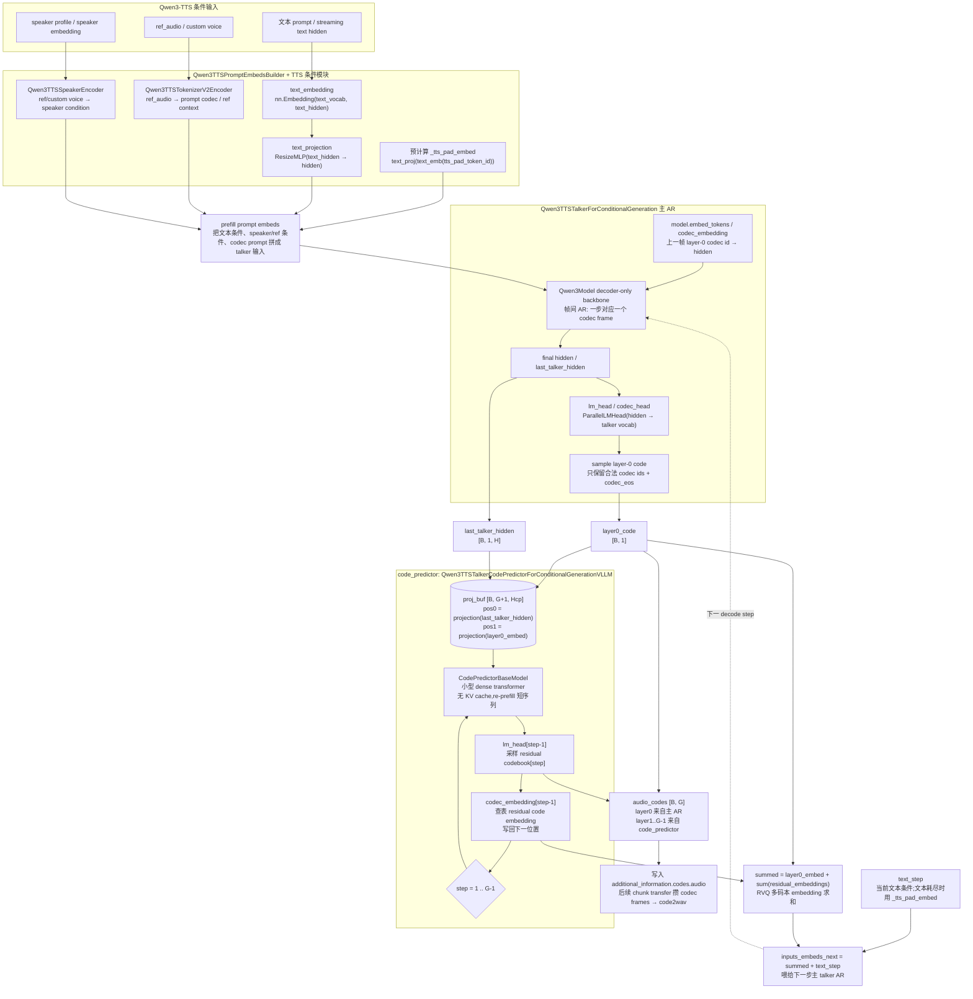

# Qwen3-TTS Talker 结构速记

> **文档版本**: 1.0
> **分析代码版本**: 当前 workspace 本地 `vllm-omni` 源码
> **最后更新**: 2026-06-07

---

## 1. Talker:文本/参考音频条件 → RVQ 多码本

这张图对应 Qwen3-Omni 文档里的 `1.3.2 Talker:文本 → RVQ 多码本的双路自回归`,但换成 Qwen3-TTS 的模块命名。结论先说:

**Qwen3-TTS 和 Qwen3-Omni Talker 在生成机制上本质同构**:

- 主 talker AR 负责帧间自回归,每步先生成 RVQ 的 layer-0 code;
- `code_predictor` 负责帧内 residual codebooks,顺序补出 layer 1 到 layer G-1;
- G 层 RVQ embedding 求和后,再加当前 text condition,反馈给下一步主 talker。

差异主要是**上游条件来源和封装边界**:Qwen3-Omni 的 talker 是 `Qwen3Omni` 顶层模型下的 `.talker` 子模块;Qwen3-TTS 自己就是 talker 模型,内部多了 prompt builder、speaker encoder、ref audio encoder/cache 这些 TTS 条件模块。

源码:
[qwen3_tts_talker.py](vllm-omni/vllm_omni/model_executor/models/qwen3_tts/qwen3_tts_talker.py),
[qwen3_tts_code_predictor_vllm.py](vllm-omni/vllm_omni/model_executor/models/qwen3_tts/qwen3_tts_code_predictor_vllm.py),
[common/qwen3_code_predictor.py](vllm-omni/vllm_omni/model_executor/models/common/qwen3_code_predictor.py)



## 2. 和 Qwen3-Omni Talker 的对应关系

| 维度 | Qwen3-Omni Talker | Qwen3-TTS Talker |
|------|-------------------|------------------|
| 顶层封装 | `Qwen3Omni` 里有 `.talker` 子模块 | 模型本身就是 `Qwen3TTSTalkerForConditionalGeneration` |
| 上游条件 | Thinker payload: layer0 hidden、accept hidden、tts_bos/eos/pad embed | prompt builder: text embedding、ref audio、speaker/custom voice |
| 主 AR | `Qwen3OmniMoeModel` talker backbone,每步出 layer-0 code | `Qwen3Model` talker backbone,每步出 layer-0 code |
| 帧内 residual | `Qwen3OmniMoeTalkerCodePredictor` | `Qwen3TTSTalkerCodePredictorForConditionalGenerationVLLM` |
| 反馈通路 | `summed_embeddings + text_step` | `layer0_embed + residual_embeddings.sum + text_step` |
| 输出 | `codes.audio` 给 Code2Wav | `codes.audio` 给 Code2Wav |

所以从模型算法看,两者确实是同一个套路:

```text
上一帧完整 RVQ embedding + 当前文本条件
    ↓
主 talker LLM
    ↓
layer-0 codec code
    ↓
code_predictor 补齐 residual codebooks
    ↓
G 层 codec embedding 求和
    ↓
反馈给下一帧
```

## 3. 为什么工程上看起来不一样

你的直觉“talker 感觉只是接口加一下就可以”基本成立,但要注意两个工程边界:

1. **Qwen3-Omni 天然有 stage 语义**  
   顶层模型有 `thinker / talker / code2wav`,runner 可以用 `getattr(model, "talker_mtp")` 找到一个明确的外部入口,再用 `getattr(model, "talker")` 判断它是 separate talker。

2. **Qwen3-TTS 是单 talker 模型**  
   它没有 `model.talker` 这一层,但它也暴露了 `talker_mtp()`。因此如果想让它完全复用 Qwen3-Omni 那种“外层 talker_mtp 整体入图”的策略,确实可以通过接口约定做到,比如让模型声明 `talker_mtp_graph_safe=True` 并保证内部不再 replay nested code_predictor graph。

3. **当前代码的差异更多是历史和安全边界**  
   Qwen3-TTS 的 `code_predictor` 自己带 `use_cuda_graphs=True`,有独立的 vLLM config、buffer、bucket 和 replay 逻辑;Qwen3-Omni CUDA 路径则把 code predictor 内图关掉,依赖 runner 包外层 `talker_mtp`。两条路线都能加速,但不能同时随便嵌套,否则会遇到 CUDA Graph capture/replay 嵌套安全问题。

一句话:**结构上它们是一致的;工程上一个把 graph 边界放在 `talker_mtp` 外面,一个把 graph 边界放在 `code_predictor` 里面。**

---

## 4. 设计:从 code_predictor 内部图迁移到 talker_mtp 外层图

这一节专门回答一个工程问题:Qwen3-TTS 当前已经给 `code_predictor` 做了 CUDA Graph,如果我们想和 Qwen3-Omni 对齐,把 graph 边界提升到 `talker_mtp`,需要怎么改,收益是什么。

### 4.1 当前 code_predictor 图怎么设计

源码入口:

- [qwen3_tts_code_predictor_vllm.py](vllm-omni/vllm_omni/model_executor/models/qwen3_tts/qwen3_tts_code_predictor_vllm.py):Qwen3-TTS 的 code predictor wrapper;
- [common/qwen3_code_predictor.py](vllm-omni/vllm_omni/model_executor/models/common/qwen3_code_predictor.py):通用 `CodePredictorWrapper`。

当前 Qwen3-TTS 的 code predictor 配置是:

```python
CodePredictorWrapperConfig(
    use_cuda_graphs=True,
    use_parallel_embedding=False,
    use_projection=(config.hidden_size != talker_config.hidden_size),
    return_proj_buf=False,
    sampling_mode="per_call",
)
```

也就是说,它是一个**自带 CUDA Graph 管理器的小模型 wrapper**。

关键点是:当前 graph 捕获的不是整个 `code_predictor.forward()`,而是内部的小 transformer forward:

```text
CodePredictorBaseModel.forward(proj_buf[:, :seq_len, :], pos_ids)
```

外面的 AR loop、lm_head、sampling、codec embedding 写回都还在 Python 路径里:

```text
for step in 1 .. G-1:
    hidden_out = replay_graph_or_compiled_forward(proj_buf slice, pos_ids)
    logits = lm_head[step-1](hidden_out[:, step, :])
    code = sample(logits)
    new_embed = codec_embedding[step-1](code)
    proj_buf[:, step+1, :] = projection(new_embed)
```

#### 当前图的输入/输出 buffer

当前 device graph 的输入 buffer 主要是:

```text
_proj_buf: [padded_bsz, G+1, hidden]
```

语义:

```text
proj_buf[:, 0, :] = projection(last_talker_hidden)
proj_buf[:, 1, :] = projection(layer0_embed)
proj_buf[:, 2, :] = residual codebook 1 的 embedding
proj_buf[:, 3, :] = residual codebook 2 的 embedding
...
```

每次 replay 实际读的是:

```text
proj_buf[:padded_bsz, :seq_len, :]
```

另一个输入是:

```text
_bucket_pos_ids[graph_key]: [padded_bsz, seq_len]
```

输出 buffer 是 capture 时保存的:

```text
static_output: [padded_bsz, seq_len, hidden]
```

运行时:

```python
graph.replay()
hidden_out = static_output
logits = lm_head[step - 1](hidden_out[:bsz, step, :])
```

所以当前内部 graph 的 IO 很窄:

```text
Graph 输入:  proj_buf slice + pos_ids
Graph 输出:  hidden_out
```

而完整 `code_predictor.forward()` 的输出:

```text
audio_codes [B, G]
```

是 Python loop 在 graph 外部逐步拼出来的。

#### 当前设计的特点

1. **按 batch size 分桶**  
   bucket 是 power-of-2:

   ```text
   1, 2, 4, 8, ... max_num_seqs
   ```

   graph key 通常是 `padded_bsz`。如果开启 prefix graphs,graph key 变成 `(padded_bsz, seq_len)`。

2. **torch.compile + CUDA Graph 组合**  
   CUDA 路径先 `torch.compile(self.model.forward, dynamic=False)`,再 capture compiled forward。这里还显式设置 `epilogue_fusion=False`,避免 RMSNorm/RoPE 融合带来的 float32 精度损失在残差 AR 多步里累积。

3. **graph 粒度偏内部**  
   它优化的是 code predictor 每个 residual step 里的 transformer re-prefill,但不覆盖 sampling、embedding 写回、`talker_mtp` 里的 summed embedding 反馈。

4. **容易和外层图形成嵌套风险**  
   如果 model runner 再把 `talker_mtp` 整体包 CUDA Graph,而 `code_predictor` 内部还 replay graph,就会出现 outer graph capture/replay 里嵌套 inner graph replay 的风险。Qwen3-Omni CUDA 路径之所以关闭 code predictor 内图,就是为了避免这个问题。

### 4.2 目标设计:把 graph 边界提升到 talker_mtp

目标不是把 `code_predictor` 的内部实现搬进 model runner,而是把 Qwen3-TTS 对齐成 Qwen3-Omni 的模型级 MTP hook:

```text
runner 管 graph:
    model.talker_mtp(input_ids, input_embeds, last_talker_hidden, text_step)

model 管语义:
    layer0 code
    residual codebooks
    embedding sum
    sampling
    next inputs_embeds
```

新的 graph 边界:

```text
talker_mtp graph 输入:
    talker_mtp_input_ids
    talker_mtp_inputs_embeds
    last_talker_hidden
    text_step

talker_mtp graph 输出:
    inputs_embeds_next
    audio_codes
```

也就是把下面整段都纳入同一个 CUDA Graph:

```text
projection(last_talker_hidden)
projection(layer0_embed)
for step in 1 .. G-1:
    code_predictor transformer forward
    lm_head
    sampling
    codec_embedding
    write proj_buf
RVQ embeddings sum
+ text_step
return next inputs_embeds + audio_codes
```

主 talker LLM forward 仍然走 vLLM 原生 CUDA Graph。完整 decode step 变成两张图串联:

```text
Graph A: talker_mtp
    生成上一帧完整 RVQ codes
    写回本步 inputs_embeds

Graph B: main talker LLM forward
    vLLM 原生 graph
    产出本步 hidden / 下一次 layer-0 logits
```

### 4.3 需要修改什么

#### 模型侧

1. **声明 `talker_mtp` 可由外层 graph 捕获**

Qwen3-TTS 已经有 `talker_mtp()` 方法。需要让 runner 知道它可以被外层包图:

```python
self.talker_mtp_graph_safe = True
```

`OmniGPUModelRunner._init_talker_mtp()` 里已有逻辑:

```python
has_separate_talker = getattr(self.model, "talker", None) is not None
talker_mtp_graph_safe = getattr(self.model, "talker_mtp_graph_safe", False)
if cudagraph_mode.has_full_cudagraphs() and (has_separate_talker or talker_mtp_graph_safe):
    self.talker_mtp = graph_wrapper_cls(talker_mtp, self.vllm_config, runtime_mode=CUDAGraphMode.FULL)
```

Qwen3-TTS 没有 `.talker`,所以需要靠 `talker_mtp_graph_safe=True` 打开外层 graph。

2. **关闭 code_predictor 内部 CUDA Graph**

当前 Qwen3-TTS 是:

```python
use_cuda_graphs=True
```

迁移后应改成:

```python
use_cuda_graphs=False
```

或者做成配置:

```text
code_predictor_use_inner_cudagraph = false
talker_mtp_use_outer_cudagraph = true
```

原则是:同一个 CUDA 路径里不要同时启用 inner code_predictor graph 和 outer talker_mtp graph。

3. **保留 CodePredictorWrapper 的非 graph 职责**

不要把 `CodePredictorWrapper` 整个删掉。它仍然负责:

```text
proj_buf 管理
position ids
projection
residual codebook AR loop
lm_head / codec_embedding
sampling mode
```

只是 `_device_graphs` 不再使用,让这些 op 被外层 `talker_mtp` graph capture。

4. **确认 `talker_mtp()` graph-safe**

需要检查并约束:

- 不在 capture/replay 路径里做 CPU sync,比如 `.item()`、CPU tensor 依赖、动态 Python 分支;
- tensor shape 对 batch bucket 稳定;
- sampling 参数在 capture 后不能改变 graph 结构;
- `torch.Generator` 显式 seed 的多请求路径仍然走 scalar fallback,避免 batch 内随机数流互相影响。

#### Runner 侧

现有 runner 已经有大部分能力:

```text
_init_talker_mtp()
    找 model.talker_mtp
    包 CUDAGraphWrapper
    分配 4 个稳定输入 buffer

_talker_mtp_forward()
    按 decode_batch_size 调 _determine_batch_execution_and_padding
    从固定 buffer 切出 padded batch
    调 wrapped talker_mtp
    写回 inputs_embeds 和 additional_information.codes.audio
```

因此 runner 侧预期只需要小改:

1. 允许 Qwen3-TTS 通过 `talker_mtp_graph_safe=True` 走外层 graph;
2. 确认 `_capture_talker_mtp_graphs()` 对无 `.talker` 的 TTS 模型也会执行;
3. 增加测试覆盖:Qwen3-TTS outer `talker_mtp` graph on/off 的一致性和显式 seed fallback。

### 4.4 收益

#### 1. graph 粒度更完整

当前内部 graph 只覆盖:

```text
CodePredictorBaseModel.forward
```

迁移到 `talker_mtp` 外层 graph 后覆盖:

```text
projection
code_predictor residual loop
lm_head
sampling
codec embedding
embedding sum
text_step add
audio_codes output
```

这会进一步减少小 kernel launch 和 Python 调度开销。

#### 2. Qwen3-TTS 和 Qwen3-Omni Talker 路径统一

两者都变成:

```text
model exposes talker_mtp()
runner owns talker_mtp graph
model owns MTP semantics
```

runner 不需要理解 code predictor 内部细节,后续新 TTS/Omni talker 只要实现同一个 `talker_mtp` hook。

#### 3. 避免 nested graph 风险

把 graph 边界统一放到 `talker_mtp` 外面后,可以明确关闭 inner graph:

```text
inner code_predictor graph: off
outer talker_mtp graph: on
```

这比“外层可能 capture、内层也可能 replay”的组合更容易维护。

#### 4. 更符合实际 batch 语义

`talker_mtp` 的 batch 语义是:

```text
decode_batch_size = 本 step 有多少条请求需要补一帧 RVQ
```

这个和 model runner 已经维护的 decode request 集合一致。相比之下,code predictor 内部只知道自己的 `bsz`,不知道它和 vLLM scheduler step 的关系。

### 4.5 风险和注意点

1. **sampling 是否能稳定 capture**  
   如果 `torch.multinomial` 在目标 CUDA/PyTorch 版本下 capture 不稳定,外层 `talker_mtp` graph 会失败。当前 Qwen3-Omni 能这么做,说明这条路径在目标环境可行;迁移 Qwen3-TTS 时仍要单独做 accuracy/consistency 验证。

2. **显式 seed 的可复现性**  
   runner 里已有逻辑:batch 内只要有请求设置 `qwen3_tts_request_seed`,就 fallback row-by-row。迁移后必须保留这个行为。

3. **torch.compile 与 outer graph 的组合**  
   code predictor 仍可保留 `torch.compile(dynamic=False, epilogue_fusion=False)`,但不再自己 capture。要验证 compiled callable 能被外层 `talker_mtp` graph 正常 capture。

4. **NPU/ROCm 平台要分开处理**  
   NPU 可能仍更依赖内部 NPUGraph 覆盖;ROCm 上 graph capture 安全性也要单独看。建议先限定 CUDA/H100 路径,平台 fallback 保持原逻辑。

### 4.6 推荐迁移顺序

1. 给 Qwen3-TTS 增加配置开关,支持关闭 code predictor inner graph;
2. 给 Qwen3-TTS 声明 `talker_mtp_graph_safe=True`;
3. 跑 Qwen3-TTS eager / inner graph / outer talker_mtp graph 三组一致性测试;
4. 观察 `talker_mtp` graph capture 是否覆盖目标 batch buckets;
5. 再考虑默认切到 outer graph。

最终目标:

```text
Qwen3-TTS CUDA:
    main talker LLM graph: vLLM 原生
    talker_mtp graph: runner 管
    code_predictor inner graph: off

Qwen3-Omni CUDA:
    main talker LLM graph: vLLM 原生
    talker_mtp graph: runner 管
    code_predictor inner graph: off
```

这样两套 talker 的 graph 策略就对齐了。

---

## 5. Runner 里的 talker_mtp 执行顺序

这一节把 `OmniGPUModelRunner` 里和 `talker_mtp` 相关的路径按真实执行顺序串起来。注意一个容易误解的点:

**`talker_mtp` 不是主 talker forward 之后的后处理,而是在 `_preprocess()` 里前置执行。**  
原因是 `talker_mtp` 的输出 `req_embeds` 要写回本步 `inputs_embeds`,主 talker LLM forward 随后要吃这个输入。

真实顺序是:

```text
_preprocess()
  ↓
收集本 step 的 decode requests
  ↓
把每条请求的 MTP 输入写入固定 GPU buffer
  ↓
_talker_mtp_forward()
  ↓
把 MTP 返回的 req_embeds 写回 inputs_embeds
  ↓
把 MTP 返回的 audio codes 写入 additional_information.codes.audio
  ↓
_model_forward()
  ↓
主 talker LLM 读取更新后的 inputs_embeds
```

### 5.1 初始化:识别 talker_mtp 并分配固定 buffer

源码:[gpu_model_runner.py `_init_talker_mtp`](vllm-omni/vllm_omni/worker/gpu_model_runner.py)

runner 在 `load_model()` 后调用 `_init_talker_mtp()`:

```python
talker_mtp = getattr(self.model, "talker_mtp", None)
if talker_mtp is None:
    return
self.talker_mtp = talker_mtp
self.has_talker_mtp = True
```

如果当前开了 full cudagraph,并且模型满足以下任一条件:

```text
has_separate_talker = getattr(model, "talker", None) is not None
talker_mtp_graph_safe = getattr(model, "talker_mtp_graph_safe", False)
```

就把 `talker_mtp` 用平台 graph wrapper 包起来:

```python
graph_wrapper_cls = current_omni_platform.get_graph_wrapper_cls()
self.talker_mtp = graph_wrapper_cls(
    talker_mtp,
    self.vllm_config,
    runtime_mode=CUDAGraphMode.FULL,
)
```

Qwen3-Omni 因为顶层模型有 `.talker`,天然满足 `has_separate_talker=True`。Qwen3-TTS 没有 `.talker`,如果要复用这条外层图路径,需要模型声明:

```python
self.talker_mtp_graph_safe = True
```

随后 runner 分配 4 个固定 GPU buffer:

```python
self.talker_mtp_input_ids
self.talker_mtp_inputs_embeds
self.last_talker_hidden
self.text_step
```

这些 buffer 的作用是给 CUDA Graph replay 提供稳定地址。每个 decode step 只是把新请求的数据 copy 到同一批地址里。

### 5.2 `_preprocess()` 收集 decode 请求

源码:[gpu_model_runner.py `_preprocess`](vllm-omni/vllm_omni/worker/gpu_model_runner.py)

`_preprocess()` 里先准备三个列表:

```python
decode_req_ids = []
decode_start_offsets = []
decode_batch_items = []
```

含义:

```text
decode_req_ids      本 step 哪些请求要跑 MTP
decode_start_offsets 这些请求在本次 inputs_embeds 大 batch 里的 row offset
decode_batch_items  临时攒起来,用于 batch preprocess
```

runner 遍历当前 scheduler batch:

```python
for req_index, req_id in enumerate(self.input_batch.req_ids):
    start_offset = int(self.query_start_loc.cpu[req_index])
    sched_tokens = int(num_scheduled_tokens_np[req_index])
    s, e = start_offset, start_offset + sched_tokens
    span_len = int(e) - int(s)
```

只对 decode 单步走 MTP fast path:

```text
span_len == 1
and not is_prefill
and self.has_talker_mtp
```

prefill 不跑 MTP。因为 prefill 阶段是在准备 prompt/上下文,真正“补上一帧 RVQ residual codebooks + 准备下一步输入”的逻辑从 decode 阶段开始。

### 5.3 batch preprocess:准备 MTP 输入

如果模型实现了 `preprocess_decode_batch`,runner 会先攒一批 decode rows,再通过 `flush_decode_batch()` 一次处理:

```python
req_input_ids, req_embeds, last_talker_hidden, text_step, updates = (
    batch_decode_preprocess(
        input_ids=ids_b,
        req_infos=req_infos_b,
    )
)
```

返回的 4 个张量就是 `talker_mtp()` 的输入:

| 张量 | 含义 |
|------|------|
| `req_input_ids` | 当前 layer-0 codec token id |
| `req_embeds` | 当前 layer-0 codec embedding |
| `last_talker_hidden` | 上一步主 talker LLM 产出的 hidden |
| `text_step` | 当前文本条件 embedding;文本耗尽时通常是 `tts_pad_embed` |

然后写入固定 buffer:

```python
dst = slice(len(decode_req_ids), len(decode_req_ids) + len(req_ids_b))
self.talker_mtp_input_ids.gpu[dst].copy_(req_input_ids.reshape(-1))
self.talker_mtp_inputs_embeds.gpu[dst].copy_(req_embeds)
self.last_talker_hidden.gpu[dst].copy_(last_talker_hidden)
self.text_step.gpu[dst].copy_(text_step)
```

同时记录请求 id 和 row offset:

```python
decode_req_ids.extend(req_ids_b)
decode_start_offsets.extend(start_offsets_b)
```

如果模型没有 batch preprocess,runner 会逐条调用:

```python
req_input_ids, req_embeds, update_dict = self.model.preprocess(...)
```

只要返回的 `update_dict` 里有:

```python
update_dict["mtp_inputs"] = (last_talker_hidden, text_step)
```

runner 也会把同样 4 个输入写进固定 buffer。

### 5.4 `_talker_mtp_forward()`:按 decode_batch_size 选图

所有 decode rows 收集完后:

```python
flush_decode_batch()
if self.has_talker_mtp:
    self._talker_mtp_forward(decode_req_ids, inputs_embeds, decode_start_offsets)
```

`_talker_mtp_forward()` 先按本 step 的 decode 请求数选择 cudagraph bucket:

```python
decode_batch_size = len(decode_req_ids)
_cudagraph_mode, batch_desc, _, _, _ = self._determine_batch_execution_and_padding(
    num_tokens=decode_batch_size,
    num_reqs=decode_batch_size,
    num_scheduled_tokens_np=np.ones(decode_batch_size, dtype=np.int32),
    max_num_scheduled_tokens=1,
    use_cascade_attn=False,
)
```

这里故意把:

```text
num_tokens = decode_batch_size
num_reqs = decode_batch_size
max_num_scheduled_tokens = 1
```

因为 `talker_mtp` 对每条 decode request 只补一帧 RVQ。

如果 `talker_mtp` 没有被平台 graph wrapper 包住,runner 强制 eager:

```python
if not isinstance(self.talker_mtp, current_omni_platform.get_graph_wrapper_cls()):
    _cudagraph_mode = CUDAGraphMode.NONE
    num_tokens_padded = decode_batch_size
else:
    num_tokens_padded = batch_desc.num_tokens
```

这个分支的意义是:未被外层 wrapper 管理时,`code_predictor` 可能有自己的内部 graph,runner 不再尝试给外层 `talker_mtp` 做图,避免嵌套 graph 风险。

然后从固定 buffer 里切出 padded batch:

```python
req_input_ids = self.talker_mtp_input_ids.gpu[:num_tokens_padded]
req_embeds = self.talker_mtp_inputs_embeds.gpu[:num_tokens_padded]
last_talker_hidden = self.last_talker_hidden.gpu[:num_tokens_padded]
text_step = self.text_step.gpu[:num_tokens_padded]
```

如果真实 decode batch 是 37,而 graph bucket 是 64,这里传给 `talker_mtp` 的就是前 64 行;前 37 行有效,后面是 padding 区。

### 5.5 显式 seed 的可复现 fallback

`_talker_mtp_forward()` 里有一段特殊逻辑:

```python
if decode_batch_size > 1 and any(_explicit_talker_seed(req_id) is not None for req_id in decode_req_ids):
    ...
    for row, req_id in enumerate(decode_req_ids):
        self._talker_mtp_forward([req_id], inputs_embeds, row_offsets)
    return
```

原因:`torch.Generator` 是单状态流。多请求共用一个 generator 时,B 请求拿到的随机数会依赖 A 请求是否和它同 batch,这会破坏显式 seed 的可复现性。

所以只要 batch 内有请求设置了:

```text
qwen3_tts_request_seed
```

runner 就退回 row-by-row。性能会差一些,但语义正确。

### 5.6 调用 wrapped talker_mtp

真正调用发生在:

```python
with current_omni_platform.set_forward_context(
    None,
    self.vllm_config,
    cudagraph_runtime_mode=_cudagraph_mode,
    batch_descriptor=batch_desc,
):
    req_embeds, code_predictor_codes = self.talker_mtp(
        req_input_ids,
        req_embeds,
        last_talker_hidden,
        text_step,
        **talker_kwargs,
    )
```

如果 `self.talker_mtp` 是 `CUDAGraphWrapper`,wrapper 会读取 forward context 里的:

```text
cudagraph_runtime_mode
batch_descriptor
```

然后决定:

```text
NONE                    → eager
FULL + graph 不存在     → capture
FULL + graph 已存在     → replay
```

`talker_mtp()` 的输出语义是:

| 输出 | 含义 |
|------|------|
| `req_embeds` | 本步主 talker LLM 应该吃的 `inputs_embeds` |
| `code_predictor_codes` | 本步生成的完整 RVQ audio codes |

### 5.7 写回 inputs_embeds 和 codes.audio

调用结束后,runner 把输出拆回每条请求:

```python
out_key = getattr(self.model, "talker_mtp_output_key", ("codes", "audio"))

for idx, (req_id, start_offset) in enumerate(zip(decode_req_ids, start_offsets, strict=True)):
    inputs_embeds[start_offset : start_offset + 1] = req_embeds[idx : idx + 1]
    update_dict = {out_key[0]: {out_key[1]: code_predictor_codes[idx : idx + 1]}}
    self._merge_additional_information_update(req_id, update_dict)
```

默认 `out_key` 是:

```python
("codes", "audio")
```

所以等价于:

```python
additional_information["codes"]["audio"] = code_predictor_codes[idx : idx + 1]
```

两个写回动作分别服务不同下游:

```text
inputs_embeds[start_offset] = req_embeds[idx]
    给本步主 talker LLM forward 使用

additional_information.codes.audio = code_predictor_codes[idx]
    给后续 talker → code2wav connector 使用
```

### 5.8 主 talker forward 在 MTP 之后

`_preprocess()` 返回后,runner 才进入主模型 forward:

```python
outputs = self.model(
    input_ids=input_ids,
    positions=positions,
    intermediate_tensors=intermediate_tensors,
    inputs_embeds=inputs_embeds,
    **model_kwargs,
)
```

此时 `inputs_embeds` 已经被 `_talker_mtp_forward()` 改过了。主 talker LLM 的本步 hidden 会在后续 postprocess/preprocess 中成为下一步的 `last_talker_hidden`。

### 5.9 总结:为什么 MTP 必须前置

`talker_mtp` 一个 step 同时做两件事:

```text
1. 用上一帧 hidden + layer-0 code 补齐上一帧完整 RVQ codes
   → 写 additional_information.codes.audio

2. 把上一帧完整 RVQ embeddings 求和,再加当前 text_step
   → 写成本步主 talker LLM 的 inputs_embeds
```

第 2 件事决定了它必须在主 talker forward 之前执行。否则主 LLM 本步就拿不到“上一帧我实际说了什么”的 RVQ 反馈。

所以可以把这条路径理解成:

```text
MTP graph:
    last_talker_hidden_(t-1)
    + layer0_code_(t-1)
    + text_step_t
        ↓
    full_codes_(t-1)
    + inputs_embeds_t

main talker LLM graph:
    inputs_embeds_t
        ↓
    last_talker_hidden_t
    + layer0_code_t
```

这也是为什么 runner 要为 `talker_mtp` 单独维护固定 buffer 和单独的 batch descriptor:它是主 talker LLM forward 之前的一个独立子 forward,但又和主 forward 的输入输出紧密相连。
