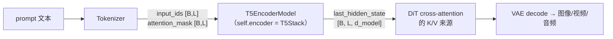
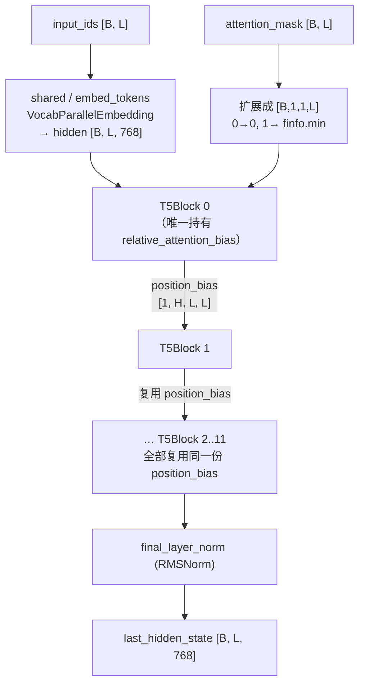

# vLLM-Omni T5 文本编码器模型结构与张量并行代码走读

> **文档版本**: 1.0  
> **分析代码版本**: 当前 workspace 本地 `vllm-omni` 源码  
> **配套配置**: `t5_base_config.json`（原版 `t5-base`，`T5ForConditionalGeneration`）  
> **最后更新**: 2026-06-14

---

## 文档概述

本文按 **自顶向下** 的顺序梳理 vLLM-Omni 中 T5 文本编码器的模型结构：先讲清楚它在扩散（diffusion）模型里扮演什么角色、为什么需要它，再用 `t5_base_config.json` 把抽象超参数落成具体张量形状，然后逐层走读 [`t5_encoder.py`](../../vllm-omni/vllm_omni/diffusion/models/t5_encoder/t5_encoder.py) 里的 `T5EncoderModel`、`T5Stack`、`T5Block`、`T5SelfAttention`、FFN，重点剖析 **相对位置偏置（relative position bias）** 与 **张量并行（TP）切分** 这两块。最后对比 T5Gemma 变体与 Ming 的 byte5 mapper，并把它接回 Wan2.2 / Flux 这些 pipeline。

每讲一个 layer，除了贴代码，还会给一段「这层到底在干什么」的直观理解——T5 有几个反直觉的设计（不加绝对位置、attention 不缩放、位置偏置全网共享），只看代码很容易记成「就是这么写的」，本文尽量把背后的本质说清楚。

**目标读者**: 希望理解 T5 encoder 在 vLLM-Omni 里如何把一句 prompt 编码成 `prompt_embeds`、并能讲清楚相对位置偏置和 TP 权重加载细节的工程师。

**阅读指南**:

| 部分 | 内容 | 重点 |
|------|------|------|
| 第一部分 | T5 在 vllm-omni 中的定位 | text encoder、三套实现、为什么只用 encoder |
| 第二部分 | 用 `t5-base` config 落地 shape | 超参数 → 张量维度 → 每层参数量 |
| 第三部分 | `T5EncoderModel` 整体结构 | 模块图、forward 主流程 |
| 第四部分 | 逐层代码走读 | Embedding、SelfAttention、相对位置偏置、Pre-Norm、FFN |
| 第五部分 | 张量并行切分 | QKV 融合、行/列并行、bias 按 head 切、权重加载映射 |
| 第六部分 | T5Gemma 变体 | RoPE + GQA + sandwich norm，与经典 T5 的差异 |
| 第七部分 | byte5 mapper 复用 | `T5Block` 当特征映射器用 |
| 第八部分 | 在 pipeline 中怎么用 | Wan2.2 / Flux 的 encode_prompt、CFG |
| 第九部分 | 工程总结与本质理解 | 一句话架构、易错点 |

---

# 第一部分: T5 在 vLLM-Omni 中的定位

## 1.1 它不是一个「会说话」的模型，而是 prompt 编码器

vllm-omni 里的 T5 **不是**用来做翻译/摘要的生成模型，而是扩散模型的 **文本条件编码器（text encoder）**：把用户的 prompt 编码成一串 `[B, L, d_model]` 的隐藏状态（`last_hidden_state`），作为 DiT（Diffusion Transformer）做 cross-attention 时的 key/value 来源。换句话说，T5 在这里只负责回答一个问题：

> 「这句话每个 token 的语义向量是什么？」

至于「根据这些语义画出/生成什么」，是后面的 DiT + VAE 的事。所以 vllm-omni 只需要 T5 的 **encoder**，完全不需要 decoder。

注意配套的 `t5_base_config.json` 第一行写的是：

```json
"architectures": ["T5ForConditionalGeneration"],
"is_encoder_decoder": true,
```

这是一个完整的「编码器-解码器」配置，但 vllm-omni 的 [`T5EncoderModel`](../../vllm-omni/vllm_omni/diffusion/models/t5_encoder/t5_encoder.py#L325) 只实例化了 `self.shared`（词嵌入）和 `self.encoder`（`T5Stack`），decoder 部分根本不会被构造。加载权重时 decoder 的参数会因为名字不在 `params_dict` 里而被自然跳过。

## 1.2 三套 T5 实现，定位不同

代码库里其实有三套与 T5 相关的实现，别混淆：

| 文件 | 类 | 用途 | 位置编码 |
|------|------|------|----------|
| [`t5_encoder.py`](../../vllm-omni/vllm_omni/diffusion/models/t5_encoder/t5_encoder.py) | `T5EncoderModel` | 经典 encoder-only T5，**自研 TP 版** | 相对位置偏置 |
| [`t5_gemma_encoder.py`](../../vllm-omni/vllm_omni/diffusion/models/t5_encoder/t5_gemma_encoder.py) | `T5GemmaEncoderModelTP` | T5Gemma 架构，magi_human 用 | RoPE |
| [`t5_block_mapper.py`](../../vllm-omni/vllm_omni/diffusion/models/ming_flash_omni/t5_block_mapper.py) | `T5EncoderBlockByT5Mapper` | 复用 `T5Block` 做 byte5 特征映射 | 相对位置偏置 |

本文以第一套为主线（第四、五部分），第六、七部分讲后两套。

另外要分清「自研 TP 版」和「HF 原生版」：有些 pipeline（如 [Wan2.2](../../vllm-omni/vllm_omni/diffusion/models/wan2_2/pipeline_wan2_2.py#L357)、SD3、Stable Audio）直接 `from transformers import ... UMT5EncoderModel/T5EncoderModel`，用的是 HuggingFace 原生实现；而 [Flux](../../vllm-omni/vllm_omni/diffusion/models/flux/pipeline_flux.py#L107)、[HunyuanVideo 1.5](../../vllm-omni/vllm_omni/diffusion/models/hunyuan_video/pipeline_hunyuan_video_1_5.py#L125) 等用的是 vllm-omni 自研的 `T5EncoderModel`——它的价值就在于把 HF 的串行实现重写成了 **支持张量并行** 的版本。



---

# 第二部分: 用 `t5-base` config 把超参数落成 shape

在读 layer 之前，先把 `t5_base_config.json` 的关键字段翻译成具体张量维度。后面所有 shape 例子都用这组数：

```json
"d_model": 768,                       // 隐藏维度 D
"d_kv": 64,                           // 每个 head 的维度 d_kv
"num_heads": 12,                      // head 数 H
"num_layers": 12,                     // encoder block 层数
"d_ff": 3072,                         // FFN 中间维度
"vocab_size": 32128,                  // 词表大小
"relative_attention_num_buckets": 32, // 相对位置分桶数
"layer_norm_epsilon": 1e-06,
"n_positions": 512                    // 最大序列长度
```

派生出来的关键量：

| 量 | 公式 | `t5-base` 取值 | 含义 |
|----|------|---------------|------|
| `inner_dim` | `num_heads * d_kv` | `12 * 64 = 768` | 注意力内部维度 |
| q/k/v 投影 shape | `d_model → inner_dim` | `768 → 768` | 注意 `inner_dim == d_model`（很多 T5 配置不成立） |
| 单层 attention 参数 | `4 * d_model * inner_dim` | `≈ 2.36M` | q,k,v,o 四个无 bias 矩阵 |
| 单层 FFN 参数（非门控） | `2 * d_model * d_ff` | `≈ 4.72M` | wi + wo |
| 相对位置偏置表 | `num_buckets × num_heads` | `32 × 12 = 384` | 全模型只在第 0 层有一份 |

一个直观感受：T5-base 的注意力 head 维度是 64，12 个 head 拼起来恰好 768 = `d_model`。但在大模型里 `inner_dim` 经常 **大于** `d_model`（例如 T5-3B 的 `d_kv=128, num_heads=32 → inner_dim=4096`，而 `d_model=1024`），所以代码里 `inner_dim` 和 `d_model` 是严格分开的两个变量，不能假设相等：

```python
# t5_encoder.py:33-36
self.d_model = config.d_model          # 768
self.d_kv = config.d_kv                # 64
self.n_heads = config.num_heads        # 12
self.inner_dim = self.n_heads * self.d_kv   # 768，但一般 != d_model
```

还有一个 config 细节决定 FFN 走哪条路：`t5-base` 是 **原版 T5 v1.0**，`feed_forward_proj="relu"`、`is_gated_act=False`，所以走非门控的 `T5DenseActDense`（ReLU）。而 T5 v1.1 / FLAN-T5 / 很多扩散模型用的 T5-XXL 是 `gated-gelu`，走 `T5DenseGatedActDense`（第四部分细讲）。

---

# 第三部分: `T5EncoderModel` 整体结构

## 3.1 模块树

```
T5EncoderModel                                  (t5_encoder.py:325)
├── shared: VocabParallelEmbedding              # [vocab=32128, d_model=768]，词表维并行
└── encoder: T5Stack                            (t5_encoder.py:287)
    ├── embed_tokens  ← 复用 shared（tied weights）
    ├── block: [T5Block × 12]                   (t5_encoder.py:266)
    │   └── layer: ModuleList[
    │         T5LayerSelfAttention,  # layer[0]：RMSNorm + T5SelfAttention + 残差
    │         T5LayerFF              # layer[1]：RMSNorm + DenseReluDense + 残差
    │       ]
    └── final_layer_norm: RMSNorm               # [768]
```

模块命名（`SelfAttention`、`layer.0/1`、`DenseReluDense`、`o`、`wi/wo`）刻意对齐 HuggingFace，目的是能直接吃 HF checkpoint（权重加载映射见第五部分）。



这张图里最值得记住的一根线是 **`position_bias` 从 Block 0 一路透传到 Block 11**——这是 T5 区别于绝大多数 transformer 的结构特征，下一部分专门讲。

## 3.2 forward 主流程

```python
# t5_encoder.py:299-322  (T5Stack.forward)
def forward(self, input_ids, attention_mask=None):
    hidden_states = self.embed_tokens(input_ids)            # [B, L, 768]

    if attention_mask is not None:
        extended_mask = attention_mask[:, None, None, :].to(dtype=hidden_states.dtype)
        extended_mask = (1.0 - extended_mask) * torch.finfo(hidden_states.dtype).min
    else:
        extended_mask = None

    position_bias = None                                    # 初始为空
    for block in self.block:
        hidden_states, position_bias = block(
            hidden_states, mask=extended_mask, position_bias=position_bias,
        )                                                   # 第 0 块算出 bias，后续块复用

    hidden_states = self.final_layer_norm(hidden_states)    # [B, L, 768]
    return hidden_states
```

注意 `position_bias` 在循环外初始化为 `None`，第 0 个 block 计算出来后赋值回去，从第 1 个 block 开始就一直复用同一份。这就是「全网共享位置偏置」在代码里的落地。

mask 的处理也值得停一下：`attention_mask` 里 1 表示有效 token、0 表示 padding。`(1.0 - mask) * finfo.min` 把有效位变成 `0`、padding 位变成一个极大负数（≈ `-3.4e38`）。这个加性 mask 之后会被加到 attention logits 上，softmax 后 padding 位的权重趋近 0——即「让 query 看不到 padding」。

---

# 第四部分: 逐层代码走读

## 4.1 Embedding：`VocabParallelEmbedding` 与 tied weights

```python
# t5_encoder.py:332-333
self.shared = VocabParallelEmbedding(config.vocab_size, config.d_model)  # [32128, 768]
self.encoder = T5Stack(config, self.shared, ...)  # 把 shared 传进去当 embed_tokens
```

`T5Stack.__init__` 里直接 `self.embed_tokens = shared`（[t5_encoder.py:290](../../vllm-omni/vllm_omni/diffusion/models/t5_encoder/t5_encoder.py#L290)），所以 `shared` 和 `encoder.embed_tokens` 是 **同一个对象**——这就是 T5 的 tied embedding。第五部分会看到权重加载为此做了双向名字映射。

`VocabParallelEmbedding` 沿 **词表维** 切分：TP=2 时 rank0 持有 token 0..16063、rank1 持有 16064..32127 的 embedding 行，查表后各 rank 通过 all-reduce 拿到完整 `[B, L, 768]`。

**直观理解**：embedding 把离散 token id 映射成连续向量。注意这里查完表 **没有** 加任何位置信息——这是 T5 和 BERT/GPT 的第一个大区别。位置信息完全交给注意力里的相对位置偏置，输入侧是「纯语义」的。

## 4.2 `T5SelfAttention`：T5 的心脏

先看初始化，注意 vllm-omni 把 HF 的三个独立 q/k/v 矩阵融合成了一个 `qkv_proj`：

```python
# t5_encoder.py:48-64
self.qkv_proj = QKVParallelLinear(
    hidden_size=self.d_model,        # 768
    head_size=self.d_kv,             # 64
    total_num_heads=self.n_heads,    # 12
    total_num_kv_heads=self.n_heads, # 12 —— T5 是 MHA，不是 GQA
    bias=False,
)
self.o = RowParallelLinear(self.inner_dim, self.d_model, bias=False,
                           input_is_parallel=True, return_bias=False)
if has_relative_attention_bias:      # 只有 block 0 为 True
    self.relative_attention_bias = nn.Embedding(self.relative_attention_num_buckets, self.n_heads)  # [32, 12]
```

forward 的核心：

```python
# t5_encoder.py:120-165  (节选)
qkv, _ = self.qkv_proj(hidden_states)
query_states, key_states, value_states = qkv.split([q_size, kv_size, kv_size], dim=-1)
# reshape → [B, H_local, L, d_kv]

scores = torch.matmul(query_states, key_states.transpose(3, 2))   # [B, H_local, L, L]，注意：没有除以 sqrt(d)

if position_bias is None:                       # 只有 block 0 会进这里
    if self.has_relative_attention_bias:
        position_bias = self.compute_bias(seq_length, seq_length, device=scores.device)
    else:
        position_bias = torch.zeros(...)        # 兜底（理论上不会走到，因为 block0 必有 bias）
    if mask is not None:
        position_bias = position_bias + mask     # 把 padding mask 合并进 bias 一起透传

scores += position_bias                          # 相对位置偏置 + padding mask
attn_weights = F.softmax(scores.float(), dim=-1).type_as(scores)
attn_output = torch.matmul(attn_weights, value_states)   # [B, H_local, L, d_kv]
attn_output = self.o(attn_output.transpose(1,2).reshape(B, L, -1))
```

这里有两个反直觉点，必须讲清楚：

**(1) attention 不缩放**。绝大多数 transformer 算 `softmax(QKᵀ / √d_kv)`，这里却是裸的 `QKᵀ`。不是 bug——T5 把 `1/√d_kv` 这个缩放因子 **折叠进了权重初始化**（query 矩阵初始化时方差按比例缩小），所以推理时不需要再除。复刻 HF T5 必须照搬这一点，否则数值对不上。

**(2) padding mask 被合并进 `position_bias` 一起透传**。第 0 层把 `mask` 加进 `position_bias` 之后，后续 11 层直接复用这个「bias + mask」的合体，不再单独处理 mask（因为 `position_bias is None` 不成立，整段 if 被跳过）。所以一份 `[1, H, L, L]`（或广播后含 batch）的张量同时承载了「相对位置」和「哪些位能看」两件事。

## 4.3 相对位置偏置：T5 最有辨识度的设计

`compute_bias` 算出一个加到 attention logits 上的偏置，**只依赖 query 位置 i 和 key 位置 j 的相对距离 `j - i`**，与绝对位置无关：

```python
# t5_encoder.py:98-118  (节选)
context_position = torch.arange(query_length)[:, None]   # i
memory_position  = torch.arange(key_length)[None, :]     # j
relative_position = memory_position - context_position   # j - i，形状 [L, L]
relative_position_bucket = self._relative_position_bucket(relative_position, bidirectional=True, ...)
values = self.relative_attention_bias(relative_position_bucket)  # [L, L, H]
# … 按 TP rank 切出本地 head …
values = values.permute(2, 0, 1).unsqueeze(0)            # [1, H_local, L, L]
```

分桶函数 `_relative_position_bucket` 的逻辑（[t5_encoder.py:70-96](../../vllm-omni/vllm_omni/diffusion/models/t5_encoder/t5_encoder.py#L70-L96)）：

```python
num_buckets //= 2                                        # 双向：32 → 16，左右各一半
relative_buckets += (relative_position > 0) * num_buckets # j 在 i 右边，桶号 +16
relative_position = torch.abs(relative_position)
max_exact = num_buckets // 2                             # 8：距离 <8 的精确分桶
is_small = relative_position < max_exact
relative_position_if_large = max_exact + (log(rp/max_exact)/log(max_dist/max_exact)*(num_buckets-max_exact)).long()
relative_buckets += torch.where(is_small, relative_position, clip(relative_position_if_large, ..., 15))
```

**直观理解**（这段是 T5 的精髓）：

- T5 不往 token 向量里加「你是第几个词」，而是学一张表：**「相距 d 个位置的两个 token，注意力 logit 该加多少」**。这张表 `[num_buckets, num_heads]` 对每个 head 学一组偏置。
- 为什么要 **分桶（bucket）**？相邻的位置差异很重要（差 1 和差 2 含义不同），但相距 200 和相距 201 几乎没区别。所以近距离（<8）一个距离一个桶（精确），远距离按 **对数** 压缩共享桶（粗粒度，到桶 15 封顶）。这样有限的 32 个桶既能精细刻画局部、又能覆盖任意长序列。
- `bidirectional=True`：encoder 是双向的，「j 在 i 左边」和「j 在 i 右边」用不同的桶（前 16 vs 后 16），所以模型能区分前文和后文。
- 最妙的一点：因为它只依赖相对距离，**这张表对任意序列长度都成立**，天然外推到比训练更长的序列。这也是为什么扩散模型偏爱 T5 编码长 prompt。

一个具体例子（`t5-base`，`num_buckets=32`）：

| 相对距离 `j-i` | 是否 small | 桶号 |
|----------------|-----------|------|
| `0`（自己） | 是 | `0` |
| `+1`（右邻） | 是 | `16 + 1 = 17` |
| `-1`（左邻） | 是 | `0 + 1 = 1` |
| `+5` | 是 | `16 + 5 = 21` |
| `+50` | 否（log 压缩） | `16 + 8 + ⌊log(50/8)/log(128/8)·8⌋ ≈ 16+8+2 = 26` |
| `+500` | 否，封顶 | `16 + 15 = 31` |

为什么 **只有 block 0 持有这张表**？因为相对位置关系对所有层都一样，没必要每层学一份；T5 让第 0 层算一次 `[1, H, L, L]`，后续层直接加同一份。代价是省了大量参数，且让位置信息成为一个「全网共享的先验」。

## 4.4 `T5LayerSelfAttention`：Pre-Norm + RMSNorm + 残差 + fp16 clamp

```python
# t5_encoder.py:227-242
def forward(self, hidden_states, mask=None, position_bias=None):
    normed = self.layer_norm(hidden_states)                    # 先 norm
    attn_output, position_bias = self.SelfAttention(normed, mask=mask, position_bias=position_bias)
    hidden_states = hidden_states + attn_output                # 残差用未归一化的原值
    if hidden_states.dtype == torch.float16:
        clamp_value = torch.finfo(hidden_states.dtype).max - 1000
        hidden_states = torch.clamp(hidden_states, min=-clamp_value, max=clamp_value)
    return hidden_states, position_bias
```

三个细节：

- **Pre-Norm 结构**：先 `layer_norm` 再进子层，子层输出加回 **未归一化** 的 `hidden_states`。这是残差「干道」保持干净、训练更稳的写法。
- **RMSNorm 而非 LayerNorm**：T5 用的归一化 [`RMSNorm`](../../vllm-omni/vllm_omni/diffusion/models/t5_encoder/t5_encoder.py#L225) 只按均方根缩放、**不减均值、无 bias**。直观上它只控制向量的「长度尺度」，不动方向重心，比标准 LayerNorm 更省、对 T5 也够用。
- **fp16 clamp**：T5 在 fp16 下激活值容易爆到 inf。每次残差相加后把值夹到 `finfo.max - 1000`，是照搬 HF T5 的数值稳定 trick。bf16 / fp32 不触发。

## 4.5 FFN：门控 vs 非门控

`T5LayerFF` 按 `config.is_gated_act` 二选一（[t5_encoder.py:248-251](../../vllm-omni/vllm_omni/diffusion/models/t5_encoder/t5_encoder.py#L248-L251)）：

```python
# 非门控（原版 T5 / t5-base，feed_forward_proj="relu"）
class T5DenseActDense:                          # t5_encoder.py:195
    wi: ColumnParallelLinear  (768 → 3072)
    wo: RowParallelLinear     (3072 → 768)
    forward: wo(act(wi(x)))                     # 一条直路

# 门控（T5 v1.1 / FLAN / T5-XXL，gated-gelu）
class T5DenseGatedActDense:                     # t5_encoder.py:168
    wi: MergedColumnParallelLinear  (768 → [3072, 3072])  # gate 和 up 融合成一个矩阵
    wo: RowParallelLinear           (3072 → 768)
    forward:
        gate_up, _ = self.wi(hidden_states)     # [B, L, 6144]
        gate, up = gate_up.chunk(2, dim=-1)     # 各 [B, L, 3072]
        hidden_states = self.act(gate) * up     # GeGLU：门控
        return self.wo(hidden_states)
```

**直观理解**：非门控 FFN 就是「升维 → 激活 → 降维」的经典两层 MLP。门控 FFN 多算一路 `up` 投影，用 `act(gate)` 当一个逐元素的「阀门」去调制 `up`——表达力更强，是后来 LLaMA/PaLM 普遍采用的 SwiGLU/GeGLU 家族。代码里 `wi` 用 `MergedColumnParallelLinear` 把 `wi_0`（gate）和 `wi_1`（up）融成一个矩阵一次算完，省一次 kernel launch；加载时再按 shard 拆回（第五部分）。

`T5LayerFF.forward` 同样是 Pre-Norm + 残差 + fp16 clamp，与 attention 子层对称。

## 4.6 一个 token 序列的完整形变（`t5-base`，B=1, L=512）

```
input_ids                [1, 512]
  └ embed_tokens     →    [1, 512, 768]
  ┌─ T5Block 0..11（每块内）:
  │   layer_norm     →    [1, 512, 768]
  │   qkv_proj       →    [1, 512, 768*3]  → split → q,k,v 各 [1, 512, 768]
  │   reshape        →    [1, 12, 512, 64]               # [B, H, L, d_kv]
  │   QKᵀ            →    [1, 12, 512, 512]               # attention logits
  │   + position_bias+mask   (block0 算，余复用)
  │   softmax · V    →    [1, 12, 512, 64]
  │   o 投影 + 残差   →    [1, 512, 768]
  │   FFN (wi/wo) + 残差 →  [1, 512, 768]
  └─
  final_layer_norm   →    [1, 512, 768]   = last_hidden_state
```

---

# 第五部分: 张量并行（TP）切分——自研版本的核心价值

HF 原生 T5 是串行的；vllm-omni 重写的意义就在于让这些大矩阵能在多卡上切开。下面用 **TP=2** 举例（`t5-base`，12 heads → 每卡 6 heads）。

## 5.1 切分策略总览

| 模块 | 算子 | 切分方式 | 通信 |
|------|------|----------|------|
| `shared` 词嵌入 | `VocabParallelEmbedding` | 词表维 | 查表后 all-reduce |
| q/k/v | `QKVParallelLinear` | 按 head 列切（每卡 6 heads） | 无（列并行输出保持分片） |
| `o` 输出投影 | `RowParallelLinear` | 行切 | all-reduce 回完整 `d_model` |
| FFN `wi` | `Column / MergedColumnParallelLinear` | 列切 | 无 |
| FFN `wo` | `RowParallelLinear` | 行切 | all-reduce |
| 相对位置偏置 | `nn.Embedding` + 手工切 head | 按 head 切 | 无 |

**直观理解**：列并行（Column）把输出维切开，每卡算一部分输出、不通信；行并行（Row）把输入维切开，算完必须 all-reduce 求和才得到正确结果。Megatron 的经典套路是「列并行 → 行并行」配对，让一个 attention/FFN 块内部只在末尾通信一次。T5 这里 `qkv（列）→ o（行）`、`wi（列）→ wo（行）` 正是这个配对。

```python
# t5_encoder.py:41-43  TP 断言与每卡 head 数
tp_size = get_tensor_model_parallel_world_size()
assert self.n_heads % tp_size == 0
self.n_heads_per_partition = self.n_heads // tp_size      # 12 / 2 = 6
```

## 5.2 相对位置偏置也要按 head 切

这是最容易忽略的一处：`relative_attention_bias` 这张 `[32, 12]` 的表存的是 **全部 12 个 head** 的偏置，但每张卡只算自己那 6 个 head 的 attention。所以 `compute_bias` 必须切出本 rank 对应的 head 切片，否则 bias 和 attention logits 的 head 维度对不上：

```python
# t5_encoder.py:110-117
values = self.relative_attention_bias(relative_position_bucket)   # [L, L, 12]
tp_rank = get_tensor_model_parallel_rank()
head_start = tp_rank * self.n_heads_per_partition                 # rank1: 6
head_end = head_start + self.n_heads_per_partition                # rank1: 12
values = values[:, :, head_start:head_end]                        # [L, L, 6]
values = values.permute(2, 0, 1).unsqueeze(0)                     # [1, 6, L, L]
```

注意 bias 这张表本身是 **完整复制** 在每张卡上的（`nn.Embedding` 不是并行算子，参数量只有 384，不值得切），切的是 **forward 输出的 head 维**。

## 5.3 权重加载：HF checkpoint → 融合 TP 算子的名字映射

`load_weights`（[t5_encoder.py:354-423](../../vllm-omni/vllm_omni/diffusion/models/t5_encoder/t5_encoder.py#L354-L423)）要把 HF 的散权重塞进融合算子，靠一张映射表：

```python
stacked_params_mapping = [
    ("qkv_proj", "q", "q"),   # HF 的 .q. → 我们的 .qkv_proj.，shard "q"
    ("qkv_proj", "k", "k"),
    ("qkv_proj", "v", "v"),
    ("wi", "wi_0", 0),        # HF 的 .wi_0. → 我们的 .wi.，shard 0（gate）
    ("wi", "wi_1", 1),        # HF 的 .wi_1. → 我们的 .wi.，shard 1（up）
]
```

逻辑分三步：

1. **去前缀**：HF key 可能带 `text_encoder_2.` 之类的 `prefix`，先剥掉（[t5_encoder.py:371-372](../../vllm-omni/vllm_omni/diffusion/models/t5_encoder/t5_encoder.py#L371-L372)）。
2. **融合 shard**：若名字含 `.q.`/`.k.`/`.v.`，替换成 `.qkv_proj.` 并调 `weight_loader(param, w, shard_id)`，让 vLLM 把这块权重写进 fused 矩阵的对应分片；`wi_0`/`wi_1` 同理写进 `wi`。
3. **tied embedding 双向映射**（[t5_encoder.py:395-418](../../vllm-omni/vllm_omni/diffusion/models/t5_encoder/t5_encoder.py#L395-L418)）：因为 `shared` 和 `encoder.embed_tokens` 是同一对象，无论 checkpoint 里给的是哪个名字，都要能映射到 `shared`，所以代码做了 `encoder.embed_tokens ↔ shared` 的互转，保证 tied 权重一定被加载到。

**直观理解**：HF 把 q/k/v 存成三个独立矩阵是为了可读；推理时融成一个 `qkv_proj` 是为了一次 GEMM 算完三者、减少 kernel launch。`weight_loader(..., shard_id)` 就是那个「把第三方格式的零件按位塞进我们组装好的大件」的钩子。

---

# 第六部分: T5Gemma 变体（`T5GemmaEncoderModelTP`）

[`t5_gemma_encoder.py`](../../vllm-omni/vllm_omni/diffusion/models/t5_encoder/t5_gemma_encoder.py) 是新一代 T5Gemma，名字带 T5，但骨架更像 Gemma。和经典 T5 的差异：

| 维度 | 经典 T5 | T5Gemma |
|------|---------|---------|
| 位置编码 | 相对位置偏置（全网共享） | **RoPE**（`get_rope`，逐层应用到 q/k） |
| 注意力 | MHA（kv_heads == heads） | **GQA**（kv_heads < heads，`repeat_interleave` 复制 KV） |
| attention 缩放 | 无（折叠进初始化） | 标准 `scaled_dot_product_attention`（有缩放） |
| 归一化 | 每层 2 个 RMSNorm | 每层 **4 个**（pre/post-attn + pre/post-ffn，sandwich norm） |
| RMSNorm 权重 | `x * weight` | `x * (1 + weight)`（Gemma 约定，权重初始化为 0） |
| 输入缩放 | 无 | embedding `× √hidden_size` |

关键代码片段：

```python
# t5_gemma_encoder.py:35  Gemma 式 (1 + weight)
return (hidden_states * (1.0 + self.weight.float())).to(input_dtype)

# t5_gemma_encoder.py:138-141  GQA：把 KV 复制到 Q 的 head 数
if self.num_kv_heads != self.num_heads:
    num_repeat = self.num_heads // self.num_kv_heads
    k = k.repeat_interleave(num_repeat, dim=1)
    v = v.repeat_interleave(num_repeat, dim=1)

# t5_gemma_encoder.py:179-194  sandwich norm（注意 post-norm 在残差相加之前）
residual = hidden_states
hidden_states = self.pre_self_attn_layernorm(hidden_states)
hidden_states = self.self_attn(...)
hidden_states = self.post_self_attn_layernorm(hidden_states)
hidden_states = residual + hidden_states
```

一个工程简化：T5Gemma 原本有 `sliding_attention` / `full_attention` 交替的 layer_types，但这里推理时 **统一用 full attention**（[t5_gemma_encoder.py:246-249](../../vllm-omni/vllm_omni/diffusion/models/t5_encoder/t5_gemma_encoder.py#L246-L249) 的注释），因为文本 prompt 通常短于 sliding window，不影响结果。

**直观理解**：经典 T5 用「相对位置偏置 + 不缩放 + 双 norm」，是 2019 年的设计；T5Gemma 把位置编码换成 RoPE、注意力换成 GQA、归一化换成 Gemma 的 sandwich + `(1+w)`，本质是「用 Gemma 时代的 transformer 配方重做一个 encoder」。两者在 vllm-omni 里都只当文本编码器用，接口（`forward(input_ids, attention_mask) → hidden_states`）一致。

---

# 第七部分: byte5 mapper——把 `T5Block` 当特征映射器复用

[`T5EncoderBlockByT5Mapper`](../../vllm-omni/vllm_omni/diffusion/models/ming_flash_omni/t5_block_mapper.py) 复用了 `t5_encoder.py` 的 `T5Block`，但它 **不是文本编码器**：

```python
# t5_block_mapper.py:59-77  (节选)
def forward(self, inputs_embeds, attention_mask):   # 注意入参是 embeds，不是 input_ids
    extended_mask = self.get_extended_attention_mask(attention_mask, dtype=self.dtype)
    hidden_states = inputs_embeds
    position_bias = None
    for block in self.blocks:                        # 复用 T5Block，position_bias 同样透传
        hidden_states, position_bias = block(hidden_states, mask=extended_mask, position_bias=position_bias)
    hidden_states = self.layer_norm(hidden_states)
    if self.channel_mapper is not None:
        hidden_states = self.channel_mapper(hidden_states)   # Linear 投到 sdxl_channels
        hidden_states = self.final_layer_norm(hidden_states)
    return hidden_states
```

它的作用：Ming 的 byte5 已经把字符编码成特征（`inputs_embeds`），这个 mapper 在上面再叠几层 T5 block 做精炼，最后用 `channel_mapper`（一个普通 `nn.Linear`）把维度投影到 DiT 的条件通道维 `sdxl_channels`。

**直观理解**：这是「拿现成的 transformer block 当一个可学习的特征变换器」——输入已经是向量，不需要 embedding 查表，只借用 T5Block 的注意力 + FFN 表达力 + 相对位置偏置，把一种特征空间「翻译」到 DiT 能消费的条件空间。它的 `load_weights`（[t5_block_mapper.py:79-126](../../vllm-omni/vllm_omni/diffusion/models/ming_flash_omni/t5_block_mapper.py#L79-L126)）同样要做 `q/k/v → qkv_proj`、`wi_0/wi_1 → wi` 的融合映射，逻辑与第五部分一致。

---

# 第八部分: 在 pipeline 中怎么被调用

以 Wan2.2 的 `encode_prompt` 为例（这里用的是 HF 原生 `UMT5EncoderModel`，但调用形态对自研版同样适用）：

```python
# pipeline_wan2_2.py:892-901  (节选)
prompt_embeds = self.text_encoder(ids.to(device), mask.to(device)).last_hidden_state
prompt_embeds = prompt_embeds.to(dtype=dtype, device=device)
prompt_embeds = [u[:v] for u, v in zip(prompt_embeds, seq_lens)]   # 按真实长度截断，丢掉 padding
prompt_embeds = torch.stack(                                        # pad 到 max_sequence_length 再 stack
    [torch.cat([u, u.new_zeros(max_sequence_length - u.size(0), u.size(1))]) for u in prompt_embeds], dim=0
)
```

流程：tokenizer → `text_encoder(ids, mask).last_hidden_state` → 按 `seq_lens` 截断真实长度 → pad 到统一长度 → `[B, L, D]`。负向 prompt（[pipeline_wan2_2.py:918](../../vllm-omni/vllm_omni/diffusion/models/wan2_2/pipeline_wan2_2.py#L918)）走同一条路，产出 `negative_prompt_embeds`，供 classifier-free guidance（CFG）用。这两份 embeds 最终作为 DiT 的 `encoder_hidden_states` 进入 cross-attention（[pipeline_wan2_2.py:501](../../vllm-omni/vllm_omni/diffusion/models/wan2_2/pipeline_wan2_2.py#L501)）。

自研 `T5EncoderModel` 的接口略有不同——它的 `forward` 返回 `(hidden_states,)` 元组而非带 `.last_hidden_state` 的对象（[t5_encoder.py:346-352](../../vllm-omni/vllm_omni/diffusion/models/t5_encoder/t5_encoder.py#L346-L352)），用它的 pipeline（如 Flux 的 `text_encoder_2`）会相应取 `[0]`。

---

# 第九部分: 工程总结与本质理解

## 9.1 一句话架构

> vllm-omni 的 `T5EncoderModel` 是把 HuggingFace encoder-only T5 用 vLLM 的并行算子（`QKVParallelLinear` 列并行、`RowParallelLinear` 行并行、`VocabParallelEmbedding`）重写的 **支持张量并行的文本编码器**：输入侧不加绝对位置，靠 **第 0 层算一次、全网共享** 的相对位置偏置注入位置信息；注意力不缩放（折叠进初始化）；用 Pre-Norm + RMSNorm + 残差 + fp16 clamp 的稳定结构；FFN 按 config 走门控（GeGLU）或非门控（ReLU）。它只产出 `[B, L, d_model]` 的 prompt 语义，交给 DiT 做条件生成。

## 9.2 几条要记住的「本质」

- **位置信息在 attention 里，不在 embedding 里**：T5 的位置感来自相对距离的可学习偏置，所以它对序列长度天然外推，这是扩散模型爱用 T5 编码长 prompt 的原因。
- **位置偏置全网共享**：`position_bias` 从 block 0 透传到最后一层，是一个「位置先验」而非每层独立参数——读代码时看到循环里把它传来传去，不要误以为每层都在重算。
- **不缩放是特性不是 bug**：`scores = QKᵀ` 没有 `/√d`，因为缩放折叠进了权重初始化。
- **融合是为了性能，加载靠映射**：q/k/v 融成 `qkv_proj`、wi_0/wi_1 融成 `wi`，靠 `stacked_params_mapping` + `weight_loader(shard_id)` 把 HF 散权重塞进去。
- **TP 下别忘了切相对位置偏置的 head 维**：这是和注意力 head 切分对齐的隐藏要求。

## 9.3 新接 T5 类编码器时要检查什么

| 检查项 | 原因 |
|--------|------|
| 是 encoder-only 还是 encoder-decoder 配置 | 决定要不要只建 `encoder`、跳过 decoder 权重 |
| `is_gated_act` / `feed_forward_proj` | 决定 FFN 走门控还是非门控，`wi` 是否需要 merged 切分 |
| `inner_dim` 是否等于 `d_model` | 大模型常不相等，o/qkv 的 in/out 维要分开看 |
| `num_heads % tp_size == 0` | TP 切 head 的前置条件 |
| 位置编码是相对偏置还是 RoPE | 区分经典 T5 与 T5Gemma 两套实现 |
| MHA 还是 GQA | 决定 `total_num_kv_heads` 和是否 `repeat_interleave` |
| pipeline 取的是 `.last_hidden_state` 还是元组 `[0]` | 自研版与 HF 版接口不同 |
| checkpoint key 是否带 prefix / tied embedding 名字 | 决定 `load_weights` 的去前缀与双向映射逻辑 |
