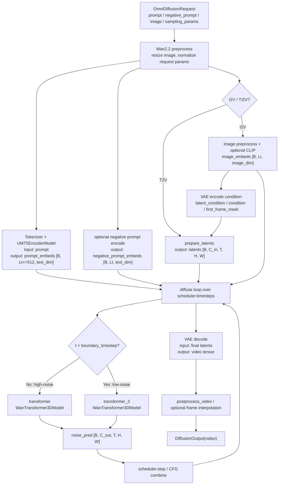
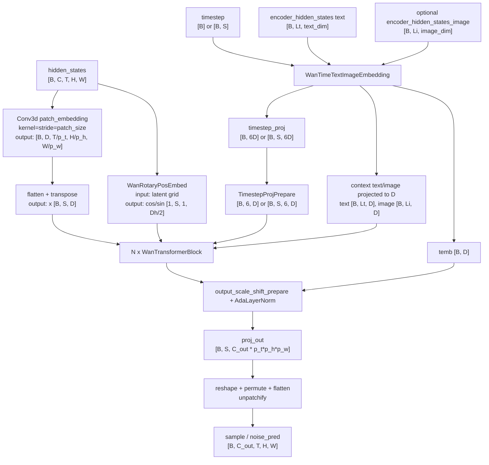
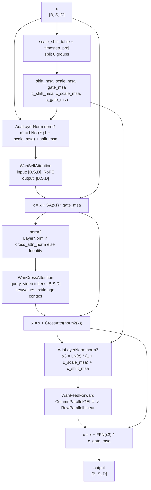
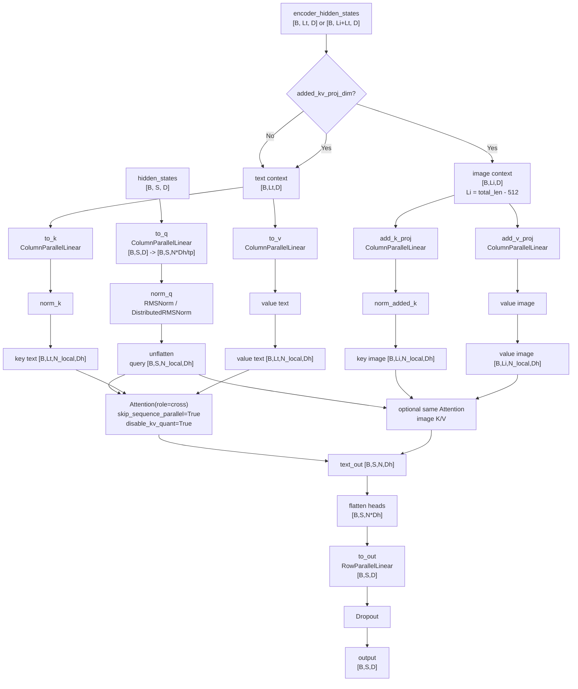
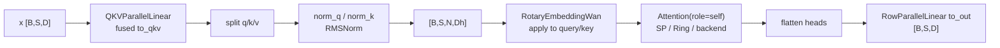
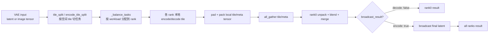
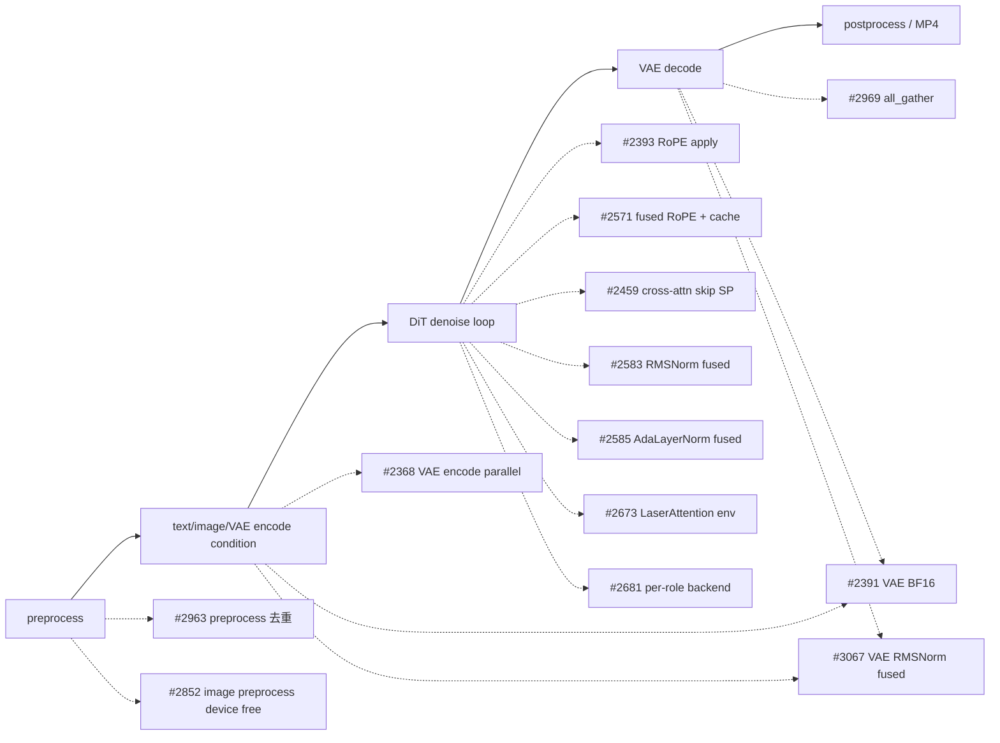

# vLLM-Omni Wan2.2 模型结构与生产优化代码走读

> **文档版本**: 1.0  
> **分析代码版本**: 当前 workspace 本地 `vllm-omni` 源码  
> **最后更新**: 2026-06-07  
> **关联 issue**: [JiusiServe/vllm-omni#181](https://github.com/JiusiServe/vllm-omni/issues/181)

---

## 文档概述

本文按 **自顶向下** 的顺序梳理 vLLM-Omni 中 Wan2.2 的模型结构：先看 pipeline 到 transformer 的大粒度架构，再深入 `WanTransformer3DModel`、`WanTransformerBlock`、`WanSelfAttention`、`WanCrossAttention`、VAE 这些模块内部如何走。

issue #181 是一个生产特性跟踪表，其中 Wan2.2 相关优化覆盖 RoPE、cross attention SP、VAE encode/decode parallel、VAE BF16、LaserAttention、fused norm、per-role attention backend、VAE gather 和预处理去重。本文会在对应模块讲解时把这些 PR 顺带串进去。

**目标读者**: 希望理解 Wan2.2 在 vLLM-Omni 里如何从请求、文本/图像条件、latent 去噪走到视频输出，并能把性能优化讲清楚的工程师。

**阅读指南**:

| 部分 | 内容 | 重点 |
|------|------|------|
| 第一部分 | Wan2.2 端到端大图 | Pipeline、T5/CLIP、VAE、双 transformer、scheduler、CFG |
| 第二部分 | `WanTransformer3DModel` | patchify、RoPE、condition embedding、blocks、unpatchify |
| 第三部分 | `WanTransformerBlock` | SelfAttention → CrossAttention → FFN 的 residual 数据流 |
| 第四部分 | `WanCrossAttention` 细节 | text/image context 拆分、Q/K/V projection、attention backend、SP 跳过 |
| 第五部分 | SelfAttention、RoPE、attention backend | DiT 热区和 per-role backend |
| 第六部分 | VAE 与 I2V 条件路径 | CLIP image embeds、latent condition、VAE parallel |
| 第七部分 | 变体 | VACE、S2V 与主干结构的差异 |
| 第八部分 | issue #181 优化映射 | 每个优化改了哪个模块、为什么有效、收益数据 |
| 第九部分 | 工程总结 | 讲架构和讲优化时的主线 |

---

# 第一部分: Wan2.2 端到端大图

## 1.1 Pipeline 级数据流

Wan2.2 的主入口在 [`pipeline_wan2_2.py`](../../vllm-omni/vllm_omni/diffusion/models/wan2_2/pipeline_wan2_2.py)，I2V 入口在 [`pipeline_wan2_2_i2v.py`](../../vllm-omni/vllm_omni/diffusion/models/wan2_2/pipeline_wan2_2_i2v.py)。核心组件是:

| 组件 | 代码 | 输入 | 输出 |
|------|------|------|------|
| Tokenizer + UMT5 | `AutoTokenizer`, `UMT5EncoderModel` | prompt / negative prompt | `prompt_embeds: [B, 512, text_dim]` |
| 可选 CLIP image encoder | I2V `CLIPVisionModel` | reference image | `image_embeds: [B, Li, image_dim]` |
| VAE encode | `DistributedAutoencoderKLWan.encode` | reference image/video condition | `latent_condition: [B, C, T_lat, H_lat, W_lat]` |
| Denoising transformer | `WanTransformer3DModel` | noisy latents + timestep + text/image context | `noise_pred: [B, C_out, T_lat, H_lat, W_lat]` |
| Scheduler | `FlowUniPCMultistepScheduler` / `WanEulerScheduler` | `noise_pred`, timestep, latents | next-step latents |
| VAE decode | `DistributedAutoencoderKLWan.decode` | final latents | video tensor |



## 1.2 双 transformer 与 `boundary_ratio`

Wan2.2 A14B 系列常见是 high-noise / low-noise 双 transformer。`Wan22Pipeline.__init__` 会检测模型目录里是否有 `transformer_2`，并根据 `boundary_ratio` 决定加载哪几个 transformer:

```text
boundary_ratio = 0.875
boundary_timestep = boundary_ratio * num_train_timesteps

t >= boundary_timestep -> transformer      # high-noise stage
t <  boundary_timestep -> transformer_2    # low-noise stage
```

源码入口:

- [`pipeline_wan2_2.py`](../../vllm-omni/vllm_omni/diffusion/models/wan2_2/pipeline_wan2_2.py#L277-L364): 检测 `transformer_2`、按 `boundary_ratio` 加载模型。
- [`pipeline_wan2_2.py`](../../vllm-omni/vllm_omni/diffusion/models/wan2_2/pipeline_wan2_2.py#L432-L455): denoise loop 内按 timestep 选择当前 transformer。

这也是 Wan2.2 和很多单 transformer DiT 模型的第一处结构差异: 它不是一个固定 DiT 跑完所有 denoise steps，而是按噪声区间切换专家。

## 1.3 CFG 在 pipeline 层处理

每个 denoise step 会构造 positive / negative 两套 kwargs:

```text
positive_kwargs:
  hidden_states = latent_model_input
  timestep = timestep
  encoder_hidden_states = prompt_embeds
  encoder_hidden_states_image = image_embeds  # I2V 可选
  current_model = transformer or transformer_2

negative_kwargs:
  encoder_hidden_states = negative_prompt_embeds
  其他同 positive
```

然后交给 `predict_noise_maybe_with_cfg()`。如果打开 CFG parallel，positive / negative 可以由不同 rank 组并行执行；否则在同一 pipeline 里串行或单分支执行。Wan2.2 transformer 本身只负责“给定条件预测 noise”，不在 block 内判断 CFG。

---

# 第二部分: `WanTransformer3DModel` 大粒度结构

## 2.1 模块图: 到 CrossAttention 粒度

`WanTransformer3DModel` 定义在 [`wan2_2_transformer.py`](../../vllm-omni/vllm_omni/diffusion/models/wan2_2/wan2_2_transformer.py)。它的输入输出可以先按以下张量约定理解:

| 符号 | 含义 |
|------|------|
| `B` | batch size，CFG 后可能是每个分支的局部 batch |
| `C` | latent channel，常见 VAE latent channel 为 16；I2V condition 模式可能有额外 mask/condition channel |
| `T,H,W` | latent 空间中的帧数、高、宽 |
| `S` | patch 后序列长度，`S = T/p_t * H/p_h * W/p_w` |
| `D` | transformer hidden dim，`D = num_attention_heads * attention_head_dim` |
| `Lt` | text context 长度，Wan2.2 默认最大 512 |
| `Li` | image context 长度，I2V 可选 |



## 2.2 初始化结构

`WanTransformer3DModel.__init__` 主要创建四组模块:

| 阶段 | 模块 | 说明 |
|------|------|------|
| 1 | `rope = WanRotaryPosEmbed(...)` | 3D video RoPE，按 T/H/W 切分 head dim |
| 1 | `patch_embedding = Conv3dLayer(...)` | 只在 pipeline parallel 第一 stage 创建 |
| 2 | `condition_embedder = WanTimeTextImageEmbedding(...)` | timestep、text、optional image context 投影到 transformer hidden dim |
| 3 | `blocks = make_layers(... WanTransformerBlock ...)` | PP 下只实例化本 stage 负责的 block，其余是 `PPMissingLayer` |
| 4 | `norm_out`, `proj_out` | 只在 pipeline parallel 最后一 stage 创建 |

这里有几个 vLLM-Omni 化改造:

- self-attention 的 `to_q/to_k/to_v` 被合成 `QKVParallelLinear`，加载权重时再把 diffusers 三个权重 shard 到一个 fused 参数里。
- FFN 被改成 `ColumnParallelLinear + GELU + RowParallelLinear`。
- `make_layers` 让 Wan2.2 可以接入 pipeline parallel。对应优化不在 issue #181 表内，但当前本地历史里有 [#2322](https://github.com/vllm-project/vllm-omni/pull/2322)。

## 2.3 forward 主流程

`WanTransformer3DModel.forward()` 的主线:

1. 从 `hidden_states [B,C,T,H,W]` 推出 patch 后网格 `(T',H',W')`。
2. 计算或复用 RoPE cache，得到 `(freqs_cos, freqs_sin)`。
3. 第一 PP stage 执行 `Conv3d patch_embedding`，转成 `x [B,S,D]`；非第一 stage 从 `IntermediateTensors["hidden_states"]` 接收。
4. `condition_embedder` 把 timestep/text/image context 投到 hidden dim。
5. I2V 有 image context 时，把 `encoder_hidden_states_image` concat 到 text context 前面。
6. 如果 SP auto padding 生效，生成 `hidden_states_mask`，避免 padding token 参与 self-attention。
7. 逐层执行 `WanTransformerBlock`。
8. 非最后 PP stage 返回 `IntermediateTensors`；最后 stage 执行 output norm/proj/unpatchify，返回 noise。

对应代码入口:

- RoPE cache 与 patchify: [`wan2_2_transformer.py`](../../vllm-omni/vllm_omni/diffusion/models/wan2_2/wan2_2_transformer.py#L973-L988)
- condition embedding: [`wan2_2_transformer.py`](../../vllm-omni/vllm_omni/diffusion/models/wan2_2/wan2_2_transformer.py#L993-L1012)
- block loop: [`wan2_2_transformer.py`](../../vllm-omni/vllm_omni/diffusion/models/wan2_2/wan2_2_transformer.py#L1036-L1039)
- output unpatchify: [`wan2_2_transformer.py`](../../vllm-omni/vllm_omni/diffusion/models/wan2_2/wan2_2_transformer.py#L1045-L1065)

---

# 第三部分: `WanTransformerBlock`

## 3.1 Block 结构图

`WanTransformerBlock` 是理解 Wan2.2 DiT 的核心。它的粒度比完整模型小，但又足够大，适合讲架构:



## 3.2 Timestep modulation

每个 block 有一个 `scale_shift_table: [1, 6, D]`。forward 时把它和 `timestep_proj` 相加，再切成 6 组:

```text
shift_msa, scale_msa, gate_msa,
c_shift_msa, c_scale_msa, c_gate_msa
```

它们分别调制 self-attention 前的 AdaLayerNorm 和 FFN 前的 AdaLayerNorm:

```text
self-attn branch:
  norm1(x, scale_msa, shift_msa)
  x = x + self_attn(...) * gate_msa

ffn branch:
  norm3(x, c_scale_msa, c_shift_msa)
  x = x + ffn(...) * c_gate_msa
```

TI2V 模式下 `timestep` 可能是 `[B,S]`，`timestep_proj` 会变成 `[B,S,6,D]`，因此调制参数是 token-wise 的；T2V/I2V 常规模式下是 `[B,6,D]`，对整个序列 broadcast。

## 3.3 为什么 CrossAttention 不带 gate

当前 block 的 cross-attention residual 是:

```text
x = x + attn2(norm2(x), encoder_hidden_states)
```

它不乘 timestep gate。也就是说 Wan2.2 的 timestep modulation 主要控制 self-attention 和 FFN 两个分支，text/image 条件注入则通过 cross-attention 直接 residual 加回。

---

# 第四部分: `WanCrossAttention` 内部怎么走

## 4.1 CrossAttention 模块输入输出

`WanCrossAttention` 定义在 [`wan2_2_transformer.py`](../../vllm-omni/vllm_omni/diffusion/models/wan2_2/wan2_2_transformer.py#L462-L645)。

| 输入 | shape | 含义 |
|------|-------|------|
| `hidden_states` | `[B, S, D]` | video latent patch token，作为 query 来源 |
| `encoder_hidden_states` | `[B, Lt, D]` 或 `[B, Li+Lt, D]` | text context；I2V 时前面可能拼了 image context |
| `attn_metadata` | optional | attention mask / backend extra，目前 block 调 cross-attn 时传 `None` |

| 输出 | shape | 含义 |
|------|-------|------|
| `hidden_states` | `[B, S, D]` | cross-attention 后、经过 output projection 的 video token 更新量 |

## 4.2 内部 layer 流程



读这个流程时抓住三点:

1. **Q 来自 video tokens**，K/V 来自 encoder context。CrossAttention 不对 video token 做 RoPE。
2. **I2V image context 是另一组 K/V**。如果 `added_kv_proj_dim is not None`，代码先把 `encoder_hidden_states` 拆成 image 前缀和 text 后缀；text 长度当前按 512 写死，所以 `image_context_length = total_len - 512`。
3. **text attention 和 image attention 分开算再相加**。image 分支的输出 `hidden_states_img` 和 text 分支输出相加后，再走同一个 `to_out`。

## 4.3 `Attention(role="cross")` 的关键配置

CrossAttention 内部用统一 attention 层:

```python
self.attn = Attention(
    num_heads=self.num_heads,
    head_size=head_dim,
    num_kv_heads=self.num_heads,
    softmax_scale=1.0 / sqrt(head_dim),
    causal=False,
    role="cross",
    qkv_layout="BSND",
    skip_sequence_parallel=True,
    disable_kv_quant=True,
)
```

这几个参数都和 issue #181 的优化有关:

| 参数 | 作用 | 对应优化 |
|------|------|----------|
| `role="cross"` | 让 attention selector 可以按角色选择 backend | [#2681](https://github.com/vllm-project/vllm-omni/pull/2681) per-role backend |
| `qkv_layout="BSND"` | 告诉 backend 输入布局是 batch-seq-head-dim | 注意力 backend 适配 |
| `skip_sequence_parallel=True` | 直接禁用 Ulysses pre/post attention 通信 | [#2459](https://github.com/vllm-project/vllm-omni/pull/2459) |
| `disable_kv_quant=True` | cross-attn 短 context 不做 KV quant，避免质量/性能负收益 | 后续 KV cache quant 保护 |

## 4.4 为什么要跳过 CrossAttention 的 Ulysses SP

Wan2.2 self-attention 的序列长度是 video patch 序列 `S`，可能很长，做 SP 有意义。Cross-attention 的 K/V 是文本 context，通常 `Lt <= 512`，I2V 加 image context 后也远小于 video token 序列。对这么短的 K/V 做 Ulysses all-to-all，通信成本容易超过计算收益。

`Attention._get_active_parallel_strategy()` 看到 `skip_sequence_parallel=True` 后直接返回 `NoParallelAttention`，于是 cross-attn 不再做 Ulysses 的 Q/K/V reshard 和 output all-to-all。PR [#2459](https://github.com/vllm-project/vllm-omni/pull/2459) 的描述给出的 I2V 测试结果是 **44s → 40s**。

---

# 第五部分: SelfAttention、RoPE 与 attention backend

## 5.1 SelfAttention 内部流程

`WanSelfAttention` 和 CrossAttention 的区别是 Q/K/V 都来自 video token:



SelfAttention 是 Wan2.2 DiT 的主计算热区:

- 每个 block 都跑一次；
- 每个 denoise step 都跑；
- Q/K 还要做 3D RoPE；
- video token 序列长，SP、FlashAttention/LaserAttention、RoPE 优化都会被放大。

## 5.2 RoPE 的数据形态

`WanRotaryPosEmbed` 把 `attention_head_dim` 拆给 temporal / height / width 三个方向:

```text
h_dim = w_dim = 2 * (head_dim // 6)
t_dim = head_dim - h_dim - w_dim
```

forward 时根据 patch 后网格 `(T',H',W')` 展开出:

```text
freqs_cos: [1, S, 1, head_dim]
freqs_sin: [1, S, 1, head_dim]
```

之后当前代码取偶/奇位置形成实际传给 `RotaryEmbeddingWan` 的 cache:

```text
rotary_emb = (
  freqs_cos[..., 0::2].to(hidden_states.dtype),
  freqs_sin[..., 1::2].to(hidden_states.dtype),
)
```

PR [#2393](https://github.com/vllm-project/vllm-omni/pull/2393) 优化的是 RoPE apply 的写回方式: 旧实现用 `empty_like` 后对偶/奇 channel 做 strided slice assignment，NPU 上会产生明显 `InplaceCopy/ViewCopy` 开销；新实现直接算 rotated even/odd，用 `torch.stack(...).flatten(...)` 还原布局。RoPE 在每层 self-attn 的 Q/K 上都会执行，所以这个小算子优化会被层数和 denoise steps 放大。

PR [#2571](https://github.com/vllm-project/vllm-omni/pull/2571) 又做了两件事:

- NPU 上优先用 MindIE-SD fused RoPE；
- 在 transformer forward 里缓存同一分辨率的 RoPE 结果，避免每个 denoise step 反复重算同一 `(T',H',W')` 的 cos/sin。

当前代码里可以看到 `_cached_rope_emb` 和 `_cached_rope_resolution`，以及 NPU 路径的 `apply_rotary_emb_mindiesd`。

## 5.3 per-role attention backend

统一 attention 层在 [`attention/layer.py`](../../vllm-omni/vllm_omni/diffusion/attention/layer.py) 里根据 role 选择 backend:

```text
Attention(role="self")  -> self-attn backend
Attention(role="cross") -> cross-attn backend
```

PR [#2681](https://github.com/vllm-project/vllm-omni/pull/2681) 引入 per-role 配置，典型用法:

```bash
--diffusion-attention-config.per_role.self.backend SPARSE_ATTN \
--diffusion-attention-config.per_role.cross.backend FLASH_ATTN
```

这个设计对 Wan2.2 很重要，因为 self-attn 和 cross-attn 的序列长度、通信成本、质量风险完全不同。比如 self-attn 可以偏激进地选高性能 backend，cross-attn 则更适合稳定、短序列友好的 backend，并且已经显式跳过 Ulysses SP。

---

# 第六部分: VAE 与 I2V 条件路径

## 6.1 T2V latent 路径

T2V 没有输入图像条件，pipeline 直接采样初始 noise:

```text
latents: [B, in_channels, T_lat, H_lat, W_lat]
```

denoise loop 每步把它传给当前 transformer。最终输出 latents 反归一化后交给 VAE decode。

## 6.2 I2V latent 路径

I2V pipeline 多两类条件:

1. **CLIP image embeds**: 如果模型带 `image_encoder` 且 transformer config 有 `image_dim`，先用 CLIP 编码 reference image，得到 `image_embeds`，再通过 `WanTimeTextImageEmbedding.image_embedder` 投到 `D`，最后拼到 text context 前面，供 CrossAttention 读取。
2. **VAE latent condition**: 把 reference image 构造成 video condition，经 VAE encode 得到 `latent_condition`。

I2V 的 `prepare_latents()` 返回:

| 返回值 | shape | 用途 |
|--------|-------|------|
| `latents` | `[B, C_out, T_lat, H_lat, W_lat]` | 初始 noise |
| `condition` | expand 模式是 latent condition；非 expand 模式是 mask + latent condition concat | transformer 输入条件 |
| `first_frame_mask` | `[1,1,T_lat,H_lat,W_lat]` 或派生 mask | 控制首帧条件和待去噪帧 |

非 expand 模式下，condition 会沿 channel 维拼 mask 和 latent condition:

```text
condition = concat([mask_lat_size, latent_condition], dim=1)
```

expand_timesteps/TI2V 风格下，则用 mask 把首帧条件和当前 noisy latents blend:

```text
latent_model_input = (1 - first_frame_mask) * condition + first_frame_mask * latents
timestep = per-patch timestep from first_frame_mask
```

## 6.3 VAE distributed executor

VAE parallel 的核心在:

- [`distributed_vae_executor.py`](../../vllm-omni/vllm_omni/diffusion/distributed/autoencoders/distributed_vae_executor.py)
- [`autoencoder_kl_wan.py`](../../vllm-omni/vllm_omni/diffusion/distributed/autoencoders/autoencoder_kl_wan.py)

执行模式:



issue #181 里 VAE 相关优化主要落在这里:

- [#2368](https://github.com/vllm-project/vllm-omni/pull/2368): 支持 VAE tiling parallel encode，I2V 条件编码也能并行；PR 描述给出的时间是 **52s → 47s → 43s**。
- [#2391](https://github.com/vllm-project/vllm-omni/pull/2391): VAE encode/decode 用运行时 dtype，不再硬编码 FP32；4-step E2E 从 **63.039s → 57.229s**。
- [#2969](https://github.com/vllm-project/vllm-omni/pull/2969): NPU 上把 `dist.gather` 换成 `dist.all_gather`，避开 HCCL 对 gather 的额外 broadcast/object/list 开销；VAE decoding 从 **2247.04ms → 1580.20ms**。
- [#3067](https://github.com/vllm-project/vllm-omni/pull/3067): patch diffusers 的 `WanRMS_norm` 为 vLLM-Omni `RMSNormVAE`，NPU 上 VAE encoder/decoder 合计约 **34%** 提升。

---

# 第七部分: VACE 与 S2V 变体

## 7.1 VACE: 在主 block 旁边加控制分支

VACE 版本定义在 [`wan2_2_vace_transformer.py`](../../vllm-omni/vllm_omni/diffusion/models/wan2_2/wan2_2_vace_transformer.py)。它继承 `WanTransformer3DModel`，新增:

- `vace_patch_embedding`: 把 `vace_context [B,C,T,H,W]` patchify 成控制 token。
- `vace_blocks`: 一组 `VaceWanTransformerBlock`，只在 `vace_layers` 指定的层执行。
- 每个 VACE block 内部仍复用 `WanTransformerBlock` 的 SelfAttention/CrossAttention/FFN，只是在开头有 `proj_in`，输出有 `proj_out` 形成 conditioning states。

可以理解为:

```text
主干 hidden_states: 正常 WanTransformerBlock 流
控制 hidden_states: 在若干层旁路执行 VaceWanTransformerBlock
控制输出: conditioning_states * vace_context_scale 加回主干
```

VACE 的 `_sp_plan` 也有调整: 不是在 `blocks.0` 入口 shard，而是在 `_sp_shard_point` 先 shard，保证主干和 VACE context 的序列切分对齐。

## 7.2 S2V: 多了音频/运动模块，但注意力骨架相似

S2V 版本在 [`wan2_2_s2v_transformer.py`](../../vllm-omni/vllm_omni/diffusion/models/wan2_2/wan2_2_s2v_transformer.py)。它有更多音频和 motion 相关模块，但核心 attention 仍然复用 vLLM-Omni 的统一 `Attention`:

- `WanS2VSelfAttention`: fused QKV + QK norm + S2V RoPE + Attention。
- `WanS2VCrossAttention`: video tokens query，context key/value，且也设置 `skip_sequence_parallel=True`。
- `WanS2VTransformerBlock`: self-attn、cross-attn、FFN，额外有 segment-wise modulation，用 `seg_idx` 把 noisy tokens 和 reference/motion tokens 分段调制。

所以讲 Wan2.2 主干时，T2V/I2V 的 `WanTransformer3DModel` 是第一主线；VACE/S2V 是在主线结构上增加控制条件或音频/运动分支。

---

# 第八部分: issue #181 Wan2.2 优化映射

## 8.1 优化总表

| issue #181 条目 | PR | 主要模块 | 问题 | 改法 / 收益 |
|-----------------|----|----------|------|-------------|
| Optimize Wan2.2 rotary embedding | [#2393](https://github.com/vllm-project/vllm-omni/pull/2393) | `RotaryEmbeddingWan` | NPU strided slice 写回导致 `InplaceCopy/ViewCopy` | stack + flatten 改写 RoPE apply；配合其他优化测试 44s → 33s |
| Skip Wan2.2 cross attn Ulysses SP | [#2459](https://github.com/vllm-project/vllm-omni/pull/2459) | `WanCrossAttention`, `Attention` | cross-attn context 短，Ulysses 通信不划算 | `skip_sequence_parallel=True`；44s → 40s |
| Support vae tiling parallel encode | [#2368](https://github.com/vllm-project/vllm-omni/pull/2368) | `DistributedAutoencoderKLWan` | I2V VAE encode 仍单卡 | encode 也走 tile parallel；52s → 43s |
| VAE FP32 to BF16 | [#2391](https://github.com/vllm-project/vllm-omni/pull/2391) | VAE encode/decode | FP32 TransData/Conv3d 开销大 | VAE 用 runtime dtype；4-step 63.039s → 57.229s |
| mindiesd LaserAttention error | [#2673](https://github.com/vllm-project/vllm-omni/pull/2673) | NPU platform / attention backend | custom OPP path 未配置，LaserAttention 调用失败 | forward 前 import mindiesd；DiT 44s → 30s |
| fused AdaLayerNorm | [#2585](https://github.com/vllm-project/vllm-omni/pull/2585) | `AdaLayerNorm` | 小算子多，NPU launch/内存开销高 | mindiesd fused layernorm_scale_shift；1.51s/step → 1.45s/step |
| fused RMSNorm | [#2583](https://github.com/vllm-project/vllm-omni/pull/2583) | `RMSNorm`, `LayerNorm` | QK norm / LayerNorm 是高频小算子 | fused norm；1.51s/step → 1.46s/step |
| fused rope and rope cache | [#2571](https://github.com/vllm-project/vllm-omni/pull/2571) | `RotaryEmbeddingWan`, transformer cache | RoPE apply 和 cos/sin 重算开销 | MindIE-SD fused RoPE + `_cached_rope_emb` |
| per-role attention backend | [#2681](https://github.com/vllm-project/vllm-omni/pull/2681) | `Attention`, `selector.py` | self/cross attention 特征不同，但只能全局选 backend | `role=self/cross` 分别配置 backend |
| device free on image preprocess | [#2852](https://github.com/vllm-project/vllm-omni/pull/2852) | I2V preprocess | 图像前处理里的设备释放和同步影响短步数 E2E | 优化 image preprocess 的 device free；E2E 9837ms → 9513ms |
| VAE dist.gather bottleneck | [#2969](https://github.com/vllm-project/vllm-omni/pull/2969) | `DistributedVaeExecutor` | HCCL gather 额外开销 | `all_gather` 替代 gather；decode 2247ms → 1580ms |
| remove duplicate video preprocess | [#2963](https://github.com/vllm-project/vllm-omni/pull/2963) | Wan2.2 pipelines | 重复 video preprocess | 删除重复处理，减少 CPU/GPU 前处理负担 |
| fused WanRMS_norm in VAE | [#3067](https://github.com/vllm-project/vllm-omni/pull/3067) | `patch_diffusers.py`, `RMSNormVAE` | diffusers VAE RMSNorm 小算子慢 | patch 为 fused `RMSNormVAE`；VAE encoder/decoder 约 34% 提升 |

## 8.2 按执行路径归类

如果把一次请求拆成 “preprocess → text/image encode → denoise → VAE decode → postprocess”，issue #181 的 Wan2.2 优化可以这样记:



注意: 这些优化不是彼此替代，而是落在不同热区上。Wan2.2 视频生成的特点是 denoise loop 很长、DiT 层数多、VAE encode/decode 也重，所以小算子、通信、dtype、前后处理都能在端到端延迟里体现出来。

## 8.3 为什么 CrossAttention 是优化切入点

CrossAttention 本身计算量不是最大的，但它很适合作为讲解优化的切入点:

1. 它在每个 block 都出现，位于 denoise loop 热路径。
2. 它的输入形态和 self-attn 不同: `S` 很长，但 K/V 的 `Lt` 短。
3. 这直接导出 “不要盲目套用 Ulysses SP” 的优化结论。
4. 它又接入了统一 `Attention(role="cross")`，能自然讲到 per-role backend。

所以讲 Wan2.2 优化时可以这样串:

```text
self-attn: 长 video token 序列 -> SP / Ring / LaserAttention / RoPE 优化收益大
cross-attn: 短 text/image context -> 跳过 Ulysses SP，单独选 backend，避免 KV quant 负收益
VAE: tile parallel + BF16 + fused RMSNorm + all_gather 修通信瓶颈
norm/RoPE: 每层每步都跑的小算子 -> NPU fused op 能积累成端到端收益
```

---

# 第九部分: 工程总结

## 9.1 一句话架构

Wan2.2 在 vLLM-Omni 里可以概括成:

> Pipeline 负责请求、T5/CLIP/VAE 条件、scheduler、CFG 和双 transformer 切换；`WanTransformer3DModel` 把 latent video patchify 成 token 序列，用带 timestep modulation 的 `WanTransformerBlock` 反复执行 self-attn、cross-attn、FFN，最后 unpatchify 回 noise；VAE 负责条件编码和最终视频解码。

## 9.2 讲 CrossAttention 时抓住的主线

CrossAttention 的输入输出:

```text
input:
  hidden_states: [B, S, D]          # video latent tokens, query source
  encoder_hidden_states: [B, L, D]  # text/image context, key/value source

output:
  [B, S, D]                         # residual update for video tokens
```

内部步骤:

```text
hidden_states -> to_q -> norm_q -> [B,S,N,Dh]
context_text  -> to_k/to_v -> norm_k -> [B,Lt,N,Dh]
context_img   -> add_k/add_v -> norm_added_k -> [B,Li,N,Dh]  # optional
Attention(query, key_text, value_text)
+ optional Attention(query, key_img, value_img)
-> flatten heads -> RowParallel to_out -> [B,S,D]
```

对应优化:

- 因为 context 短，所以 `skip_sequence_parallel=True`，跳过 Ulysses。
- 因为 role 明确，所以可以 per-role 选择 backend。
- 因为短序列 KV quant 没收益还可能伤质量，所以 `disable_kv_quant=True`。

## 9.3 新接 Wan 类模型时要检查什么

| 检查项 | 原因 |
|--------|------|
| `transformer` / `transformer_2` 是否存在 | 决定是否需要 high/low-noise boundary 切换 |
| `patch_size`, `in_channels`, `out_channels` | 决定 latent shape、I2V condition channel、unpatchify |
| `image_dim`, `added_kv_proj_dim` | 决定 CrossAttention 是否有 image K/V 分支 |
| text context max length 是否仍是 512 | 当前 CrossAttention 拆 image/text context 用了 512 假设 |
| 是否启用 `expand_timesteps` | 决定 timestep 是 `[B]` 还是 `[B,S]`，影响 token-wise modulation |
| attention backend role 配置 | self/cross attention 不应一刀切 |
| VAE 是否支持 tiling 和 distributed executor | 大分辨率 I2V/T2V 的 encode/decode 热区 |
| NPU 环境是否加载 mindiesd | LaserAttention、fused norm、fused RoPE 都依赖它 |
