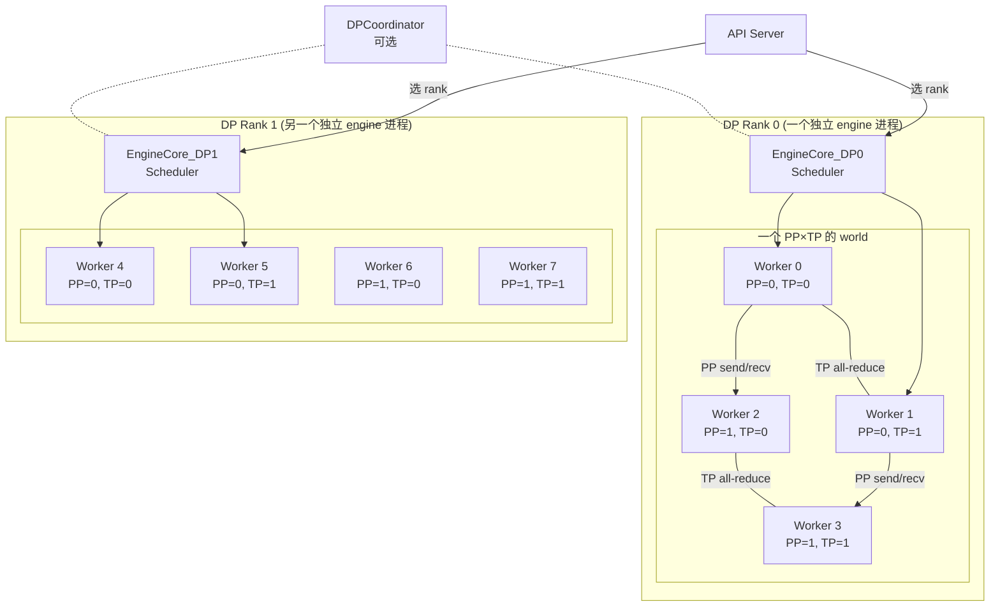
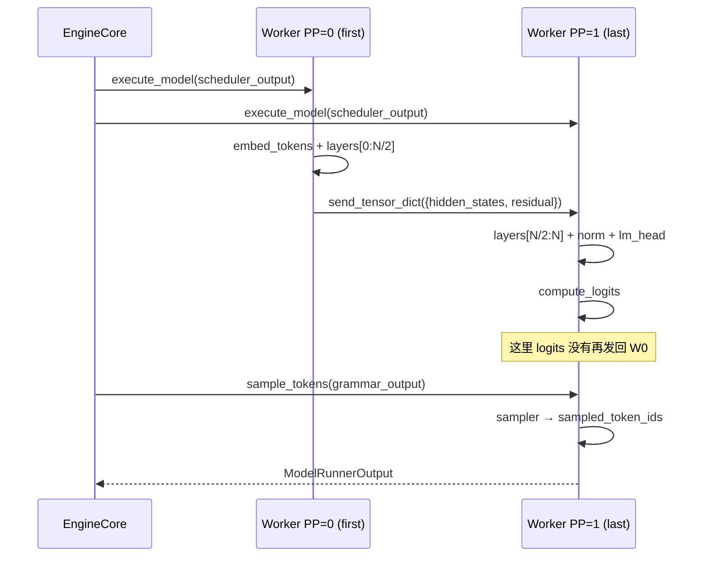
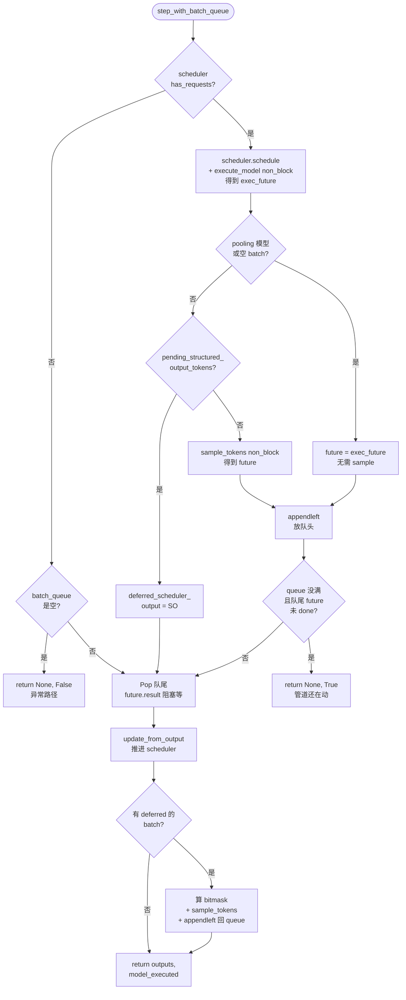
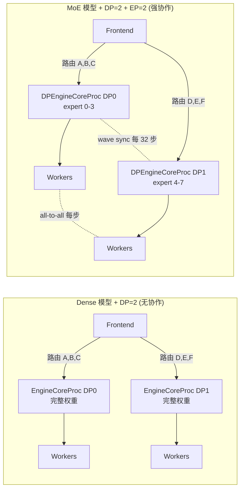

# vLLM Pipeline Parallel 与 Data Parallel 机制详解

> **文档版本**: 1.0
> **分析代码版本**: 当前 workspace 本地 `vllm` 源码（v1 engine）
> **最后更新**: 2026-06-07

---

## 文档概述

本文档讲解 vLLM v1 中的 **Pipeline Parallel (PP)** 和 **Data Parallel (DP)** 两种并行机制。重点不是抠 NCCL kernel 细节或具体模型实现，而是：

> **PP 切的是"模型"，DP 切的是"请求"；它们各自靠什么数据结构维持语义正确，在 engine core / scheduler / worker 三段里各自怎么落地，以及在和 TP / MoE / async scheduler 组合时边界在哪。**

为什么把 PP 和 DP 放一起讲？因为这两个东西在初学者眼里经常分不清——"都是切了，都是分布式"。但它们在 vLLM 里几乎是两条独立的代码路径：PP 是一个 engine 内部跨 worker 的协作；DP 是多个 engine 进程之间松耦合的协作。**理解它们的区别比单独理解任一个都更重要**。

**目标读者**: 已经理解 vLLM v1 engine core / Scheduler / model runner / TP 基本概念，但对 PP 的 send/recv 时序、DP 的 wave 协议、PP+DP+TP 混合拓扑下"谁是谁"还不清楚的工程师。

**阅读指南**:

| 部分 | 内容 | 重点 |
|------|------|------|
| 第一部分 | PP 和 DP 的本质区别 | 一张图先把概念厘清 |
| 第二部分 | PP：模型层切分 | `PPMissingLayer`、`make_layers`、IntermediateTensors、send/recv 时序 |
| 第三部分 | PP 和 engine core 的协作 | `step_with_batch_queue()`、batch queue 与 PP 的关系 |
| 第四部分 | PP 和 async scheduler 的组合 | 最后一段 rank 的 token 怎么"反向"传回前面 rank |
| 第五部分 | DP：请求维度并行 | `DPEngineCoreProc`、wave 协议、负载均衡 |
| 第六部分 | DP 仅 MoE 才协作的内在原因 | dense 模型 DP = 纯复制；MoE 才需要 all-to-all |
| 第七部分 | DP + TP + PP 同时存在时的拓扑 | world_size 公式、谁在谁里面 |
| 第八部分 | QA | 常见混淆点 |

---

# 第一部分: PP 和 DP 的本质区别

## 1.1 一句话定义

| 维度 | Pipeline Parallel | Data Parallel |
|------|-------------------|---------------|
| **切的是什么** | 模型的 transformer **层**（depth） | 请求的**批次**（即不同请求） |
| **每个 rank 持有什么** | 1/PP 的模型权重 | **完整**的模型权重（dense）或部分 expert（MoE） |
| **rank 间通信内容** | 每步都要传 `hidden_states` 等中间张量 | dense 模型几乎不通信；MoE 在 expert 间走 all-to-all；调度上偶尔做几次 all-reduce 同步状态 |
| **谁是 engine core** | **一个** engine core 协调所有 PP rank | **每个 DP rank 一个** engine core（独立进程） |
| **谁能 sample** | 只有最后一段 rank 能 sample | 每个 DP rank 都能独立 sample |
| **典型目的** | 单卡放不下整个模型 | 单卡放得下模型，但要更高的并发 |

PP 的关键词是"**前后接力**"——一个 forward 要靠多个 rank 串行完成；DP 的关键词是"**并排复制**"——多个 rank 各自独立处理不同的请求。

## 1.2 用一张图厘清"谁在谁里面"



读这张图最重要的事：

1. **DP 是顶层**。每个 DP rank 是一个独立的 `EngineCoreProc` 进程，拥有完整的 scheduler、KV cache、output queue。
2. **PP 和 TP 是 DP 内部的事**。在每一个 DP rank 内部，TP×PP 个 worker 组成一个紧耦合的"world"。
3. **world_size 不包含 DP**。`world_size = tp_size * pp_size * pcp_size`，DP 维度是 orthogonal 的——见 [config/parallel.py](vllm/vllm/config/parallel.py)。
4. **客户端要决定把请求发给哪个 DP rank**。这是 DP 客户端的事，下面会讲。

## 1.3 通信成本的量级差

PP 的通信成本是"**每一步都要传整张 hidden_states**"，量级是 `[num_tokens, hidden_size]` 的 tensor，单步内进行，且是 P2P。

DP 的通信成本在 **dense 模型几乎为零**：每个 DP rank 独立 forward。只有这两种场景才需要跨 DP 通信：

- **MoE 模型**：expert 分布在不同 DP rank 上，token routing 走 all-to-all；
- **调度状态同步**：偶尔（每 32 步一次）做一个 2 元素的 all-reduce，判断"全局有没有空跑完的 DP rank"。

这也是为什么 `DPEngineCoreProc` 在源码里只在 MoE 模型上才启用。

---

# 第二部分: PP——模型层切分

## 2.1 配置入口

源码：

```text
vllm/config/parallel.py
```

```python
@config
class ParallelConfig:
    pipeline_parallel_size: int = 1
    """Number of pipeline parallel groups."""
    tensor_parallel_size: int = 1
    """Number of tensor parallel groups."""
    ...
    world_size: int = Field(init=False)
    """world_size is TPxPP, it affects the number of workers we create."""
```

`pp_size` 决定了：

1. 每个模型实例会拆成几段；
2. 每段对应几个 worker 进程；
3. PP group 的 `world_size`（即 `get_pp_group().world_size`）；
4. engine core 的 `batch_queue_size`——这一点后面会展开。

## 2.2 `PPMissingLayer`：用 Identity 占位"不属于本 rank 的层"

源码：

```text
vllm/model_executor/models/utils.py
```

```python
class PPMissingLayer(torch.nn.Identity):
    """A placeholder layer for missing layers in a pipeline parallel model."""

    def forward(self, *args, **kwargs):
        """Return the first arg from args or the first value from kwargs."""
        return args[0] if args else next(iter(kwargs.values()))


def make_layers(
    num_hidden_layers: int,
    layer_fn: LayerFn,
    prefix: str,
) -> tuple[int, int, torch.nn.ModuleList]:
    from vllm.distributed.parallel_state import get_pp_group
    from vllm.distributed.utils import get_pp_indices

    start_layer, end_layer = get_pp_indices(
        num_hidden_layers, get_pp_group().rank_in_group, get_pp_group().world_size
    )

    modules = torch.nn.ModuleList(
        [PPMissingLayer() for _ in range(start_layer)]
        + get_offloader().wrap_modules(
            layer_fn(prefix=f"{prefix}.{idx}") for idx in range(start_layer, end_layer)
        )
        + [PPMissingLayer() for _ in range(end_layer, num_hidden_layers)]
    )

    return start_layer, end_layer, modules
```

理解这两个组件最关键的几点：

| 设计点 | 解读 |
|--------|------|
| `PPMissingLayer` 继承 `nn.Identity` | 让"不属于本 rank 的层"在结构上仍然存在，但 forward 时就是恒等映射。这样模型的 attribute 路径（`model.layers[42]`）在所有 rank 上保持一致，state_dict / 权重加载逻辑不需要按 rank 写两份。 |
| `make_layers` 返回 `(start, end, modules)` | 它把"我这一段是第几层到第几层"显式返回，模型 forward 里可以用它跳过 PPMissingLayer 段。 |
| `[Missing]*start + [real]*N + [Missing]*tail` 的布局 | 内存占用只对应中间的 `[real]*N` 段，`PPMissingLayer` 是 stateless 的 Identity，几乎不占空间。 |
| `embed_tokens` 只在 first rank 实例化 | 像 Llama 的写法就是 `if not is_first_rank: self.embed_tokens = PPMissingLayer()`，让非首 rank 直接吃 `IntermediateTensors` 而不走 embedding。 |
| `norm` / `lm_head` 只在 last rank 实例化 | 因为它们要在算完所有层之后才用，且配合 sample 一并发生。 |

这是 vLLM PP 的一个核心设计选择：**让所有 rank 共享同一份模型 Python 类，只在层粒度上"留空"**。换句话说，PP 不是把模型拆成 N 份不同的代码，而是 N 份相同结构的代码，每个 rank 只 own 其中一段实例。

## 2.3 `IntermediateTensors`：rank 之间传输的容器

源码：

```text
vllm/sequence.py
```

```python
@dataclass
class IntermediateTensors:
    """Hidden states and residuals for all requests at a PP stage boundary."""
    tensors: dict[str, torch.Tensor]
```

常见的 key：

- `"hidden_states"`：上一段的输出 hidden states，下一段 forward 的输入。
- `"residual"`：跨 PP 段保留的残差路径（取决于模型的 norm 结构）。
- 某些模型可能还有别的元数据，比如 SP / CP 的中间量。

用 dict 而不是固定字段是为了让 PP 边界不强假设模型结构。`send_tensor_dict` / `broadcast_tensor_dict` 会自动按 key 顺序拷数据。

## 2.4 forward 时谁干什么

源码：

```text
vllm/v1/worker/gpu_model_runner.py::execute_model / _prepare_inputs
```

简化后的角色分工：

```python
def _prepare_inputs(...):
    is_first_rank = get_pp_group().is_first_rank
    if is_first_rank:
        # rank 0：把 token id 经过 embedding 变成 hidden
        intermediate_tensors = None
    else:
        # 非首 rank：等上一段 rank 把 hidden 发过来
        intermediate_tensors = self.sync_and_gather_intermediate_tensors(...)
    ...

# execute_model 内部 forward 跑完后：
if not get_pp_group().is_last_rank:
    # 非末 rank：把本段的 hidden_states 发给下一段 rank
    get_pp_group().send_tensor_dict(
        hidden_states.tensors,
        all_gather_group=get_tp_group(),
        all_gather_tensors=all_gather_tensors,
    )
    logits = None
else:
    # 末 rank：算 logits、采样
    logits = self.model.compute_logits(sample_hidden_states)
```

可以用一张时序图把单步 PP=2 的事讲清楚：



几个不要混淆的点：

1. **engine core 把 scheduler_output 同时发给所有 PP rank**。不存在"先发给 rank 0，rank 0 转发给 rank 1"这种链式。worker 内部按自己段的范围处理。
2. **forward 一旦跑完 PP=0 段，PP=0 worker 就空闲了**——直到下一步 engine 再给它 scheduler_output。它不会等 PP=1 算完。这就为"流水"留下了机会，下一节讲。
3. **logits 默认不广播回前段 rank**。前段 rank 看不到 logits，也不需要看。它只在某些特殊配置（`broadcast_pp_output=True`，比如 torchrun external launcher）下才广播。
4. **`send_tensor_dict` 用 `all_gather_group=get_tp_group()` 优化带宽**。当 TP 的 sequence parallelism 把 hidden split 到不同 TP rank 上时，先在 TP group 内 all-gather 再 P2P 发送，可以让 P2P 通信走更大的连续 chunk。

## 2.5 PP rank 数量与 send/recv 实现

`get_pp_group()` 返回的 `GroupCoordinator`（源码：`vllm/distributed/parallel_state.py`）维护一个"逻辑环"：

```python
class GroupCoordinator:
    @property
    def is_first_rank(self): return self.rank == self.first_rank
    @property
    def is_last_rank(self): return self.rank == self.last_rank
    @property
    def next_rank(self): return self.ranks[(self.rank_in_group + 1) % self.world_size]
    @property
    def prev_rank(self): return self.ranks[(self.rank_in_group - 1) % self.world_size]
```

`send_tensor_dict(d, dst)` 默认把 tensor 发给 `next_rank`；`recv_tensor_dict(src)` 默认从 `prev_rank` 收。这两个动作在 worker 的 `execute_model` 里成对出现——发是在算完本段后，收是在 `_prepare_inputs` 进入本段前。

---

# 第三部分: PP 和 engine core 的协作

## 3.1 batch queue：让多个"半成品 forward"同时 in-flight

PP 的吞吐瓶颈是"流水气泡"——如果 engine 只让一个 batch 流过 PP 管道，那么任意时刻只有一段 rank 在工作，其他 rank 都空着。要消掉气泡，engine 必须 **在 batch N 还没跑完时，就把 batch N+1 注入管道**。

vLLM v1 的做法是 `step_with_batch_queue()` 路径——一个 deque 维护 "已调度但还没出结果的 batch"：

源码：

```text
vllm/v1/engine/core.py::EngineCore.step_with_batch_queue
```

```python
def step_with_batch_queue(self):
    batch_queue = self.batch_queue
    assert len(batch_queue) < self.batch_queue_size

    model_executed = False
    deferred_scheduler_output = None
    if self.scheduler.has_requests():
        scheduler_output = self.scheduler.schedule()
        exec_future = self.model_executor.execute_model(scheduler_output, non_block=True)
        ...
        if not scheduler_output.pending_structured_output_tokens:
            grammar_output = self.scheduler.get_grammar_bitmask(scheduler_output)
            future = self.model_executor.sample_tokens(grammar_output, non_block=True)
        else:
            deferred_scheduler_output = scheduler_output

        if not deferred_scheduler_output:
            batch_queue.appendleft((future, scheduler_output, exec_future))
            if (model_executed
                and len(batch_queue) < self.batch_queue_size
                and not batch_queue[-1][0].done()):
                # 队列没满 → 不阻塞，继续 schedule 下一个 batch
                return None, True

    future, scheduler_output, exec_model_fut = batch_queue.pop()
    model_output = future.result()
    ...
    engine_core_outputs = self.scheduler.update_from_output(scheduler_output, model_output)
    return engine_core_outputs, model_executed
```

逻辑读法：

1. **优先填满 queue**：每次进入 `step_with_batch_queue()`，如果 queue 还没满且 scheduler 有 request，就先 schedule + execute 一个新的 batch 进 queue。
2. **直接返回，不等结果**：只要 queue 没满且队尾的 future 还没 done，就立刻 `return None, True`——告诉外层"我这一步没产出 output，但我没空着，下次再来"。
3. **填满了再 pop**：只有 queue 满了，才阻塞 pop 队尾、等它 `result()`、然后 `update_from_output`。

这正是"半异步 pipeline"。`batch_queue_size` 决定了能塞多少个 batch 进管道。

### 3.1.1 完整控制流图

上面的"逻辑读法"是顺着主干讲的，但 `step_with_batch_queue` 的实际函数里还有几个分支（structured output、pooling model、错误诊断等）需要分清。先把控制流画出来：



### 3.1.2 几个看代码时容易踩的点

**(a) deque 的方向：左 push 右 pop = FIFO**

`batch_queue` 是 `collections.deque`，但代码里同时用了 `appendleft` 和 `pop`：

```python
batch_queue.appendleft((future, scheduler_output, exec_future))  # 新 batch 进队头
future, scheduler_output, exec_model_fut = batch_queue.pop()      # 老 batch 从队尾出
```

也就是：**queue 左端是"最新进入管道的 batch"，右端是"最先该出结果的 batch"**。`batch_queue[-1]` 就是"最老的、马上要 pop 出来的那个"。早返回路径里检测的 `not batch_queue[-1][0].done()` 含义是"管道里最早进去的 batch 都还没算完，那我就别阻塞它了，再多塞几个新的进来"。

**(b) 两个 future：`exec_future` vs `future`**

每个 batch 实际上要派发**两次**异步调用：

| 步骤 | 调用 | 返回 |
|------|------|------|
| 1 | `model_executor.execute_model(SO, non_block=True)` | `exec_future` —— **模型 forward** 的 future |
| 2 | `model_executor.sample_tokens(grammar_output, non_block=True)` | `future` —— **采样**的 future |

入队的元素是三元组 `(future, scheduler_output, exec_future)`：

- `future` 是"这一步完成"的真正信号，pop 时 `future.result()` 拿到 `ModelRunnerOutput`；
- `exec_future` 留在元组里**只是为了错误诊断**——如果 `future.result()` 返回 `None`（说明 sample 阶段感知到上游 forward 失败了），就调 `exec_model_fut.result()` re-raise 真正的异常。

读主干时把 `exec_future` 当成"备份错误句柄"忽略掉，逻辑会清爽很多。

**(c) `deferred_scheduler_output`：structured output + spec decode 的特例**

正常路径下，schedule 完立刻 `sample_tokens`，采样 future 入队。但有一种情况要"延后采样"：

- `scheduler_output.pending_structured_output_tokens=True`——这个 batch 里有 structured output 请求，要算 grammar bitmask 必须先知道**上一步**接受了哪些 token；
- 加上 spec decode，accepted token 又要等队尾 batch 的 `take_draft_token_ids()` 才知道。

这时这一轮**不 sample**，只把 forward 派下去；把 `scheduler_output` 暂存到 `deferred_scheduler_output`，跳过 `appendleft`，直接走到 pop 阻塞分支。等老 batch 的 `update_from_output` 把 accepted token 写回 scheduler 状态以后，再回头给延后的 batch 算 bitmask + sample，最后 `appendleft` 回队列：

```python
if deferred_scheduler_output:
    if self.use_spec_decode:
        draft_token_ids = self.model_executor.take_draft_token_ids()
        self.scheduler.update_draft_token_ids_in_output(
            draft_token_ids, deferred_scheduler_output
        )
    grammar_output = self.scheduler.get_grammar_bitmask(deferred_scheduler_output)
    future = self.model_executor.sample_tokens(grammar_output, non_block=True)
    batch_queue.appendleft((future, deferred_scheduler_output, exec_future))
```

整段可以读作："forward 我已经派下去了，但 sample 不能这一轮做——等老 batch 的结果回来更新 scheduler，我再来补这一步的 sample"。

**(d) pooling 模型 / 空 batch：直接拿 exec_future 当结果**

pooling 模型（embedding、reward 之类）没有"采样"这一步；scheduler 也可能 schedule 出 `total_num_scheduled_tokens=0` 的空 batch（仅做调度状态推进，没真活）。这两种情况源码里直接 `future = cast(Future[ModelRunnerOutput], exec_future)`——把 forward future 当步骤完成信号，跳过 `sample_tokens`。

**(e) 返回值的三种组合**

`step_with_batch_queue` 返回的是 `(outputs_or_None, model_executed)`，三种含义要分清：

| 返回 | 含义 | 外层 busy loop 行为 |
|------|------|---------------------|
| `(None, True)` | 这一步没出 output，但管道在动（新 batch 入了 queue 直接早返回） | 立即再 `step` 一次，不 sleep |
| `(outputs, True)` | 老 batch 的 output 已经 ready 并 `update_from_output` 完了 | 把 outputs 推出去，立即再 step |
| `(None, False)` | 既没新 request 也没在跑的 batch | docstring 说"shouldn't reach here" |

所以 `model_executed` 这个 bool 才是"管道是否还在动"的真信号——它 = True 时外层 busy loop 就不会休息，会立刻再叫一次 `step_with_batch_queue`。"早返回 + `model_executed=True`"这一对就是把"塞管道"和"等结果"解耦成两次调用、避免 host 侧空转的关键。

## 3.2 `batch_queue_size` 公式

源码（典型 executor）：

```text
vllm/v1/executor/multiproc_executor.py
vllm/v1/executor/uniproc_executor.py
```

```python
@property
def max_concurrent_batches(self) -> int:
    return 2 if pp_size <= 1 and self.scheduler_config.async_scheduling else pp_size
```

读法：

| 配置 | `batch_queue_size` | 含义 |
|------|--------------------|------|
| `pp_size=1`, 未开 async | 1（实际走 `step()` 而不是 `step_with_batch_queue()`） | 单步串行 |
| `pp_size=1`, 开了 async | 2 | 只为 async 留一个额外的"上一步还没 D2H 完"的位置 |
| `pp_size=N`（N≥2） | `N` | 管道里允许同时 in-flight N 个 batch，每段 rank 同时处理一个 |

也就是说 **PP 的"流水深度"本质就是 PP size**。如果 PP=4，理想情况下管道里同时挂着 4 个 batch，每段 rank 都在干活。

## 3.3 一张 batch_queue + PP=2 的时序图

```mermaid
gantt
    title PP=2 时 batch_queue 让两个 batch 同时在管道里
    dateFormat  X
    axisFormat  %S

    section Worker PP=0 (first rank)
    batch A forward :a1, 0, 3
    batch B forward :a2, 3, 6
    batch C forward :a3, 6, 9
    batch D forward :a4, 9, 12

    section Worker PP=1 (last rank)
    batch A forward+sample :b1, 3, 6
    batch B forward+sample :b2, 6, 9
    batch C forward+sample :b3, 9, 12

    section EngineCore queue
    enqueue A :c1, 0, 3
    enqueue B (queue full) :c2, 3, 4
    pop A, update :c3, 6, 7
    enqueue C :c4, 6, 9
    pop B, update :c5, 9, 10
```



读这张图：

1. 在 t=0~3，PP=0 在处理 batch A；engine core 立刻 enqueue A 然后 `return None`，再次进入循环就开始 schedule B。
2. 在 t=3~6，PP=0 已经在跑 B；PP=1 同时在跑 A（拿 A 的 hidden 进入自己的层）。
3. 在 t=6，A 的 sample 结果 ready；engine core pop A 出来做 `update_from_output`。

如果没有 batch_queue，t=0~3 PP=1 是闲的，t=3~6 PP=0 是闲的，整体吞吐砍半。

---

# 第四部分: PP 和 async scheduler 的组合

PP 已经有自己的"流水"语义，而 async scheduler 又是一种"流水"。两者撞在一起最难处理的问题是：

> async 调度时，`schedule(N+1)` 在 step N 的 token 还没回 CPU 时就开始。但 PP 模式下，下一步要 forward，**非末段 rank 也需要拿到上一步的 sampled token 当作自己的 input 来 embed**。最后一段 rank 拿不到？拿到了，因为 sample 就在它那。但前面的 rank 怎么知道？

vLLM 的答案是：**末段 rank 在 GPU 上直接 broadcast sampled token 给所有前段 rank**，不经 CPU。

源码：

```text
vllm/v1/worker/gpu_model_runner.py::_pp_broadcast_prev_sampled_token_ids
vllm/v1/worker/gpu_model_runner.py::_pp_receive_prev_sampled_token_ids_to_input_batch
```

```python
def _pp_broadcast_prev_sampled_token_ids(self, sampled_token_ids: torch.Tensor) -> None:
    pp = get_pp_group()
    assert pp.is_last_rank
    if not self._is_all_reqs_chunked_prefill():
        torch.distributed.broadcast(
            sampled_token_ids, src=pp.rank, group=pp.device_group
        )

def _pp_receive_prev_sampled_token_ids_to_input_batch(self) -> None:
    pp = get_pp_group()
    assert not pp.is_last_rank
    num_reqs = self.input_batch.num_reqs
    recv = torch.empty((num_reqs, 1), dtype=torch.int32, device=self.device)
    if not self._is_all_reqs_chunked_prefill():
        torch.distributed.broadcast(recv, src=pp.last_rank, group=pp.device_group)
    self.input_batch.prev_sampled_token_ids = recv  # 给 _prepare_input_ids 用
    ...
    for i, req_id in enumerate(self.input_batch.req_ids):
        if i in discard_req_indices_set:
            continue
        prev_req_id_to_index[req_id] = i
        if (req_state := self.requests.get(req_id)) is not None:
            req_state.output_token_ids.append(-1)  # 仍是 placeholder
        ...
    self.input_batch.prev_req_id_to_index = prev_req_id_to_index
```

关键观察：

1. **broadcast 在 PP device group 上做**，意味着 sampled token 完全不经 CPU、不经 host。它直接在 GPU 上分发给所有前段 rank，给下一步 `_prepare_input_ids` 用。
2. **接收端把 `-1` append 到 `output_token_ids`**——也就是说，前段 rank 在 CPU 侧仍然只有 placeholder。这是因为前段 rank 的 logits processor 用不到真实输出 token（logits 是在末段 rank 算的），它只需要 GPU 上的 input ids 是对的。
3. **chunked prefill batch 跳过 broadcast**：因为这一步不会产生有效的 sampled token，根本不需要分发。

结合 [vllm_async_scheduler.md](vllm-study/markdown/vllm_async_scheduler.md) 6.2 节里讲的：

| 子机制 | 作用 |
|--------|------|
| `prev_sampled_token_ids` 在 GPU 上 | 末段 rank 留一份；前段 rank 通过 broadcast 收一份 |
| `output_token_ids.append(-1)` | 前段 rank 不知道真实 token，但 placeholder 长度对得上 |
| `num_output_placeholders` | 每段 rank 的 scheduler 视角都加上 placeholder，不会因为"看不到真实 token"误判 KV cache 长度 |

所以 PP + async scheduling 的不变量是：**末段 rank 持有真实 token，所有前段 rank 拿到广播副本——但仅用于下一步的 input embedding；CPU 侧的 token 序列以 placeholder 形式存在，需要时再 lazy 同步**。

---

# 第五部分: DP——请求维度并行

## 5.1 配置入口

源码：

```text
vllm/config/parallel.py
```

```python
data_parallel_size: int = 1
"""Number of data parallel groups. MoE layers will be sharded according to
the product of the tensor parallel size and data parallel size."""

data_parallel_rank: int = 0
"""Rank of the data parallel group."""

data_parallel_external_lb: bool = False
"""Whether to use "external" DP LB mode. Applies only to online serving
and when data_parallel_size > 0."""

data_parallel_hybrid_lb: bool = False
"""Whether to use "hybrid" DP LB mode for load-balancing between local
data parallel ranks while an external LB balances between nodes."""
```

注意 `world_size` 公式里没有 DP。`world_size = tp_size * pp_size * pcp_size`——这个 world 是**一个 DP rank 内部**的 world。整个系统有 `dp_size` 个这样的 world。

## 5.2 每个 DP rank 一个独立 EngineCore 进程

源码：

```text
vllm/v1/engine/core.py::run_engine_core
```

```python
def run_engine_core(*args, dp_rank: int = 0, local_dp_rank: int = 0, **kwargs):
    ...
    data_parallel = parallel_config.data_parallel_size > 1 or dp_rank > 0
    if data_parallel:
        parallel_config.data_parallel_rank_local = local_dp_rank
        process_title = f"EngineCore_DP{dp_rank}"

    if data_parallel and vllm_config.model_config.is_moe:
        engine_core = DPEngineCoreProc(*args, **kwargs)
    else:
        # 非 MoE：每个 DP rank 是独立 EngineCoreProc 实例，互不通信
        parallel_config.data_parallel_size = 1
        parallel_config.data_parallel_rank = 0
        engine_core = EngineCoreProc(*args, engine_index=dp_rank, **kwargs)
```

这段代码暴露了一个反直觉但很重要的事实：

> **dense 模型的 DP 在 engine 层面不存在协作**。每个 DP rank 启动一个普通的 `EngineCoreProc`，并把 `parallel_config.data_parallel_size` 强制设回 1。它们之间没有任何 DP 通信组、没有任何 wave 协议。每个 rank 就像一个单独跑的 vLLM 实例，只是恰好被同一个客户端用来分流请求。

只有 MoE 模型才需要 `DPEngineCoreProc`——因为 expert 在 DP×TP 维度上 sharding，每一步 forward 都要走 all-to-all，所有 DP rank 必须在批次边界对齐。这就是接下来要讲的 DP wave 协议存在的根本原因。

## 5.3 DPEngineCoreProc：MoE 才需要的协调器

源码：

```text
vllm/v1/engine/core.py::DPEngineCoreProc
```

```python
class DPEngineCoreProc(EngineCoreProc):
    def __init__(self, ...):
        assert vllm_config.model_config.is_moe, (
            "DPEngineCoreProc should only be used for MoE models"
        )

        self.step_counter = 0
        self.current_wave = 0
        self.last_counts = (0, 0)

        # 两阶段 pause 协议的状态
        self.pending_pause = False
        self.ignore_start_dp_wave = False

        dp_rank = vllm_config.parallel_config.data_parallel_rank
        super().__init__(..., engine_index=dp_rank, ...)

    def _init_data_parallel(self, vllm_config):
        ...
        dp_group, dp_store = parallel_config.stateless_init_dp_group(
            return_store=True
        )
        self.dp_group, self.dp_store = dp_group, dp_store
```

它持有几个关键状态：

| 字段 | 角色 |
|------|------|
| `current_wave` | 当前的 DP wave 序号。每次"所有 rank 都没事干→重新有请求"算一个新 wave |
| `step_counter` | 自上次 wave 同步以来跑了多少步 |
| `engines_running` | 全局视图："是不是所有 DP rank 都还在跑？" |
| `pending_pause` | 本地视图："我这边没事干，准备 pause"——等所有 rank 都到这一步才真停 |
| `ignore_start_dp_wave` | 进入 pause 共识后，忽略掉中途到达的 START_DP_WAVE 信号 |
| `dp_group` | DP 维度的 stateless ProcessGroup，用于跨 rank all-reduce 同步状态 |

## 5.4 DP wave 协议

核心思路：**所有 DP rank 必须在批次边界保持步调一致**。如果 rank 0 跑得快、rank 1 慢半拍，rank 0 提前进入新的请求批次，MoE all-to-all 就会和 rank 1 上的旧 batch 错位，导致死锁或乱数。

vLLM 用"wave"来解决这件事：

1. **wave 内**：所有 rank 同步推进 forward；每 32 步做一次 `sync_dp_state()` 看看有没有 rank 已经空了。
2. **wave 结束**：所有 rank 全部空了，达成 pause 共识，wave 编号 +1。
3. **新请求到达**：触发 `START_DP_WAVE`，所有 rank 重新进入下一个 wave，再次同步推进。

源码（同步函数）：

```text
vllm/config/parallel.py::ParallelConfig.sync_dp_state
```

```python
@staticmethod
def sync_dp_state(
    dp_group: ProcessGroup, has_unfinished: bool, pending_pause: bool
) -> tuple[bool, bool]:
    """Combined all-reduce for DP state synchronization.

    Uses a single SUM all-reduce on a 2-element tensor:
      [0] = 1 if this rank has unfinished work, else 0.
            SUM > 0 ≡ logical OR across ranks → any rank has work.
      [1] = 1 if this rank has a pending pause request, else 0.
            SUM == dp_size ≡ all ranks reached pause consensus.

    Returns:
        (has_unfinished_global, pause_consensus)
    """
    tensor = torch.tensor(
        [int(has_unfinished), int(pending_pause)], dtype=torch.int32, device="cpu"
    )
    torch.distributed.all_reduce(tensor, op=ReduceOp.SUM, group=dp_group)
    dp_size = dp_group.size()
    pause_count = tensor[1].item()
    has_unfinished_global = tensor[0].item() > 0 or pause_count % dp_size != 0
    return has_unfinished_global, pause_count == dp_size
```

它用一次 SUM all-reduce 同时同步了两件事：

| 字节 | 0 | 1 |
|------|---|---|
| 单 rank 含义 | 我还有 request 在跑吗？ | 我准备 pause 了吗？ |
| SUM 后含义 | `>0` 就代表全局还有事干 | `== dp_size` 就代表全员达成 pause 共识 |

外层调用：

```text
vllm/v1/engine/core.py::DPEngineCoreProc.run_busy_loop
```

```python
executed = self._process_engine_step()
local_unfinished_reqs = self.scheduler.has_unfinished_requests()
if not executed:
    if not local_unfinished_reqs and not self.engines_running:
        continue
    # We are in a running state and so must execute a dummy pass
    # if the model didn't execute any ready requests.
    self.execute_dummy_batch()

# 3) All-reduce operation to determine global unfinished reqs.
self.engines_running = self._has_global_unfinished_reqs(local_unfinished_reqs)

if not self.engines_running:
    # 全员达成空闲共识：发出 wave_complete 信号
    self.output_queue.put_nowait(
        (client_index, EngineCoreOutputs(wave_complete=self.current_wave))
    )
    self.current_wave += 1
    self.step_counter = 0
```

两个反直觉但关键的细节：

1. **dummy batch**：如果本步本地没事干（被别人抢走或刚好流量低），但全局还有 rank 在跑，本 rank 必须 `execute_dummy_batch()` 跑一个空 forward——否则 MoE all-to-all 会等不到本 rank 的"我没 expert token"信号。
2. **每 32 步才 sync 一次**：`_has_global_unfinished_reqs` 内部：
   ```python
   self.step_counter += 1
   if self.step_counter % 32 != 0:
       return True  # 乐观假设全局还有事干
   ```
   不是每步都 all-reduce，因为这个 all-reduce 在 host 上做，每步做太贵。32 步内乐观一下，最多多跑 32 步 dummy batch。

## 5.5 DP padding：让所有 rank 在 batch 形状上对齐

即便 wave 同步了，每个 DP rank 收到的请求量可能不一样。CUDA graph 要复用必须形状一致；MoE all-to-all 也需要每 rank 的 token 数一致。

源码：

```text
vllm/v1/worker/gpu/dp_utils.py::sync_cudagraph_and_dp_padding
```

```python
def sync_cudagraph_and_dp_padding(
    cudagraph_manager, desired_batch_desc, num_tokens, num_reqs,
    uniform_token_count, dp_size, dp_rank,
) -> tuple[BatchExecutionDescriptor, torch.Tensor | None]:
    assert dp_size > 1, "DP size must be greater than 1"
    group = get_dp_group().cpu_group
    tensor = torch.zeros(3, dp_size, dtype=torch.int32, device="cpu")
    tensor[0][dp_rank] = num_tokens
    tensor[1][dp_rank] = desired_batch_desc.cg_mode.value
    tensor[2][dp_rank] = uniform_token_count or 0

    dist.all_reduce(tensor, group=group)

    num_tokens_across_dp = tensor[0]
    cg_mode_across_dp = tensor[1]

    # 选最大的 token 数：让其他 rank pad 到这个量
    synced_num_tokens = int(num_tokens_across_dp.max().item())
    # CUDA graph mode 选最小的：只要有一个 rank 不支持 CG，全部降级
    synced_cg_mode = CUDAGraphMode(int(cg_mode_across_dp.min().item()))
    ...
```

读法：

| 字段 | 跨 rank 怎么合 |
|------|----------------|
| `num_tokens` | 取**最大**——其他 rank pad 到这个量 |
| `cg_mode` | 取**最小**——只要有一个 rank 不能跑 CUDA graph，全员降级到 PIECEWISE/NONE |
| `uniform_token_count` | 取大于 0 的同意值，否则视为 0 |

这是 DP MoE 必须付出的代价：**为了 collective 对齐，所有 rank 都要 pad 到最忙的那个 rank 的 batch 形状**。

## 5.6 客户端怎么选 DP rank

源码：

```text
vllm/v1/engine/core_client.py
```

vLLM 提供几种 DP 路由策略：

| 类 | 角色 |
|----|------|
| `DPAsyncMPClient` | 假设有外部负载均衡，自己只透传请求 |
| `DPLBAsyncMPClient` | 内部做负载均衡，根据 wave 状态和队列长度路由 |

`DPLBAsyncMPClient` 的核心打分：

```python
def get_core_engine_for_request(self, request):
    if (eng_index := request.data_parallel_rank) is not None:
        chosen_engine = self.core_engines[eng_index]
    else:
        current_counts = self.lb_engines
        min_score = sys.maxsize
        eng_index = 0
        for i in range(num_engines):
            idx = (self.eng_start_index + i) % num_engines
            waiting, running = current_counts[idx]
            score = waiting * 4 + running  # waiting 权重 4 倍于 running
            if score < min_score:
                min_score = score
                eng_index = idx
    ...
```

`score = waiting * 4 + running` 的含义：**减少排队比减少在跑的请求重要 4 倍**——因为 waiting 直接影响 TTFT（首 token 延迟），而 running 只在边际影响 TPOT。

## 5.7 DPCoordinator：可选的状态聚合层

源码：

```text
vllm/v1/engine/coordinator.py
```

```python
class DPCoordinator:
    """Intermediates between multiple DP engine ranks and API servers.

    Responsibilities:
    1. Collects stats (waiting queue, running queue length) from each DP engine
    2. Publishes stats to all front-end servers for load-balancing
    3. Tracks DP "request wave" number and running/paused state
    4. Broadcasts START_DP_WAVE to engines when new requests arrive
    """
```

只在有 coordinator 的部署模式下启用。它的本质是 ZMQ 上的一个聚合代理：

- **engine → coordinator**：每个 DP rank 上报 `(waiting, running, wave)`；
- **coordinator → frontend**：所有 frontend 看到同一份全局视图，可以独立做负载均衡；
- **coordinator → engine**：当 frontend 想唤醒某个 wave 时，coordinator 广播 `START_DP_WAVE`。

如果不部署 coordinator，frontend 直接和 engine ZMQ 对话，每个 frontend 自己维护对各 DP rank 的统计。两种模式的取舍：

| 模式 | 优点 | 缺点 |
|------|------|------|
| 有 coordinator | 多 frontend 看到一致的全局视图 | 多一跳 ZMQ |
| 无 coordinator | 链路更短 | 多 frontend 时统计可能漂移 |

---

# 第六部分: DP 仅 MoE 才协作的内在原因

第五部分提到一个反直觉的事实：dense 模型的 DP 在 engine 层面**不存在协作**。这一节展开讲为什么。

## 6.1 dense 模型 DP 的本质：纯复制

考虑 dense 模型上的两个 DP rank：

- DP rank 0 收到请求 A、B、C，自己 forward 一遍；
- DP rank 1 收到请求 D、E、F，自己 forward 一遍。

它们的 weights 完全一样，KV cache 各自管自己，sampling 各自做。**没有任何一个 step 需要跨 rank 通信**。这种"协作"完全等价于：在两台机器上各跑一个 vLLM，前面挂一个 nginx。

所以 vLLM 的设计取舍是：

> dense 模型的 DP 在 engine 内部不用任何通信组、不用 wave 协议、不用 `DPEngineCoreProc`。每个 rank 启动一个普通 `EngineCoreProc`，只有"客户端选择把请求发给谁"这一件事是有区别的。

## 6.2 MoE 模型 DP 为什么不能纯复制

MoE 的核心是 expert routing：每个 token 选 K 个 expert 算结果。如果想节省每个 rank 上的 expert 总数，就要把 expert 在多 rank 上分片——这是 **Expert Parallel (EP)**。EP 通常和 DP 一起放：DP=2、TP=4、EP=8（DP×TP 即 EP）。

这样的拓扑下，一个 token 的 routing 可能要走到别的 DP rank 上的 expert 那里去算。这就是 all-to-all：

1. 每 rank 算 router，决定本地哪些 token 要去哪些 expert；
2. 跨所有 (DP×TP) rank all-to-all 交换 token；
3. 每 rank 在自己持有的 expert 上算 MLP；
4. 再 all-to-all 把结果换回原 rank。

这个 all-to-all 是 **collective**——必须所有参与方同时参与。如果 DP rank 0 在 step N、rank 1 在 step N+1，collective 就死锁了。

所以：

| 模型类型 | DP 通信 | 需要 wave 协议? | 需要 dummy batch? |
|----------|---------|-----------------|-------------------|
| Dense | 无 | 不需要 | 不需要 |
| MoE + EP | 每步 all-to-all | 需要（保 wave 内步调一致） | 需要（本 rank 没事干时不能空着） |

这也是为什么 `DPEngineCoreProc` 入口断言 `is_moe`：dense 模型走这条路径是无意义的浪费。

## 6.3 一张拓扑对照图



---

# 第七部分: DP + TP + PP 同时存在时的拓扑

最实用的部分。给一个具体例子：**`dp_size=2, tp_size=2, pp_size=2`，需要 8 张 GPU**。

## 7.1 进程和 worker 的对应

| GPU id | DP rank | PP rank | TP rank | 进程归属 |
|--------|---------|---------|---------|----------|
| 0 | 0 | 0 | 0 | EngineCore_DP0 的 Worker_PP0_TP0 |
| 1 | 0 | 0 | 1 | EngineCore_DP0 的 Worker_PP0_TP1 |
| 2 | 0 | 1 | 0 | EngineCore_DP0 的 Worker_PP1_TP0 |
| 3 | 0 | 1 | 1 | EngineCore_DP0 的 Worker_PP1_TP1 |
| 4 | 1 | 0 | 0 | EngineCore_DP1 的 Worker_PP0_TP0 |
| 5 | 1 | 0 | 1 | EngineCore_DP1 的 Worker_PP0_TP1 |
| 6 | 1 | 1 | 0 | EngineCore_DP1 的 Worker_PP1_TP0 |
| 7 | 1 | 1 | 1 | EngineCore_DP1 的 Worker_PP1_TP1 |

要点：

1. **2 个 EngineCore 进程**——一个 per DP rank。
2. **每个 EngineCore 内部 4 个 worker**——`tp_size * pp_size = 2 * 2 = 4`。
3. `world_size`（每 engine 内）= 4，整个系统跑的 worker 数是 `dp_size * tp_size * pp_size = 8`。

## 7.2 通信组划分

每张 GPU 同时属于多个 group：

| Group | rank 数 | 成员举例（GPU id） |
|-------|---------|--------------------|
| TP group | 2 | (0,1), (2,3), (4,5), (6,7) |
| PP group | 2 | (0,2), (1,3), (4,6), (5,7) |
| DP group | 2 | (0,4), (1,5), (2,6), (3,7) |

PP 通信走 PP group（per-engine 内部），TP 通信走 TP group（per-engine 内部），DP 通信只在 MoE 模型里发生，走 DP group（跨 engine）。

## 7.3 一条请求的生命周期

假设来了一条请求 `prompt="Hello"`：

1. **Frontend**：`DPLBAsyncMPClient` 看 `lb_engines`，选 DP rank 0（假设它 score 更低）。
2. **EngineCore_DP0**：scheduler 把 request 放进 `waiting`，下一步 `schedule()` 进入 `running`，生成 `SchedulerOutput`。
3. **executor**：把 `SchedulerOutput` 广播给 4 个 worker（GPU 0~3）。
4. **Worker_PP0_TP0/TP1（GPU 0, 1）**：
   - 跑 embed_tokens（TP=2 split 在 vocab dim）；
   - 跑 layers[0:N/2]（每层内部 TP all-reduce）；
   - `send_tensor_dict(hidden, all_gather_group=TP)` 发给下一段 PP。
5. **Worker_PP1_TP0/TP1（GPU 2, 3）**：
   - `recv_tensor_dict` 收 hidden；
   - 跑 layers[N/2:N]；
   - 跑 norm + lm_head；
   - sample → sampled_token_ids。
6. **Worker_PP1_TP0（GPU 2）回传 ModelRunnerOutput** 给 EngineCore_DP0 的 host 进程。
7. **EngineCore_DP0** `update_from_output`，把 token append 到 request 上，准备 response。
8. **Frontend** 拿到 response，更新 `lb_engines[0]` 的 (waiting, running) 计数。

**EngineCore_DP1 在此期间完全没参与**（除非是 MoE 模型，那么在 layer forward 时会通过 DP group 与 DP0 走 all-to-all）。

---

# 第八部分: QA

## Q1: PP=4 但只有 2 个请求，会让 4 个 rank 都跑起来吗？

会，但不会消除气泡。`step_with_batch_queue()` 总是优先 schedule 新 batch，能 schedule 多少取决于 scheduler——只有 2 个 request 时，可能 1 个 batch 就够 schedule 完了，那么这一步只有 1 个 batch 进管道，前 1 个时间片只有 PP=0 在干活。**PP 想充分利用就要保证 in-flight batch 数 ≥ PP size**，否则总有气泡。

## Q2: 为什么不让 engine core 主动把不同 batch 同时发给不同 PP rank（像传统流水线那样）？

它其实就是这么做的——只是不直接体现在 engine core 的代码里，而是分布到 worker 之间：每个 worker 自己维护 PP send/recv 状态，engine core 一旦 `execute_model(SO)`，所有 worker 同时被叫起来按自己段的角色干活。**engine 不是"把 batch 推给 stage 0，让 stage 0 推给 stage 1"，而是"把 batch 同时告诉所有 stage，每个 stage 在被叫时知道自己该接收谁的 hidden、发给谁"**。

## Q3: DP rank 之间不通信的情况下，怎么保证负载均衡？

靠客户端。frontend 拿到所有 DP rank 的 `(waiting, running)` 统计（要么直接从 engine ZMQ，要么经 coordinator），用 `waiting * 4 + running` 打分选最闲的 rank。但这是一个软策略：如果某条 prompt 极长、另一条极短，分到不同 rank 的话仍可能不均衡。**dense DP 的负载均衡只是 best effort，没有内在机制保证 rank 间负载等比**。

## Q4: 为什么 dense 模型的 DP 不需要 wave 协议？

因为 dense 模型 forward 时不存在任何 collective 通信。每个 DP rank 自己 forward、自己 sample、自己更新 KV cache。它们各跑各的，节奏快慢无所谓——慢的 rank 就慢回应 frontend，frontend 自然会少给它派活。**只有 collective 通信（MoE all-to-all）才强制要求 rank 同步**，wave 协议就是为了喂这个 collective。

## Q5: dummy batch 是什么？为什么 dense DP 不需要？

在 MoE DP 下，all-to-all 是 collective：如果 rank 0 这一步没有 expert token、rank 1 有，rank 0 必须**也参与一次 all-to-all 但贡献 0 token**，否则 rank 1 的 collective 会卡死。`execute_dummy_batch()` 就是制造这样一次"假"forward。dense 模型没有 collective，没事干就让那个 rank 闲着即可。

## Q6: `pending_pause` 用 SUM all-reduce 而不是 AND，为什么？

因为 `dp_group` 是 stateless ProcessGroup，性能上 SUM 比 BAND 更便宜，而且通过判 `pause_count == dp_size` 就等价于 AND。同一次 all-reduce 还顺便把 `has_unfinished` 也带了——这就是 `sync_dp_state` 用 2 元素 tensor 的好处：一次 collective 同步两件事，节省一次往返。

## Q7: 为什么 32 步才 sync 一次 DP state？

因为 DP all-reduce 是 host 上跨进程的 ZMQ/NCCL collective，单次也要几十微秒到毫秒级。decode 阶段一步本身就只有几毫秒，每步都 sync 会严重拖慢。32 是经验值：让"全员空闲检测"的延迟控制在 ~32 step×几ms = 几百毫秒以内，对用户感知的影响可忽略。

## Q8: PP 通信的 `send_tensor_dict(all_gather_group=TP)` 是什么意思？

当 TP 启用 sequence parallelism 时，hidden_states 沿 token 维 split 到不同 TP rank 上——每张卡只有 `tokens/TP` 长的 hidden。如果直接做 PP P2P 发 `tokens/TP` 长的小 chunk，带宽利用率低。优化做法是：先在 TP group 内 all-gather 把 hidden 拼回完整长度，再做 PP P2P 发完整 tensor。`all_gather_group=TP` 就是告诉 send 路径用这个 group 做预先 gather。

## Q9: async scheduling 下 PP 怎么处理"前段 rank 看不到上一步真 token"？

末段 rank 在 GPU 上 broadcast sampled_token_ids 到所有 PP rank，前段 rank 拿到后存到 `prev_sampled_token_ids`，下一步 `_prepare_input_ids` 时直接用它生成 GPU input embeddings。CPU 侧的 `output_token_ids` 在前段 rank 永远是 `-1` placeholder，因为前段 rank 不需要它（logits processor 在末段 rank 跑）。详细见 [vllm_async_scheduler.md](vllm-study/markdown/vllm_async_scheduler.md) 第 6.2 节。

## Q10: 同时开 DP=2、PP=2、TP=2，能开 async scheduling 吗？

可以。`async_scheduling` 是 scheduler config 的事，它在每个 EngineCore 内部生效。DP 维度上每个 rank 都各自跑一份 async scheduler，互不干扰。PP 维度上 `batch_queue_size = pp_size = 2`，所以两个 batch 在 PP 管道里流水。TP 维度上每个 step 的 forward 内部走 TP all-reduce，对 async 透明。但如果是 MoE 模型，async 调度时 wave 同步的 step_counter 必须保证所有 rank 一致——目前实现里 wave 同步用的是 sync schedule 视角，async 加上后边界条件需要小心。

## Q11: 我想加大模型并发，应该加 PP 还是加 DP？

如果模型放不下单卡的 KV cache + weights，必须 PP（或 TP，但 TP 通信成本更高）。如果单卡放得下且想要更高 QPS，DP 几乎是免费的——多复制一份模型，吞吐近似翻倍，唯一的代价是显存。一般经验是：**先 TP 把单卡显存吃满 → 再 PP 把单实例显存撑过单机 → 再 DP 加横向并发**。

## Q12: PP 和 DP 谁更难调试？

PP 难得多。PP 失败通常是死锁（某个 rank 在等永远不会到的 hidden）或 hidden shape 不匹配；这些 bug 经常在某个 PP 段没正确实例化 / 没正确 send 时才暴露。DP 失败大多是负载不均、wave 同步漂移、MoE all-to-all 形状不对——但都有比较清晰的 trace 出处（dp_utils、coordinator、dp_group all-reduce）。

## Q13: `data_parallel_external_lb` 和 `data_parallel_hybrid_lb` 分别什么时候用？

- **external_lb**：完全靠外部（比如 K8s service + nginx）路由，vLLM 这边各 DP rank 互不知情，frontend 也不参与负载均衡。适合多副本独立部署的场景。
- **hybrid_lb**：节点之间靠外部 LB 分流，节点内多 GPU 上的 DP rank 之间靠 DPCoordinator 协作负载均衡。适合"一个 frontend 进程管理一个节点上的多 GPU DP"的部署。

## Q14: DP 和 PP 能不能在"同一组 GPU 上叠加"？

不行。DP 是"复制模型"，PP 是"切模型"——它们都消耗 GPU 维度。一张 GPU 不可能既是 DP rank 0 的某段 PP，又是 DP rank 1 的某段 PP。但 DP 内部当然可以有 PP×TP，第七部分讲的就是这种拓扑。

---

# 总结

PP 和 DP 在 vLLM 里看似都是"并行"，本质上是两件完全不同的事：

| 视角 | PP | DP |
|------|----|----|
| **切分对象** | 模型层（按 depth） | 请求批次 |
| **每 rank 持有** | 1/PP 模型 | 完整模型（dense）或部分 expert（MoE） |
| **通信** | 每步 P2P 传 hidden | dense 几乎无通信；MoE 每步 all-to-all |
| **engine 层** | 一个 engine 内多个 worker | 每 DP rank 一个 engine 进程 |
| **同步频率** | 每步 | 每 32 步（MoE）或永不（dense） |
| **数据结构关键** | `PPMissingLayer`、`IntermediateTensors`、`batch_queue` | `current_wave`、`pending_pause`、`sync_dp_state`、`lb_engines` |
| **何时上手** | 模型放不下单卡 | 单卡放得下但要更高 QPS |

理解了这一组对比，再去读源码就会发现：

- [vllm/v1/worker/gpu_model_runner.py](vllm/vllm/v1/worker/gpu_model_runner.py) 里所有 `is_first_rank` / `is_last_rank` / `send_tensor_dict` 都是 PP 在落地；
- [vllm/v1/engine/core.py](vllm/vllm/v1/engine/core.py) 里 `step_with_batch_queue` 是 PP 流水的 host 调度；
- 同一个文件里的 `DPEngineCoreProc` 是 MoE-DP wave 协议；
- [vllm/v1/engine/core_client.py](vllm/vllm/v1/engine/core_client.py) 里的 `DPLBAsyncMPClient` 是 DP 客户端路由；
- [vllm/v1/worker/gpu/dp_utils.py](vllm/vllm/v1/worker/gpu/dp_utils.py) 是 MoE-DP 在 worker 侧的 batch 形状对齐。

PP 的"难"在于 send/recv 时序和气泡控制；DP 的"难"在于跨进程协调与负载均衡。两者结合（再叠加 TP / async / spec decode / structured output）就是 vLLM 复杂度的核心来源——但每一层都可以单独读、单独验证。

下次看到 `dp_size=4, pp_size=2, tp_size=4` 这样的配置时，你可以立刻心算出：4 个 engine 进程，每个进程 8 个 worker，总共 32 张 GPU，PP 在每个 engine 内部 send/recv，DP 只有 MoE 才有 wave 协议。
