# Qwen3-VL 模型整体结构与 LLM 端详解

> 代码位置：
> - [vllm/model_executor/models/qwen3_vl.py](../vllm/vllm/model_executor/models/qwen3_vl.py)
> - [vllm/model_executor/models/qwen3.py](../vllm/vllm/model_executor/models/qwen3.py)
> - [vllm/model_executor/models/qwen3_vl_moe.py](../vllm/vllm/model_executor/models/qwen3_vl_moe.py)
> - [vllm/model_executor/models/qwen3_moe.py](../vllm/vllm/model_executor/models/qwen3_moe.py)
> - [vllm/model_executor/models/qwen2.py](../vllm/vllm/model_executor/models/qwen2.py)（Qwen3 继承自 Qwen2）
>
> 配套阅读：
> - [vllm_qwen3_vl_vit_endtoend.md](./vllm_qwen3_vl_vit_endtoend.md) — ViT 部分（pixel → visual token）
> - [vllm_qwen3vl_2d_3d_rope.md](./vllm_qwen3vl_2d_3d_rope.md) — 两套 RoPE 对照
> - [vllm_multimodal_pipeline_qwen3vl.md](./vllm_multimodal_pipeline_qwen3vl.md) — engine / scheduler / cache 外围
> - [vllm_fused_ops.md](./vllm_fused_ops.md) — vLLM 通用融合算子

本文专注**模型 forward 内部**：

1. 整体结构：ViT、Connector（PatchMerger + deepstack）、LLM 三段的接口与数据流；
2. ViT → LLM 的连接：包括 token 占位符替换、deepstack 残差注入、mRoPE 位置标注三种「连接通道」；
3. LLM 部分：Qwen3 Dense / Qwen3-MoE 的 decoder block 结构、TP 切法、KV cache、RoPE、归一化；
4. vLLM 在 LLM 上做的通用优化：PagedAttention、prefix cache、chunked prefill、async scheduler、CUDA Graph、`torch.compile`、融合算子等。

---

## 0. 顶层拓扑：三段式 = ViT + Connector + LLM

```
┌──────────────── Qwen3VLForConditionalGeneration ────────────────┐
│                                                                  │
│  input_ids ──────────────► language_model.embed_input_ids        │
│    │                          │  (VocabParallelEmbedding)        │
│    │                          ▼                                  │
│    │                       inputs_embeds  (N_tok, 4096)          │
│    │                          │                                  │
│  is_multimodal(mask) ─────────┤   ◄── 标记哪些 token 是 <image_pad>│
│    │                          │                                  │
│  pixel_values ──► visual ─────┤                                  │
│  grid_thw         (ViT)       │                                  │
│                      │        │                                  │
│             image_embeds:     │                                  │
│             (N_vis, 4096*(1+3))                                  │
│                      │                                           │
│        _compute_deepstack_embeds():                              │
│          split → [visual_main(4096) | scale1|scale2|scale3]      │
│             │                            │                       │
│             ▼                            ▼                       │
│     _merge_multimodal_embeddings()  buffer self.deepstack_       │
│     (覆写 placeholder 位置)         input_embeds[0..2]           │
│             │                                                    │
│             ▼                                                    │
│        inputs_embeds (已混合视觉特征)                            │
│             │                                                    │
│             ▼                                                    │
│   language_model.model.forward(input_ids=None,                   │
│                                positions=(3, N_tok)  ◄── mRoPE   │
│                                inputs_embeds=...,                │
│                                deepstack_input_embeds=...)       │
│             │                                                    │
│             ▼                                                    │
│       hidden_states (N_tok, 4096)                                │
│             │                                                    │
│             ▼                                                    │
│       language_model.lm_head → logits → sampler                  │
└──────────────────────────────────────────────────────────────────┘
```

三段都是独立的 `nn.Module`：

| 段 | 类 | 输入 | 输出 |
|----|----|------|------|
| ViT | `Qwen3_VisionTransformer` | `pixel_values: (N_patch, 1536)` + `grid_thw` | `(N_vis, 4096*(1+#deepstack))` |
| Connector | `Qwen3_VisionPatchMerger` + deepstack mergers（**嵌在 ViT 内部**） | ViT hidden 1152 | LLM hidden 4096 |
| LLM | `Qwen3LLMForCausalLM`（继承自 `Qwen3ForCausalLM`） | `inputs_embeds: (N_tok, 4096)` | `hidden_states` → logits |

> Qwen-VL 没有"独立"的 connector 模块——`PatchMerger` 直接挂在 `Qwen3_VisionTransformer` 内部当作输出头，所以从代码结构看是「ViT + LLM」二元结构。

### 0.1 一次 forward 的总入口

[`qwen3_vl.py:2846`](../vllm/vllm/model_executor/models/qwen3_vl.py#L2846)，`Qwen3VLForConditionalGeneration.forward`：

```python
def forward(self, input_ids, positions, intermediate_tensors=None,
            inputs_embeds=None, **kwargs):
    if intermediate_tensors is not None:           # PP 中间 stage
        inputs_embeds = None

    if inputs_embeds is not None and get_pp_group().is_first_rank:
        deepstack_input_embeds = self._get_deepstack_input_embeds(
            inputs_embeds.size(0))               # ◄── 从 buffer 取
    else:
        deepstack_input_embeds = None

    hidden_states = self.language_model.model(   # 进 LLM
        input_ids=input_ids,
        positions=positions,
        intermediate_tensors=intermediate_tensors,
        inputs_embeds=inputs_embeds,
        deepstack_input_embeds=deepstack_input_embeds,
    )

    if inputs_embeds is not None and get_pp_group().is_first_rank:
        self._clear_deepstack_input_embeds(inputs_embeds.size(0))  # ◄── 用完即清零

    return hidden_states
```

要点：

- **ViT 不在这里调用**。vLLM 在更外层（`embed_multimodal` → `embed_input_ids`，见 §2）已经把 visual embedding 算好，塞进 `inputs_embeds`；本函数只负责跑 LLM。
- `deepstack_input_embeds` 是个 buffer-driven 的"侧带通道"——LLM 内部按 layer index 从里头取，加到对应 hidden_states 上。
- `positions` 在 mRoPE 启用时是 `(3, N_tok)`，分别是 t / h / w 三个轴的位置 id。

### 0.2 细粒度模型结构图（mermaid，全模型）

下图把 Qwen3-VL-8B 在 vLLM 里**从原始输入到 logits** 的整条管线画了下来，重点是把 **mRoPE 的"出生地"和"作用点"** 标清楚——它在模型外部由 scheduler 算好 positions，再在每一层 `Qwen3Attention.rotary_emb` 里旋转 q / k。ViT 部分压成一个 subgraph（细节见 [§0.1 of ViT 文档](./vllm_qwen3_vl_vit_endtoend.md#01-细粒度模型结构图mermaid)）。

数字以 Qwen3-VL-8B-Instruct 默认 config 为准。

```mermaid
flowchart TB
    subgraph IN["原始输入 (来自用户请求 + HF preprocessor)"]
        IDS["input_ids [N_tok]<br/>vocab=151936<br/>含 &lt;|image_pad|&gt; / &lt;|video_pad|&gt; 占位 token"]
        PX["pixel_values [L, 1536]<br/>+ image_grid_thw [N_imgs, 3]"]
        ISMM["is_multimodal mask [N_tok]<br/>(布尔, 标记 image/video placeholder 位置)"]
    end

    subgraph POSGEN["mRoPE 位置生成 (在 scheduler / model_runner 里, 不在模型里)"]
        direction TB
        POSFN["_get_mrope_input_positions(input_tokens, mm_features, config)<br/>(qwen3_vl.py:2574)<br/>遍历 input_tokens, 用 vision_start/end 切段:<br/>· 文本段: t=h=w=p (三轴同值)<br/>· 图像段: t=帧时刻, h∈[0,h_grid), w∈[0,w_grid)<br/>· 续推: 下一段从 prev.max()+1 起"]
        POS3["positions: [3, N_tok]<br/>第 0 行 = t_id<br/>第 1 行 = h_id<br/>第 2 行 = w_id"]
        DELTA["mrope_position_delta = positions.max()+1 - len(input_tokens)<br/>(decode 续推时新 token 位置补偿)"]
        POSFN --> POS3
        POSFN --> DELTA
    end

    IDS --> POSFN

    subgraph VIT["self.visual = Qwen3_VisionTransformer (压缩, 细节见 ViT 文档)"]
        direction TB
        PATCH["Qwen3_VisionPatchEmbed (Conv3d 1536→1152)<br/>+ fast_pos_embed_interpolate (绝对 2D pos)<br/>+ 2D RoPE (head_dim=72, partial=0.5)"]
        VBLOCKS["27 × Qwen3_VisionBlock (hidden=1152)<br/>★ tap @ blocks {8, 16, 24}"]
        VMERGE["self.merger (4608→out_hidden, pre-shuffle norm)<br/>+ 3 × deepstack_merger_list (post-shuffle norm)<br/>※ 8B 检查点 out_hidden=4096 (覆写 HF 默认 3584,<br/>※ 对齐 LLM hidden, 省掉一次额外投影)"]
        VCAT["cat([main, ds0, ds1, ds2], dim=1)<br/>→ image_embeds [N_vis, 4096 × 4 = 16384]"]
        PATCH --> VBLOCKS --> VMERGE --> VCAT
    end

    PX --> PATCH

    subgraph CONN["ViT → LLM 三通道连接 (qwen3_vl.py:2805 embed_input_ids)"]
        direction TB
        SPLIT["_compute_deepstack_embeds:<br/>split 16384 → main(4096), ds0(4096), ds1(4096), ds2(4096)"]
        EMBV["language_model.model.embed_tokens<br/>VocabParallelEmbedding(151936, 4096)"]
        MERGE["_merge_multimodal_embeddings:<br/>inputs_embeds[is_multimodal] = main<br/>(把 visual 4096 维 scatter 到 placeholder 位置)<br/>※ 因为 ViT out_hidden 已对齐 LLM hidden, 直接 scatter,<br/>※ 不需要额外投影 (Qwen3-Omni 那边因为 hidden 不齐才切 4 段)"]
        DSBUF[("self.deepstack_input_embeds (3 个 buffer)<br/>预分配长度 = max_num_batched_tokens<br/>buf_i[is_multimodal] = ds_i")]
        SPLIT --> MERGE
        SPLIT --> DSBUF
        EMBV --> MERGE
    end

    IDS --> EMBV
    ISMM -. mask .-> MERGE
    ISMM -. mask .-> DSBUF
    VCAT --> SPLIT

    INEMB["inputs_embeds [N_tok, 4096]<br/>(文本 token + 已 scatter 的 visual)"]
    MERGE --> INEMB

    subgraph LLM["self.language_model.model = Qwen3LLMModel — 36 层 Dense Decoder"]
        direction TB

        subgraph LBLK["Qwen3DecoderLayer 内部 (单层放大)"]
            direction TB
            INL["input_layernorm = RMSNorm(4096, eps=1e-6)<br/>※ vLLM 走 fused_add_rms_norm:<br/>※ hidden, residual = norm(hidden, residual)"]

            subgraph ATTN["self_attn = Qwen3Attention"]
                direction TB
                QKV["qkv_proj = QKVParallelLinear<br/>4096 → (32+8+8)·128 = 6144 (col-split, bias=False)"]
                SPLIT_QKV["split → q [.,4096], k [.,1024], v [.,1024]<br/>(H_q=32, H_kv=8, head_dim=128, GQA 4:1)"]
                QN["q_norm = RMSNorm(128)  ← per-head, Qwen3 新增"]
                KN["k_norm = RMSNorm(128)  ← per-head, Qwen3 新增"]
                ROPE["▶ self.rotary_emb = MRotaryEmbedding ◀<br/>get_rope(head=128, max_pos=262144,<br/>     rope_parameters={mrope_section:[24,20,20], theta:5e6})<br/>forward_cuda: _triton_mrope_forward<br/>· cos_sin_cache[positions] → (3, N, 64)<br/>· 沿 head_dim 用 mask 选 T/H/W 三段<br/>· 旋转 q 和 k 前后半 (NeoX-style)<br/>· in-place 写回"]
                SDPA["self.attn = Attention(PagedAttention)<br/>· KV cache page-based<br/>· FlashAttention / FlashInfer backend<br/>· 自动管 prefix cache, chunked prefill"]
                OPROJ["o_proj = RowParallelLinear<br/>32·128=4096 → 4096 (bias=False, all-reduce)"]
                QKV --> SPLIT_QKV
                SPLIT_QKV -. q .-> QN
                SPLIT_QKV -. k .-> KN
                SPLIT_QKV -. v 旁路 .-> SDPA
                QN --> ROPE
                KN --> ROPE
                ROPE --> SDPA --> OPROJ
            end

            RES1(("+ residual<br/>(隐式: 在下一层 norm 里加)"))
            POSTL["post_attention_layernorm = RMSNorm(4096)<br/>※ fused_add_rms_norm (再次合并 +residual)"]

            subgraph MLP["mlp = Qwen2MLP (SwiGLU)"]
                direction TB
                GU["gate_up_proj = MergedColumnParallelLinear<br/>4096 → 2 × 12288 = 24576 (bias=False)<br/>(gate 和 up 权重 stack 一刀切)"]
                SAM["SiluAndMul (融合 elementwise)<br/>silu(gate) * up<br/>[.,24576] → [.,12288]"]
                DOWN["down_proj = RowParallelLinear<br/>12288 → 4096 (bias=False, all-reduce)"]
                GU --> SAM --> DOWN
            end

            RES2(("+ residual"))
            INL --> ATTN --> RES1 --> POSTL --> MLP --> RES2
        end

        L0["DecoderLayer[0]"]
        L0D["⊕ deepstack_input_embeds_0<br/>(qwen3_vl.py:1600)"]
        L1["DecoderLayer[1]"]
        L1D["⊕ deepstack_input_embeds_1"]
        L2["DecoderLayer[2]"]
        L2D["⊕ deepstack_input_embeds_2"]
        LMID["DecoderLayer[3..34] (32 层中间, 普通 forward)"]
        L35["DecoderLayer[35]"]
        LNORM["self.norm = RMSNorm(4096)<br/>(把最后那笔 residual 合进 hidden)"]
        L0 --> L0D --> L1 --> L1D --> L2 --> L2D --> LMID --> L35 --> LNORM
    end

    INEMB --> L0
    POS3 -. positions (3, N_tok) 喂给每一层的 rotary_emb .-> LLM
    DSBUF -. add at layer 0 .-> L0D
    DSBUF -. add at layer 1 .-> L1D
    DSBUF -. add at layer 2 .-> L2D

    subgraph HEAD["输出头"]
        direction TB
        HID["hidden_states [N_tok, 4096]"]
        LMHEAD["lm_head = ParallelLMHead<br/>4096 → 151936 (tie_word_embeddings=False)"]
        LOGITS["logits [N_tok, 151936]<br/>→ LogitsProcessor → Sampler<br/>→ next token id"]
        HID --> LMHEAD --> LOGITS
    end

    LNORM --> HID

    classDef rope fill:#ffe1b8,stroke:#d97706,stroke-width:2px;
    classDef tap fill:#fff3b0,stroke:#d4a017,stroke-width:1px;
    classDef ds fill:#e0f2fe,stroke:#0284c7,stroke-width:1px;
    class POSFN,POS3,DELTA,ROPE rope;
    class L0D,L1D,L2D ds;
```



读图要点（结合 mRoPE 的"位置"看）：

1. **mRoPE 的"出生地"在模型外**：`positions: [3, N_tok]` 是 **scheduler / model_runner** 在 prefill 时调用 `_get_mrope_input_positions` 算出来的，**不在 model.forward 内部**。算完后作为参数传给 `Qwen3VLForConditionalGeneration.forward(input_ids, positions, ...)`，再透传到 `Qwen3LLMModel.forward(positions, ...)`。换句话说，模型只是**消费者**，position 在 worker 这一层就准备好了。
2. **mRoPE 的"作用点"在每层 attention 里**：`Qwen3Attention.rotary_emb`（图中橙色高亮的 ROPE 节点）。流程是 `qkv_proj → split → q_norm/k_norm → rotary_emb → SDPA → o_proj`。36 层每层都跑一遍 mRoPE 的 Triton kernel —— 但 cos/sin cache 是模型级**共享一份**（cache shape `(4×max_pos, 64)`），所以多层并不增加 cache 内存。
3. **V 不旋转**：图里 SPLIT 出 v 后直接旁路给 SDPA，没经过 RoPE。这是 RoPE 的基本约定——只旋转 q 和 k 来让内积带相对位置信息，v 是被加权求和的"内容"，旋转它没有数学意义。
4. **三通道连接对应图中三组箭头**：
   - **主视觉通道**（VCAT → SPLIT → MERGE → INEMB → L0）：实线主流，把 ViT 输出 scatter 到 LLM 的 token 序列里。
   - **Deepstack 残差通道**（VCAT → SPLIT → DSBUF -.→ L0D / L1D / L2D）：虚线侧带，3 段视觉特征写进 buffer，分别在前 3 层 LLM 后加进 hidden。
   - **mRoPE 位置通道**（POSGEN → POS3 -.→ LLM 每一层）：另一条虚线侧带，告诉 LLM "每个 token 在 (t, h, w) 三维空间里的位置"。
5. **mRoPE 退化为 1D RoPE 的瞬间**：纯文本 token 的 `positions[0,i] == positions[1,i] == positions[2,i]`，所以三路查同一行 cos/sin，沿 head_dim 拼出来的结果和"用单一 position p 查 64 维 cos/sin"完全一致——所以同一份 `MRotaryEmbedding` 对纯文本请求零开销 (除了 positions 张量大 3 倍)。
6. **deepstack 注入发生在 RMSNorm + residual 的 fused 路径之后**：在源码里 ([qwen3_vl.py:1600](../vllm/vllm/model_executor/models/qwen3_vl.py#L1600)) 是 `hidden_states, residual = layer(...); if i < 3: hidden_states = hidden_states + ds_i`。因为下一层的 input_layernorm 会再吃 `(hidden, residual)`，所以这个 add 等于把视觉特征**线性叠加到主流 residual stream 上**，不动 residual 本身。
7. **MoE 替换的位置**：Qwen3-VL-MoE 把图中 `MLP (SwiGLU)` 子图替换成 `Qwen3MoeSparseMoeBlock`（路由 + 多 expert），其他子图原封不动。所以 mRoPE 在 MoE 版里位置完全一样。

---

## 1. LLM 端：Qwen3 Dense 模型结构

Qwen3-VL 的 LLM 是 **Qwen3 Dense**（8B / 4B / 2B），由 `Qwen3LLMForCausalLM`（[`qwen3_vl.py:1622`](../vllm/vllm/model_executor/models/qwen3_vl.py#L1622)）封装。它继承自 `Qwen3ForCausalLM`，唯一的差别是把 `self.model` 换成 `Qwen3LLMModel`（[`qwen3_vl.py:1569`](../vllm/vllm/model_executor/models/qwen3_vl.py#L1569)），后者在 base `Qwen3Model.forward` 基础上**插了一段 deepstack 残差注入**（见 §2.3）。

### 1.1 配置参数（以 Qwen3-VL-8B-Instruct 部署 config 为例）

```yaml
text_config:
  hidden_size: 4096
  intermediate_size: 12288
  num_hidden_layers: 36
  num_attention_heads: 32         # H_q
  num_key_value_heads: 8          # H_kv  → GQA: 4 q heads / 1 kv head
  head_dim: 128                   # 注意：32*128=4096 是巧合
  hidden_act: silu                # SwiGLU 的 silu 那条腿
  rms_norm_eps: 1e-6
  rope_theta: 5_000_000
  max_position_embeddings: 262144
  rope_scaling:
    mrope_section: [24, 20, 20]   # sum = 64 = head_dim/2
    type: mrope
  attention_bias: false
  tie_word_embeddings: false
  vocab_size: 151936
```

几个关键数字：

| 项 | 值 | 来源 |
|---|---|---|
| 每层 q heads | 32 | `num_attention_heads` |
| 每层 kv heads | 8 | `num_key_value_heads`，GQA 比 4:1 |
| head_dim | 128 | 显式给定，不靠 `hidden/H` 推 |
| rotary_dim | 128 | 整 head_dim 全部参与 RoPE |
| mrope sections | 24/20/20 | 头 24 个 channel pair 看 t，中间 20 看 h，最后 20 看 w |
| MLP 中间维 | 12288 = 3×4096 | SwiGLU 的扩张比例 |
| 36 层 | 比 ViT 27 层多 | LLM 端做主要语义计算 |

> Qwen3-VL-2B-Instruct: hidden=2048, layers=28, kv heads=2; Qwen3-VL-4B-Instruct: hidden=2560, layers=36 等等。但**结构完全一致**，只是缩放。

### 1.2 Qwen3 Dense 单层结构（`Qwen3DecoderLayer`）

[`qwen3.py:165-236`](../vllm/vllm/model_executor/models/qwen3.py#L165-L236)。Pre-LN 风格，标准 Transformer block：

```
hidden_states_in ──► input_layernorm (RMSNorm) ─► self_attn ─► +residual
                                                                  │
                                                                  ▼
                              post_attention_layernorm (RMSNorm) ─► mlp ─► +residual ─► out
```

`forward` 的微妙之处在于 **residual 是显式传递的**——这是 vLLM 为 fused RMSNorm 设计的接口：

```python
def forward(self, positions, hidden_states, residual):
    # ===== Self Attention =====
    if residual is None:
        residual = hidden_states
        hidden_states = self.input_layernorm(hidden_states)   # 第 0 层进入时 residual 还没建立
    else:
        # fused: hidden = norm(hidden + residual); residual = hidden + residual
        hidden_states, residual = self.input_layernorm(hidden_states, residual)
    hidden_states = self.self_attn(positions, hidden_states)

    # ===== MLP =====
    hidden_states, residual = self.post_attention_layernorm(hidden_states, residual)
    hidden_states = self.mlp(hidden_states)
    return hidden_states, residual
```

最末 `Qwen3Model.forward` 退出循环后再做一次 `hidden_states, _ = self.norm(hidden_states, residual)`，把最后那笔 residual 加进去——所以 LLM 内部**全程不显式做 `x = x + sublayer(norm(x))`**，而是把"加 residual"延迟到下一层的 norm 里一起做。这样：

- 一次 kernel 同时完成 `add + RMSNorm`（[`fused_add_rms_norm`](../vllm/vllm/model_executor/layers/layernorm.py#L96)），少一次显存读写；
- 每层除了 attn / mlp 自身，只剩 `(add+norm) × 2` 两次 kernel，外加 `mlp.gate_up_proj`、`mlp.down_proj`、`attn.qkv_proj`、`attn.o_proj` 各一次 GEMM。

### 1.3 `Qwen3Attention`：QK Norm + GQA + MRoPE

[`qwen3.py:59-162`](../vllm/vllm/model_executor/models/qwen3.py#L59-L162)。和经典 LLaMA-style 比，Qwen3 多了两个 hook：

```python
class Qwen3Attention(nn.Module):
    def __init__(self, ...):
        self.qkv_proj = QKVParallelLinear(hidden, head_dim, H_q, H_kv,
                                          bias=False)  # ◄── Qwen3 attention_bias=False
        self.o_proj   = RowParallelLinear(H_q * head_dim, hidden, bias=False)
        self.rotary_emb = get_rope(head_dim, ..., rope_parameters=...)  # ◄── MRoPE
        self.attn       = Attention(num_heads_local, head_dim, scale, num_kv_heads_local,
                                    cache_config=..., quant_config=...)
        # 关键差异：Qwen3 给 Q / K 各自加了一个 RMSNorm
        self.q_norm = RMSNorm(head_dim, eps=rms_norm_eps)
        self.k_norm = RMSNorm(head_dim, eps=rms_norm_eps)
```

forward：

```python
def forward(self, positions, hidden_states):
    qkv, _ = self.qkv_proj(hidden_states)
    q, k, v = qkv.split([self.q_size, self.kv_size, self.kv_size], dim=-1)

    # === QK Norm (Qwen3 新增) ===
    q_by_head = q.view(*q.shape[:-1], H_q_local, head_dim)
    q_by_head = self.q_norm(q_by_head)
    q = q_by_head.view(q.shape)
    k_by_head = k.view(*k.shape[:-1], H_kv_local, head_dim)
    k_by_head = self.k_norm(k_by_head)
    k = k_by_head.view(k.shape)

    # === RoPE / MRoPE ===
    q, k = self.rotary_emb(positions, q, k)
    # positions 形状 (3, N_tok) 时走 MRoPE 的 triton kernel
    # positions 形状 (N_tok,) 时退化成普通 RoPE（纯文本场景）

    # === Attention (会管 KV cache) ===
    attn_output = self.attn(q, k, v)
    output, _ = self.o_proj(attn_output)
    return output
```

#### 1.3.1 QK Norm 解决什么

LLM 端 head_dim=128，softmax 输入 = `q·k / sqrt(128)`。如果 q / k 的范数随训练漂移（特别是 long-context），attn logits 会进入饱和区，导致**温度漂移**。把 q / k 在 head_dim 维各自 RMSNorm 一遍，等价于把它们投到单位球面再去算内积，数值上稳定很多——这是 Qwen3 相对 Qwen2 的核心差异之一。

`q_norm` / `k_norm` 是 **per-head** 的（norm 维度是 `head_dim=128`），权重 shape `(128,)`，**所有 head 共享同一份 RMSNorm 权重**。

#### 1.3.2 GQA 在 vLLM 里怎么切

[`qwen3.py:80-91`](../vllm/vllm/model_executor/models/qwen3.py#L80-L91):

```python
self.total_num_heads = num_heads               # 32
self.num_heads = self.total_num_heads // tp_size
self.total_num_kv_heads = num_kv_heads         # 8
if self.total_num_kv_heads >= tp_size:
    assert self.total_num_kv_heads % tp_size == 0
    # 每 rank 拿 8/tp 个 kv head
else:
    assert tp_size % self.total_num_kv_heads == 0
    # 比如 tp_size=16，kv_head=8：每 2 个 rank 共享一份 KV cache（复制）
self.num_kv_heads = max(1, self.total_num_kv_heads // tp_size)
```

`QKVParallelLinear` 内部处理 KV 复制（见 §6 ViT 端那篇里 §6.1 的描述），调用者只管声明 `total_num_heads` / `total_num_kv_heads`。

#### 1.3.3 MRoPE 在哪里发挥作用

`get_rope` 看到 `rope_parameters` 里有 `mrope_section` 就返回 `MRotaryEmbedding`（[`rotary_embedding/__init__.py:102-110`](../vllm/vllm/model_executor/layers/rotary_embedding/__init__.py#L102-L110)），它的 `forward_cuda` 走 [`triton_mrope`](../vllm/vllm/model_executor/layers/rotary_embedding/mrope.py#L324) kernel。

要点（详见 [vllm_qwen3vl_2d_3d_rope.md](./vllm_qwen3vl_2d_3d_rope.md)）：

- `positions` 形状 `(3, N_tok)`，三行分别是 t / h / w 索引。
- 对每个 token，从 cos/sin cache 取出三组 cos/sin，按 `mrope_section=[24,20,20]` 在 head_dim 上**分段拼接**：前 24 对 channel pair 用 t 的 cos/sin，中间 20 对用 h 的，最后 20 对用 w 的。
- 纯文本 token：`(t, h, w)` 三个值相等（都等于 token 在序列里的位置），等价于普通 1D RoPE。
- vLLM 用 Triton kernel 一次性做完 `gather + 拼接 + rotate`，否则 cos/sin 拼接会产生 `(N_tok, head_dim)` 的中间张量。

### 1.4 `Qwen2MLP`（Qwen3 复用）：SwiGLU + 两次 GEMM 融合

[`qwen2.py:83-117`](../vllm/vllm/model_executor/models/qwen2.py#L83-L117)：

```python
class Qwen2MLP(nn.Module):
    def __init__(self, hidden_size, intermediate_size, hidden_act, ...):
        # gate_proj 和 up_proj 在 HF 是分开的两个线性层
        # vLLM 把它们 stack 成一个 MergedColumnParallelLinear，省一次 launch
        self.gate_up_proj = MergedColumnParallelLinear(
            hidden_size,
            [intermediate_size] * 2,   # 输出维 = 2 * intermediate
            bias=False,
        )
        self.down_proj = RowParallelLinear(intermediate_size, hidden_size, bias=False)
        assert hidden_act == "silu"
        self.act_fn = SiluAndMul()      # ◄── 融合算子: silu(gate) * up

    def forward(self, x):
        gate_up, _ = self.gate_up_proj(x)          # (N, 2*intermediate)
        x = self.act_fn(gate_up)                   # in: (N, 2*I) → out: (N, I)
        x, _ = self.down_proj(x)                   # (N, hidden)
        return x
```

两个融合点：

1. **`gate_up_proj` 合并 GEMM**：HF 原始 SwiGLU 是 `silu(gate(x)) * up(x)`，两次独立 linear；vLLM 把权重 cat 到一起做一次大 GEMM（输出维 `2*I`），少一次 kernel launch + 共享 input 的 `x` 读取。
2. **`SiluAndMul`** 把 `silu(gate) * up` 写成一个 elementwise kernel，输入 `(N, 2I)` 一次扫描，输出 `(N, I)`——把原本要写中间张量 `silu(gate)` 的步骤干掉了。详见 [vllm_fused_ops.md](./vllm_fused_ops.md) 第三部分。

> Qwen3 复用 Qwen2MLP（`from .qwen2 import Qwen2MLP as Qwen3MLP`），没有改 MLP 结构。

### 1.5 单层 LLM 通信 / 计算地图

| 子模块 | 第 1 个 linear | 中间激活 | 第 2 个 linear | 通信 |
|---|---|---|---|---|
| Self-Attention | `qkv_proj` (Column / `QKVParallelLinear`) | qk_norm → RoPE → `Attention(q,k,v)` | `o_proj` (Row) | 1× allreduce 在 `o_proj` 后 |
| MLP (SwiGLU) | `gate_up_proj` (MergedColumn) | `SiluAndMul` | `down_proj` (Row) | 1× allreduce 在 `down_proj` 后 |

单层 LLM 通信 = **2 × allreduce(hidden_size=4096)**，和 ViT 单 block 同构。36 层就是 72 次 allreduce——这是 LLM 端 TP 的主要通信开销。

> vLLM 还有 **Sequence Parallel + Async TP** 这种把 allreduce 拆成 reduce-scatter + all-gather 并与 GEMM overlap 的高级模式，详见 [vllm_fused_ops.md](./vllm_fused_ops.md) 第六部分。Qwen3-VL 没有特殊改造，按 `--enable-sequence-parallel-moe` / `VLLM_ALLOW_INSECURE_SERIALIZATION` 等开关启用。

### 1.6 Qwen3 Dense 与 Qwen2 的差异速查

| 项 | Qwen2 | Qwen3 |
|---|---|---|
| QKV bias | `True`（[`qwen2.py:164`](../vllm/vllm/model_executor/models/qwen2.py#L164)） | `False`（[`qwen3.py:103`](../vllm/vllm/model_executor/models/qwen3.py#L103)，by `getattr(config, "attention_bias", False)`） |
| Q/K Norm | 可选（BAGEL 等） | **必有**（[`qwen3.py:142-143`](../vllm/vllm/model_executor/models/qwen3.py#L142-L143)） |
| head_dim 推导 | `hidden // H` | 显式 `config.head_dim`（[`qwen3.py:92`](../vllm/vllm/model_executor/models/qwen3.py#L92)） |
| MRoPE | 不支持 | 支持（VL / Omni 都走这里） |
| Norm | RMSNorm | RMSNorm |
| MLP | SwiGLU | SwiGLU（同款 `Qwen2MLP`） |

---

## 2. ViT → LLM 的连接：三条通道

Qwen3-VL 没有"独立的 connector / projector"——视觉特征是通过**三条不同的通道**进入 LLM 的：

| 通道 | 路径 | 注入位置 |
|---|---|---|
| **主视觉通道** | `image_embeds[:, :4096]` → `_merge_multimodal_embeddings` 覆写 `inputs_embeds` | LLM 第 0 层之前 |
| **Deepstack 多尺度通道** | `image_embeds[:, 4096:16384]` → buffer `self.deepstack_input_embeds[0..2]` → 残差加到 LLM hidden | LLM 第 0 / 1 / 2 层输出后 |
| **位置通道（mRoPE）** | `is_multimodal` mask + `(t, h, w)` 索引 → `positions` 进入 attention 的 `rotary_emb` | 每一层 attention 内部 |

三条通道**互相独立**：主通道控"是什么"，deepstack 控"细节多尺度的什么"，mRoPE 控"在哪儿"。下面分别走一遍。

### 2.1 主视觉通道：占位符替换

#### 2.1.1 占位符 token 怎么来

prompt 长这样（HF tokenizer 帮你拼好）：

```
... <|vision_start|><|image_pad|><|image_pad|>...<|image_pad|><|vision_end|> ...
                    └────────── N_vis 个占位符 ──────────┘
```

`N_vis = t * (h/M) * (w/M)`——一张 224×224 图，t=1, h=14, w=14, M=2，得 `1 * 7 * 7 = 49` 个 `<|image_pad|>`。这正是 ViT 经 PatchMerger 后输出的 token 数。

`<|image_pad|>` 的 token id 在 `is_multimodal: bool[N_tok]` 这个 mask 里被标 True。

#### 2.1.2 `_embed_text_input_ids` → `_merge_multimodal_embeddings`

[`qwen3_vl.py:2805-2844`](../vllm/vllm/model_executor/models/qwen3_vl.py#L2805-L2844)：

```python
def embed_input_ids(self, input_ids, multimodal_embeddings=None, *, is_multimodal=None):
    inputs_embeds = self._embed_text_input_ids(
        input_ids,
        self.language_model.embed_input_ids,   # → VocabParallelEmbedding(input_ids)
        is_multimodal=is_multimodal,
    )
    if multimodal_embeddings is None or len(multimodal_embeddings) == 0:
        return inputs_embeds                   # 纯文本，直接返回

    if self.use_deepstack:
        deepstack_input_embeds, multimodal_embeddings = self._compute_deepstack_embeds(
            inputs_embeds, multimodal_embeddings, is_multimodal,
        )
    else:
        deepstack_input_embeds = None

    inputs_embeds = _merge_multimodal_embeddings(
        inputs_embeds=inputs_embeds,
        multimodal_embeddings=multimodal_embeddings,
        is_multimodal=is_multimodal,
    )

    if deepstack_input_embeds is not None:
        self._set_deepstack_input_embeds(deepstack_input_embeds)  # 写 buffer

    return inputs_embeds
```

核心一行就是 `_merge_multimodal_embeddings`（[`utils.py:456-492`](../vllm/vllm/model_executor/models/utils.py#L456)）：

```python
def _merge_multimodal_embeddings(inputs_embeds, multimodal_embeddings, is_multimodal):
    mm_embeds_flat = _flatten_embeddings(multimodal_embeddings)  # cat 多张图
    inputs_embeds[is_multimodal] = mm_embeds_flat.to(dtype=inputs_embeds.dtype)
    return inputs_embeds
```

就是一次**布尔索引赋值**：把所有 `<|image_pad|>` 位置上的 text embedding（这些位置原本是占位符 token 自己的 embedding）**整段覆盖**成对应的 visual embedding。

要点：

- 形状必须严格匹配：`is_multimodal.sum() == sum(len(e) for e in multimodal_embeddings)`，否则 vLLM 抛 `ValueError`。
- 这是 **in-place** 写入，节省一次 allocation。
- `is_multimodal` 在 CPU 上时 vLLM 内部的索引路径会避免 D2H 同步（[`utils.py:476-477`](../vllm/vllm/model_executor/models/utils.py#L476)）。

#### 2.1.3 一张 224×224 图的 shape walk-through

```
prompt tokens:        [..., text_a, <|vis_start|>, <|img_pad|>×49, <|vis_end|>, text_b, ...]
input_ids:            (N_tok=200,) int64
is_multimodal:        (200,) bool, 49 个 True
inputs_embeds (text): (200, 4096) float16/bfloat16

ViT 输出:             (49, 16384)
torch.split(.., [4096, 12288], dim=-1):
   visual_main:       (49, 4096)
   visual_multiscale: (49, 12288)

_merge_multimodal_embeddings:
   inputs_embeds[is_multimodal] = visual_main   # 49 行被覆盖
   → inputs_embeds: (200, 4096)
```

### 2.2 Deepstack 多尺度通道：buffer-driven 残差注入

这是 Qwen3-VL 相对 Qwen2.5-VL 最大的架构差异。直觉是：ViT 顶层 hidden 已经压缩掉很多视觉细节，让 LLM 也能看到 ViT 中间层（[8, 16, 24]）的特征。但 deepstack 特征不能直接 cat 在 token 维度上（那会改变 token 数），也不能直接加到 inputs_embeds 上（信息会被 36 层 LLM 稀释），所以选择**逐层注入 LLM 前 3 层的 hidden 残差**——类似 U-Net 的 skip connection，只是跨了模型。

#### 2.2.1 ViT 那一侧（回顾）

[`qwen3_vl.py:872`](../vllm/vllm/model_executor/models/qwen3_vl.py#L872)：每张图 ViT 输出 `(N_vis, 4096 * 4) = (49, 16384)`，4 段：

```
[ visual_main(4096) | scale_layer8(4096) | scale_layer16(4096) | scale_layer24(4096) ]
```

详见 ViT 文档 §9 / §16.8。

#### 2.2.2 `_compute_deepstack_embeds`：切段 + scatter

[`qwen3_vl.py:2764-2803`](../vllm/vllm/model_executor/models/qwen3_vl.py#L2764-L2803)：

```python
def _compute_deepstack_embeds(self, inputs_embeds, multimodal_embeddings, is_multimodal):
    visual_lens = [len(x) for x in multimodal_embeddings]
    multimodal_embeddings_cat = torch.cat(multimodal_embeddings, dim=0)
    # shape: (sum_N_vis, 16384) — 多张图 cat 到一起

    # 切成 主 vs 多尺度
    main, multiscale = torch.split(
        multimodal_embeddings_cat,
        [self.visual_dim, self.multiscale_dim],   # [4096, 4096*3=12288]
        dim=-1,
    )

    multimodal_embeddings = torch.split(main, visual_lens, dim=0)        # 拆回 per-image
    multiscale = torch.split(multiscale, visual_lens, dim=0)

    # 申请一段和 inputs_embeds 长度一样、宽度 deepstack_num_level * hidden 的零张量
    deepstack_input_embeds = inputs_embeds.new_zeros(
        inputs_embeds.size(0), self.deepstack_num_level * inputs_embeds.size(1))

    # 把 multiscale 写到 is_multimodal 标记的位置上（其余位置保持 0）
    deepstack_input_embeds = _merge_multimodal_embeddings(
        deepstack_input_embeds, multiscale, is_multimodal,
    )

    # (N_tok, 3*4096) → (N_tok, 3, 4096) → (3, N_tok, 4096)
    deepstack_input_embeds = deepstack_input_embeds.view(
        inputs_embeds.shape[0], self.deepstack_num_level, self.visual_dim
    ).permute(1, 0, 2)

    return deepstack_input_embeds, multimodal_embeddings
```

之后通过 `_set_deepstack_input_embeds`（[`qwen3_vl.py:1800-1812`](../vllm/vllm/model_executor/models/qwen3_vl.py#L1800-L1812)）拷贝到**预分配的 buffer** 里：

```python
def _set_deepstack_input_embeds(self, deepstack_input_embeds):
    num_tokens = deepstack_input_embeds.size(1)
    if num_tokens > self.deepstack_input_embeds[0].size(0):
        self._resize_deepstack_input_embeds(num_tokens)
    for idx in range(self.deepstack_num_level):
        self.deepstack_input_embeds[idx][:num_tokens].copy_(deepstack_input_embeds[idx])
    self.deepstack_input_embeds_num_tokens = num_tokens
```

buffer 在 `__init__` 时按 `max_num_batched_tokens` 预分配（[`qwen3_vl.py:1738-1748`](../vllm/vllm/model_executor/models/qwen3_vl.py#L1738-L1748)），后续 `forward` 通过 `_get_deepstack_input_embeds(num_tokens)` 切片返回，避免每次重新申请。**这正是被 `support_torch_compile` 装饰的 `Qwen3LLMModel` 能稳定吃下 deepstack 的关键**——形状对 compile 来说是静态的，只是 `[:num_tokens]` 这一动态 slice。

#### 2.2.3 LLM 那一侧消费

[`qwen3_vl.py:1591-1606`](../vllm/vllm/model_executor/models/qwen3_vl.py#L1591-L1606)，`Qwen3LLMModel.forward` 里只比 base `Qwen3Model.forward` 多一行：

```python
for layer_idx, layer in islice(enumerate(self.layers), self.start_layer, self.end_layer):
    hidden_states, residual = layer(positions, hidden_states, residual)

    if deepstack_input_embeds is not None and layer_idx in range(0, len(deepstack_input_embeds)):
        hidden_states = (
            hidden_states
            + deepstack_input_embeds[f"deepstack_input_embeds_{layer_idx}"]
        )
```

意思：第 `layer_idx ∈ {0, 1, 2}` 层 forward 完之后，把对应 scale 的 deepstack 特征**加到 hidden_states 上**，再喂给下一层。注意：

- **Pre-LN 的 fused residual 是绕开的**：`hidden_states` 这里加的是普通残差，不通过 `residual` 通道——因为下一层的 `input_layernorm(hidden, residual)` 会先做 `norm(hidden + residual)`，如果把 deepstack 写进 `residual`，等于让它参与 LayerNorm，破坏 ViT 端已经做好的尺度。
- 因为 `len(deepstack_input_embeds) == 3`（IntermediateTensors dict 长度），所以这个 if 在 layer_idx ∈ {0,1,2} 时为 True，其余 33 层正常跑。

> **断言**（[`qwen3_vl.py:1759-1764`](../vllm/vllm/model_executor/models/qwen3_vl.py#L1759-L1764)）：`start_layer >= len(deepstack_visual_indexes)`。如果 PP 切到一个 stage 里前 3 层不全在一张卡上，行为未定义。这是 Qwen3-VL 与 PP 互操作的边界条件。

#### 2.2.4 用完即清零

`forward` 末尾（[`qwen3_vl.py:2897-2898`](../vllm/vllm/model_executor/models/qwen3_vl.py#L2897-L2898)）：

```python
if inputs_embeds is not None and get_pp_group().is_first_rank:
    self._clear_deepstack_input_embeds(inputs_embeds.size(0))
```

这是因为 buffer 是模型实例级的状态（不是函数参数），不清零的话下次 forward（可能是纯文本）会误用上一发的视觉特征。也保证 `Qwen3LLMModel.forward` 可以被 `torch.compile` 装饰——`deepstack_input_embeds` 作为参数传入，而不是从 `self` 读，compile 不需要追踪 buffer 状态。

### 2.3 位置通道：mRoPE 让 LLM 区分时空

文本 token 的 position 是 1D：`p, p+1, p+2, ...`。但图像 / 视频 token 在 prompt 里展开成一段连续序列后，**LLM 自己看不出时空结构**——光是 token 数就有 49 个，到底是 7×7 还是 49×1？

Qwen-VL 用 **mRoPE**（multimodal RoPE）解决：`positions` 变成 `(3, N_tok)` 形状，分别是 t/h/w 三个轴的位置 id。

#### 2.3.1 怎么生成 `positions`：`_get_mrope_input_positions`

[`qwen3_vl.py:2562-2647`](../vllm/vllm/model_executor/models/qwen3_vl.py#L2562-L2647)。简化版逻辑（去掉 EVS 视频剪枝那条线）：

```
text 段:            positions = (st_idx + 0, ..., st_idx + text_len-1) 三行都一样
image 段:           positions = grid_indices(1, h//M, w//M) + st_idx
                    形状 (3, h//M * w//M)，t 全 0，h / w 是网格坐标
video 段（多帧）:    positions = grid_indices(t_frames, h//M, w//M) + st_idx
                    t 行 = frame_idx * second_per_grid_t * tokens_per_sec
```

举个具体例子：一张 224×224 图前后各有文本，`text_a` 长 5 个 token，`text_b` 长 3 个：

```
                  t-row | h-row | w-row
text_a token 0:    0      0       0
       token 1:    1      1       1
       ...
       token 4:    4      4       4
<vis_start>:       5      5       5            # 单个 token，三行一样
img token 0:       6      0       0  (+st_idx)
img token 1:       6      0       1
...
img token 6:       6      0       6            # 1×7×7 的第 1 行
img token 7:       6      1       0
...
img token 48:      6      6       6            # 1×7×7 的第 7 行
<vis_end>:         13     13      13           # st_idx = max(prev)+1 = 6+7 = 13
text_b token 0:    14     14      14
```

> 视频的 `t-row` 不是 0..n_frames，而是 `frame_idx * second_per_grid_t * tokens_per_sec`——把"帧间隔时间"映射到位置 id，让相邻帧有合理的 RoPE 距离。

#### 2.3.2 怎么用：在每层 attention 里 rotate

LLM 第 `i` 层的 `Qwen3Attention.forward` 收到 `positions: (3, N_tok)`，传给 `self.rotary_emb(positions, q, k)`，落到 `MRotaryEmbedding.forward_cuda` → `triton_mrope`。

Triton kernel 按 `mrope_section=[24, 20, 20]` 把 head_dim 分三段：

```
q channel pair index  0..23:   用 cos_t[pos_t], sin_t[pos_t]
q channel pair index 24..43:   用 cos_h[pos_h], sin_h[pos_h]
q channel pair index 44..63:   用 cos_w[pos_w], sin_w[pos_w]
```

详见 [vllm_qwen3vl_2d_3d_rope.md](./vllm_qwen3vl_2d_3d_rope.md)。

#### 2.3.3 mRoPE 与 KV cache 兼容性

KV cache 存的是 `k`、`v`，**`k` 已经经过 RoPE 旋转**，所以 cache 里就是 "已加位置信息的 key"。下一步 decode 时新生成的 q 也按相同的 mRoPE 旋转，就能对得上。这意味着：

- **prefix cache 命中要求 prompt 完全一样**——包括图像内容（哈希到 `mm_hashes`）和图像出现位置（影响 mRoPE positions）。
- vLLM 的 `MultiModalHasher` 把 image bytes + processor kwargs 一起哈希；[`vllm_multimodal_pipeline_qwen3vl.md`](./vllm_multimodal_pipeline_qwen3vl.md) 详细讲了这套 cache 机制。

### 2.4 三条通道的时间线总结

```
PRE-LLM:
  1. embed_input_ids():
     - lookup text token → inputs_embeds (N, 4096)
     - _compute_deepstack_embeds(): split visual / multiscale
     - _merge_multimodal_embeddings(): visual_main 覆写 inputs_embeds
     - _set_deepstack_input_embeds(): multiscale 写 buffer

LLM forward (36 layers):
  for layer_idx in range(36):
    hidden = layer(positions, hidden, residual)          ◄── 通道 3 (mRoPE) 在 attn 内部
    if layer_idx in {0,1,2}:                             ◄── 通道 2 (deepstack)
      hidden = hidden + buffer[layer_idx][:N]

POST-LLM:
  _clear_deepstack_input_embeds()
```

---

## 3. LLM 端的 vLLM 通用优化

下面这些不是 Qwen3-VL 独有的，都是 vLLM 在 LLM 上的通用机制。Qwen3-VL 的 LLM 因为继承自 `Qwen3ForCausalLM`，**自动吃到全部红利**。

### 3.1 PagedAttention + KV Cache

vLLM 最核心的发明。每层 `self.attn = Attention(...)`（[`attention/attention.py:177`](../vllm/vllm/model_executor/layers/attention/attention.py#L177)）背后挂着一个 KV cache 管理器：

- **物理布局**：KV cache 按 `block_size`（典型 16 / 32 个 token）分成块，全局存在 `(num_blocks, 2, num_kv_heads, block_size, head_dim)` 这种张量里；
- **逻辑层 → 物理块**：每个 request 维护 `block_table`，把 token offset 映射到物理块号；
- **prefix cache**：相同的 token 前缀（含视觉占位符）会复用同一组物理块——靠 `BlockHasher` 对每个 block 算哈希，引用计数管理。

对 Qwen3-VL：

- 36 层 × 8 kv heads × 128 head_dim × 2(k+v) × 2 bytes(bf16) = 36 × 8 × 128 × 2 × 2 = **147 KB/token**。
- 一张 224×224 图占 49 个 LLM token，纯视觉部分的 KV cache 约 7 MB；4K 视频几十帧则会到几百 MB。
- 配合 prefix cache，多轮对话里"图描述 prompt"那段可以完整命中。

> KV cache 大小的精确预算与 `--gpu-memory-utilization` / `--kv-cache-dtype` / `--block-size` 等参数互动，详见 [vllm_model_kv_cache_planner.md](./vllm_model_kv_cache_planner.md)。

### 3.2 Chunked Prefill

视觉密集 prompt（高分辨率图 + 长 system message）prefill 阶段一次性算几万 token 会撑爆 GPU 显存，并且阻塞其他请求 decode。chunked prefill 把单条 request 的 prefill 拆成多个 chunk，每个 step 只算 `chunk_size`（典型 8K）个 token，**和其他 request 的 decode 一起跑**。

- 对 LLM：分块算 attention 时要用 `cumsum` 重新构造 query offsets，FlashAttention varlen 原生支持。
- 对 mRoPE：positions 的 chunk 切片直接对齐 token 切片就行。
- 对 deepstack：每 chunk 会调用一次 `embed_input_ids`（如果 chunk 包含视觉 placeholder 的话），buffer 写入和清零按 chunk 边界发生。
- 对 KV cache：每个 chunk 的 K/V 立刻写入对应物理块，下个 chunk 自然能 attend。

### 3.3 Async Scheduler

把"调度下一步"和"等本步采样落地"重叠起来。对多模态尤其重要——ViT 那段计算密集，async scheduler 让 LLM decode 不被 ViT 阻塞。详见 [vllm_async_scheduler.md](./vllm_async_scheduler.md)。

### 3.4 `@support_torch_compile`：LLM 整段 compile

[`qwen3_vl.py:1557-1568`](../vllm/vllm/model_executor/models/qwen3_vl.py#L1557-L1568)：

```python
@support_torch_compile(
    dynamic_arg_dims={
        "input_ids": 0,
        "positions": -1,                # mRoPE 是 (3, N)；非 mRoPE 是 (N,)
        "intermediate_tensors": 0,
        "inputs_embeds": 0,
        "deepstack_input_embeds": 0,    # 同样的动态 batch 维
    }
)
class Qwen3LLMModel(Qwen3Model):
    ...
```

要点：

- vLLM 自己的 compile 装饰器，不直接用 `torch.compile`，因为要管 cache key、动态 shape spec、对 PP/TP 友好。
- 装在 `Qwen3LLMModel` 而不是 `Qwen3LLMForCausalLM` 上——避免把 `lm_head` / `logits_processor` 卷进 compile graph，这两段的 shape 经常不规则（sampling 取 last token、structured output 等）。
- `dynamic_arg_dims` 告诉 compile 哪些维度可变；其他维度 compile 假设静态。

### 3.5 CUDA Graph：LLM piecewise capture

vLLM 把 LLM forward 按 attention layer 切成多段（piecewise），每段单独 CUDA Graph capture。可变 batch size 用 padded 分桶（如 `[1, 2, 4, 8, 16, ..., max]`），实际 batch 选最近的桶 pad 进去 replay。

- Qwen3-VL 默认开 LLM piecewise CUDA Graph；和 ViT 的 encoder CUDA Graph 是**两套独立的 graph**。
- 注入 deepstack 那一加法（`hidden + deepstack_input_embeds[i]`）能完美进 graph——因为是 in-place 维度匹配的 elementwise add，shape 由 padded batch 决定。

### 3.6 融合算子（在 LLM 里的具体落点）

vLLM 的融合算子在 LLM 每层都用到，参考 [vllm_fused_ops.md](./vllm_fused_ops.md)：

| 位置 | 融合 | 节省 |
|---|---|---|
| `qkv_proj` | Q/K/V 三个 linear 打包成一个 GEMM | 2 次 kernel launch |
| `gate_up_proj` | gate / up 两个 linear 合并 | 1 次 kernel + 1 次输入读 |
| `SiluAndMul` | `silu(gate) * up` 一个 elementwise kernel | 中间张量 `silu(gate)` 的写读 |
| `input_layernorm(h, residual)` | add + RMSNorm fused | 1 次 residual 张量的读写 |
| `post_attention_layernorm(h, residual)` | 同上 | 同上 |
| `q_norm` / `k_norm` | per-head RMSNorm | 调用 fused 版本 |
| `rotary_emb` | RoPE 旋转融合 (Triton/FlashInfer) | 中间 cos/sin 拼接 |
| `Attention` | FlashAttention varlen，写 KV cache 也融合在 kernel 里 | softmax+matmul 不落显存 |
| `o_proj` 后 allreduce | （sequence parallel 模式下）reduce-scatter | 通信量减半 |

### 3.7 FP8 / 量化（对 LLM）

LLM 端比 ViT 更值得做量化，因为 36 层每层都有 4 个大 GEMM：

- **W8A8 / W4A16**：通过 `--quantization gptq_marlin / awq / fp8` 等开关，覆盖 `qkv_proj` / `o_proj` / `gate_up_proj` / `down_proj`。
- **FP8 KV cache**：`--kv-cache-dtype fp8` 把 KV cache 量化到 FP8，attention kernel 直接处理 FP8 K/V。对 long-context 显存压力极大缓解。
- **per-layer FP8 scale**：与 KV cache 量化解耦，需要标定。

> 注意：`Qwen3Attention.q_norm` / `k_norm` 是 FP32/BF16 算，量化只影响 GEMM。

### 3.8 Pipeline Parallel

`Qwen3LLMModel` 完整实现 `SupportsPP` 协议：

- `start_layer` / `end_layer` 切层；
- 非首/末 stage 用 `IntermediateTensors{"hidden_states", "residual"}` 在 stage 间传；
- 末 stage 才有 `norm` 和 `lm_head`，其他 stage 用 `PPMissingLayer`。

> deepstack 与 PP 的边界条件：assertion 要求 `start_layer >= len(deepstack_visual_indexes)`（前 3 层必须在同一个 stage 里）。否则中间 stage 收不到 deepstack buffer。

### 3.9 Prefix Cache + 多模态 Hash

prefix cache 命中要求 KV cache 前缀完全一致：

- 文本 token 直接哈希 token id；
- 图像 placeholder 段哈希 `mm_hashes`（图像内容 + processor kwargs 的哈希）；
- 这两段以 block 为单位算 `BlockHash`，相同前缀的 block 在 cache 池里复用。

Qwen3-VL 的视觉 placeholder 是 `<|image_pad|>` 重复 N 次的固定模式——一旦同一张图在多个 prompt 里出现，**整段视觉前缀都能命中 prefix cache，省掉 ViT forward 和 LLM prefill 双方**。详见 [vllm_multimodal_pipeline_qwen3vl.md](./vllm_multimodal_pipeline_qwen3vl.md)。

### 3.10 Encoder-PD 分离

把 ViT（encode 段）和 LLM（prefill+decode 段）分开部署，前者堆 GPU 算视觉，后者堆 GPU 跑 LLM——专门解决多模态推理"计算密集 + token throughput 敏感"两难。详见 [vllm_encoder_cache_epd.md](./vllm_encoder_cache_epd.md)。

---

## 4. Qwen3-VL-MoE：把 Dense LLM 换成 MoE

[`qwen3_vl_moe.py`](../vllm/vllm/model_executor/models/qwen3_vl_moe.py) 给出 MoE 变体。**ViT 与 connector 完全不变**，只是把 LLM 从 `Qwen3LLMModel` 换成 `Qwen3MoeLLMModel`。

### 4.1 配置差异（30B-A3B 量级）

```yaml
hidden_size: 2048
num_hidden_layers: 24-48 (各 size 不同)
num_attention_heads: 16
num_key_value_heads: 16             # 这个变体是 MHA (不是 GQA)
head_dim: ~128
moe_intermediate_size: 1408          # 单 expert 的中间维
num_experts: 60                     # 路由 expert 数
num_experts_per_tok: 4              # top-k=4
shared_expert_intermediate_size: 0  # Qwen3-VL-MoE 默认 0（没有 shared expert）
hidden_act: silu
mrope_section: [...]
```

### 4.2 `Qwen3MoeDecoderLayer`：把 dense MLP 换成 `Qwen3MoeSparseMoeBlock`

[`qwen3_moe.py:137-258`](../vllm/vllm/model_executor/models/qwen3_moe.py#L137-L258)：

```python
class Qwen3MoeSparseMoeBlock(nn.Module):
    def __init__(self, vllm_config, prefix):
        # router gate：固定输出 num_experts 个 logits
        self.gate = ReplicatedLinear(hidden_size, num_experts, bias=False)

        # shared expert（可选）：在 Qwen3-VL-MoE 默认关闭
        if shared_expert_intermediate_size > 0:
            self.shared_expert = Qwen3MoeMLP(...)

        # 60 个 routed expert 用 FusedMoE 统一管理
        self.experts = FusedMoE(
            shared_experts=self.shared_expert,
            gate=self.gate,
            num_experts=60,
            top_k=4,
            hidden_size=2048,
            intermediate_size=1408,
            renormalize=True,
            quant_config=...,
            enable_eplb=False,          # 是否开 EPLB 负载均衡
            num_redundant_experts=0,
            is_sequence_parallel=...,
        )

    def forward(self, hidden_states):
        return self.experts(hidden_states=hidden_states, router_logits=hidden_states)
```

`FusedMoE` 是 vLLM 的 MoE 总入口，把以下 5 件事融合：

1. **router GEMM**：`hidden @ gate.weight^T → router_logits`；
2. **top-k**：`(router_logits, k=4)`；
3. **token 重排（permute）**：按 expert 把 token 收集到一起；
4. **expert GEMM + 激活**：`fused_moe_kernel` (Triton) 一次跑完 64 个 expert 的 `up`、`gate`、`silu*mul`、`down`；
5. **token 反重排（unpermute）+ topk reduce**：按 routing 权重加权 4 个 expert 的输出。

整套流程详见 [vllm_fused_ops.md](./vllm_fused_ops.md) 第五部分。Qwen3-VL-MoE 上还可以叠加：

- **EP（expert parallel）**：60 个 expert 分到多卡，每卡只跑自己那部分，token 路由通过 all-to-all 重新分布。
- **EPLB（expert parallel load balance）**：把热门 expert 复制几份，缓解 load imbalance。
- **DeepEP / pplx-kernels**：高性能 all-to-all kernel，覆盖 PP/EP 通信。

### 4.3 `Qwen3MoeLLMModel.forward`：和 Dense 完全同构

[`qwen3_vl_moe.py:85-136`](../vllm/vllm/model_executor/models/qwen3_vl_moe.py#L85-L136) 的 forward **逐行对照** Dense 版（[`qwen3_vl.py:1569`](../vllm/vllm/model_executor/models/qwen3_vl.py#L1569)），唯一差别是每层走 `Qwen3MoeDecoderLayer`（内部是 `Qwen3MoeSparseMoeBlock`）而不是 `Qwen3DecoderLayer`。**deepstack 注入逻辑、buffer 管理、mRoPE 都完全相同**——这是 vLLM 抽象层设计正确的标志。

### 4.4 Qwen3-VL-Dense 与 Qwen3-VL-MoE 速查

| 项 | Dense (8B) | MoE (30B-A3B) |
|---|---|---|
| LLM block 类 | `Qwen3DecoderLayer` | `Qwen3MoeDecoderLayer` |
| MLP | `Qwen2MLP` (SwiGLU) | `Qwen3MoeSparseMoeBlock` (60 experts, top-4) |
| Attention | GQA (32 q / 8 kv) | MHA (16 q / 16 kv) |
| QK Norm | 是 | 是 |
| MRoPE | 是 | 是 |
| Deepstack | 是 | 是（接口完全相同） |
| 额外并行 | TP / PP | TP / PP / **EP** / EPLB |
| 量化 | W8A8 / FP8 / W4A16 | W4A16 / FP8 (per-expert) |

---

## 5. 端到端 walk-through：一张 224×224 图 + 文本 prompt

把所有部分串成一遍。配置取 Qwen3-VL-8B-Instruct。

### 5.1 准备：prompt 和图

```python
prompt = "Describe this image: <|vision_start|><|image_pad|><|vision_end|> in one sentence."
image  = PIL.Image.open("cat.jpg").resize((224, 224))
# tokenizer 把 <|image_pad|> 展成 49 个：
input_ids   = [..., 6, 7, ..., 11, 12, 13, 14, ..., 14, 15, 16, ...]
                                   └─ 49 个 image_pad ─┘
is_multimodal = [F,F,...,F,F,F,T,T,...,T,T,F,F,F,...]   # 49 个 True
N_tok ≈ 60
```

### 5.2 ViT 这一段（详见 ViT 文档 §16）

```
pixel_values:   (196, 1536)
grid_thw:       [[1, 14, 14]]
                  │
                  ▼  Qwen3_VisionTransformer
                     ↓ 27 层 ViT block (hidden=1152, MHA 16 heads × head_dim=72)
                     ↓ deepstack 抽取 layer 8/16/24 → 3 个 (49, 4096) feature
                     ↓ 主 PatchMerger → (49, 4096)
                     ↓ cat 4 段
image_embeds:   (49, 16384)
```

### 5.3 `embed_input_ids`（GPU runner 在 LLM forward 之前调用）

```python
inputs_embeds = VocabParallelEmbedding(input_ids)   # (60, 4096), 49 个 image_pad 也有 text embedding
visual_main, multiscale = split(image_embeds, [4096, 12288], dim=-1)
   visual_main:       (49, 4096)
   multiscale:        (49, 12288)

# 1. multiscale 写入 deepstack buffer（先 scatter 到 N_tok 维，再 view 成 (3, 60, 4096)）
deepstack_buffer:  shape (3, 60, 4096), 49 个 True 位置写值，其余 0

# 2. visual_main 覆盖 inputs_embeds 的 49 个 placeholder 行
inputs_embeds[is_multimodal] = visual_main
inputs_embeds:      (60, 4096)
```

### 5.4 mRoPE positions（在 runner 端早就算好了）

```
positions: (3, 60)
   text 段:        三行相同 0..N-1
   <vis_start>:    一个 token，三行相同
   image 49 token: t-row 全是某个 base；h-row / w-row 是 (i//7, i%7) + base
   <vis_end>:      一个 token，三行相同
   text 段:        三行相同
```

### 5.5 LLM forward

```
hidden = inputs_embeds         (60, 4096)
residual = None

for layer_idx in range(36):
    # === 一层 Qwen3DecoderLayer ===
    if layer_idx == 0:
        residual = hidden
        hidden = input_layernorm(hidden)         # RMSNorm (4096,)
    else:
        hidden, residual = input_layernorm(hidden, residual)  # fused add+norm

    # --- Attention ---
    qkv = qkv_proj(hidden)                       # GEMM (4096 → q+kv)
    q, k, v = split([H_q*128, H_kv*128, H_kv*128])
    q = q_norm(q.view(..., H_q, 128))            # per-head RMSNorm
    k = k_norm(k.view(..., H_kv, 128))
    q, k = MRotaryEmbedding(positions, q, k)     # triton_mrope, 按 [24,20,20] 分轴
    attn_out = Attention(q, k, v)                # FlashAttention + KV cache 写入
    hidden = o_proj(attn_out)                    # allreduce 在这里

    # --- MLP ---
    hidden, residual = post_attention_layernorm(hidden, residual)
    gate_up = gate_up_proj(hidden)               # GEMM (4096 → 2*12288)
    hidden  = SiluAndMul(gate_up)                # fused: silu(gate)*up
    hidden  = down_proj(hidden)                  # GEMM (12288 → 4096), allreduce

    # --- Deepstack 注入（只在 layer 0/1/2）---
    if layer_idx < 3:
        hidden = hidden + deepstack_buffer[layer_idx][:60]

# 最后一笔 residual:
hidden, _ = final_norm(hidden, residual)

# === LM head + sampler ===
logits = lm_head(hidden[-1:])                    # (1, vocab_size)
next_token = sample(logits)
```

### 5.6 后续：decode

第二步开始，input_ids 只有 1 个新 token（不再含 image_pad），`is_multimodal` 全 False，`embed_input_ids` 直接走 text 分支，`deepstack_input_embeds` 是 None。LLM forward 时 `Qwen3LLMModel` 那个 `if deepstack_input_embeds is not None` 直接跳过。

KV cache 里前 60 个 token 的 K/V 已经写好——decode 时只算新 token 的 attention，复杂度 O(1) per layer。

---

## 6. 面试 Q & A

### Q1：Qwen3-VL 是怎么把"图像"塞进 LLM 的？

A：三条独立通道：

1. **主视觉通道**：ViT 输出 `(N_vis, 4096)`，通过 `_merge_multimodal_embeddings` **覆写** `inputs_embeds` 里 `<|image_pad|>` 占位符位置的 embedding。
2. **Deepstack 多尺度通道**：ViT 中间层（8/16/24）的特征经过独立 PatchMerger，得 3 段 `(N_vis, 4096)`，scatter 到 N_tok 长度的 buffer 里。LLM 第 0/1/2 层 forward 输出后，作为**普通残差**加到 hidden_states 上（**不参与下一层的 fused add+norm 的 residual 通道**）。
3. **位置通道（mRoPE）**：`positions: (3, N_tok)` 给每个 image / video token 配 (t, h, w) 三个轴的 RoPE 位置。

三条通道**互相独立**，分别负责"是什么"、"细节多尺度的什么"、"在哪儿"。

### Q2：为什么 deepstack 不直接 cat 到 inputs_embeds？为什么不写到 residual？

A：

- **不直接 cat**：那样会改变 LLM 的 hidden_size，需要重训 LLM 权重。逐层残差注入对原 LLM 权重无侵入。
- **不写 residual**：下一层的 `input_layernorm(h, residual)` 是 fused add+RMSNorm，会先 `norm(h + residual)`。如果 deepstack 写 residual，它就会过 LayerNorm，原本 ViT 端的尺度就破坏了。所以写普通 hidden_states——下一层的 RMSNorm 只作用在融合后的"主流"上。

### Q3：mRoPE 的 `mrope_section=[24, 20, 20]` 怎么理解？

A：LLM head_dim=128，RoPE 把它视作 64 个 channel pair。其中前 24 个 pair 用 t 轴的 cos/sin，中间 20 个用 h，最后 20 个用 w。**这意味着每个 token 的 q/k 同时被 (t, h, w) 三个位置旋转**——理论上能区分"不同时间同一空间"和"同时间不同空间"。`24+20+20 = 64 = head_dim/2`，sum 必须严格等于 `rotary_dim/2`。

### Q4：Qwen3 相对 Qwen2 在 LLM 端做了什么改动？

A：三个关键改动：

1. **QK Norm**：q / k 在 head_dim 维做 RMSNorm，再算 attention。防止 long-context 训练里 q/k 范数漂移导致的温度漂移。
2. **`attention_bias=False`**：QKV 投影不带 bias（Qwen2 是 True）。
3. **显式 `head_dim`**：不是 `hidden_size / num_heads` 推算，而是 config 显式给。意味着 `H * head_dim ≠ hidden_size` 也能跑（虽然 Qwen3-VL 实际还是相等的）。

MLP 还是 Qwen2 的 SwiGLU，结构没变。

### Q5：Qwen3LLMModel 比 base Qwen3Model 多了什么？

A：只多一段 deepstack 注入（[`qwen3_vl.py:1600-1606`](../vllm/vllm/model_executor/models/qwen3_vl.py#L1600-L1606)），其它一模一样。所以 Qwen3 Dense 的所有 vLLM 优化（compile / GraphCapture / PagedAttention / KV cache / QKVParallelLinear / fused RMSNorm / SiluAndMul / GEMM 融合 / FP8）都**自动适用** Qwen3-VL 的 LLM 端。

### Q6：deepstack 的 buffer 为什么不传参数而是放 model 状态？

A：因为 deepstack 是在 `embed_input_ids`（forward 之前）算的，而 `Qwen3LLMModel.forward` 才用。如果按参数传，需要走 `forward(... extra_kwarg=...)` 这种动态签名，**torch.compile 不友好**（每次 shape 变就重 compile）。改成 buffer + 静态接口（`deepstack_input_embeds: IntermediateTensors`），compile 能稳定 cache 同一份 graph。

`_clear_deepstack_input_embeds` 末尾清零，避免下一次 forward（可能是纯文本）误用残留数据。

### Q7：Qwen3-VL 的 KV cache 显存怎么估？

A：每 token KV cache 字节数：

```
2 (k+v) × num_layers × num_kv_heads × head_dim × dtype_bytes
= 2 × 36 × 8 × 128 × 2 (bf16)
= 147,456 bytes ≈ 144 KB / token
```

实际部署上，开 FP8 KV cache (`--kv-cache-dtype fp8`) 减半到 72 KB / token。一张 224×224 图占 LLM 49 个 token，纯视觉 KV 约 7 MB；4K 视频几十帧能轻松到几百 MB。

### Q8：mRoPE 与 prefix cache 命中条件？

A：要命中 prefix cache：

1. **前缀文本 token id 一致**——常规要求；
2. **前缀里的图像 mm_hashes 一致**（同一张图、同一组 processor kwargs）；
3. **mRoPE positions 一致**——由 (1)(2) 自动满足，但如果系统 prompt 长度变了，后面的位置都会偏移，所以 system prompt 也要尽量稳定。

### Q9：Qwen3-VL 与 Qwen3-VL-MoE 在 vLLM 里的差异？

A：

- **ViT、connector、deepstack、mRoPE 完全相同**；
- LLM 把 `Qwen3DecoderLayer.mlp = Qwen2MLP` 换成 `Qwen3MoeDecoderLayer.mlp = Qwen3MoeSparseMoeBlock`；
- MoE block 内部是 `FusedMoE(experts=60, top_k=4)`，把 router / top-k / permute / expert GEMM / unpermute 全部 fused 在一个 Triton kernel；
- 多卡部署多一条 EP（expert parallel）路径，热门 expert 可以靠 EPLB 做副本均衡。

### Q10：LLM forward 的 `residual` 参数为什么显式传，不直接写成 `x + sublayer(norm(x))`？

A：为了让 `add + RMSNorm` 一次 kernel 完成。普通写法 `x = x + sublayer(norm(x))` 在 norm 这一步需要先读 x、norm x、写回临时张量；下一层 add 时再读这个临时张量。vLLM 把 `(add + norm)` 合成一个 kernel（`fused_add_rms_norm`），上一层算完 `sublayer(...)` 直接吐给下一层的 norm，少一次显存读写。代价是接口里多一个 `residual` 参数，但每层省 1 个张量的访存。

### Q11：什么时候 mRoPE 退化成普通 RoPE？

A：`positions` 是 `(N_tok,)`（1 维）时——纯文本 prompt，没有 image / video。`MRotaryEmbedding.forward_cuda` 内 `if positions.ndim == 2` 不成立，走和 base `RotaryEmbedding` 一样的路径，整段 cos/sin 用同一个 position 索引。这就是为什么 Qwen3-VL 用同一份 LLM 权重既能跑多模态也能跑纯文本。

### Q12：把 `support_torch_compile` 装在 `Qwen3LLMModel` 而不是 `Qwen3LLMForCausalLM` 上有什么讲究？

A：

- `Qwen3LLMForCausalLM` 包含 `lm_head` 和 `logits_processor`，**这两段 shape 不规则**（只在最后 token 上算、structured output 时还要 mask logits）。compile 进去会经常 recapture。
- `Qwen3LLMModel.forward` 出口是规整的 `(N, hidden)` hidden_states，输入也是规整的 batched dynamic shape，**compile 命中率高**。
- vLLM 把 `lm_head` + sampler 放外面单独跑，反而能复用同一份 compiled `Qwen3LLMModel` graph。

---

## 7. 一些细节备忘

1. **`Qwen3LLMModel` 与 `Qwen3MoeLLMModel` 的 forward 几乎逐行对照**：除了 layer 实例化不同，控制流完全一样。**这是 vLLM 抽象正确的标志**——deepstack 注入逻辑、PP 支持、aux_hidden_states（Eagle 系列 spec decode 用）、KV cache 写入全部由 base 类管。
2. **`tie_word_embeddings=False`（默认）**：lm_head 是独立的 `ParallelLMHead`；如果改成 True，会复用 embed_tokens 权重——LLaMA 系列常见做法。Qwen3-VL 默认 False。
3. **`lm_head` 是 `ParallelLMHead`**：按 vocab 维切 TP（行并行），output 算完后做 all-gather。loss / sample 在 rank0 / 全 rank 看 vocab 的方式由 sampler 决定。
4. **`compute_logits` 只取最后 token**：[`qwen3_vl.py:2902-2906`](../vllm/vllm/model_executor/models/qwen3_vl.py#L2902-L2906) 调用 `self.language_model.compute_logits(hidden_states)`，但实际 sampler 选哪些 token 由 `SamplerOutput.cu_num_logits` 决定——chunked prefill 不算 logits，decode 算最后 token。
5. **`max_position_embeddings=262144`**：256K context。MRoPE cache 用 `max_pos * 4 = 1M` 长度的 cos/sin（[`mrope.py:238`](../vllm/vllm/model_executor/layers/rotary_embedding/mrope.py#L238)），因为视频帧的位置 id 会被 `second_per_grid_t * tokens_per_sec` 倍数放大，需要 4× 缓冲。
6. **Q/K Norm 是 per-head 共享权重**：weight shape `(128,)`，作用在 `(N, num_heads, head_dim)` 的最后一维。所有 q-head 共享同一个 `q_norm.weight`，所有 kv-head 共享同一个 `k_norm.weight`。
7. **deepstack buffer resize**：`_resize_deepstack_input_embeds` 在 `num_tokens > buffer 长度`时扩容（[`qwen3_vl.py:1789-1798`](../vllm/vllm/model_executor/models/qwen3_vl.py#L1789-L1798)），但实际上 buffer 初始化就按 `max_num_batched_tokens` 分配，正常不会触发。
8. **WeightsMapper 前缀重映射**：HF 里 `model.language_model.*.weight` → vLLM `language_model.model.*.weight`；`model.visual.*` → `visual.*`；`lm_head.*` → `language_model.lm_head.*`（[`qwen3_vl.py:1687-1693`](../vllm/vllm/model_executor/models/qwen3_vl.py#L1687-L1693)）。MoE 变体同理但还有 expert 权重 stack 路径。
9. **`packed_modules_mapping`**：HF 的 `q_proj` / `k_proj` / `v_proj` 三个分开权重，load 时合并到 `qkv_proj`；`gate_proj` / `up_proj` 合并到 `gate_up_proj`；ViT 已经 packed 的 `qkv` 直通。
10. **`SupportsMultiModalPruning`** 是 EVS（Efficient Video Sampling）的接口，开 `--video-pruning-rate > 0` 时把 ViT 输出的视频 token 按内容相似度剪枝。剪枝后要 `recompute_mrope_positions` 重算 mRoPE，且**与 encoder CUDA Graph、动态 FP8 都不兼容**。

---

## 8. 与其它文档的边界

| 主题 | 文档 |
|---|---|
| ViT 内部、PatchEmbed、位置插值、deepstack ViT 端 | [vllm_qwen3_vl_vit_endtoend.md](./vllm_qwen3_vl_vit_endtoend.md) |
| 两套 RoPE（ViT 2D / LLM 3D MRoPE）数学与 kernel | [vllm_qwen3vl_2d_3d_rope.md](./vllm_qwen3vl_2d_3d_rope.md) |
| InputPreprocessor / Multimodal Hash / Scheduler / Encoder Cache | [vllm_multimodal_pipeline_qwen3vl.md](./vllm_multimodal_pipeline_qwen3vl.md) |
| Encoder Cache / Encoder-PD 分离部署 | [vllm_encoder_cache_epd.md](./vllm_encoder_cache_epd.md) |
| Async Scheduler 的语义与边界 | [vllm_async_scheduler.md](./vllm_async_scheduler.md) |
| 融合算子（GEMM packing / SiluAndMul / fused_add_rms_norm / FusedMoE / 通信融合） | [vllm_fused_ops.md](./vllm_fused_ops.md) |
| KV cache 大小规划 | [vllm_model_kv_cache_planner.md](./vllm_model_kv_cache_planner.md) |
| MM Encoder Attention 后端选择（NPU / GPU 差异） | [vllm_mm_encoder_attention_npu_vs_gpu.md](./vllm_mm_encoder_attention_npu_vs_gpu.md) |

本文档**不重复**这些主题里讲过的内容，只在引用处给链接。
