# Qwen3-VL ViT End-to-End 详解 与 面试问答

> 代码位置：[vllm/model_executor/models/qwen3_vl.py](../vllm/vllm/model_executor/models/qwen3_vl.py)
> 复用：[qwen2_5_vl.py](../vllm/vllm/model_executor/models/qwen2_5_vl.py) 的
> `Qwen2_5_VisionAttention`, `Qwen2_5_VLImagePixelInputs` 等
> 配套：[mm_encoder_attention.py](../vllm/vllm/model_executor/layers/attention/mm_encoder_attention.py)（见姊妹文档，本文不展开）

本文按「**像素 → 文字 token embedding**」的执行顺序，把 ViT 这段流水线每个细节走一遍；
然后把可能被问到的所有问题列出来并写出答案，面试时可以照着讲。

---

## 0. 模型整体拓扑（先看大图）

```
┌─────────────────── Qwen3VLForConditionalGeneration ───────────────────┐
│                                                                       │
│  pixel_values ──► self.visual (Qwen3_VisionTransformer)               │
│  grid_thw           │                                                 │
│                     ▼                                                 │
│                 image_embeds  (out_hidden_size * (1 + #deepstack))    │
│                     │                                                 │
│        ┌────────────┴────────────────┐                                │
│        ▼                             ▼                                │
│   visual_main (out_hidden_size)   deepstack tensors (3 × hidden)      │
│        │                             │                                │
│        ▼                             ▼                                │
│  _merge_multimodal_embeddings()   _set_deepstack_input_embeds()       │
│        │                             │                                │
│        ▼                             ▼                                │
│   inputs_embeds (LLM hidden)      self.deepstack_input_embeds buffer  │
│        │                             │                                │
│        ▼                             ▼                                │
│   self.language_model.model.forward(inputs_embeds,                    │
│                                     deepstack_input_embeds)           │
│        │                                                              │
│        ▼                                                              │
│   logits → lm_head → token id                                         │
└───────────────────────────────────────────────────────────────────────┘
```

`Qwen3_VisionTransformer` 自己又是这样：

```
pixel_values (L, C)
  │  C = in_ch * temporal_patch * patch * patch  (= 3*2*16*16 = 1536)  ◄── Qwen3-VL: patch_size=16
  ▼
Qwen3_VisionPatchEmbed  (Conv3d, kernel = (T_p, P, P), stride = same)
  │
  ▼  (L, hidden_size=1152)
+ fast_pos_embed_interpolate(grid_thw)   ◄── 双线性插值 + spatial-merge 重排 (Triton)
  │
  ▼
.unsqueeze(1)  →  (L, 1, hidden)   ← 把 batch 维变成 1，便于 attn 入口 (b=1, s=L)
  │
  ▼
For block in self.blocks (depth × Qwen3_VisionBlock):
    x = x + attn(norm1(x), cu_seqlens, rotary_cos, rotary_sin, max_seqlen, seq_lens)
    x = x + mlp(norm2(x))
    if layer_idx in deepstack_visual_indexes:
        deepstack_features.append( deepstack_merger_list[i](x) )
  │
  ▼
main = self.merger(x)                              ◄── PatchMerger，spatial 2×2 合并
out  = cat([main, *deepstack_features], dim=-1)    ◄── 通道维拼接 → (1 + #deepstack)*out_hidden
```

### 0.1 细粒度模型结构图（mermaid）

下面这张图把 Qwen3-VL ViT 在 vLLM 里的每一个 `nn.Module`、张量 shape、和上下游字段对应位置都标了出来。数字以 `Qwen3VLVisionConfig` 默认值为准（[configuration_qwen3_vl.py:42-53](../transformers/src/transformers/models/qwen3_vl/configuration_qwen3_vl.py#L42-L53)），实际 checkpoint 可能覆写（尤其 `out_hidden_size`、`deepstack_visual_indexes`、`intermediate_size`）。

源码：[qwen3_vl.py:521 `Qwen3_VisionTransformer`](../vllm/vllm/model_executor/models/qwen3_vl.py#L521)、[qwen3_vl.py:852 `_forward_impl`](../vllm/vllm/model_executor/models/qwen3_vl.py#L852)

```mermaid
flowchart TB
    subgraph IN["原始输入 (来自 multimodal preprocessor / EPD encoder)"]
        PX["pixel_values<br/>[L, 1536]<br/>C = in_ch × T_p × P × P = 3 × 2 × 16²"]
        GT["grid_thw: [N_imgs, 3]<br/>每张图 (t, h, w),  L = Σ tᵢ·hᵢ·wᵢ"]
        EM["encoder_metadata (可选,来自 cudagraph 路径)<br/>{pos_embeds, cu_seqlens, rotary_pos_emb_cos/sin,<br/>  max_seqlen, sequence_lengths}"]
    end

    subgraph PRE["Patch & Position 前处理"]
        direction TB
        PE["Qwen3_VisionPatchEmbed<br/>Conv3d k=(T_p=2, P=16, P=16), stride=same<br/>in_ch 3 → hidden=1152<br/>view 内部当 Linear 用"]
        ABSPE["fast_pos_embed_interpolate(grid_thw)<br/>查 self.pos_embed (n_grid=48² = 2304, 1152)<br/>→ 双线性插值到每张图 (h, w)<br/>+ spatial-merge 重排 (Triton 融合 kernel)<br/>形状 [L, 1152]"]
        ADD(("element-wise add"))
        UNSQ["unsqueeze(1)<br/>[L, 1152] → [L, 1, 1152] (b=1, s=L 的 var-len)"]
        PE --> ADD
        ABSPE --> ADD
        ADD --> UNSQ
    end

    subgraph ROPE["2D RoPE 预算 (prepare_encoder_metadata)"]
        direction TB
        ROTIDS["rot_pos_ids(h, w, sm=2)<br/>→ (h_id, w_id) 已经经过 spatial-merge 重排<br/>shape [L, 2]"]
        GETCS["RotaryEmbedding.get_cos_sin(max_grid)<br/>head_dim=72, partial_rotary_factor=0.5 → 旋转 36 维<br/>is_neox_style=True, max_position=8192"]
        COSC["cos/sin = cat( cos[h_id], cos[w_id] )<br/>形状 [L, 36]"]
        CUSEQ["cu_seqlens / max_seqlen / sequence_lengths<br/>= 按 grid_thw 累计 t·h·w"]
        ROTIDS --> COSC
        GETCS --> COSC
    end

    PX --> PE
    GT -. 提供 (h, w, t) .-> ABSPE
    GT -. 提供 (h, w, t) .-> ROTIDS
    GT -. 累积成区间 .-> CUSEQ

    subgraph BLKS["self.blocks: 27 × Qwen3_VisionBlock"]
        direction TB

        subgraph BLKDET["Qwen3_VisionBlock 内部 (单层放大)"]
            direction TB
            N1["norm1 = LayerNorm(1152, eps=1e-6)"]
            QKV["attn.qkv = QKVParallelLinear<br/>1152 → 3 × 1152 (col-split)<br/>16 heads, head_dim=72"]
            APPR["ApplyRotaryEmb(cos, sin)<br/>只旋转前 36 维 (partial=0.5)<br/>q 和 k 同步处理"]
            VATT["Var-len SDPA / FlashAttention<br/>cu_seqlens 分段 (一张图一段)<br/>head_dim 走 fp8_padded_hidden_size 路径"]
            PROJ["attn.proj = RowParallelLinear<br/>1152 → 1152 (all-reduce)"]
            RES1(("+ residual"))
            N2["norm2 = LayerNorm(1152, eps=1e-6)"]
            FC1["mlp.linear_fc1 = ColumnParallelLinear<br/>1152 → 4304, bias=True"]
            ACT["GELU (gelu_pytorch_tanh)"]
            FC2["mlp.linear_fc2 = RowParallelLinear<br/>4304 → 1152, bias=True"]
            RES2(("+ residual"))
            N1 --> QKV --> APPR --> VATT --> PROJ --> RES1 --> N2 --> FC1 --> ACT --> FC2 --> RES2
        end

        L0["blocks[0]"]
        LDOTA["blocks[1..7]"]
        L8{{"blocks[8]  ★ deepstack tap"}}
        LDOTB["blocks[9..15]"]
        L16{{"blocks[16] ★ deepstack tap"}}
        LDOTC["blocks[17..23]"]
        L24{{"blocks[24] ★ deepstack tap"}}
        LDOTD["blocks[25..26]"]
        L0 --> LDOTA --> L8 --> LDOTB --> L16 --> LDOTC --> L24 --> LDOTD
    end

    UNSQ --> L0
    COSC -. cos/sin 喂每一层 .-> BLKS
    CUSEQ -. cu_seqlens 喂每一层 .-> BLKS

    subgraph DS["3 × deepstack_merger_list  (use_postshuffle_norm=True)"]
        direction TB
        DSDET["Qwen3_VisionPatchMerger:<br/>view(-1, 1152·4 = 4608)<br/>LayerNorm(4608)  ← post-shuffle<br/>fc1 ColumnParallel(4608→4608, bias=True)<br/>GELU<br/>fc2 RowParallel(4608→out_hidden=3584, bias=True)"]
        DSM0["deepstack_merger_list[0] (tap @ blk 8)"]
        DSM1["deepstack_merger_list[1] (tap @ blk 16)"]
        DSM2["deepstack_merger_list[2] (tap @ blk 24)"]
    end

    L8  -. hidden_states .-> DSM0
    L16 -. hidden_states .-> DSM1
    L24 -. hidden_states .-> DSM2

    subgraph MERG["主 PatchMerger self.merger  (pre-shuffle norm)"]
        direction TB
        MERGDET["LayerNorm(1152) → view(-1, 4608) ← pre-shuffle<br/>fc1 ColumnParallel(4608→4608, bias=True)<br/>GELU<br/>fc2 RowParallel(4608→out_hidden=3584, bias=True)"]
    end

    LDOTD --> MERG

    subgraph OUT["输出拼接 (qwen3_vl.py:889)"]
        direction TB
        N_OUT["N_out = L / spatial_merge_unit (=4)<br/>(每 2×2 patch 合 1 个)"]
        CAT["torch.cat([main, ds0, ds1, ds2], dim=1)<br/>形状 [N_out, 3584 × (1 + 3) = 14336]"]
    end

    MERG -- main [N_out, 3584] --> CAT
    DSM0 -- [N_out, 3584] --> CAT
    DSM1 -- [N_out, 3584] --> CAT
    DSM2 -- [N_out, 3584] --> CAT

    subgraph DOWN["下游消费 (Qwen3VLForConditionalGeneration)"]
        direction TB
        SPLIT["_compute_deepstack_embeds:<br/>split [main_dim | ds_dim × 3]<br/>main: [N_out, 3584]<br/>ds:   [N_out, 3584 × 3]  → 拆成 3 段 [N_out, 3584]"]
        SCAT1["_merge_multimodal_embeddings:<br/>scatter main 到 inputs_embeds 中<br/>is_multimodal mask (image_pad/video_pad)<br/>位置, 替换 LLM hidden"]
        SCAT2["_set_deepstack_input_embeds:<br/>3 段 ds 分别 scatter 到 buffer<br/>deepstack_input_embeds_{0,1,2}<br/>(预分配 = max_num_batched_tokens)"]
        LLM_IN["inputs_embeds → Qwen3LLMModel.forward(...)"]
        LLM_ADD["LLM Layer 0/1/2 后<br/>hidden_states += deepstack_input_embeds_{i}<br/>(逐层注入早/中/晚视觉特征)"]
        SPLIT --> SCAT1 --> LLM_IN
        SPLIT --> SCAT2 -. add at layers 0,1,2 .-> LLM_ADD
    end

    CAT --> SPLIT

    classDef tap fill:#fff3b0,stroke:#d4a017,stroke-width:1px;
    class L8,L16,L24 tap;
```



读图要点：

1. **patch embed 用 Conv3d 当 Linear**：`temporal_patch_size=2` 把两帧时间维直接卷掉（图片复制成 2 帧），Conv3d 的 `kernel=(2,16,16)` + `stride=(2,16,16)` 在每个 patch 上等价于一个 `1536 → 1152` 的线性投影。
2. **绝对位置编码走"插值 + shuffle"两步走**：`self.pos_embed` 只学了 48×48 = 2304 个网格（`num_position_embeddings`），任意实际 (h, w) 都先双线性插值到目标分辨率，再做 spatial-merge 重排 — 这一整段是 Triton 融合 kernel `fast_pos_embed_interpolate`，避免在 host 上拼接巨大的 grid 索引。
3. **RoPE 只旋转 head_dim 的前一半**：`partial_rotary_factor=0.5` → 头 36 维做旋转、后 36 维原样；cos/sin 由 `rot_pos_ids` 给的 (h_id, w_id) 各取一份再 concat（h 走前 36/2 = 18 维、w 走后 18 维），这就是 2D RoPE 的"低/高频拆轴"实现。
4. **27 层 Block 是 vanilla Pre-LN**：`norm1 → attn → +res → norm2 → mlp → +res`；注意 MLP 是 `linear_fc1 + GELU + linear_fc2` 而**不是 SwiGLU**（`hidden_act=gelu_pytorch_tanh`，没有 gate 路径，所以 fc1 列数和 fc2 行数都是 `intermediate_size=4304`，不需要乘 2）。
5. **deepstack tap 在 8/16/24 三层后取 hidden（共 27 层）**：这三个 tap 的 hidden 各自过一个独立的 `Qwen3_VisionPatchMerger`，与主 merger 的区别在 `use_postshuffle_norm=True` — LayerNorm 作用在 spatial-merge 后的 4608 维上，而主 merger 是先 norm（1152）再 reshape（→4608）。两条路径的 fc1/fc2 形状一致，但权重独立。
6. **输出的通道维含义**：最后 cat 出 `[N_out, 14336]`，下游会按 `out_hidden_size=3584` 切成 4 段：第 1 段作为 LLM 的视觉 token embedding 直接 scatter 到 `image_pad` / `video_pad` 占位；后 3 段写入 `deepstack_input_embeds` buffer，在 LLM 前 3 层的输出加进去（详见 [§9.2](#92-llm-端怎么消费)）。
7. **TP / DP 切分**：所有 `linear_fc1` 是 `ColumnParallelLinear`、`linear_fc2` 是 `RowParallelLinear`；attention 的 `qkv = QKVParallelLinear`、`proj = RowParallelLinear`。每个 RowParallel 后跟一个 all-reduce。若开启 `mm_encoder_tp_mode="data"`（DP ViT），所有 `disable_tp=True`，整个 ViT 在每个 DP rank 上完整复制（详见 [§6.4](#64-vit-还能切-dpmm_encoder_tp_modedata)）。

---

## 1. 输入端：像素的 shape 与 grid_thw 的含义

```python
class Qwen2_5_VLImagePixelInputs(TensorSchema):
    pixel_values: "tnp"             # (N_total_patches, C * T_p * P * P)
    image_grid_thw: "n 3"           # 每张图的 [t, h, w]
```

- **N_total_patches = Σ tᵢ·hᵢ·wᵢ**：所有图 / 帧的「时空 patch 数」之和被打平拼接（packed）。
- `t`：时间维 patch 数；图片 `t=1`，视频 `t = num_frames / temporal_patch_size`。
- `h, w`：空间维 patch 数（已经按 `patch_size=16` 切过）。原图 `H_orig = h * 16`。
- `C = in_channels × temporal_patch_size × patch_size² = 3 × 2 × 16 × 16 = 1536`：HF
  的图像 processor 已经把每个 patch 在 `[temporal, height, width]` 三维上 flatten 了。

> **注**：Qwen3-VL 用 `patch_size=16`（[`configuration_qwen3_vl.py:48`](../transformers/src/transformers/models/qwen3_vl/configuration_qwen3_vl.py#L48)），Qwen2-VL / Qwen2.5-VL 用 `patch_size=14`，所以 Qwen2.5-VL 那条线的 C = 3×2×14×14 = 1176。下文用 1536 这条 Qwen3-VL 主线。

**为什么这样 pack？**
每张图的 token 数不一样，packed 表示让一个 GPU forward 同时处理多张分辨率不同的图。
与之配套，ViT 内部用 `cu_seqlens` 做 var-len 的 attention 隔离（见 §5）。

### 1.1 `pixel_values` 与 `grid_thw` 的关系：为什么两个都要

`pixel_values` 是 **packed**——多张图的 patch 沿第 0 维直接拼接，没有 padding，没有分隔符。
shape `(N_total_patches, 1536)` 自身丢掉了三类信息，必须由 `grid_thw` 这个 side-band 索引表补回来：

```python
# 1. 有几张图、每张多少 patch  →  ViT 输出按图 split
sizes = (grid_thw.prod(-1) // merge_size**2).tolist()
return image_embeds.split(sizes)

# 2. 每张图的空间布局 (h, w)  →  位置编码插值
#    单看 patch 数 N=1024，可能是 32×32、64×16、16×64……结果完全不同
outputs.append(interpolate_fn(self.pos_embed.weight, t, h, w, num_grid_per_side, m, dtype))

# 3. RoPE 的 (h_id, w_id) 坐标 + cu_seqlens
pos_ids = self.rot_pos_ids(h, w, spatial_merge_size)        # 形状 (h*w, 2)
cu_seqlens = np.repeat(grid_thw[:,1] * grid_thw[:,2], grid_thw[:,0]).cumsum()
```

一个具象例子（Qwen3-VL, patch_size=16）：

```
两张图: 224×224 (h=14, w=14) + 448×112 (h=28, w=7)，t 都是 1

pixel_values shape   = (14*14 + 28*7, 1536) = (392, 1536)
image_grid_thw       = [[1, 14, 14],
                        [1, 28,  7]]

# 没有 grid_thw 的话：
# - (392, 1536) 你怎么知道是两张图？
# - 第二张 196 个 patch 是 28×7 还是 14×14？
# - 28×7 和 14×14 的 RoPE 位置 id 与 pos_embed 双线性插值完全不同
```

**为什么不在 `pixel_values` 自身里编码 shape？**

| 方案 | 代价 |
|---|---|
| `(N_images, T_max, H_max, W_max, C)` padded | 不同分辨率图浪费大量显存（高清图 + 缩略图同 batch 时几乎 90% pad） |
| `list[Tensor]` 每图一个 tensor | 没法在 GPU 上一次性算 ViT（GPU 喜欢连续大 buffer，varlen kernel 要求 packed） |
| 把 `(t, h, w)` 写进 `pixel_values` 头部几个 float | 把 metadata 混进数值通道，HF / vllm 都得专门 strip，反而难维护 |

vllm 选 **packed `pixel_values` + side-band `grid_thw`** 是因为：(1) 一次 `cat` 把 batch 内所有图喂进 ViT，varlen attention 用 `cu_seqlens` 隔离；(2) `grid_thw` 是 `(N, 3)` 的小整型几乎零成本；(3) HF `Qwen2VLImageProcessor` 本来就这么输出，vllm 顺势照搬。

可以把 `grid_thw` 看成「packed pixel buffer 的 schema」——和 `cu_seqlens` 对 packed token sequence 的作用是同一类东西，只不过 `grid_thw` 携带的是 **2D/3D 空间结构**，`cu_seqlens` 携带的是 **1D 边界**。

### 1.2 图片是怎么变成 patch 的：1536 这一维的来源

`pixel_values` 不是 vLLM 自己造出来的，它来自 HuggingFace `Qwen2VLImageProcessor._preprocess`
（[image_processing_qwen2_vl.py:198](../transformers/src/transformers/models/qwen2_vl/image_processing_qwen2_vl.py#L198)）。Qwen3-VL 沿用同一套 image processor，但实例化时 `patch_size=16` 覆盖了 Qwen2-VL 默认的 14。整条流水线从 PIL.Image 到 `(N_patches, 1536)`：

#### 步骤 1：smart_resize
```python
def smart_resize(height, width, factor=28, min_pixels=..., max_pixels=...):
    # factor = patch_size * merge_size = 14 * 2 = 28
    h_bar = round(height / factor) * factor
    w_bar = round(width / factor) * factor
    # 若 h*w 越界，按面积等比缩放后再取 28 的整数倍
    ...
    return h_bar, w_bar      # 保证 H, W 都是 28 的倍数
```

为什么是 32（Qwen3-VL）/ 28（Qwen2-VL）？`patch_size` 让 ViT 能整除；再乘 `merge_size=2` 让 PatchMerger 的 2×2 空间合并能整除。Qwen3-VL: `16×2=32`；Qwen2-VL: `14×2=28`。**这两步约束在 image 入门时就必须满足**，否则后面 reshape 会崩。

#### 步骤 2：resize + rescale + normalize
```python
image = resize(image, (h_bar, w_bar), resample=BICUBIC)
image = image / 255.0                                  # do_rescale
image = (image - CLIP_MEAN) / CLIP_STD                 # do_normalize, OpenAI CLIP 统计量
image = to_channel_first(image)                        # (C=3, H, W)
```

#### 步骤 3：temporal padding（图片专属）
```python
patches = np.array(processed_images)   # (T=1, C, H, W) 单图；(T=N_frames, C, H, W) 视频
if patches.shape[0] == 1:
    patches = np.tile(patches, (self.temporal_patch_size, 1, 1, 1))  # → (2, C, H, W)
```

单张图被 **复制成两帧** 来对齐 `temporal_patch_size=2`。视频已经是多帧，按 `T_p` 整除即可。

#### 步骤 4：六维 reshape，把空间 / 时间都切成 patch
```python
grid_t = patches.shape[0] // T_p                       # 时间块数
grid_h = H // P                                        # patch 数（h 方向）
grid_w = W // P
M = merge_size = 2
P = patch_size = 16        # Qwen3-VL（Qwen2-VL/2.5-VL 为 14）
T_p = temporal_patch_size = 2

patches = patches.reshape(
    grid_t,                  # 0: 时间块
    T_p,                     # 1: 块内 T_p 帧
    C,                       # 2: 通道
    grid_h // M,             # 3: h 方向的 merge block 索引
    M,                       # 4: merge block 内行
    P,                       # 5: patch 内行（14）
    grid_w // M,             # 6: w 方向的 merge block 索引
    M,                       # 7: merge block 内列
    P,                       # 8: patch 内列（14）
)
```

#### 步骤 5：transpose 把「外部位置」和「内部内容」分离
```python
patches = patches.transpose(0, 3, 6, 4, 7,   2, 1, 5, 8)
#                         |─────外部位置─────|─────内部内容─────|
#                       grid_t, b_h, b_w, i_h, i_w,   C, T_p, P_h, P_w
```

外部 5 个轴决定「这是第几个 patch」，内部 4 个轴决定「这个 patch 内的像素值怎么排」。

#### 步骤 6：两次 flatten
```python
flatten_patches = patches.reshape(
    grid_t * grid_h * grid_w,                 # 外部 5 轴合并 → N_total_patches
    C * T_p * P * P,                          # 内部 4 轴合并 → 3 * 2 * 16 * 16 = 1536
)
return flatten_patches, (grid_t, grid_h, grid_w)
```

外部合并：`grid_t × (grid_h/M × M) × (grid_w/M × M) = grid_t × grid_h × grid_w`。
内部合并：`C × T_p × P × P = 3 × 2 × 16 × 16 = 1536`，**这就是第二维的来源**。

#### 内部 1536 的字节顺序
按 transpose 后的 `(C, T_p, P_h, P_w)`，最内是 `P_w`，所以一个 patch 的 1536 个数排成：

```
[c0 t0 r0 [w0..w15]   c0 t0 r1 [w0..w15]   ... c0 t0 r15 [w0..w15]      # P_h=0..15, P_w=0..15
 c0 t1 r0 [w0..w15]   ...                  c0 t1 r15 [w0..w15]          # T_p=1
 c1 t0 ...            c1 t1 ...                                          # C=1
 c2 t0 ...            c2 t1 ...]                                         # C=2
```

这正是 `Qwen3VLVisionPatchEmbed.forward` 那一行能直接用的字节排布
（[modeling_qwen3_vl.py:91](../transformers/src/transformers/models/qwen3_vl/modeling_qwen3_vl.py#L91)）：

```python
def forward(self, hidden_states):                                      # x: (L, 1536)
    hidden_states = hidden_states.view(
        -1, self.in_channels, self.temporal_patch_size, self.patch_size, self.patch_size
    )                                                                  # (L, 3, 2, 16, 16)
    hidden_states = self.proj(hidden_states.to(...)).view(-1, self.embed_dim)
    return hidden_states                                               # (L, 1152)
```

如果 HF 的 transpose 换了顺序，这里的 `.view(L, C, T_p, P, P)` 就会读出错位的数值。所以 image processor / Conv3d 权重 / 后续 RoPE 共享一个**隐式契约**：1536 的内部顺序是 `(C, T_p, P_h, P_w)`，最内是 `P_w`。

#### 外部「位置」顺序：spatial-merge order
更关键的是 transpose 把外部位置排成 `(grid_t, block_h, block_w, inner_h, inner_w)`：
**同一个 2×2 merge block 内的 4 个 patch 在 N 维上连续**。这就是文档里反复出现的「spatial-merge order」。后续：

- `fast_pos_embed_interpolate` 的 Triton kernel 按这个顺序写入位置嵌入（§3）
- `rot_pos_ids` 用 `transpose(0, 2, 1, 3)` 复现这个顺序（§4）
- `PatchMerger.view(-1, hidden * 4)` 直接 reshape 就能拼出 2×2 邻域（§8）

**三方约定 (HF image processor / 位置嵌入 / PatchMerger) 都依赖这一个顺序**——改一个就要同步改另外两个。

#### 全流程数字举例（一张 224×224 图，Qwen3-VL）
```
PIL.Image (224, 224, 3)
  │ smart_resize:    H, W 是 32 的倍数 → 不变 (224, 224)
  │ rescale + norm:  /255, 减 CLIP mean, 除 CLIP std  →  (3, 224, 224)
  │ tile temporal:   T=1 → T=2                          →  (2, 3, 224, 224)
  ▼
grid_t = 2 / 2 = 1
grid_h = 224 / 16 = 14
grid_w = 224 / 16 = 14
  │ reshape (1, 2, 3, 7, 2, 16, 7, 2, 16)
  │ transpose (0, 3, 6, 4, 7, 2, 1, 5, 8) → (1, 7, 7, 2, 2, 3, 2, 16, 16)
  │ reshape (1*14*14, 3*2*16*16)
  ▼
pixel_values   (196, 1536)
image_grid_thw [[1, 14, 14]]
```

视频示例（4 帧 224×224）：`patches.shape = (4, 3, 224, 224)`，`grid_t = 4/2 = 2`，
`pixel_values = (2*14*14, 1536) = (392, 1536)`，`grid_thw = [[2, 14, 14]]`。

---

## 2. `Qwen3_VisionPatchEmbed`：Conv3d as Linear

[qwen3_vl.py:349](../vllm/vllm/model_executor/models/qwen3_vl.py#L349)

```python
self.proj = Conv3dLayer(in_channels=3, hidden_size=1152,
                        kernel_size=(2, 14, 14),  # (T_p, P, P)
                        stride=kernel_size,        # 不重叠
                        bias=True)                 # Qwen3 有 bias，Qwen2.5 没有

def forward(self, x):                              # x: (L, 1176)
    L, C = x.shape
    x = x.view(L, -1, 2, 14, 14)                   # (L, 3, T_p, P, P)
    x = self.proj(x).view(L, 1152)                 # Conv3d → (L, hidden, 1,1,1)
    return x
```

`Conv3dLayer` 是 `CustomOp.register("conv3d")`，在 `forward_cuda` 内部基于 PyTorch
2.9.0+ 关闭 cuDNN Conv3D 的回归，把 5D 卷积**改写成 unfold + linear**（`_forward_mulmat`），
否则会有显著性能损失。NPU 等 OOT 平台可以通过 `register_oot` 覆写，
[vllm-ascend](../vllm-ascend/) 有 `AscendConv3dLayer`。

**关键事实**：`stride == kernel_size`，所以 Conv3d 在数学上等价于「把每个 patch 展平后乘
权重矩阵」——这就是为什么 vllm 可以放心改成 unfold + linear 而不会改变数值。

---

## 3. `fast_pos_embed_interpolate`：位置编码的双线性插值

[qwen3_vl.py:679](../vllm/vllm/model_executor/models/qwen3_vl.py#L679)

ViT 内嵌一个 `nn.Embedding(num_position_embeddings, hidden_size)`，但
`num_position_embeddings = G²`（G = `num_grid_per_side`）是固定的（比如 32×32=1024
或 24×24=576）。**真实图像分辨率任意**，所以每次推理需要把这 G² 个位置嵌入
**双线性插值**到当前 `(h, w)` 上。

### 3.1 数学
对当前 patch 坐标 `(r, c)`：
- `h_frac = r * (G-1)/(h-1)`，`w_frac = c * (G-1)/(w-1)`
- `hf = floor(h_frac), hc = min(hf+1, G-1)`，`wf`/`wc` 同理
- 双线性权重 `w00 = (1-dh)(1-dw), w01 = (1-dh)dw, w10 = dh(1-dw), w11 = dh dw`
- 取 4 个 grid 上的嵌入向量加权求和。

### 3.2 Triton 融合实现
[qwen3_vl.py:164](../vllm/vllm/model_executor/models/qwen3_vl.py#L164) 的
`_bilinear_pos_embed_kernel` 把上面 4 次 gather + 4 次乘法 + 1 次求和 **+ spatial-merge
重排** 全部塞进一个 kernel：

```
index 映射：spatial_idx → (block_row, block_col, local_row, local_col)
            block_idx   = spatial_idx // (M*M)         ← M = spatial_merge_size = 2
            local_idx   = spatial_idx % (M*M)
            row = br * M + lr,  col = bc * M + lc
```

这就是 ViT 的 **patch-merge 顺序**：把 4 个相邻 patch 编在一起，让后面的 `PatchMerger`
直接 reshape 就能拼出 2×2 邻域。**输出已经是 patch-merge order**，避免后面再做一次置换。

注意 fallback 是 `pos_embed_interpolate_native`，eager PyTorch 实现。
HAS_TRITON 时优先 Triton。

### 3.3 时间维如何处理？
`combined.expand(t, -1, -1).reshape(-1, hidden_dim)`——所有时间帧共享同一份空间位置编码
（视频帧的时间信息靠 mRoPE 在 LLM 端表达，不在 ViT 内）。

---

## 4. `rot_pos_emb`：ViT 内的 RoPE 是怎么算的

ViT 内的 RoPE 是 2D（高 / 宽）的 NEOX-style：**整个 head_dim 都参与旋转**，但 cos/sin 内部按 `[h_freqs, w_freqs, h_freqs, w_freqs]` 排，让 q 的前半看 h、后半看 w（绕一圈又重复一次）。

vLLM 把这一切复用了通用 `get_rope` + `ApplyRotaryEmb` 两个组件，没有给 ViT 专门写 RoPE 类。

### 4.1 Rotary 模块：复用 `get_rope` + `partial_rotary_factor=0.5`

[`qwen3_vl.py:575-580`](../vllm/vllm/model_executor/models/qwen3_vl.py#L575-L580)：

```python
self.rotary_pos_emb = get_rope(
    head_size=head_dim,
    max_position=8192,
    is_neox_style=True,
    rope_parameters={"partial_rotary_factor": 0.5},
)
```

含义：

- `partial_rotary_factor=0.5` 让 [`get_rope`](../vllm/vllm/model_executor/layers/rotary_embedding/__init__.py#L66-L72) 算出 `rotary_dim = head_dim // 2`；
- 因为没传 `rope_type`，落到 default 分支 → 普通 [`RotaryEmbedding`](../vllm/vllm/model_executor/layers/rotary_embedding/base.py#L139)；
- 基类 [`_compute_cos_sin_cache`](../vllm/vllm/model_executor/layers/rotary_embedding/base.py#L94-L103) 算出 `cos_sin_cache` 形状 `(max_position, rotary_dim) = (8192, head_dim/2)`，前 `head_dim/4` 是 cos、后 `head_dim/4` 是 sin。

可以把这个 cache 想象成"**有 8192 行的查表**，每行 `head_dim/4` 个频率的 cos 和 sin"。后面 `rot_pos_emb` 用 `(h_id, w_id)` 两次查这张表再拼起来，就拿到了 `head_dim/2` 个角度。

### 4.2 `rot_pos_ids`：构造 2D 位置 (h_id, w_id)

[`qwen3_vl.py:634-659`](../vllm/vllm/model_executor/models/qwen3_vl.py#L634-L659)，纯 numpy 实现，结果 `lru_cache` 住：

```python
@staticmethod
@lru_cache(maxsize=1024)
def rot_pos_ids(h, w, spatial_merge_size):
    M = spatial_merge_size
    hpos_ids = np.broadcast_to(np.arange(h).reshape(h, 1), (h, w))
    hpos_ids = hpos_ids.reshape(h//M, M, w//M, M).transpose(0, 2, 1, 3).flatten()

    wpos_ids = np.broadcast_to(np.arange(w).reshape(1, w), (h, w))
    wpos_ids = wpos_ids.reshape(h//M, M, w//M, M).transpose(0, 2, 1, 3).flatten()

    return torch.from_numpy(np.stack([hpos_ids, wpos_ids], axis=-1))  # (h*w, 2)
```

**`reshape + transpose(0, 2, 1, 3)` 是 spatial-merge 重排**：让 patch 序列里**连续的 M×M 个 token 是同一个 merge block**，和 §3 的 `pos_embed` 插值结果 + §8 的 `PatchMerger.view` 共用同一个 spatial-merge order，下游 `view` 一拍即合。

### 4.3 `rot_pos_emb`：用 `get_cos_sin` 查表 + 2D 拼接

[`qwen3_vl.py:661-677`](../vllm/vllm/model_executor/models/qwen3_vl.py#L661-L677)：

```python
def rot_pos_emb(self, grid_thw):
    max_grid_size = max(max(h, w) for _, h, w in grid_thw)
    pos_ids = [
        self.rot_pos_ids(h, w, self.spatial_merge_size)
        if t == 1
        else self.rot_pos_ids(h, w, self.spatial_merge_size).repeat(t, 1)
        for t, h, w in grid_thw
    ]
    pos_ids = torch.cat(pos_ids, dim=0).to(self.device)   # (sum_t*h*w, 2)

    # 直接从基类 cos_sin_cache 取出有效部分
    cos, sin = self.rotary_pos_emb.get_cos_sin(max_grid_size)
    # cos / sin 各 (max_grid_size, head_dim/4)

    cos_combined = cos[pos_ids].flatten(1)   # (seq_len, 2, head_dim/4) → (seq_len, head_dim/2)
    sin_combined = sin[pos_ids].flatten(1)
    return cos_combined, sin_combined
```

`get_cos_sin` 是基类提供的工具 [`base.py:133-136`](../vllm/vllm/model_executor/layers/rotary_embedding/base.py#L133-L136)：

```python
def get_cos_sin(self, seqlen):
    cos_sin = self.cos_sin_cache[:seqlen]
    cos, sin = cos_sin.chunk(2, dim=-1)
    return cos, sin
```

关键操作 `cos[pos_ids].flatten(1)`：

```text
pos_ids shape:  (seq_len, 2)            ← 每个 token 有 (h_id, w_id) 两个索引
cos[pos_ids]:   (seq_len, 2, head_dim/4) ← 一个 h 段、一个 w 段
.flatten(1):    (seq_len, head_dim/2)    ← 沿 head_dim 拼成 [cos(h·θ), cos(w·θ)]
```

视频帧用 `repeat(t, 1)` 复用同一组 2D 位置 —— ViT 不在时间维做 RoPE，时间靠 LLM 端 MRoPE。

### 4.4 `ApplyRotaryEmb`：旋转 Q/K

cos/sin 长度只到 `head_dim/2`，不像 HF 那种再 cat 一次拼成 `head_dim` 长度。原因：vLLM 的 [`ApplyRotaryEmb`](../vllm/vllm/model_executor/layers/rotary_embedding/common.py#L124-L183) 直接按 NEOX 约定，**把 head_dim 沿中线切两半**，两半乘同一份长度为 `head_dim/2` 的 cos/sin：

```python
# ApplyRotaryEmb.forward_static (common.py:143-183)，is_neox_style=True
cos = cos.unsqueeze(-2)                 # (seq_len, 1, head_dim/2)
sin = sin.unsqueeze(-2)
x1, x2 = torch.chunk(x, 2, dim=-1)      # 前一半 / 后一半，各 (..., head_dim/2)
o1 = x1 * cos - x2 * sin
o2 = x2 * cos + x1 * sin
output = torch.cat((o1, o2), dim=-1)    # 拼回 head_dim
```

展开：

```text
o1 = x[..., :head_dim/2]  → 看 cos(h·θ), sin(h·θ) ... 那一段的"h 半"
o2 = x[..., head_dim/2:]  → 看同一份 cos / sin 的"w 半"
```

也就是说，**(x1, x2) 这一对就是被 (h_id, w_id) 联合旋转的 2D 复数**，和 HF `rotate_half(cat(emb, emb))` 数学完全等价，省了一次 cat。

实际调用点（[`qwen2_5_vl.py:421-440`](../vllm/vllm/model_executor/models/qwen2_5_vl.py#L421-L440)，Qwen3-VL 复用 `Qwen2_5_VisionAttention`）：

```python
qk = qkv[:, :, :2]                                   # 把 Q/K 一起处理
qk_reshaped = rearrange(qk, "b s two h d -> (two b) s h d").contiguous()
qk_rotated  = self.apply_rotary_emb(                 # ApplyRotaryEmb(enforce_enable=True)
    qk_reshaped, rotary_pos_emb_cos, rotary_pos_emb_sin,
)
q, k = qk_rotated.view(2, b, s, h, d).unbind(dim=0)
```

`ApplyRotaryEmb` 的 `forward_cuda` 走 [`vllm_flash_attn.layers.rotary.apply_rotary_emb`](../vllm/vllm/model_executor/layers/rotary_embedding/common.py#L227-L248) Triton kernel；`forward_hip` 走 `flash_attn.ops.triton.rotary.apply_rotary`；NPU 上由 `AscendApplyRotaryEmb` 接 `npu_apply_rotary_pos_emb`。

---

## 5. 进入 Vision Block

[qwen3_vl.py:415](../vllm/vllm/model_executor/models/qwen3_vl.py#L415)

```python
class Qwen3_VisionBlock(nn.Module):
    def __init__(...):
        self.norm1 = LayerNorm(dim, eps=1e-6)
        self.norm2 = LayerNorm(dim, eps=1e-6)
        self.attn  = Qwen2_5_VisionAttention(...)   ← 复用 qwen2.5-vl
        self.mlp   = Qwen3_VisionMLP(...)           ← 两层 MLP，act 跟随 config.hidden_act
```

注意：
- **norm 是 `nn.LayerNorm`，不是 RMSNorm**（Qwen2.5-VL ViT 用 RMSNorm；Qwen3-VL 改回 LayerNorm，参考 HF 实现）。
- **MLP 是 fc1 → act → fc2 两层**（**不是** SwiGLU；hidden_act 通过 `_ACTIVATION_REGISTRY` 查表，Qwen3-VL-8B 实际 config 里 `hidden_act="gelu_pytorch_tanh"` —— 即 `0.5 x (1 + tanh(√(2/π)(x + 0.044715 x³)))` 的 GELU 近似；ViT 不像 LLM 用 SiLU，也不像 Qwen2.5-VL ViT 用 SiLU）。
- 残差：标准 Pre-LN `x = x + attn(LN(x)); x = x + mlp(LN(x))`。

### 5.1 `Qwen2_5_VisionAttention`：QKV / Proj / 旋转 / Attn

[qwen2_5_vl.py:347](../vllm/vllm/model_executor/models/qwen2_5_vl.py#L347)

```python
self.qkv  = QKVParallelLinear(hidden_size=embed_dim, head_size=hd,
                              total_num_heads=H, total_num_kv_heads=H,  ← MHA, 不是 GQA
                              bias=True)
self.proj = RowParallelLinear(projection_size, embed_dim)
self.attn = MMEncoderAttention(num_heads=H//tp, head_size=hd, scale=hd**-0.5)
self.apply_rotary_emb = ApplyRotaryEmb(enforce_enable=True)
```

forward 流程（输入 `x` 是 `(seq, batch=1, embed)`）：

```python
x, _ = self.qkv(x)                              # → (s, 1, 3*H_local*d)
qkv = rearrange(x, 's b (three head head_dim) -> b s three head head_dim',
                three=3, head=H_local)
qk, v = qkv[:,:,:2], qkv[:,:,2]

# 把 q 和 k 拼成 (2*b, s, head, head_dim) 一次性做旋转
qk_reshaped = rearrange(qk, 'b s two head head_dim -> (two b) s head head_dim')
qk_rotated  = self.apply_rotary_emb(qk_reshaped, cos, sin)
q, k = qk_rotated.view(2, b, s, H_local, hd).unbind(dim=0)

context = self.attn(q, k, v, cu_seqlens, max_seqlen, sequence_lengths)
context = rearrange(context, 'b s h d -> s b (h d)')
out, _ = self.proj(context)
```

`self.attn` 是 `MMEncoderAttention`，后端选择见姊妹文档。

---

## 6. Tensor Parallel：每一层到底怎么切？

这是面试常问点，分 4 块讲：

### 6.1 `QKVParallelLinear`（按列切）
[linear.py:972](../vllm/vllm/model_executor/layers/linear.py#L972)

```python
# 设 H = total_num_heads, d = head_size, tp_size 个 rank。
# 这里 ViT 是 MHA: total_num_heads == total_num_kv_heads == H
output_size = 3 * H * d        # 拼成 [Q | K | V]
output_partition_sizes = [H*d/tp, H*d/tp, H*d/tp]   ← 每段独立切
num_heads_per_partition = H / tp
```

**切法**：每个 rank **均匀分到 H/tp 个完整的 q-head + 同样多的 k-head + v-head**，
权重在最后一维（output dim）上切。`gather_output=False`：每 rank 只保留自己那部分输出
`q_local, k_local, v_local`，不做 all-gather——因为下游 attention **本来就只需要自己那部分头**。

**特殊情况**：当 `tp_size > total_num_kv_heads`，KV 头被复制（`num_kv_head_replicas`）；
ViT 是 MHA 所以这条分支不触发。

### 6.2 `RowParallelLinear`（按行切，all-reduce）
ViT 的 `self.proj` 和 MLP 的 `linear_fc2` / merger 的 `linear_fc2` 都是 RowParallel：

```
weight shape (in_per_rank, out)  # 在输入维上切
forward: y_local = x_local @ W_local   → all_reduce(y_local)
```

Q×Wo 的 **W_o 按行切**（输入维 = `H*d`）与 QKV 按列切是**配套**的：
`Q @ Wq` 输出已经在 head 维切了一份，`(...) @ Wo` 的 Wo 输入维也对应切了一份，
最后只需要一次 all-reduce。

### 6.3 ViT 中 ColumnParallel + RowParallel 的搭配

| 模块 | 第 1 个线性层 | 激活 / 中间 | 第 2 个线性层 | 通信 |
|---|---|---|---|---|
| **Vision Attention** | `qkv` (Column / `QKVParallelLinear`) | `attn(q,k,v)` per-rank | `proj` (Row) | 1× allreduce 在 `proj` 后 |
| **Vision MLP** | `linear_fc1` (Column) | act (8B 实测 `gelu_pytorch_tanh`) | `linear_fc2` (Row) | 1× allreduce 在 `linear_fc2` 后 |
| **Patch Merger** | `linear_fc1` (Column) | GELU | `linear_fc2` (Row) | 1× allreduce 在 `linear_fc2` 后 |

整条 ViT 单 block 的 TP 通信开销 = **2 × allreduce(hidden)**（attn 一次，mlp 一次）。

### 6.4 ViT 还能切 DP（mm_encoder_tp_mode="data"）
[qwen3_vl.py:2161](../vllm/vllm/model_executor/models/qwen3_vl.py#L2161)
`run_dp_sharded_mrope_vision_model`：
- 把 N 张图按 patch 数做 load balance（贪心，每个 rank 拿到尽量平均的 patch 总量）。
- 每个 rank **拿到完整模型的一份副本**（`disable_tp=True`，linear 层不切），独立 forward。
- 最后用 `tensor_model_parallel_all_gather` 把每个 rank 的 embedding 收回来。

**何时用 DP**：图数量大、图分辨率不均、TP 通信打满时；它把通信换成 padding（每张图算完后要 padding 到 max_len 才能 all-gather）。

---

## 7. ViT Attention 的 var-len：`cu_seqlens` 怎么造

[qwen3_vl.py:736](../vllm/vllm/model_executor/models/qwen3_vl.py#L736)（`prepare_encoder_metadata`）

```python
grid_thw_np         = np.array(grid_thw_list)         # (N, 3)
patches_per_frame   = grid_thw_np[:,1] * grid_thw_np[:,2]   # h*w
cu_seqlens = np.repeat(patches_per_frame, grid_thw_np[:,0]).cumsum()
cu_seqlens = concat([0], cu_seqlens)
```

**关键**：以**单帧**为一个 attention 序列单位（同一个视频的多帧之间也不能互看），所以
`np.repeat(..., t)` 把每个 `(t,h,w)` 展成 t 个 `h*w` 序列。

视频导致一个 mm-item 贡献多个 attention 序列，所以 CUDA Graph capture 时要用
`max_frames_per_batch` 而不是 `max_batch_size` 来 pad（[qwen3_vl.py:748](../vllm/vllm/model_executor/models/qwen3_vl.py#L748)）。

backend-specific 的 cu_seqlens 重排（FlashInfer 双段、FP8 path）在
`MMEncoderAttention.maybe_recompute_cu_seqlens` 里完成。

---

## 8. `PatchMerger`：从 ViT hidden 到 LLM hidden

[qwen3_vl.py:469](../vllm/vllm/model_executor/models/qwen3_vl.py#L469)

```python
class Qwen3_VisionPatchMerger(nn.Module):
    self.hidden_size = context_dim * spatial_merge_size**2   # 1152 * 4 = 4608
    self.norm        = nn.LayerNorm(context_dim)            # 或 hidden_size 若 use_postshuffle_norm
    self.linear_fc1  = ColumnParallelLinear(4608, 4608, bias=True)
    self.act_fn      = nn.GELU()
    self.linear_fc2  = RowParallelLinear(4608, d_model=LLM_hidden, bias=True)
```

forward：
```python
if use_postshuffle_norm:
    x = self.norm(x.view(-1, 4608))      ← 先 reshape 再 norm  (deepstack 用这条)
else:
    x = self.norm(x).view(-1, 4608)      ← 先 norm 再 reshape  (主 merger 用这条)
x = fc2(GELU(fc1(x)))                    ← LLM hidden 输出
```

`view(-1, 4608)` 这一步**依赖**第 3 节 / 第 4 节里那种 **patch-merge order**：连续 4 个
patch 已经被排成同一 2×2 邻域，view 就是 spatial merge。

主 `self.merger` 把 ViT hidden（1152）→ LLM hidden（`out_hidden_size`）；
`self.deepstack_merger_list[i]` 把指定层的 hidden 也 merge 到 LLM hidden，**注意它们**
`use_postshuffle_norm=True`——LayerNorm 作用在 spatial-merge 后的 4608 维上。

---

## 9. `deepstack`：把中间层 ViT 特征也注入 LLM 不同层

这是 Qwen3-VL 相对 Qwen2.5-VL 的最大架构变化。

### 9.1 ViT 端
[qwen3_vl.py:537](../vllm/vllm/model_executor/models/qwen3_vl.py#L537)

```python
self.deepstack_visual_indexes = vision_config.deepstack_visual_indexes
# 一般是 [5, 11, 17]（27 层 ViT 取 3 层）
self.deepstack_merger_list = nn.ModuleList([
    Qwen3_VisionPatchMerger(d_model=out_hidden, context_dim=hidden,
                            spatial_merge_size=2, use_postshuffle_norm=True,
                            ...)
    for _ in deepstack_visual_indexes
])
```

forward 里（[qwen3_vl.py:873](../vllm/vllm/model_executor/models/qwen3_vl.py#L873)）：

```python
deepstack_feature_lists = []
for layer_num, blk in enumerate(self.blocks):
    hidden_states = blk(...)
    if layer_num in self.deepstack_visual_indexes:
        ds_feat = self.deepstack_merger_list[idx](hidden_states)
        deepstack_feature_lists.append(ds_feat)
hidden_states = self.merger(hidden_states)
return cat([hidden_states] + deepstack_feature_lists, dim=1)
# shape: (N_out, out_hidden * (1 + len(deepstack_visual_indexes)))
```

每张图最终输出**通道维拼了 4 段**（1 主 + 3 deepstack），后面在
`_compute_deepstack_embeds`里拆开。

### 9.2 LLM 端怎么消费
[qwen3_vl.py:1600](../vllm/vllm/model_executor/models/qwen3_vl.py#L1600)（`Qwen3LLMModel.forward`）

```python
for layer_idx, layer in islice(enumerate(self.layers), start, end):
    hidden_states, residual = layer(positions, hidden_states, residual)
    if deepstack_input_embeds is not None and layer_idx in range(len(deepstack_input_embeds)):
        hidden_states = hidden_states + deepstack_input_embeds[f"deepstack_input_embeds_{layer_idx}"]
```

即：第 0/1/2 层 LLM 输出后，把对应的 deepstack 特征**加到 hidden_states 上**，再喂给下一层。

### 9.3 deepstack 的 token 对齐
`_compute_deepstack_embeds` ([qwen3_vl.py:2764](../vllm/vllm/model_executor/models/qwen3_vl.py#L2764)) 把
`multimodal_embeddings_cat` split 成 `[visual_dim | multiscale_dim]`，再用
`_merge_multimodal_embeddings` 按 `is_multimodal` mask 把视觉特征 scatter 到 LLM token 序列上。
最后存在 buffer `self.deepstack_input_embeds`（per-level，pre-allocated 长度 = `max_num_batched_tokens`）。

---

## 10. ViT 与 LLM 拼接：`embed_input_ids`

[qwen3_vl.py:2805](../vllm/vllm/model_executor/models/qwen3_vl.py#L2805)

```python
def embed_input_ids(input_ids, multimodal_embeddings, is_multimodal):
    inputs_embeds = self._embed_text_input_ids(input_ids, ...)
    if not multimodal_embeddings:
        return inputs_embeds
    if self.use_deepstack:
        deepstack_input_embeds, multimodal_embeddings = self._compute_deepstack_embeds(...)
    inputs_embeds = _merge_multimodal_embeddings(inputs_embeds, multimodal_embeddings, is_multimodal)
    if deepstack_input_embeds is not None:
        self._set_deepstack_input_embeds(deepstack_input_embeds)
    return inputs_embeds
```

`is_multimodal` 是一个布尔 mask，标记 LLM token 序列中哪些位置是 image/video placeholder
（占位符 token id = `<|image_pad|>` / `<|video_pad|>`，由 HF tokenizer 在 prompt 里替换好）。
`_merge_multimodal_embeddings` 把 `inputs_embeds[is_multimodal]` 用 `cat(*multimodal_embeddings)` 替换。

---

## 11. Encoder CUDA Graph 路径（v1 worker）

[qwen3_vl.py:1826](../vllm/vllm/model_executor/models/qwen3_vl.py#L1826)（`get_encoder_cudagraph_config`）

为了把视觉编码器也吃进 CUDA Graph，模型实现 `SupportsEncoderCudaGraph` 协议：

- `buffer_keys = ["pixel_values", "pos_embeds", "rotary_pos_emb_cos", "rotary_pos_emb_sin",
  "cu_seqlens", "max_seqlen", "sequence_lengths"]`：这些张量都要 pre-allocate 固定 shape。
- `get_encoder_cudagraph_item_specs` 告诉 worker 每个 mm-item 的 (input_patches,
  output_tokens=N/M²)。
- `prepare_encoder_cudagraph_capture_inputs` 用最坏情况的 grid 构造一份 pixel_values，
  确保 capture 出来的 graph 能覆盖任何 replay 输入（pad cu_seqlens、max_seqlen 用
  override 值）。
- 视频与图像分别 capture（`modalities=["image", "video"]`），video 走 T>1 的 grid 配
  置。
- **EVS 视频剪枝开启时禁用 encoder CUDA Graph**——`embed_multimodal` 里的剪枝路径会改
  embedding 形状，与 graph capture 时刻不一致。

注意此时**动态 FP8 scale 不能用**（buffer wrap 时会触发 .item() 同步），必须切静态
`mm_encoder_fp8_scale_path`。

---

## 12. `torch.compile` 边界

[qwen3_vl.py:1557](../vllm/vllm/model_executor/models/qwen3_vl.py#L1557) 装饰 `Qwen3LLMModel`。
[qwen2_5_vl.py:461](../vllm/vllm/model_executor/models/qwen2_5_vl.py#L461) 装饰
`Qwen2_5_VisionBlock`、`Qwen2_5_VisionPatchEmbed`、`Qwen2_5_VisionPatchMerger`
（注意：Qwen3 复用 Qwen2.5 的 `VisionBlock`，但 Qwen3 自己的 PatchEmbed/PatchMerger 没有再加 `@support_torch_compile`——所以 Qwen3 ViT 走的是 attention block compiled、Conv3d & merger 不 compiled 的混合模式）。

`MMEncoderAttention` 内部的所有 backend 都通过 `vit_attn_wrappers.py` 用
`direct_register_custom_op` 包成 `torch.ops.vllm.*`，把 `.item()` / 不规则 reshape
隔离在 compile 边界外（约 +5% 吞吐 / +7% 时延）。

---

## 13. ViT 切 chunk：`VLLM_MM_ENCODER_MAX_PATCHES_PER_CHUNK`

[qwen3_vl.py:807](../vllm/vllm/model_executor/models/qwen3_vl.py#L807)

如果设了环境变量且 `total_patches > max_patches`：把整张图作为最小单位贪心打包成
若干 bucket，逐 bucket 跑 `_forward_impl`，最后 `cat`。**永远不在图内部切**——切了
attention mask 就破坏了。这是显存友好的兜底，用来防止单次 forward OOM。

---

## 14. 文字 token 与图像 token 怎么对位（mRoPE）

Qwen-VL 系列用 3D mRoPE：`positions` shape `(3, seq_len)`，三段分别是 t/h/w。
[qwen3_vl.py:2562](../vllm/vllm/model_executor/models/qwen3_vl.py#L2562) 的
`get_mrope_input_positions` 计算每个 image / video 占位区段内的 (t,h,w) 索引；
视频帧的时间维 t = `frame_idx * second_per_grid_t * tokens_per_second`。

EVS 剪枝场景下，`recompute_mrope_positions` 会按 retention_mask 重新算 positions
（[qwen3_vl.py:2722](../vllm/vllm/model_executor/models/qwen3_vl.py#L2722)）。

---

## 15. 权重加载：`load_weights` 的 stacked_params_mapping

[qwen3_vl.py:894](../vllm/vllm/model_executor/models/qwen3_vl.py#L894)

ViT 的 q_proj / k_proj / v_proj 在 HF checkpoint 里是分开的；vllm 用了 `QKVParallelLinear`
把权重打成一块。`stacked_params_mapping = [("attn.qkv.", "attn.q.", "q"), ...]` 在 load
时把 `model.visual.blocks.X.attn.q.weight` 路由到 `qkv.weight` 的 q 段。LM 端的
gate/up 也用 packed_modules_mapping 同样的机制。

整体 `WeightsMapper` 把 HF 前缀 `model.visual.` 映射到 vllm 的 `visual.`，`model.language_model.`
映射到 `language_model.model.`，`lm_head.` 映射到 `language_model.lm_head.`。

---

## 16. 完整 Shape Walk-through（按 vLLM 源码）

> 这一节专门跟 vLLM 的代码路径，**只有 §16.1（image processor）借用 HF**——因为 vLLM 把 HF processor 当 black box 调用，自己没有重新实现 patch 化。其余 16.2 起全部走 [`vllm/model_executor/models/qwen3_vl.py`](../vllm/vllm/model_executor/models/qwen3_vl.py) 和 [`qwen2_5_vl.py`](../vllm/vllm/model_executor/models/qwen2_5_vl.py) 复用的类。

以 **一张 224×224 单图** 走一遍 Qwen3-VL ViT。配置取自实际部署的 [`Qwen/Qwen3-VL-8B-Instruct/config.json`](https://huggingface.co/Qwen/Qwen3-VL-8B-Instruct/blob/main/config.json)（与 [`configuration_qwen3_vl.py`](../transformers/src/transformers/models/qwen3_vl/configuration_qwen3_vl.py) 默认值略有差异）：

**`vision_config`**:
```
hidden_size = 1152            num_heads = 16        head_dim = 1152/16 = 72
depth = 27                    intermediate_size = 4304
patch_size = 16               temporal_patch_size = 2     spatial_merge_size = 2
num_position_embeddings = 2304     → num_grid_per_side = sqrt(2304) = 48
out_hidden_size = 4096        ← 注意：8B 模型是 4096，等于 LLM hidden
deepstack_visual_indexes = [8, 16, 24]       # 3 个 deepstack 抽取层
in_channels = 3
hidden_act = "gelu_pytorch_tanh"             # ← 不是 SiLU，是 GELU(tanh approx)
```

**`text_config`**（LLM 端，方便对照 mRoPE / deepstack 注入）:
```
hidden_size = 4096            head_dim = 128          # LLM 自己的 head_dim
num_attention_heads = 32      num_key_value_heads = 8 # GQA: 4 q heads / 1 kv head
intermediate_size = 12288     num_hidden_layers = 36
hidden_act = "silu"           # 文本 MLP 用 SiLU（SwiGLU 的 silu 那条腿）
rope_theta = 5_000_000        max_position_embeddings = 262144
rope_scaling.mrope_section = [24, 20, 20]    # sum = 64 = head_dim/2，分给 t/h/w
vocab_size = 151936
```

> **维度巧合点**：`vision_config.out_hidden_size == text_config.hidden_size == 4096`，所以 ViT 给 LLM 的视觉特征直接就是 LLM 的 hidden 维，无需 adapter；deepstack 各通道也都是 4096，可以直接 add 到 LLM 中间层的 hidden_states 上。

224×224 单图：`grid_t=1, grid_h=14, grid_w=14`，packed `seq_len = 1*14*14 = 196`。

### 16.1 HF Image Processor：PIL → packed `pixel_values`

```
PIL.Image                          shape (224, 224, 3)             # 用户输入
  │
  ▼ smart_resize(factor=32)        (224, 224)                       # 已是 32 的倍数，不变
  ▼ rescale + normalize            (3, 224, 224)                    # channel-first，float32
  ▼ tile temporal (T_p=2)          (2, 3, 224, 224)
  ▼ reshape 9-D
                                   (grid_t=1, T_p=2, C=3,
                                    grid_h/M=7, M=2, P=16,
                                    grid_w/M=7, M=2, P=16)
  ▼ transpose(0, 3, 6, 4, 7, 2, 1, 5, 8)
                                   (1, 7, 7, 2, 2, 3, 2, 16, 16)
  ▼ reshape (grid_t*grid_h*grid_w, C*T_p*P*P)
pixel_values                       (196, 1536)                      # ← 喂给 ViT 的输入
image_grid_thw                     [[1, 14, 14]]
```

### 16.2 `Qwen3_VisionTransformer.forward` 入口 + `Qwen3_VisionPatchEmbed`：1536 → 1152

[`qwen3_vl.py:852` (`_forward_impl`)](../vllm/vllm/model_executor/models/qwen3_vl.py#L852) 是真正干活的入口（外层 `forward` 处理 chunked-image 拆分，最终也走这里）：

```python
hidden_states = x.to(device=self.device, dtype=self.dtype, non_blocking=True)
hidden_states = self.patch_embed(hidden_states)        # ← §16.2 PatchEmbed
encoder_metadata = self.prepare_encoder_metadata(grid_thw_list)  # 见 §16.3-16.5
hidden_states = hidden_states + encoder_metadata["pos_embeds"]
hidden_states = hidden_states.unsqueeze(1)             # 加 batch=1 维
```

`Qwen3_VisionPatchEmbed.forward`（[`qwen3_vl.py:371`](../vllm/vllm/model_executor/models/qwen3_vl.py#L371)）：

```
pixel_values                       (196, 1536)
  │ view(L, -1, T_p, P, P)         (196, 3, 2, 16, 16)              # C 由 -1 推
  │ Conv3dLayer (kernel=(2,16,16), stride=同)
  │   ├─ forward_cuda → _forward_mulmat (torch>=2.9, cudnn Conv3d 慢) 或 _forward_conv
  │   ├─ unfold + linear 等价于 (1536 → 1152) GEMM
  │   └─ 输出空间已被 patch 化光，形状 (196, 1152, 1, 1, 1)
  │ view(-1, hidden=1152)
hidden_states                      (196, 1152)
```

Conv3d 权重 shape `(1152, 3, 2, 16, 16)`，bias=True。

#### Q: 为什么在 Conv3d 之前要先 `view(L, -1, T_p, P, P)`？Conv3d 的物理含义是什么？

**A1. 为什么要 view：** `pixel_values` 从 HF processor 出来时是 packed 二维：`(L=196, 1536)`，
其中 1536 是把一个 patch 的所有像素按 `(C=3, T_p=2, P_h=16, P_w=16)` 的字节序（最内 `P_w`）展平的结果。
`nn.Conv3d` 的 API 要求输入 5D `(N, C_in, D, H, W)`——所以必须把 1536 这个 flat 维度
**view 回原本的 3D 时空结构**才能喂进去。`view(L, -1, T_p, P, P)` 里 `-1=3` 是 `C`，
PyTorch 用「输入元素总数 ÷ 其它 4 个已知维」推出来。

这一步是**纯 reshape 不复制内存**，能成立的前提：HF processor 的 transpose 顺序与
`view` 顺序严格契约一致（见 §1.2「内部 1536 的字节顺序」）。如果 HF processor 改了
transpose 把 1536 排成 `(T_p, C, P_h, P_w)` 之类的顺序，这里 `view(L, -1, T_p, P, P)`
读出来就是错位的像素值。

**A2. Conv3d 在这里的物理含义：** 关键参数是 `kernel_size == stride == (T_p, P, P) == (2, 16, 16)`，
而输入 5D 的空间大小 `(T_p, P, P)` 与 kernel 完全相等。结果是：

- **kernel 在每个 patch 上只滑一次**（恰好覆盖整个 patch 区域），输出空间维 `(1, 1, 1)`。
- 一次 forward 处理 L 个 patch，输出形状 `(L, hidden, 1, 1, 1)`，再 `view(-1, hidden)`
  得到 `(L, 1152)`。

也就是说，这个 Conv3d **数学上不是滑窗卷积**（没有「邻域聚合」语义），而是「把每个 patch
的 3×2×16×16=1536 个像素值线性投影到 hidden=1152」——本质就是一个 `(1536 → 1152)` 的全连接层。
Conv3d 权重 `(1152, 3, 2, 16, 16)` 等价于 Linear 权重 `(1152, 1536)`。

为什么不直接写 Linear？两个原因：
1. **历史**：ViT 论文用 `Conv2d(kernel=patch_size, stride=patch_size)` 来描述 patchify，
   3D ViT (Qwen-VL 系列) 顺势用 `Conv3d`，配置文件 / checkpoint 也跟着这个权重布局。
2. **权重对齐**：HF checkpoint 里 `patch_embed.proj.weight` 是 5D `(1152, 3, 2, 16, 16)`，
   如果运行时强行换成 Linear 形状 `(1152, 1536)`，就要在加载权重时做 `.view(...)` 适配。
   保持 Conv3d 形状，权重 load 就和 HF 对齐。

vLLM 实际跑的时候发现 PyTorch 2.9+ 关掉了 cuDNN Conv3d 优化导致明显慢（[#27406](https://github.com/vllm-project/vllm/issues/27406)），
所以 [`Conv3dLayer._forward_mulmat`](../vllm/vllm/model_executor/layers/conv.py#L219) 把这件事
**显式写成 GEMM**：

```python
def _forward_mulmat(self, x):                          # x: (L, 3, 2, 16, 16)
    B, C, T, H, W = x.shape
    K1, K2, K3 = self.kernel_size                      # (2, 16, 16)
    T, H, W = T//K1, H//K2, W//K3                      # (1, 1, 1)
    x = x.unfold(2, K1, K1).unfold(3, K2, K2).unfold(4, K3, K3)  # (L,3,1,1,1,2,16,16)
    x = x.permute(0,2,3,4,1,5,6,7).reshape(-1, self.input_size)   # (L, 1536)
    x = F.linear(x, self.weight.view(self.out_channels, self.input_size), self.bias)
    x = x.view(B, T, H, W, self.out_channels).permute(0,4,1,2,3) # (L, 1152, 1, 1, 1)
    return x
```

最后一行的 `.permute(...)` 是为了对外**伪装成 Conv3d 的输出形状** `(L, out_C, 1, 1, 1)`，
让上层 `view(-1, hidden)` 这条规则不变。

**一句话**：这里的 `view + Conv3d` 是「把 packed flat 像素恢复成 5D 物理形状 → 用 stride=full
的 Conv3d 把每个 patch 整体线性投影到 hidden 维」——其实就是一次 `(1536 → 1152)` 的 GEMM，
Conv3d 只是历史和权重布局的包装。

### 16.3 `prepare_encoder_metadata` 之 `fast_pos_embed_interpolate` 位置嵌入

[`qwen3_vl.py:679`](../vllm/vllm/model_executor/models/qwen3_vl.py#L679) 选 Triton fused kernel 或 native fallback：

```python
def fast_pos_embed_interpolate(self, grid_thw_list):
    interpolate_fn = triton_pos_embed_interpolate if HAS_TRITON else pos_embed_interpolate_native
    outputs = []
    for t, h, w in grid_thw_list:
        outputs.append(interpolate_fn(
            self.pos_embed.weight,      # (2304, 1152), num_grid_per_side=48
            t, h, w,
            self.num_grid_per_side,     # 48
            self.spatial_merge_size,    # 2
            self.dtype,
        ))
    return torch.cat(outputs, dim=0)
```

shape 流（对 t=1, h=14, w=14）：
```
self.pos_embed.weight              (2304, 1152)
triton_pos_embed_interpolate(...)  内部对每个 patch 算 (h_floor, h_ceil, w_floor, w_ceil)
  + 4 个角的 bilinear weights，spatial-merge 重排塞进同一 kernel
output                             (t*h*w, 1152) = (196, 1152)
```

回到 `_forward_impl`：`hidden_states = hidden_states + pos_embeds` shape `(196, 1152)`。

### 16.4 `prepare_encoder_metadata` 之 `rot_pos_emb`：cos / sin

[`qwen3_vl.py:661`](../vllm/vllm/model_executor/models/qwen3_vl.py#L661) `rot_pos_emb`：

```python
max_grid_size = max(max(h, w) for _, h, w in grid_thw_list)    # 14
pos_ids = [self.rot_pos_ids(h, w, M) ... .repeat(t, 1) ...]    # lru_cache(1024)
pos_ids = torch.cat(pos_ids, dim=0).to(self.device)            # (196, 2)
cos, sin = self.rotary_pos_emb.get_cos_sin(max_grid_size)      # vLLM RoPE 缓存
cos_combined = cos[pos_ids].flatten(1)
sin_combined = sin[pos_ids].flatten(1)
return cos_combined, sin_combined
```

vLLM 用 `get_rope(head_size=72, partial_rotary_factor=0.5)`，所以 `rotary_dim = 36`，
cos/sin 缓存 shape `(max_grid_size, rotary_dim//2) = (14, 18)`。详细推导：

```
rot_pos_ids(h=14, w=14, M=2)：把 (h_id, w_id) 按 spatial-merge order 排
hpos_ids/wpos_ids: 14×14 → reshape(7,2,7,2).transpose(0,2,1,3).flatten() → (196,)
stack([hpos, wpos], dim=-1)        (196, 2)
.repeat(t=1, 1)                    (196, 2)
pos_ids                            (196, 2) — 每个 patch 的 (h_id, w_id)

cos shape from cache               (14, 18)    # max_grid_size × rotary_dim/2
cos[pos_ids]                       (196, 2, 18)
.flatten(1)                        (196, 36)   # = rotary_dim
sin 同理                           (196, 36)
```

### 16.5 `prepare_encoder_metadata` 之 `cu_seqlens` / `max_seqlen` / `sequence_lengths`

[`qwen3_vl.py:736`](../vllm/vllm/model_executor/models/qwen3_vl.py#L736)：

```python
grid_thw_np = np.array(grid_thw_list, dtype=np.int32)             # [[1,14,14]]
patches_per_frame = grid_thw_np[:,1] * grid_thw_np[:,2]            # [196]
cu_seqlens = np.repeat(patches_per_frame, grid_thw_np[:,0]).cumsum(dtype=np.int32)  # [196]
cu_seqlens = np.concatenate([np.zeros(1, dtype=np.int32), cu_seqlens])              # [0, 196]
```

`cu_seqlens` 是 ViT varlen attention 的段边界 —— 第 `i` 段 token 范围是 `[cu_seqlens[i], cu_seqlens[i+1])`，段内互相 attend，段间互不可见。逐行：

- `patches_per_frame = h * w`：每帧多少 patch（**单帧**，不算 t）。
- `np.repeat(per_frame, t)`：按帧数复制，**视频每一帧拆成独立段**（时间关系交给 LLM 端 MRoPE）。
- `.cumsum()`：变前缀和。
- 前面拼 0：补起点，得到 N+1 长边界数组（FlashAttn varlen 约定）。

混合示例 `[[1,14,14], [4,14,14]]`（一张图 + 4 帧视频）：

```text
patches_per_frame = [196, 196]
np.repeat([196,196], [1,4]) = [196, 196, 196, 196, 196]   # 图 1 段 + 视频 4 段
.cumsum()                   = [196, 392, 588, 784, 980]
concat([0], ...)            = [0, 196, 392, 588, 784, 980]
```

文档里的极简例子只有一张图，所以 `cu_seqlens = [0, 196]`，`max_seqlen = 196`。

然后按 backend 二次处理（BF16/FA backend 不动，FlashInfer 走 bucket + Q/K/V offset 重组，见 §6.3）。

### 16.6 单个 Vision Block 内部（27 层重复同一个 shape 流，vLLM 用 (s, b, h) 布局）

入口（[`qwen3_vl.py:447`](../vllm/vllm/model_executor/models/qwen3_vl.py#L447) `Qwen3_VisionBlock.forward`）：

```python
x = x + self.attn(self.norm1(x), cu_seqlens=..., rotary_pos_emb_cos=..., rotary_pos_emb_sin=..., max_seqlen=..., sequence_lengths=...)
x = x + self.mlp(self.norm2(x))
```

注意 `_forward_impl` 在进 block 前做了 `unsqueeze(1)`，所以 block 里的 `x` shape 是 `(L=196, B=1, hidden=1152)`。

#### 16.6.1 LayerNorm + qkv 投影

[`qwen2_5_vl.py:400`](../vllm/vllm/model_executor/models/qwen2_5_vl.py#L400) `Qwen2_5_VisionAttention.forward`（被 Qwen3 复用）：

```
x                                  (196, 1, 1152)
  │ LayerNorm(1152) (在外面 norm1) (196, 1, 1152)
  │ QKVParallelLinear(1152 → 3*1152)  (假设 tp=1)
x                                  (196, 1, 3456)
seq_len, batch_size = 196, 1

  │ einops 'sb(three head head_dim) -> b s three head head_dim'
qkv                                (1, 196, 3, 16, 72)
qk, v = qkv[:,:,:2], qkv[:,:,2]
qk                                 (1, 196, 2, 16, 72)
v                                  (1, 196, 16, 72)
```

#### 16.6.2 旋转 q, k（vLLM 把 Q 和 K 拼在一起一次 rotate）

```
qk: 'b s two head head_dim -> (two b) s head head_dim'
qk_reshaped                        (2, 196, 16, 72)    # 注意 two×b 合并，不是 two×s
qk_reshaped.contiguous()
  │ ApplyRotaryEmb(qk_reshaped, cos=(196,36), sin=(196,36))
  │   cos.unsqueeze(-2)            (196, 1, 36)        # 与 (2, 196, 16, 72) 广播
  │   x1, x2 = chunk(qk, 2, dim=-1)  # each (2, 196, 16, 36)
  │   o1 = x1*cos - x2*sin          (2, 196, 16, 36)
  │   o2 = x2*cos + x1*sin          (2, 196, 16, 36)
  │   output = cat([o1, o2], -1)    (2, 196, 16, 72)
qk_rotated                          (2, 196, 16, 72)
.view(2, 1, 196, 16, 72).unbind(0)
q                                   (1, 196, 16, 72)
k                                   (1, 196, 16, 72)
v                                   (1, 196, 16, 72)
```

#### 16.6.3 进 `MMEncoderAttention`

[`mm_encoder_attention.py:215`](../vllm/vllm/model_executor/layers/attention/mm_encoder_attention.py#L215)：根据 `attn_backend` 分派。FA / Triton / FlashInfer / SDPA。以 FA 为例（`_forward_fa`）：

```
q, k, v                            each (1, 196, 16, 72)
  │ vit_flash_attn_wrapper:
  │   rearrange 'b s h d -> (b s) h d'    each (196, 16, 72)
  │   flash_attn_varlen_func(cu_seqlens_q=[0,196], cu_seqlens_k=[0,196], max_seqlen=196)
  │   rearrange '(b s) h d -> b s h d'    (1, 196, 16, 72)
context                            (1, 196, 16, 72)
```

#### 16.6.4 回到 attention 出口 + MLP

```
context                            (1, 196, 16, 72)
  │ einops 'b s h d -> s b (h d)'  (196, 1, 1152)
  │ RowParallelLinear proj (1152 → 1152)
attn_output                        (196, 1, 1152)
  │ + residual                     (196, 1, 1152)

  │ LayerNorm(1152) (norm2)
  │ Qwen3_VisionMLP:
  │   linear_fc1 ColumnParallelLinear (1152 → 4304)
  │   act_fn = ACT2FN[hidden_act]  # 8B config: gelu_pytorch_tanh
  │   linear_fc2 RowParallelLinear  (4304 → 1152)
mlp_output                         (196, 1, 1152)
  │ + residual
x                                  (196, 1, 1152)
```

27 层堆完 shape 仍是 `(196, 1, 1152)`。

### 16.7 Deepstack 抽取（layer 8 / 16 / 24 后）

[`qwen3_vl.py:872`](../vllm/vllm/model_executor/models/qwen3_vl.py#L872)：

```python
deepstack_feature_lists = []
for layer_num, blk in enumerate(self.blocks):
    hidden_states = blk(hidden_states, ...)            # (196, 1, 1152)
    if layer_num in self.deepstack_visual_indexes:     # [8, 16, 24]
        idx = self.deepstack_visual_indexes.index(layer_num)
        ds = self.deepstack_merger_list[idx](hidden_states)
        deepstack_feature_lists.append(ds)             # each (49, 4096)
```

3 个 deepstack merger 输出 `(49, 4096)` × 3 放进 list。

### 16.8 `Qwen3_VisionPatchMerger`：196 → 49（空间 2×2 合并）

[`qwen3_vl.py:469`](../vllm/vllm/model_executor/models/qwen3_vl.py#L469)，`self.hidden_size = 1152 * 4 = 4608`，`act_fn = nn.GELU()`（**hardcoded**，不跟 config）。

**主 merger**（`use_postshuffle_norm=False`）：
```
x                                  (196, 1, 1152)
  │ LayerNorm(1152)                (196, 1, 1152)
  │ .view(-1, 4608)                (49, 4608)         # 把每 4 个连续 patch 合并，1 维被吸收
  │ ColumnParallelLinear(4608 → 4608)
  │ nn.GELU()                      # 精确 GELU，不是 tanh 近似
  │ RowParallelLinear(4608 → 4096) # out_hidden_size
merged_hidden_states               (49, 4096)
```

**deepstack merger**（`use_postshuffle_norm=True`）：
```
x                                  (196, 1, 1152)
  │ .view(-1, 4608)                (49, 4608)         # 先 reshape
  │ LayerNorm(4608)                (49, 4608)         # 再 norm（在更大维度上）
  │ ColumnParallelLinear(4608 → 4608)
  │ nn.GELU
  │ RowParallelLinear(4608 → 4096)
ds_feature                         (49, 4096)
```

差别只在 LayerNorm 的归一化维度。`view(-1, 4608)` 能直接拼出 2×2 邻域是因为 image processor / `pos_embed` / `pos_ids` 三方已经共用 spatial-merge order（连续 4 个 token 是同一 block）。

### 16.9 ViT 顶层输出（cat 而非 BaseModelOutput）

[`qwen3_vl.py:888`](../vllm/vllm/model_executor/models/qwen3_vl.py#L888)：

```python
hidden_states = self.merger(hidden_states)                                # (49, 4096)
hidden_states = torch.cat([hidden_states] + deepstack_feature_lists, dim=1)
return hidden_states                                                      # (49, 16384)
```

与 HF 的 `BaseModelOutputWithDeepstackFeatures(pooler_output=, deepstack_features=)` 区别：
**vLLM 把所有 deepstack feature 沿 channel 维 cat 进同一个 tensor**，后面在 model runner 用 `torch.split` 切回。原因：cache、传输、shape 校验都按一个张量处理更简单。

```
out = cat([merged, ds_0, ds_1, ds_2], dim=1)     (49, 16384)   # = 4096 * 4
```

每张图 ViT 给 LLM **49 个 token**，每个 token 通道维 16384。

### 16.10 后续：合入 LLM inputs_embeds（vLLM 模型层外部）

[`qwen3_vl.py:2764`](../vllm/vllm/model_executor/models/qwen3_vl.py#L2764) `_compute_deepstack_embeds`：

```python
multimodal_embeddings_cat = torch.cat(multimodal_embeddings, dim=0)       # (49, 16384) — 单图
visual_main, visual_multiscale = torch.split(
    multimodal_embeddings_cat,
    [self.visual_dim, self.multiscale_dim],                                # [4096, 12288]
    dim=-1,
)
# visual_main:        (49, 4096)
# visual_multiscale:  (49, 12288)

deepstack_input_embeds = ... _merge_multimodal_embeddings(...)
deepstack_input_embeds = deepstack_input_embeds.view(seq_len_total, 3, 4096).permute(1, 0, 2)
# 写进 self.deepstack_input_embeds[0/1/2] buffer (每个 shape (max_batched_tokens, 4096))
```

主 visual 段用 [`_merge_multimodal_embeddings`](../vllm/vllm/model_executor/models/utils.py#L456) 按 `is_multimodal` mask 写入 LLM `inputs_embeds`。

LLM forward（[`qwen3_vl.py:1569` `Qwen3LLMModel.forward`](../vllm/vllm/model_executor/models/qwen3_vl.py#L1569)）：

```python
for layer_idx, layer in islice(enumerate(self.layers), start, end):
    hidden_states, residual = layer(positions, hidden_states, residual)
    if deepstack_input_embeds is not None and layer_idx in range(len(deepstack_input_embeds)):
        hidden_states = hidden_states + deepstack_input_embeds[f"deepstack_input_embeds_{layer_idx}"]
```

LLM 端：`hidden_size=4096`，36 层 GQA（32 q / 8 kv，head_dim=128），MLP intermediate=12288，mRoPE section `[24, 20, 20]`（sum=64=head_dim/2）。第 0/1/2 层 forward 后注入 deepstack。

### 16.11 多图 / 视频示例

两张 224×224 + 一段 4 帧 224×224 视频：

```
grid_thw       = [[1,14,14],
                  [1,14,14],
                  [2,14,14]]   # 视频 t=2（4 帧 / temporal_patch=2）
patches_per    = [196, 196, 392]
N_total_patches= 784
pixel_values   = (784, 1536)
seq_len 进 ViT = 784
cu_seqlens     = [0, 196, 392, 588, 784]   # 视频每帧是独立 attn 序列！
                 # repeat_interleave by t: [196, 196, 196, 196] 然后 cumsum
ViT 内部       = (784, 1, 1152)               # 进 block 前 unsqueeze(1)
PatchMerger    = (784/4, 4096) = (196, 4096)
cat deepstack  = (196, 4*4096) = (196, 16384)
按图 split     = (49, 16384), (49, 16384), (2*49=98, 16384)
```

注意视频 4 帧的 `cu_seqlens` 是 `[0, 196, 196, 196, 196]` 拆成 4 段——同一视频内不同帧之间也是独立 attention，时间关系靠 LLM 端 mRoPE 体现。

---

# 面试 Q & A（按主题分组）

## Q1：Patch Embedding

**Q1.1** Conv3d 在 PatchEmbed 里起什么作用？为什么 vllm 改成 unfold + linear？
- Conv3d kernel == stride，等价于「把 (T_p, P, P) 的 patch 展平后乘权重」。
- PyTorch 2.9+ 关闭了 cuDNN Conv3D 优化（issue #27406），eager Conv3d 慢得多；
  unfold + `F.linear` 走的是标准 GEMM kernel，速度回来。

**Q1.2** 输入 `pixel_values` 的第二维（Qwen3-VL=1536，Qwen2.5-VL=1176）是怎么来的？
- Qwen3-VL: `3 (RGB) × 2 (temporal patch) × 16 × 16 (spatial patch) = 1536`。
- Qwen2.5-VL: `3 × 2 × 14 × 14 = 1176`，只是 patch_size 不同。
- HF processor 已经把 patch flatten 好了，并且内部字节序固定为 `(C, T_p, P_h, P_w)`，最内 `P_w`，跟 `Qwen3VLVisionPatchEmbed.view(L, C, T_p, P, P)` 严格对齐。

**Q1.3** 为什么 PatchEmbed 用 `nn.Conv3d`，但 PatchMerger 用线性？
- PatchEmbed 是从图像像素「打 patch」，必须按 (T,H,W) 三维滑窗；
  PatchMerger 是已经 token 化之后做 2×2 邻域 concat，本质是 reshape，所以一个 linear 就够。

## Q2：位置编码

**Q2.1** ViT 的位置编码是绝对的还是旋转的？
- **两套都有**。绝对位置编码：`nn.Embedding(G², hidden)`，加到 patch embed 上；
  RoPE：用在 Q/K 上（rotary_dim = head_dim/2）。

**Q2.2** `fast_pos_embed_interpolate` 在做什么？为什么不能直接 lookup？
- 训练时 ViT 见过的是 G×G 个 grid 的位置（G 是固定常数，如 32），但推理时图像分辨率
  任意，相当于 grid 的 patch 数也是任意 (h,w)。所以用 G×G 的嵌入做**双线性插值**。
- 同时融合 spatial-merge 重排，让相邻 4 个 patch 在 sequence 维上连续——后面 PatchMerger
  可以直接 view 拼接。

**Q2.3** 为什么是双线性插值？不是最近邻？
- 在分辨率变化大时（如 224→1280），最近邻会产生明显量化噪声；双线性平滑过渡，是
  HF 官方实现。Triton kernel 也只是把这个数学搬到了 GPU。

**Q2.4** RoPE 的 `partial_rotary_factor=0.5` 是什么意思？是不是只转一半 head_dim？
- **不是**。Qwen3-VL ViT 的整个 head_dim 都参与旋转（HF 源码里 `cos = cat(rotary, rotary, -1)` 把 cos 拉到 `head_dim` 长度，`rotate_half(q)` 把 q 拆前/后两半并 swap）。
- `partial_rotary_factor=0.5` 在 vLLM 里其实是用来**缩小 cos/sin 缓存**：缓存 shape 变成 `(max_pos, head_dim/4)`；再通过 2D `pos_ids` 在 `cos[pos_ids].flatten(1)` 一步把它扩到 `head_dim/2`，正好配合 NeoX 的 `chunk(2)` 用法。
- cos/sin 内部布局：前 head_dim/4 = `cos(h_freqs · h_id)`，后 head_dim/4 = `cos(w_freqs · w_id)`；rotate_half 让 q 的前 head_dim/2 和后 head_dim/2 共用同一组 cos/sin，等价于一对复数旋转。
- 净效果：head_dim/4 个独立 base 频率 × 2D 位置 (h_id, w_id) × NeoX 全 head_dim 旋转。

**Q2.5** is_neox_style=True 与 GPT-J 风格有什么区别？
- NeoX：`x = [x1 | x2]`，旋转用前/后两半。
- GPT-J：交错存放 `x = [x1, x2, x1, x2, ...]`（偶数位/奇数位）。
- 数学等价，但内存访问 pattern 不同，影响 kernel 设计。Qwen 全系列是 NeoX。

## Q3：Attention 与 TP

**Q3.1** `QKVParallelLinear` 是怎么切的？
- 按列切（output dim），三段独立切：每个 rank 拿 H/tp 个完整 q-head + 同样数量的 k/v-head。
- `gather_output=False`，因为下游 attn 自己只算自己头那部分，不需要 gather。
- KV 头 < tp 时会复制 KV（`num_kv_head_replicas`），但 ViT 是 MHA 不触发。

**Q3.2** `RowParallelLinear` 在 ViT 里出现在哪？怎么切？
- ViT 的 `self.proj`、MLP 的 `linear_fc2`、PatchMerger 的 `linear_fc2`。
- 按行切（input dim），forward 末尾 1 次 all-reduce。
- Column→Row 的组合让中间 `q @ Wo` 部分免 gather，只在最后做一次 reduce。

**Q3.3** 单个 ViT block 的 TP 通信开销？
- 2× allreduce(hidden_size) 每 block。MLP 用 fc1(Column) + fc2(Row) 同样的模式。

**Q3.4** ViT 有没有 KV cache？为什么？
- 没有。ViT 处理 packed prefill 序列（每张图是独立的 attention 序列），forward
  一次就用完，下次又是新图——没有自回归，没必要存 KV。所以专门用 `MMEncoderAttention`
  而不是 `Attention`（后者管 KV cache）。

**Q3.5** 为什么 ViT 有 `MMEncoderAttention` 这个独立的 class？
- 隔离两件事：(1) 视觉 attention 是 var-len packed prefill，KV 不缓存；(2) 选 backend
  的策略和 LLM attention 不同（FlashInfer cuDNN、Triton ViT、FP8）。
  分开后 LLM 的 Attention 抽象不被 ViT 污染。

**Q3.6** ViT 是 MHA 还是 GQA？
- Qwen2.5-VL / Qwen3-VL ViT 都是 MHA：`total_num_kv_heads == total_num_heads`。看
  `Qwen2_5_VisionAttention.__init__`：`total_num_kv_heads=num_heads`。
- LLM 端是 GQA。

**Q3.7** `cu_seqlens` 是什么？为什么需要它？
- packed sequence 模式下，所有图的 patch 拼成一条长序列，但 attention 应当在「每张图
  内部」做。`cu_seqlens` 是 prefix sum，告诉 FlashAttention「第 i 张图的 token 范围是
  `[cu_seqlens[i], cu_seqlens[i+1])`」。
- 视频每帧也是独立序列，所以 `np.repeat(patches_per_frame, t)`。

## Q4：MM Encoder Attention 多 backend

**Q4.1** 怎么选 backend？
- `get_vit_attn_backend(head_size, dtype)` 根据 head_size、dtype、平台（cuda/rocm/xpu/cpu）、
  用户 override 选。GPU 默认 FlashAttention，head_dim 特殊（如 72）走 FlashInfer cuDNN，
  极特殊走 Triton。NPU 全部走 OOT 的 `AscendMMEncoderAttention`。

**Q4.2** 为什么 ViT 上还做 FP8？
- ViT block 数量虽不多但 hidden 大、token 数也多（一张 1280² 图 ≈ 6.4k token），
  GEMM 是 ViT 的瓶颈，FP8 attention 直接节省 attention 计算 + memory bw。

**Q4.3** FlashInfer cuDNN 的 bucketing 解决什么？
- cuDNN graph cache 用 (batch, max_seqlen) 做 key；每张图 shape 都不一样会爆 cache。
  按 `[8, 16, 32, 64]` × `[1k, 2k, 4k, ..., 128k]` 离散化后 cache 命中。

## Q5：Patch Merger

**Q5.1** PatchMerger 在 spatial merge 时做了什么变换？
- 输入 `(seq_len, 1, hidden)`，spatial_merge_size=2 → reshape 成
  `(seq_len/4, 1, hidden*4)`，再 MLP 投到 LLM hidden。
- 输出 token 数是输入的 1/4（因为每 4 个 patch 合并）。
- 依赖 patch 排列已经是 merge order（fast_pos_embed_interpolate 和 rot_pos_ids 都按
  这个顺序排）。

**Q5.2** `use_postshuffle_norm` 的两种 PatchMerger 有什么区别？
- 主 merger：先 LayerNorm(hidden) → reshape (hidden*4) → MLP。LN 作用在原 hidden 上。
- deepstack merger：先 reshape (hidden*4) → LayerNorm(hidden*4) → MLP。LN 作用在
  shuffle 后的更大维度上——为什么这么做？因为 deepstack 特征来自 ViT 中间层，未经 ViT 的最后 LN，
  分布相对宽，shuffle 后再 norm 更稳。

**Q5.3** PatchMerger 内的 ColumnParallel + RowParallel 又切了一遍 TP，为什么？
- merger 的 fc1 输出维度是 `hidden*4`，很大；切了能省每 rank 显存 + 加并行。
- 这一层有点像 ViT 的「小 MLP」，TP 模式和 vision MLP 一致。

## Q6：Deepstack（这是 Qwen3-VL 的卖点）

**Q6.1** Deepstack 解决什么问题？
- 多模态模型的视觉信息在 ViT 顶层已被压缩；deepstack 把 ViT 中间层（如 layer 5/11/17）
  的特征也拿出来，注入 LLM 前几层，让 LLM 直接看到不同抽象级别的视觉特征。
- 类似 U-Net skip connection，但跨模型。

**Q6.2** 多模态 token 是怎么和 LLM 第 N 层 hidden_states 对齐的？
- ViT 输出 token 数 = `(t * h/2 * w/2)`，PatchMerger 后通道是 `(1 + #deepstack) * out_hidden`。
- `_compute_deepstack_embeds` 把通道切成 `[main | scale1 | scale2 | scale3]`，每段单独
  scatter 到 LLM token 序列里 placeholder 位置上。
- 存在 buffer `self.deepstack_input_embeds[i]`（长度 = `max_num_batched_tokens`），
  LLM 第 i 层在 layer 输出后做 `hidden += buffer[i][:num_tokens]`。

**Q6.3** Deepstack 为什么不直接 cat 到 input embedding 上？
- cat 会改变 LLM 隐藏维度，触动整个 LLM 结构；逐层加是**残差注入**，对原 LLM 权重完全
  无侵入。
- 同时也允许「不同层不同抽象级别」这种设计。

**Q6.4** Deepstack 的 buffer 怎么避免内存竞争？
- 模型 init 时按 `max_num_batched_tokens × hidden` 预分配。每次 `embed_input_ids` 写
  入；`forward` 结束后 `_clear_deepstack_input_embeds` 清零。每个 forward 是一发流，
  不会并发。

## Q7：DP & EP

**Q7.1** `mm_encoder_tp_mode="data"` 是什么意思？什么时候用？
- 不切 ViT 权重，每个 rank 跑完整 ViT 副本，按图做负载均衡。
- 用在：图很多 / 分辨率不均 / TP allreduce 通信打满时。
- 缺点：每 rank 都要存完整 ViT 权重；多卡可能需要 padding 才能 all-gather 收回结果。

**Q7.2** `run_dp_sharded_mrope_vision_model` 怎么做负载均衡？
- `get_load_balance_assignment(patches_per_image, tp_size)` 按 patch 数贪心分配，目标
  让每 rank 的 patch 总量尽量接近。
- 返回 `image_to_tp_rank`（每张图分给哪个 rank）和每个 rank 的 sample 数。

## Q8：CUDA Graph & torch.compile

**Q8.1** ViT 能进 CUDA Graph 吗？
- 可以。`SupportsEncoderCudaGraph` 协议把 pixel_values / cu_seqlens / pos_embeds 都
  pre-allocate，按 (item_count, max_input_size) 做 dispatch，与 LLM 的 CUDA Graph 分开 capture。
- EVS 视频剪枝、动态 FP8 scale 不能与 CUDA Graph 共存（前者破坏 shape 假设，
  后者需要 .item() 同步）。

**Q8.2** ViT 哪些层走 torch.compile？
- LLM model（`Qwen3LLMModel`）：是，覆盖 input_ids / positions / deepstack_input_embeds 的动态 batch 维度。
- Qwen2.5-VL ViT 的 PatchEmbed / VisionBlock / PatchMerger：是。
- Qwen3-VL 自己的 PatchEmbed / PatchMerger / VisionTransformer 顶层：没装饰器；只有
  block 内复用 Qwen2.5 的 `Qwen2_5_VisionAttention` 走 compile（attention 边界由 wrapper 把不可 compile 的部分隔离掉）。

**Q8.3** `vit_attn_wrappers.py` 为什么要 `direct_register_custom_op`？
- Attention 内部有 `.item()`、不规则 reshape，会 graph break；包成 `torch.ops.vllm.*`
  后整个 op 在 graph 里就是一个黑盒，外面的 compile 不被打断。

## Q9：FP8 / 量化

**Q9.1** 静态 vs 动态 FP8 scale 怎么选？
- 静态：`mm_encoder_fp8_scale_path` 指向 JSON 文件，每层 q/k/v 的 scale 预先标定。可
  与 CUDA Graph 共存，部署首选。
- 动态：每 forward 在 GPU 上维护 amax 历史，buffer wrap 时**一次性** dump 到磁盘
  （`mm_encoder_fp8_scale_save_path`），用来做标定。不能与 CUDA Graph 共存。
- 工作流：先开动态跑几张图标定，落盘后切静态。

**Q9.2** FP8 路径下为什么 cu_seqlens 要重排？
- BF16 path：Q/K/V 是从同一 packed buffer 里 unbind 出来的 view，V 的 element stride
  是 Q 的 3 倍（因为 QKV 交错）。
- FP8 path：每个 Q/K/V 都被独立 quantize 成新 tensor，stride 一致。
- cuDNN 要 batch_offsets，这两种 stride 模式要分别构造。

## Q10：Var-len / cu_seqlens 细节

**Q10.1** 为什么不是 batched padded attention？
- VL 模型每张图分辨率天差地别，pad 到最长会浪费 80%+ 计算。packed + cu_seqlens 是
  通用做法（FlashAttention varlen API 原生支持）。

**Q10.2** 视频的 attention 是怎么隔离的？同一视频不同帧能不能看到？
- 不能。每帧是独立 attention 序列（`np.repeat(h*w, t)`）。视频的时间关系靠 mRoPE 在
  LLM 端表达，不在 ViT 内。

**Q10.3** chunk forward 为什么不在图内部切？
- 一张图的 attention 需要完整的 (h*w 或 t*h*w) tokens；切了 cu_seqlens 会断，attention
  mask 不对。所以 `VLLM_MM_ENCODER_MAX_PATCHES_PER_CHUNK` 实现是「以整图为最小单位贪心打包」。

## Q11：与 LLM 的拼接

**Q11.1** image placeholder token 是怎么和图像 embedding 对齐的？
- prompt 里 `<|vision_start|><|image_pad|>...<|image_pad|><|vision_end|>`，pad token 个数
  = `t * (h/M) * (w/M)`。
- `_merge_multimodal_embeddings` 用 `is_multimodal` mask 把 `inputs_embeds[mask]` 替换成
  `cat(image_embeds_list)`。

**Q11.2** mRoPE 的 t/h/w 三个维度 position 是怎么算的？
- 文本 token: `(p, p, p)`。
- image token: `(t_idx, h_idx, w_idx)`。
- video token: `(frame_idx * second_per_grid_t * tokens_per_sec, h_idx, w_idx)`。

**Q11.3** EVS（Efficient Video Sampling）做了什么？
- 用 `compute_retention_mask` 在 ViT 输出阶段按视频内容相似度剪枝 token；保留率由
  `video_pruning_rate` 控制。剪枝后要 `recompute_mrope_positions` 把剩下 token 的 mRoPE
  重新对齐。
- 与 encoder CUDA graph、动态 FP8 都不兼容（动态 shape）。

## Q12：权重加载 & WeightsMapper

**Q12.1** HF checkpoint 里 q_proj/k_proj/v_proj 是分开的，vllm 怎么合？
- `stacked_params_mapping = [("attn.qkv.", "attn.q.", "q"), ...]`，load 时把
  `*.q.weight` 路由到 `qkv.weight` 的 q 段；`weight_loader(param, w, "q")` 知道 q 段的
  offset 和长度。

**Q12.2** Qwen3-VL 与 Qwen3-VL-MoE 的差别？
- LLM 部分换 `Qwen3MoeLLMModel`，每层有 `FusedMoE`；其余 ViT 部分完全相同。
- `Qwen3VLMoeForConditionalGeneration` 继承相同的视觉栈。

## Q13：与 Qwen2.5-VL 的区别（容易考）

| 维度 | Qwen2.5-VL ViT | Qwen3-VL ViT |
|---|---|---|
| Block 类 | `Qwen2_5_VisionBlock` (RMSNorm + fused norm + residual) | `Qwen3_VisionBlock` (LayerNorm + 标准 Pre-LN) |
| Norm | RMSNorm | nn.LayerNorm |
| MLP | gate + up 拼 (SwiGLU + silu) | linear_fc1 + act + linear_fc2 (两层 MLP, 8B 用 gelu_pytorch_tanh) |
| PatchEmbed bias | False | **True** |
| Pos embed | Window + 全局 attn 切换 | 全部 full-attn + 双线性 pos_embed |
| 中间层抽取 | 没有 | **Deepstack** 多层视觉特征 |
| 输出 | hidden | hidden × (1 + #deepstack) |

## Q14：性能 / 工程相关

**Q14.1** 看到 ViT 跑慢，会从哪几个方向排查？
1. 先看 `attn_backend`：FA / FlashInfer / Triton / SDPA 哪个被选了，是否能升到 FA3/FA4 或 FlashInfer cuDNN。
2. Conv3d 是否走到 `_forward_mulmat`（PyTorch ≥ 2.9 必须）。
3. 看是否能开 `mm_encoder_tp_mode="data"` 把 allreduce 换成 padding。
4. 看 `VLLM_MM_ENCODER_MAX_PATCHES_PER_CHUNK` 是不是被设得太小导致频繁 chunk。
5. encoder CUDA Graph 是不是开了；是否被 EVS 关掉。
6. 是否可以开 FP8（静态 scale）。
7. NPU 上看 `seq_lens` 有没有走 OOT 钩子提前一次性 to("cpu")（PR #7104）。

**Q14.2** 显存瓶颈一般在哪？
- PatchMerger 的 `hidden_size * 4` 中间激活（spatial_merge 后的 4608 列）。
- packed pixel_values 自身：高分辨率视频几十万 token × 1536 维。
- deepstack buffer：`max_num_batched_tokens × LLM_hidden × #deepstack`。

**Q14.3** ViT 推理为什么不需要 KV cache？
- 单次 prefill，没有自回归 decode；同 batch 内不同图之间不共享 KV，没有跨 step 复用。
- 直接 `MMEncoderAttention`（无 cache），代码量、内存都小。

**Q14.4** 多模态 prefill 占总耗时多少是合理的？
- 强相关于分辨率：1280×720 一张图 ≈ 6.4k 视觉 token，27 层 ViT 大约能占整个 prefill
  的 30~60%；4k 视频几十帧时会到 70%+。所以 vllm 把 FP8 / cuDNN bucketing / DP 都加进
  ViT 这一路。

---

## 一些细节备忘（可能问得很细）

1. **`unsqueeze(1)` 把 (L, H) 变成 (L, 1, H)** 是为了 attention 入口接受 `(seq, batch, embed)`。这是从 megatron / Qwen2.5-VL 沿袭的 `(s, b, h)` 排布。
2. **`einops.rearrange('s b (three head head_dim) -> b s three head head_dim', three=3, head=H_local)`**：QKV 在最后一维交错，head 一头一头地排，所以 head_dim 在最内层。
3. **`max_seqlen` 放 CPU**：attention wrapper 需要 `.item()`，放 GPU 会在 CUDA Graph capture 时锁定一个 scalar，相当于硬编码，反而出错。
4. **rot_pos_ids 缓存 1024 项**：典型推理中 (h,w) 组合不多，缓存命中率高。
5. **deepstack 索引选择**：`[5, 11, 17]` 是 HF 默认；做的是「浅层细节 + 中层语义 + 深层抽象」三尺度抽取。
6. **PatchMerger `disable_tp=use_data_parallel`**：DP 模式下 merger 也不切 TP，保证副本完整。
7. **Conv3d 的 bias=True**（Qwen3）vs **bias=False**（Qwen2.5）：HF checkpoint 决定的，load_weights 不能搞错。
8. **`spatial_merge_unit = spatial_merge_size**2 = 4`**：很多地方用这个常数做 token 数推导（`grid_thw.prod(-1) // merge_size // merge_size`）。
9. **`out_hidden_size = vision_config.out_hidden_size * (1 + len(deepstack_visual_indexes))`**：DP all-gather 时用来分配空 buffer。
10. **`Qwen3LLMModel` 装饰 `@support_torch_compile` 但 `Qwen3_VisionTransformer` 没有**：作者刻意没让顶层 ViT 进 compile，是因为里面有 `grid_thw.tolist()` / `cu_seqlens.cumsum()` 这类 host 操作，graph break 难处理；compile 边界放在 block 级别。
